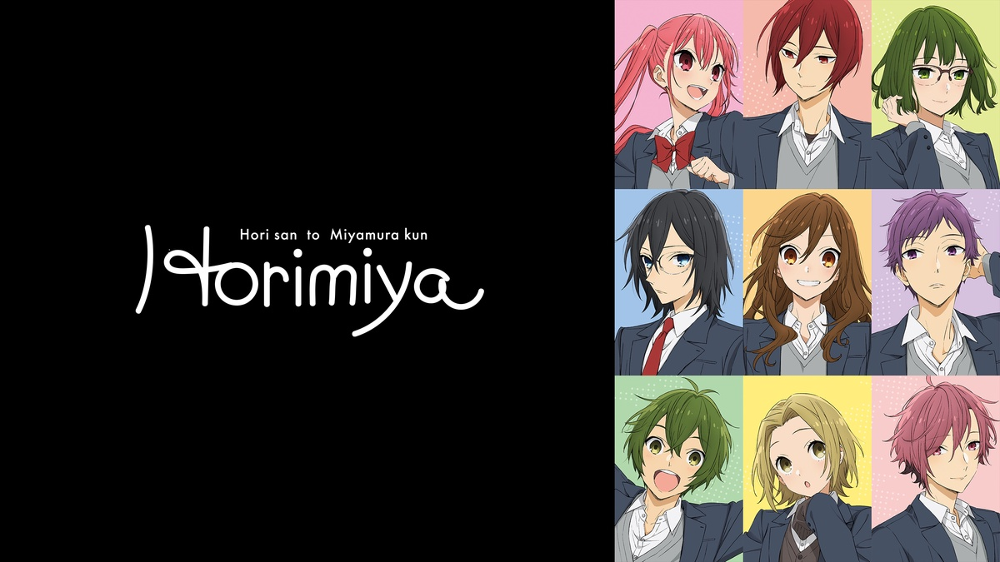

Сегодня закончил смотреть Хоримию - очень теплое и милое аниме.

Хори Кёко - красавица и отличница, а Миямура Изуми - довольно мрачный одиночка, что может их объединять? А то, что они оба совсем не такие, какими кажутся на первый взгляд!

Хори-сан очень семейная, вынуждена смотреть за домом, младшим братиком, пока мама на работе до поздна, а Миямура-кун - крутой красавчик с кучей пирсинга и татуировок, что скрывает ото всех в школе. Правду друг о друге им поведал случай. Маленький брат Кёко потерялся и Изуми привел его домой. 

Поначалу Изуми приходил поиграть с братиком по его просьбе, но в итоге, встреча за встречей главные герои поняли, что они уже не одноклассники и даже не просто друзья и признались друг другу в своих чувствах.

Весь сериал пронизан довольно теплыми и почти отношениями, которых в жизни ты не встретишь. Так же есть и несколько сайд романтических историй между одноклассниками Хори и Миямуры.

Мне это аниме очень понравилось, даже несмотря на то что я читал до этого мангу, по которой оно и было адаптировано.

