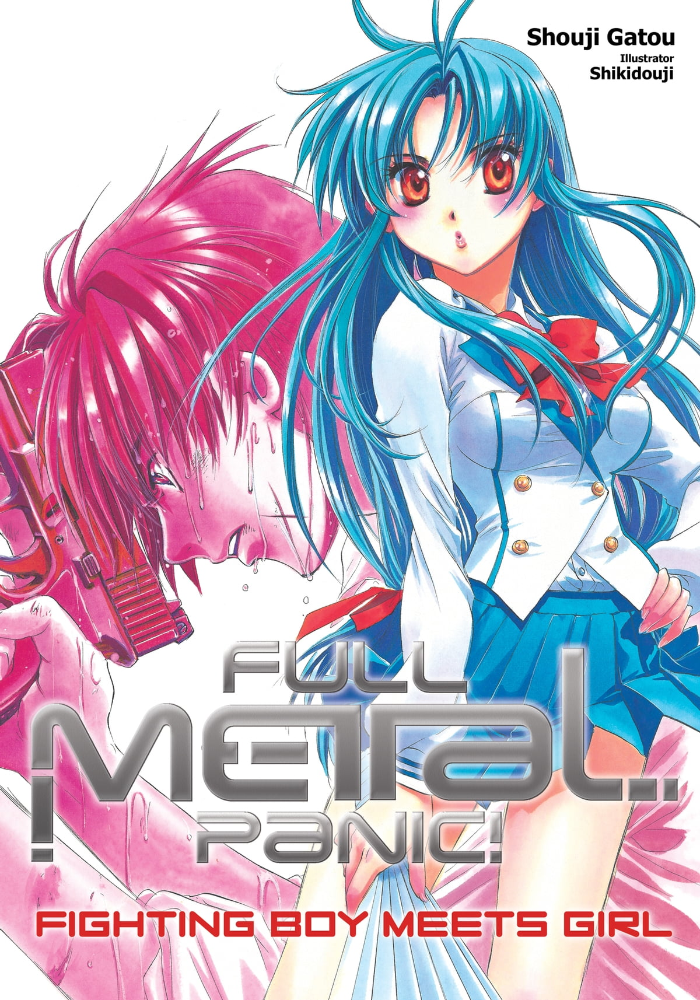
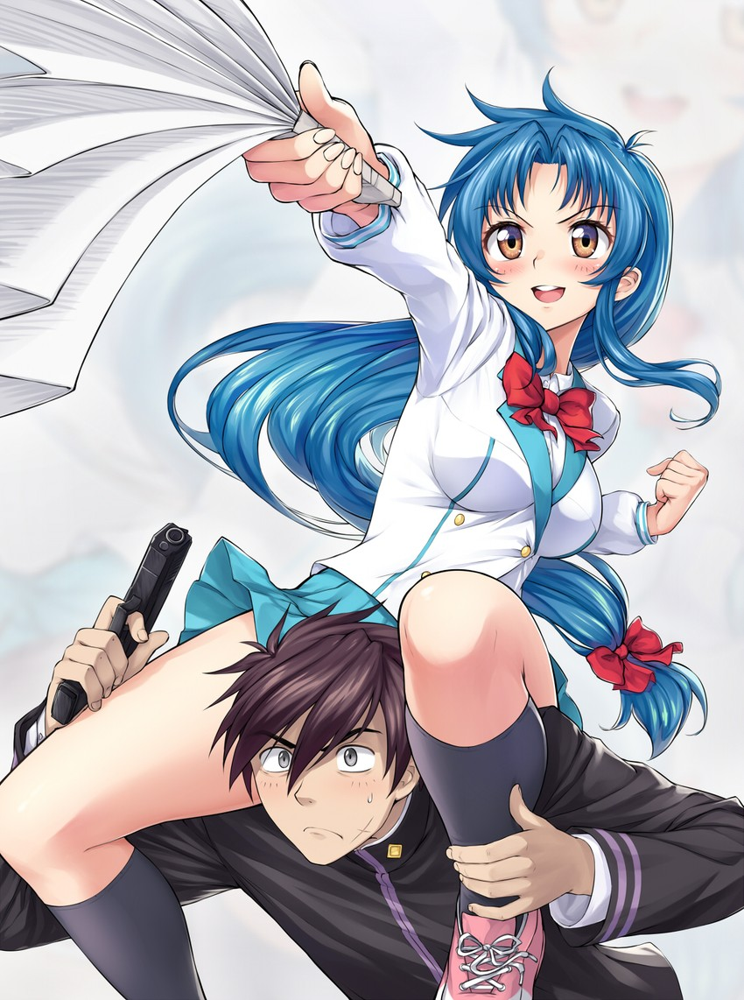
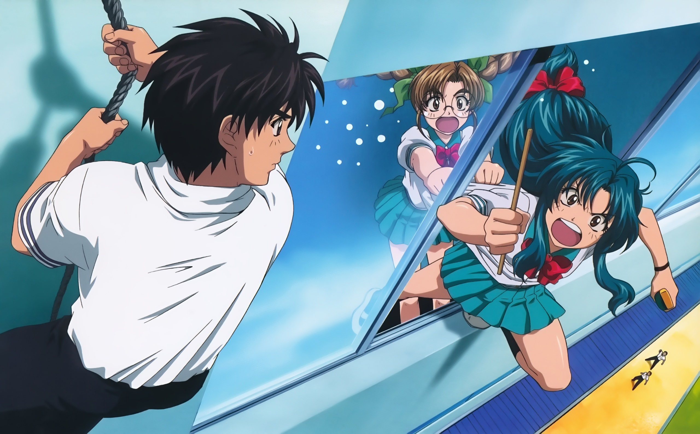
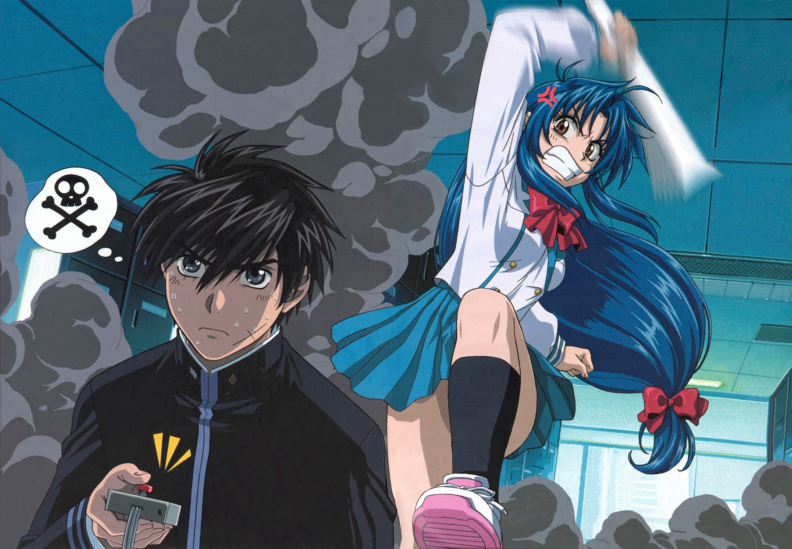

Fullmetal Panic или Стальная тревога - классическое меха аниме начала нулевых. 

Сериал повествует об Сагаре Сосуке - молодом военном, который почти с рождения на фронте. Он специалист своего дела, но совершенно не умеет жить обычной жизнью. Его заданием становится поступление в школу и охрана одной из девушек, обладающей сверхестественными способностями. Чидори Канаме - вторая по экранному времени. "Это студентка, комсомолка, спортсменка. Наконец, она просто красавица!" - это все про неё. 

В аниме присутствуют гигантские роботы, школьницы с подключением в мистическому "интернету" и армия ООН, оснащенная по последнему слову техники, раздающая люлей всем злодеям и шпионам в местных аналогах США и СССР, а также террористическим организациям.

Старая рисовка вообще не портит впечатление, и скорее даже очень в тему, а юмор вполне привычный для аниме. При этом нет современного камаза этти невпопад и фигуры персонажей вполне приятны, а не преувеличены, как это сейчас часто бывает.

Советую смотреть, доступно 4 сезона и зоторых первый на 24 серии и еще три по 12 серий. Сезоны выходили в 2002, 2003, 2005, 2018 годах, так что на последнем сезоне можно будет увидеть что поменялось за эти годы)

|  |  |  |
| --- | --- | --- |
|  |  |  |
