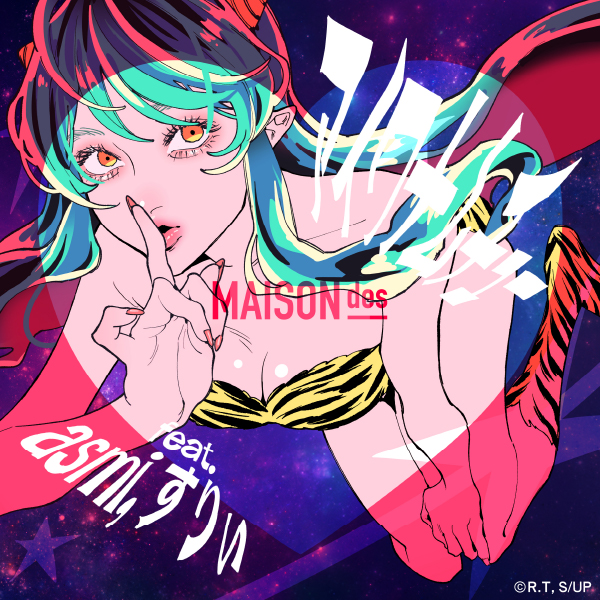

I started watching last year's anime - the remake of Urusei Yatsura, the classic "ecchi" from the 80s, if I may say so. This anime is the ascentor of the great series To Love Ru and the genre itself.

The new anime is quite interesting and engaging, but what amazed me - was the music selection. It perfectly aligns with my tastes. Here are the official creditless and original artists versions of the openings and endings.

|     |     |
|:---:|:---:|
|  [Anime Video](http://youtu.be/pEVhv4eB8Q8) [MAISONdes Video](https://youtu.be/fwzRR6Bsro4) |  [Anime Video](http://youtu.be/stb-BpPpJ7U) [MAISONdes Video](https://youtu.be/AROi9sNCVKs) |
|  [Anime Video](http://youtu.be/gpXy3_NdVEc) [MAISONdes Video](https://youtu.be/NFMmSOWPj_k) |  [Anime Video](http://youtu.be/DBCIuVopaGA) [MAISONdes Video](https://youtu.be/gOagc0RUFlg) |
