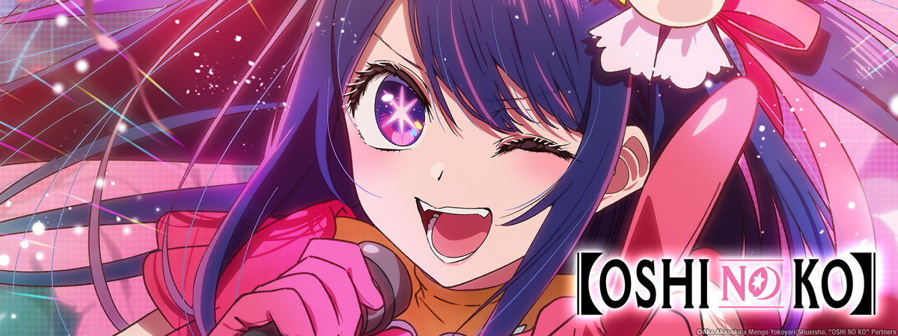
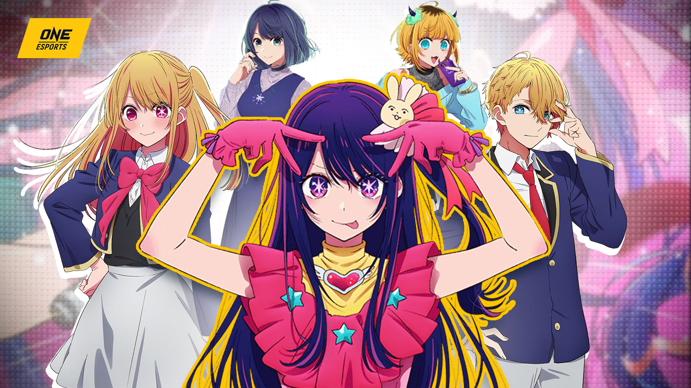
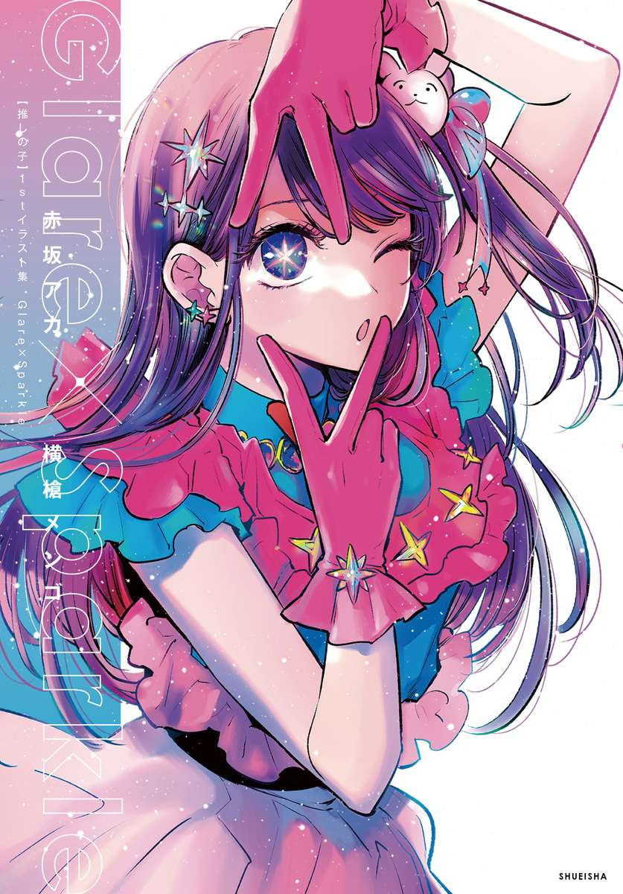
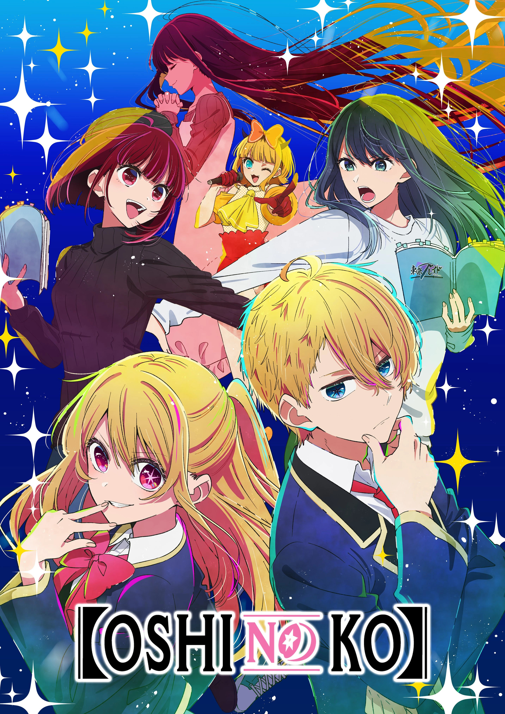

Цей твір оповідає про мінливості життя в сучасному японському шоу-бізнесі. Недбало назвати його просто "аніме" або "тайтл" у мене не підніметься рука. І воно виділяється з сучасного аніме за багатьма факторами.

Перший і найпомітніший із самого початку - структура твору. Перший епізод являє собою півторагодинний фільм - передісторію до наступних десяти епізодів. Його навіть можна подивитися окремо, як повнометражний фільм.

Далі - сюжет. Було чимало аніме про айдолів, з найгучніших - Idolmaster або Love Live, але в Oshi no Ko показано виворіт шоу-бізнесу з кулуарними договорами, підставами і цькуванням, а не ідеали у вакуумі.

Третє - персонажі тут по-справжньому живі і... не типові? До них складно навішати один зі звичних ярликів (цундере, кодере і тд). При цьому кожен з основних персонажів потроху розкривається, даючи зрозуміти мотивації та переживання героїв і героїнь.

Малювання - воно змінюється від сцени до сцени. Іноді, де це не важливо, персонажів малюють звично паршиво, але в найважливіших сценах кадр аж світиться. Особливо цей твір примітний незвичайним малюванням очей, яке якраз проявляється в емоційних сценах сильних переживань.

Опенінг - спочатку, ще до перегляду аніме він мені не подобався, але з кожним епізодом, переймаючись любов'ю до цього твору, він теж став по-своєму близький мені. Виконала його YOASOBI - одна з моїх найулюбленіших японських виконавиць. Відео я скину в коментарях до посту.

Я дуже довго відкладав перегляд, адже мені не подобаються речі, які на хайпі, але це перше аніме за останні роки, від якого я не хотів відвернутися ані на секунду і дивився із захватом. І це буде найочікуваніший другий сезон для мене.

Далі буде прихована частина під спойлером, для тих - хто вже смішарик.

Доля Ай Хошино мене сильно вразила. Спочатку, в першій серії я перейнявся симпатією і співпереживанням до неї, як, думаю, і багато хто. Яскрава, блискуча співачка, яку обожнюють усі. Я зовсім не замислювався над тим, як вона поводилася і багатьма дивацтвами, які стали помітними лише під час розслідування Акви - її сина, і власного розслідування Акане Курокави (партнерки Акви в реаліті-шоу), яка хотіла вжитися в роль.

Бідолашна маленька сирота, яка не знала кохання і жила у брехні, сподіваючись, що ця брехня одного разу стане правдою. Вона і справді вклала всю себе без залишку.

Дехто писав, що Ай не встигла розкритися як персонаж... Але думаю, що просто дивлячись на неї - ми б теж бачили лише яскраву, красиву, але неправдиву обгортку, якраз таки не розуміючи справжніх переживань дівчини.

Так, аніме не позбавлене містики, адже діти Ай - перероджені фанати, які любили її всім серцем до глибини душі, але ж на цій маленькій деталі воно і засноване)

Перший сезон аніме закінчується доволі логічно - першим концертом та успіхом для молодого покоління гурту B-Komachi, проте остання серія обрізається ніби на середині та підвішує все в повітрі, що залишає легкий неприємний післясмак та бажання термінового виходу продовження.

Не знаю що ще написати, але враховуючи, що емоції змусили мене написати вже стільки - показують наскільки воно варте того - переглянути цей твір.

|  |  |  |
| --- | --- | --- |
|  |  |  |