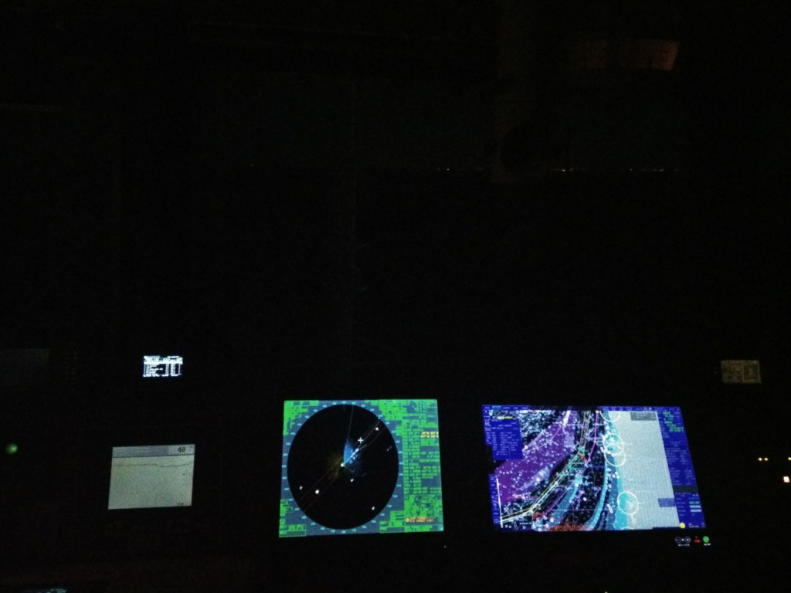
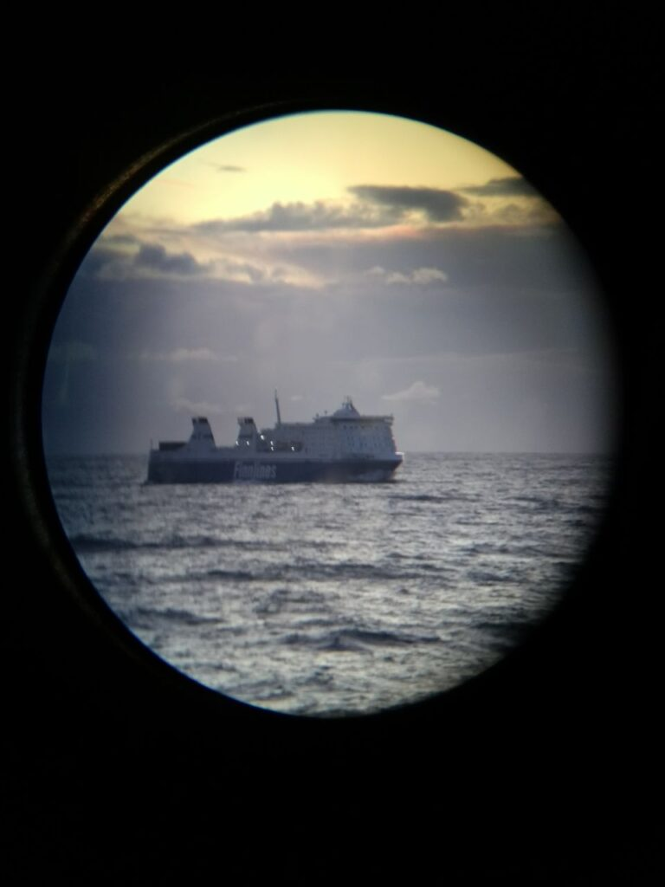
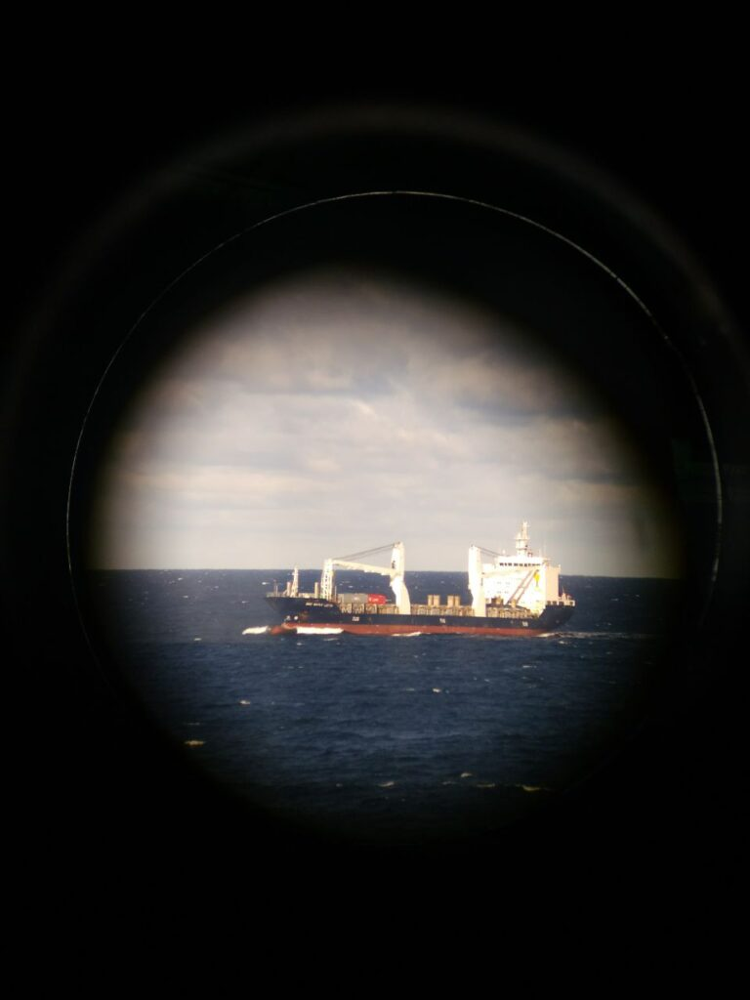
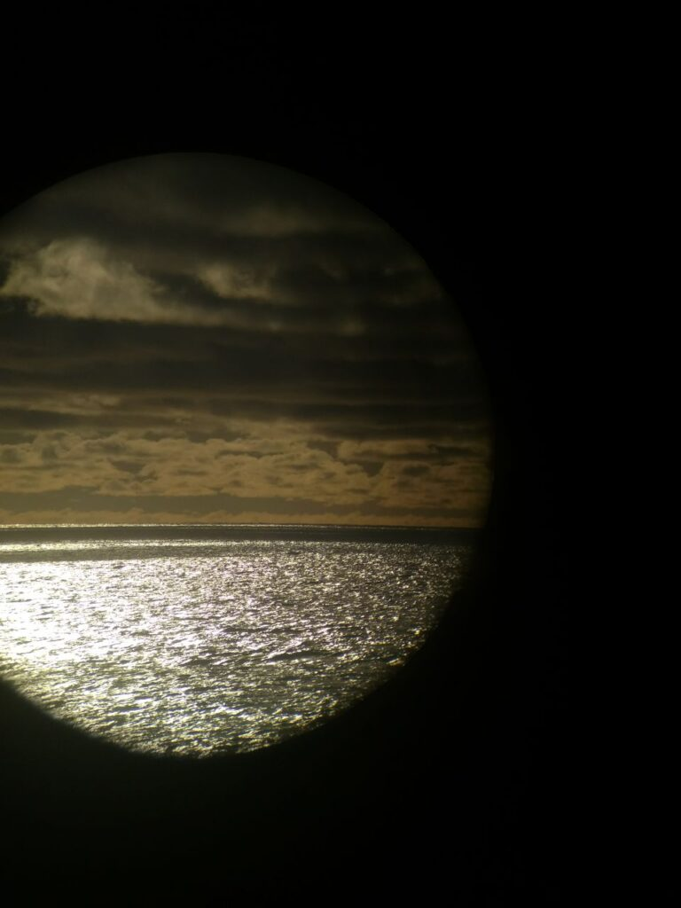
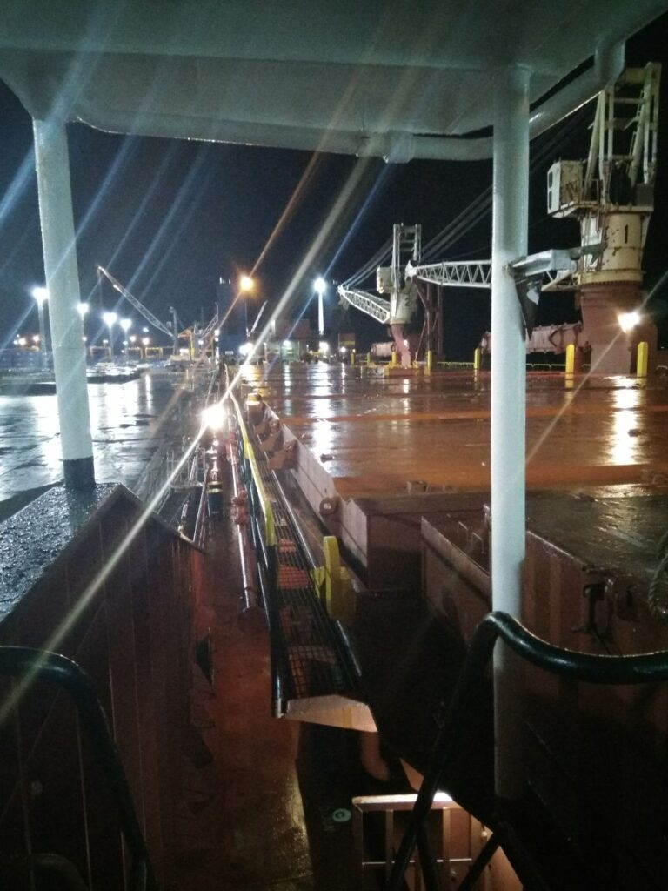
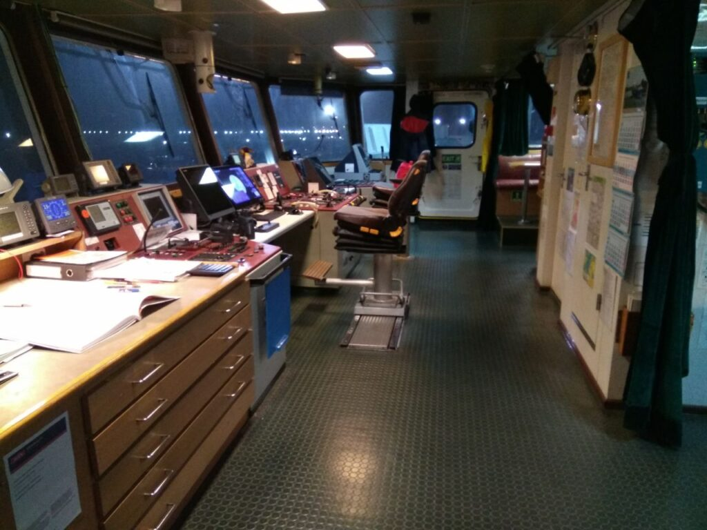
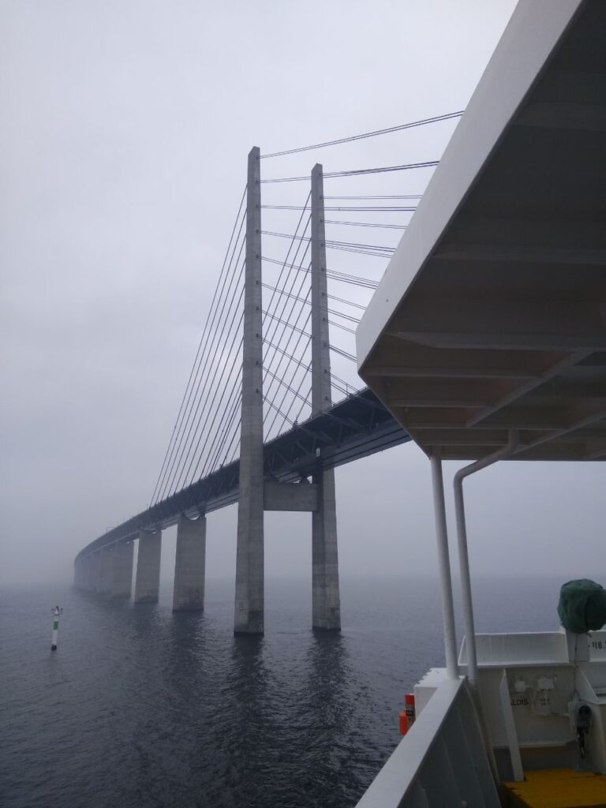
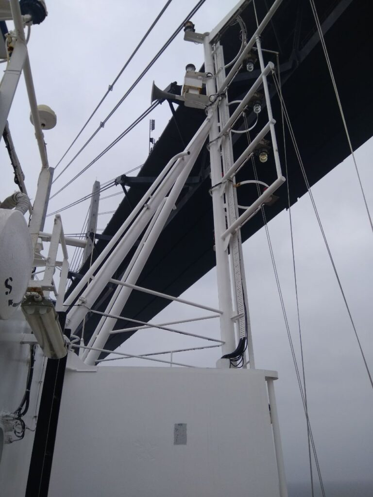

_2017.09.09_ Nyanpasu!
Тут я, по можливості буду писати якісь морські історії з життя, і трішки по форсингу, якщо примушу поводитися щоденник)

_2017.09.10_ Можливо дивно, але після теплої та душевної бесіди з матір'ю я зміг трохи змінити деякі думки щодо майбутнього і думаю, що воно все-таки є)
Навіть є кілька ідей, чим зайняти себе)
Поміняти стару usb 2 флешку на нову usb 3 ня халяву, ось радість))
Чекаю завтрашнього автобуса та від'їзду на роботу, і всі мандраж(

_2017.09.11_ Єєєї, Кацу сьогодні не їде, йому дали ще пару днів побути вдома!
Правда горло болить незрозуміло чому і це трохи прикро(

_2017.09.12_ Останній день перед від'їздом, і знову Кацу змушують їхати на інший кінець міста через пару папірців

_2017.09.13_ Кацу виїхав у далекі краї, залишивши батьківщину за спиною, залишився лічені години, поки у мене є інтернет, настав час прощатися друзі. побути вдома!
UPD: Тоді я автобусом їхав до порту Усть-Луга, недалеко від Санкт-Петербурга для посадки на теплохід Ocean Energy.

_2017.09.20_ Минув тиждень на борту судна, начебто все не так уже й погано, розгрібаюся і намагаюся звикнути. Вперше в житті доводиться нести відповідальність за щось, благо, що мені допомагають.

_2017.09.25_ І ось Кацу знову на зв'язку, привіт Гібралтар, ми вже пройшли велику відстань до Алжиру і завтра заходимо в порт, це не дуже тішить, але це випробування ми перенесемо)

2017.09.29 UPD: Посту немає, але у мене був день народження, і навіть "святкова" вечеря, наскільки це було можливо)

_2017.09.30_ І Кацу знову в Гібралтарі, привіт усім) Алжир пройдено і ми знову рухаємося у бік Усть-Луги. Чесно кажучи, хочеться додому, але сидіти доведеться до лютого, березня, хех...

_2017.10.04_ Хелло, діар френдс, Кацу пише від берегів Англії, ми пройшли Гібралтар, йшли Атлантичним океаном, пройшли Біскайську затоку, і ось ми тут, у Фальмаусі (Falmouth).
Начебто живеться відносно непогано, хоча психологічно важкувато, як складнощів немає, але божевільна втома, навіть на Алісу часу не вистачає, всі думки про роботу (((

|  |  |
| :--------------------------------------------------------------: | :-------------------------------------------------------: |

_2017.10.05_ Солодких снів усім няшкам, Кацу залишає інтернет простір.

2017.10.08 Отже, Кацу підходить до протоки Саунд, скоро буде Усть-Луга і перевірки від начальства компанії, а також новий капітан, що не дуже тішить. Однак я підбадьорився і намагаюся триматися позитивно)

|                                                        |                                                        |                                                        |
| :----------------------------------------------------: | :----------------------------------------------------: | :----------------------------------------------------: |
|                       |  |  |
|  |   |  |

_2017.10.10_ Я так подумав, що записи, які я тут пишу, будуть зберігатися і без інтернету, так що писатиму сюди регулярно.
Завтра приїжджає новий капітан, хвилювання через край, ще й мої повсюдні одвірки та помилки... Хочеться вбитися об стіну від цього, хех.
Жартую, звичайно, але все одно дуже неприємно доставляти всім неприємності.

_2017.10.11_ Вахта закінчилася, але ось прийшов суперінтендант компанії... І через 3 години знову вахта... І матимуть за всі дрібниці, як страшно...

|                                                                      |                                                                        |                                                                          |
| :------------------------------------------------------------------: | :--------------------------------------------------------------------: | :----------------------------------------------------------------------: |
|    |         |  |
|  |  |                                                                          |

_2017.10.10_ UPD: посту немає, але тут під час навчань зі спускання шлюпки я випав за борт)

_2017.10.13_ Імовірно, Кацу покине туманну столицю Росії сьогодні ввечері чи завтра вранці, з одного боку добре, не буде купи "генералів" з постійними перевірками та наказами, але не буде інтернету та зв'язку з вами, мої дорогі друзі, Кацу дуже засмучений цим фактом((

_2017.10.14_
_02:30_ Кацу відшвартувався з Усть-Луги і покинув порт, так що зв'язок найближчим часом пропаде, ця стоянка була не такою важкою, як могла б бути, але все-таки й нелегкою. Настав час прощатися, до зв'язку, друзі)
_08:30_ На диво, незважаючи на те, що я проспав всього 4 години, з цією відшвартовкою я прокинувся досить бадьорий, привіт нове життя)

_2017.10.19_ Отже, ми пройшли 10 бальний шторм у північному морі і тепер ховаємося від ще більшого жаху в Бискай у 12 балів.

|                                                          |                                                                                                                             |                                                        |
| :------------------------------------------------------: | :-------------------------------------------------------------------------------------------------------------------------: | :----------------------------------------------------: |
|  |   [Flintrännan Bridge](https://en.wikipedia.org/wiki/%C3%98resund) |  |

|                                   |                                   |
| :-------------------------------: | :-------------------------------: |
|  |  |

Ось від цього ми ховаємося... 12-15 метрові хвилі O.O

UPD: Ми кілька днів чекали, поки шторм послабиться, щоб продовжити наш шлях і все одно застали вітер до 86 вузлів. На повному ходу вперед судно йшло близько 3-4 вузлів (5-7 км/год.)

Я помітив, що спробувати вмістити весь рейс в одну посаду буде надто самовпевнено, тож я поділю його на періоди по 2 місяці)
