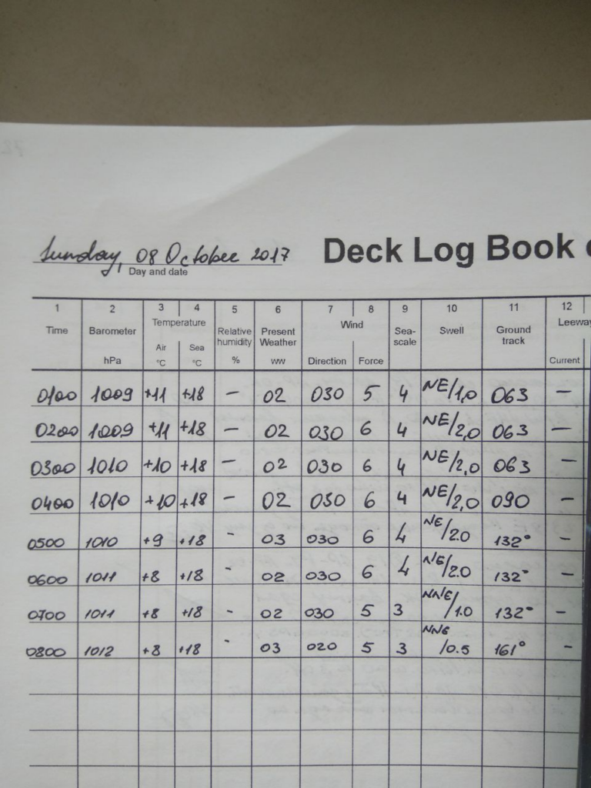
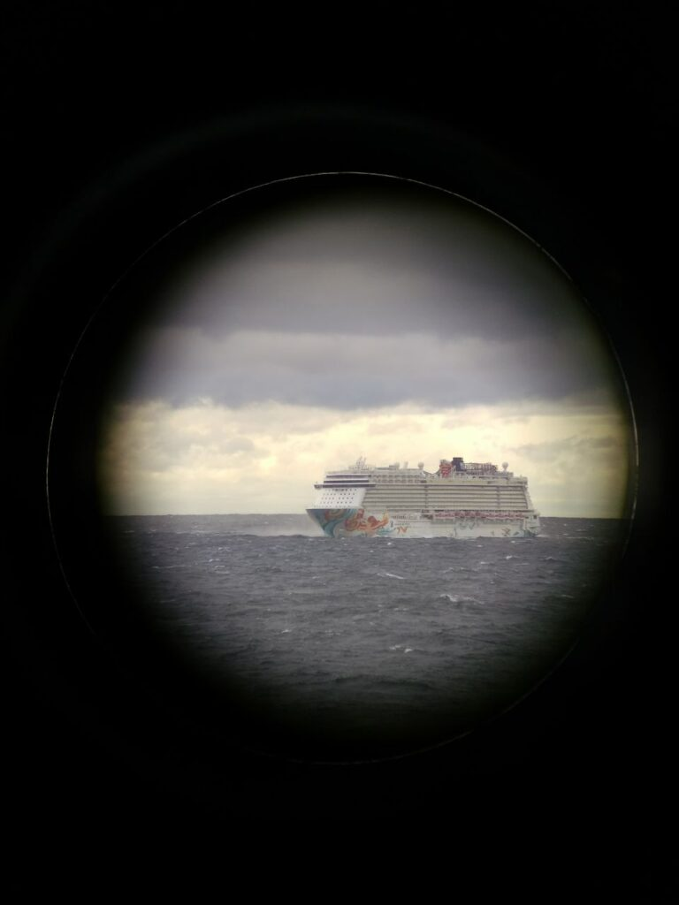
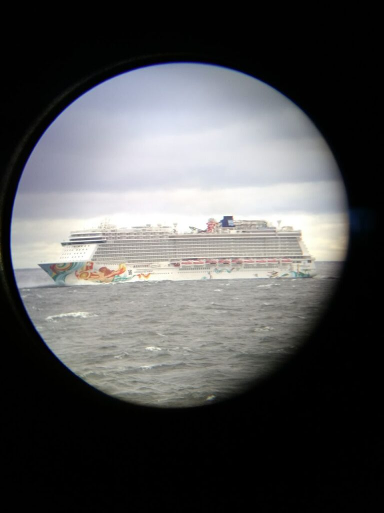
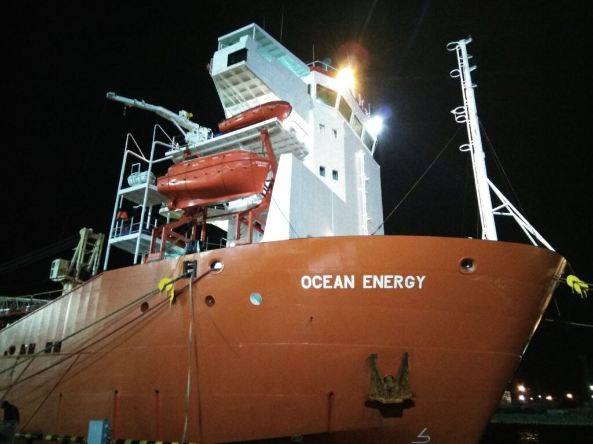
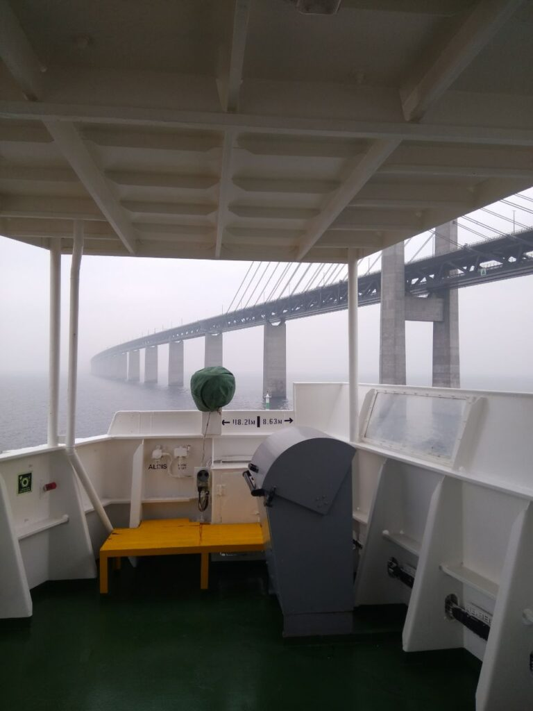
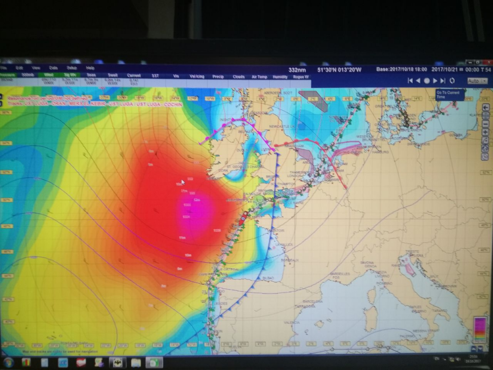
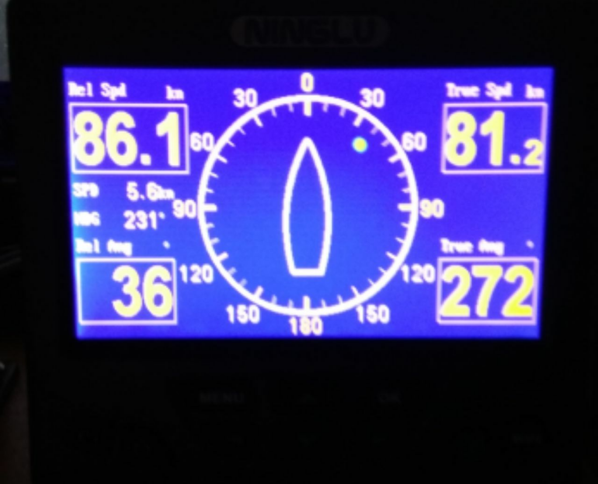

_2017.09.09_ Nyanpasu!
Here I, if possible, will write some sea stories from life, and a little forcing, if I force myself to keep a diary)

_2017.09.10_ Perhaps surprisingly, after a warm and sincere conversation with my mother, I was able to slightly change some thoughts about the future and I think that it still exists)
There are even a couple of ideas for what to do with yourself)
Change the old usb 2 flash drive to a new usb 3 is not a freebie, that's a joy))
I'm waiting for tomorrow's bus and leaving for work, and all jitters (

_2017.09.11_ Yeeeeeee, Katsu is not leaving today, he was given a couple more days to stay at home!
True, the throat hurts for no reason and it's a little insulting (

_2017.09.12_ The last day before departure, and again Katsu is forced to go to the other end of the city because of a couple of pieces of paper

_2017.09.13_ Katsu went to distant lands, leaving his homeland behind, there are only a few hours left, while I have the Internet, it's time to say goodbye friends. stay at home!
UPD: Then I was traveling by bus to the port of Ust-Luga, not far from St. Petersburg, to board the ship Ocean Energy.

_2017.09.20_ A week has passed on board the ship, everything seems to be not so bad, I am raking and trying to get used to it. For the first time in my life I have to bear responsibility for something, good, others help me.

_2017.09.25_ And now Katsu is in touch again, hello Gibraltar, we have already traveled a long distance to Algiers and tomorrow we are entering the port, this is not very happy, but we will endure this test)

2017.09.29 UPD: No post, but I had a birthday, and even a "holiday" dinner, as far as it was possible)

_2017.09.30_ And Katsu is back in Gibraltar, hello everyone) Algeria is passed and we are again moving towards Ust-Luga. Honestly, I want to go home, but I have to stay until February, March, heh...

_2017.10.04_ Hello, dear friends, Katsu writes from the coast of England, we passed Gibraltar, walked along the Atlantic Ocean, passed the Bay of Biscay, and here we are, in Falmouth.
It seems like life is relatively good, although it’s psychologically hard, there seems to be no difficulties, but crazy fatigue, there’s not even enough time for Alice, all thoughts about work (((

|  |  |
|:---:|:---:|

_2017.10.05_ Sweet dreams to all the nyashki, Katsu leaves the Internet space.

2017.10.08 So, Katsu is approaching the Sound Strait, soon there will be Ust-Luga and checks from the company's authorities, as well as a new captain, which is not very encouraging. However, I perked up and try to stay positive)

| | | |
|:---:|:---:|:---:|
| |  ||
|  |  |  |

_2017.10.10_ I thought that the entries that I write here will be saved even without the Internet, so I will write here regularly.
Tomorrow a new captain arrives, excitement over the edge, and also my widespread jambs and mistakes ... I want to kill myself against the wall from this, heh.
I'm kidding, of course, but it's still very unpleasant to cause trouble for everyone.

_2017.10.11_ The shift ended, but then the superintendent of the company came ... And after 3 hours the watch again ... And they will be punished for all the little things, how terrible ...

| | | |
|:---:|:---:|:---:|
|  |  |  |
|  |  | |

_2017.10.10_ UPD: there is no post, but then during the exercises to lower the boat I fell overboard)

_2017.10.13_ Presumably, Katsu will leave the foggy capital of Russia tonight or tomorrow morning, on the one hand it’s good, there won’t be a bunch of “generals” with constant checks and orders, but there will be no Internet and communication with you, my dear friends, Katsu is very sad this fact ((

_2017.10.14_
_02:30_ Katsu moored from Ust-Luga and left the port, so the connection will be lost in the near future, this parking was not as difficult as it could be, but still not easy. It's time to say goodbye, see you, friends)
_08:30_ Surprisingly, despite the fact that I slept only 4 hours, with this mooring I woke up quite cheerful, hello new life)

_2017.10.19_ So, we passed a 10 point storm in the northern sea and now we are hiding from an even greater horror in Biscay at 12 points.

| | | |
|:---:|:---:|:---:|
|  |   [Flintrännan Bridge](https://en.wikipedia.org/wiki/%C3%98resund) |  |

| | |
|:---:|:---:|
|  |  |

This is what we are hiding from ... 12-15 meter waves O.O

UPD: We waited several days for the storm to ease up to continue our journey and still found the wind up to 86 knots. At full speed ahead, the ship was moving about 3-4 knots (5-7 km / h)

I noticed that trying to fit the whole flight into one post would be too arrogant, so I will divide it into periods of 2 months)