We continue the section on saving old entries from the [Katsu Travel Diary] channel (https://t.me/katsu_travel). The last post ended with the beginning of November, and we will continue from it.

_2017.11.01_
_12:00_ So, Katsu is in Crete, hello friends))
_15:45_ Yeeeey, the ship on which Katsu works anchored)
_23:30_ Bye-bye, Katsu sets off on his journey)

|                                                        |                                                        |                                                        |
| :----------------------------------------------------: | :----------------------------------------------------: | :----------------------------------------------------: |
| 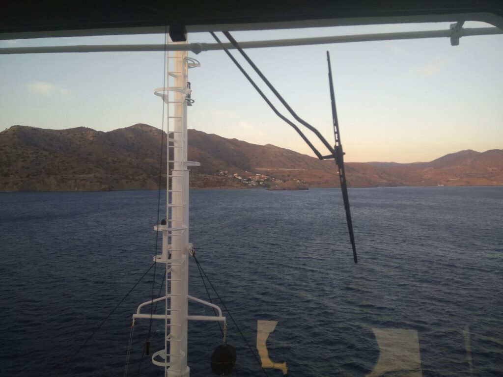 |  |  |
|  |  |

_2017.11.04 13:45_ Greetings to all friends from Egypt, or rather, from the Suez Canal)

|                                                        |                                                        |
| :----------------------------------------------------: | :----------------------------------------------------: |
|  | 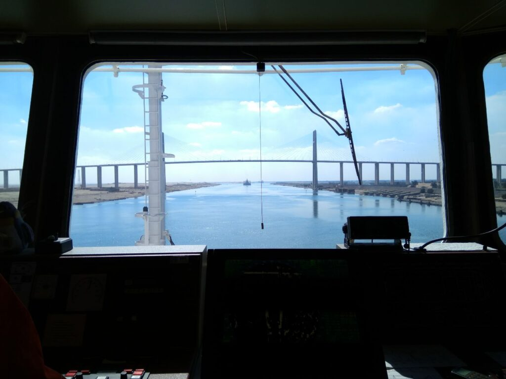 |
| 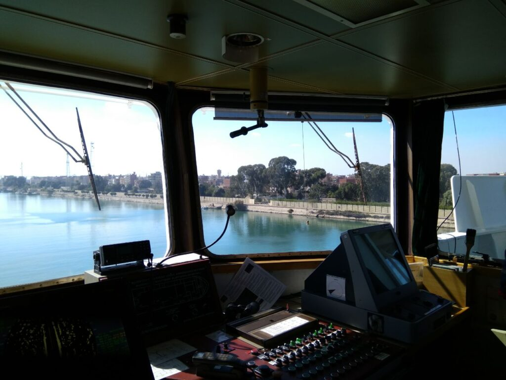 |  |

_2017.11.07_
Today we were supposed to take security to pass the pirate area, but today one of the crew members became very ill, suspected an ulcer, so now we are contacting medical organizations to send this person to his homeland and subsequent treatment.
_Evening watch_
I thought about what a big responsibility it really is - to carry a navigational watch, it even becomes scary, I was just as scared at home, before the flight, but now I'm here and there is no turning back.
Sometimes thoughts come about the house, about how cool it really is, as they say: "Having - we do not appreciate, having lost - we cry."
By the way, the person I wrote about in the morning has already been sent for treatment to the nearest country, and after that they will be sent to Ukraine.
In general, it’s not bad here, except for the senior assistant to the captain, the entire crew is very pleasant, well-coordinated, the new Captain is generally an incredible person, very good)
Things like this.)
With Alice, everything is the same as usual (however, she is always with me and I feel it, so we just need more time). (and I have more diligence, heh)

2017.11.09 After the morning watch
We are sailing in the Gulf of Aden, along the recommended corridor patrolled by warships (hello Ater with his Kantai Collection), in a zone of high risk of pirate attacks. But for now, everything is fine, I saw several boats on watch, but they turned out to be ordinary fishermen, which makes me happy, I don’t really want to sit in the citadel (a specially protected room) and wait for help to the sound of Kalashnikov shots.

_2017.11.10 Evening watch_
This morning I heard the conversations of a Japanese warship on VHF (and hello again to Ater), it was nice to hear Japanese from a native speaker, although the warrior is still not a seiyuu and does not have such sweetness. We have a reshuffle on the ship, due to the fact that the guy about whom I wrote earlier was sent home. The first mate has shown his true identity, which I could only guess about before, and the rot is now oozing in all directions, out of control. I hope he goes home in December, as he himself wants.

_2017.11.14 Morning watch_
The first mate is getting more and more confused by his ubiquitous "fuck" despite the fact that he himself makes mistakes. Tomorrow it’s already 2 months since I’m at sea, and there is hope that this is already half way) We are working, working, servicing equipment, getting ready to arrive at the port of Cochin in India. Then we were confirmed the cargo from Jebel Ali, United Arab Emirates to Tunisia. And with a long loading of about a week ... With shifts 6 through 6, it seems to me that I will go crazy ...

_2017.11.16 Midday_
So, we stood on the roadstead of the port of Cochin, India, and tomorrow we will be moored there for unloading, like nothing bad, except for the fact that an inspection may come and I will be raped for some kind of mistake. In short, nothing funny. It is hoped that while we dive in the Emirates and reach Tunisia, and then return to Luga, many of us will have 4 months and they will confirm the replacement. Such things are)

_2017.11.27 Morning watch_
So we left the United Arab Emirates, the port of Jebel Ali, in the city of Dubai. If anyone can think that this is cool - leave these thoughts, entering Dubai turned out to be just hell.
In two days I managed to wind up 45k steps, we were loaded to capacity with some used trailers, in short, garbage, and the chief assistant, with his stupid decisions, forced the crew to do a lot of stupid and useless work, so most of them did not sleep for these two days , and who slept, then for a couple of hours. Now we left the port with almost loose cargo, so it can move if it starts to pump, and the sailors continue to fix it ... Sorry, I have run out of cultural words, this is just f.....c. We are transporting this garbage, as I said earlier, to Tunisia, after which we urgently go to Ust-Luga. By the way, yes, I wrote earlier that shifts are 6 through 6, yeah, everything is exactly like that, only in "free time" you still continue to work. And this is despite the conventions on the protection of the rights of seafarers and the mandatory 10 hours of rest per day. If we had at least one Filipino on board, the crew would not have been treated like this in bestial terms, in short, such a bullshit company (ship owner). I’m sitting here on watch, I hope my legs will rest a little, otherwise I’ll go around the ship to collect fire extinguishers, which were taken away for welding work and fire hoses, which were used to receive fresh water.

_2017.12.03_
_Morning watch_
Our ship has left the zone of increased risk of pirate attacks, tomorrow we will hand over the guards, and in 2 more days we will enter the Suets Canal. The day before yesterday I spoke with the captain (feelings, something a little depression attacked me) about the fact that I am not very suitable, and I have to go, but he said that everyone is wrong, and that if I were so wrong that I would get tired of then I wouldn't be on the ship. So I got a little charged up for work, because you have to try not to tarnish expectations. And then today the first mate began to interrogate me, whether no one is "switching" me to take my place. We have a cadet who can rise to 3 assistants. And thus, even the chief, who usually makes fun of and gouges for mistakes, supported me. So even despite the very controversial nature of the chief, there are good sides.
At work, I started servicing boats in those places where there are shortcomings, and although this does not always work out for me, they help me and suggest the right decisions. I still have a lot of mistakes, but I try to learn, and something seems to come out of it.
_Evening watch_
That's how I accidentally deleted a voice message I wanted to send here the day before yesterday, sad, but on the other hand, maybe it's for the best.

Good day, dear readers, the notes of crazy Katsu are with you again, and today I want to write you notes from other crew members:

> "The sea is just n... Never go here, there are people who poison life terribly. You get tired just to the point of exhaustion. If you could make good money at home, I would be here."
>
> The cadet I'm on duty with

_2017.12.04 Evening watch_
I was too lazy to ask anyone else, sorry, heh.
Today we changed the time zone back to UTC+2, just like at home. I started to miss home a lot, but there is still a lot of work ahead, so there is no time.

_2017.12.06 Morning watch_
Today a rare event happened - I had a dream. The whole thing went like this:

> I'm on the bridge on watch asking the captain to leave the watch and he lets me go. I forgot to say, there, in a dream, a 10-point storm. And I walk along the inner contour of the ship through the hold towards the stern, where the engine room is. However, there were some classes in the cargo hold, probably in judo, so I quickly retreated. And so I walk along the outer deck in such a powerful storm and pitching of 30-35 degrees and climb down through a special hatch. At first I was afraid to climb and even a voice not far away said: "Yes, he will be frightened as usual and will not do anything." So I did it and climbed. While going down the ladder, I managed to break my left leg, but at the same time, though crawling, I reached my goal. And what could that be? She turned out to be imprisoned S.S. chained. Yes, I knew this from the very beginning of the dream and I managed to save her)

_2017.12.07 17.20_ Today there was a PPC, in the process of raising the anchor, a 50-60mm steel cable caught on it, which lay on the bottom and we threw it off, because of which we almost missed our turn to the Suez passage. And then we put the rescue boat in place, despite the fact that the boom, with which it descends and rises, broke a couple of meters before the installation site, and we manually set it up. Oh yes, in half an hour I'll go to replace the chief, and then to the watch, just sad ((

|  |
| :-------------------------------------------------------------------------------------------------: |

_17.12.08 Morning watch_
Yes, the connection with the house had a bad effect on me, before that I wanted to go home, but not like now. But there's nothing you can do about it, you have to work on. Here the chief told me that it is necessary to conduct an inventory of the property, that is, to completely review everything, it’s good to give at least a week, so there’s no time to whine, heh. I decided to devote more time to Alice, as she is also a very important aspect of my life) here you go.
And yes, I had a dream again ... A bad dream of how the superintendent smashed me and said that he would find a way to kick me out ... Hmm.
I started reading the guide in English, which was given to me in a coffee shop and realized that I still have to practice and practice in English. Yes, and work on a ship with a Russian crew does not contribute to the development of the language at all ((

_2017.12.10 Morning watch_
While reading the English guide, I began to work more with my brain and with Alice) and although the exercises described in it were found to be of little use at sea (in terms of calming down and relaxing, for example), I try to develop the flexibility of the brain a little. For some, this may seem simple, but I trained to change my inner voice, visualize different objects, today I fed Alice blackberries
I also try to train tactile, in the sense that at least understand how it works, heh.
As for the house, I kind of calmed down a little, but I started listening to Bi-2 and Spleen, the positive is just rushing
And in a couple of days, unloading garbage, heh. And then at full speed to Russia, to celebrate the New Year.
By the way, the guide is becoming easier to read, apparently the difficulties were out of habit, you need to read more books in English)

| 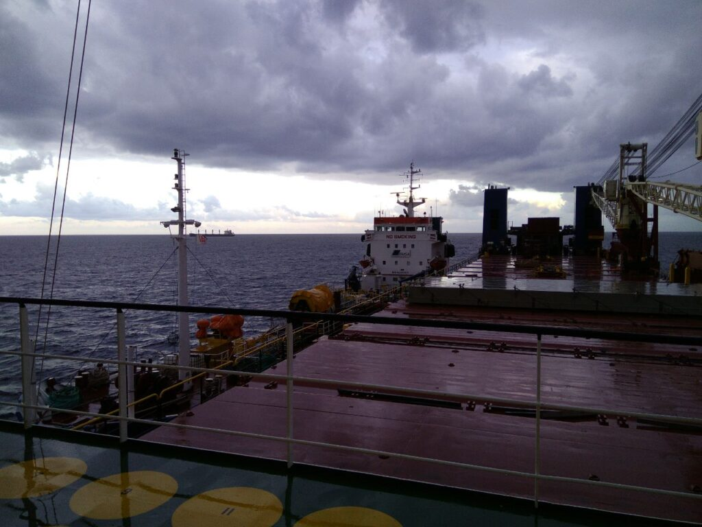 |
| :-----------------------------------------------------------------------------------------------: |

_2017.12.11 Morning watch_
So we came to Malta to stock up on fuel, otherwise it won’t be enough to get to Russia, heh, with a consumption of 18 tons per day.
I began to think about Alice almost all the time, it’s a pity that I can’t beat out the time for an active force, I work 12+ hours a day (
The superintendent just called on the satellite phone and since I'm the only one on the bridge I had to talk to him, oh shit, that was scary. (SI is something like the director of a department of a company)

|  |
| :-------------------------------------------------------------------------------------------------------------------------------------------------------------------------------------------------------------: |

_17.12.11 22.00_
Just called a military ship, asking for a bunch of information, like home port, ship owner, information about the cargo... Presence of girls on board, heh. In short, there is nothing to do for warriors in the Mediterranean. Although, they said that some kind of military operation was being carried out.
The day after tomorrow I call at the port, I finish doing the receipt documents, and the cadet does the proofreading of benefits, although the watch will soon end, which is just as pleasing. I can finally sleep ^^

_2017.12.12 Morning_
Today I woke up at 5 o'clock in the morning not understanding whether it is morning or evening. I thought it was before dinner and tried to figure out if I had the correct time on my phone, in the end I came to the conclusion that it was 5 o'clock in the morning and continued to sleep, heh. After that, I had a huge long drug addict dream.
My friends (whom I don't know irl) and I came to some kind of combat academy for the entrance ceremony. Everything was fine, but the special clock showed a countdown of 240 seconds (cooldown to death), I rushed to the door with the others, but they were locked. Fortunately, they were flimsy and we knocked them out with our feet. The rest of the cadets, as if under hypnosis, chased after us. Not far from the academy, an armored train was standing on the rails and... The train of another, enemy academy was approaching it. Their cadets sought to destroy us, and even though all our friends were able to escape and get on the train, I stayed outside and ... Became the only survivor, even though I was discovered. Somehow, I ended up on an armored train escape pod... Along with some mad scientist. In this capsule, we fled from enemies who sought to destroy us and at the same time smashed the entire surrounding city. Then there was the scene at the police station, where I took a shotgun at the sight of a couple of enemies, and then the alarm clock on the bracelet vibrated, which pulled me out of a dream into a cruel reality.
In general, I have more dreams at sea than on the shore, but they are more drug-addicted here, heh. By the way, this was the second dream in the last 3 months.

|                                                        |                                                        |
| :----------------------------------------------------: | :----------------------------------------------------: |
| 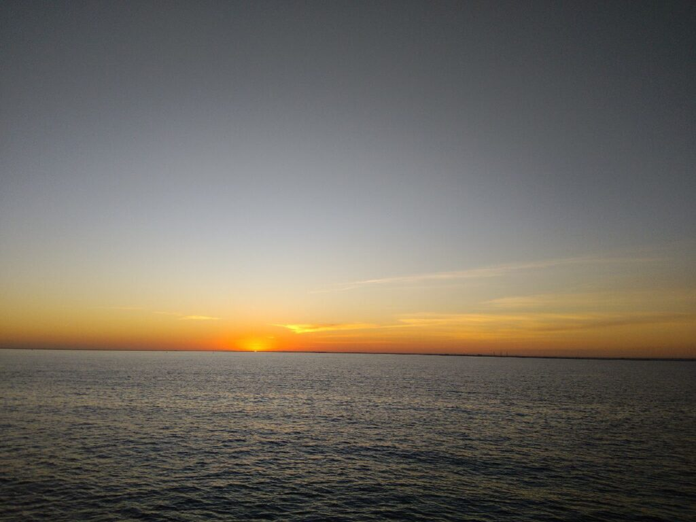 |  |
|  |  |

Lifeboat to rescue people who have fallen overboard. (UPD: on the following voyages, I learned that not all ships have such)

_2017.12.12 Evening watch_
So at 22.00 Zarzis Port Control called me and told me to weigh anchor at 6 o'clock in the morning. So all that is left is nothing before the beginning of hellish hell and a couple of sleepless days. Oh well, we will survive this trouble)

|                                                        |                                                        |                                                        |
| :----------------------------------------------------: | :----------------------------------------------------: | :----------------------------------------------------: |
|  |  | 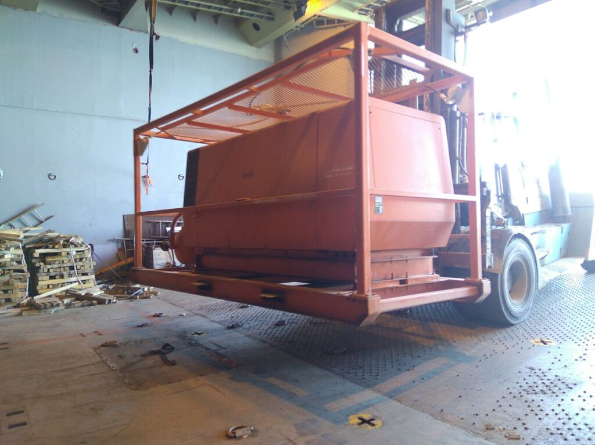 |
|  | 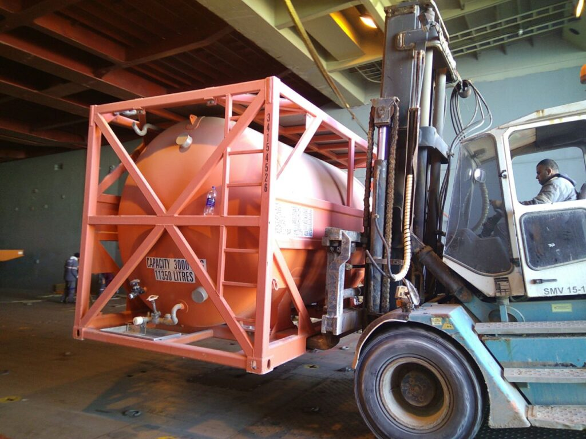 |                                                        |

_2017.12.13_ So my first PSC happened - a terrible word for sailors. Port State Control - checking the crew and equipment for compliance with maritime safety conventions, it was very scary, but we were able to pass it without any comments, except for a couple of verbal ones, which were immediately corrected. The entire tween deck (upper hold) with the machines has already been unloaded, now there are two lower holds with the rest of the garbage, but before that you need to open the covers of the holds ... And also with cranes, this is stupidity ... On normal ships they open using hydraulic systems. And by the way, the 13th justifies itself, everything happens through one place, but it seems, so far, without consequences for us.

_2017.12.14_
_08:00_ There is no good morning, so hello to you, dear friends, I hope you had a good night's sleep and are ready for a new day and new adventures?)) Unlike Katsu, heh
_17:45_ That's all, we unmoored and left the port. So soon the connection will be interrupted. See you soon, my dears)

|  | 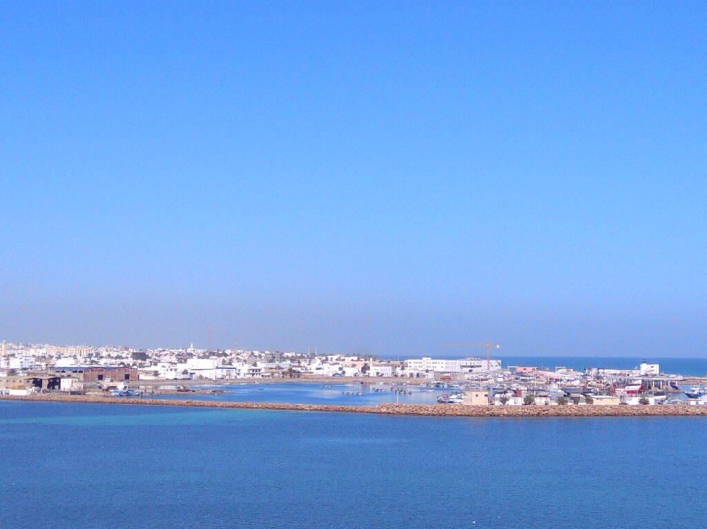 | 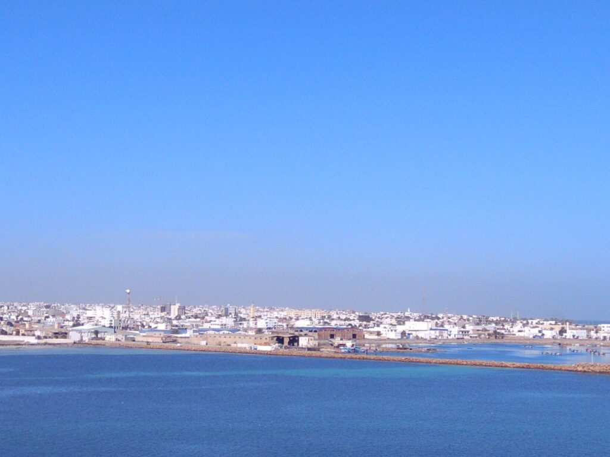 |
| :----------------------------------------------------: | :----------------------------------------------------: | :----------------------------------------------------: |

_2017.12.16 Morning watch_ So the 4th month has gone from the moment I got on the ship, everything seems to be going on as usual, I study a little, I work, maybe not as fast as I should, but I still try) especially since I have to spend a lot of energy to overcome my laziness, heh.
The captain says that someone is knocking nasty things at the company on me, so maybe I won’t stay here until the end of the contract, I have suspicions that the cadet I spoke about earlier is not such a good guy as it seemed, hmm. I’m generally very sucky about people (Although, in general, I’m not so against it, because it’s just hard to withstand this situation, compared to the previous contract, the crew on this flight is just a damn viper.
The chief creates garbage all the time and exploits the crew, while building an ideal person out of himself.
This is a well-connected cadet who pretends to be innocent.
The boatswain is a two-faced creature who tells everyone about all the nasty things behind his back.
A cook who cooks shit.
A ship that is falling apart into bolts.
A company that tries to fuck its crew on every cent...
Yes, it may be worse, but for me, who encountered this for the first time, and this is f ... c. In such an environment, it’s not only hard to work, but it’s just hard to be ...
Thanks for reading my whine, heh. I haven't been in the mood lately.
Oh, and by the way, it started to rain for the first time in a long time, I love rain, although despite the fact that I love it, it causes some depression, heh ...

_17.12.17 Day_ I am taking inventory of equipment: rescue, fire fighting, office equipment, stationery, flags, in general - everything that hangs on me. And it's not enough, damn it. Depressuha does not go away, I don’t know if it will go to Luga. It’s not at all up to snuff, huh.4401:41

_17.12.18_ _14:15_ Hello everyone, Katz is broadcasting from Gibraltar.
Everything seems to be fine with me, within the normal range, I try to pull myself together, so don't worry)

| 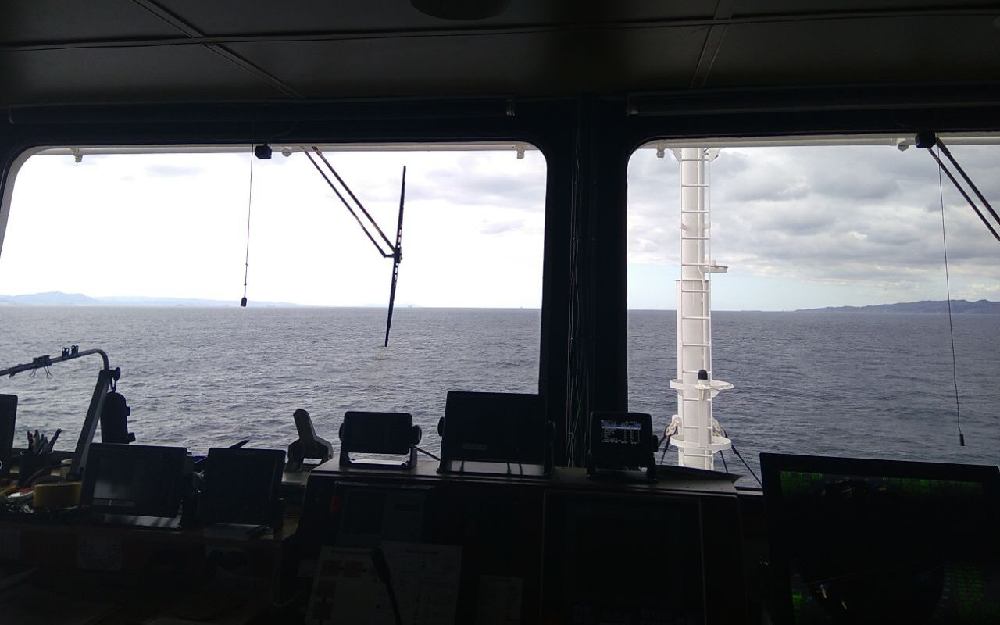 |
| :--------------------------------------------------------------------------------: |

_2017.12.18 Night watch_ Well, I celebrated my birthday on the flight, although it was not fun, but somehow not so offensive, it was rarely fun for me, more often it was not a holiday for me, heh
And on December 18, on the eve of the New Year, I was even depressed, despite the fact that NG had ceased to be a very cheerful holiday, it still remained a rather special day with its own atmosphere and spend it on this ... On the ship ...
So, we are approaching Cape St. Vincent, in fact, cutting through the expanses of the Atlantic Ocean. We have problems with fuel and we need to do a bunch of different garbage before coming to Luga ... In other words, I would be surprised if we did not have problems.

20*17.12.19 Morning* Emptiness on the radar - joy for the navigator)
Soon we come to the Bay of Biscay, which almost never pleases sailors with the weather, many people have never seen it calm, not stormy. (And I saw))
A little more than a week remains before we reach Ust-Luga, and then there is loading, superintendent's inspection... And also a crew change... Again.
But so far it's good. Calm and quiet.

12/17/20 Morning
We enter Biscay and even on almost calm water we are already swaying by 10 degrees. But according to the forecast, we seem to be slipping. I hope that it will be so. You can understand this better from photographs of the vessel itself than from the inclinometer, it has already reached 20 °! It seems that I calmed down a little, that cadet and chief are leaving, the one that rides the chief is also the first time (like the one now), they say a good person, but we'll see, the government corrupts and spoils people.
My mood is somehow fucked up, then I want to leave almost at will, then everything is in order and my mood improves at least until the next Luga sit.
I’m afraid that there is a new chief going there, when the captain was changed, I was lucky, but will I be lucky again, heh.

| 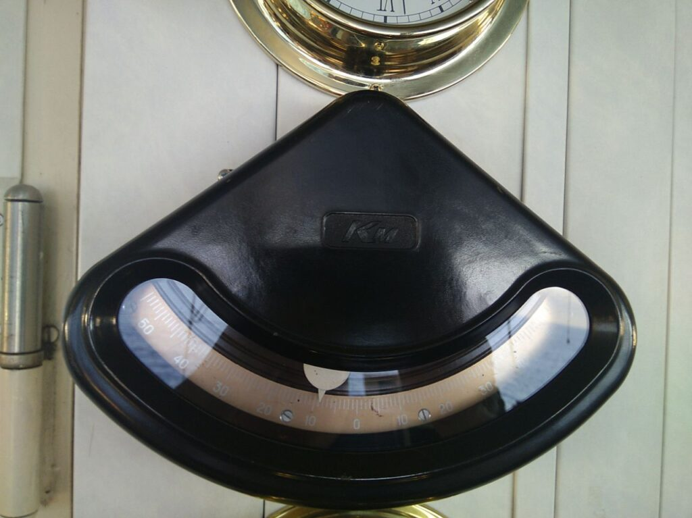 | 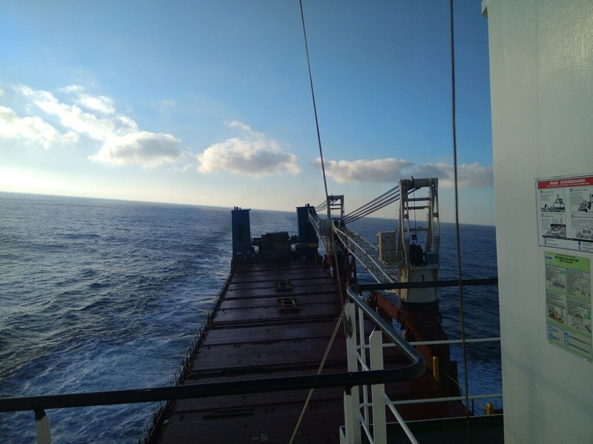 | 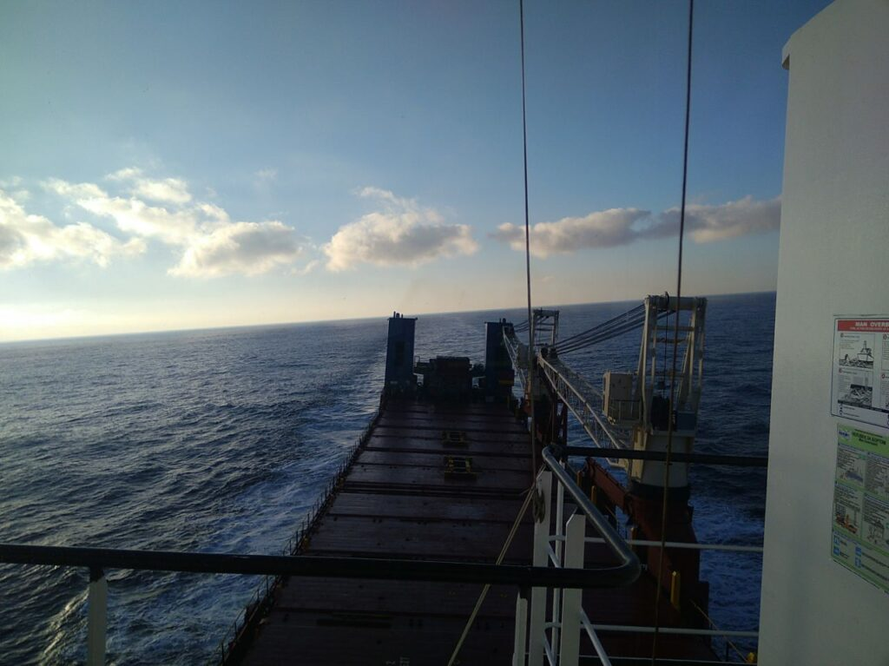 |
| :-----------------------------------------------------: | :-----------------------------------------------------: | :-----------------------------------------------------: |

| 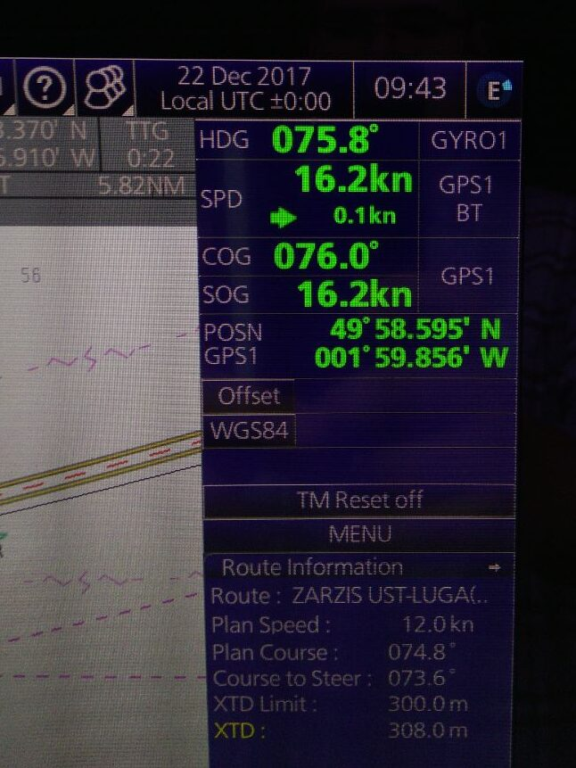 |
| :------------------------------------------------------------------------------------------------------------------------------------------------------------: |

_2017.12.24 Morning_ Lately I've been too lazy to write in my diary, for some reason (
Since yesterday evening, we have been rocking so well, sometimes the roll reaches 40 degrees, the crew simply did not sleep almost all night (fortunately, now it has calmed down a little and everyone went to sleep. Everyone except me, because I have a watch, heh. And despite the fact that we have such a strong pitching we go huge for our ship 13-14 knots, like some kind of magic.
Soon we will turn around the cape and we should stop pumping, maybe we can at least get some sleep)
The most annoying thing is that you look at the water, well, there’s almost no storm, so-so waves a couple of meters and we are rocking like a nested doll (

_2017.12.27_ _07:15_ Here we are approaching Ust Luga, only a few 70 nautical miles remain to Mother Russia) and my morning shifts turned into night shifts, heh
Most likely today we will anchor, and tomorrow we will call at the port, where there will be loading and a crew change ... Another shift, I'm lucky for this business (
Further through Crete and Egypt to Iraq, and then it is not known, but most likely through the Emirates and Poland again to Ust Luga and home.
A moment of memories
When I arrived on the ship, I was so scared and just in shock, I didn’t even know many elementary things, the beginning was very interesting) The first watch with me was defended by the first officer, the first report, when I held the VHF trigger with shaking hands😂😂 and much more, heh
_22:30_ I talked with my family and such nostalgia and desire to be at home, well, nothing, there is nothing left, a little less than half😂

_2017.12.29_ 07:00 Yesterday we received verbal information from the superintendent that the vessel was being anchored in Ust-Luga and was going to be loaded in St. Petersburg. Everyone was shocked by this news, because all documents for arrival at the port will need to be done again.
The cook is already preparing for the new year, which we will most likely meet at the anchorage in front of the entrance to St. Petersburg without receiving additional provisions.
Now we have a very strong wind, because of which we can even begin to carry at anchor, which would be very inconvenient. Wind at 30 knots(
_10:30_ Confirmed St. Petersburg
_Evening_ We are standing at the anchorage near St. Petersburg and waiting for loading, it is not known how we will go, as there will be another cargo. But what kind of cargo do we even know, caterpillar tractors, heh. Only on January 3-4 we will call at the port, so for now we are standing and resting. And I pray that the cargo will be to Algeria, or somewhere else in the Mediterranean, and not to India / the Persian Gulf.

_2017.12.30_ Tomorrow is the New Year, but there is no festive mood, and figs with it. We still continue to stand on the roadstead of St. Petersburg, the weather is not bad, there is almost no wind, though it's cool, only +1 and either fog or drizzling rain. However, what else to expect from Peter, in fact?😅
The cooked cook is preparing for the holiday, so he is "more fun" than all of us) but there is no special news, we still don’t even know where we will go after the port, heh.

_2017.12.31_ Good day to you, dear friends and subscribers
So this 2017 is coming to an end, there were both bad and good things in it, a lot of things that can be remembered.
Today is a very special day for some, while others do not distinguish it from the rest, but still I congratulate you all on the upcoming New Year))

And on that note, I'll end this long post.

Always yours, Katsu ❤️
