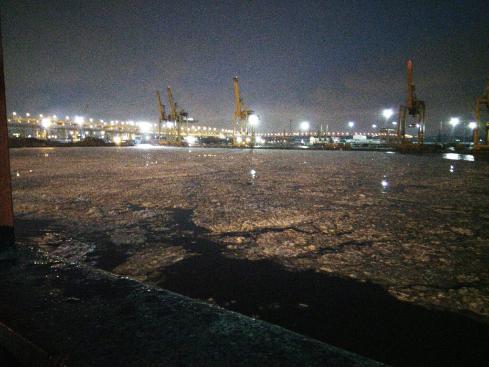
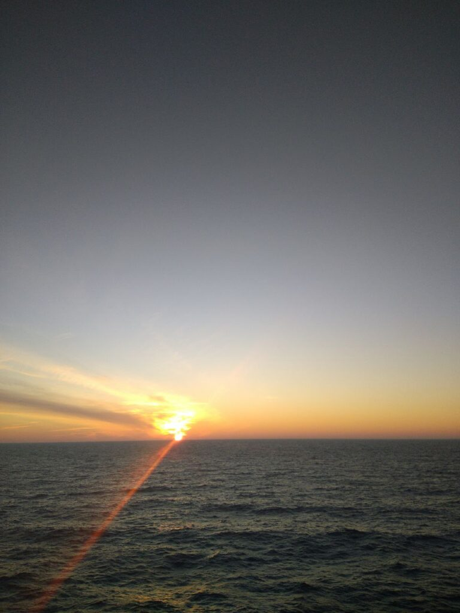
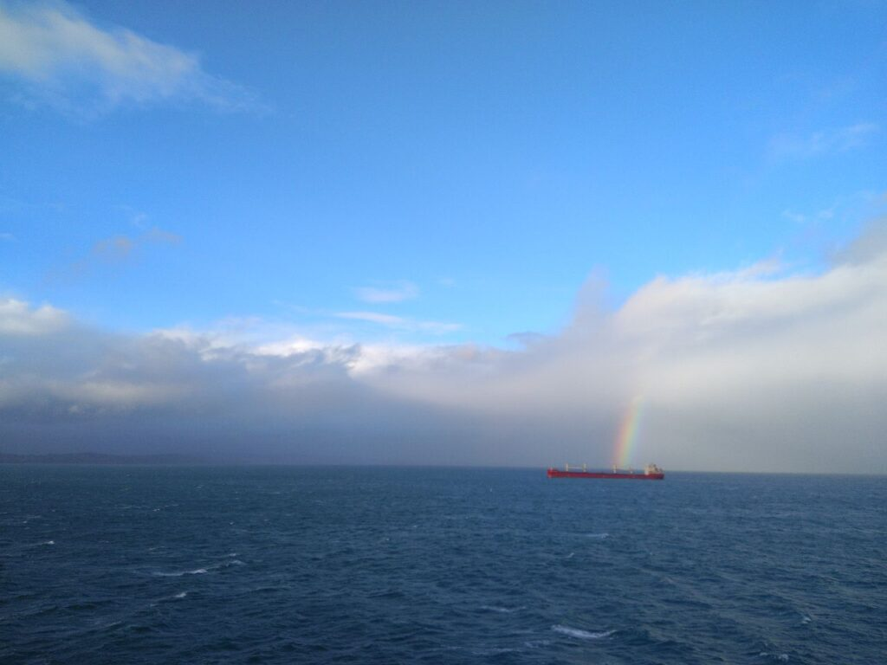
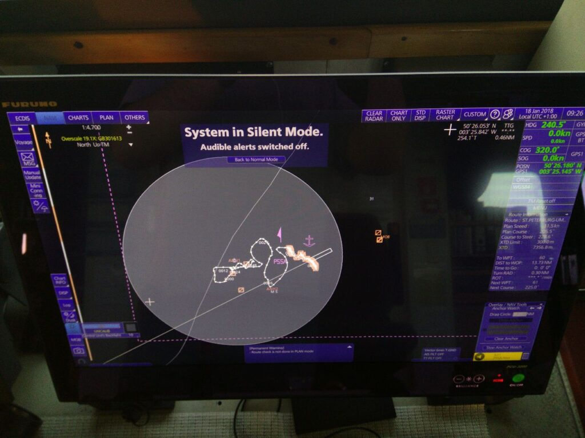

_2018.01.01_ Привіт вам у новому році) у когось зараз болить, голова, хтось спить, а хтось тупає на вахту і тут заходячи на місток я спостерігаю подібну картину:

|  |
| :------------------------------------------------------------------------------------------------------------------------------------------------------------------------------------------------------------------: |

|  |  |  |
| :-----------------------------------------------------: | :-----------------------------------------------------: | :-----------------------------------------------------: |

_2018.01.03 17:45_ Ура!! Нам підтвердили, що вантаж не на Ірак, а на Алжир, так що до кінця лютого я вже повинен бути вдома^^

_2018.01.04 17:45_ Нам надіслали листа, що завтра ми повинні стає до причалу для навантаження, з одного боку я не люблю порти, але з іншого - чим раніше зайдемо, тим раніше вийдемо і поїдемо до Алжиру, а потім додому^^

2018.01.05
_15:15_ Надіслали квитки на членів екіпажу, що виїжджають, вони так сподівалися що полетять літаком, але ні, на них чекає 40-годинна веселість в автобусі Пітер - Одеса.
_18:00_ Ну, звичайно ж, старший помічник вирішив купити собі квиток на літак, не трясти ж свої телеси на автобусі😅
_20:30_ Маршрут начебто знову помінявся, тепер це Пітер – Ірак – Ірак – Єгипет – Туніс – ОАЕ – Польща – Пітер. Це напевно більше 4 місяців... Мда. Прощавай, дах.

_2018.01.06 02:10_ Єдина надія це зміна в Суєцькому за хорошим або поганим.

|  |  |
| :-----------------------------------------------------: | :-------------------------------------------------------------------: |

_2018.01.07 16:00_ Дивно (чи?), але поїхав старий чіф і дихати стало легше, нервовий тик не зник поки що, але для цього треба час 😅
Подивимося, що буде в морі, але поки новий старпом просто красень)

UPD: У порту Санкт-Петербурга, не пам'ятаю точну дату, один із кадетів, який стояв вахту біля трапу (єдина точка, де люди можуть заходити і залишати борт судна, треба записувати в журнал усіх, і доповідати офіцерам, якщо приходять влада, відправники вантажу) або ще хтось). Я ніс вантажну вахту в трюмі і не міг простежити за ним, тож він з кимось ще напився, нахамив і мало не побився з новим старпомом.
Його хотіли списати, але компанії у нього виявився крутий "дах".
Коли я піднімався на місток, у мене серце пішло в п'яти, і навіть капітан здивувався, і пропонував віскі щоб відігрітися. А я боявся, що мене "взують", за те, що не встежив за шалопаєм.

_2018.01.09 00:00_ По passage plan ми повинні прибути до Іраку 10.03 (дивина тільки в тому, що йти туди 1 місяць, з чого такі терміни?) і в мене вже буде 6 міс. Отже, є два варіанти, зміна в Суєцькому до Іраку або після. Судно в процесі навантаження, яке скоро вже закінчиться і ми залишимо Санкт-Петербург.
_17:30_ Все, за годину ми йдемо з порту, нарешті, Ура!

_2018.01.15 19:45_ Ми встали на якір у порту-притулку Torquay у гавані Tor Bay, через жахливий шторм у затоці Біскай. Як сказав DPA, ми можемо тут стояти хоч тиждень, хоч місяць, головне це безпека судна, вантажу та екіпажу.
І незважаючи на це, ми навіть на шляху від Dover Strait в Англійській протоці, до цієї гавані встигли відхопити на 8 балів.
Працювати стало в рази легше психологічно, та й новий чиф набагато досвідченіший і не дає завдань на "дурну" роботу. Моральна обстановка на судні в рази покращала, але пів-екіпажу все одно хочуть додому.
До речі, сьогодні рівно 4 місяці, як ми в морі.
Вчора ми вперше нормально за ці три місяці поїли (3 місяці тому поміняли кухарі). Матрос готував на всіх шаурму, і це було неймовірно смачно. Хоча з тим, що готує наш кухар, я думаю все, що завгодно буде смачним 😅.
Поки на цьому все, доповідь закінчила

|  |  |
| :-----------------------------------------------------: | :-----------------------------------------------------: |
|  |  |

_2018.01.16 19:00_ Через дуже сильний вітер, що досягає 40-50 вузлів нас сьогодні вночі "потягло" так що судно стало на 2 якорі, по вісім 27,5 метрових змичок ланцюга на кожному. Благо зараз вітер максимум 30-35 вузлів, але за прогнозом буде погіршення.
А в іншому все нормально))

|  |  |
| :-----------------------------------------------------: | :-----------------------------------------------------: |

Ось так ми каталися, поки знімалися з двох якорів і знову перезаводили їх.

_2018.01.19_
_19:50_ Через пару годин наше судно зніметься з якоря і піде в затоку Біскай, отримувати лящів. Шторм трохи вщух, але приємного мало, сподіваюся все буде добре. Стоянка в Англії була досить приємною, якщо не брати до уваги перезаводки якорів, так що настав час продовжувати працювати)
_22:30_ Все, ми знялися з якоря, так що прощайте, друзі, до нових зустрічей, до зв'язку)

_2018.01.21_ Другу добу ми йдемо Біскаєм у штормах. Загалом погода не така погана, але це для нормального судна, нашу річкову плоскодонку кидає нехило. Швидкість начебто так нічого, піднялася, але врятуватися від другого шторму ми не встигаємо, тож будемо веселитися аж до Гібралтару. Качка вже в печінках сидить, за півтора дня ні поїсти нормально ні поспати, та це дрібниці і ні таке бувало. Минулого контракту нас два тижні кидало по індійському океані.

_2018.01.22_ Сьогодні вранці ми вийшли з Биська і судно перестало так сильно качати, залишкові 10-15 градусів це взагалі нічого, після того що було.
Стан екіпажу ніякий, все крім новоприбулих чифа і мотора, і матросів хочуть скоріше звалити, але раніше початку квітня все одно сподіватися не варто. Кухар почав готувати ще "краще", мабуть він знайшов болт побільше, ніж той, що він клав на роботу до цього.
А так все нормально, все йде за планом)

_2018.01.24_ Доброго дня) Судно пройшло протоку Гібралтар і прагне у бік Греції, для поповнення паливом, трохи пізніше ми будемо в Суєцькому каналі, потім візьмемо охорону від піратів і будемо слідувати через Червоне море та Аденську затоку в Перську затоку, порт Umm-Qasr, в якому я вже бував один раз, потім там знову поринемо на Єгипет, і через кілька діб ще раз поринемо вже в Саудівській Аравії вантажем на Туніс. Одна надія, що після цього наші "пани" дозволять відпустити своїх вірних рабів.
Ну а в іншому все гаразд, обходжу майно після шторму, виправляю деякі зауваження. Звичайно новий чиф куди краще за старий, але це не змінює того, що у мене все ще не так багато досвіду як хотілося б, але я намагаюся)

_2018.01.25_ З вчора напала така напасть, якась апатія, тупо нічого не хочеться робити, звичайно, я не піддаюся цим поривам, але все це досить сумно.

_2018.01.27_ Зараз ми знаходимося біля Мальти)
Той порт у Єгипті, куди ми повеземо вантаж з Іраку це Суєць, і є ймовірність потрапити додому куди раніше за середину квітня, що не може не радувати))

_2018.01.28_ А зараз сталася цікава подія, коли ми з 3 механіком їли мівіну (після моєї нічної вахти) прийшов капітан і… Заварив собі мівіни мабуть він теж не може їсти те, що готує наш кухар, як і решта екіпажу 😅 😅😅

_2018.01.28 21:00_ Сьогодні майстер влаштував збори екіпажу з питання невдоволення кухарем, але ніхто не висловився офіційно і нічого на нього не писав. Так що хоч кухарі і позбавили бонусу, але він ще легко відбувся.
Через 8 годин ми повинні підходити до Калі Ліменесу, Кріт, Греція, для бункерування судна.
Я став почуватися куди легше в моральному плані, сьогодні взагалі день був напрочуд приємним.
В цілому харчування також погіршилося через жахливі продукти в Росії (У Єгипті ми візьмемо трохи додаткових запасів і має стати легше і смачніше)

_2018.01.29_ _10:20_ Все, ми йдемо, до зв'язку, друзі^^

_2018.02.02 Вечірня вахта_ Вчора ми перевели час на UTC+3, а сьогодні на нашому судні проводився барбекю. (Або Shashlik Drill😂). М'ясо вийшло просто божественно смачним, так само були бутерброди з червоною ікрою, яка мала піти на новий рік, але приїхала пізніше за нього, овочі, салати, картопля з салом, вийшла гарна розрядка екіпажу, приурочено це було до народження дочки у капітана)
Сьогодні ми візьмемо охорону для захисту від піратів у небезпечному районі і слідуватимемо далі.
Агент надіслав нам листа з прибутковими документами і там було написано, що судно швидше за все захоче відвідати PSC (Port State Control), треба ж таку міну підкласти під кінець контракту.
Сподіваюся, що вдасться пройти його як завжди в таких країнах.
Ось такі справи на сьогодні)

_2018.02.05_ Ми йдемо піратським районом, пройшли протоку Баб-ель-Мандеб і слідуємо по Аденській затоці міжнародним рекомендованим транзитним коридором IRTC. Останні кілька днів на мене знову напала туга за домом.
Почав дивитися серіальчик "Зникнення Юкі Нагато" в цілому нічого видатного, крім саундтреків, постійна класика з композицією, що промелькує, Claire de Lune, яка мені дуже подобається. Потроху працюємо, підбираємо косяки, де перебувають.

_2018.02.13_ Пройшли ми пірат-небезпечний район, як завжди, спокійно, пройшли Перський з його численними рибалками, тут навіть напрочуд прохолодно, до +15 вночі. Зараз стоїмо в порту, незважаючи на те, що той тип вантажу, який ми привезли зазвичай розкріплювали від ланцюгів портові робітники, цього разу змусили наш екіпаж(( а коли ми вивантажимося нас чекає навантаження, не відходячи від каси, і знову кріплення). списання в Суєцькому надії тануть з кожним днем, залишається сподіватися, що після нього ми відразу рушимо в Усть-Лугу чи Пітер.

_2018.02.18_ Стоїмо на Фуджейрі, ОАЕ, скоро знову братимемо охорону. Сподіваємось у Суєць одразу, а то нам усі намагаються придумати якийсь довантаження. Все віддалити наше влучення додому. Але я вже на шостому місяці якось заспокоївся, принаймні нема депресії від бажання додому, хех. Можна сказати, просто стало вже пофіг на все, хехех.

_2018.02.18_ Стоїмо на Фуджейрі, ОАЕ, скоро знову братимемо охорону. Сподіваємось у Суєць одразу, а то нам усі намагаються придумати якийсь довантаження. Все віддалити наше влучення додому. Але я вже на шостому місяці якось заспокоївся, принаймні нема депресії від бажання додому, хех. Можна сказати, просто стало вже пофіг на все, хехех.

_2018.02.25_ Ми пройшли небезпечний піратський район і наближаємося до порту вивантаження - Суєц/Адабія. Сьогодні вранці охорона покине борт судна, один із охоронців був з нами всі 4 рази, які ми проходили цей район і став майже своїм) Він, до речі, стояв вахту зі мною, і ми часто розмовляли на різні цікаві теми. Всі вони російськомовні, так що з цим проблем не було) Настрій останнім часом хороший, як у нас кажуть "домашній", останній місяць, сподіваюся, пролетить так само швидко, як і минулі)
Є, звичайно варіанти, що нас довантажать після Суєца, але ми можемо всім богам щоб цього не сталося, хехехех)
У Червоному морі навіть у лютому спека до +30, виживаємо під кондишками та вентиляторами (так-то, заздріть ), а як приїду додому там теж почне тепліти, так що вся зима яку я бачив цього року цей тиждень снігу Пітер на Новий Рік.
Правда цей чиф виявився теж з дивностями, хоч і не такий козел, як той, але таргани теж є, хех. Іноді через це доводиться робити якусь погану, марну роботу, або ж переробляти щось на що вбито кілька днів, тому що він придумав щось інакше, хех. Ну та пофіг, що тут залишилось)

_2018.02.27_ Так, сьогодні день наповнювався поганими і не дуже новинами.
По-перше, боги залишилися глухими до наших молитов і ми матимемо ще один вантаж з Англії до Англії, а це означає - PSC паризького меморандуму, який у нас був у минулому липні і був 3 зауваження. Хто в темі, той розуміє про що я(
По-друге, хтось таки настукав у компанію і кухарі списують по службовій невідповідності прямо зараз у Суеце.
Більше, ніби нічого цікавого.

_2018.02.28_ Виявилося, та й логічно, що кухарі спишуть в "найближчому зручному порту", тобто ніяк не в Суеце. Тим більше, ми сьогодні-завтра вже заходимо. По суті у нього ще є шанс виправитися, сподіваюся він ним скористається і ми почнемо їсти по-людськи.

**Тут і закінчуються пости за січень-лютий, переходимо до наступної та останньої посади за мій перший офіцерський контракт)**
