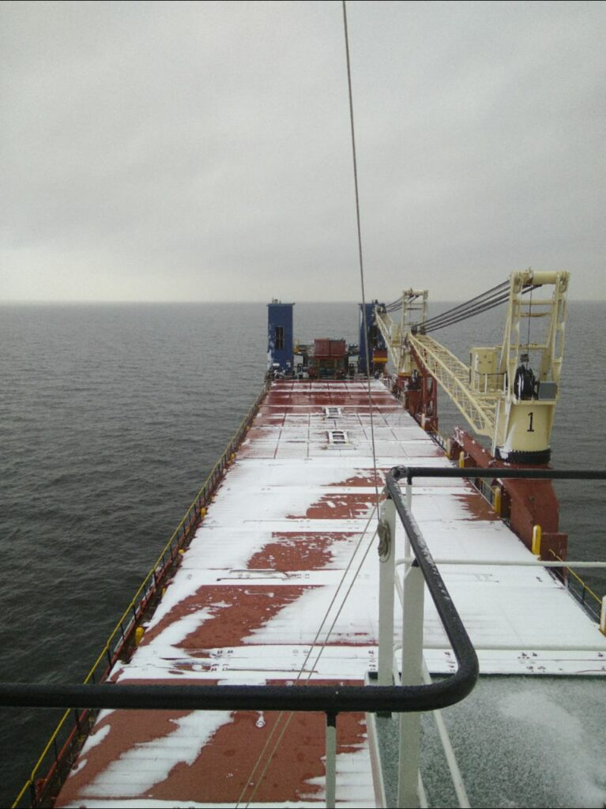
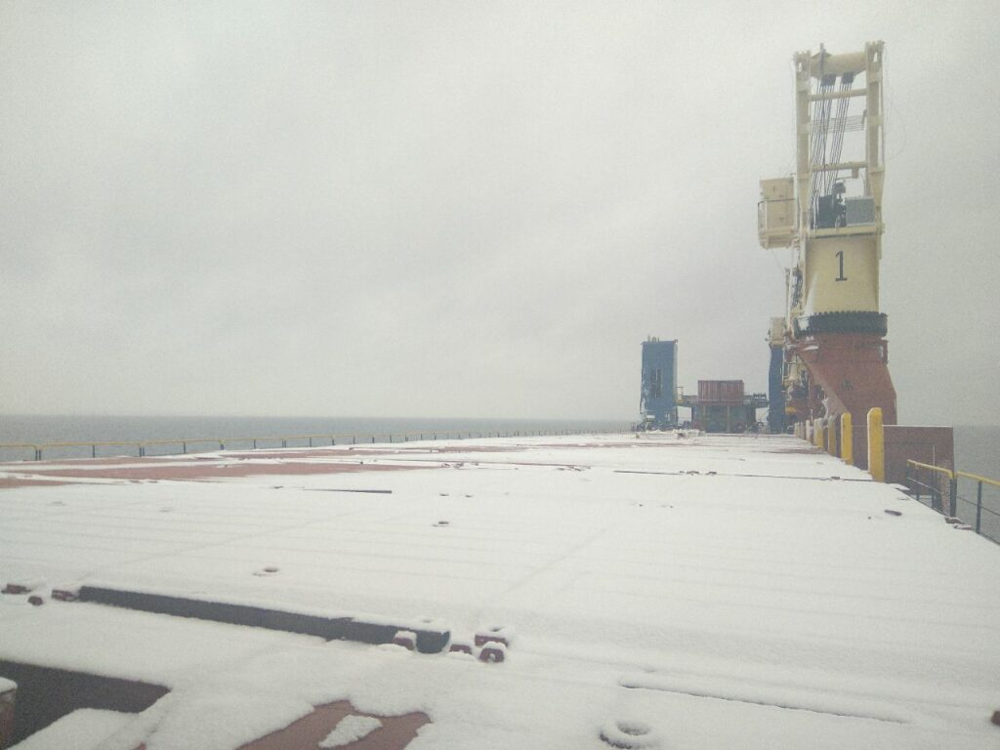
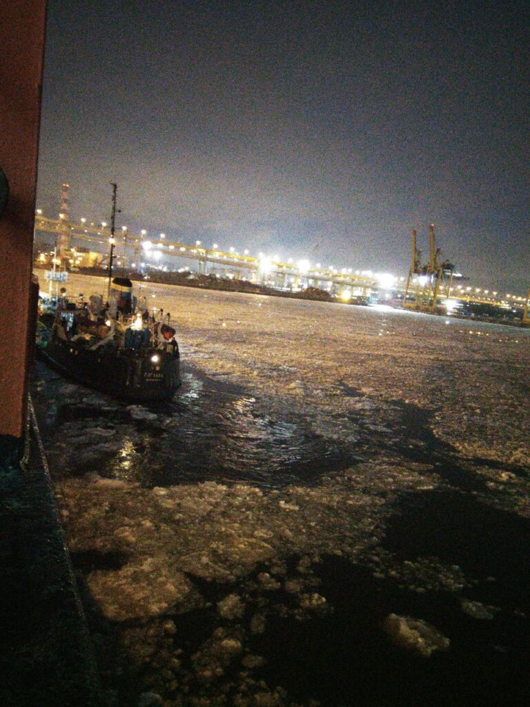
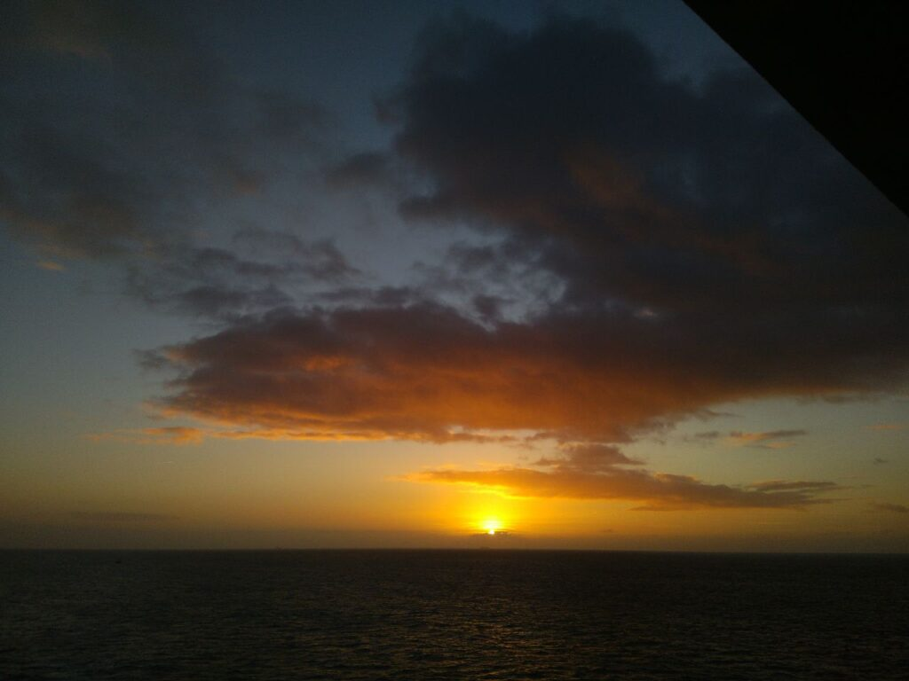

_2018.01.01_ Hello to you in the new year) someone has a headache now, someone is sleeping, and someone is stomping on the watch and then entering the bridge I see a similar picture:

|  |
|:---:|

|  |  |  |
|:---:|:---:|:---:|

_2018.01.03 17:45_ Hooray!! We were confirmed that the cargo was not for Iraq, but for Algeria, so by the end of February I should already be at home ^^

_2018.01.04 17:45_ We were sent a letter that tomorrow we should get to the pier for loading, on the one hand, I don’t like ports, but on the other hand, the sooner we go in, the sooner we leave and go to Algiers, and then home ^^

2018.01.05
_15:15_ They sent tickets for the departing crew members, they hoped so much that they would fly by plane, but no, they are waiting for 40 hours of fun on the bus St. Petersburg - Odessa.
_18:00_ Well, of course, the senior assistant decided to buy himself a plane ticket, don't shake your bodies on the bus😅
_20:30_ The route seems to have changed again, now it's St. Petersburg - Iraq - Iraq - Egypt - Tunisia - UAE - Poland - St. Petersburg. This is probably more than 4 months ... Hmm. Farewell roof.

_2018.01.06 02:10_ The only hope is a change in Suez for good or for bad.

|  |  |
|:---:|:---:|

_2018.01.07 16:00_ Surprisingly (is it?), but the old chief left and it became easier to breathe, the nervous tic has not disappeared yet, but this takes time😅
Let's see what happens at sea, but so far the new first mate is just handsome)

UPD: In the port of St. Petersburg, I don’t remember the exact date, one of the cadets who stood watch at the gangway (the only point where people can enter and leave the ship’s board, you need to write everyone in the log and report to the officers if the authorities come, shippers or anyone else). I was on a cargo watch in the hold and could not follow him, so he got drunk with someone else, got rude and almost got into a fight with the new first mate.
They wanted to write him off, but the company turned out to have a steep "roof".
When I climbed to the bridge, my heart sank into my heels, and even the captain was surprised, and offered whiskey to warm up. And I was afraid that I would be "called out" for not keeping track of the varmint.

_2018.01.09 00:00_ According to the passage plan, we should arrive in Iraq on March 10 (the only strange thing is that it takes 1 month to go there, why such a time?) and I will already have 6 months. So there are two options, a change in Suez before Iraq or after. The ship is in the process of loading, which will soon be over and we will leave St. Petersburg.
_17:30_ That's it, we're leaving the port in an hour, finally, Hooray!

_2018.01.15 19:45_ We anchored in Torquay Port of Refuge in Tor Bay harbor due to a terrible storm in Biscay Bay. As DPA said, we can stand here for at least a week, at least a month, the main thing is the safety of the vessel, cargo and crew.
And despite this, we were even on the way from Dover Strait in the English Channel, to this harbor we managed to grab 8 points.
Work has become much easier psychologically, and the new chief is much more experienced and does not give tasks for "stupid" work. The morale on the ship has improved many times, but half of the crew still want to go home.
By the way, today is exactly 4 months since we are at sea.
Yesterday we ate normally for the first time in these three months (we changed chefs 3 months ago). The sailor cooked shawarma for everyone and it was incredibly tasty. Although with what our chef cooks, I think anything will be delicious😅.
That's all for now, the report is over

|  |  |
|:---:|:---:|
|  |  |

_2018.01.16 19:00_ Due to a very strong wind reaching 40-50 knots, we were "dragged" this night so that the ship stood at 2 anchors, eight 27.5 meter chain bows on each. Fortunately, now the wind is a maximum of 30-35 knots, but according to the forecast it will worsen (
And everything else is fine))

|  |  |
|:---:|:---:|

This is how we rode while we were lifting two anchors and rewinding them.

_2018.01.19_
_19:50_ In a couple of hours our ship will weigh anchor and go to Biscay Bay to get bream. The storm has calmed down a little, but not pleasant, I hope everything will be fine. The anchorage in England was quite pleasant, except for reloading the anchors, so it was time to keep working)
_22:30_ That's it, we weighed anchor, so goodbye, friends, see you again, see you soon)

_2018.01.21_ The second day we are walking along Biscay in storms. In general, the weather is not so bad, but this is for a normal vessel, our river punt throws robustly. The speed seems to be okay, it has risen, but we do not have time to escape from the second storm, so we will have fun until Gibraltar itself. The jock is already sitting in the liver, for a day and a half you can’t eat normally or sleep, well, yes, these are trifles and nothing like that happened. In the last contract, we were thrown across the Indian Ocean for two weeks.

_2018.01.22_ This morning we left Biscay and the ship stopped rocking so much, the remaining 10-15 degrees is nothing at all, after what happened.
The condition of the crew is not good, everyone except the newly arrived chief and motor, and the sailors want to leave as soon as possible, but before the beginning of April, anyway, you should not hope. The cook began to cook even "better", apparently he found a larger bolt than the one that he put to work before.
And so everything is fine, everything is going according to plan)

_2018.01.24_ Good day) The ship passed the Strait of Gibraltar and is heading towards Greece, for replenishment with fuel, a little later we will be in the Suez Canal, then we will take protection from pirates and will follow through the Red Sea and the Gulf of Aden to the Persian Gulf, to Iraq, the port of Umm-Qasr, which I have already visited once, then we will again plunge into Egypt, and in a few days we will again plunge into Saudi Arabia with a cargo to Tunisia. One hope is that after this our "masters" will deign to release their faithful slaves.
Well, everything else is in order, I go around the property after the storm, correcting some comments. Of course, the new chief is much better than the old one, but this does not change the fact that I still do not have as much experience as I would like, but I try)

_2018.01.25_ Since yesterday, such a misfortune has attacked, a certain apathy, I just don’t want to do anything, of course, I don’t give in to these impulses, but all this is rather sad.

_2018.01.27_ Now we are near Malta)
The port in Egypt where we will carry the cargo from Iraq is Suets, and there is a chance to get home much earlier than mid-April, which is good news))

_2018.01.28_ And now an interesting event happened, when we ate mivina with 3 mechanics (after my night watch), the captain came and ... He brewed mivinas for himself😅 apparently he also can’t eat what our chef is preparing, like the rest of the crew😅 😅😅

_2018.01.28 21:00_ Today the master arranged a crew meeting on the issue of dissatisfaction with the cook, but no one spoke officially and did not write anything about him. So even though the chef was deprived of the bonus, he still got off lightly.
In 8 hours we should approach Kali Limenes, Crete, Greece, for the bunkering of the ship.
I began to feel much easier morally, today in general the day was surprisingly pleasant.
In general, the food has also deteriorated due to the terrible products in Russia (In Egypt, we will take some extra supplies and should become lighter and tastier)

_2018.01.29_ _10:20_ That's it, we're leaving, see you soon, friends^^

_2018.02.02 Evening watch_ Yesterday we changed the time to UTC+3, and today we had a barbecue on our ship. (Or Shashlik Drill😂). The meat turned out to be just divinely delicious, there were also sandwiches with red caviar, which was supposed to go for the new year, but arrived later, vegetables, salads, potatoes with bacon, it turned out a good relaxation for the crew, it was timed to coincide with the birth of the captain's daughter)
Today we will take a guard to protect against pirates in a dangerous area and we will follow further.
The agent sent us a letter with receipt documents and it was written there that the ship would most likely want to visit PSC (Port State Control), it’s necessary to put such a mine at the end of the contract.
I hope that it will be possible to pass it as usual in such countries.
Here's what's going on right now.)

_2018.02.05_ We are going through the pirate area, passed the Bab el-Mandeb Strait and follow the Gulf of Aden along the international recommended transit corridor IRTC. The last couple of days I've been feeling homesick again.
Started watching the series "The Disappearance of Yuki Nagato" in general, nothing outstanding, except for the soundtracks, a constant classic with a flashing composition, Claire de Lune, which I really like. Little by little we are working, picking up the shoals where they are.

_2018.02.13_ We passed the pirate-dangerous area, as usual, calmly, we passed the Persian with its numerous fishermen, it is even surprisingly cool here, up to +15 at night. Now we are standing in the port, despite the fact that the type of cargo that we brought was usually unchained by port workers, this time our crew forced it ((and when we unload we are waiting for loading, without leaving the cash desk, and again fastening. On decommissioning in Suetskoye hopes are fading every day, it remains to be hoped that after it we will immediately move to Ust-Luga or St. Petersburg.

_2018.02.18_ We are standing in Fujairah, UAE, soon we will take the guard again. We hope to go to Suets right away, otherwise everyone is trying to come up with some kind of additional load. All to delay our getting home. But already in the sixth month I somehow calmed down, at least there is no depression from the desire to go home, heh. You can say it just became all the same, heheh.

_2018.02.18_ We are standing in Fujairah, UAE, soon we will take the guard again. We hope to go to Suets right away, otherwise everyone is trying to come up with some kind of additional load. All to delay our getting home. But already in the sixth month I somehow calmed down, at least there is no depression from the desire to go home, heh. You can say it just became all the same, heheh.

_2018.02.25_ We have passed a dangerous pirate area and are approaching the port of unloading - Suets/Adabiya. This morning, the guards will leave the ship, one of the guards was with us all 4 times that we passed this area and became almost our own) By the way, he stood watch with me and we often talked on various interesting topics. They are all Russian-speaking, so there were no problems with this) The mood has been good lately, as we say "homely", the last month, I hope, will fly by as quickly as the past ones)
There are, of course, options that we will be loaded after Suez, but we can all the gods so that this does not happen, heheheh)
In the Red Sea, even in February, the heat is up to +30, we survive under air conditioners and fans (so, envy😂😂😂), but when I get home it will also start to get warmer, so the whole winter that I saw this year is a week of snow in Petersburg for the New Year.
True, this chief also turned out to be odd, although not such a goat as that one, but there are also cockroaches, heh. Sometimes because of this, you have to do some kind of bad, useless work, or to remake something that took several days to kill, because he came up with something different, heh. Well, what the hell is left here?

_2018.02.27_ Yes, today the day was full of bad and not so good news.
Firstly, the gods were deaf to our prayers and we will have another shipment from England to England, which means the PSC of the Paris memorandum that we had last July and there were 3 remarks. Who is in the subject, he understands what I mean (
Secondly, someone nevertheless snitched on the company and the cooks are being written off due to official discrepancy right now in Suez.
More like nothing interesting.

_2018.02.28_ It turned out, well, and it is logical that the cooks will be written off in the "nearest convenient port", that is, not in Suez. Moreover, we are already going in today or tomorrow. In fact, he still has a chance to improve, I hope he will use it and we will start to eat like a human being.

**This is where the posts for January-February end, move on to the next and last post for my first officer contract)**