#### Date: 2018.02.28

_2018.03.02_ A new chef will arrive around noon today.
Yesterday was not a good day since midnight, first anchoring at 2 am, then at 6 am was called to the bridge to collect ship's certificates for the agent. Then we weighed anchor and proceeded to another anchorage to... Stay there for 10 minutes and take another pilot! Then a crazy mooring, tugboats behaved like crazy, turned us around in a tiny harbor, the size of 1.5-2 of our ships at crazy speed, the towing lines cracked like crazy. Then a lot of delays with unloading, cargo documents, and now, presumably, they want to remoor us astern to the pier. In short, the Arabs have robbed us all of the brains so that no one on the ship understands anything, although we are only the second day in the port. Now we are waiting for at least some information, whether they will re-moor us or not, when the unloading will continue, we ourselves don’t know anything at all (

|  | 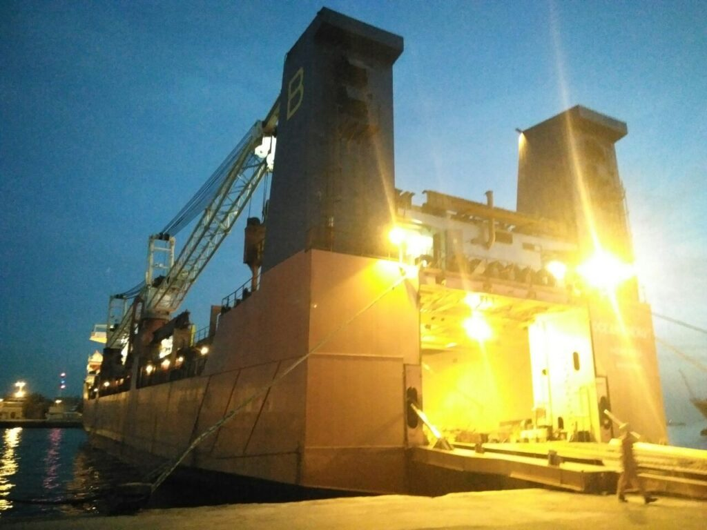 |
| :-----------------------------------------------------: | :-----------------------------------------------------: |

_2018.03.08_ We are anchored outside the territorial waters of Malta and are bunkering. There's a chance we won't go to England because our faucets are very noisy when they work. We pray to all the gods of the world for this to happen. We really hope to go straight to Luga.
While we were walking through the Arab countries, there was unbearable heat, but at the entrance to the Mediterranean we were overtaken by cold weather, although many of those who are reading now have minus and snow, but even +15 after +28-30 is cold for us. Brrr.

_2018.03.09_ So March 8 passed, one of my good friends had a birthday, but I couldn’t even congratulate her (
The case is moving towards 6 months, in less than a week. With the cancellation of England, nothing was decided, so for now we are going there (and because of this crane, already in place, when we arrive, they can cancel the loading and also send an extended check. In short, the scale of the ass we got under the end of the contract only increased.

_2018.03.17_ We caught a storm in the Mediterranean Sea, in front of Gibraltar, we caught a storm in the Bay of Biscay, now we are again in the North Sea, after passing the English Channel.
Directly a black stripe (We were also written that they want to check the covers of the holds for water leakage with a special ultrasonic system. It seems that in England we will be well fucked for all the good ...
Oh well, what's the point of worrying about something you can't do anything about. We are already on the way, tomorrow we will call at the port, either at 06:40 or at 18:40 at full water (maximum tide), depending on how we have time.
It's getting closer to home, but fate puts spokes in the wheels. By the way, the 7th month has gone, which is not so encouraging. However, do not care, break through)

_2018.03.19_ We have been storming near the port of Hull for 2 days already, we are going from side to side, because we can’t even anchor. And so we go to the port, in an hour there will be a pilot. It seems like I knocked out the tails, but it's still scary if there is suddenly a check ((

_2018.03.20 03:15_ We are in the port of Hull. Now we are unloading all the pontoon covers of the holds onto the shore, after which we will pull the ship 30m forward with the help of mooring winches and load giant blades for windmills into the hold. Then again the hauling, back and closing the covers, and then again hauling and loading the blades onto the hold covers.

| 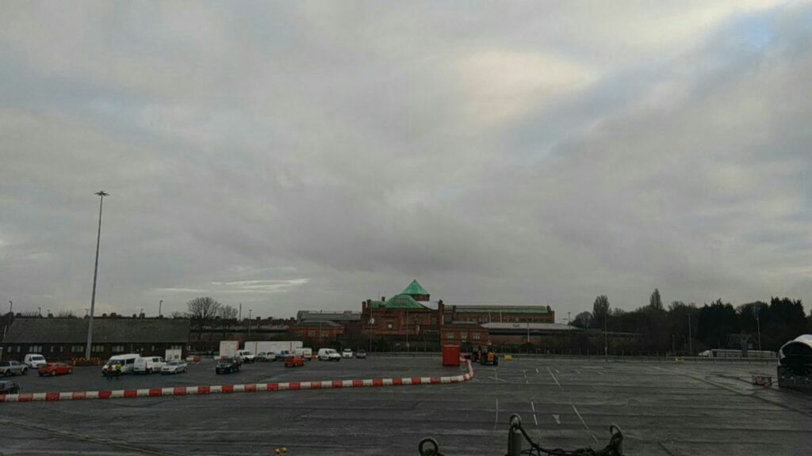 |
| :-------------------------------------------------------------------: |

|  |  |
| :-----------------------------------------------------: | :---------------------------------------------------------------------------------------------------: |
|  |                        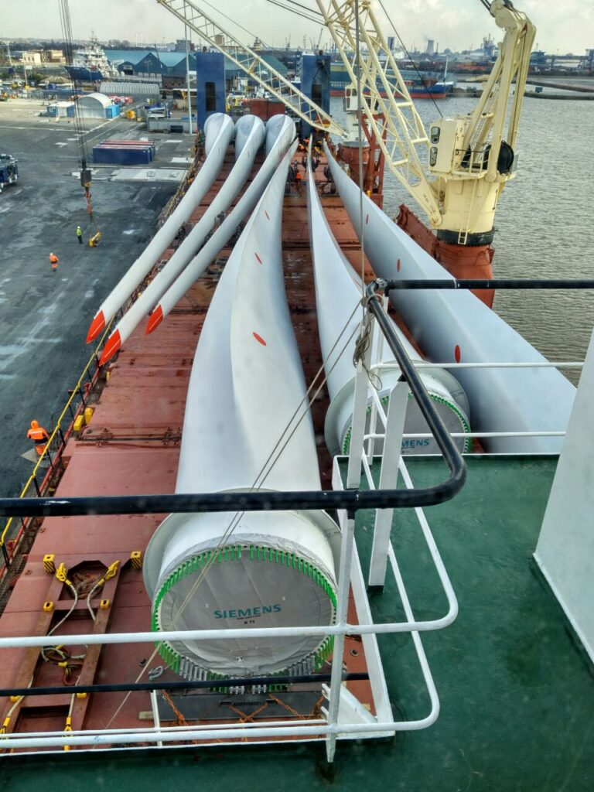                        |

_14:40_ These are the blades for Siemens windmills we load into the hold)
_20:55_ Just now the captain said that we were already late for Ust-Luga, although we had not even loaded or unloaded yet. Mmm, the smell of the approaching trip home warms our souls ^^

_2018.03.21 20:10_ And here I am again on duty, tomorrow morning we leave the port, the loading is over, so enjoy the silence and count the remaining days to go home)

_2018.03.22 09:00_ At 8 am we leave the pier, so soon we will hit the road ... To meet adventure!😂
I hope there will be as few of them as possible😅*11:15* That's it, we left the dock and go along the Humber River, see you, friends)

| 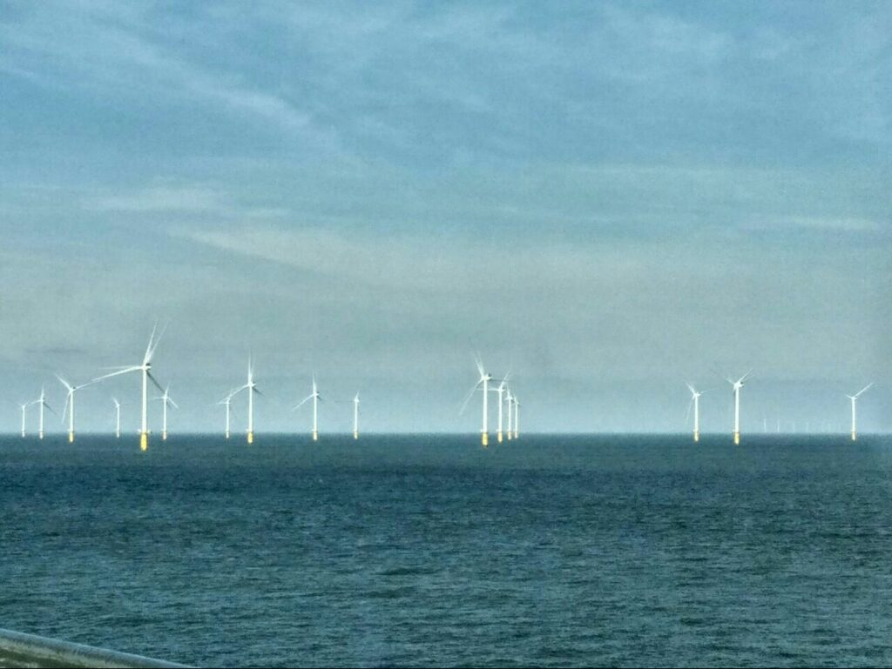 |  |
| :-------------------------------------------------------------------------------------------------: | :--------------------------------------------------------------------------------------------------------------------------------------------------: |

_2018.03.24_ Good morning. We are sailing between the British Minches and will be approaching the port by midnight today. This is the smallest transition for this contract, heh.
I hope we are lucky and we will quickly unload and get out of this Britain, otherwise it’s just nerves.
Since the weather in the north after our departure from Belfast is very bad, it is likely that in the direction of Luga we will move through Dover and the Kiel Canal, which, however, is not very desirable.

_2018.03.25_ So we moored...
How I love mooring at 3 am.
We, assistants, are again on duty at the ladder, because the chief does not have enough people to unfasten the cargo and unload. And overall I like it, less hemorrhoids.

| 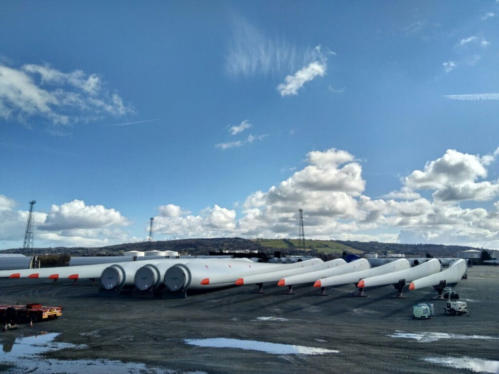 |
| :---------------------------------------------------------------------------------------: |

_2018.03.26_ Here again we changed moorings, for the last time. Close soon and get out of here.

UPD: At the expense of this loading and unloading, I need to stop and tell a little more, because, unfortunately, I did not have time to shoot everything.
At our vessel, the covers of the holds were removed by cranes, so we approached the pier and unloaded all the covers onto the shore with our cranes.
After that, the ship was pulled forward at the mooring ends for about 30m. (This is when the main engine does not start, but simply part of the mooring lines are pulled by hydraulic winches to move)
Further, when 6 blades were loaded into the hold, we again pulled back to close the covers of the holds.
After that, they again pulled forward, and loaded 6 more blades onto the covers of the holds.
Well, unloading, respectively, in the reverse order.

_2018.03.26_ Yeeey! We left Belfast! Onward to the meadow! We are coming home!!!

|  |
| :----------------------------------------------------------------------------------------------------------------------------------------: |

_2018.03.29_ Hello, we are in Germany, getting ready to pass the Kiel Canal)

_2018.03.30 09:00_ We entered the airlock in the dark, so sorry for no photos. And now we are leaving it, it all flew by quite quickly.
In the Kiel Canal, the pilot boards with his 2 helmsmen, and in the lock the mooring is according to the 1 + 1 scheme, in short - the lafa.

|  |  | 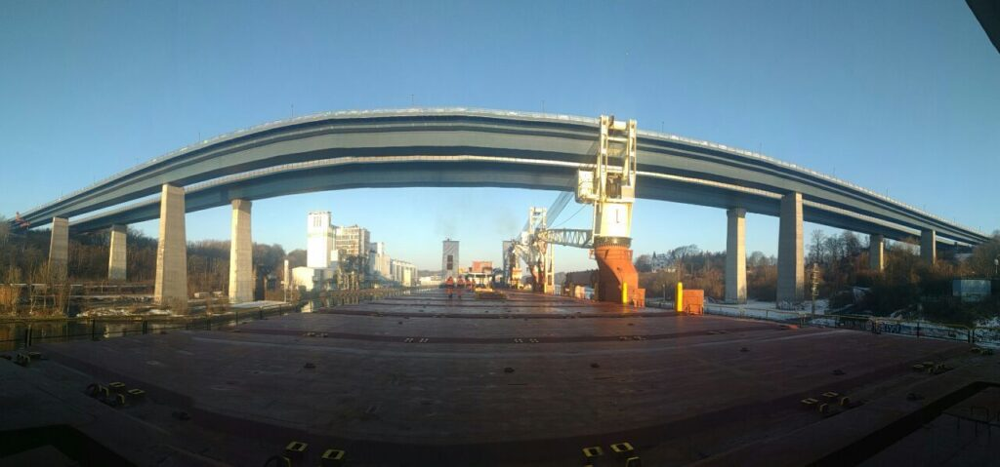 |
| :-----------------------------------------------------: | :-----------------------------------------------------: | :-----------------------------------------------------: |
| 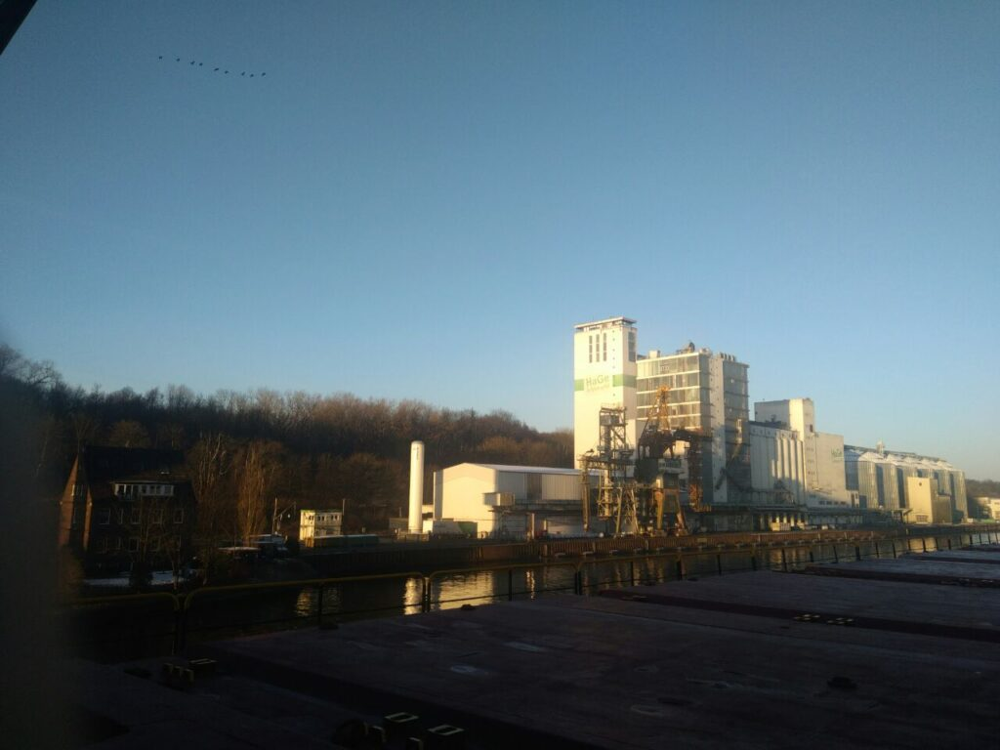 |  | 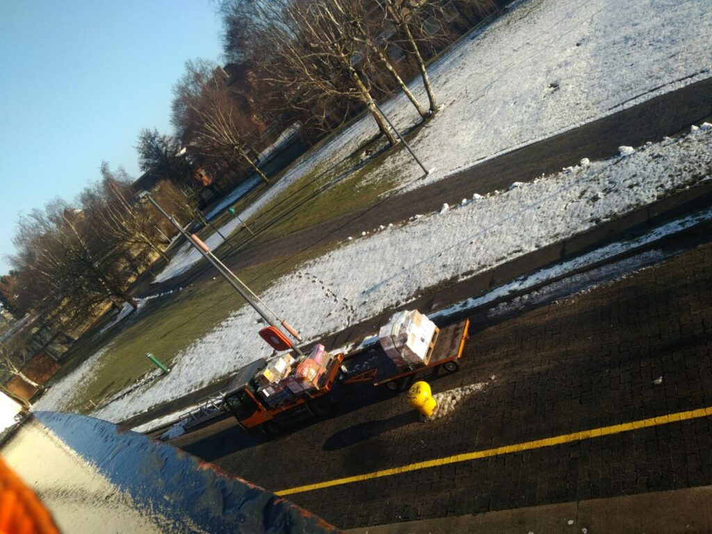 |
|  | 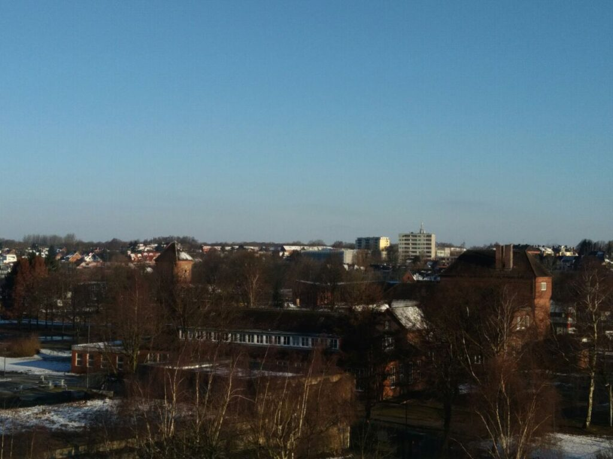 | 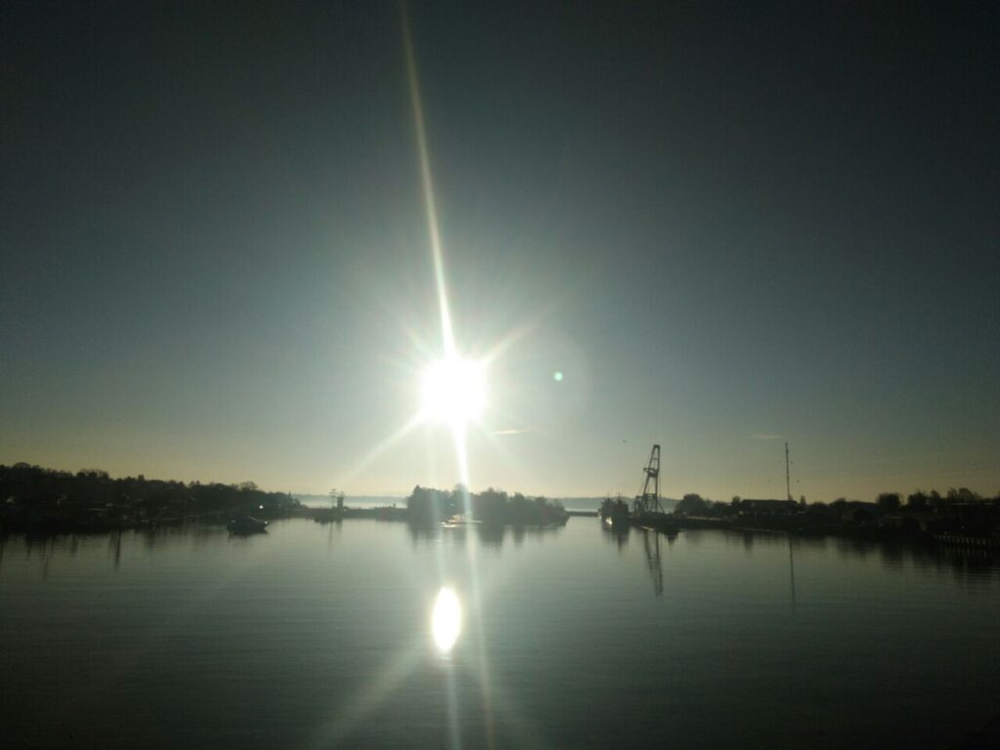 |
| 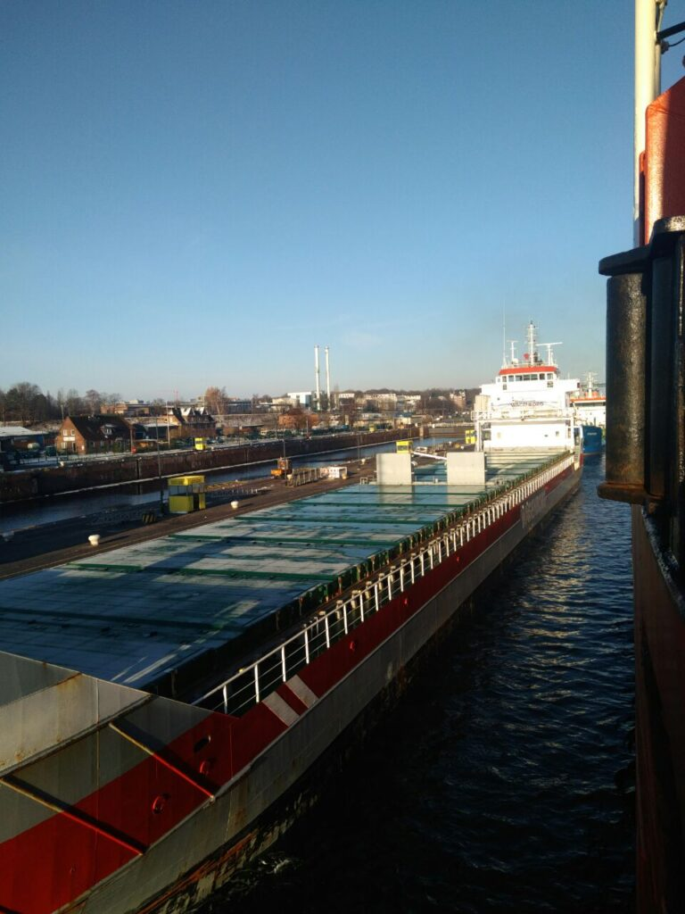 |                                                         |                                                         |

_2018.03.30 13:00_ We left the Kiel Canal, three days left, and on April 2 our ship will enter St. Petersburg and we will go home! WOOOOOOOOOOOOOOOOOOOOOOOL!…
If only it wasn't for the Port State Control of the Paris MoU and the Liberian Flag State😭😭😭

_2018.04.01_ After passing Kiel, we follow towards St. Petersburg. Today, the crew members replacing us should leave by bus. And 03.04 in the morning they should arrive. I can't believe I'll be home so soon. Now I am preparing for the shift and for the test, I hope everything will pass more or less.

_2018.04.02 12:30_ And here we are on the way to St. Petersburg. Are we going to be home soon? I don't believe it at all.

| 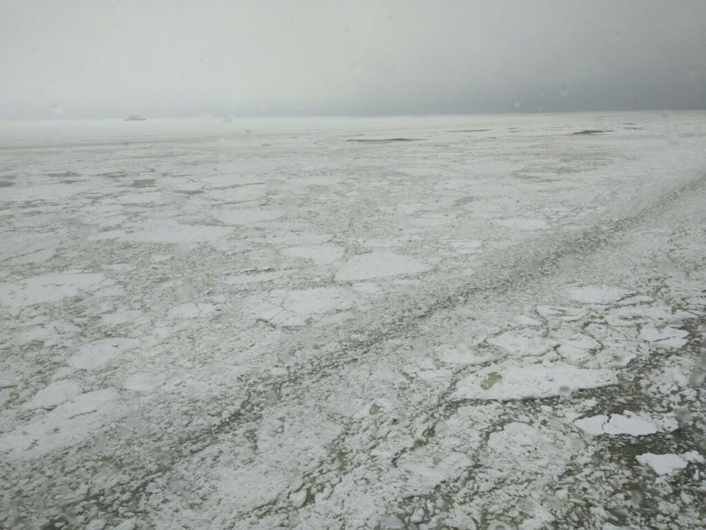 |  |  |
| :-----------------------------------------------------: | :-----------------------------------------------------: | :-----------------------------------------------------: |
|  | 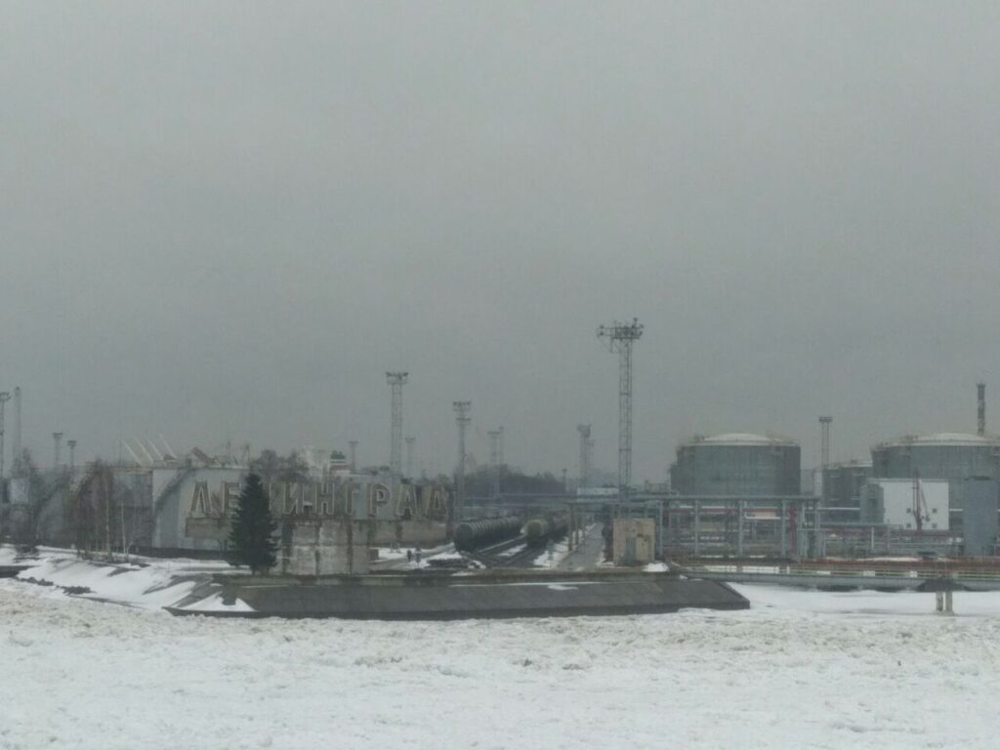 |                                                         |

_2018.04.02 17:00_ So, our ship is moored in the port of St. Petersburg. The mooring was long, in difficult ice conditions, but we managed it. Now almost everyone on board is in a suitcase mood. We look forward to starting our journey back home as soon as possible.

|  |
| :---------------------------------------------------------------------------------------: |

_2018.04.03_ Cheerful morning, kind people)
Yesterday I learned the most pleasant news that PSC will not come to us because of the state of the engine room, where everything is now being dismantled and repaired by repairmen. Am I happy? More than!

_2018.04.04_
_02:10_ PSC passed us by, I signed the act of acceptance and transfer together with the 3rd, the captains also changed. So we are already free. At 07:30 they will come for us to take us to the bus. The entire deck crew is in the hotel, and the navigator, like Tajiks, is sleeping on sofas in the dining room, nothing new. Well, don't care, it remains to endure a couple of days and this whole saga will end. It can be said that a whole stage of life will pass.
_11:30_ So, I left the ship. We passed the port customs and now we are waiting for our bus. Everything is going great ^^

|  |
| :-----------------------------------------------------: |

_2018.04.04_
_12:10_ Still amazing. When you are on a ship, you almost forget what the shore is, but when you leave it, your brains switch to a new way. On the shore and on the ship, you think in your head in completely different ways.
_12:45_ We boarded the bus, cheers! We're leaving soon)
_13:15_ Now we are coming past the Russian Standard and Coca Cola factories. Coincidence? Don't think.

| 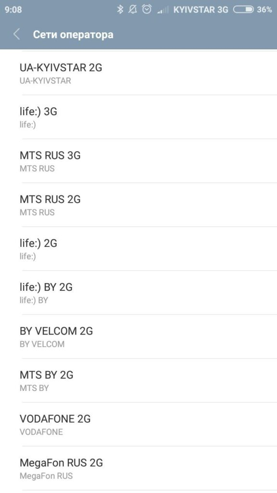 | 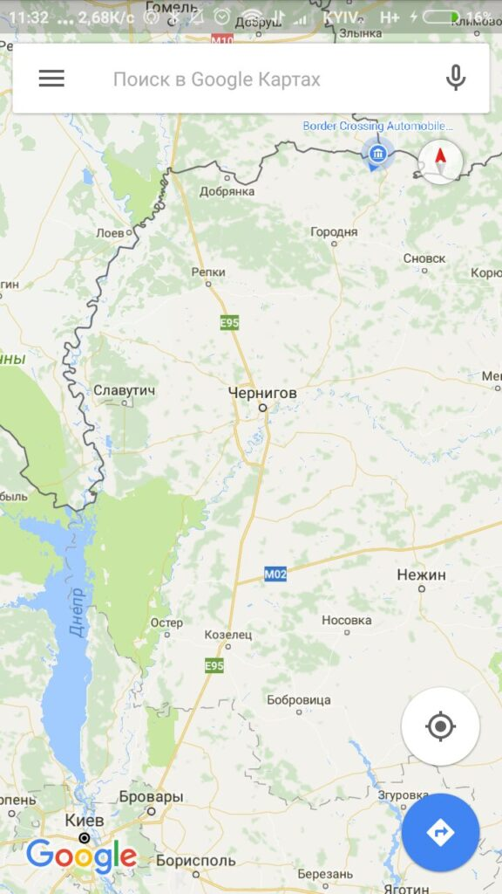 | 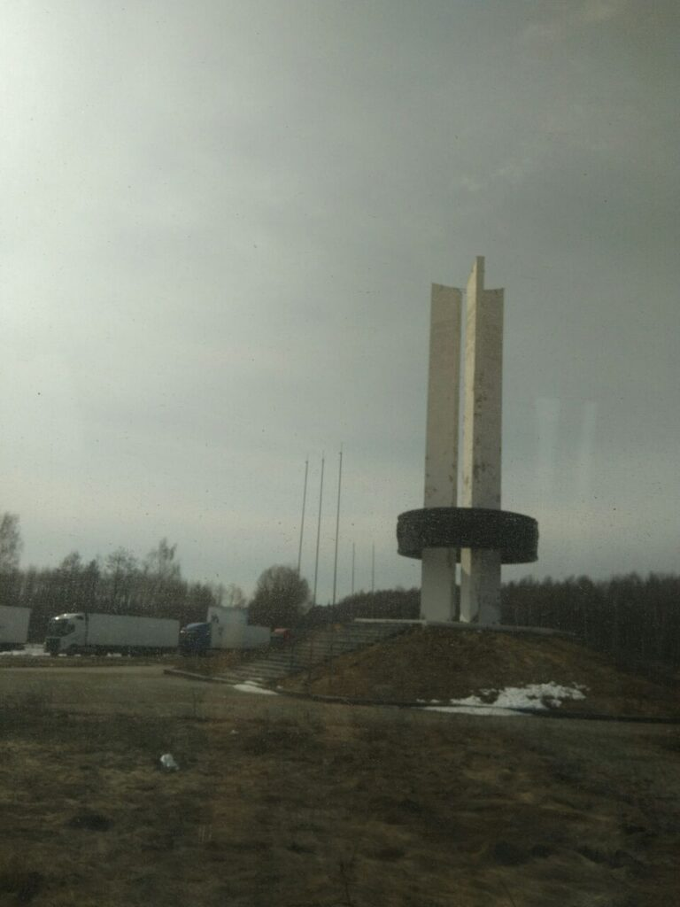 |
| :-----------------------------------------------------: | :-----------------------------------------------------: | :-----------------------------------------------------: |

[Three Sisters](<https://ru.wikipedia.org/wiki/Three_sisters_(monument)>) — a monument at the junction of the borders of [Belarus](https://ru.wikipedia.org/wiki/Belarus), [Russia](https://ru.wikipedia.org/wiki/Russia) and [Ukraine](https://ru.wikipedia.org/wiki/Ukraine). Also here operators of all three countries simultaneously catch)

_2018.04.09_ Thanks to everyone who read my channel)
My journey has come to an end and I have come to my senses a little, I almost feel like a man)
Thanks again and see you soon)

This is where my first officer contract ended.
