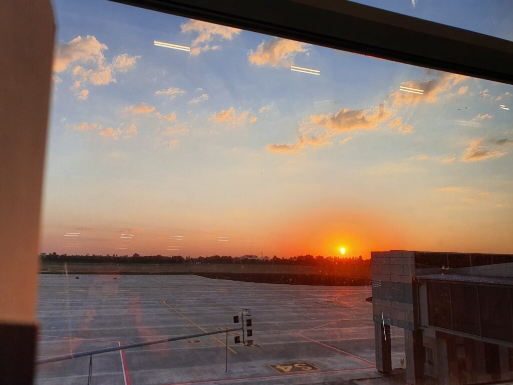
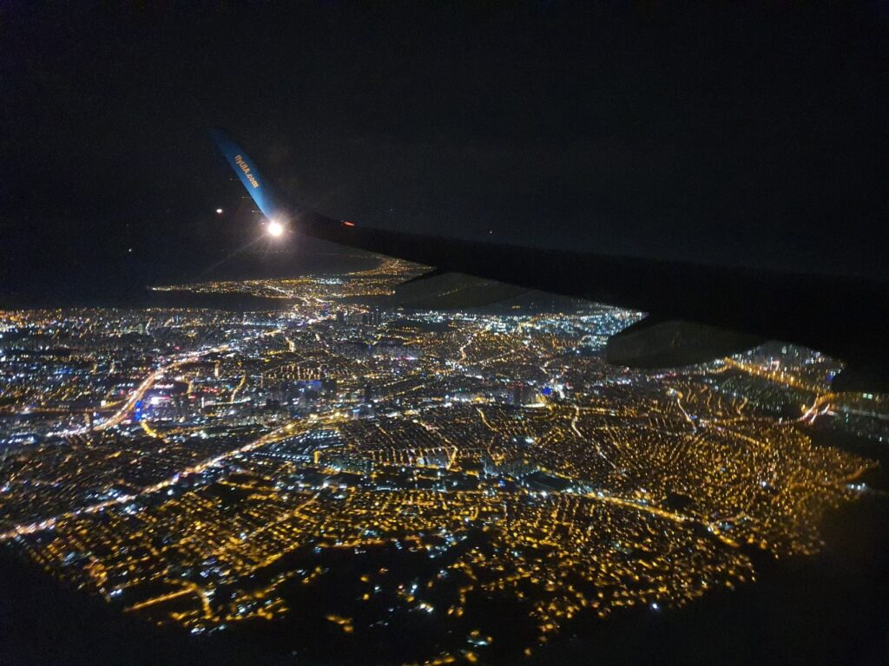
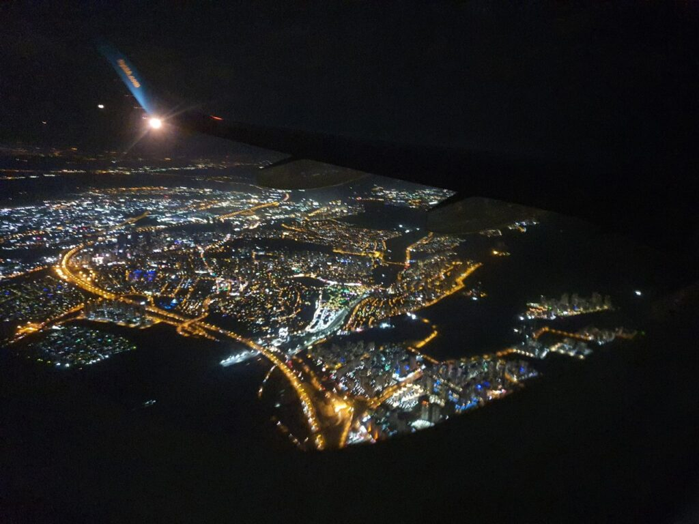
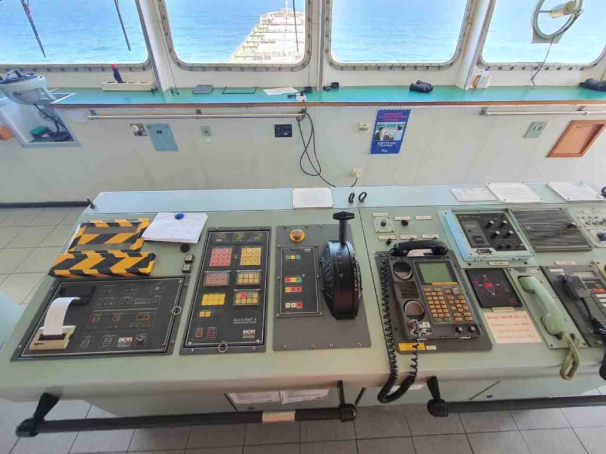
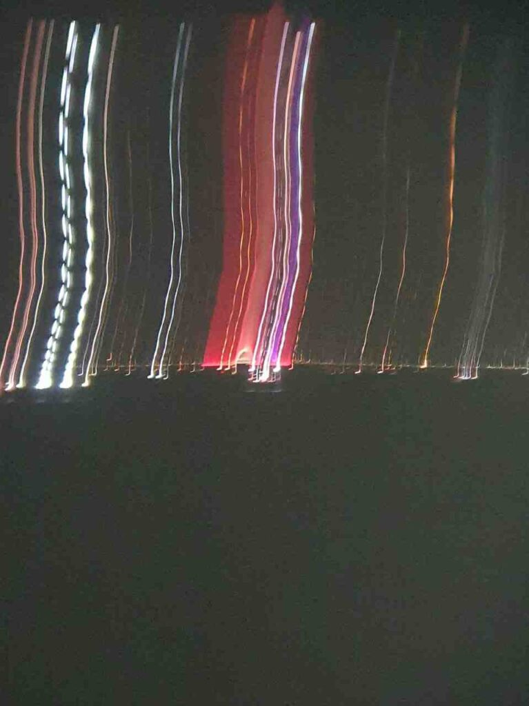
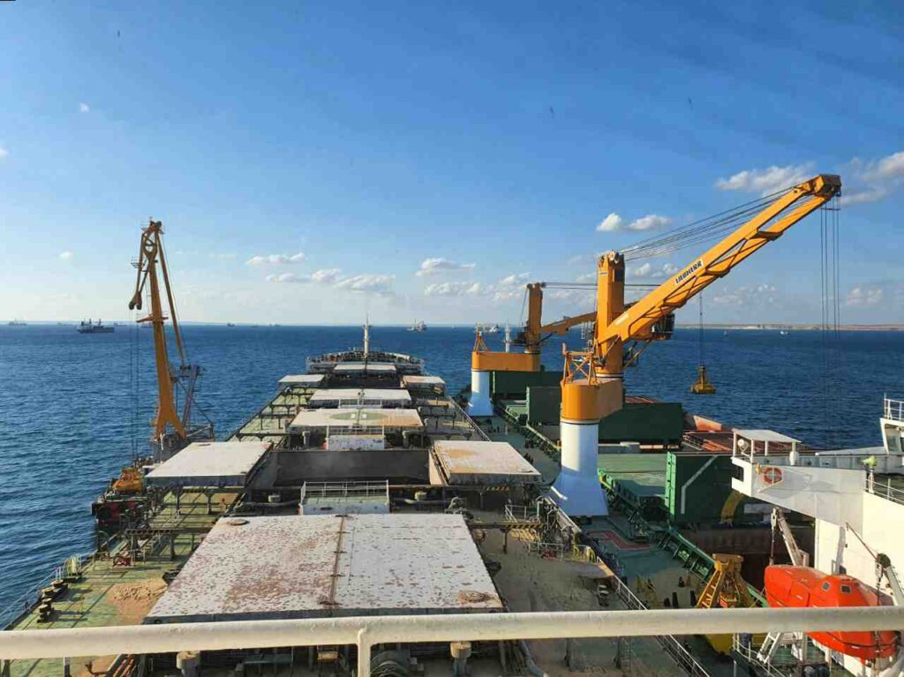
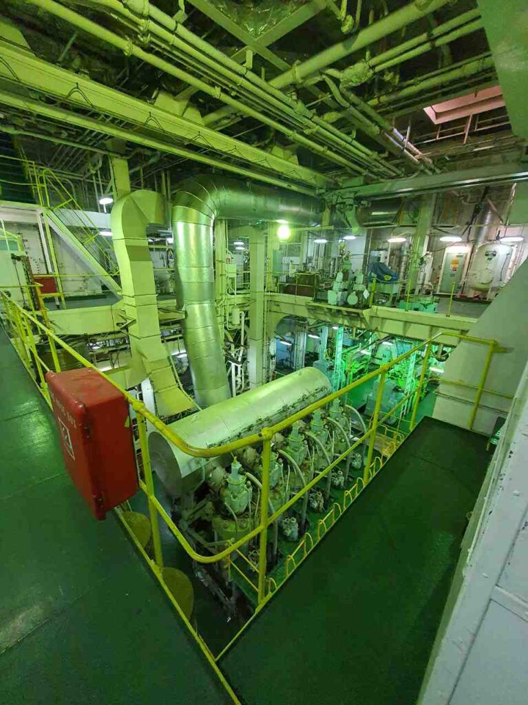
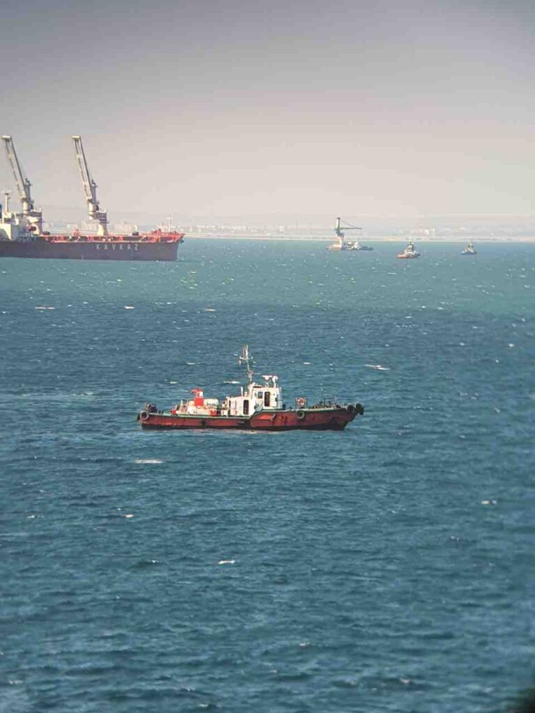
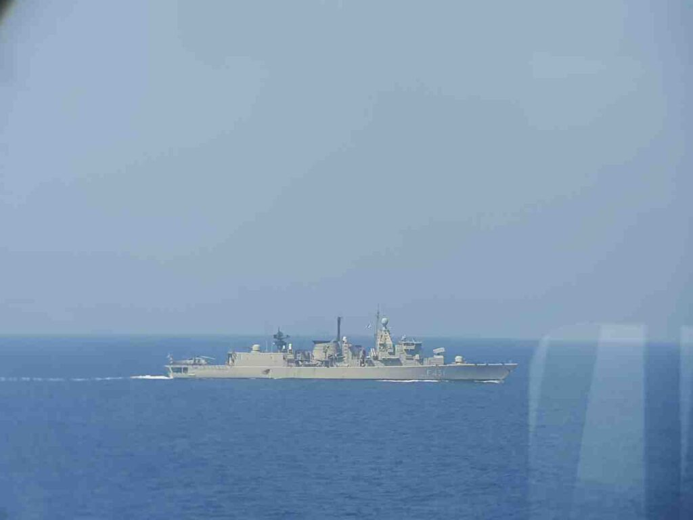

_2020.06.12_ Що ж, знову привітайте тут)
Кацу підтвердили заявочку на галеру, тож незабаром цей канал знову поповнюватиметься різними життєвими морськими історіями.
Не те щоб я прямий у захваті, але все ж таки це добре)

_2020.08.04_ У Кацу новий реквест на галеру. І є сподівання, що тепер все по-справжньому.
Зараз проблеми зі змінами екіпажів, тож я можу застрягти там досить надовго (від 10 місяців до 1,5 року), але ми сподіватимемося на краще. Інакше зійде на берег нічний хом'ячок з дахом, що поїхав.

_2020.08.05_ О, приїхали квитки на літак, так що післязавтра о 9 годині я вилітаю у бік порту посадки.
Там буде швидка зміна екіпажу на ходу судна, що дуже незручно.
Летимо ми до Туреччини, і зміна екіпажу буде під час очікування черги для проходження протоки Босфор.
Кацу вперше потопче Чорне море, або Чорне море потопче Кацу, залежить від погоди 😂
Іти будемо чи на порт Кавказ, чи порт Керч, поки не відомо точно.

_2020.08.07_ Відпустив родичів і подався на реєстрацію)
Пройшов перевірку при вході до зони посадки

|                                                           |                                                                                                              |
| :-------------------------------------------------------: | :----------------------------------------------------------------------------------------------------------: |
|  |  |

І тут я усвідомив, що нікому навіть на думку не спало перевіряти вагу ручної поклажі, на неї навіть дивитися не стали.
Те почуття, коли приїхав в аеропорт за 3 години, і дивишся на людей, що пробігають у гейт, що закривається 😅
Почалася посадка, але одразу набігло купа турків 😅
Все, ми з капітаном та другим механіком сіли в літак)
Наступний зв'язок зі Стамбулом

|                                                         |                                                         |                                                         |
| :-----------------------------------------------------: | :-----------------------------------------------------: | :-----------------------------------------------------: |
|  |  |  |

_2020.08.08_ Привіт усім, ми в готелі, і дісталися Wi-Fi, все добре, будемо чекати подальших новин про посадку на судно) Солодких снів вам)

|                                                                                   |
| :-------------------------------------------------------------------------------: |
|  |

Це буде наш пароплав - [Fortune Trader]

Зателефонували з ресепшену готелю, імовірно, о 22-й годині за нами приїде таксі, хоча судно ще в центрі мармурового моря і навряд чи встигне, чому ж так рано?
_22:00_ Все, викочуємося з готелю

_2020.08.09 04:33_ Повернувся з вахти, взяли лоцмана і йдемо протокою.
Коротше, це пиздець)
Екдіси не пов'язані з радарами і навіть між собою. Також вони не показують СРА, його можна подивитися тільки на екрані АIS.
Радари… Давніше за мене. Кінескопні, у одного навіть трейли не працюють, а у другого розбито захисне скло.
Зміна екіпажу проходила трохи менше години, і мене ледве ввели в курс справи.
Капітан просто шокований.
Зараз стоятимемо біля Керчі тижнів зо два, кажуть, там і зв'язок ловить і буде час розібратися з цим усім.
Пароплав прям трясе під час набору швидкості.
Каюта, не сказати, що прямо велика. Трохи більше, ніж була на 125-метровому малюку.
Коротше, перше враження не тішить.

_2020.08.10 00:23_ Які проблеми з приладами, у цьому пароплаві проблеми у всьому: у документації, у стані судна в цілому… Якщо буде Black Sea PSC - нам усім п...
Старий екіпаж поклав великий болт на все. Виживатимемо, мох.
Ну хоч кухар як нормальний менш.
Ось зараз я розумію, що мої скарги на старе судно, яким я ходив, були ні про що. Там, млинець, було офігенно щодо техніки. Все ж таки німці, на відміну від китайців вміють будувати...

_2020.08.11 00:30_ Привіт усім, Кацу на зв'язку.
М. Ми знаходимося на якірній стоянці біля порту Кавказ і зловили російський Білайн)
Як я і писав раніше, хороших новин немає від слова зовсім, разом 3ПКМ (3 помічник капітана) і майстром розбираємо всю цю дупу, яка залишилася після минулого екіпажу.

|  |
| :---------------------------------------------------------------------: |

|                                                                         |                                                                      |                                                                                   |
| :---------------------------------------------------------------------: | :------------------------------------------------------------------: | :-------------------------------------------------------------------------------: |
|  |          |  |
|           |  |                                                                                   |

Навігаційне обладнання ходового містка

_2020.08.12 02:40_ Всім привіт, шифтанулися ближче до кримського мосту, тут і краще зв'язок і прямо на рейді буде навантаження судна.

|                                                                                      |
| :----------------------------------------------------------------------------------: |
|  |

_2020.08.13 02:30_ Дивно, але при фейс-констролі прикордонників навіть не було ФСБ-шників, як завжди.

|                                                           |                                                         |                                                         |
| :-------------------------------------------------------: | :-----------------------------------------------------: | :-----------------------------------------------------: |
|    |  |  |
|  |  |  |

_2020.08.15 05:00_ Привіт із рейду Порт Кавказ.
Ми так само потроху вантажимося ячменем, а пшеницю вже завантажили. Потроху намагаюся розібратися з роботою.
Кондиціонер на судні не працює, а ми йдемо в ОАЕ, що в Перській затоці...
Через піратський район, до речі.
Зате через вахти - дні летять божевільно. Якби я не писав постійні репорти із зазначенням дати – я б втратив рахунок часу.
З іншого боку, за рівнем набридання, відчуття, ніби я тут більше місяця вже.

|                                                                                                |
| :--------------------------------------------------------------------------------------------: |
|  |

2020.08.18 12:45 Ось жопця ... Приїхав PSC і отимел нас, мох.
І мене також. Зрозуміло, що з "боках" старого другого, мох.
Ну нічого, якщо щось можна вирішити грошима, то це не проблема
PSC це Port State Control "Paris Memorandum of Understanding", у нашому випадку одна з жорстких європейських перевірок.

Port State Control - це інспекція, в якій країни можуть перевіряти зареєстровані за кордоном судна в портах, відмінних від судів держави прапора, і вживати заходів проти судів, які не відповідають вимогам міжнародних конвенцій, таких як SOLAS, MARPOL, STCW і MLC. Інспекції можуть включати перевірку укомплектованості судном та його експлуатації відповідно до застосовного міжнародного права, а також перевірку компетентності капітана та офіцерів, а також стану та обладнання судна.

Різні країни об'єднують норми того, як потрібно перевіряти іноземні судна, підписуючи меморандуми, серед яких:

- Paris MoU (Europe and the North Atlantic);
- Tokyo MoU (Asia and the Pacific);
- Acuerdo de Viña del Mar (Latin America);
- Caribbean MoU (Caribbean);
- Abuja MoU (West and Central Africa);
- Black Sea MoU (The Black Sea region);
- Mediterranean MoU (the Mediterranean Sea region);
- Indian Ocean MoU (the Indian Ocean);
- Riyadh MoU (Persian Gulf).

_2020.08.20 00:30_ Всім привіт, нарешті, до нас дісталися ріс. прикордонники і ми нарешті сьогодні звалимо з цієї країни, мхмх
Так, враження про себе росіяни залишили, ну, хех. Не хочу сюди більше їхати 😅
Далі на нас чекає протоки Босфор та Дарданелли (Стамбул), потім Суецький канал у Єгипті. А після піратського району ми вирушимо до Дубаї та Кувейту з російською пшеницею та ячменем.

_2020.08.26 03:30_ Всім привіт, Кацу-дес)
Ми пройшли турецькі протоки і зараз чекаємо заходу до Суецького каналу)
Судно дуже велике, що для мене зовсім не звичне, 75к тонн, після 8,8к дуже велика різниця)
Повертати на авторульовому неможливо, тільки ручками, все інше теж старе, іржаве та убоге, хутро.
І кондиціонера нема. Прям як євробляха 😅.
Ну нічого, ми виживемо 😂
Після суєця на нас чекає навантаження озброєних шрі-ланкійців для захисту нас від піратів)
У Jebel-Ali, UAE ми постоїмо пару днів, вивантажуючи пшеницю, після чого вирушимо до Кувейту, вивантажуватимемо ячмінь, що займе близько тижня.
З майстром у мене склалися добрі стосунки, та й загалом екіпаж непоганий)
Щоправда, готування так собі, і овочів майже немає, і нашу заявку проігнорували… Сумно це.
І ще купа інших заявок теж… Мда.
Ну та гаразд, не будемо про погане

|                                                         |                                                                                 |                                                                            |
| :-----------------------------------------------------: | :-----------------------------------------------------------------------------: | :------------------------------------------------------------------------: |
|  |  |  |

_2020.08.26 18:30_ У нашого судна сталася поломка, мох
Тож ми не увійшли до Суецького каналу.
Механіки ще вранці все усунули, але тепер має приїхати перевіряючий від Класифікаційної спільноти, до якої приписано судно і провести перевірку.
Якщо все добре, то він видасть спеціальний сертифікат, і тоді можна буде викликати спеціального Суєць Канал Інспектора, щоб покататися з ним.
Тільки тоді він видасть папір, що ми можемо знову йти до каналу.
Так само чартер (орендодавець пароплава) оголосив нам offhire, це означає, що поки ми в суєць канал не увійдемо, грошей він платити не буде.
Так що у нас тут дуже весело)
UPD: у результаті нам тоді всі необхідні сертифікати надіслали електронною поштою)

_2020.08.27 21:45_ Нарешті ми вийшли із Суецького каналу)
Взяли охоронців на борт і прямуємо Червоним морем у бік Аденської затоки.
Чортові араби попили крові, забрали купу блоків цигарок, кави і навіть хліба.
Все ж таки іноді фраза одного мого друга, що х...б - м...б _(**UPD**: не збуджуватимемо різні органи)_, здається цілком справедливою. Принаймні при заході до арабських країн точно.
До речі, я не говорив, але у нас є басейн з морською водою, що не так вже й погано) Хоч він і не великий, але все ж таки дуже приємно цілком опуститься у воду.
Скоро інтернет пропаде, тож прощатимемося до наступного порту.

_2020.08.28 03:00_ Я вирішив продовжити свою практику з пітоном, щоб мозок не засихав у цьому солоному середовищі, і тут мені підігнали чудовий гайд бібліотекою PyGame, за допомогою якої можна легко писати невеликі ігри, за що я дуже вдячний своєму близькому другу )

_2020.08.29 12:00_ 🕛 Ось і прийшла жопка.
Поламався кондиціонер... А ми в червоному морі і поки що виживаємо басейном і відчиненими дверима в надбудові, але незабаром піратський район і всі двері повинні бути зачинені. Це просто повна непроглядна жопця. Температура повітря вже +35 і продовжує зростати.
Сподіваюся, я виживу і ще зможу вийти на зв'язок, мох

_2020.08.30 01:15 (UTC+3) (21 27,7N 37 45,9E)_
Половина людей, у яких каюти не дивляться в ніс, просто витягла матраци на відкриту палубу і сплять на вітерці, і я теж не виняток, хех

_2020.09.03 14:00 (UTC+3) (14 14,6N 52 37,0E)_
Ми майже вийшли з Аденської затоки, незабаром і небезпечна піратська зона залишиться позаду. Сьогодні трохи полегшало, вітер став сильнішим і не такий спекотний.
У Червоному морі було взагалі пекельне пекло. У +40 без кондиціонера ти не можеш ні нормально спати, ні нормально працювати, з кожним днем ​​недосип все більше накопичується, а спроби покемарити пару годинників призводять до того, що ти прокидаєшся весь липкий від поту в ліжку, яке палає жаром.
Єдине, що рятує - це басейн з морською водою, втім, температура води +32, але це краще, ніж +40.
До речі, холодної води немає, вода із гарячого та холодного кранів тече вода однакової температури – близько +55 градусів. Тож навіть опрісниться після морської води це ще завдання.
Ось сьогодні матроси змогли встановити на містку одну із двох спліт-систем. Отже, я не заздрю ​​механікам, які розповідали історії, що встановити їх не можна. Так-то і поділом їм.
Коли ми зайдемо до порту – близько 08 вересня – у нас уже буде цілий місяць незабутніх біззарних пригод.
Поки що так.

_2020.09.04 1:30 (UTC+4)_ Продовжую офігенні історії)
У нас тут погнутий гвинт, ще й із тріщиною.
Вся гідравліка для відкриття кришок трюмів тече на всі боки.
Самовар, який опріснює морську воду – дихає на ладан і дає від сили 4 тонни.
Також вилетіли системи мастила ГД і сепаратор лляльних вод. У принципі, у нас дід (старший механік) взагалі шкодник, до чого не доторкнеться – все ламається.
Про стан суднового кондиціонера, радарів та всього навігаційного обладнання я вже писав.

_2020.09.05 03:20 (UTC+4) (18 20,0N 58 10,0E)_
Сьогодні нарешті до кінця закінчили встановлення кондиціонерів, і це щось чарівне. На містку хочеться навіть спати)
Також сьогодні майстер віддав зі своєї карти не робочу стерео систему на 55вт, що дуже непогано за потужністю, а я зміг її полагодити) Так що тепер у нас на містку є музика.
Щодо харчування, стає дедалі гірше, пішла в хід перловка, а овочів привезти навіть не обіцяють.
Та й загалом досить голодно.

_2020.09.08 Порт Джебел-Алі, ОАЕ_
Ось ми й зайшли до порту. Великий кондиціонер не лагодять, майстер на свій страх і ризик закупив три кондиціонери для їдалень, щоб хоч там могли спати люди.
До того ж до нас приїхав PSC і знову нас трахнув. Лише не допоміг і навіть не затримав.

Ця посада вже трохи розтяглася навіть за один місяць, так що почну писати наступний^^

Завжди Ваш, Кацу ❤️
