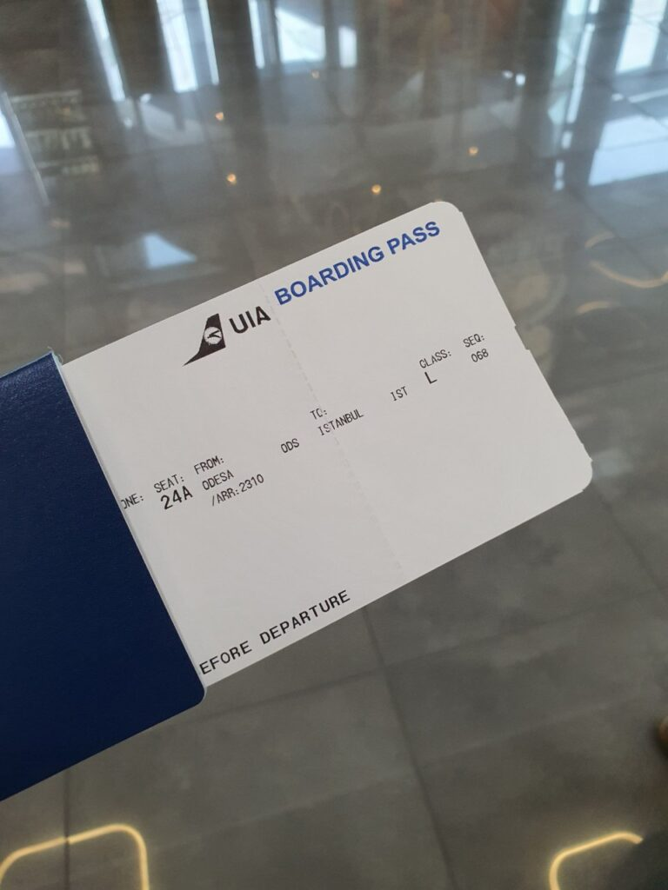
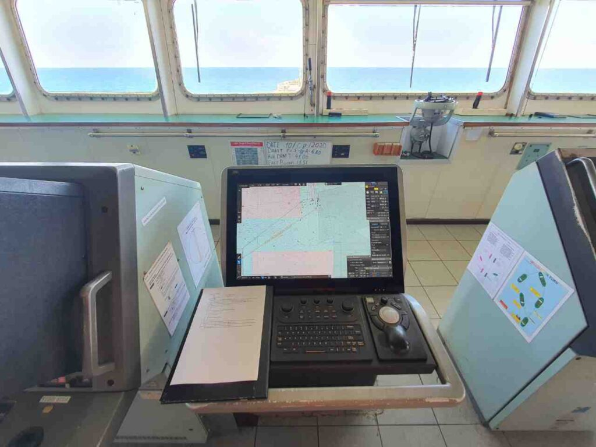
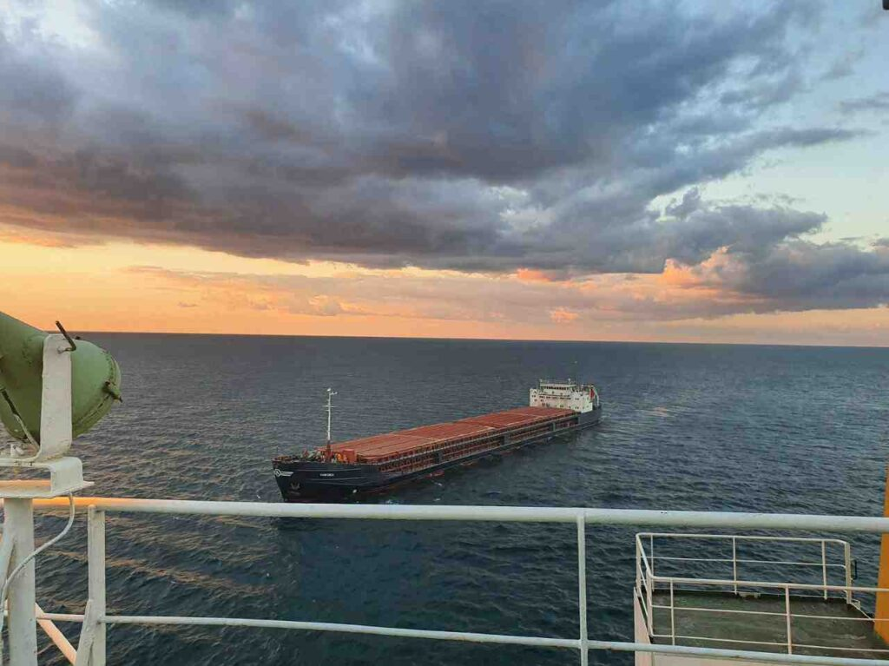
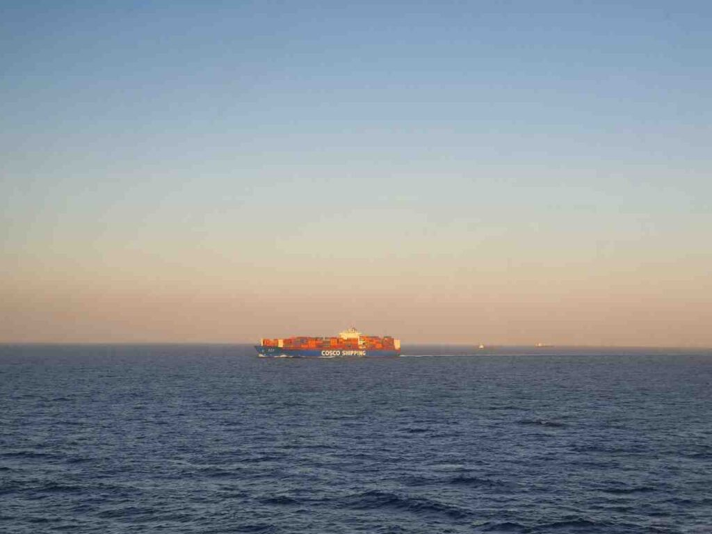

_2020.06.12_ Well, hello here again)
Katz was confirmed the application for the galley, so soon this channel will again be replenished with various life sea stories
It's not that I really like it, but it's still good)

_2020.08.04_ Katsu has a new request for a galley. And there is hope that now everything is for real.
There are problems with crew changes right now, so I can be stuck there for quite a long time (from 10 months to 1.5 years), but we will hope for the best. Otherwise, a night hamster with a broken roof will come ashore.

_2020.08.05_ Oh, the plane tickets have arrived, so the day after tomorrow at 9 o'clock I'm flying towards the landing port.
There will be a quick change of crew on the move, which is very inconvenient.
We are flying to Turkey, and the crew change will be while waiting in line to pass the Bosphorus.
Katsu will trample the Black Sea for the first time, or the Black Sea will trample Katsu, depends on the weather😂
We will go either to the port of the Caucasus, or the port of Kerch, it is not yet known for sure.

_2020.08.07_ Released relatives and went for registration)
Passed the screening at the entrance to the landing zone

| | |
|:---:|:---:|
|  |  |

And then I realized that it had never even occurred to anyone to check the weight of hand luggage, they didn’t even look at it.
That feeling when you arrived at the airport 3 hours in advance, and you look at people running through the closing gate😅
Landing began, but immediately a bunch of Turks came running😅
That's it, the captain and the second mechanic got on the plane)
Next connection from Istanbul

| | | |
|:---:|:---:|:---:|
|  |  |  |

_2020.08.08_ Hello everyone, we are at the hotel and got to the Wi-Fi, everything is fine, we will wait for further news about boarding the ship) Sweet dreams to you)

| |
|:---:|
||

This will be our ship - [Fortune Trader]

They called from the hotel reception, presumably, at 22 o'clock a taxi will come for us, although the ship is still in the center of the marble sea and is unlikely to be in time, why so early?
_22:00_ That's it, we're rolling out of the hotel

_2020.08.09 04:33_ I returned from the watch, took a pilot and we go along the strait.
In short, it's fucked up
Ecdis are not connected to radars or even to each other. Also they do not show the CPA, it can only be viewed on the AIS screen.
Radars... Older than me. CRT, one even trails do not work, and the second broken protective glass.
The crew change took a little less than an hour, and I was barely brought up to date.
The captain is shocked.
Now we will be standing near Kerch for two weeks, they say, there the connection catches and there will be time to sort it all out.
The ship is shaking while picking up speed ...
Cabin, not to say that just big. A little more than it was on a 125 meter baby.
In short, the first impression is not encouraging.

_2020.08.10 00:23_ What are the problems with the instruments, in this ship there are problems in everything: in the documentation, in the condition of the ship as a whole ... If there is a Black Sea PSC, we will all ...
The old crew put a big bolt on everything. Let's survive, mh.
Well, at least the cook seems to be more or less normal.
Now I understand that my complaints about the old ship on which I went were about nothing. There, damn it, it was awesome in terms of technology. Yet the Germans, unlike the Chinese, know how to build ...

_2020.08.11 00:30_ Hello everyone, Katsu is in touch.
M. We are at the anchorage near the port of Kavkaz and caught the Russian Beeline)
As I wrote earlier, there is no good news from the word at all, together 3PKM (3rd assistant captain) and the master we disassemble all this ass that was left after the last crew.

|  |
|:---:|

||||
|:---:|:---:|:---:|
|  |  |  |
|  |  ||

Navigating bridge equipment

_2020.08.12 02:40_ Hello everyone, we shifted closer to the Crimean bridge, here the connection is better and the ship will be loaded right on the roadstead.

| |
|:---:|
||

_2020.08.13 02:30_ Surprisingly, during the face-control of the border guards, there were not even FSB officers, as usual.

||||
|:---:|:---:|:---:|
|  |  |  |
|  |  |  |

_2020.08.15 05:00_ Greetings from the raid Port Kavkaz.
We are still gradually loading barley, and we have already loaded wheat. Little by little I try to get my work done.
The air conditioner on the ship does not work, and we are going to the UAE, in the Persian Gulf ...
Through the pirate district, by the way.
But because of the shifts - the days fly like crazy. If I did not write regular reports with the date - I would lose track of time.
On the other hand, in terms of the level of annoyance, it feels like I've been here for more than a month already.

| |
|:---:|
||

2020.08.18 12:45 What the fuck… PSC came and fucked us, mh.
And me too. It is clear that on the "sides" of the old second, mx.
Well, nothing, if something can be solved with money, then this is not a problem.
PSC stands for Port State Control "Paris Memorandum of Understanding", in our case one of the toughest European checks.

Port State Control is an inspection where countries can inspect foreign-registered ships in ports other than those of the flag state, and take action against ships that do not comply with international conventions such as SOLAS, MARPOL, STCW, and MLC. Inspections may include verification of the completeness of the ship and its operation in accordance with applicable international law, as well as verification of the competence of the master and officers, as well as the condition and equipment of the ship.

Different countries are uniting the rules on how to check foreign ships by signing memorandums, including:

* Paris MoU (Europe and the North Atlantic);
* Tokyo MoU (Asia and the Pacific);
* Acuerdo de Viña del Mar (Latin America);
* Caribbean MoU (Caribbean);
* Abuja MoU (West and Central Africa);
* Black Sea MoU (the Black Sea region);
* Mediterranean MoU (the Mediterranean Sea region);
* Indian Ocean MoU (the Indian Ocean);
* Riyadh MoU (Persian Gulf).

_2020.08.20 00:30_ Hello everyone, finally, we got to grow up. border guards and we will finally get out of this country today, mhmh
Yes, the Russians left an impression of themselves, well, so-so, heh. I don't want to go here anymore
Further we are waiting for the Bosporus and Dardanelles (Istanbul), then the Suez Canal in Egypt. And after the pirate area, we will go to Dubai and Kuwait with Russian wheat and barley.

_2020.08.26 03:30_ Hello everyone, Katsu-des)
We passed the Turkish straits and now we are waiting for the entry into the Suez Canal)
The vessel is very large, which is not at all familiar to me, 75k tons, after 8.8k there is a very big difference)
It is impossible to turn on an autopilot, only with handles, everything else is also old, rusty and wretched, fur.
And there is no air conditioning. Just like a euro badge😅.
It's okay, we'll survive
After the hustle, we are waiting for the loading of armed Sri Lankans to protect us from pirates)
In Jebel-Ali, UAE we will stop for a couple of days unloading wheat, after which we will go to Kuwait to unload barley, which will take about a week.
I have a good relationship with the master, and in general the crew is not bad)
True, the cooking is so-so, and there are almost no vegetables, and our application was ignored ... It's sad.
And a bunch of other applications too ... Hmm.
Well, okay, let's not talk about bad things

||||
|:---:|:---:|:---:|
|  |  |  |

_2020.08.26 18:30_ Our vessel broke down, mx
So we didn't enter the Suez Canal.
The mechanics fixed everything in the morning, but now an inspector from the Classification Society to which the vessel is assigned should arrive and conduct an inspection.
If all is well, he will issue a special certificate, and then it will be possible to call a special Suets Canal Inspector to ride with him.
Only then will he issue a paper that we can go to the canal again.
Also, the charter (the leaseholder of the steamer) announced to us offhire, which means that until we enter the suets canal, he will not pay money.
So we have a lot of fun here)
UPD: in the end, all the necessary certificates were sent to us by e-mail)

_2020.08.27 21:45_ Finally we left the Suez Canal)
We took the guards on board and heading along the Red Sea towards the Gulf of Aden.
Damn Arabs drank blood, took a bunch of blocks of cigarettes, coffee and even bread ...
Still, sometimes the phrase of one of my friends that x...b - m...b _(**UPD**: let's not excite different organs)_ seems to be quite fair. At least when entering the Arab countries for sure.
By the way, I did not say, but we have a pool with sea water, which is not so bad) Although it is not big, it is still very pleasant to completely sink into the water.
Soon the Internet will disappear, so we will say goodbye until the next port.

_2020.08.28 03:00_ I decided to continue my practice with python so that the brain does not dry out in this salty environment, and then I was fitted with an excellent guide on the PyGame library, with which you can easily write small games, for which I am very grateful to my close friend )

_2020.08.29 12:00_ 🕛 So the ass came.
The air conditioner broke down ... And we are in the Red Sea and for now we survive by the pool and open doors in the superstructure, but soon the pirate area and all doors will have to be closed. It's just complete bullshit. The air temperature is already +35 and continues to grow.
I hope I survive and still be able to get in touch, mh

_2020.08.30 01:15 (UTC+3) (21 27.7N 37 45.9E)_
Half of the people who don't have cabins facing their noses just pulled their mattresses out on the open deck and sleep in the breeze, and I'm no exception, heh

_2020.09.03 14:00 (UTC+3) (14 14.6N 52 37.0E)_
We have almost left the Gulf of Aden, and soon the dangerous pirate zone will be left behind. Today it is a little better, the wind has become stronger and not so hot.
In the Red Sea, it was generally pitch hell. At +40 without air conditioning, you can neither sleep normally nor work normally, every day the lack of sleep accumulates more and more, and attempts to poke a couple of hours lead to the fact that you wake up all sticky from sweat in a bed that burns with heat.
The only thing that saves is a pool with sea water, however, the water temperature is +32, but it's better than +40.
By the way, there is no cold water, water from hot and cold taps flows water of the same temperature - about +55 degrees. So even desalinating after sea water is another task.
Today the sailors were able to install one of the two split systems on the bridge. So I don't envy the mechanics who told stories that they couldn't be installed. So it serves them right.
When we enter the port - around September 08 - we will already have a whole month of unforgettable bizzar adventures.
For now, this is it.

_2020.09.04 01:30 (UTC+4)_ I continue awesome stories)
We have a bent screw here, also with a crack.
All hydraulics for opening covers of holds flows in all directions.
The samovar, which desalinates sea water, breathes its last and gives 4 tons at the most.
The main engine lubrication systems and the bilge water separator also flew out. In principle, our grandfather (senior mechanic) is generally a mischief-maker, what he doesn’t touch - everything breaks down.
I already wrote about the state of the ship's air conditioner, radars and all navigational equipment.

_2020.09.05 03:20 (UTC+4) (18 20.0N 58 10.0E)_
Today, finally, the installation of air conditioners was completed to the end, and this is something magical. I even want to sleep on the bridge)
Also, today the master gave a non-working 55W stereo system from his card, which is very good in terms of power, but I was able to fix it) So now we have music on the bridge.
As for food, it's getting worse, pearl barley is being used, and they don't even promise to bring vegetables.
And yes, quite hungry.

_2020.09.08 Jebel Ali Port, UAE_
So we entered the port. A large air conditioner is not being repaired, the master, at his own peril and risk, bought three air conditioners for dining rooms so that at least people could sleep there.
In addition, PSC came to us and fucked us again. Only did not help and did not even delay.

This post has already stretched a little even for one month, so I'll start writing the next ^^

Always yours, Katsu ❤️