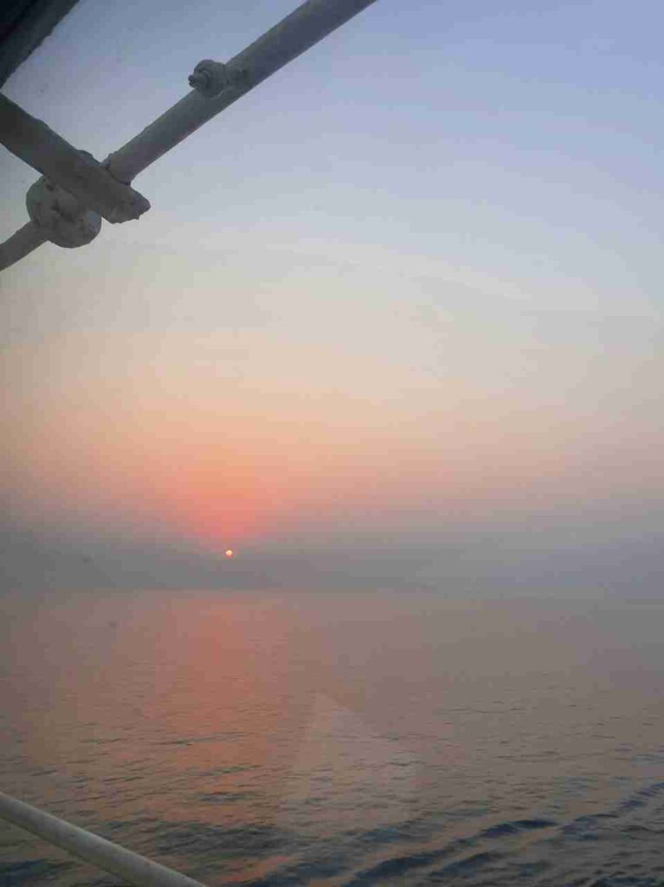
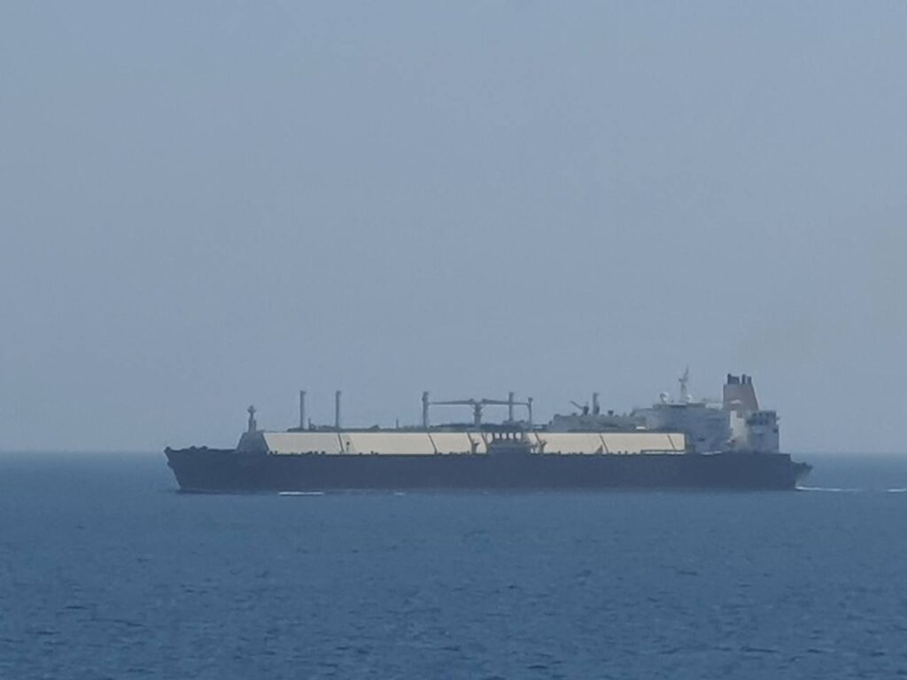
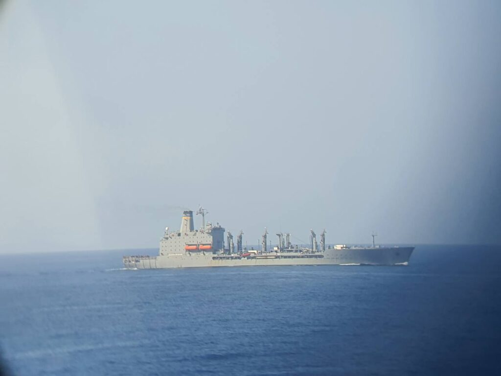
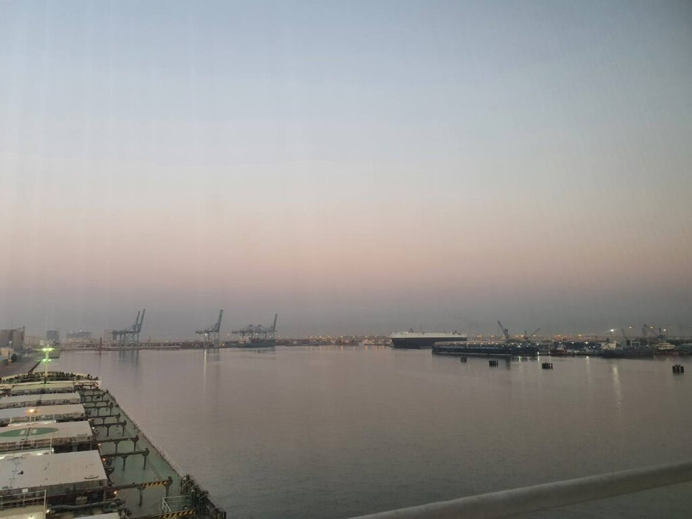
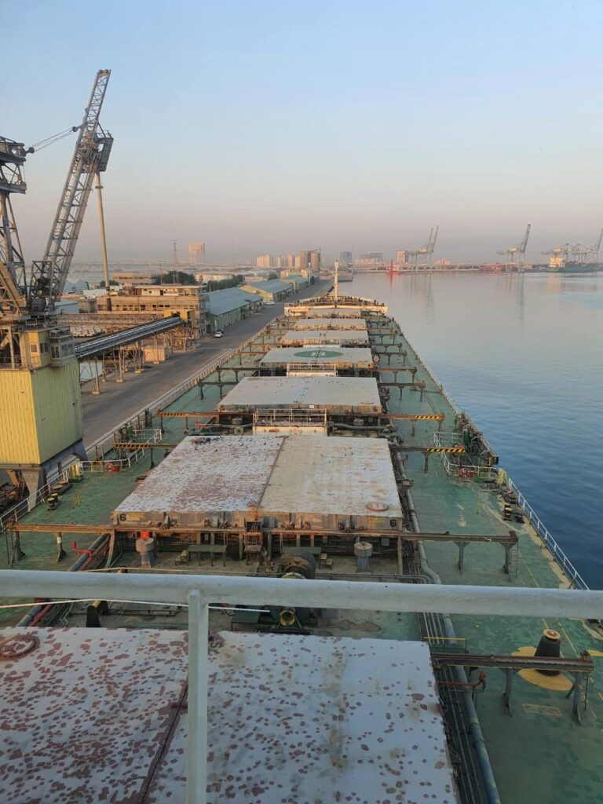
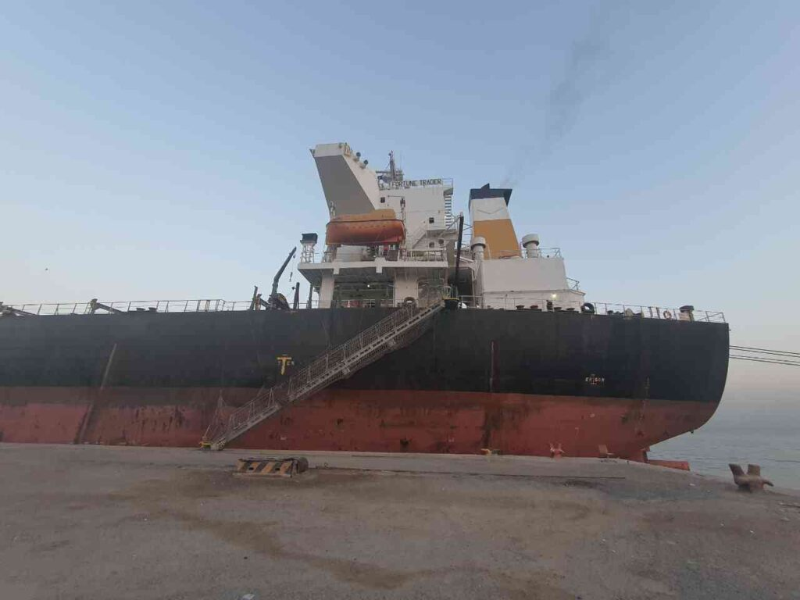
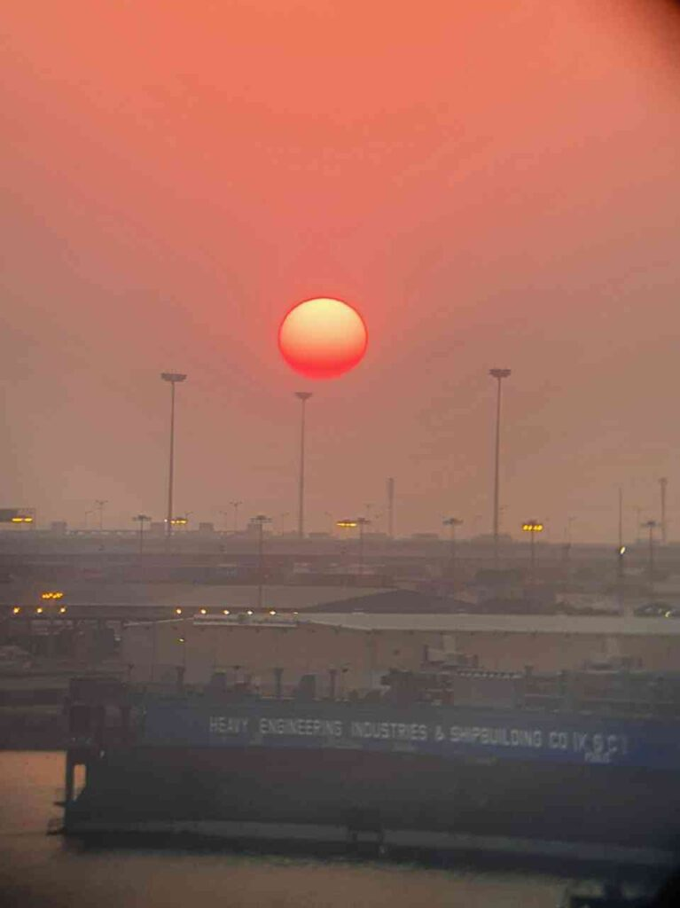
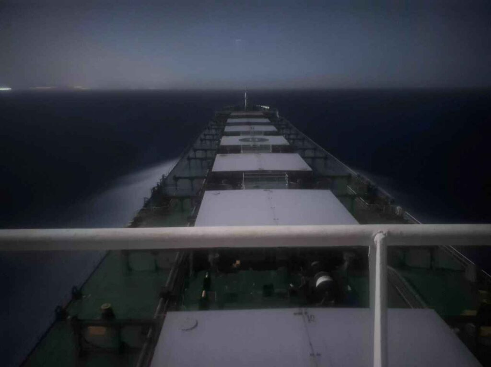

Welcome to the second post in a series about my travels as Second Mate on the Fortune Trader.
Last time we finished on September 8, a month after boarding the ship.

I sent photos with a very slaughtered quality so as not to kill the crumbs of the Internet traffic available to me.

||||
|:---:|:---:|:---:|
| |  |  |
|  |  | |

_2020.09.09 06:00_
We sell used oil. A e grandfather had a birthday yesterday and he and his wards 4 mechanics and minders "gave a jar". And after that they go to the watch, after the delivery of working off.
Problems started on the machine that accepts working off, they shout to me, they say, do something. Mechanics. Navigator.😂😂
Well, I had to force them to raise their grandfather, although they really did not want to, and the master had to get up too, because the grandfather himself did not figure it out.

_2020.09.09 14.31 (UTC+4)_
As a result, we leave the port of Jebel-Ali without the main air conditioner and will wind another two weeks around the Persian Gulf without air conditioning!
Only after the exit from Shuweih (Kuwait) and the exit from Persian, in Fujairah, at the anchor station, will these evaporators be delivered to us.
(Katsu from the future: they won't make it (Katsu from the future: \*laughs\*))
Well, creatures, there is no other word for it.
You have to huddle on the couch in turn with the third on the bridge. The only place where there is air conditioning on the ship.
Now the master has purchased ordinary home split systems and they will be installed in large dining rooms so that people can sleep in the cool. Worse than barracks.
In 20 minutes we will be given a pilot and the mooring will begin, respectively, and the Internet will end.
The car is ready, people are called to the mooring stations, according to the emergency schedule.
There's not much left, heh.
Thanks to all the dear people who support me in this difficult time of deprivation, huh)
We will survive! 😎

_2020.09.10 01:21 (UTC+4)_
I could barely wake up on duty, I slept only a few hours a day, heh.
We are walking in Persian, phosphorescent phytoplankton glows on the waves around the ship, it looks incredibly beautiful, but the smartphone camera cannot capture it.

| |
|:---:|
||

_2020.09.10 12:41 (UTC+4)_
When we handed over the pilot yesterday, just before that, we had a combination ladder fall, which is installed if the height of the ship's side is more than 9m. Well, at least the pilot agreed to go down from 10 meters along the usual pilot ladder. At least they got the combination one, but the mechanism, which was just being "repaired" in Piraeus, turned out to be in a state of shit. So even xs how will we take a pilot now.

_2020.09.11 18:05 (UTC +3)_
Hello everyone, Agent Katsu is in touch^^
We arrived at Shuweih, Kuwait and anchored to await command.
The agent yesterday gave us a crazy command about more than a week of waiting for disembarkation, but according to the latest information, we should enter the port tomorrow at 05:00 hours at the highest tide.
We will have to unload 5 holds of barley for a total of 42k tons.
In Jebel Ali, we unloaded 21k tons of wheat from two holds in just one day, so we will not stand idle for more than three.
Next, we are waiting for the repair of the air conditioner in Fujairah, UAE, after which we will advance to Suez, of course, through a dangerous pirate area.
Hail the Great Goddess!

_2020.09.11 23.13 (UTC+3) Shuwaikh Anchorage_
We were supposed to calmly anchor, but then the medical service calls us and says that they will arrive in an hour.
The documents are ready, an hour has passed, but they are still missing.
In the last month I have received so many impressions from the Arabs that I no longer mind joining the Israeli army.
May the Great Goddess protect us all!
We were supplied with several air conditioners, those that the master bought for the same money as the company turned out to be much better. (Company bought miserable 9s for 460 bucks apiece, and the captain bought 22s for the same money)
They were installed in the dining rooms of officers and crew, so that the people now sleep there. The master also installed the conder to himself and now I sleep in his office, and the chief with the third one is on the bridge.
We survive as best we can, yes.

_2020.09.12 Shuwaikh Port_
I shot a cool time-lapse about the exit from Jebel Ali, but I won’t show it to you, it weighs 300mb😅
An Arab woman came, changed everyone's temperature, gave free practice and left.
14:10 I bought an Arabic SIM card, because the Ukrainians sucked out all the money, for a bet of minutes, I just went nuts. 16 USD on Goodline and 250 UAH on Kyivstar flew away for 30 Mb o.o.

Announcement of free practice - removal of quarantine from the ship and permission for contact between shore crew members. It is not carried out in all ports, mainly in backward ones, such as the CIS or Arab

There should have been time lapse videos of Jebel-Ali exiting and Shuwaikh entering, but Wordpress won't let me upload them.

||||
|:---:|:---:|:---:|
|  |  |  |
|  |  | |
|  |  |  |

_2020.09.13 06:30_
Finally got my hair cut for the first time in a month, such a feeling of relief!
By the way, in Kuwait, unlike the Emirates, it is quite tolerable at night.
The air is drier and not so hot, however, with the sunrise, a real fiery hell begins, so all that remains is to offer prayers to the Great Goddess in order to endure this test with honor.
Let's hope that at least in Fujairah we will still be supplied with air conditioning, and not overturned, as usual.
**UPD:** Holy naivete!

||||
|:---:|:---:|:---:|
|  |  |  |

Here he is, Fortune Trader. Rusty and creepy...

|  |
|:---:|

_2020.09.17 12:00_
Well, the unloading is over and we are preparing to depart from the early hot Kuwait)
Yes, we were counted as a shortage (shortage) as much as 350 tons on the shore scale. (The way the cargo is counted on the shore)
Now Ch.Off is conducting a draft survey together with a surveyor to find out the situation.
But since he is a waffle, most likely, Arabs or Indians will let him in again.
And for this you can go home, mx.
Upd. Everything ended well, the draft survey showed that the cargo was even half a ton more than necessary, so we could even safely leave the port. May be…

_2020.09.17 17:45
_The formalities are over, the ship is almost ready for departure, it remains only to get permission to leave the port.
So soon I will leave you, supposedly for two weeks in the heat and the red sea.
19:20 That's it, the pilot is on board, we start unmooring.
21:20 The ship left the port and finally Katsu left the watch. However, at 24:00 again on it, in a couple of hours. You need to at least pokemar, mx.

_2020.09.23 11:30_
Hello from the Indian Ocean. We are almost on the verge of entering the recommended IRTC transit corridor in the Gulf of Aden (Pirate Dangerous Zone). We have three warriors with unpronounceable names on board, so everything will be fine.
Our two months are coming up soon and the birthday is just around the corner.
The cook began at least occasionally to cook something intelligible, although most often it is still the transfer of food to the trash.

_2020.09.27 20.00_
Last night we surrendered the warrior, the passage of the dangerous area was successful and calm.
Now we are moving further along the Red Sea to the port of Suez, where we will take the arrived Greek technician on board, and after passing through the Suez Canal we will go to Piraeus, Greece.
At the moment we have:

* Air conditioner not working
* Shower water cooling not working
* Missing Combination Ladder port side
* Not working Combination Ladder starboard
* S-Band radar antenna not working
* One of the radars does not acquire targets
* The hydraulics of the covers of the holds are dying of incense
* Dies ballast system
* Screw is bent and cracked
* It's scary to talk about the engine room
* Also a steelmaker chef who continues to translate products and all the deteriorating, escalating relations in the crew

BUT. As it turned out, we met a sistership (a vessel of the same construction) working in the same company called TAILWINDS and it is still much worse there. To many of the above, they add:

* Non-working gyrocompass
* Radars do not acquire targets at all
* Screw specifically falls off
* In addition, the captain is a tyrant

And they want to send this ship not for repair, but on a Novorossiysk-Thailand flight.
After that, it became clear that we, in principle, have the flagship ship of this company, and not the worst, as we thought ...
It's scary to be here, really. It's like driving a car, knowing that its wheels can fly off at any moment ...
This vessel seems to be sucking out human strength and energy, otherwise it would simply fall apart ...

Lately, wild melancholy and apathy have attacked. I don’t feel like doing anything, even reading/watching movies…
So did the insomnia. In the evening, before the night watch, I manage to sleep for two hours, and after the night watch - at most 4. Because of all sorts of shitty thoughts about the future and about life, I just can’t fall asleep.
On past voyages, I didn’t think about coastal life at all, apparently because I was still a child in the family, but now I understand that it’s time to become independent, but it feels like I just can’t stand it.
I can hardly live with my parents, despite the fact that they are very caring and I love them, but there are too many of them in my life.
But I still don’t know how I can live on… In terms of goals and priorities.
I understand that I need to take care of my health, which I have thoroughly abandoned, both psychological and physical. Perhaps then I will be able to evaluate myself more adequately, and I will be able to take a slightly different look at life.
In short, my troubles with the head played out with even greater force, yes.
I want to try to shoot a time-lapse on the passage of the Suez Canal, if I manage to remain unnoticed) It seems that after Piraeus we were verbally promised something about Ukraine, but no one has yet given a flight task.
Honestly, I would like to take a suitcase and just run away if there was Ukraine, heh. And this despite the fact that the officers on our ship are normal.
It seems to me that if I came across a ship with senior officers - morons, then against the backdrop of all the problems with my head, I might not return from such a voyage, heh. And given the deteriorating state of the fleet, normal people will soon run out here.
In addition, with my absolutely weak, driven character, the positions of senior command staff are closed to me, because to be an old assistant to whom everyone is poking around, like ours ... It’s better to hang yourself.
Again, thoughts about the need for training and finding a normal job with normal earnings also haunt.

_2020.09.30 01:00_ Here we are already on the approaches to the Suez Canal)
Many wished me a happy birthday, which was very nice)
There is a terrible wind of 45 knots here in the Gulf of Suez, so we are not going as fast as we would like. Tomorrow night we will enter the channel and in October we will finally leave the Arab countries. Urya!
Now it remains to be hoped that we will not be sent here again)
They say that we have something planned for 2-3 months, we hope more for Brazil, then, perhaps, even by the new year we will be at home.
The situation on the ship is getting worse, people are quarreling, in the car, as usual, rats are handing over to the company.
Grandfather even had the audacity to try to cram the captain. Meh, this grandfather is such an asshole that everyone here already hates him, and he considers himself a strict, but fair and worthy person.
God knows what's going on...

|  |
|:---:|

Painted the covers of the holds, now at least it looks tolerable

In the next post I will describe how we passed the Suez Canal and what happened after it)

I love you ❤️

Everything will be Katsu! 🦊