Unlike the last flight, this one will take more than 4 posts. If last time I fit 2 months in a post, then here I have to make a post for each month due to the abundance of text and photos)
I hope you, the reader, find it interesting. If any points are not clear and / or require additional explanation, please feel free to leave comments)
In the last post, I finished describing October, so let's move on to November)

_2020.11.03 18:05_ Yes, yes, we have arrived in Egypt and Arab tortures of the nervous systems await us again. In the meantime, in a couple of days it will be 3 months since I am on this ship. The situation on the ship seems to be more or less calm. And the food is just as bad. Although, yesterday the master made the cook make a vinaigrette, and it was even a little tasty)
In a couple of days we will already be in Aqaba, and after several days of drifting along the bay, we will again call at the Arab port. There we are waiting for a weekly unloading with shifts 6 through 6, after which we will go to Piraeus for repairs.
It is not known further, but according to the latest information, now a lot of bulk carriers are idle, and the price of freight (vessel rental) has almost halved. So I hope that after the repair we will just anchor for a couple more months)
And then, by February, we’ll go to Nikolaev again, hihih)

_2020.11.04 18:17_ So we left Suez, everything ended well, and we didn’t even have as much brains as last time. So tomorrow evening we will be waiting at the roadstead of Aqaba, waiting for unloading.
There is even nothing to tell, with the passage of the 3rd month, the mode of indifference and non-judgmental judgment is already turned on, heh. Although, looking at the horrors that are happening in Ukraine, it is not strong to return yet.

|  |
|:---:|

_2020.11.06 02:15_
We approached Aqaba in Jordan. It turns out that we didn’t need to go to the port, but to another place, and the chief and the third who were already here received a thrashing that they didn’t tell about it.
When we arrived, I submitted the necessary documents to the agent, but he also scribbled a list of what he needed. I also received a thrashing about why it wasn't ready, even though I didn't even know that they might need other documents.
And how to explain this to the captain in anger? Fur.
**UPD:** in general, preparing receipt documents is the duty of 3PKM, but the captain did not trust him, calling him a gouge and asked me to do them.
Now we are spinning, drifting, and the girls from the Israeli army are calling and shouting - "move away from our state border", while we were maneuvering in a narrowness a couple of kilometers wide between the coast and the state border of Israel.

|  |
|:---:|

| 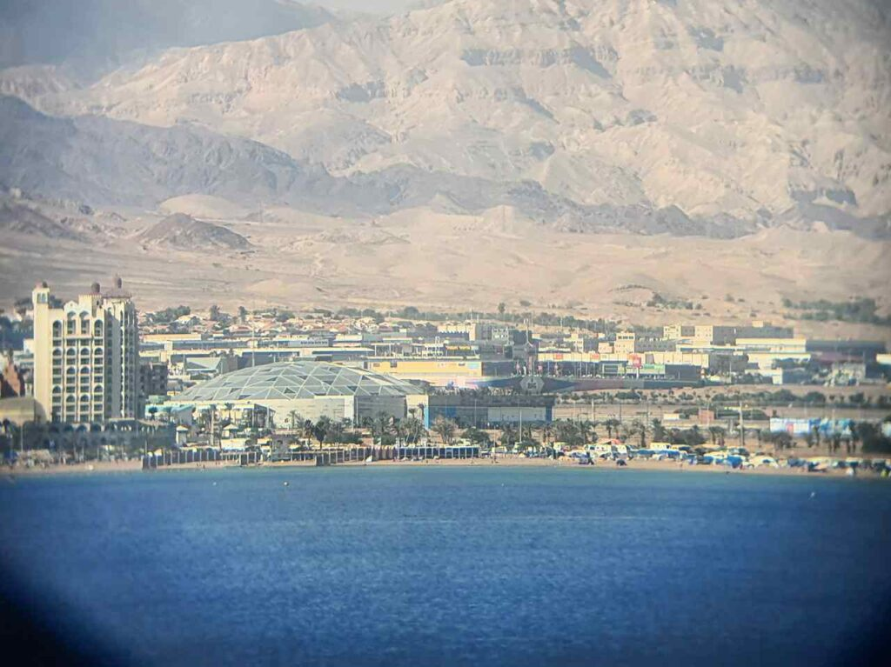 |
|:---:|

| 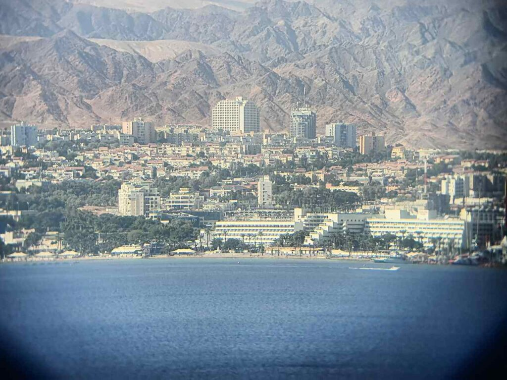 |
|:---:|

| 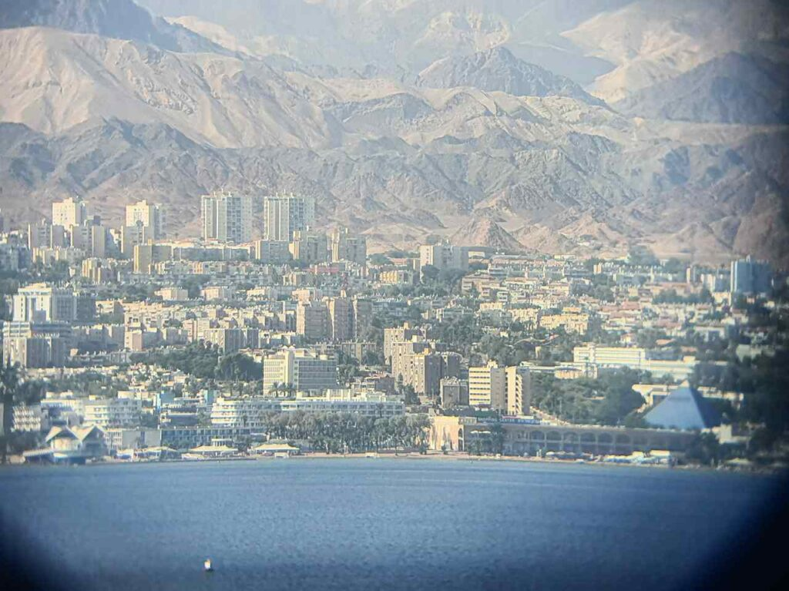 |
|:---:|

|  |
|:---:|

Territory of Israel

| 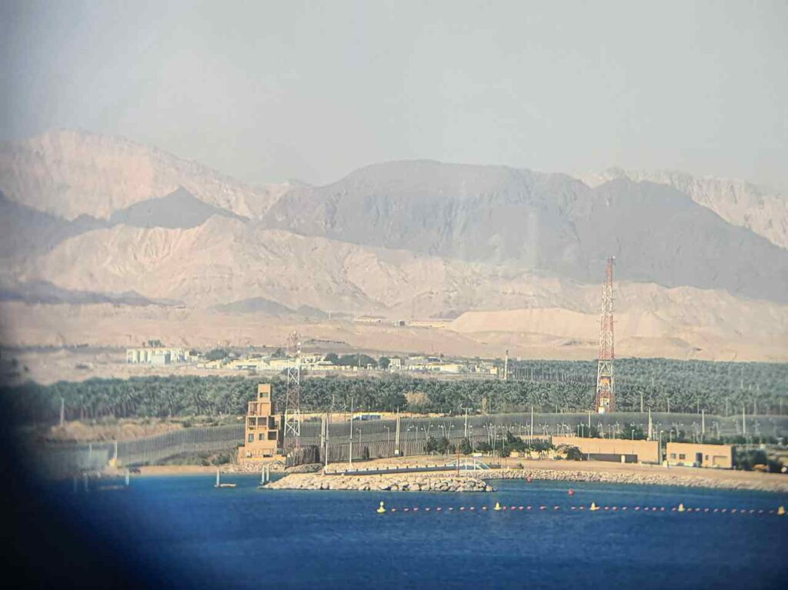 |
|:---:|

Border between Israel and Jordan

|  |
|:---:|

| 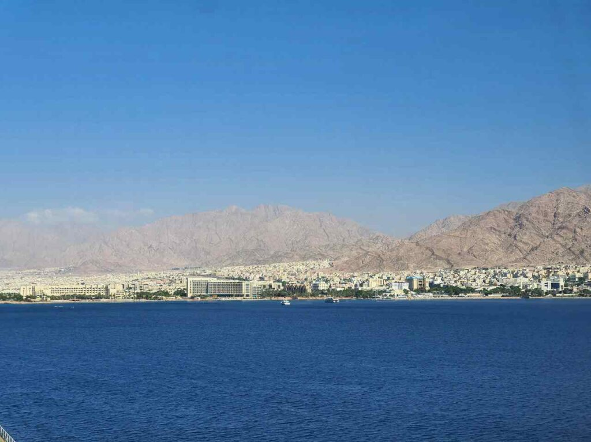 |
|:---:|

Jordan

| 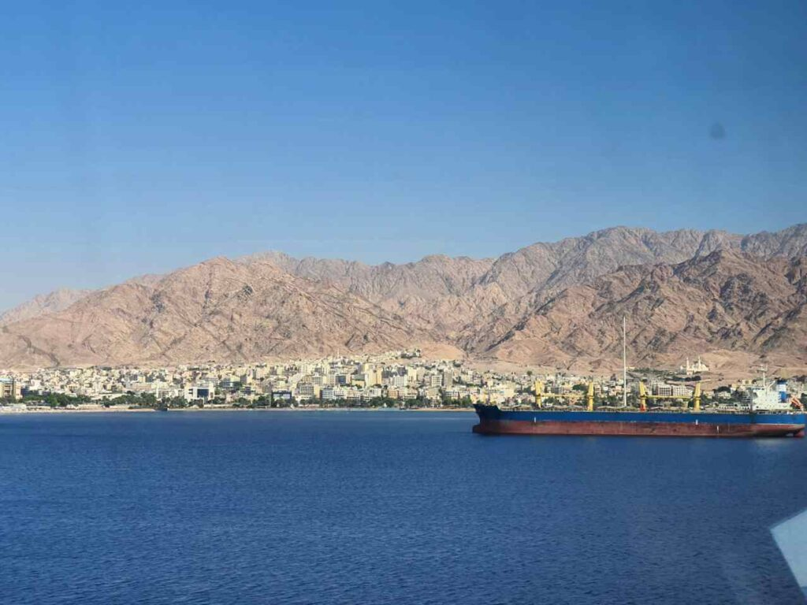 |
|:---:|

| 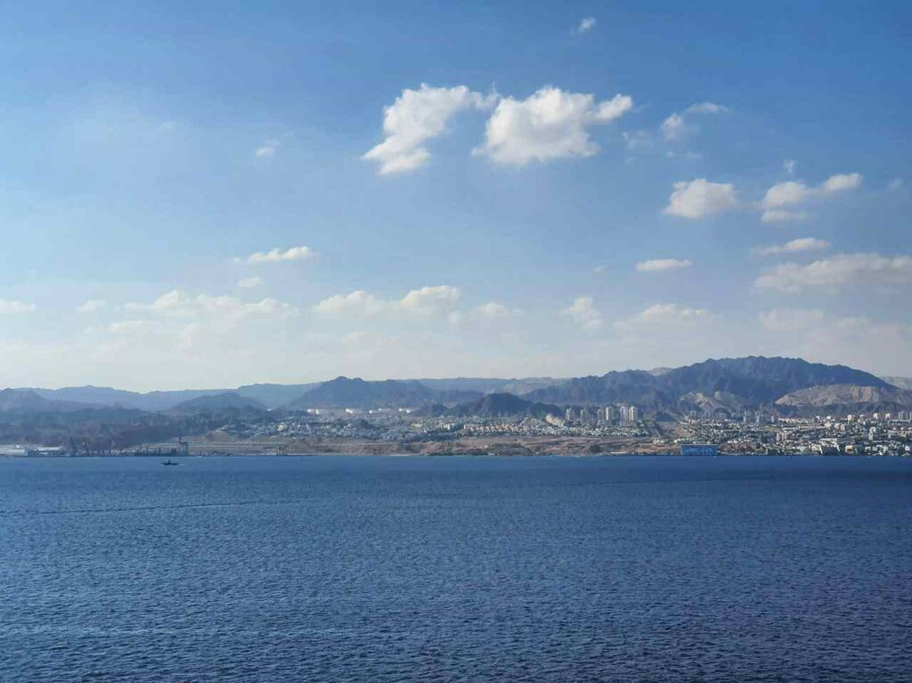 |
|:---:|

|  |
|:---:|

Israel

|  |
|:---:|

| 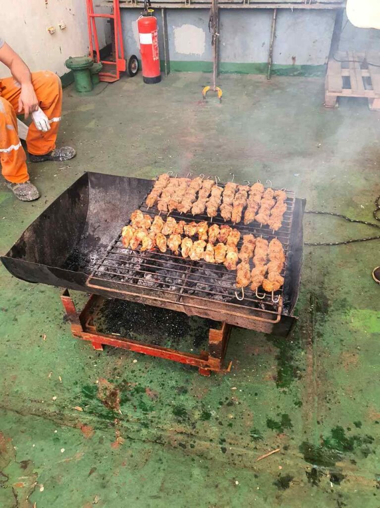 |
|:---:|

| 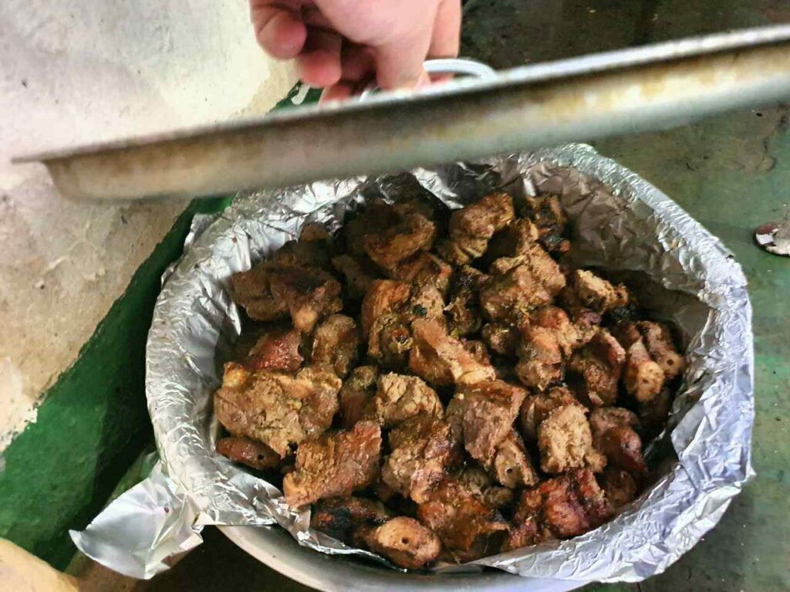 |
|:---:|

| 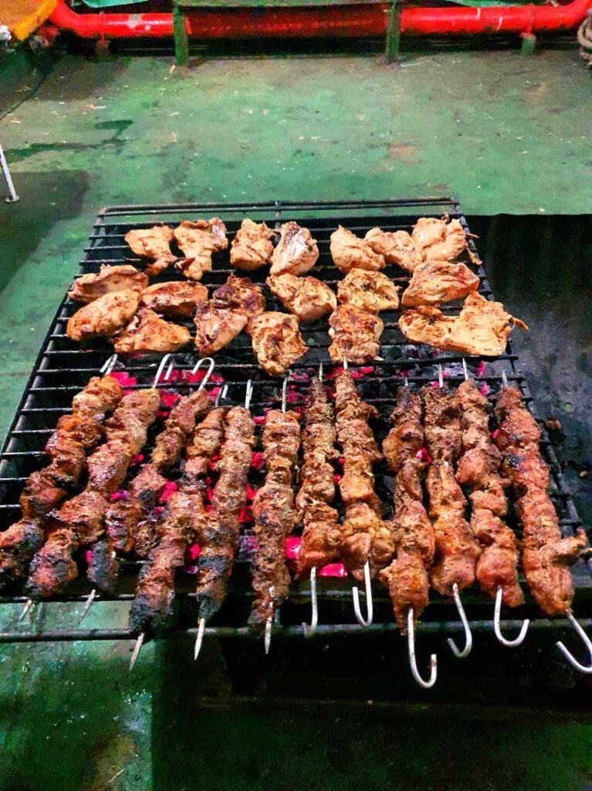 |
|:---:|

Food! Finally some decent food!

_2020.11.07_ In the process of cooking kebabs, we started drinking some drinks, because we need to try the resulting meat. And it was incredible! Also a huntsman, but with good music)

| 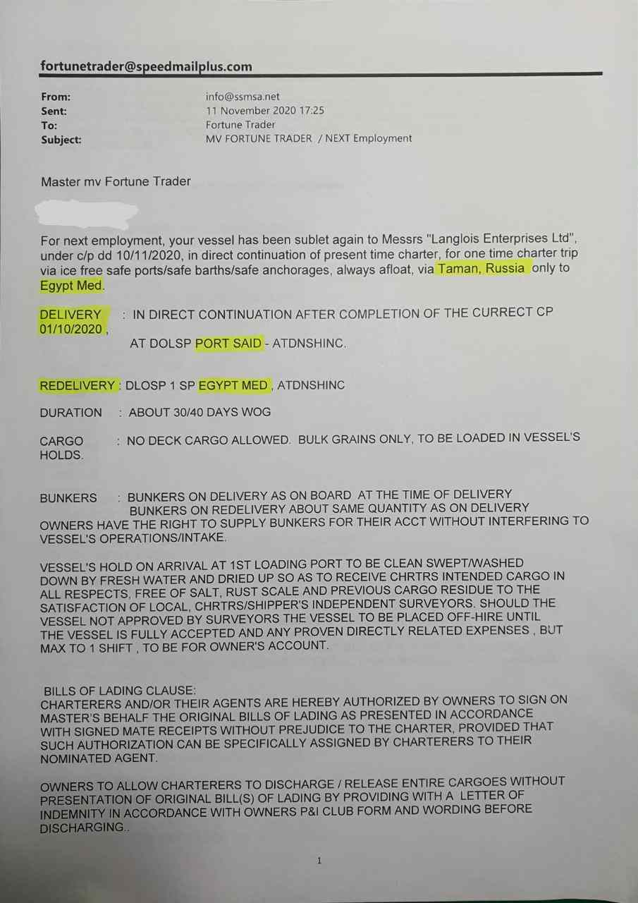 |
|:---:|

_2020.11.11 23:59_
Tram-pam-pam!
And all this means that we are not going to Greece for repairs. We go again to Russia and again we load on the roadstead. And most importantly, the captain will dump either on this passage of the Bosphorus, or after Russia. Ass…

| 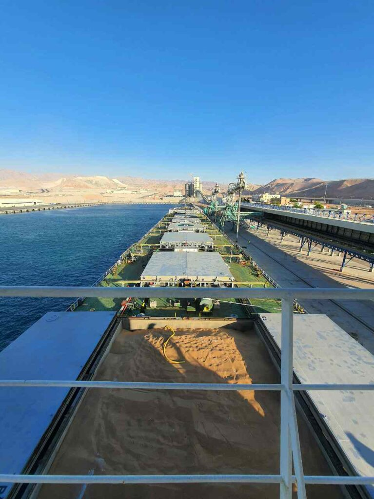 |
|:---:|

We weighed anchor and moored in the port of Aqaba. Grain unloading has begun.
_2020.11.12 16:00_

| 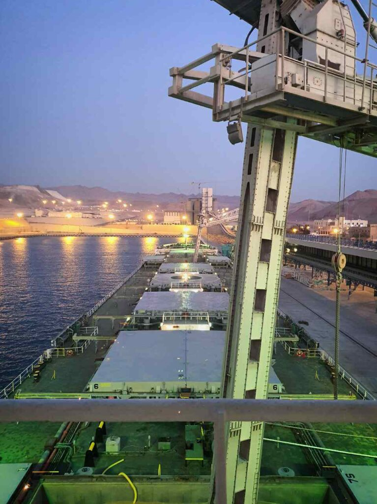 |
|:---:|

In the process of unloading holds number 2 and 7.
_2020.11.12 17:10_

|  |
|:---:|

Oh, that nasty grain dust flying during cargo work.
_2020.11.14 05:00_

_2020.11.14 16:30_ My conversations with the captain are not in vain. I told him that in Ukraine it is now even more dreary than even here, about the dangers of the coronavirus, and that here at least the money is going to plus, not minus. As a result, he seems to listen to my arguments and is thinking of sitting until March😅😅

_2020.11.16 00:30_ I am reporting yesterday.
At 11 o'clock I woke up and wanted to go to the shower, but I heard the knock of 3RMB and the cherished words "Katsu, PSK". (Ship Inspection)
I go up to the bridge, the inspector asked for a folder with certificates and began to check everything.
I did not find one addition to the certificate, and the copy I made did not suit him. (**UPD:** again, ship's certificates are the responsibility of 3PKM, transferred to me)
We descended from the bridge (**UPD:** I was entrusted with the honor of escorting the inspector)

* They started the boats (he did not give time to start the engine and said that one of the two batteries was not working).
* Climbed inside the garbage kommanta and said that there was a lot of garbage. (Although we burned the garbage before arriving at the port, we have been standing here for quite a long time).
* Brought emergency diesel generator.
* Then we went to the CPU (control room for all mechanisms in the engine room)
* She started clicking computers and photographing errors on them.
* Then he told the electrician to open the main switchboard for 220v and 440v, and after digging for a long time, he found an unconnected wire in one, and a luridly soldered resistance in the other.
* Then he went all over the car, looking into every crack and said that the car was dirty and smudged with oil.

When we got back to the bridge, I found that in that addition to the certificate there was a postscript that it was electronic and it failed.
And so he began to show the photo master and tell that there were a lot of comments on the detention of the ship, and the captain almost had to beg him not to do this. Let's see how it goes on.
Katsu was in touch with a PSC inspection report on the Fortune Trader in the port of Aqaba, Jordan.

_2020.11.16 05:00_ Based on a telephone conversation with representatives of the campaign, the first mate (senior assistant captain) of our vessel should be changed in the port of Istanbul in the roadstead.
And, as I understand it, he wants to dump a lot of people under the guise, including, but not limited to, the third assistant, the cook, the minder.

_2020.11.16 19:00_ The captain told the terrible news.
In Russia, if a ship berths, there should be no food left on board, which is not taken into account in the inventory.
Neither caught fish, nor, like me, brought my own food. How many times when I get to Russia, I understand that I have never met a worse country in terms of laws.
The same pre-arrival package of documents contains 43! document.

_2020.11.17 16:30_ Today, presumably after midnight, should be our departure from Aqaba.
Then we are waiting for the next passage of the Suez Canal, and then, in 2-3 days, we will come to the Dardanedles.
In another day we will leave the Bosphorus, and we will have a little more than a day to Taman. There we are waiting for more than a week of loading on an open, unprotected berth, with shifting. (Because local cranes cover only 5 holds at a time) Also, you must always be ready to leave the port when the weather worsens.
The regime is just a madhouse, you get very tired in the ports with the 6/6 regime, and after a week of travel, during which you need to prepare documents for three ports and go through three straits, again more than a week's parking ...
It is not for nothing that in normal companies contracts are 3-4 months, and not idiotic Greek 7-10, because this is real sadism.
However, the capitalist world is cruel to those who have no money, so you have to endure.
May the Great Goddess help to endure these burdens with dignity.

_2020.11.18 00:30_ That's all, the agent is on board, the last documents are signed and at 0130 there will be a pilot on board. And tomorrow Suets, again the Arabs and all the fun. Although, there is a feeling that the Russians will be even worse.

> Funny stories magazine will show our,
> Funny stories in the magazine - Arab Rush.

|  |
|:---:|

_2020.11.19 14:10_
A few fresh photos from the roadstead of the port of Suets.
We had to reach a special cut-off line by 5 o'clock, which must be reached at 23 to go to the canal, but when I called Port Suez Port Control, I was told to come no earlier than 8 o'clock.
Fortunately, there were a couple of intersections in the traffic separation system (a kind of road on the map), so we turned around, went back, and then returned again and came at the direction of Port Control.
Now we are waiting for beggars from Suez Canal Authorities, Immigration and Quarantine, who will take a couple of pieces of paper that no one needs and a few blocks of cigarettes each and go home.

_2020.11.20 01:45_
For some reason, when you walk along the suets towards the Red Sea, everything goes more or less calmly. But when you go to the Mediterranean, they go crazy.
Agent/Inspection/Quarantine cost ten blocks.
But fucked up:
Electricians (they put a special spotlight that no one needs) demanded 10 blocks due to the fact that something was wrong with the spotlight, they managed to bargain up to 4 units.
Boatmen (they have to quickly moor a faulty vessel, but put their boats in such a way that they cannot be quickly thrown off) and even demanded a box (50 blocks) managed to bargain up to 15.
Moreover, they also do not like the special Suez cabin. Serve them in the superstructure.
O Great Goddess, punish them according to your teachings.

| 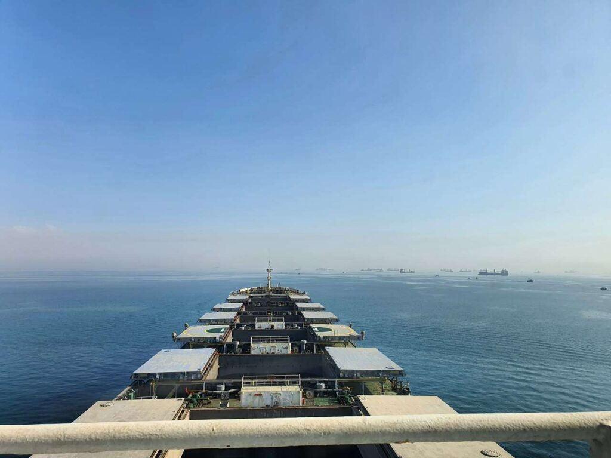 |
|:---:|

| 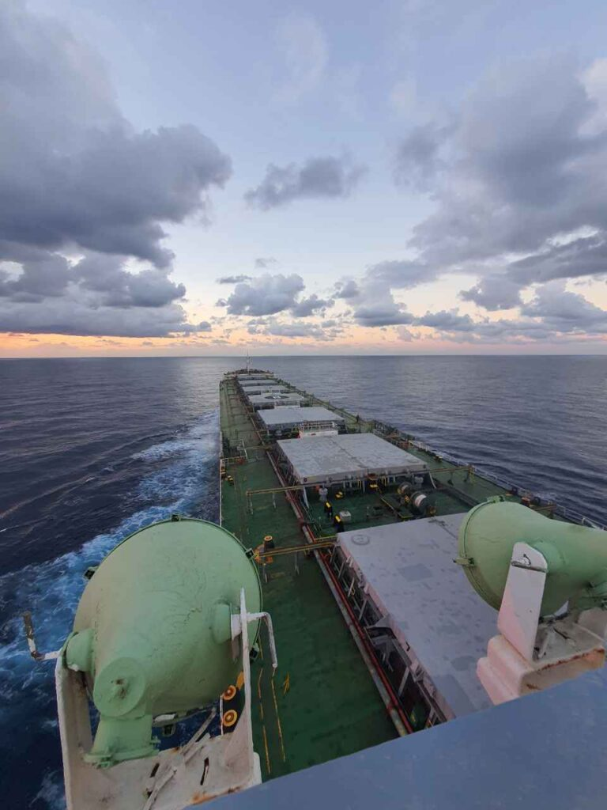 |
|:---:|

_2020.11.24 13:20_
We once again passed the Turkish straits and follow to the port of Taman.
Despite the fact that I drink vitamins and sleep normally, lately I have been terribly tired.
It’s not clear why, but every day it’s getting harder and harder for me to go up to the watch and force myself to do something ... I don’t even watch TV shows anymore and I don’t read books, you come to the cabin and immediately fall asleep.
In the meantime, we have been with the captain and 2 mechanics for 3.5 months.
It got cold, so yesterday I had to move from shorts to jeans and sweaters, after all, it's almost winter.

_2020.11.25 13:00_
Greetings from the raid of the port of Taman. So far, we are behind the territorial waters of the Russian Federation, but literally in an hour we will go to anchor.
The map shows that the berths of Taman are still occupied.

|  |
|:---:|

|  |
|:---:|

_2020.11.27 02:30_
By the way, this is the legacy left after the last gardening captain.
Tomatoes could not be preserved, but cucumbers give the first fruits.
True, their condition is so-so, it seems to me, due to the lack of nutrients, but where can you get them here?

_2020.11.27 02:30_
Today at about 4 o'clock in the morning we should start moving towards our berth in the port of Taman. Now we are at anchor.
Loading is fast, speed - 500-1000 tons per hour, so it will not last longer than 3 days if the weather is normal. After that, bunkering will still be waiting for us.
On Istanbul, we were confirmed with a crew change: Ch.Off / 3rd Off / 3rd Eng / M/man / Cook.
Chief is changed due to unsatisfactory work,
3rd and cook wrote a request for a change,
and the 3rd mech and the minder have already been sitting on the ship for a year, so it's time for them to go home.
They also wanted to change the electron, but the Master asked him to stay and the company also did not mind, although they were indignant.

|  |
|:---:|

|  |
|:---:|

2020.11.27 02:50
When we entered the port, the border guards called us and told us not to enter a special closed area, and recommended to go a different course.
Moreover, the closure of this area is not indicated in any NAVAREA messages or messages from NAVTEX.
They said something about their PRIPs / NAVIPs, but who is receiving them now, except for the Russian fleet?
Yes, and except for the Internet, which is not, I do not know about the ways to get them.
So, the border guards told our ship to go aside in Russian and we left on the recommended course in accordance with their requirements.
The immigration officer said that we entered the restricted area just a little, but they would turn a blind eye to this.
However, the border guards could not explain to ships with English-speaking crews the need not to enter the closed area, so these ships will now be fined 300k rubles (about 3.5-4k dollars).
For what? Yes, simply because they can.
Russia is a generous soul.

_2020.11.28 00:20_
We are sewn with terrible force. Fortunately, until it breaks off from the pier. And many ships are already leaving the port.
The wind was from the southeast, dispersing the wave that hit us on board.
Now I went south more, and vice versa, it kills the wave a little.
In principle, pitching calmed down a bit, but persists.
By three o'clock in the morning Moscow time, the wave should be completely killed.
The berth at which we are standing is not in the port-harbour, but simply a pier placed 3-4 km into the sea, so there is very little pleasant.
And we are also "held" by a tug named "Yakhont", however, from which there is no sense at all.

|  |
|:---:|

|  |
|:---:|

_2020.11.29 12:40_
Loading is almost coming to an end, the last two holds are left, which promise to finish up to 20 hours.
Next, the first mate with a surveyor will conduct a Draft Survey.
After that, by midnight we will leave the port and anchor for bunkering with heavy fuel oil (fuel oil with a low sulfur content).
However, since everything is very long in Russia, after bunkering in the morning there will be formalities, and we will be allowed to leave the port by 30.11 at 3 pm.
As for the PSK inspection - in the port of Taman, for some reason, the PSK of the Paris Memorandum was not presented, and we passed the Black Sea without comments in Ukraine, so they should not come.

_2020.11.30 00:40_
OK it's all over Now. Loading completed, draft survey and fumigation carried out. A pilot is ordered for one in the morning and we begin to choose additional lines.
In an hour or two we will be at anchor in the port of Taman and will be waiting for bunkering.

_2020.11.30 03:20_
We now hear Istanbul on VHF in Crimea.
And then 420 miles, which is almost 800 km.
That's the power of physics for you!

| 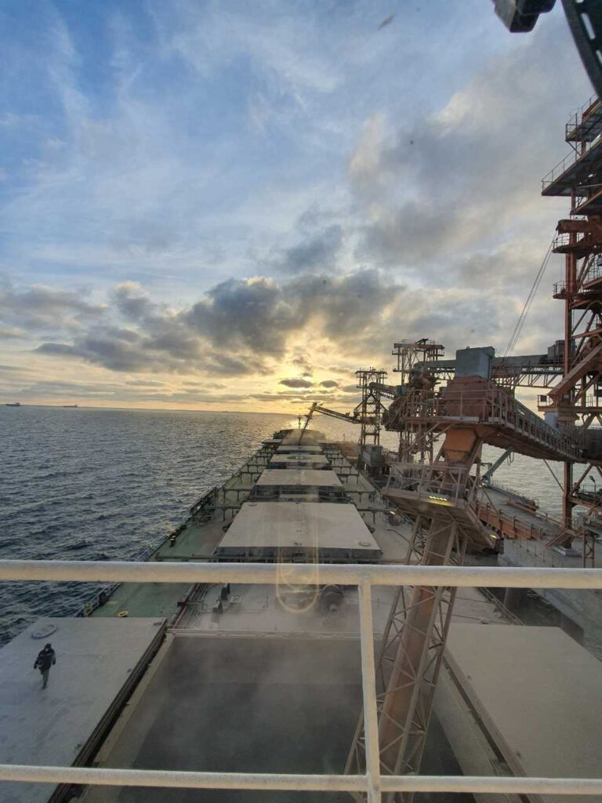 |
|:---:|

|  |
|:---:|

2020.11.30 04:00
But the Tigran Martirosyan bunkerer approached us.
Now we will moor it to ourselves, lean over and start taking fuel from it.

|  |
|:---:|

| 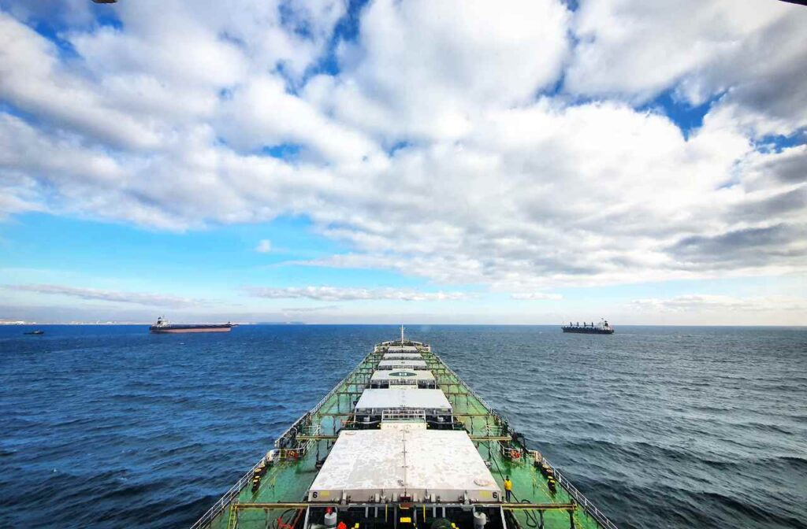 |
|:---:|

We waited all day for the arrival of the guards to let us go.

| 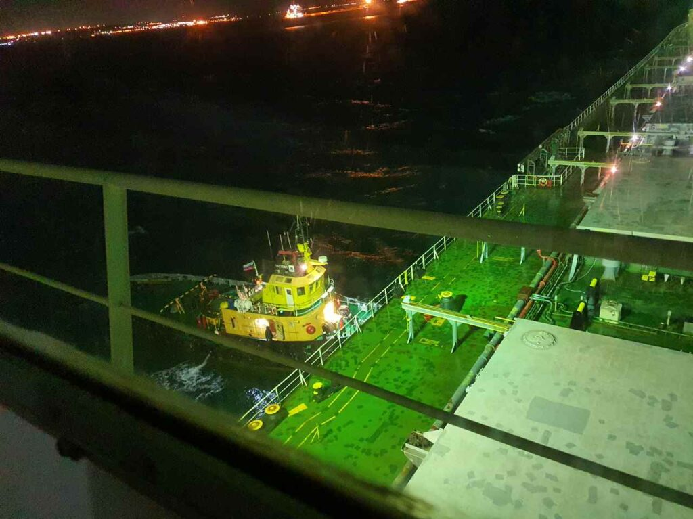 |
|:---:|

_2020.12.01 20:30_
This is where the committee finished its work. There were interesting border guards, poisoned stories, drank beer. However, the wind and the wave rose, xs how they will get off at all.
Soon we will depart and move towards Istanbul, where there will be a crew change.
After that, there will be an unloading somewhere in Egypt, we still do not know where.
Then maybe a renovation. But who knows.

Well, such an exciting November is finally over, and Katsu who writes this is now almost midnight and it's time to sleep) And you also go to bed early, nyashi ^^

I love you ❤️
Everything will be Katsu! 🦊