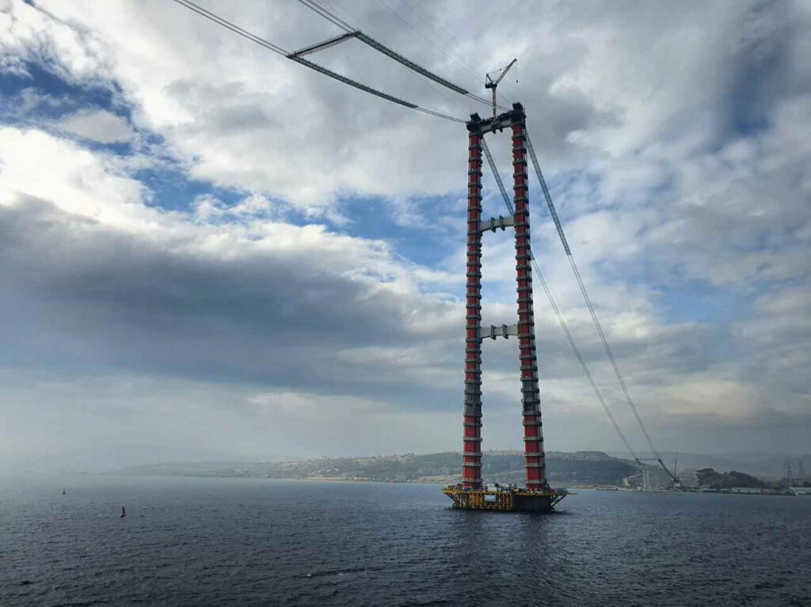
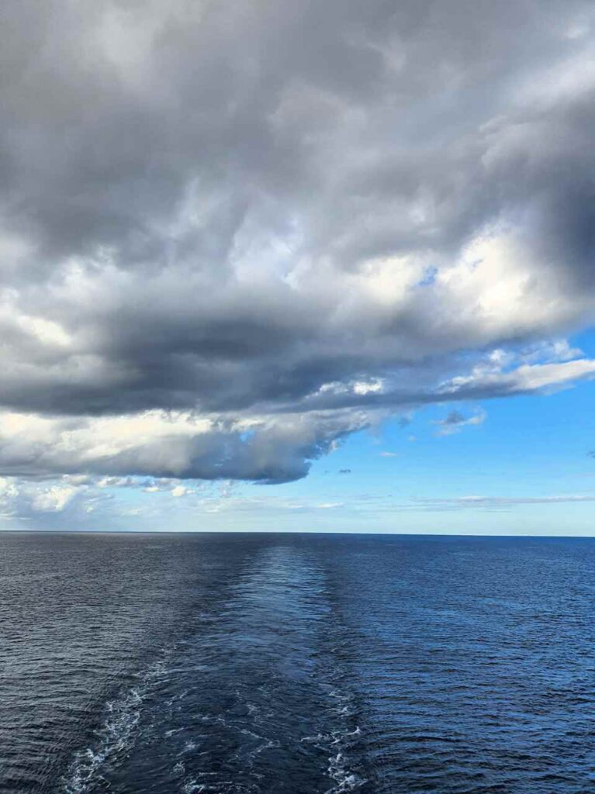
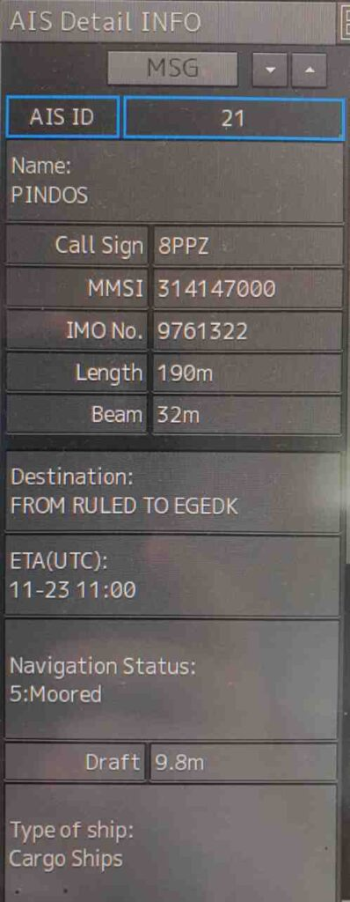
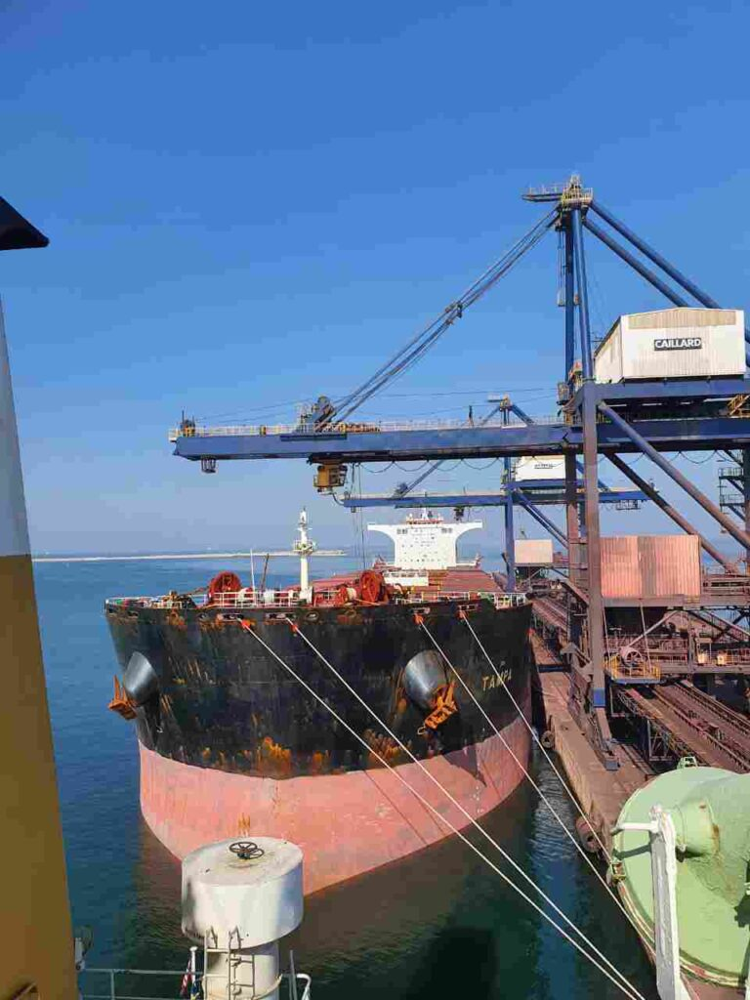
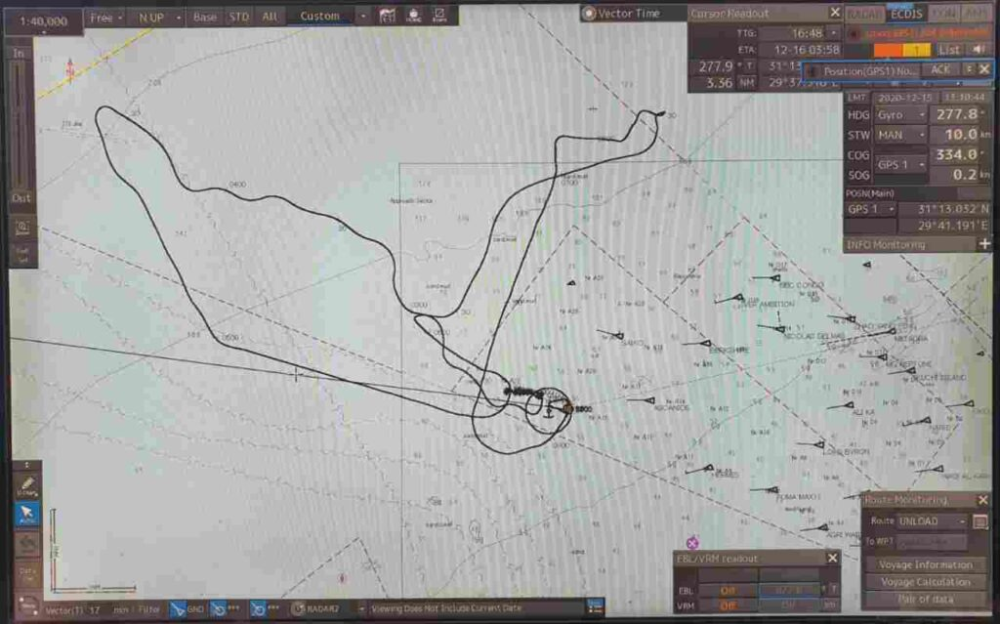
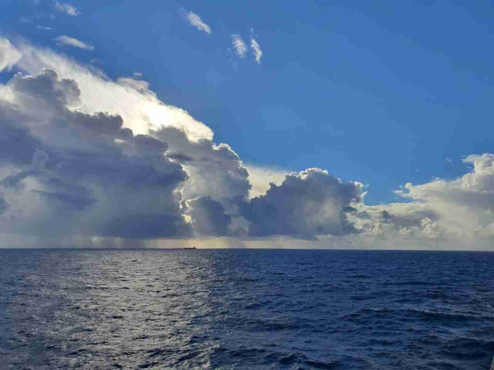
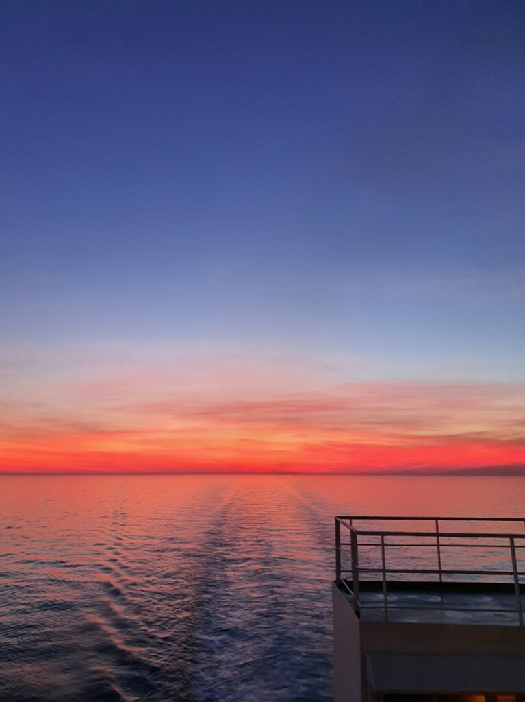
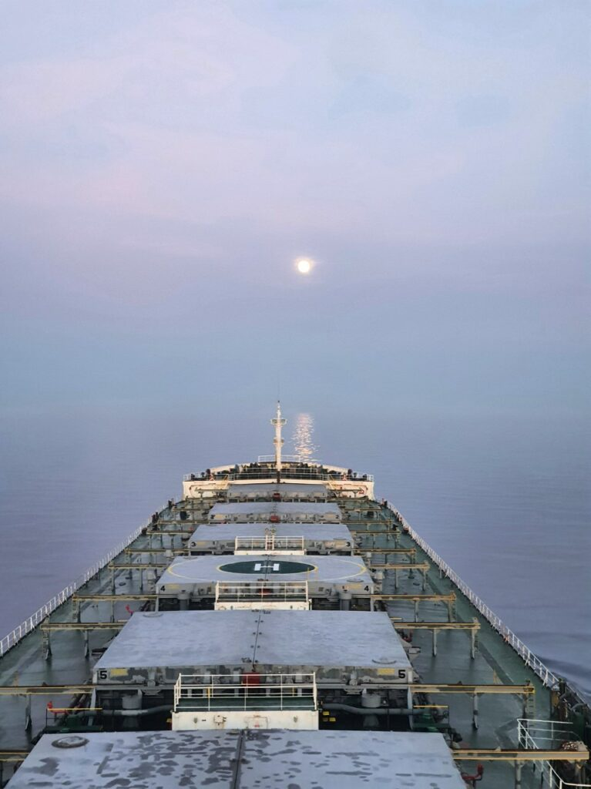
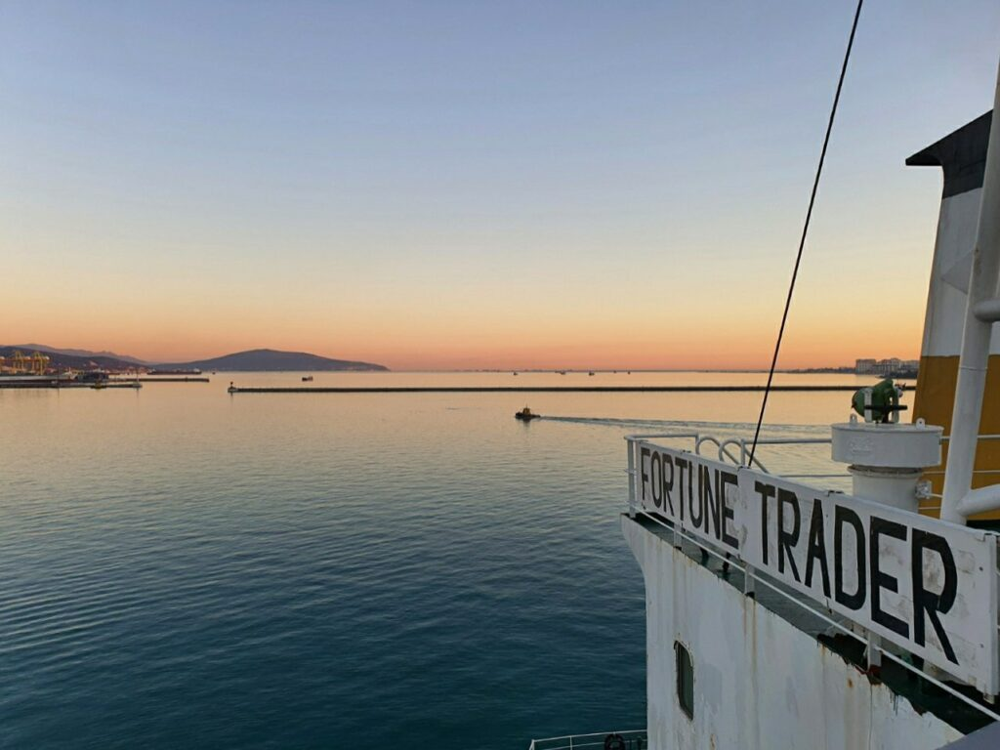

Кацу не може просто взяти і лягти спати, як завжди. Так що вітайте новий пост про грудень 2020 року)

_2020.12.05 00:30_ Всім привіт із цього пароплава.
Ми нарешті пройшли Босфор і Чинакале, не обійшлося без семигодинних вахт через зміну екіпажу.
Ми на ходу змінили 6 людей:

- Старпом
- 3 помічник капітана
- 3 механік
- Електро механік
- Моторист
- Кухар

Загалом на нашому судні працює 24 особи.
Старпом начебто нормальний, йому 31 рік, ми разом розбиралися сьогодні з вантажною програмою, так що може з ним хоч чогось навчуся)
Третій начебто теж нормальний не дивлячись на вік 48 років.
Кухар готує смачніше, ніж старий. Сподіваюся, його вистачить на довше.
Та й свіжа кров все ж таки трохи піднімає настрій, бо коли вже екіпаж збитий, все про що можна було говорити - обговорено, то якось сумніше, чи що.
Зараз ми рухаємось у бік Олександрії, але точний порт вивантаження досі невідомий.

_2020.12.05 13:50_ Новий міст, що будується в протоці Дарданелли Чанаккале. За словами лоцмана, буде готовий через рік та кілька місяців.

|  |  |
| :------------------------------------------------------: | :------------------------------------------------------: |
|  |  |
|  |  |

|  |
| :--------------------------------------------------------------------: |

_2020.12.07 1:05_ Сьогодні 4 місяці, як я на борту FORTUNE TRADER.
Не сказав би, що особливо цьому радий, але в нашому світі взагалі мало хто радий своїй роботі, хе-хе. **UPD:** Ось зараз, працюючи в IT, я радий)
Сподіваюся, у моєму житті настане період, коли я зможу працювати і отримувати від цього задоволення)

_2020.12.08 00:15_
Божечко, врятуйте. Прийшов новий старп, почав піднімати документацію. А старі члени екіпажу нічого не вели.
І ось треба зараз починати все вести і зробити все за старих.
Так і знав, що цим все закінчиться… Тепер ще більше головного болю та марної роботи…
Боже, саме за це я не люблю цю роботу – мільйони марних паперів, які тільки заважають тобі працювати.
І це в той момент, коли в тебе вже покотилося з гірки, і все потроху стає все більше і більше пофіг.

_2020.12.09 22:10_
Всім знову привіт із всеношної вахти від Кацу)
Сьогодні я вийшов об 11-й, починаючи відсилати всякі репорти, з 12 до 16 ніс вахточку, і в 1610 нас викликали зніматися з якоря і йти в порт. У 2100 ми тільки пришвартувалися, а зараз на борту влади. Ну а з 24 до 06 ранку знову вахта.

А тепер найсмішніше. Нас, 225-метровий 75к тонний пароплав загнали… Щоб узяти кілька мішків зерна для аналізів.
Після цього нас знову виженуть на якір на 5 днів, а потім знову пекельне швартування в парі метрів від іншого пароплава, вже для вивантаження.

|  |  |
| :-----------------------------------------------------------------------------------------------: | :------------------------------------------------------: |

_2020.12.10 13:50_
Ось така махіна стоїть позаду нас 300м завдовжки, 45м завширшки та 9 трюмів.
Попереду нас... метрів 10 до берега. Запхали прямо в дірочку. І все заради пари мішків зерна. Та ще 30 блоків сигарет.
Сьогодні близько 17 нас знову виженуть на якір.

_2020.12.11 03:00_

Ось ми знову стоїмо на якірній.
А я знову потрапив на всенічну з 11 ранку до 4 ночі, мох.
Таке почуття, що мене хоч вичавити як лимон на цитрусовій соковижималці.

З самого полудня ми писали агенту, мовляв, коли буде лоцман для відходу, але він нас ігнорував.
У результаті 1800 підходить лоцманський катер, висаджується лоцман, а ми взагалі не готові. Машина дуже швидко за 20 хвилин приготувалася до ходу і ми ще півгодини чекали листа від агента з дозволом на вихід з порту. Після відшвартування ми ще 3 години йшли на якірну, а тут залишилися вільні місця тільки на глибинах близько 60 метрів, що не дуже добре.

А ще вдень приходив поліцейський і казав, що на судні брудно – тому дайте нам цигарок, хоча бруд – через те, що нас, зерновоз, поставили на причал із рудою, і пил потрапляв на палубу. Але я міг відмовитися, що у нас ні цигарок, ні чаю, ні кави немає. Срані жебраки.
У нас уже майже весь екіпаж ледве стримується, щоб не вчепитися цим виродкам у горло.

_2020.12.12 12:15_
Привіт усім із рейду Олександрії.
Сьогодні у нас захворів кухар. Температура 37, нежить. На судні дуже холодно, тож не дивно. Я рятуюсь калорифером, знайденим у шафі, а ось решті сумно.
Обід готував сьогодні один із матросів, а боцман пектиме хліб.
В принципі, їжа вийшла дуже смачною.
За станом кухаря зараз стежить старпом.
Fortune Trader – ні дня без пригод!

|  |  |
| :------------------------------------------------------: | :------------------------------------------------------: |

_2020.12.15 13:20_
Сьогодні вночі нас потягло і навіть додатково спущені 2 смички по 27,5 м якірного ланцюга не допомогли нам, тому довелося зніматися з якоря і лягати дрейфувати. Вітер був 35-40 вузлів із поривами до 45, хвиля 3-4 метри. Здавалося б, хіба це має бути проблемою для навантаженого 75 тисячного пароплава? Але китайці так не гадають.
Навіть коли ми йшли Slow Ahead, де задіяна половина потужності двигуна - ми не могли розвинути більше двох вузлів.
І про які океанські переходи можна говорити на цьому судні?
На моєму старому судні 9 тис тонн потужність двигуна була 5к кВт, а тут махіна 75 тисяч тонн має двигун… 8к кВт!
Але зараз ми стоїмо на якорі, вітер трохи зменшився, близько 30 вузлів, але з цим пароплавом ні в чому не можна бути впевненим.

|  |
| :------------------------------------------------------: |

|                                                                                                  |           |
| :------------------------------------------------------------------------------------------------------------------------------------------------------: | :---------------------------------------------------------------: |
|  |  |

_2020.12.17 14:40_
Нам хочуть зробити перевірку класу прямо тут, в Олександрії, так що є дуже велика ймовірність, що в жодному dry dock ми не підемо, а зробимо ще один рейс типу "Чорне море - якась арабська країна". Але тут загадувати наперед немає сенсу, це все "subject to change".
Вчора знову потрапив на всенічну, спочатку вахта, потім швартування, владу та документи і знову вахту. Араби прямо люблять цю справу, викликають нас рівно в 1610 вже вкотре.
**UPD**: як виявилося згодом, усі служби (лоцмана, швартувальники та ін.) отримують у два рази більше грошей за нічне проведення, як overtime, тому вдень у принципі не заводять пароплави.

|  |
| :---------------------------------------------: |

_2020.12.18 00:35_
Ось і можливі дані наступної ходки.
А у Новоросі до нас у будь-якому випадку прийде PSC Paris MOU. Ну хоча б це не Тамань із її причалом у відкритому морі. Далі, Ель-Декіла з її подвійним заходом у порт.
А тільки потім вже знову на ремонт ... Можливо, є можливість отримати документи класу прямо тут, в Єгипті.

_2020.12.20 03:00_
Тим часом, доки я сиджу тут, на судні в процесі вивантаження зерна, світ продовжує жити далі.
Моє місто дуже красиво прикрасили зараз, проводять паради, при тому, що карантинні вимоги лише посилили.
Хтось зараз працює на заводі, чи в кабінеті міністрів, пише код, навчається у школі, чи перебуває на одному з військових фронтів.
А деякі люди отримують задоволення від сну, розваг, кохання чи просто від життя.
Світ настільки багатогранний.
Чомусь просто захотілося написати щось таке)

_2020.12.22 19:10_
Часом люди творять зовсім незрозумілі речі. Або зрозумілі, але неймовірно дурні.
Мене дуже вражає божевілля людей на доступі до [інтернету] (https://telegra.ph/Iz-za-interneta-v-tyurmu-12-22) в сучасному світі.

2020.12.24 00:50
Привіт, ми вже добу йдемо середземкою.
Зараз у нас дуже сильний зустрічний Північно-Західний вітер, тому йдемо ми від сили 8 вузлів на повному ходу.
Цей захід до Єгипту був дуже виснажливим.
На два заходи було витрачено півтора (!) ящики сигарет: лоцманам, владі, буксирам та швартувальникам.
При тому, якщо не дати цих цигарок - то робитимуть купу проблем та пакостей. Буксир може порвати швартовний кінець, а лоцман підставити рульового, про можливі пакості від влади і говорити нічого, тисячі їх.
Стивідори, які займалися вивантаженням дуже багато крові попили і навіть змусили набирати баласт у 4 трюм (загалом їх 7, і центральний може використовуватися для взяття баластної води), тому що їхній навантажувач не міг нормально увійти в трюм під кінець вивантаження.
Наприкінці вантажоодержувач намагався грубо обдурити майстра, заявивши, що з них судно недодало 222 тонни вантажу, і вимагав тисячу американськими президентами. Однак у нас виявився лист, у якому зазначено, що судно жодної відповідальності за вантаж не несе. Але нерви були витрачені.
Також у нас була класова інспекція регістру ABS. Теж - дві безсонні доби.
Знайшов кілька зауважень, які було вирішено завдяки злагодженій роботі екіпажу. Однак усі дуже втомилися. При цьому матросам доводиться одразу після такого важкого порту замивати трюми, бо у Чорному морі вже мінусові температури.

Та й у мене самого сил уже практично немає, голова просто не тримає жодних думок, при тому що ніякого відпочинку чи вихідного не передбачається ще мінімум з місяць-два.
Зараз ми прямуємо до турецьких проток, де отримаємо постачання, а потім - у Новоросійськ, де проводитиметься навантаження лише 49к тонн пшениці.
А ще до нас приїде PSC Paris MOU. Ура, знову перевірка! І потім знову до цього Єгипту.
Цікаво, чи в Ізраїльську армію набирають не євреїв?
Також безліч проблем походить від компанії та її друзів. Так як греки всюди шукають греків, то де б ми не були у нас завжди все погано, адже греки надають найгірше можливе обслуговування.
Провайдер інтернету – грек – постійні вильоти.
Провайдер карток та коректури - грек - постійні проблеми з коректурою карток (на відміну від книг, які оновлюються через англійців).
Постачальники запчастин та провізії – греки – замість борошна привезли до нас шпаклівку, тож капітан був змушений купувати борошно в Єгипті за нечувані 1,5 долара за кг.
Що я можу сказати, не ходіть, дітки, до греків працювати. Флот зараз загалом стає з кожним роком дедалі гіршим і гіршим. А у греків так взагалі дупа. І, до речі, у мене далеко не найгірший випадок, часто буває ще гірше.
Мені залишається тільки молитися Великій Богині, щоб мені вистачило сил перенести ці труднощі.

|  |  |  |
| :------------------------------------------------------: | :---------------------------------------------------------------------: | :------------------------------------------------------: |

|  |  |  |
| :------------------------------------------------------: | :------------------------------------------------------: | :------------------------------------------------------: |

_2020.12.30 03:45_ Ми стали на якір у порту Новоросійськ. Росіяни офігелі, завтра Новий Рік, а вони сьогодні заганяють нас сьогодні і хочуть завантажити за два дні 50 тонн зерна. Знову на Єгипет. До того ж вантажать непогане зерно, на відміну від фуражу, яким годують народ. Типова для країн СНД розвага.
Ми сподівалися хоча б постояти числа до 2, але Новий Рік скасовується.
Скотська робота ця, все-таки. Усі думають про прибутки, але ніхто не думає про людей. Хоча, швидше, цей час зараз скотарський.
Все що нам залишається, це виносити цей тягар.

|  |                   |  |
| :------------------------------------------------------: | :-----------------------------------------------------------------------: | :------------------------------------------------------: |
|  |                   |  |
|  |  |                                                          |

Десь недалеко 1986 року 31 серпня затонув пасажирський теплохід Адмірал Нахімов, на якому працювали мої батьки.
З ними все в порядку, але багатьох людей не вдалося врятувати.

|  |
| :------------------------------------------------------: |

_2020.12.31 10:30_
Тим часом навантаження вже наближається до свого завершення.
Старпом просто офігував учора, адже позавчора за місцевими екологічними вимогами йому треба було злити весь баласт із середземного моря та набрати чорноморський.
**UPD:** само собою, екологи просто хотіли гроші)
А зараз дуже швидко злити його в порту при тому, що продуктивність насоса від сили 600 тонн на годину, а вантажити 1600 на годину вантажу.
50к тонн більше ніж за добу, можете собі уявити? З кожного навантажувача щомиті видається по п'ять мішків зерна.

_2020.12.31 15:10_

|  |
| :-----------------------------------------------------------------------------------------------------------------------------------------------------------------------------------------------------------------------: |

_2020.12.31 20:00_
Дорогі мої передплатники, серед вас є і мої родичі, і близькі друзі та дуже добрі знайомі.
Дякую вам, за вашу підтримку цього нелегкого року.
2020 рік відзначився безліччю поганих речей, але у всьому поганому треба завжди шукати і щось хороше.
Я хочу побажати вам наступного року найголовнішого – здоров'я, щоб нам усім не доводилося ховатися по хатах і виходити на вулицю в масках у страху штрафів. Щоб усі мали змогу працювати на роботі, яка подобається, та відпочивати там де хотілося б. Просто бути щасливими людьми)

З наступаючим 2021 роком!

А на цій радісній ноті я закінчу пост сьогодні)
У наступному та заключному я опишу як ми святкували Новий Рік (не увійшло до оригінального контенту каналу), а також знову будуть історії про Єгипет та Росію.

Люблю вас ❤️

Все буде Кацу! 🦊
