Кацу не может просто взять и лечь спать, как обычно. Так что приветствуйте новый пост про декабрь 2020го года)

_2020.12.05 00:30_ Всем привет с этого парохода.
Мы наконец прошли Босфор и Чинакале, не обошлось без семичасовых вахт, по причине смены экипажа.
Мы на ходу сменили 6 человек:

* Старпом
* 3 помощник капитана
* 3 механик
* Электро механик
* Моторист
* Повар

Всего на нашем судне работает 24 человека.
Старпом вроде нормальный, ему 31 год, мы вместе разбирались сегодня с грузовой программой, так что может с ним хоть чему-то научусь)
Третий вроде тоже нормальный не смотря на возраст в 48 лет.
Повар готовит вкуснее, чем старый. Надеюсь, его хватит на подольше.
Да и свежая кровь все же немного поднимает настроение, ибо когда уже экипаж сбитый, все о чем можно было говорить - обсуждено, то и как-то более тоскливо, что ли.
Сейчас мы движемся в сторону Александрии, но точный порт выгрузки до сих пор неизвестен.

_2020.12.05 13:50_ Новый мост, строящийся в проливе Дарданеллы Чанаккале. По словам лоцмана, будет готов через год и пару месяцев.

|  |  |
|:---:|:---:|
| 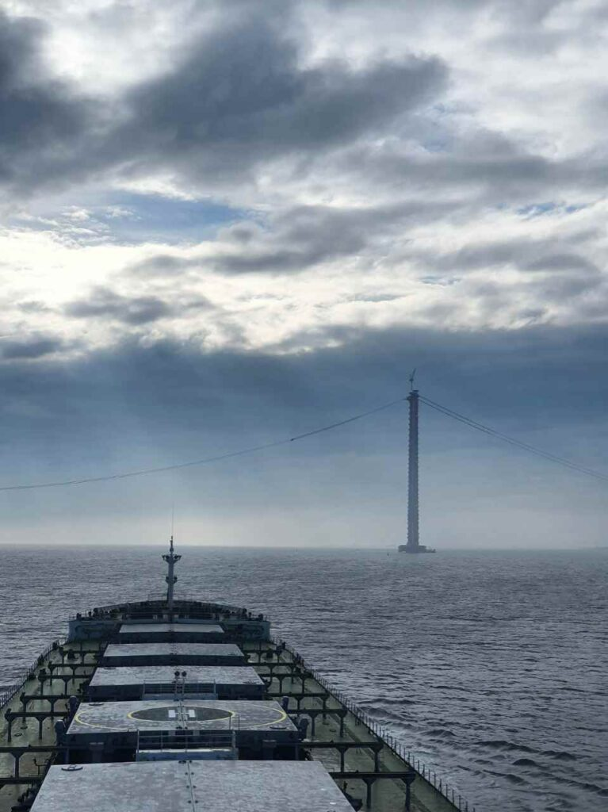 | 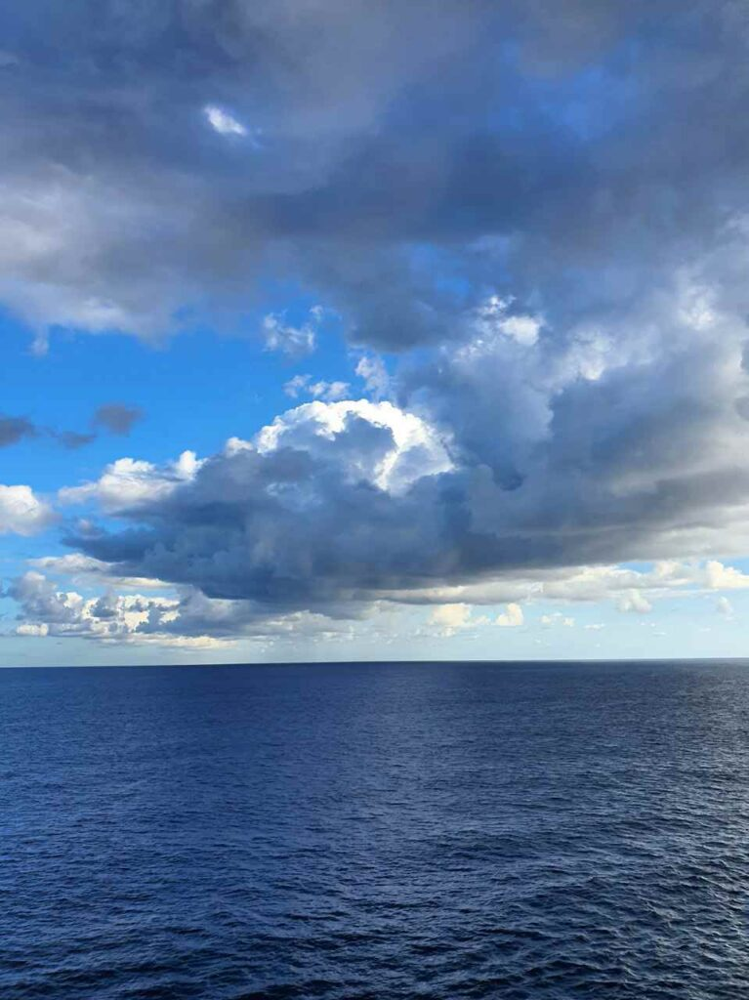 |
| 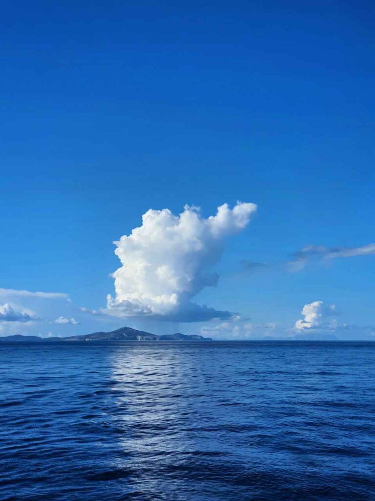 |  |

| 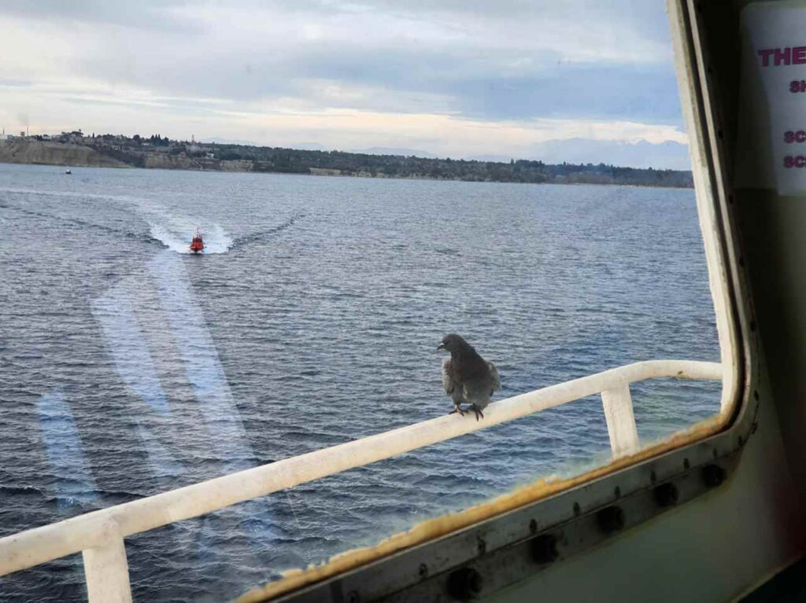 |
|:---:|

_2020.12.07 01:05_ Сегодня 4 месяца, как я на борту FORTUNE TRADER.
Не сказал бы что особо этому рад, но в нашем мире вообще мало кто рад своей работе, хе-хе. **UPD:** Вот сейчас, работая в IT, я рад)
Надеюсь, в моей жизни настанет период, когда я смогу работать и получать от этого удовольствие)

_2020.12.08 00:15_
Божечки, спасите. Пришел новый старпом, начал поднимать документацию. A cтарые члены экипажа ничего не вели.
И вот надо сейчас начинать все вести и сделать все за старых.
Так и знал, что этим все закончится… Теперь еще больше головной боли и бесполезной работы…
Боже, именно за это я не люблю эту работу - миллионы бесполезных бумаг которые только мешают тебе работать.
И это в тот момент когда у тебя уже покатилось с горки, и все понемногу становится все больше и больше пофиг.

_2020.12.09 22:10_
Всем снова привет со всенощной вахты от Кацу)
Сегодня я вышел в 11, начиная отсылать всякие репорты, с 12 до 16 нес вахточку, и в 1610 нас вызвали сниматься с якоря и идти в порт. В 2100 мы только пришвартовались, а сейчас на борту власти. Ну а с 24 до 06 утра снова вахта.

А теперь самое смешное. Нас, 225 метровый 75к тонный пароход загнали… Чтобы взять несколько мешков зерна для анализов.
После этого нас снова выгонят на якорь на дней 5, а затем снова адская швартовка в паре метров от другого парохода, уже для выгрузки.

|  |  |
|:---:|:---:|

_2020.12.10 13:50_
Вот такая махина стоит позади нас 300м в длину, 45м в ширину и 9 трюмов.
Впереди же нас… метров 10 до берега. Запихнули прямо в дырочку. И все ради пары мешков зерна. Ну и еще 30 блоков сигарет.
Сегодня около 17 нас снова выгонят на якорь…

_2020.12.11 03:00_

Вот мы снова стоим на якорной.
А я снова попал на всенощную с 11 утра до 4 ночи, мх.
Такое чувство, что меня хотя выжать как лимон на цитрусовой соковыжималке.

С самого полудня мы писали агенту, мол когда будет лоцман для отхода, но он нас игнорил.
В итоге в 1800 подходит лоцманский катер, высаживается лоцман, а мы ж вообще не готовы. Машина очень быстро за 20 минут приготовилась к ходу и мы еще с пол часа ждали письма от агента с разрешением на выход из порта. После отшвартовки мы еще часа 3 шли на якорную, а тут остались свободные места только на глубинах около 60 метров, что не очень хорошо.

А еще днем приходил полицейский и говорил что на судне грязно - поэтому дайте нам сигарет, хотя грязь - из-за того что нас, зерновоз, поставили на причал с рудой, и пыль попадала на палубу. Но я смотг отговориться, что у нас ни сигарет, ни чая, ни кофе нет. Сраные попрошайки.
У нас уже почти весь экипаж еле сдерживается, чтобы не вцепится этим уродам в горло.

_2020.12.12 12:15_
Привет всем с рейда Александрии.
Сегодня у нас заболел повар. Температура 37, насморк. На судне очень холодно, так что не удивительно. Я спасаюсь калорифером, найденным в шкафу, а вот остальным печально.
Обед готовил сегодня один из матросов, а боцман будет печь хлеб.
В принципе, еда получилась очень вкусной.
За состоянием повара сейчас следит старпом.
Fortune Trader - ни дня без приключений!

| 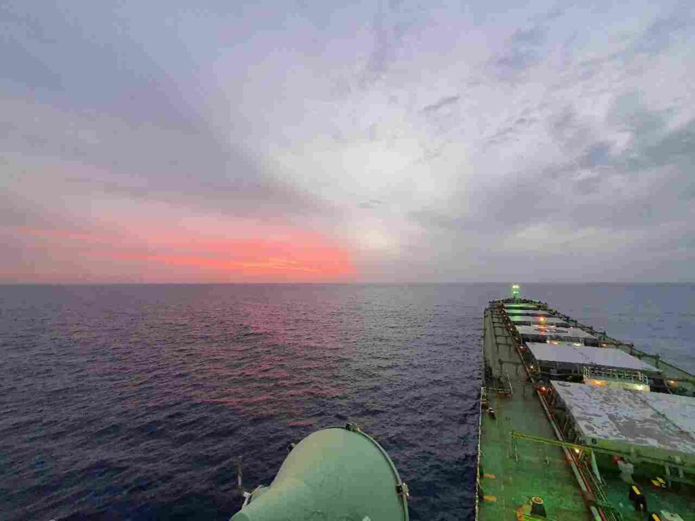 |  |
|:---:|:---:|

_2020.12.15 13:20_
Сегодня ночью нас потащило и даже дополнительно спущенные 2 смычки по 27,5м якорной цепи не помогли нам, так что пришлось сниматься с якоря и ложиться дрейфовать. Ветер был 35-40 узлов с порывами до 45, волна 3-4 метра. Казалось бы, разве это должно быть проблемой для груженного 75 тысячного парохода? Но китайцы так не думают.
Даже когда мы шли Slow Ahead, где задействуется половина мощности двигателя - мы не могли развить больше двух узлов.
И о каких океанских переходах можно говорить на этом судне?
На моем старом судне в 9 тыс тонн мощность двигателя была 5к кВт, а тут махина в 75 тысяч тонн имеет двигатель… 8к кВт!
Но сейчас мы стоим на якоре, ветер немного поубавился, около 30 узлов, но с этим пароходом уже ни в чем нельзя быть уверенным.

| 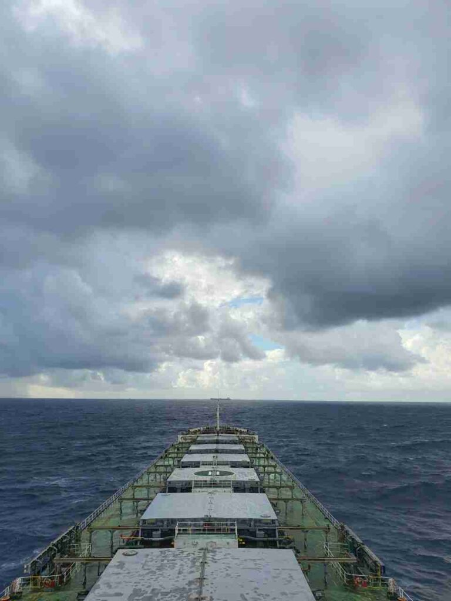 |
|:---:|

|  |  |
|:---:|:---:|
| 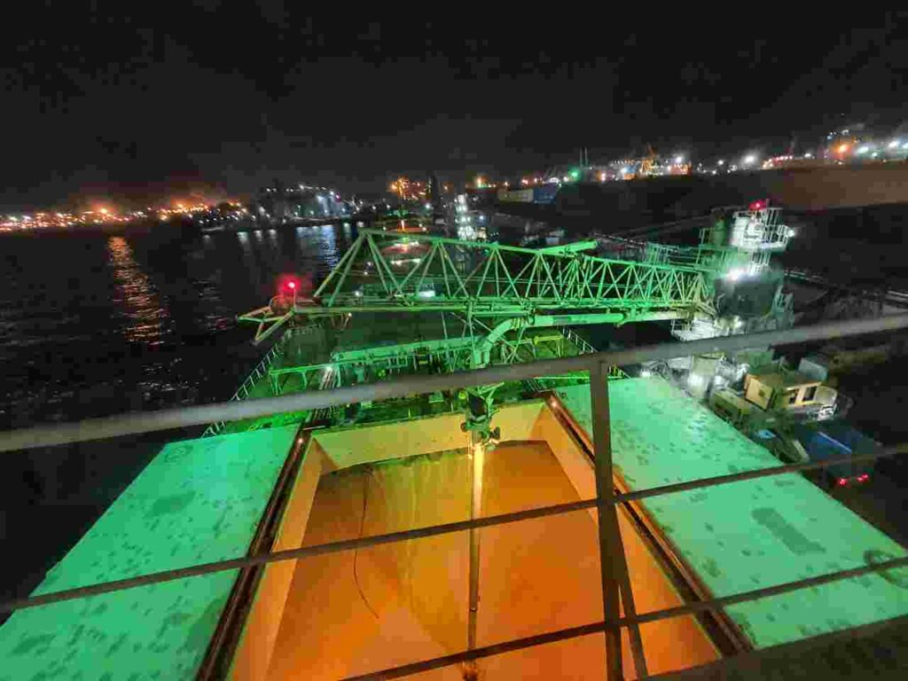 | |

_2020.12.17 14:40_
Нам хотят сделать проверку класса прямо тут, в Александрии, так что есть очень немалая вероятность, что ни в какой dry dock мы не пойдем, а сделаем еще один рейс типа "Черное море - какая-то арабская страна". Но тут загадывать наперед нет смысла, это все "subject to change".
Вчера снова попал на всенощную, сначала вахта, потом швартовка, власти и документы и снова вахта. Арабы прям любят это дело, вызывают нас ровно в 1610 уже в который раз.
**UPD**: как оказалось впоследствии, все службы (лоцмана, швартовщики и др), получают в два раза больше денег за ночную проводку, как overtime, поэтому днем в принципе не заводят пароходы.

|  |
|:---:|

_2020.12.18 00:35_
Вот и вероятные данные следующей ходки.
А в Новоросе к нам в любом случае придет PSC Paris MOU. Ну хотя бы это не Тамань с ее причалом в открытом море. Далее, Эль-Декила с ее двойным заходом в порт.
А только потом уже снова на ремонт… Может быть, ведь есть вероятность получить документы класса прямо тут, в Египте.

_2020.12.20 03:00_
Тем временем, пока я сижу тут, на судне в процессе выгрузки зерна, мир продолжает жить дальше.
Мой город очень красиво украсили сейчас, проводят парады, при том что карантинные требования только усилили.
Кто-то сейчас работает на заводе, или в кабинете министров, пишет код, учится в школе, или находится на одном из военных фронтов.
А некоторые люди получают удовольствие от сна, развлечений, любви или просто от жизни.
Мир столь многогранен.
Почему-то просто захотелось написать что-то такое)

_2020.12.22 19:10_
Порою, люди творят совершенно необъяснимые вещи. Или объяснимые, но невероятно глупые.
Меня очень поражает помешательство людей на доступе к [интернету](https://telegra.ph/Iz-za-interneta-v-tyurmu-12-22) в современном мире.

2020.12.24 00:50
Привет, мы уже сутки идём по средиземке.
Сейчас у нас очень сильный встречный Северо-Западный ветер, так что идем мы от силы 8 узлов на полном ходу.
Этот заход в Египет был очень изнуряющим.
На два захода было потрачено полтора(!) ящика сигарет: лоцманам, властям, буксирам и швартовщикам.
При том, если не дать этих сигарет - то будут делать кучу проблем и пакостей. Буксир может порвать швартовный конец, а лоцман подставить рулевого, про возможные пакости от властей и говорить нечего, тысячи их.
Стивидоры, которые занимались выгрузкой очень много крови попили и даже заставили набирать балласт в 4 трюм (всего их 7, и центральный может использоваться для взятия балластной воды), потому что их погрузчик не мог нормально войти в трюм под конец выгрузки.
В конеце грузополучатель пытался грубо обмануть мастера, заявив, что по их всем судно недодало 222 тонны груза, и вымогал тысячу американскими президентами. Однако у нас оказалось письмо, в котором указано, что судно никакой ответственности за груз не несет. Но нервы были потрачены.
Так же у нас была классовая инспекция регистра ABS. Тоже - двое бессонных суток.
Нашел несколько замечаний, которые были решены благодаря слаженной работе экипажа. Однако все очень устали. При этом матросам приходится сразу после такого тяжелого порта замывать трюма, потому что в Черном море уже минусовые температуры.

Да и у меня самого сил уже практически нет, голова просто не держит никакие мысли, при том что никакого отдыха или выходного не предвидится еще минимум с месяц-два.
Сейчас мы следуем к турецким проливам, где получим снабжение, а после - в Новороссийск, где будет проводиться погрузка всего лишь 49к тонн пшеницы.
А еще к нам приедет PSC Paris MOU. Ура, опять проверка! И потом снова в этот Египет.
Интересно, в Израильскую армию набирают не евреев?
Так же множество проблем происходит от компании и ее друзей. Так как греки везде ищут греков, то где бы мы ни были у нас всегда все плохо, ведь греки предоставляют худшее возможное обслуживание.
Провайдер интернета - грек - постоянные вылеты.
Провайдер карт и корректуры - грек - постоянные проблемы с корректурой карт (в отличии от книг, которые обновляются через англичан).
Поставщики запчастей и провизии - греки - вместо муки привезли к нам шпаклевку, так что капитан был вынужден покупать муку в Египте за баснословные 1,5 доллара за кг.
Что я могу сказать, не ходите, детки, к грекам работать. Флот сейчас в целом становится с каждым годом все хуже и хуже. А у греков так вообще задница. И, кстати, у меня далеко не самый худший случай, довольно часто бывает еще хуже.
Мне остается только молиться Великой Богине, дабы мне хватило сил перенести эти трудности.

|  | 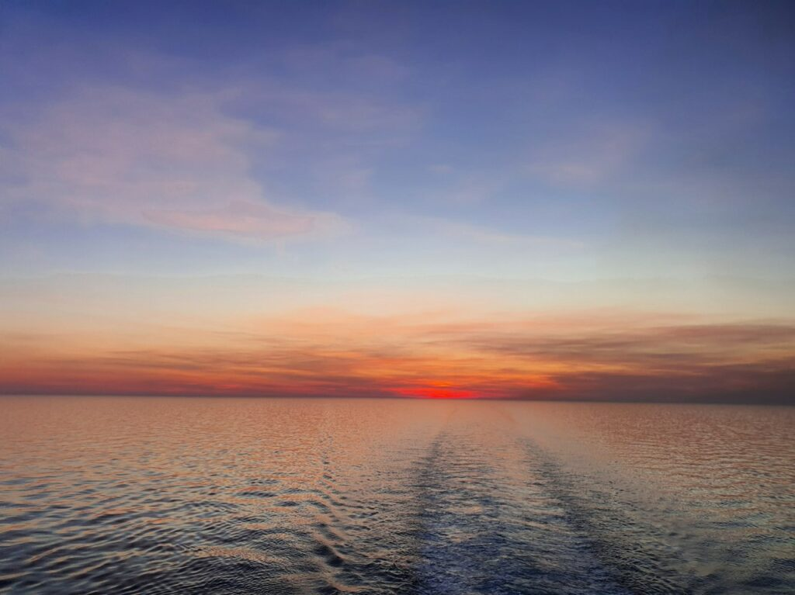 |  |
|:---:|:---:|:---:|

|  |  |  |
|:---:|:---:|:---:|

_2020.12.30 03:45_ Мы встали на якорь в порту Новороссийск. Россияне офигели, завтра Новый Год, а они сегодня загоняют нас сегодня и хотят загрузить за два дня 50к тонн зерна. Снова на Египет. При чем грузят неплохое зерно, в отличии от фуража, которым кормят народ. Типичное для стран СНГ развлечение.
Мы надеялись хотя бы постоять числа до 2, но Новый Год отменяется.
Скотская работа эта, все же. Все думают о прибылях, но никто не думает о людях. Хотя, скорее, это время сейчас скотское.
Все что нам остается, это выносить это бремя.

| 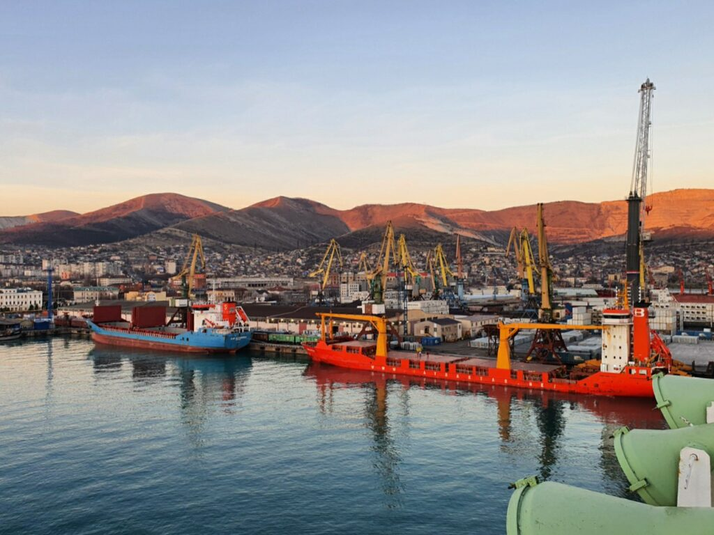 |  |  |
|:---:|:---:|:---:|
| 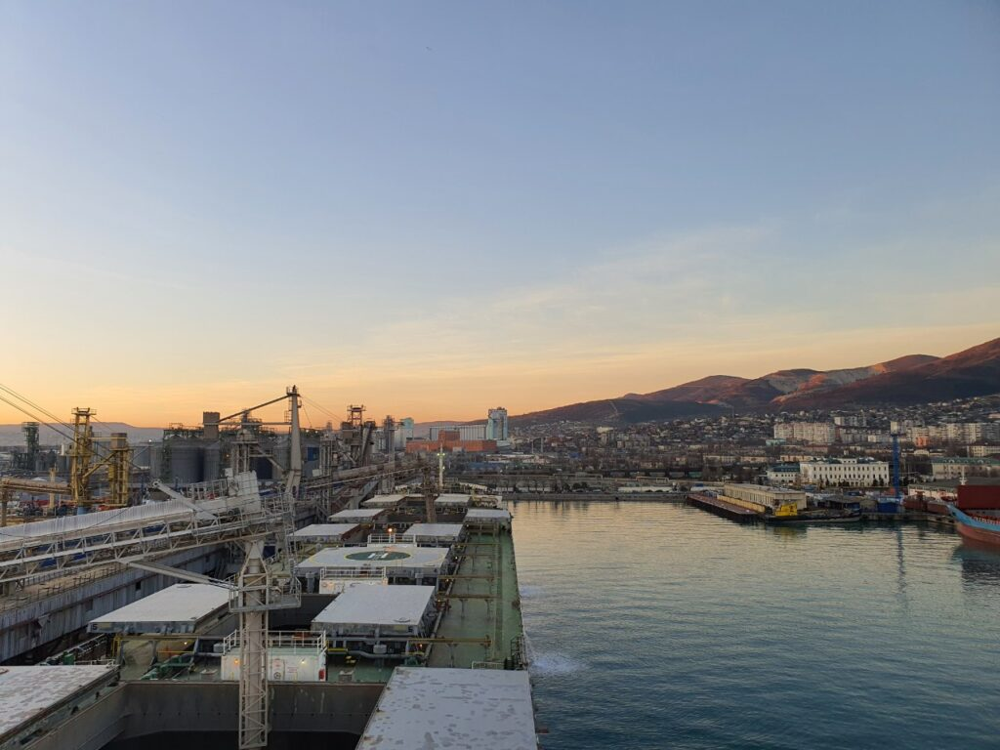 |  | 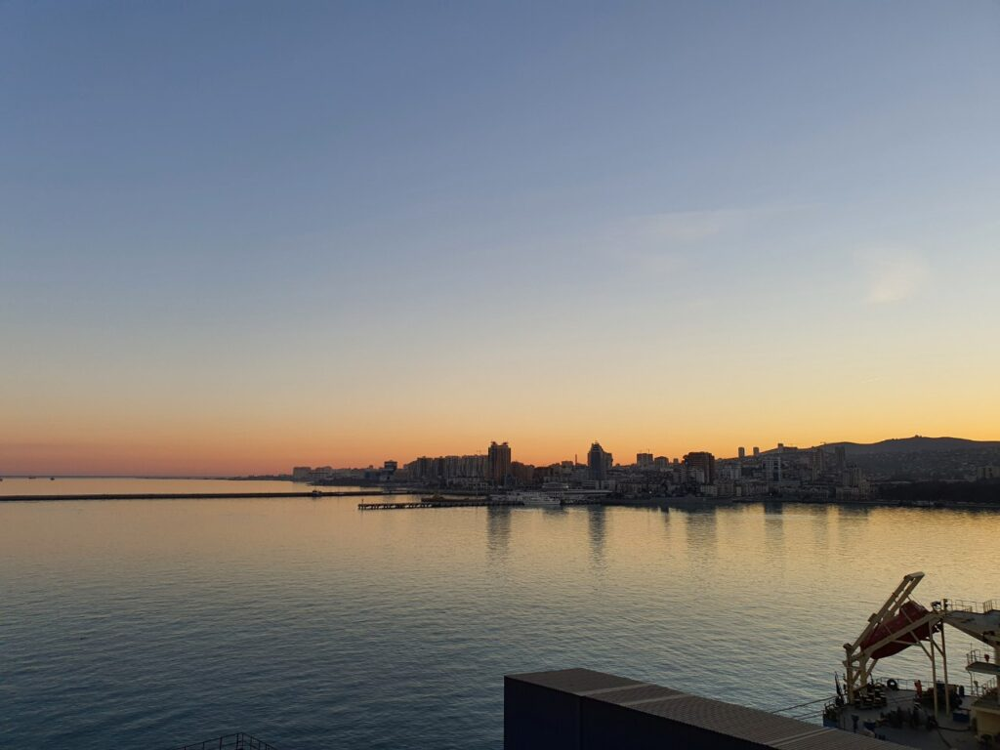 |
|  |  | |

Где-то тут недалеко в 1986 году 31 августа затонул пассажирский теплоход Адмирал Нахимов, на котором работали мои родители.
С ними все впорядке, но вот многих людей не удалось спасти.

| 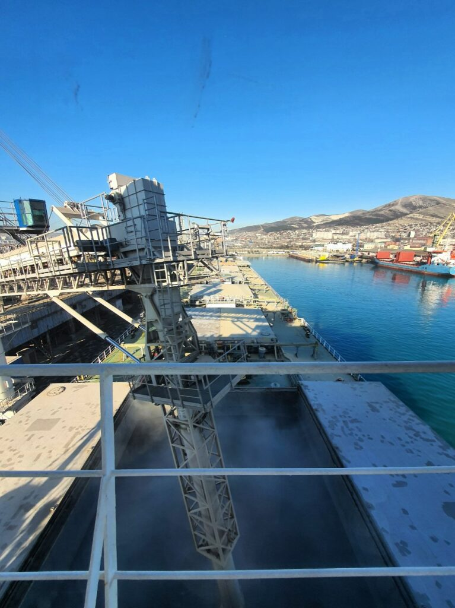 |
|:---:|

_2020.12.31 10:30_
Тем временем то погрузочка уже близится к своему завершению.
Старпом просто офигевал вчера, ведь позавчера по местным экологическим требованиям ему надо было слить весь балласт из средиземного моря и набрать черноморский.
**UPD:** само собой, экологи просто хотели денежку)
А сейчас очень быстро слить его в порту при том что производительность насоса от силы 600 тонн в час, а грузить 1600 в час груза.
50к тонн больше чем за сутки, можете себе такое представить? С каждого погрузчика ежесекундно выдается по пять мешков зерна.

_2020.12.31 15:10_

|  |
|:---:|

_2020.12.31 20:00_
Дорогие мои подписчики, среди вас есть и мои родственники, и близкие друзья и очень хорошие знакомые.
Спасибо вам, за вашу поддержку в этом нелегком году.
2020-й год отметился множеством нехороших вещей, но во всем плохом надо всегда искать и что-то хорошее.
Я хочу пожелать вам в следующем году самого главного - здоровья, чтобы нам всем не приходилось прятаться по домам и выходить на улицу в масках в страхе штрафов. Чтобы все имели возможность работать на работе, которая нравится, и отдыхать там где хотелось бы. Просто быть счастливыми людьми)

С наступающим 2021-м годом!

А на сей радостной ноте я закончу сегодняшений пост)
В следующем и заключительном я опишу как мы праздновали Новый Год (не вошло в оригинальный контент канала), а также снова будут истории про Египет и Россию.

Люблю вас ❤️

Все будет Кацу! 🦊
