The New Year is a special time that means restarting life, at least I would like to think so) In 2021, I met him on a steamer, anchored in the roadstead of the port of Novorossiysk.
It was not so bad, we celebrated with a close-knit deck crew, but immediately after midnight my watch began, I had to make sure that the anchor held well, which I did. I took a projector with good sound to the bridge and listened to the osts from Monogatari for several hours)

_2021.01.01 20:38_ The border guards of the Russian Federation are already on board and are registering the crew, there is very little time left and we will go to the open sea.
The weather is expected to be good, so we have about 38 hours to reach the Bosphorus, at a speed of 11. But usually we travel along the Black Sea at a speed of 12-12.5, so we will arrive quickly.

On the first of January, the most terrible thing happened. We had 5 bottles of Iceberg, two bottles of champagne and a case of beer. And also red fish and feta for a snack, yes, the Greeks at least respected the New Year) As a result, I ended up in such a state that I could not go on shift. In the morning I felt so bad that I could not drink, eat, think, or do anything else. But it was fun, with music and good company)

On the morning watch, the captain of the sympathizers looked at me, but said that I did the right thing, that I warned 3RMB that I could not come.

| 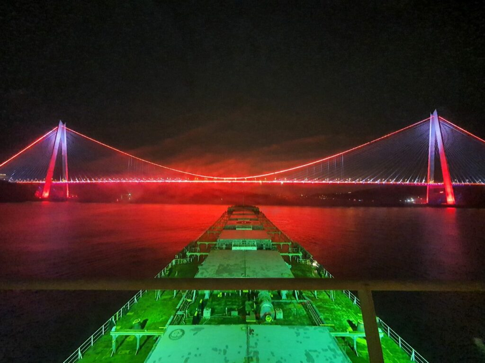 |
| :--------------------------------------------------------: |

_2021.01.04 04:15_ Hello everyone from Istanbul. We have been drifting since lunch, but we have already passed under the first bridge of the Bosphorus.

|  |  |
| :------------------------------------------------------: | :------------------------------------------------------: |

_2021.01.07 02:00_
We are already on the approaches to the port of Damietta in Egypt.
The last couple of days I feel a terrible decline in strength, I can hardly manage to work, and I don’t have enough for anything else.
I’m already trying to sleep more, eat vitamins and everything that will happen to me now in the port, I don’t even know, and I’m barely dragging my legs.
We must go to the port to the inner anchorage, where they will take samples of the cargo from us, after which, in a couple of days, they will put it on the pier and begin unloading.

|  |  |
| :----------------------------------------------------------------------------------: | :------------------------------------------------------: |

|  |  |
| :------------------------------------------------------: | :------------------------------------------------------: |

| 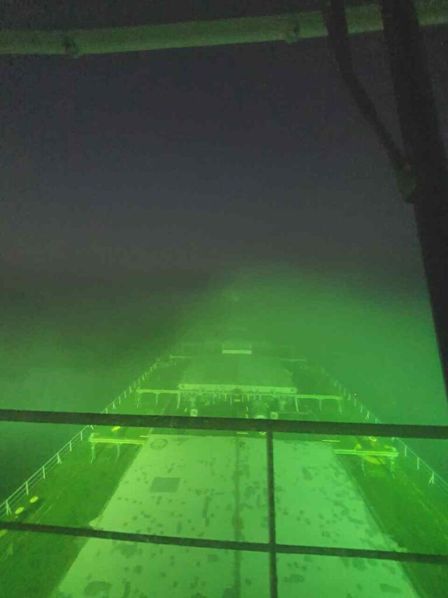 | 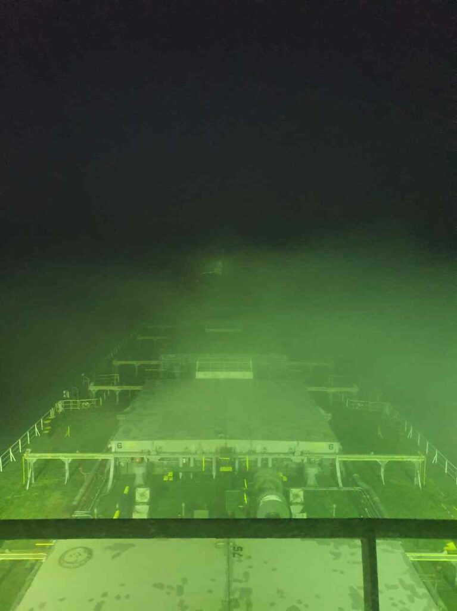 |
| :------------------------------------------------------: | :------------------------------------------------------: |

_2021.01.07 18:40_
This is what we were met at the exit from the port of Damietta.
We were nevertheless driven out to the outer anchorage, awaiting analysis of the cargo. Most likely we will stay here for about 3-4 days.
In fact, it looked much worse, and the camera captured our ship much better than the human eye.

_2021.01.08 12:18_
We got such cool pears in Turkey, which are a little mixed with quince. They are incredibly tasty, juicy and slightly tart. I would love to eat them all the time.
The captain says that we also sell these.
**UPD**: I haven't found them in years

_2021.01.09 05:15_
Entry and mooring in the port of Damietta, Egypt were not easy, but everything after that turned out to be more difficult.
The captain went to bed, because he has been on his feet since the morning, and the chief and I ourselves suffered with the Arabs, first quarantine, then an agent, a draft survey, and so on. And after all, everyone asks for cigarettes, even some lackey on errands. Common Egyptian practice. During this flight, I began to love the Arabs more than any Jew, fur.
One thing pleases, there is no unloading in this port from 4 to 8 in the morning, so I have a little peace of mind on watch from 4 to 6.
In this port, our drug addict cook, who spent a month here, should be changed. And the last company was written off on the fifth day! He cooks worse than the old one, is rude, so that's where he is dear.

2021.01.09 17:23
Arab Shawarma Buying Experiment
On the one hand, it cannot be compared with the European one. Ours is better.
But still better than our chef cooks.

| 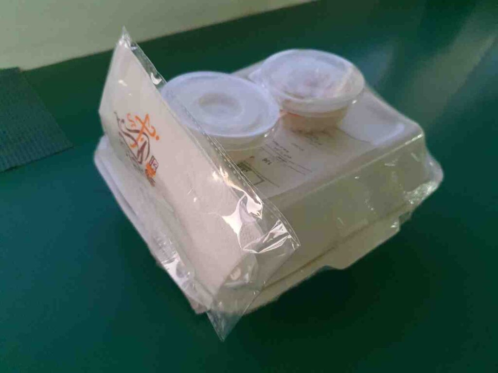 | 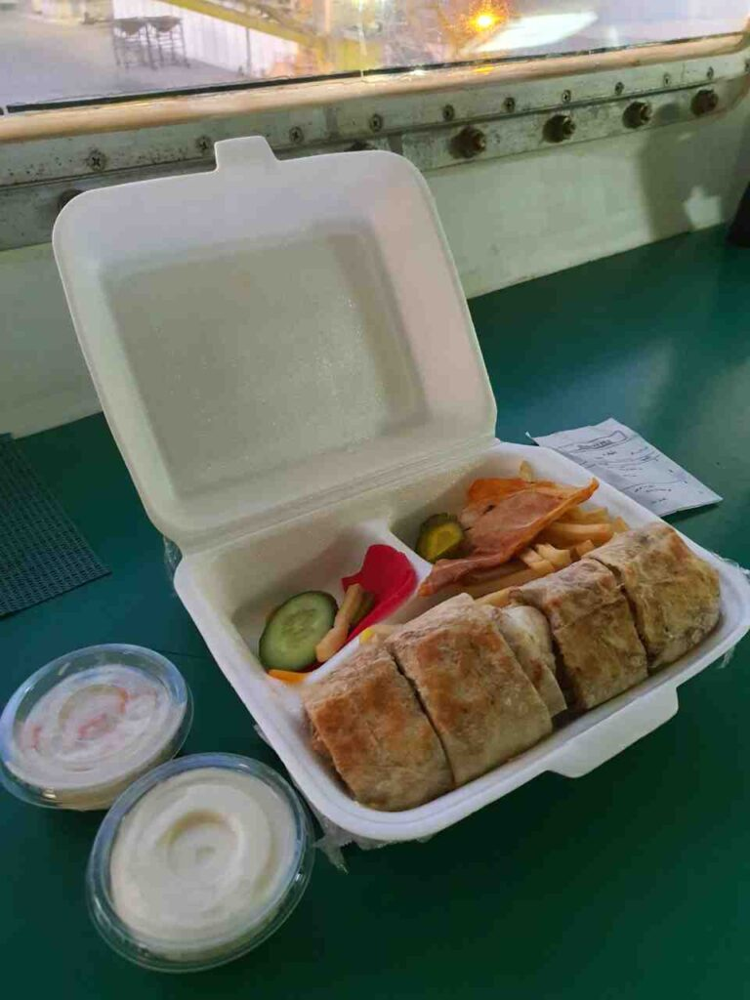 |
| :------------------------------------------------------: | :------------------------------------------------------: |

_2021.01.10 16:51_ I don't know where, but it seems to me that the chef found out that he was being written off. By the way, today we received tickets for a new chef.
So, cooking this one has turned into a pitch-black inedible hell. Even I, the most unpretentious person to food, is not able to take this nasty something in my mouth.
I hope the new chef will arrive normal, well, at least better than this ...

_2021.01.11 11:50_ A peculiar epidemic began on the ship. First, the first officer and the third caught a cold with a temperature, then several sailors. Now the infection has reached me. True, I only have a sore throat, my usual weak point in such diseases.
Now it looks like a diary of the end, which the main character will have to find hundreds of years later during his wanderings.😅
The medicines have already run out, so all that remains is to drink lemon-ginger teas.

_2021.01.11 13:30_ The doctor came on board, we thought, again some beggar for cigarettes, but no. Took a test from the cook and left. And he is perplexed.
It turns out that he still did not know that he was going home and simply began to cook absolutely shit by himself. That is where he is dear.

21.01.12 15.00

During this hour, a new chef should arrive. As it turned out, our current chef had no idea about his imminent departure until the last moment.

There are 11k tons of cargo left on the ship, so we should finish unloading at night, but we still don’t know where we are going next. It seems that they said that there would be no dock yet, but we also did not receive the next flight task.

We are still waiting for information from the shipowner. Perhaps, upon leaving the port, we will go "there, I don't know where."

21.01.13 01.00

In appearance, the new chef looks decent, has a lot of experience, so I hope he will cook at least normally.

But I do not think that he will surpass one of our sailors who worked as a cook on the shore. He himself does not like the work of a cook, but when something happens to our cooks on the ship, he pleases us with his delicious food.

Coastal officers promise to finish unloading already after lunch, or even in the evening. As I expected, at the end there is a cleaning of the rest of the cargo, and this is much slower than sucking 200 tons per hour with a pneumatic teat.

It seems like we will go not to Russia and not to Ukraine, but to Piraeus. At least, I was told to lay such a route.

_2021.01.13 11:30_ I feel that this will not end with one throat. Already runny nose and temperature, mx. And even treated with nothing special.
And there is no such thing as to lie down and feel better if you don’t work - the rest will have to work 2 times more. And here and so everyone works on the verge of their forces.
It remains only to give prayers to the mercy of the Great Goddess.

_2021.01.13 19:30_ We left the port of Damietta, Egypt and are heading to Greece, Piraeus, where we should have repairs, but the dock will be busy for another month, it is not clear what and how we will do next, probably to anchor .
The new chef is very cool. Lunch and dinner prepared by him, after the last two cooks, were simply breathtakingly delicious.
He also took the time to make donuts for lunch and biscuits for dinner.
Despite the fact that he cooked the same mashed potatoes with chicken, he cooked them incredibly tasty, and past chefs simply transferred food to the trash.

_2021.01.14 14:10_ I was suggested an interesting remedy, that if you use sea water for washing and gargling, it helps a lot.
Having tried it, I was shocked, no medicines helped me as much as this simple method. So who lives by the sea - I advise.
And then I remembered that most nose drops are made on the basis of sea water.
Awesome business with the sale of sea water at a price of $ 5-20 per 50 ml in a beautiful bottle.
Can this be called a scam?😅

_2021.01.14 20:00_ I just called the chief and asked to calculate the route in accordance with the sent trip task, received literally 15 minutes ago.
Now we are going to Piraeus and will anchor there for 3-7 days. The Greeks will come and have pseudo-repaired brains.
Drydock is currently busy, so we will just be given an extension of documents for April.
Then the ship will go to the port of Taman, Russia. We have already been there, there is a completely open pier in the middle of the sea, and as soon as the winds blow, the ship tries to break away from the pier and break all the mooring lines. I think it will be terrible, especially since the weather is even worse now than it was in November when we were there. And we will be loaded with coal, which is surprising, because the whole year the ship carried only grain.
After Taman, the ship will go to carry cargo to Guangzhou, China. On an approximate route: Taman - Istanbul - Suets - Singapore - Guangzhou.
It takes about 1.5-2 months to go there, so the whole journey will take at least 4 months, taking into account loading, parking in front of the straits, unloading and the return trip.
Therefore, the company plans to change all the crew members who have been on board for 6 or more months, most likely in Istanbul, although it is not yet known immediately after Piraeus or after Taman, but according to recent experience, I would not particularly like to get to Taman.
Oh, and you still need to recover before the crew change, yes, otherwise you should be quarantined somewhere in Turkey.😅
Thanks to the Great Goddess for her mercy and assistance!

|  |  | 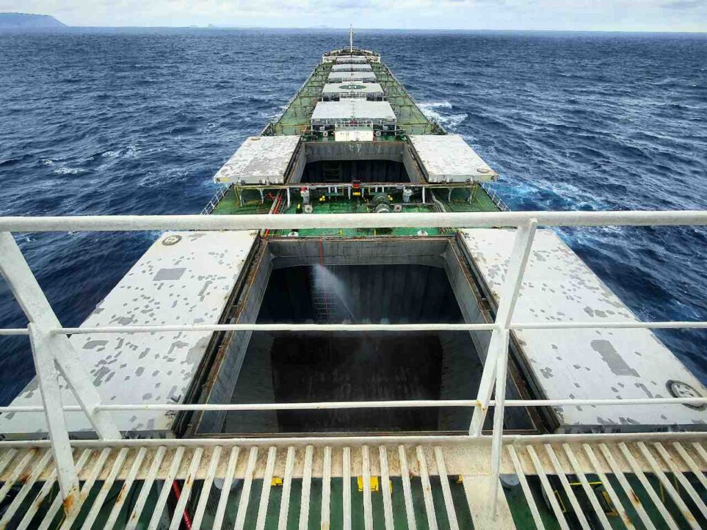 |
| :--------------------------------------------------------: | :------------------------------------------------------: | :--------------------------------------------------------: |

2021.01.15 13:10 Sailors wash the last holds from the remnants of the past cargo

_2021.01.16 17:10_ Greetings to all from Piraeus in Greece.
With grief in half we were able to anchor. First, several fishing boats rode at us, then we were crossed by those leaving the port, to which we had to yield.
We chose a good place to anchor and asked the port control for permission, but when it was confirmed to us, a Chinese container ship arrived at a speed of 15 knots (almost 30 km / h) and stood in our place.
Well, somehow we found a tolerable place and dropped anchor.
In general, anchoring in Piraeus is not the most pleasant thing, because there are depths of about 100 meters, and besides, there is also some kind of current that shakes all ships from side to side, although the wind is not so strong.
Tomorrow a bunch of people from the company should come to us, who will check the engine room, ballast tanks, perhaps, will make a combined ladder on the port side.
But they plan to stop for a short time, after which at full speed towards Istanbul.

_2021.01.17 01:00_ A crazy wind came up, but I can’t even see what it is, because at the last inspection, during the blackout test, our anemometer broke down (measuring the strength and direction of the wind), we were also forced to roll back the ballast tanks for checking tomorrow, as a result, our windage is simply breathtaking, and we are spinning around that anchor so quickly that it’s already scary.
And even if it carries you to another ship, you won't have time to react. Although we have such a powerful engine that even if you react, it simply will not have time to pick up speed.
In short, in the end they decided to specifically exhaust us morally.
Although what am I, the remaining guys are going to Taman, so it's still not so bad for us.

_2021.01.18 01:10_
Today they brought us a normal espresso machine, not a shitty American dripper.
So now, despite the fact that the coffee itself is shit, with milk whipped in a cappuccinatore and cane sugar, it turns out very tasty.
**UPD**: I'm lying here, we had fucking coffee too

| 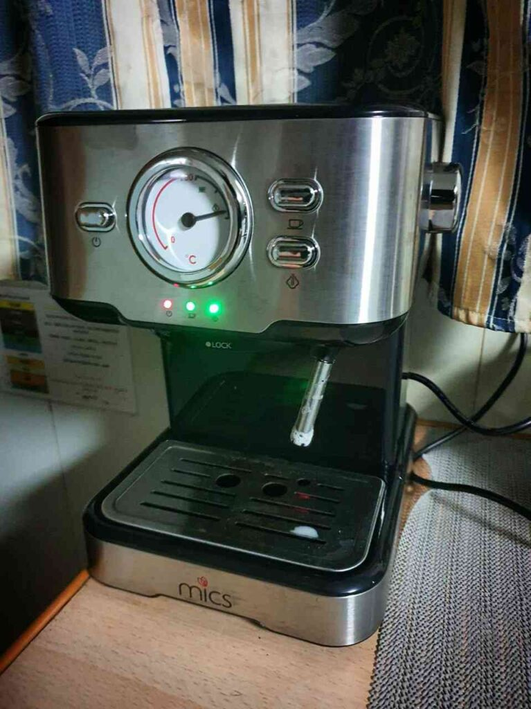 |  |
| :------------------------------------------------------: | :------------------------------------------------------: |

> New details of a shipwreck off the coast of Turkey: 13 crew members of the cargo ship are Ukrainians, and the ship's operator is Tesoro Marine from Odessa.
>
> So far, two dead sailors are known, six have been rescued, the search operation continues, but it is complicated by bad weather

_2021.01.18 15:30_ There are already a lot of new details, but the very fact of what happened plunges me into despair. People in our country for the sake of not so much money, but in order to somehow survive, go to a very dangerous job, and these old unserviced steamships sink one after another, taking the lives of sailors with them. Parents are left without sons, families without breadwinners, children without fathers. But companies that use steamships that are no longer allowed to go to sea will not be held liable. Such is the capitalist world, in which the lives of people are not of any value.
And after all, even those who escaped, after a long stay in the cold winter waters of the Black Sea, somehow received harm to their health, which may not be noticeable now, but will manifest itself later, when there is no one to pay for the treatment of sailors.

_2021.01.19 00:40_ We weighed anchor in Piraeus and head to Istanbul.
The flight to China was canceled, so no one will be written off, we will work again. New flight - Caucasus-Iskanderun.
The Caucasus is loading directly at anchor from special reloading ships and barges, which is very dangerous, especially in winter stormy weather.
Iskanderun is the same asshole as Taman - an open pier in the middle of the sea and a ship swinging right at the mooring ends, striving to break them, especially, as I said above, now, in winter.
This voyage will be released in +- month:
3-4 days to Caucasus
14 days they promise loading
5-6 days to Iskanderun
15 days unloading
Of course, it all depends on the weather.

_2021.01.19 17:50_ Our ship was not allowed into the Dardanelles.
The combined pilot ladder does not work on our port side, which looks like half-vertical, half like an ordinary ladder. Such a ladder must be installed if the height of the vessel from the water is more than 9 meters.
Due to the fact that we are in ballast and have no load, our freeboard is 12.5m.
The captain agreed to go to the Dardanelles without a pilot, but VTS (the body that controls the movement of ships in the region) temporarily did not allow, due to the length of the vessel.
Now we are waiting either for permission to pass from the VTS, or for the crew members to quickly complete the installation of the ladder, which was supposed to be installed by the Greek technicians. In this case, we should be launched with a pilot.
The Greek fleet - not a day without unexpected adventures.
May the Great Goddess protect us.

_2021.01.20 01:10_ Our ship, having received permission from the VTS, is moving to the Dardanelles, which we will pass without a pilot.
The agent wrote that if we declare a non-working gangway in the Bosphorus, then the vessel will have to undergo a very extended PSC inspection in order to pass through the strait, as a result of which it will, of course, be arrested.
But every cloud has a silver lining, our combined pilot ladder on the port side was repaired by the crew and is now in working order, so there should be no subsequent problems.
The captain said that he would try to get a bonus for everyone who participated in this repair.

_2021.01.20 17:00_ The captain sent the first mate to take pictures of the finished ladder, and he sent me for champagne, which we drank with the steering sailors for four) For departure!

|  |  | 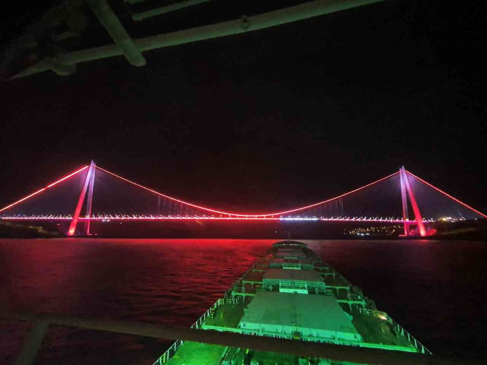 |
| :------------------------------------------------------: | :------------------------------------------------------: | :------------------------------------------------------: |

2021.01.21 02:20 So we left the Bosporus and are heading towards the Caucasus. And in the photo - all the bridges of Istanbul.

_2021.01.23 01:00_ We came to the territorial waters of Russia and at 13.00 anchored outside them, because there was no information about entering the port and a storm warning was announced.
Already at 20.00 we again anchored on the inner anchor line, here the wave is smaller, but the wind is still 20-30 knots.
We are waiting for the authorities to come to us and loading begins.
Everyone who arrived on the ship before the fall of 2020 was announced a replacement and sent passports for new crew members, even those who wanted to stay.
We must be changed in the Bosporus, on the way to Iskanderun.

| 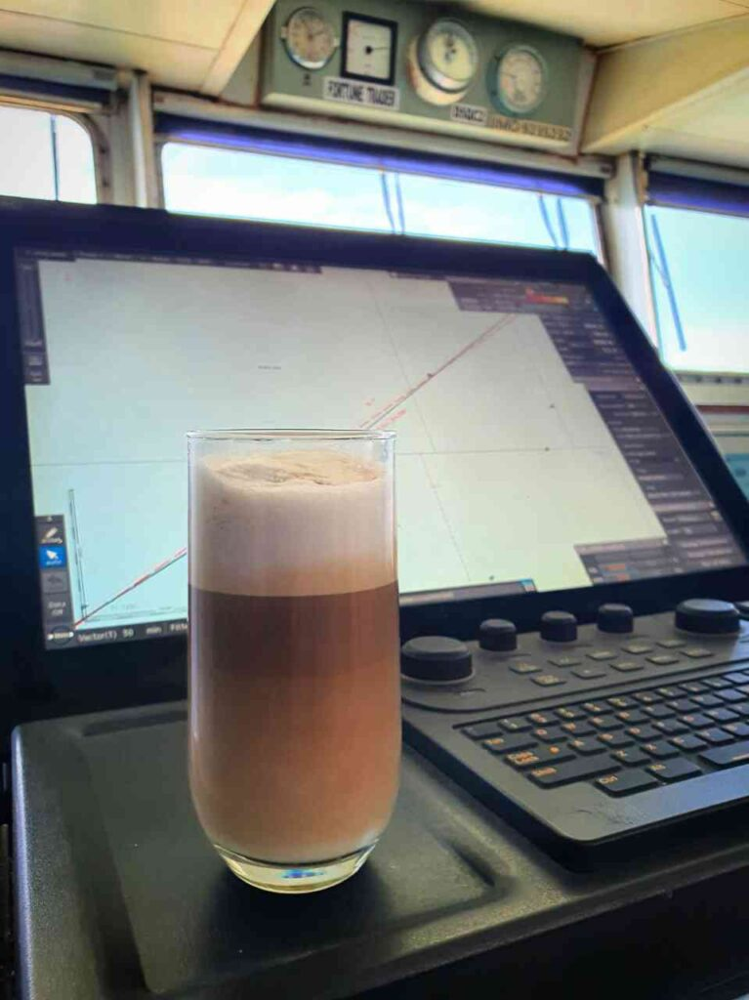 | 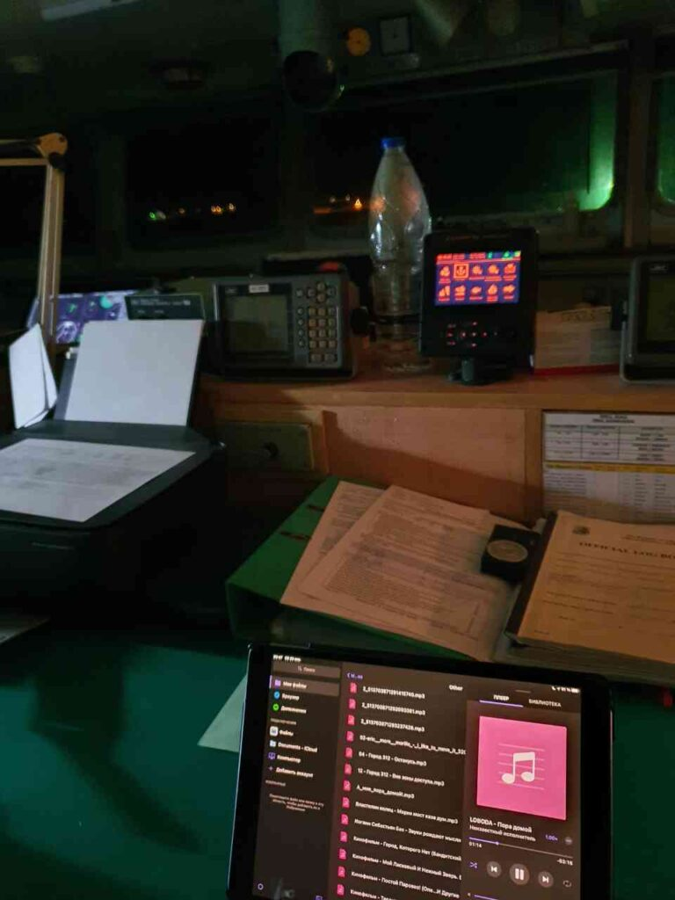 |
| :----------------------------------------------------------------------------------------------------------: | :----------------------------------------------------------------------: |

There was absolutely nothing to do on the navigation bridge, so I hung up a sheet and brought out the projector, and the sailors and I arranged movie shows, casually glancing to prevent the ship from anchoring.

| 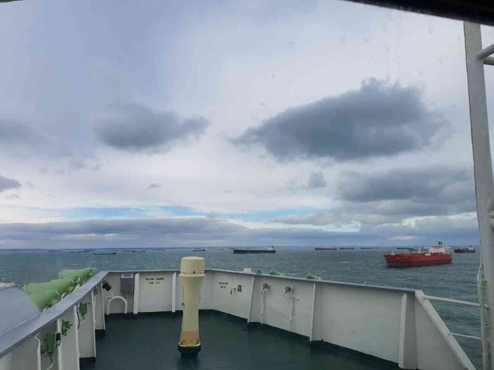 |
| :------------------------------------------------------: |

_2021.01.28 11:57_
A bunch of barges for reloading and ships, including us, are waiting for the weather to improve, to receive supplies, provisions, cargo work or open / close the border.

_2021.01.28 12:19_
We are so worn that the ship does not have time to sail into the wind. Wind speed around 30 knots, with gusts up to 35(

| 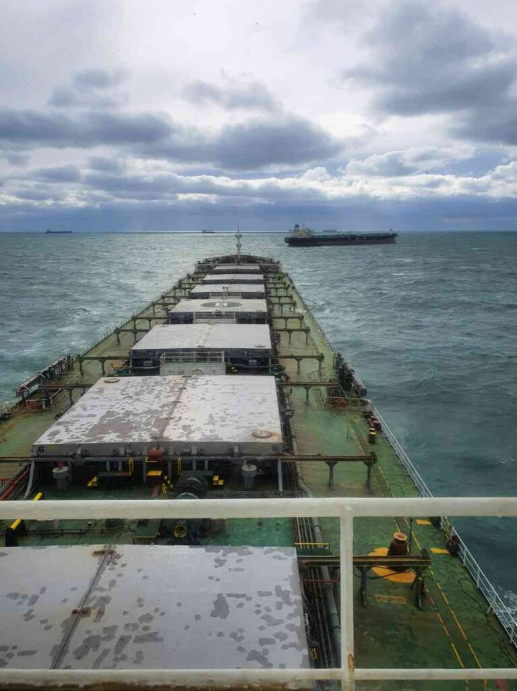 |
| :------------------------------------------------------: |

_2021.01.29 19:07_ Today one ship made a circus. The photo is red on the right. It stands on a nearby anchor and suddenly at 2 pm Kavkaz Traffic began to complain (a coastal service that decides who to go where) that we are 3 cables (1 cable - 185.2 m) from it and like we were carried to it. Traffic called us, but we stand calmly, we are not carried, and the distance is not 3, but 3.5 cables (3 cables is a safe distance at the anchorage in the port of Kavkaz).
He himself chose the anchor, drove away from us and now he is standing in ... 3.6 cables from us. Genius moron, spent a lot of nerves and fuel not to achieve anything.

|  |
| :------------------------------------------------------------------------------------------------: |

_2021.01.30 23:37_ I seem to be sleeping a lot, but lately I haven't been getting enough sleep.
We've been at anchor for a week now. People complain that they are tired of relaxing without work, and everyone is in a homely mood, everyone wants to get off the ship.
However, I don’t know when we will be able to go home, because the weather clears up only on 4-5 dates, but they won’t have time to load in 3 days, because they don’t load with loaders, but with cranes with hornbeams, and the weather worsens again after these three days.
It is possible that, nevertheless, we will defend the winter here to the end.
Although still question in food and fresh water. Food left until the fifth day, water - two weeks. What will happen next is not at all clear.

2021.02.02 14:50 Good weather and the port of Kavkaz has revived.
The tugboats with the authorities come to the ships, the reloaders load the grain, the bunkerers supply fuel and water.
So the authorities should come to us in a couple of hours.

|  | 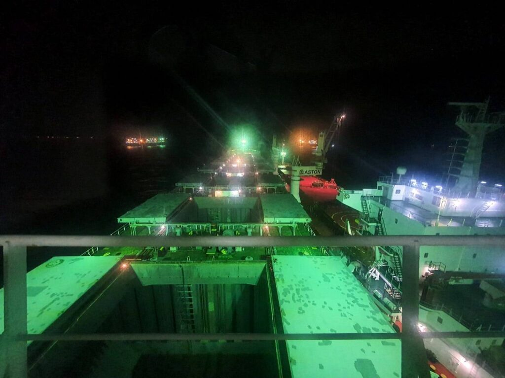 |
| :------------------------------------------------------: | :------------------------------------------------------: |

_2021.02.03 00:20_
The ship-loader Kavkaz II approached us and moored. A bunch of people went on board - hold inspectors, draft surveyors, fumigators.
Everyone does their job and has the brains of an XO.
And I'm on the bridge, since we are still at anchor and we need to control the position of the ship.

|  |
| :------------------------------------------------------: |

_2021.02.03 20:17_ Today PSC Paris MoU came to us again in the port of Kavkaz. The inspector turned out to be the same as he had been in August.
He opened his notebook, where all the steamships he was on were recorded, and looked at what we had for remarks, but when he saw familiar faces, in the form of me and the captain, he realized that it was possible not to simulate with us and "work" directly.
I gave the first mate a half-knee, but according to my command, I didn’t even look at anything.
In the end, he wrote two simple remarks from the category "eliminate before the ship leaves the port", such as oil smudges, because a 20+ year old Chinese steamer cannot have no comments at all.
We immediately eliminated these comments and sent photos of the work.
So we can say that we have almost pure PSK. And not even that expensive, because this time he came alone.
Now you can not worry at all and wait for the departure home)

_2021.02.04 23:31_ Speaking of why we didn't start loading.
In Russia and Ukraine, unlike normal countries, there is such a thing as a mandatory commission of the immigration service. And if in all countries it is possible to pass it purely de jure, without the presence of border guards, then it is impossible here. The process goes like this:
\- Border guards arrive, in most cases at night
\- They call the entire crew for face control, where they simply look at the correspondence of the face and the photo in the seaman's passport (Seaman's Identification Book)
\- Scan the above passports, on their scanner, which is connected to an Asus EeePC touch netbook, the same as I have at home
\- They put a seal in each passport, both on the arrival of the vessel and on the departure from the country
They litter the sailor's passport for as much as two seals at each call to the ports of Russia or Ukraine! I don’t remember such nonsense at all, except for Russia and Ukraine.
That's all the work of border guards, yes.
For the sake of this, the ship can stand for weeks and wait for the arrival of the commission, because they need complete calm to board the ship.
A ship was standing next to us, which loaded two weeks ago and could not leave, because the commission did not come to them.
It was the same with us, with a wind of 10-15 m / s, a transshipper could moor to us, but without a commission he had no right.
And it is not known what will happen to the weather during and after loading. Now it rains quite often and we open and close the covers of the cargo holds all the time, and then the wind and the wave can come up again.
Returning to the topic of stamps and passports. This is despite the fact that now, in addition to the fact that prices for maritime documents have risen sharply, a sailor's passport costs up to 500 bucks. Of course, not officially. But officially you won’t do it anymore, because there will always be excuses, they say there are no forms or something.

|                                  | 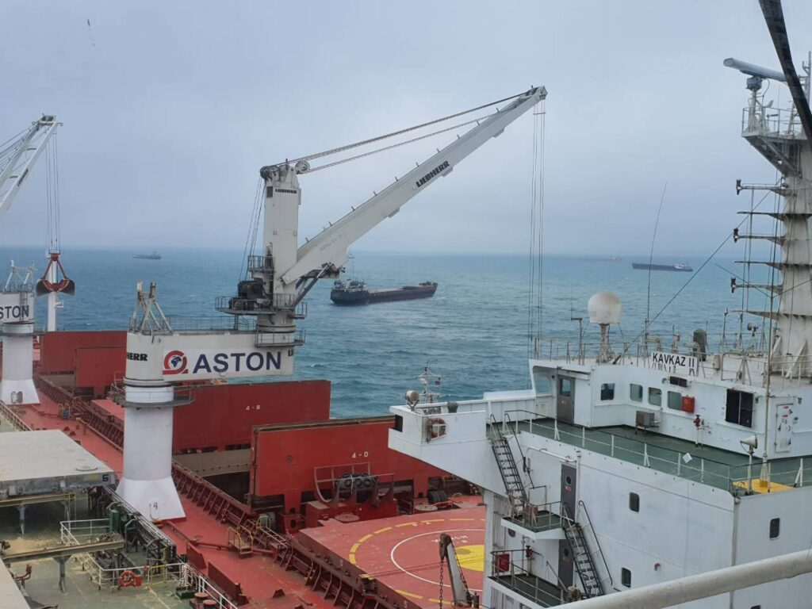 |
| :------------------------------------------------------------------------------------------------------------------------------------------------------: | :--------------------------------------------------------------------------------------------------------------------------------------------------------------: |
|               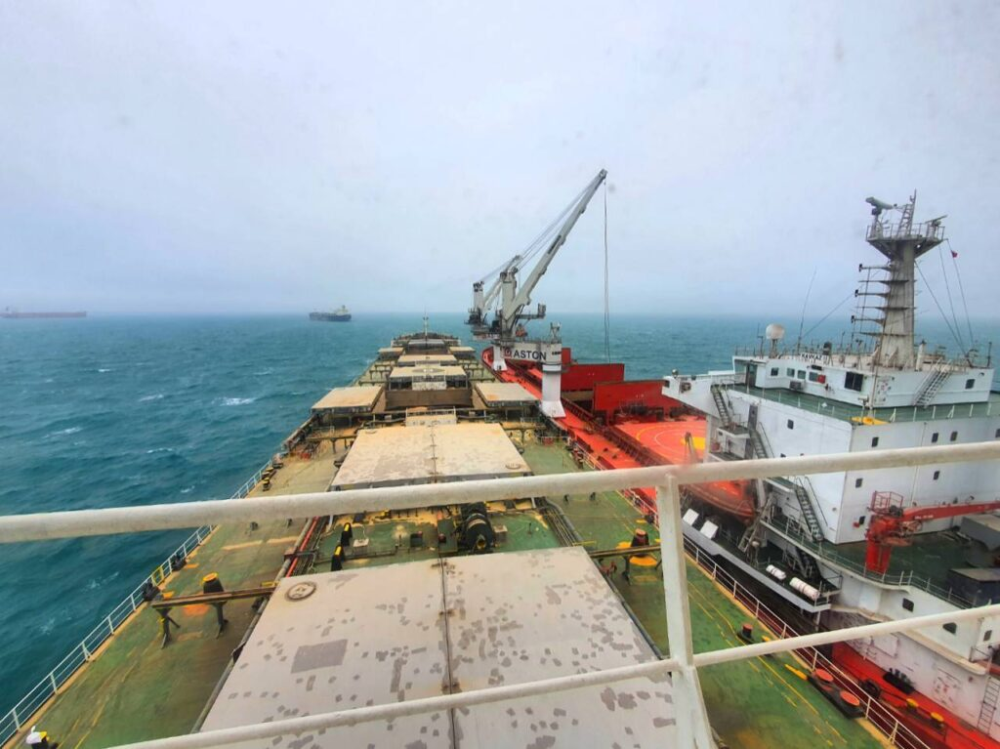                |                                                  |
|  |        |

_2021.02.06 23:01_ When you are at sea for more than half a year, such a strange state of consciousness sets in, it feels like you have always been on this ship, and all the memories before that are artificial, not real, and there is no outside world either, there is only a ship, and ports.
On the other hand, there is also the opposite effect, when the contract is already over or you have just arrived home - it feels like the whole flight is just a nightmare.

| 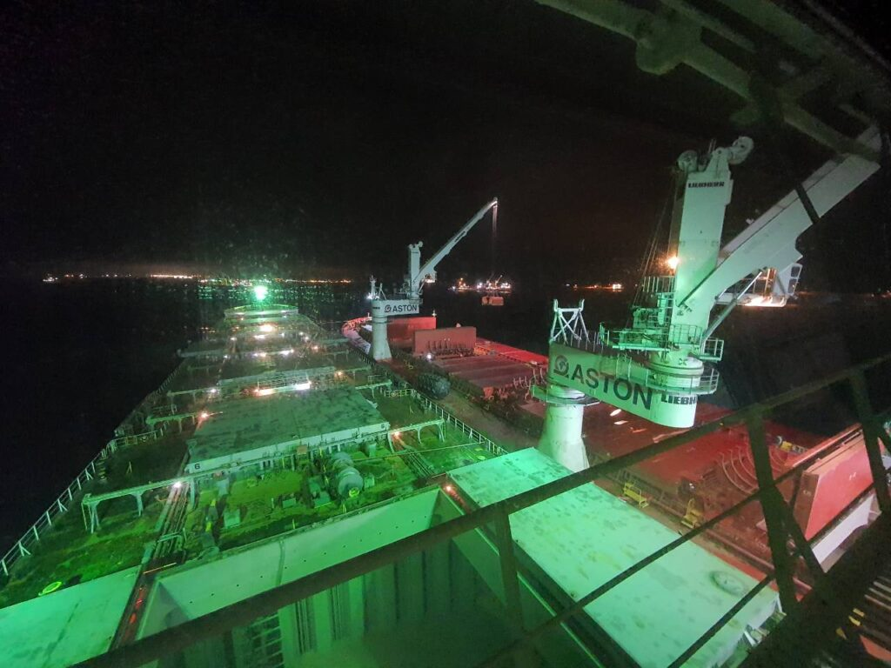 |
| :------------------------------------------------------: |

_2021.02.06 23:01_ Loader vessel "Kavkaz IV" and barge "Ekaterina" were moored. We continue loading.
Uploaded: 31.5k Remaining: 25.5k Total: 57k
Upd. Literally half an hour later, loading had to be suspended due to a snowstorm.

\_2021.02.07 03:0_3
Meanwhile, the ship has cooled down and the snow is already falling.
We were heeled over, and not having time to level out, the trucks were suspended due to the weather, and we stand like idiots 1.5-2 degrees ...

_2021.02.07 12:28_
Provisions were supposed to arrive at noon today, but the boat has not left yet, and it takes 3-4 hours to go.

|  | 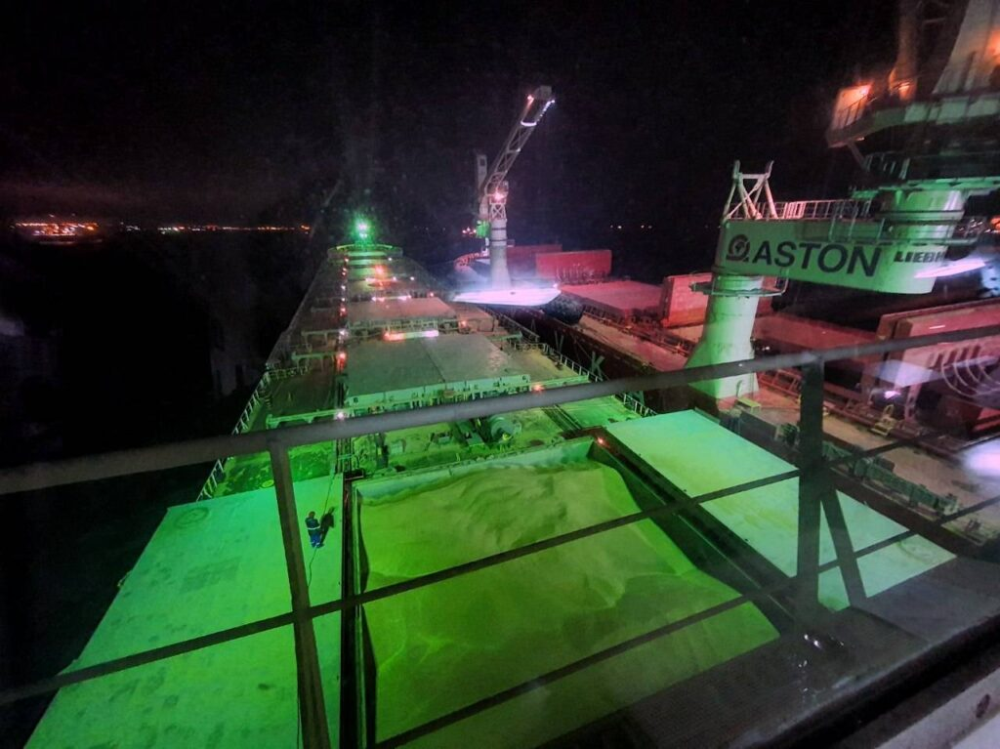 |
| :------------------------------------------------------: | :------------------------------------------------------: |

_2021.02.08 00:30_
We finish 7 and there will be 1 more hold.
There is hope to get out of Russia tomorrow and never see her again, mhmh)
But tomorrow evening the weather will worsen and it is doubtful that the authorities will be able to board the ship ...

_2021.02.08 03:20_
At one o'clock in the morning we finished loading the 7th hold and started hauling the transshipment vessel forward to load holds 1 and 3.
It's already half past four, and they're only half-stretched...

_2021.02.08 03:47_
They nevertheless finished the hauling, but a fog came up. However, Caucasus 4 says that this will not affect the loading.

|  |  |
| :------------------------------------------------------: | :------------------------------------------------------: |

_2021.02.08 10:57_
Loading has been suspended, a storm warning has been issued, fog, slight icing, often a little snow wakes up, then stops pouring.
Demobilization is postponed from time to time.

|  |
| :-------------------------------------------------------------------------------------------------------------------: |

|  |  |
| :------------------------------------------------------: | :------------------------------------------------------: |

_2021.02.09 11:24_
The weather is wonderful, no rain or rain. Cargo left to load 2.5k.
There was no cargo left on the reloader, and they cannot load such a wave from a barge. We wait.

|  |
| :------------------------------------------------------: |

_2021.02.09 13:31_
Due to the fact that a stupid reloader decided to use a machine for hauling, we were dragged by 1 cable. Fortunately, there is no one behind.

_2021.02.09 16:31_
Soon sunset in the stormy Caucasus.
It seems that the wind is not so strong, but because of the big wave, even the drive keeps at a distance of 20-30 meters from us, so as not to knock on each other's sides on the wave.

| 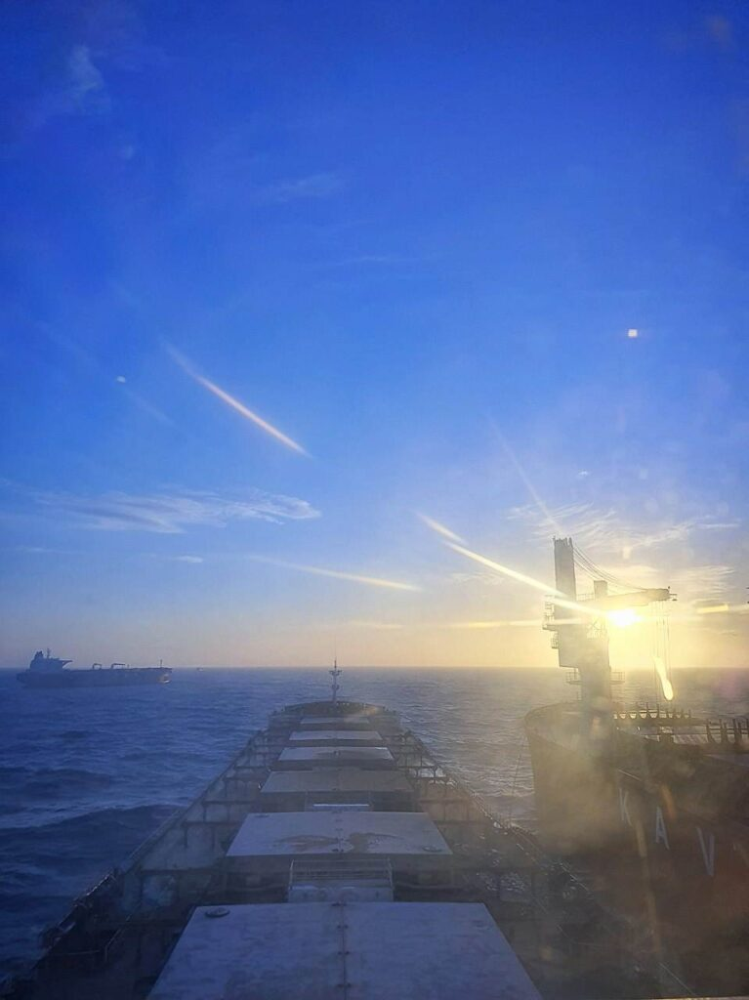 |
| :------------------------------------------------------: |

_2021.02.10 01:10_

I decided to hit the nostalgia and go through what happened on this flight.

At the airport, I met the second engineer and the captain and was quite frightened, afraid to make a bad impression. On the plane, I got a seat next to the captain and he asked me some questions.

Upon arrival, we were checked into a hotel, where we rested for almost a day, and the very next night we were sent by boat to the ship.

When we arrived, we were all really freaked out by the condition of the ship, and the transfer of cases lasted a matter of minutes.

And as soon as we got on board, we began to pass the Bosphorus, moving in the direction of the port of the Caucasus.
While I was just getting used to the new job, which I had not done before, the PUK came to us and fucked us, but as usual in the CIS, this is all solved.

After the Caucasus, we went to the Persian Gulf, and our air conditioner broke down in the Suez Canal. We spent several weeks in +40 without air conditioning, sleeping on the open deck and catching the wind, despite the fact that the ship was sailing in a dangerous pirate area.
The captain will then be able to purchase some ordinary home air conditioners and install them in large rooms so that people gather there, as in barracks, and can sleep in a cool place. Before air conditioners, we were saved by a pool in which the water was only +32, and not +40, like air.
Fresh water in the shower was also not cooled, so + 50-60 flowed from the cold tap.

We survived these difficulties and after all we had to go through a small week of repairs in Piraeus. The company wanted to transfer us under the Korean register, but we still go under the American register.

The next port was Nikolaev, at first we anchored for almost two weeks, and when we got to the pier, we were able to take our souls ashore.
And of course, having bought a little "Russian idea".

In Aqaba, before unloading, we stood at anchor for more than a week. There was a narrow harbor divided between Jordan and Israel, so the Israeli women called us all the time and shouted that we were getting too close to their border.

After Aqaba were:
Taman, in which a bunch of ends were torn to us, due to the fact that the pier is in the open sea;
Alexandria, where we were brought to the port and moored twice, the first time to take a couple of bags of grain for samples, and the second to unload. In the same place we had to collect ballast in the fourth cargo hold;
Novorossiysk, where 70k is loaded in less than a day, there, having anchored, we celebrated the new year. And then two more days in a row they met in such a way that from the words "Will you drink?" everyone fled in fear;
Damietta didn’t remember anything remarkable at all. The only thing is that this is the best Egyptian port, there are no beggars, one agent takes a stable fee and distributes it to everyone who needs it. Also, the best cook I saw in the Navy came to us there, for my not very big experience.

And here we are again in the port of Kavkaz, we again had a PSK with the same inspector.

I hope soon I will be able to add an entry here with Istanbul-Odessa tickets)

| 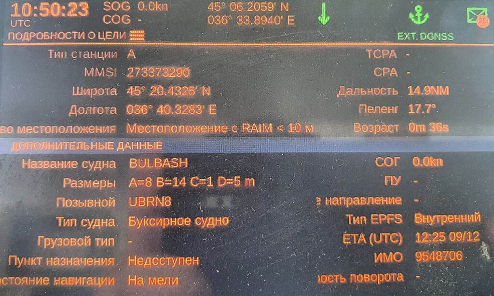 |  |
| :------------------------------------------------------: | :-----------------------------------------------------------------------------------------------------: |

| 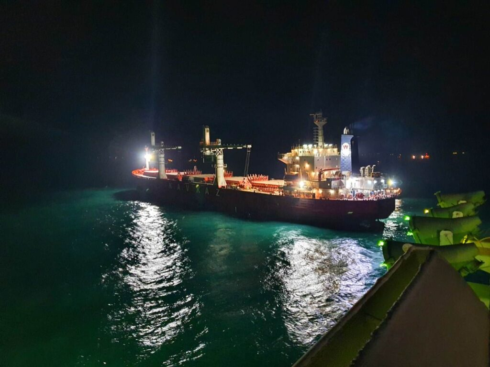 |
| :------------------------------------------------------: |

_2021.02.11 00:32_
Caucasus 4 departed. We are finishing the fumigation of the cargo and will work out the commission of border guards.
After that (woo!) we'll finally get out of Russia.

_2021.02.11 03:13_
The commission left the ship, nothing prevents us from leaving Russia, except for the lack of permission from port supervision ...
Russians, forward! Work already!

_2021.02.11 10:47_

In Russia, almost every day was a test for us.

On February 09, while cleaning a part in the engine room, our welder's cleaning disk broke in the grinder.
The goggles were knocked off by large pieces of the disk, and only the next day he felt that something had got into his eye.
His day could not be taken from the ship due to bad weather, and when they were taken, they took him all the way to Krasnodar to a large ophthalmological clinic.
So we became 23.

On February 10, the hydraulic cylinder of the covers on the fifth hold ruptured. Hydraulic oil spilled all over the deck, benefiting from a spilled load of wheat soaking it up. Luckily, there was a spare, albeit used, cylinder on the ship, so we were able to at least close this cover.

They say that in Russia there is a terrible bureaucracy and you need to run for certificates to get certificates ... They did not bypass the marine environment.

First, the customs should be cleared for departure, then the border guards, along with a bunch of documents, the agent sends them to the port supervision, and he issues a special paper, "Permission to Departure."
After that, you need to tell the individual number of this permission to another supervisor with the call sign "Kavkaz Radio 5", then, when they give the go-ahead, call "Kavkaz Traffic Control" and say that radio 5 gave the go-ahead and only now you can leave.

Upd. NOT A DAY WITHOUT ADVENTURES!
When we were leaving, we entered the separation system (a kind of road to the sea) and we had a malfunction of the main engine. Water came out from under the cover of 4 cylinders.
We reported the problem, requested permission from the Caucasus traffic and logged out of the system and anchored.
Now we are waiting for the mechanics to remove the cylinder cover, but... All three sets of special devices for this operation are broken!
So the mechanics are trying to somehow fix them ...

_2021.02.11 13:34_
We are standing. Mechanics are repairing, in we pray to someone.
For tomorrow they promise just a crazy storm with a wind of more than 25 m / s, and this is 10 points ...

_2021.02.14 13:16_ In the meantime, we are drifting near Turkey, waiting for good weather.
We were stopped and driven away 15 minutes before entering the Bosphorus ...
Storm winds and waves of 4-5 meters are expected until Wednesday. And in the Sea of ​​Marmara, the wind, according to the forecast, is no less than in the Black.
All circumstances are against us being able from this ship ...
**UPD**: We safely passed the Bosphorus, and after the same quick change as we had, we ended up on the shore.
Due to bad weather and waves, we had to go down the pilot ladder, and not the normal one.

_2021.02.15_
_05:54_ YES-YES, KATSU IS ON THE SHORE! FAREWELL FORTUNE TRADER!
True storm, snow, zero visibility, so what about the flight to Ukraine in general xs.

|  |  |  |
| :------------------------------------------------------: | :------------------------------------------------------: | :------------------------------------------------------: |

Cats on guard at the Istanbul Immigration Service

_06:06_ We were again settled in the Panorama Hotel, only this time there were eight of us, not three)
The whole day we wandered around the neighborhood and bought all sorts of things for ourselves and as souvenirs.
_21:53_ It is now 10:00 pm, at one in the morning an agent will come for us and take us to the airport. I don’t understand why, because the next flight to Odessa is at 8 in the morning.
And yes, no one even tells us or shows us what kind of tickets we have.
**UPD**: Of course, Katsu forgot about covid and the need for testing.

| 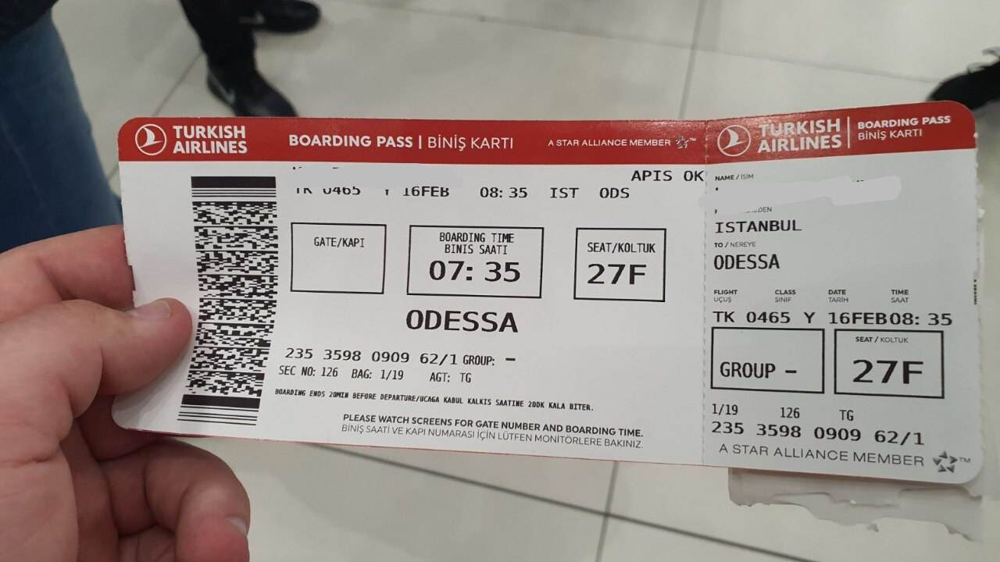 |
| :----------------------------------------------------: |

|  |  |
| :-----------------------------------------------------------------------------------------: | :----------------------------------------------------------------------------------------------------------------------: |

|  | 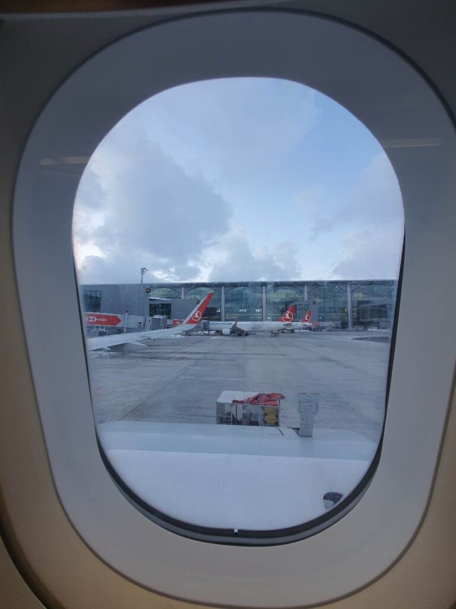 |
| :------------------------------------------------------: | :------------------------------------------------------: |
|  | 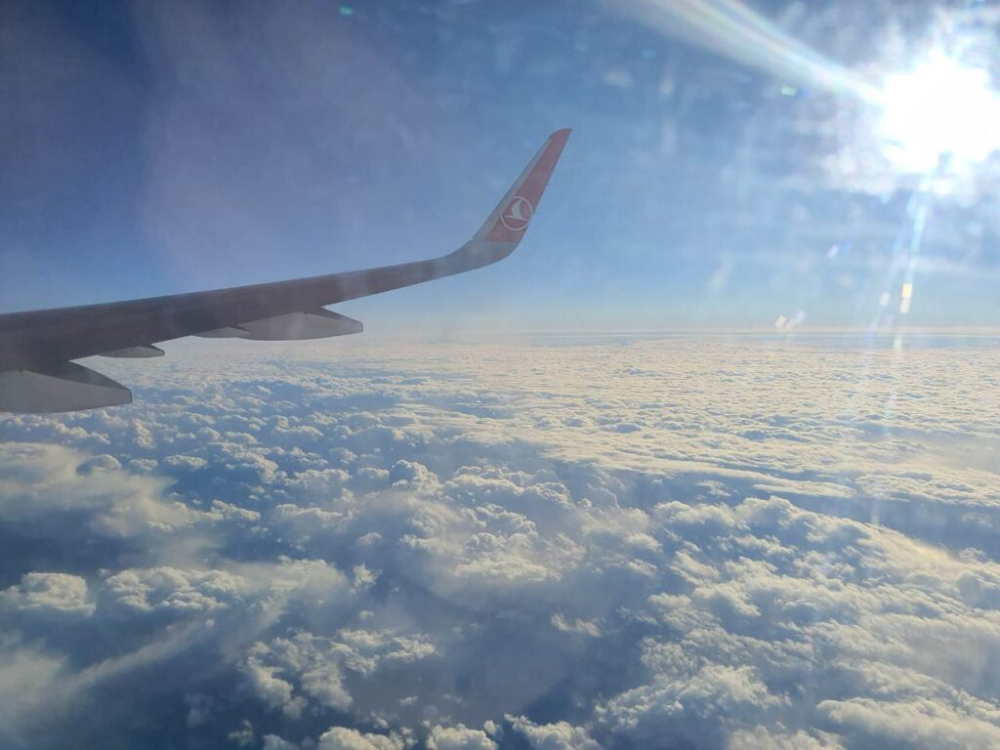 |

|  | 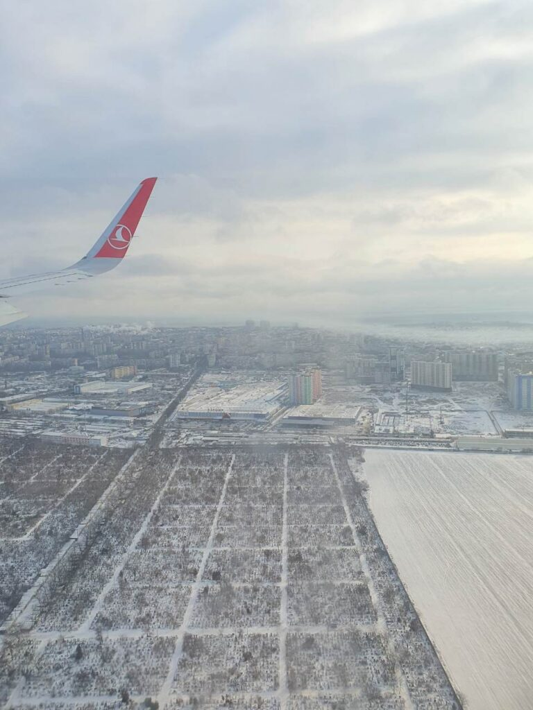 |  |
| :------------------------------------------------------: | :------------------------------------------------------: | :------------------------------------------------------: |

This is how I ended up at home after a seemingly difficult flight, which I remember with special warmth. Despite all the hardships, with a friendly and close-knit crew, you can even move mountains!

A little later I will tell you about my trip to Uzhgorod, and about another small, but very important, final voyage in my maritime career.

I love you ❤️
Everything will be Katsu! 🦊
