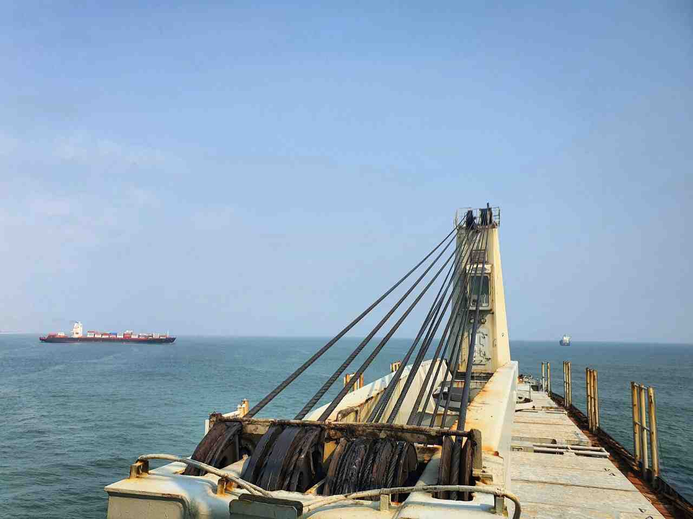
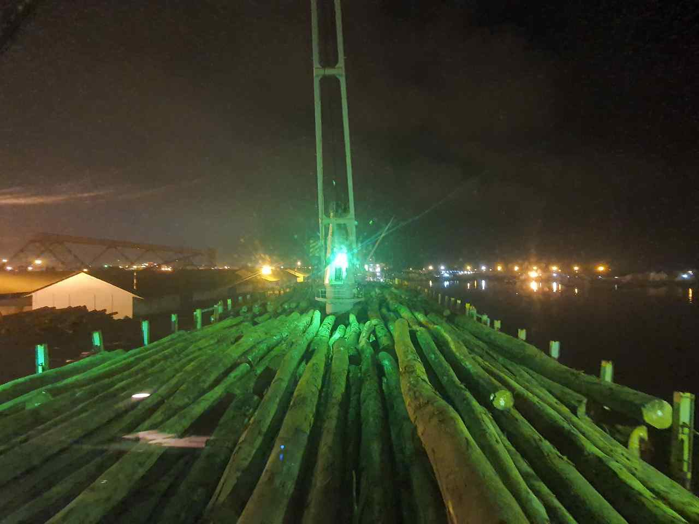
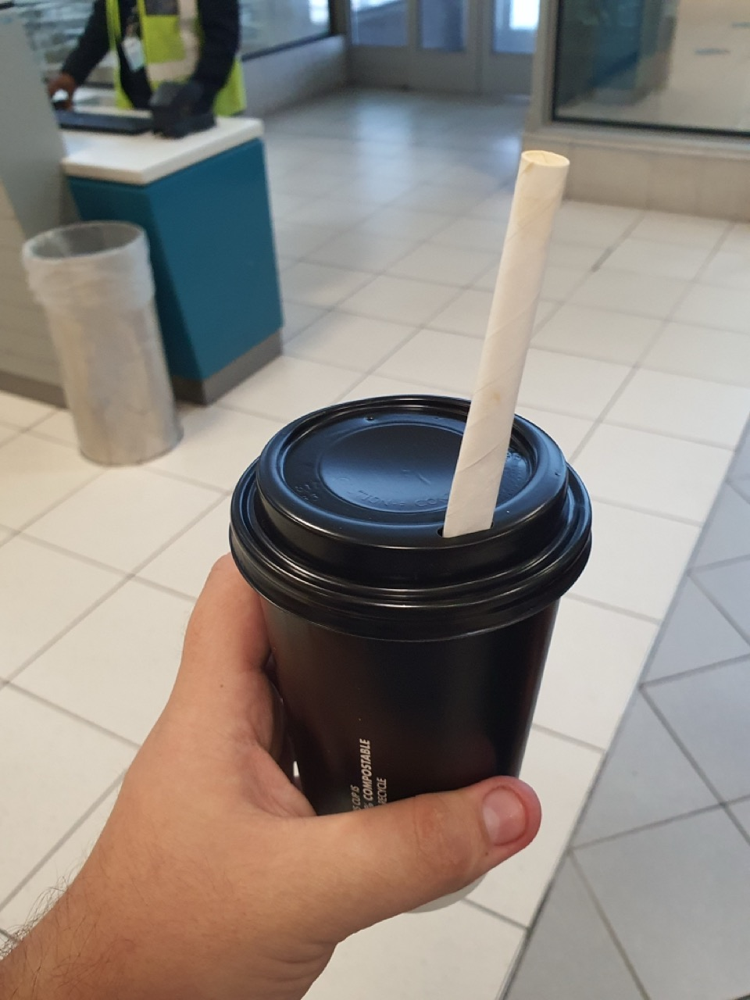
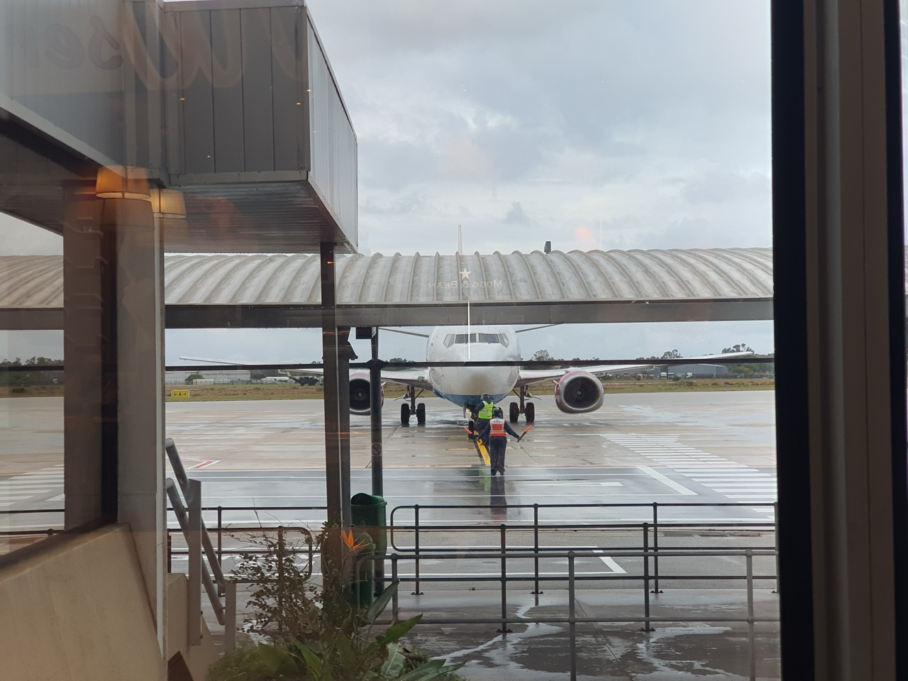

#### 2021.07.12 12:00 UTC+1 🌍 01°47.5S 001°03.6E

Here we are crossing the equator, which is happening for the first time in my life. So if it's summer for the northern hemisphere, we're having winter here)

While we are walking along the Atlantic the temperature is not high, and because of the air conditioner we have to sleep under a blanket. It's still better than being in the heat, though.

I've been feeling tired lately, and even though we're out of port (so we're working 4 in 8) and I'm spending most of my time sleeping, it's still not going away. I'm also taking vitamins, but I don't feel any improvement. I feel like one more port a week or two in 6/6 mode my body can't take it anymore.

I was more tired only in my first contract as a third mate, when I had to help sailors on cargo fastening and we worked day and night without sleep: sawing planks, placing them under tractor tracks, etc.

I remember then I got a nosebleed for the first time in my life.

#### 2021.07.15 🌍 Port Pointe Noire, Congo

##### 01:30

Here we are at yet another port. They promise a week's worth of loading.

Mooring was horrendous today. Both fore and aft broke one end each and we almost knocked the steamer on its ass.

In a couple days I'll have my first month on the M/V CRUX, although it feels like I've been here for half a year.

Hopefully, somehow we'll get that carried over.

##### 04:59

The policeman on the port side says he can bring elephant meat for two hundred bucks a kilo, but it's illegal and you can go to jail for it, and monkey meat, it's already sold in stores.

Exotic though.

##### 13:10

As my friend wrote in his channel about serving in the army [@mil_ik](https://t.me/mil_ik), please ask your questions in the comments to this post, and I will try to describe it in more detail in my posts).

Because I don't think it's very interesting to read posts with complaints, so I should write more enlightening content).

##### 13:27

We have been at anchor for less than a day and now, with all the difficult mooring yesterday, they want to kick us out to anchor at the Point Noir harbor roadstead by the end of my watch (18:00), because they have to let another vessel to load. But they let us in right away. It's a lot of fun, man.

Upd. Some lefty dude in a cool navy uniform came in, said he was a securite and he needed a captain and we were in trouble. Told me that a rat shield had fallen off somewhere, took the last three cartons of cigarettes and left.

Upd2. Although we had all the shields in place and in general everything that could be touched was in good condition. However, the last thing you want to argue with a tall muscular negro-sosurity. In short, it's not even the 90s.

##### 16:44

Finished cargo operations and getting ready to leave the port.

Don't even know how long we'll be anchored before they let us in to finish loading.

#### 2021.07.16

##### 00:02

New life is new hope, heh.

The liana offshoot I ripped off on the Liberian beach had shed its old leaves and the cut sites had dried up, and I thought it had died.

However, today I found that from the places where the old leaves were, there are roots (below the water level) and fresh twigs (above it).

One of these days I'm going to get a bucket of soil from the third helper in Liberia and plant my seedling😅.

|                                                                               |  |
| ----------------------------------------------------------------------------------------------------------------- | ------------------------------------ |
| !  |  |

##### 00:19

The container terminal looks pretty modern though.China has been very much into the African market lately, building their factories and infrastructure, and exporting everything of value in the process.

However, the locals are better off than starving and fighting for coconuts from palm trees, they can afford to live like people.

##### 15:02

Just like that, a container of Baltimore Star slips right in front of us, less than half a mile away.

|  |  |
| ------------------------------------ | ------------------------------------ |

#### 2021.07.17

##### 14:12

<blockquote>

  

Vessel with Odessa sailors stuck in the Gulf of Aden, there are victims ☠️  

The vessel THORN1 was heading to India for "sawing". On board the ship were 11 crew members, 10 of them were citizens of Ukraine. During the passage through the Gulf of Aden, the ship ran out of fuel and the life support system failed in 38-degree (in the shade) heat.  Because of the intense heat, one of the sailors had a stroke. The man died. He was from Ochakov.  

Odessa INFO ⚓️

</blockquote>

##### 14:20

As practice shows, most often sailors die from connivance.

When Port or Flag State Control come to the ship - they try to solve the "white" report of passage with bribes, and if not - the blame for the problems is put on the seafarers who spend nerves and efforts on elimination, and not on the shipowners or operators who do not carry out repairs, do not bring supplies, operate ships that should not be put to sea at all. Sometimes seafarers even have to carry out some works at their own expense without reimbursement.

Upd. Also, I would like to add that the technical means used on the ships are inherently bad. So even before breakdown they may not be safe. Be it radars not tracking "targets", or very laggy electronic charts.

I think it's no better in the engine room.

The reason this happens is that the user of the equipment (the sailor) has no influence whatsoever on the choice of equipment when buying it, and the offices buy the cheaper one.

No matter how much they pay to the family of the dead sailor (and they will pay minimally) - it will not return to anyone a dear man, son, husband and father.

That's how it turns out that maritime labor is near-slavery, because your fate is in the hands of the office, not yours. You are just a piece of machinery for them to throw away and "buy" a new one.

At the same time, seafarers give thousands of dollars to get documents and go on these very voyages.

Can we say that people have themselves to blame?

It's popular now, but I don't take that view, because then you could say that girls who are raped are to blame for being girls, which sounds completely delusional, doesn't it?

Another [link](https://telegra.ph/Ukrainskie-moryaki-zastryali-na-bortu-avarijnogo-sudna-v-Dzhibuti-04-14), with more news.

#### 2021.07.18 01:57

I've managed to get sick with something again here.

Temperature is jumping between 37 and 39, headache, and body is broken. But no sore throat or runny nose.

I also can't eat anything - I can't get all the food back. And loads are just contraindicated, because just to walk 15 steps begins to twist my head, and when trying to climb three decks up I felt like a 70-year-old grandfather just panted and was all in sweat.

I hope it's not malaria or corona.

However, if you just sit in one place you can tolerate it, so I came on watch, covered myself with a plaid and am about to drink a hot fervex and then add peppermint tea.

#### 2021.07.20 12:40

Yesterday I was taken off the watch and began to straight treat. Well, like straight up treating, but monitoring. Pulse/pressure/oxygen saturation are normal, covid test is negative.

We still haven't gotten into port, even though we were supposed to the day before yesterday.

Temperature reached 40 degrees yesterday, but has completely disappeared today.

There are also problems with stool, or rather, with its almost complete absence. Although he ate almost nothing for several days in a row, so it is not strange.

Weakness is still there and is not going anywhere.

#### 2021.07.27 20:00

We safely re-docked in the port of Pointe Noire.

I've been whipping +40 4 times a day these days, if not more often. But what confused me was that I couldn't even get to the bathroom without getting dizzy.

Today I feel much better, I was able to wash myself, brush my teeth, which is very valuable for someone who couldn't afford it.

What worries me more is that I haven't slept at all since day 6.

Tomorrow morning, I understand they're taking me in for tests. And hopefully they'll pump me up and kill the infection.

#### 2021.07.28

##### 09:37

A delegation came to see me, thankfully I had the strength to clean up the cabin properly, consisting of the Captain, an agent, a policeman, and a doctor.

The Captain told me what was going on, I asked for details.

She took my temperature, gave me a shot to bring it down.

Checked his blood pressure, normal.

Checked his sugar, which was elevated.

She ruled it malaria, even though you have to draw blood to test for malaria.

Now the agent's going to go buy the drugs, and the master's going to type up instructions on how to take them.

##### 14:47

I was brought a bag of medicines. Among them are soluble effervescent vitamins and Metformin (lowers sugar), one pill keeps my fever down, the rest are for malaria.

So we will be treated.

#### 2021.07.29 09:46

Good morning,

I finally got some sleep and my fever didn't rise at all. The weakness is still there, I'm trying to eat more and gain strength.

#### 2021.07.31 13:00

I finally got out of the den these days. We have started loading logs onto the deck.

However, tomorrow at 6am we should be kicked out again to expect to anchor.

#### 2021.08.01 12:36

We were kicked out to anchor again at midnight tonight. Presumably until Thursday. Again due to some kind of priority vessel.

I feel better and have already gone out to stand watch. There is still some weakness, but it doesn't affect the work so much.

#### 2021.08.02 00:11

<blockquote>
  The tanker "Mercer Street" was attacked by a pilotless kamikaze. Two members of the crew were killed  

  <a href="https://mil.co.ua/cherez-vybuh-bezpilotnyka-zagynulo-dvoye-chleniv-ekipazhu-tankera-mercer-street">
    Military Courier Ukraine
  </a>
</blockquote>

Working at sea is becoming increasingly dangerous.

Off the coast of Oman, an unknown kamikaze drone exploded on a tanker vessel. Killed two crew members. Considering that it is a tanker, it is good that there was no fire of cargo, otherwise the victims could have been much more.

It's not even a pirate attack, it's a military drone attack.

#### 2021.08.04 16:08

<blockquote>

Gunmen leave tanker feared to have been hijacked by Iran in Gulf of Oman  

<a href="https://www.thetimes.co.uk/article/fingers-pointed-at-iran-as-oil-tanker-is-seized-in-gulf-of-oman-mgmhsg2k0">Times</a>

</blockquote>

<blockquote>

WARNING 001/AUG/2021 Update 01  

Category: Incident - Potential Hijack - Non Piracy  

Description: An Incident is currently underway in position 2502.00NN 05728.54E. Incident upgraded to Potential Hijack.  

<a href="https://twitter.com/hashtag/MaritimeSecurity">#MaritimeSecurity</a> <a href="https://twitter.com/hashtag/MarSec">#MarSec</a>  

  

&mdash; United Kingdom Maritime Trade Operations (UKMTO)

</blockquote>

Another tanker ship has been hijacked. They say it's not pirates.

It's hard to know what's going on in the world. The only thing that is clear is that working at sea is very dangerous.

#### 2021.08.05

##### 16:24

<blockquote>

Death by coronavirus at sea  

I want to tell the truth about what happened on board CMA CGM SORBONNE with a wonderful man electromechanic Zhukov Evgeny Genadievich. Son, brother and just a human being who died due to negligence and carelessness of the superiors of the above mentioned ship and medical team in the port of Singapore.  

<a href="http://telegra.ph/Smert-ot-koronavirusa-v-more-08-05">Podslushano Odessa</a>

</blockquote>

One more fact of negligent attitude to the crew and one more dead sailor.

Someone's son, husband and father has gone to another world because of negligent attitude. Even though CMA CGM is considered a good company.

#### 17:42

#### 2021.08.06 17:08

Our guys are bracing the logs so they don't shift in the transition.

Meanwhile, the captain has announced that the ship's departure will be at 03:30am.

So I won't have internet with a month and a half passage to China.

#### 2021.08.07

##### 00:41

The prospect of leaving at 03:30 seems a little too bright to me.

We still have a lot of cargo to carry, and then it needs to be secured.

While I was off watch, the boat even grounded in low water, but everything is fine now.

##### 01:51

Finally at 0135 we finished the cargo operations. However, there is still cargo securing to be done.

So we can really get out at 0330. Although it's unlikely the sailors will have time to secure 3 more holds.

##### 02.42

The chief mate of the captain makes a draft survey (determining the amount of cargo). After that the sailors will fix the cranes as they go.

And at 0330, we'll actually have a pilot and the ship will leave port.

##### 06:12

We left port and anchored at 0510 local time.

At anchor, the sailors will be docking the cargo, after which we will proceed to a rendezvous point with a bunker ship 150 miles offshore, where we will take on fuel (under 700 tons) as we go.

In the meantime, I was left on watch until 8am so the XO could get a couple hours sleep. (He has a watch from 04 to 08) Because the XO will go out with sailors to fix the cargo at 8 o'clock.

However, I will also get a couple hours sleep before my 12 o'clock watch.

##### 11:55

We are anchored and the sailors are finishing securing the cargo.

So far 3 holds out of 5 have been secured.

##### 15:40

The lashing is done, now we are waiting for the car to be ready for launch and we will pick out the anchor.

So within 20 minutes we will be leaving Congo 🇨🇬 for offshore bunkering.

#### 08.08.2021 13:00 UTC+1 🌍 05°13,5S 009°35,7E

My watch from 00 to 04 is covered with a copper pelvis. At 5 o'clock a bunker ship came up, so I was on the bridge while the XO and 3pcm moored it. Then the XO was doing safety paperwork and the XO started taking fuel. I ended up standing on the bridge until 8am for the second day in a row, mh.

Since we didn't even have time to eat, the captain ordered some delicious sausage and cheese sandwiches in a hot dog bun to be brought to the bridge. It was really good, especially with coffee and milk.

At 13 o'clock we have already finished fuel acceptance and untied the barge.

Now until the 15th we have a quiet week of moving towards Port Elizabeth, where we will receive provisions and where there will probably be a change of crew.

I've been thinking about why I was wildly craving fruit as we pulled into port. First of all, obviously, they're delicious. And secondly, I think, after my illness I was met with a wild avitaminosis, so even vitamin pills didn't help. By the way, the green mangoes have yellowed and are now very tasty.

#### 11.08.2021 12:00 UTC+1 🌍 18°11,2S 011°02,2E

We've traveled far enough south. And everyone knows that when it's summer in the northern hemisphere, it's winter in the southern hemisphere. We're at +17 right now, and the air conditioner keeps blasting so hard that I'm sleeping under two blankets. But I've always said that it's better to have a cold in which you can take cover or get dressed than a heat wave that makes you die without the energy to make a difference.

I started to get into a more relaxed work mode after my illness. The body has even started to demand movement on its own, so I've been doing Beatsaber sessions. Many songs on hard difficulty I can already do in Full Combo, and expert songs rarely give me problems.

There's no place to walk around like on the last boat, as the whole deck is taken up with logs, as you saw in the photo earlier.

Thanks to everyone who was worried about me, now I can say that I am completely free and from the effects of the disease, in the form of weakness.

#### 13.08.2021

##### 00:00 UTC+1 🌍 24°03,9S 012°10,8E

Hello everyone,

We are sailing at 5,5-6,3 knots (with normal 10,5-12,5) because of very strong headwind and current and big waves.

And we were not warned about this by a specially hired weather service.

The waves are up to five meters and the wind is 50 knots. In fact, it's a nine to ten gale.

The captain said to keep an eye on the weather (so it doesn't get worse) and will decide what we should do in the morning.

It's a moonless night so you can't see the sea at all, but the wind howling is very unpleasant.

##### 15:00 UTC+1 🌍 25°16.9S 012°27.6E

As it turns out, it's Friday the 13th and we have a slight improvement in the weather. At least now we're going the same 5.5-6.3 as yesterday, rather than the same 3.8-4.8 as on my night watch. And from the looks of it, it's noticeably getting lighter. Though the wind is still 40 knots with gusts up to 50.

For this day we have passed only 165 nautical miles (305 km), with normal speed of 11-12 knots we pass 260-290 miles (480-550 km (as a range of tesla😂)).

Upd. The ship rides on the waves, and when it gets in resonance with them - there are huge splashes that fly from the bow 170 meters and flood even the superstructure (living quarters) of the ship that are at the stern of the ship. But in these splashes you can see small rainbows.

#### 14.08.2021 15:00 UTC+1 🌍 27°51,4S 013°20,3E

This afternoon the storm has abated, the waves are smaller, the wind is weaker, and the speed is about 9 knots, so we should arrive in Port Elizabeth around August 17, where we will receive provisions and spares, as well as a change of crew.

However, we have traveled even less in this 24 hours than in the last - 155 miles (290km).

#### 08/15/2021 14:00 UTC+2 🌍 30°59.7S 015°30.6E

Tonight we had a time change, so the third mate had an hour shorter watch, well everyone else had a rest.

A couple of days ago I saw my name on the crew list in the paperwork that the third mate prepares for the ship's arrival in Port Elizabeth. Not to say that I was very surprised, but it was not very pleasant. I will tell you about the reasons for my being written off a little later.

I found this information on the 13th, now it is the 15th, and arrival in port is on the 17th. However, nobody told me anything until now. On the first day I started to pack my things little by little.

I wondered if I would be told about my departure when the tugboat would come on board and I would have to get off the ship.

Not that I was very upset, though. The morale on this ship is very unpleasant. Set-ups, backstabbing, rumors, gossip, and the constant tension in the air are more exhausting than the work.

So I'll meet you on shore soon, to whom I promised).

#### 18.08.2021

##### 02:00 UTC+2 🌍 34°03.1S 026°01.2E Port Elizabeth Raid

For reasons I don't understand, the captain is treating me very strangely.

If he was simply unhappy with my work in some way, it seems to me that a normal person would just walk up and say something like, "I'm not happy with the way you're working, so I have to send you home".

However, every time he sees me he squints his face, any thing related to me does carelessly (grabbing or throwing things) communicates rudely. As I said earlier, I was told just a day before I left, in a subtle hint, that I was going home.

In the sailor's passport in the company that sends on a voyage, they write the date of enrollment (usually the date of departure from the country of residence), he corrected it to the date of actual arrival on the ship (a day later). Are you serious? No one ever does that.

It makes me feel like I did some kind of evil to him on purpose. This is the first time I've met with such an attitude.

I understand that the man is only a captain for 2 months, but you have to remain a human being.

I wish him that with experience he will become a good captain, about whom no one will write such things, and on the contrary sailors will say to each other "You can work with such a captain", and call, inquiring about his health and state of affairs.

##### 13:00 UTC+2 🌍 34°41.4S 023°54.2E

Tonight we arrive at the Port Elizabeth roadstead, but we have not been given permission to anchor, so we will drift.

At about 09-10am tomorrow morning I will already be off the boat, after which of course we will be sent for a PCR test before departure.

Needless to say, as the very fact of my departure has been hidden from me, no one has given us tickets yet, and I still have not been told if I will be given my salary for this month, or if I am being sent home at my own expense. Also, the foreman has not yet instructed me to post the lists of those who are leaving and arriving. Just for a second, we have to get on the boat tomorrow morning.

By the way, no one has officially told me, "You're going home." Although they have already issued my documents, so everything is clear.

However, as I wrote earlier, I'm glad I won't be here any longer. If I hadn't gotten a write-off, I think I would have gotten the "uprooted years" treatment, so I myself would have howled and wished I hadn't left.

##### 17:00 UTC+2 🌍 Port Elizabeth

Elizabeth - Johannesburg - Doha - Kiev / Qatar Airlines tickets

Suitcase travels from Johannesburg directly to Kiev, you will only need to pick up there.

The plane will land in Kiev at 08:00 on 20.08.21 UTC+3.

#### 2021.08.19

##### 01:00

I'm hungry, they fed so little in the hotel....

And the captain didn't give travel expenses, but gave 100 bucks each, recorded as cash advance, that is an advance that is deducted from your paycheck.

But you can't buy anything here, because stores and cafes close at 18 and open not earlier than seven o'clock, and all houses and hotels fence their fences with barbed wire and electricity. So if you walk out of your hotel in the evening - you can cancel your plane tickets.

I suspect that despite the very cool cars on the roads, the level of gang violence here is off the charts.

##### 07:00

A couple people couldn't get PCR test results, but the agent said they would be sent to Johannesburg.

For a domestic flight a rapid test is enough, but for international flights you need serious tests.

In the evening we were told we would not be fed in the morning.

At 06:20 I got a phone call and was told that at 07:00 we would be picked up by an agent, I leave the room at 06:40, the agent is already arriving.

And the guys say there's egg and sausage in there. I had to have a very quick snack, pouring milk on it. I haven't seen a good sausage in 2 months, and the guys have 5-7.

|                                                                                                                                      |                                                     |                                  |
| ------------------------------------------------------------------------------------------------------------------------------------ | --------------------------------------------------- | -------------------------------- |
|  |                     |  |
|                                                                                                      |                     |  |
|                               |  |  |

##### 20:10 UTC+2

We have 1.5 hours left to land in Doha, Qatar 🇶🇦, we will spend about 3 hours there until our next flight and head to Kiev.

There we will land at 8am and all eight of us will be picked up by a sprinter that one of our group members has arranged with an acquaintance.

By the way, in Qatar the time zone is UTC+3, just like in Ukraine, we should change the time on the phone.

Upd. The airplane shakes during the flight, apparently the air currents are turbulent, just like stormy oceans.

#### 2021.08.20

##### 01:50

In 10 minutes, economy class boarding will begin on our plane to Kiev. In 6 hours I'll be in Ukraine, and in 12 hours I'll be in Odessa^^.

##### 08:34

Well here we are, we have landed at Borispol airport, passed passport and customs control and are off to Odessa)

|  |  |  |
| -------------------------------- | -------------------------------- | -------------------------------- |

##### 23:14

Thanks to everyone who has been following my entries.

This is the end of my second 2pcm contract. For now, I will await offers from the company to finalize my paperwork.

If you have any complaints and suggestions to the way I run this channel, please describe them in the comments below this post.

This concludes my misadventures on my, hopefully last, voyage and I'm off to a new world, the world of IT, where people are treated like people, not animals.

Thank you for reading.

Always yours Katsu ❤️ 🦊
