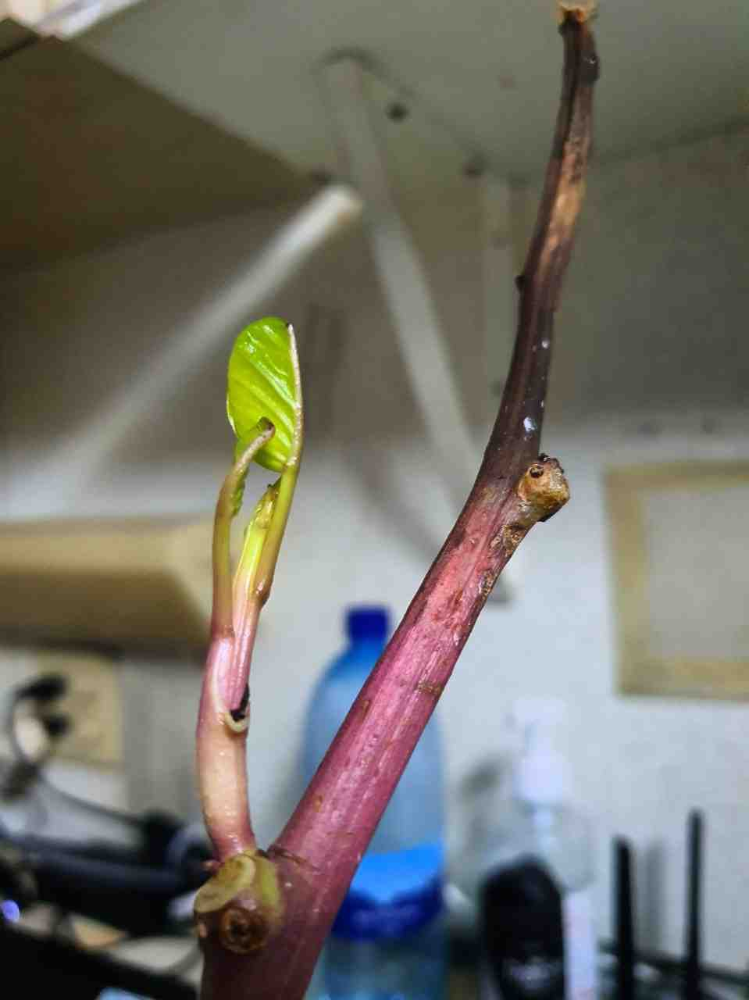
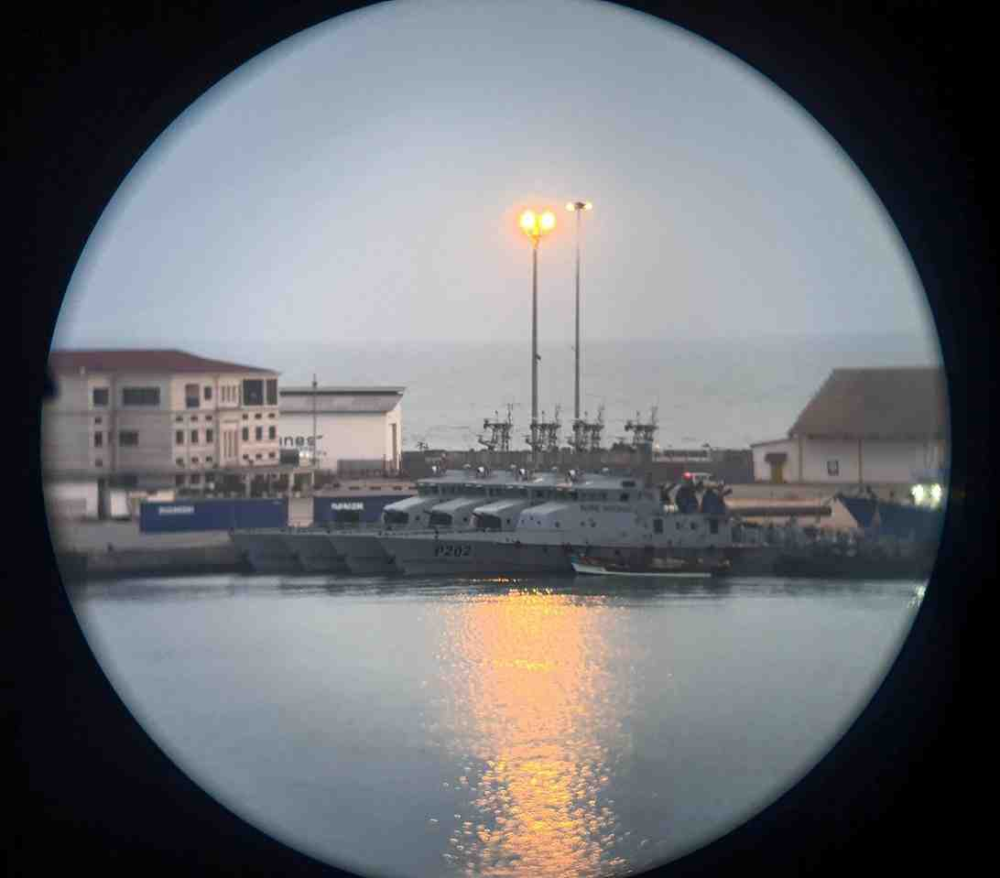
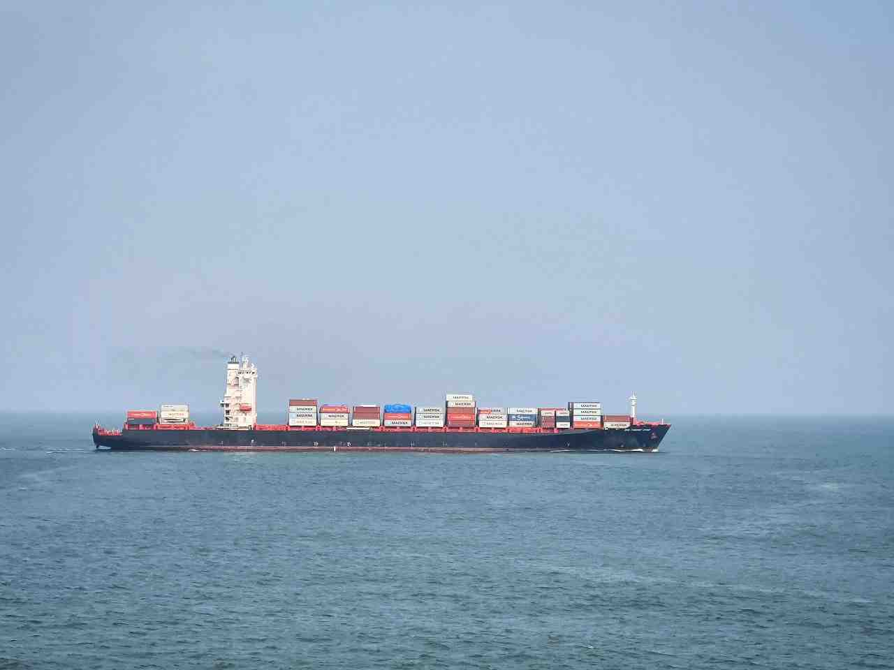
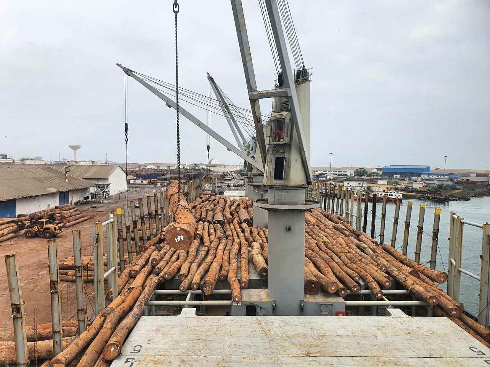
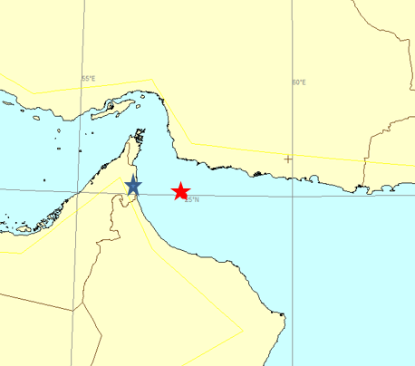
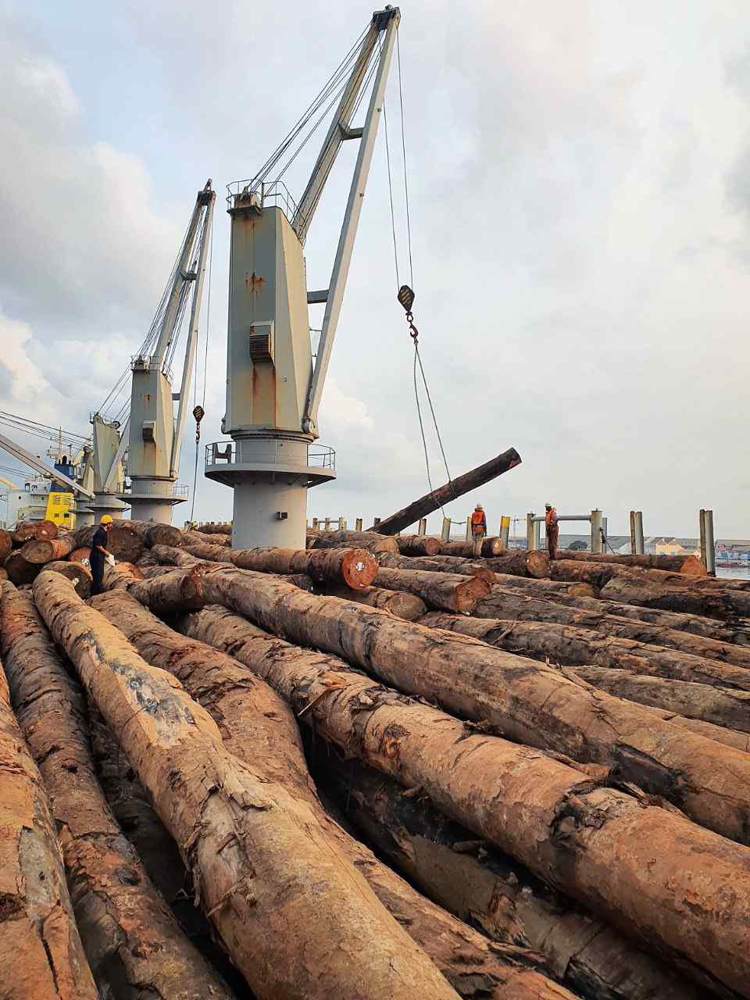
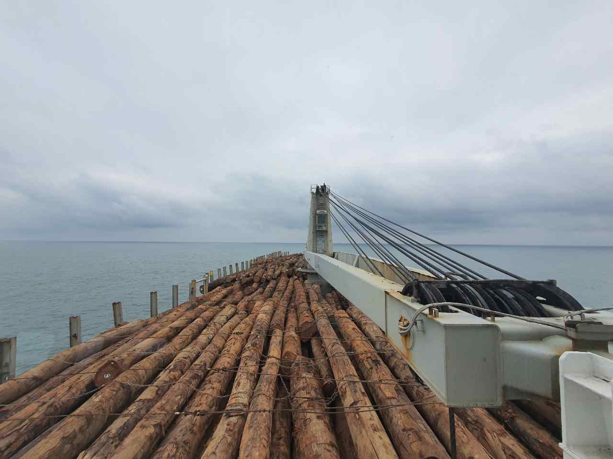
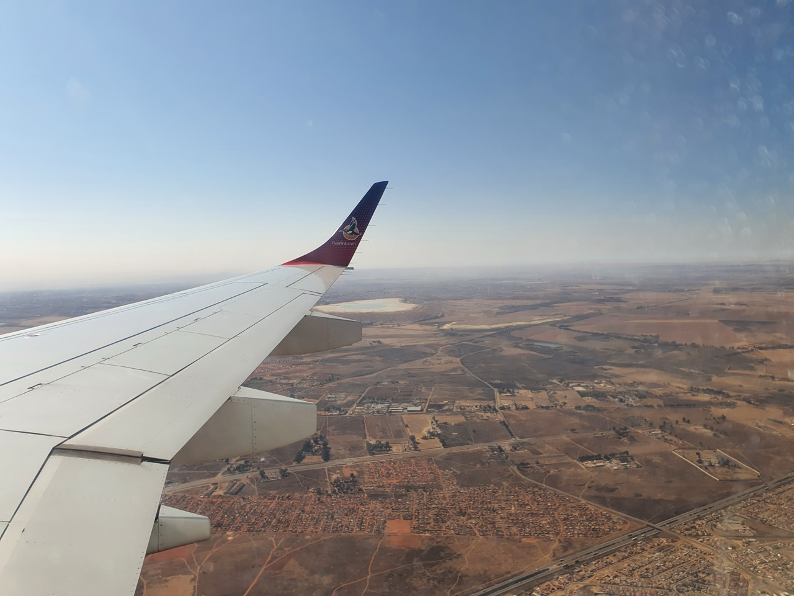
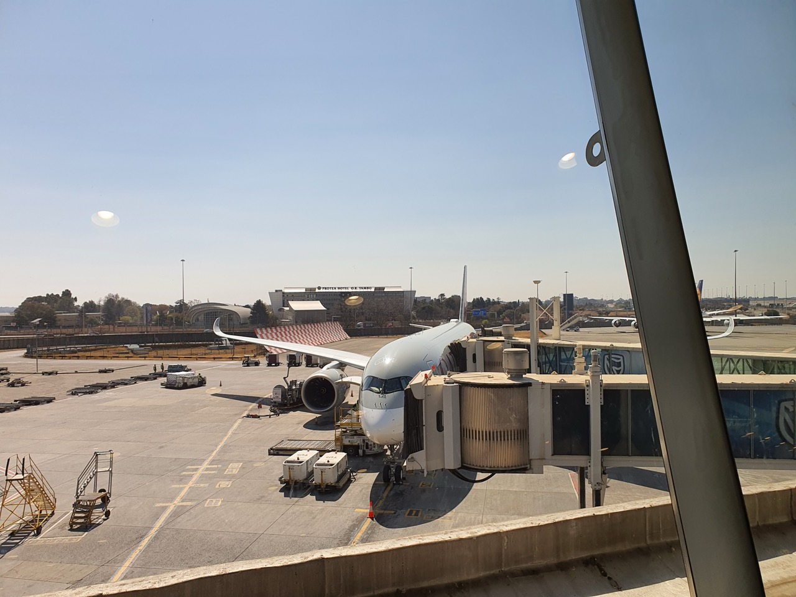
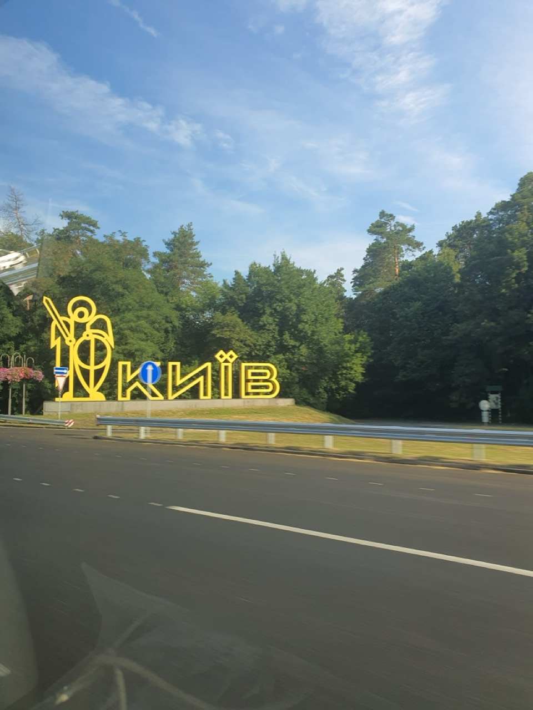

#### 2021.07.12 12:00 UTC+1 🌍 01°47.5S 001°03.6E

Ось ми й перетнули екватор, що відбувається вперше в моєму житті. Тож якщо для північної півкулі зараз літо, то у нас тут - зима)

Поки ми йдемо Атлантикою, температури й справді не високі, а через роботу кондиціонера доводиться спати під ковдрою. Втім це все одно краще, ніж бути у спеці.

Останнім часом я відчуваю постійну втому, і хоч ми вийшли з порту (тож працюємо 4 через 8), і я витрачаю більшу частину часу на сон - вона все одно не минає. Так само приймаю і вітаміни, але поліпшень не відчуваю. Таке відчуття, що ще один порт на тиждень-два в режимі 6/6 організм уже не витримає.

Сильніше я втомлювався тільки у своєму першому контракті третім помічником, коли доводилося допомагати матросам на кріпленні вантажу і ми працювали цілодобово без сну: пиляли дошки, розставляли під гусениці тракторів тощо.

Пам'ятаю, тоді в мене вперше в житті пішла кров носом.

#### 2021.07.15 🌍 Port Pointe Noire, Congo

##### 01:30

Ось ми і прийшли в черговий порт. Обіцяють тижневе навантаження.

Швартування було моторошне сьогодні. І на носі, і на кормі прорвало по одному кінцю, і ми ледь не стукнули пароплав у дупу.

За кілька днів у мене буде перший місяць на M/V CRUX, хоча за відчуттями я тут уже наче з пів-року.

Сподіваюся, якось ми це перенесемо.

##### 04:59

Поліцейський з боку порту каже, що може привести м'ясо слона за двісті баксів за кг, щоправда, це нелегально і за це можуть посадити, так само і м'ясо мавпи, воно вже продається просто в магазинах.

Однак екзотичненько.

##### 13:10

Як писав мій знайомий у своєму каналі про службу в армії [@mil_ik](https://t.me/mil_ik), будь ласка, ставте свої запитання в коментарях до цього допису, а я намагатимусь детальніше описати це у своїх постах)

Тому що читати пости зі скаргами, думаю, не дуже цікаво, так що треба писати більш просвітницький контент)

##### 13:27

Ми простояли менше доби і ось, за всієї складної вчорашньої швартовки, нас хочуть вигнати стояти на якорі на рейді порту Поінт Нуар до кінця моєї вахти (18:00), тому що треба пустити інше судно під навантаження. Але зате нас пустили відразу. Дуже весело, блін.

Upd. Прийшов якийсь лівий чувак у крутій морській формі, сказав, що він сек'юріті, і йому треба капітана, і в нас проблеми. Розповів, що десь там протикрисиний щиток упав, забрав останні три блоки сигарет і пішов.

Upd2. При тому що в нас усі щитки були на місці й узагалі все, до чого можна було домахатися, - було в гарному стані. Однак із високим м'язистим негром-сосюріті сперечатися хочеться в останню чергу. Коротше, це вам навіть не 90-ті.

##### 16:44

Закінчили вантажні операції і готуємося до виходу з порту.

Навіть невідомо, скільки ми стоятимемо на якорі, перед тим як нас пустять, щоб довантажувати.

#### 2021.07.16

##### 00:02

Нове життя - нова надія, хіх.

Відірваний мною на ліберійському пляжі відросток ліани скинув старе листя, а місця обрізу підсохли, і мені здавалося, що вона померла.

Однак сьогодні я виявив, що з місць, де було старе листя, пішло коріння (нижче рівня води) і свіжі гілочки (вище за нього).

Днями я візьму у третього помічника землю, якої він набрав у Ліберії аж ціле відро і посаджу свій саджанець😅.

|||
| --- | --- |
| | |
##### 00:19

Однак, контейнерний термінал має доволі сучасний вигляд. Останнім часом Китай дуже сильно зайшов на ринок Африки, будує свої заводи та інфраструктуру, і вивозить під шумок усе цінне.

Втім, місцевим жителям краще так, ніж голодувати і битися за кокоси з пальм, вони можуть дозволити собі жити як люди.

##### 15:02

Ось так перед самим нашим носом, менше ніж за півмилі, прошмигує контейнер Балтимор Стар.

|||
| --- | --- |

#### 2021.07.17

##### 14:12

<blockquote>
    

  В Аденській затоці застрягло судно, з одеськими моряками, є жертви ☠️  

  Судно THORN1 прямувало до Індії на "розпил". На борту корабля перебували 11 осіб екіпажу, з них 10 - громадяни України. Під час проходження через Аденську затоку у судна закінчилося пальне і вийшла з ладу система життєзабезпечення в 38-градусну (у тіні) спеку.  Через сильну спеку в одного з моряків стався інсульт. Чоловік помер. Він був з Очакова.  

  Одеса INFO ⚓️
</blockquote>

##### 14:20

Як показує практика, найчастіше моряки гинуть від потурання.

Коли приходять на судно Port або Flag State Control - намагаються хабарами вирішити "білий" репорт про проходження, а якщо ні - то провину за проблеми покладають на моряків, які витрачають нерви і сили на усунення, а не судновласників або операторів, які не проводять ремонти, не привозять постачання, експлуатують судна, які і зовсім не можна випускати в море. Часом морякам навіть доводиться проводити деякі роботи власним коштом без відшкодування коштів.

Upd. Також хочеться додати, що технічні засоби, які використовуються на суднах, від початку погані. Тож навіть до поломки вони можуть бути небезпечними. Чи то радари, що не відстежують "цілі", чи то електронні карти, що дуже лагають.

Думаю, в машинному відділенні не краще.

Відбувається це рівно через те, що користувач апаратури (моряк) жодним чином не може вплинути на вибір апаратури під час купівлі, а офіси купують ту, що дешевше.

Скільки б зараз не заплатили сім'ї загиблого моряка (а заплатять мінімально) - це не поверне нікому дорогої людини, сина, чоловіка і батька.

Так-то і виходить, що морська праця - навколорабська, адже твоя доля в руках офісу, а не твоїх. Ти для них просто механізм, який вони викинуть і "куплять" новий.

При цьому моряки віддають тисячі доларів, щоб отримати документи і піти в ці самі рейси.

Чи можна сказати, що люди самі винні?

Зараз це популярно, але я не дотримуюся такої точки зору, адже тоді можна сказати, що і зґвалтовані дівчата винні тим, що вони дівчата, що звучить повною маячнею, чи не так?

Ще одне [посилання](https://telegra.ph/Ukrainskie-moryaki-zastryali-na-bortu-avarijnogo-sudna-v-Dzhibuti-04-14), з більш детальною новиною.

#### 2021.07.18 01:57

Примудрився я тут знову чимось захворіти.

Температура скаче між 37 і 39, болить голова, а в тілі - ломота. Але ні горло не болить, ні нежитю немає.

Так само не можу нічого їсти - тягне всю їжу повернути назад. А навантаження просто протипоказані, адже просто пройтися 15 кроків починає покручувати голову, а під час спроби піднятися на три палуби догори я відчув себе 70-річним дідусем - просто задихався й увесь був у поту.

Сподіваюся, це не малярія чи корона.

Однак якщо просто сидіти на одному місці, то терпіти можна, тож я прийшов на вахту, вкрився пледом і зараз вип'ю гарячий фервекси, а потім додам чаю з м'ятою.

#### 2021.07.20 12:40

Учора мене зняли з вахт і стали прямо лікувати. Ну як прямо лікувати, але стежити. Пульс/тиск/насичення крові киснем - нормальні, ковід-тест - негативний.

Ми досі так і не зайшли в порт, хоча повинні були ще позавчора.

Учора температура сягала 40 градусів, але сьогодні повністю зникла.

Ще присутні проблеми з випорожненням, а точніше, з його майже повною відсутністю. Хоча кілька днів поспіль майже нічого не їв, тож не дивно.

Слабкість так само залишилася і нікуди не дівається.

#### 2021.07.27 20:00

Ми благополучно заново пришвартувалися в порту Pointe Noire.

Мене хреначило +40 по 4 рази на добу ці дні, а то й частіше. Але мене бентежило те, що я не міг навіть до туалету дійти без запаморочення.

Сьогодні мені вже набагато краще, я зміг помитися, почистити зуби, що дуже цінно для людини, яка не могла собі цього дозволити.

Ось що мене більше турбує, так це те, що з 6-го дня взагалі не сплю.

Завтра вранці, як я зрозумів, мене мають забрати на аналізи. І, сподіваюся, прокапають і доб'ють заразу.

#### 2021.07.28

##### 09:37

До мене приходила делегація, благо, я набрався сил нормально прибратися в каюті, з Капітана, агента, поліцейського і лікаря.

Капітан розповідав що відбувалося, я уточнював.

Вона поміряла температуру, зробила укол для збиття.

Перевірила тиск, у нормі.

Перевірила цукор, той виявився підвищеним.

Присудила малярію, при тому що для визначення малярії треба брати кров на аналіз.

Зараз агентка поїде купувати ліки, а майстриня надрукує інструкцію, як їх приймати.

##### 14:47

Мені принесли пакет із ліками. Серед них розчинні шипучі вітаміни та Метформін (знижує цукор), одні пігулки не дають підвищуватися температурі, інші від малярії.

Тож будемо лікуватися.

#### 2021.07.29 09:46

Доброго ранку,

Я нарешті поспав і в мене взагалі не підвищувалася температура. Слабкість все ще є, намагаюся їсти побільше і набиратися сил.

#### 2021.07.31 13:00

Нарешті я за ці дні вибрався з барлоги. Нам почали вантажити колоди на палубу.

Однак завтра о 6-й ранку нас знову мають вигнати очікувати на якір.

#### 2021.08.01 12:36

Сьогодні опівночі нас знову вигнали на якір. Імовірно, до четверга. Знову через якийсь priority vessel.

Я почуваюся краще і вже вийшов стояти вахти. Залишається слабкість, але вона не так впливає на роботу.

#### 2021.08.02 00:11

<blockquote>
  Танкер "Mercer Street" був атакований безпілотником-камикадзе. Загинуло двоє членів екіпажу  

  <a href="https://mil.co.ua/cherez-vybuh-bezpilotnyka-zagynulo-dvoye-chleniv-ekipazhu-tankera-mercer-street">
    Military Courier Ukraine
  </a>
</blockquote>

Працювати в морі дедалі небезпечніше.

Біля берегів Оману невідомий безпілотник-камікадзе вибухнув на судні-танкері. Загинуло 2 члени екіпажу. З огляду на те, що це танкер, радує, що не сталося загоряння вантажу, інакше жертв могло бути значно більше.

Це навіть не напад піратів, а військовий безпілотник.

#### 2021.08.04 16:08

<blockquote>
  Бойовики залишають танкер, який, як побоюються, був викрадений Іраном в Оманській затоці  
  <a href="https://www.thetimes.co.uk/article/fingers-pointed-at-iran-as-oil-tanker-is-seized-in-gulf-of-oman-mgmhsg2k0">Times</a>
</blockquote>

<blockquote>
  WARNING 001/AUG/2021 Update 01  
  Category: Incident – Potential Hijack – Non Piracy  
  Description: An Incident is currently underway in position 2502.00NN 05728.54E. Incident upgraded to Potential Hijack.  
  
  <a href="https://twitter.com/hashtag/MaritimeSecurity">#MaritimeSecurity</a> <a href="https://twitter.com/hashtag/MarSec">#MarSec</a>  

    
  
  &mdash; United Kingdom Maritime Trade Operations (UKMTO)
</blockquote>

Ще одне судно-танкер захоплено. Кажуть, що це не пірати.

Що відбувається у світі - зрозуміти складно. Зрозуміло тільки одне, що робота в морі дуже небезпечна.

#### 2021.08.05

##### 16:24

<blockquote>
  Смерть від коронавірусу в морі  
  Я хочу розповісти правду про те, що трапилося на борту CMA CGM SORBONNE з прекрасною людиною електромеханіком Жуковим Євгеном Генадійовичем. Сином, братом і просто людиною, яка померла через недбалість і нерозторопність начальства вищевказаного судна та медичної бригади в порту Сінгапур.  .
  <a href="http://telegra.ph/Smert-ot-koronavirusa-v-more-08-05">Підслухано Одеса</a>
</blockquote>

Ще один факт наплювацького ставлення до екіпажу і ще один загиблий моряк.

Ще чийсь син, чоловік і батько пішов в інший світ через байдуже ставлення. При тому що CMA CGM вважається хорошою компанією.

#### 17:42

#### 2021.08.06 17:08

Наші хлопці кореплять колоди, щоб вони не змістилися в переході.

Тим часом капітан оголосив, що відхід судна буде о 03:30 ночі.

Тож у мене з півтора місяця ходу до Китаю не буде інтернету.

#### 2021.08.07

##### 00:41

Щось перспектива відходу о 03:30 мені здається занадто райдужною.

У нас ще купа вантажу, а потім його треба закріпити.

Поки була не моя вахта, на малій воді судно навіть сідало на ґрунт, але зараз усе гаразд.

##### 01:51

У підсумку о 0135 ми закінчили вантажні операції. Однак, все ще залишається кріплення вантажу.

Тож ми й справді можемо вийти о 0330. Хоча докріпити ще 3 трюми матроси навряд чи встигнуть.

##### 02.42

Старший помічник капітана робить draft survey (визначення кількості вантажу). Після цього матроси закріплять крани по-похідному.

A о 0330 у нас і справді буде лоцман і судно виходитиме з порту.

##### 06:12

Ми вийшли з порту і о 0510 за місцевим часом кинули якір.

На якорі матроси проводитимуть докріплення вантажу, після чого ми вирушимо в точку рандеву з судном бункірувальником за 150 миль від берега, де на ходу братимемо паливо (під 700 тонн).

Тим часом мене залишили вахтувати до 8 години ранку, щоб старпом поспав кілька годин. (У нього вахта з 04 до 08) Бо старпом вийде з матросами на кріплення вантажу о 8 годині.

Однак мені теж залишиться поспати пару годин до моєї вахти о 12 годині.

##### 11:55

Ми стоїмо на якорі, а матроси докріплюють вантаж.

На даний момент закріплено 3 трюми з 5

##### 15:40

Кріплення закінчили, зараз чекаємо поки готують машину до запуску і будемо вибирати якір.

Тож протягом 20 хвилин ми підемо з Конго 🇨🇬 на офшорне бункерування.

#### 08.08.2021 13:00 UTC+1 🌍 05°13,5S 009°35,7E

Моя вахта з 00 до 04 накрилася мідним тазом. О 5 годині підійшов бункерувальник, тож я був на містку, поки старпом із 3пкм пришвартовували його. Потім старпом займався з паперами з безпеки, а стармех почав приймати паливо. У підсумку я другий день поспіль стояв на містку до 8 ранку, мх.

Оскільки у нас не було часу навіть щоб поїсти, капітан розпорядився, щоб на місток принесли смачні бутери з ковбасою, сиром, у булочці для хот догів. Було й справді смачно, особливо з кавою з молоком.

О 13 годині ми вже закінчили приймання палива і відв'язали баржу.

Тепер до 15 числа на нас чекає спокійний тиждень руху в бік порту Елізабет, де ми будемо отримувати провізію і де, можливо, буде зміна частини екіпажу.

Я тут подумав, чому мені дико захотілося фруктів, коли ми зайшли в порт. По-перше, ясна річ, вони смачні. А по-друге, мені здається, після хвороби мене зустрів дикий авітаміноз, так що не допомагали навіть таблетки-вітаміни. До речі, зелені манго пожовкли і зараз дуже навіть смачні.

#### 11.08.2021 12:00 UTC+1 🌍 18°11,2S 011°02,2E

Ми вже пішли досить далеко на південь. А всі знають, що коли в північній півкулі літо, то в південній - зима. У нас зараз температура +17, а кондишка продовжує так шпарити, що я сплю під двома ковдрами. Але я завжди казав, що краще холод, за якого можна сховатися або одягнутися, ніж спека, від якої помираєш, не маючи сил щось змінити.

Я почав виходити в більш спокійний робочий режим після хвороби. Організм навіть сам почав вимагати руху, тож я проводжу сесії в Beatsaber. Багато пісень на хард складності я можу вже зробити в Full Combo, а експертні - рідко становлять мені проблеми.

Ходити, як на минулому судні тут нікуди, адже вся палуба зайнята колодами, як ви бачили на фото раніше.

Спасибі всім хто за мене хвилювався, зараз я можу сказати, що я повністю вільний і від наслідків хвороби, у вигляді слабкості.

#### 13.08.2021

##### 00:00 UTC+1 🌍 24°03,9S 012°10,8E

Усім привіт,

Ми йдемо зі швидкістю 5,5-6,3 вузлів (за нормальної 10,5-12,5) через дуже сильний зустрічний вітер і течію та великі хвилі.

І адже спеціально найнята служба для стеження за погодою нас не попередила про це.

Хвилі сягають п'яти метрів, а вітер - 50 вузлів. За фактом - це шторм 9-10 балів.

Капітан сказав стежити за погодою (щоб не стало ще гірше), а на ранок вирішуватиме, що нам робити.

Зараз безмісячна ніч, тож моря абсолютно не видно, проте завивання вітру дуже неприємні.

##### 15:00 UTC+1 🌍 25°16,9S 012°27,6E

Як виявилося, сьогодні п'ятниця 13го і в нас є невелике покращення погоди. Принаймні зараз ми йдемо ті ж 5,5-6,3 що і вчора, а не як на моїй нічній вахті - 3,8-4,8. І на вигляд помітно, що стає легше. Хоча вітер так і тримається 40 вузлів з поривами до 50.

За цю добу ми пройшли всього-лише 165 морських миль (305 км), з нормальною швидкістю 11-12 вузлів ми проходимо 260-290 миль (480-550 км (як запас ходу тесли😂)).

Upd. Судно скаче на хвилях, і коли потрапляє з ними в резонанс - відбуваються величезні бризки, які пролітають з носової частини 170 метрів і заливають навіть надбудову (житлові приміщення) судна, що розташовані на кормі судна. Зате в цих бризках видно чудові невеликі веселки.

#### 14.08.2021 15:00 UTC+1 🌍 27°51,4S 013°20,3E

Сьогодні вдень шторм пішов на спад, хвилі менші, вітер слабкіший, а швидкість уже близько 9 вузлів, тож приблизно о 17-му серпні ми маємо прибути в Порт Елізабет, де буде одержання провізії та запчастин, а також зміна екіпажу.

Однак за цю добу ми пройшли ще менше, ніж за минулу - 155 миль (290км).

#### 15.08.2021 14:00 UTC+2 🌍 30°59,7S 015°30,6E

Сьогодні вночі ми перевели час, тож у третього помічника вахта була на годину коротшою, ну а у всіх інших - відпочинок.

Кілька днів тому я в документах, які третій помічник готує на прихід судна в порт Елізабет, побачив своє прізвище в списках списуваних членів екіпажу. Не сказати, що я був сильно здивований, але було не дуже приємно. Про причини мого списання я розповім трохи пізніше.

Знайшов цю інформацію я 13го числа, зараз 15е, а прихід у порт - 17го. Однак мені досі ніхто нічого не сказав. У перший же день я потроху почав збирати свої речі.

Цікаво, про мій від'їзд мені повідають, коли до борту підійде буксир, на який треба буде злазити з судна?

Утім, не те щоб я був сильно засмучений. На цьому судні моральна обстановка дуже неприємна. Підстави, підлості, чутки, пересуди і постійна напруга в повітрі вимотують набагато сильніше, ніж робота.

Тож скоро зустрінемося на березі, кому обіцяв)

#### 18.08.2021

##### 02:00 UTC+2 🌍 34°03.1S 026°01,2E Рейд Порта Елізабет

З незрозумілих мені обставин капітан ставиться до мене дуже дивно.

Якби його просто в чомусь не влаштовувала моя робота, як мені здається, нормальна людина просто підійшла б і сказала щось на кшталт: "Мене не влаштовує як ти працюєш, тому я змушений відправити тебе додому".

Однак щоразу коли він мене бачить він косить обличчя, будь-які пов'язані зі мною речі робить недбало (хапає або кидає речі), спілкується грубо. Як я говорив раніше, мені всього за день до від'їзду тонким натяком сказали, що я їду додому.

У паспорті моряка в компанії, що відправляє в рейс, пишуть дату зарахування (зазвичай, пишеться дата вильоту з країни проживання), він її виправив на дату фактичного прибуття на судно (на день пізніше). Та ви серйозно? Такого ніхто ніколи не робить.

Виникає відчуття, ніби я якесь зло йому зробив навмисне. Я з таким ставленням зустрічаюся вперше.

Розумію, що людина всього 2 місяці капітан, але треба ж залишатися людиною.

Я бажаю йому, щоб з досвідом він став гарним капітаном, про якого ніхто не писатиме подібного, а навпаки моряки будуть говорити один одному мовляв "З таким капітаном можна працювати", і дзвонили, цікавлячись здоров'ям і станом справ.

##### 13:00 UTC+2 🌍 34°41.4S 023°54,2E

Сьогодні ввечері ми приходимо на рейд порту Елізабет, але дозволу стає на якір нам не дали, тож будемо дрейфувати.

Приблизно о 09-10 ранку завтра я вже буду сходити на катер, після чого, звичайно ж, нас відправлять на ПЛР-тест перед вильотом.

Само собою, як від мене приховували сам факт мого від'їзду, нам досі ніхто не дав квитків, а мені так і не сказали, чи дадуть мені зарплату за цей місяць, чи мене відправляють додому власним коштом. Так само майстер досі не дав вказівки вивісити списки тих, хто їде і приїжджає. На секундочку, завтра вранці нам уже слазити на катер.

До речі, досі мені так ніхто офіційно і не сказав, мовляв "Ти їдеш додому". Хоча вже видали мої документи, тож і так усе зрозуміло.

Однак, як я і писав раніше, я радий, що не буду перебувати тут далі. Якби не вийшло списати мене, думаю, мені б влаштували "вирвані роки", так що я сам би завив і пошкодував, що не поїхав.

##### 17:00 UTC+2 🌍 Port Elizabeth

Квитки Елізабет - Йоганнесбург - Доха - Київ / Катарські авіалінії

Валіза їде з Йоганнесбурга напряму до Києва, забирати треба буде тільки там.

Посадка літака в Києві о 08:00 20.08.21 UTC+3.

#### 2021.08.19

##### 01:00

Жерти хочеться, вони в готелі так мало погодували...

А капітан не дав travel expenses, а дав по 100 баксів, записані як cash advance, чи то пак аванс, який вираховується із зарплати.

Але тут нічого не можна купити, тому що магазини й кафе закриваються о 18-й і відкриваються не раніше сьомої години, а всі будинки й готелі огороджують свої паркани колючим дротом з електрикою. Тож якщо ввечері вийти з готелю - то можна скасовувати твої квитки на літак.

Підозрюю, що незважаючи на дуже класні машини на дорогах, рівень бандитизму тут зашкалює.

##### 07:00

Кілька людей не змогли отримати результати ПЛР тесту, але агент сказав, що їх надішлють до Йоганнесбурга.

Для внутрішнього перельоту достатньо експрес-тесту, а ось для міжнародних потрібні серйозні тести.

Увечері нам говорили, що вранці нас годувати не будуть.

О 06:20 мені подзвонили і сказали, що о 07:00 нас забере агент, я виходжу з номера о 06:40, агент уже під'їжджає.

А хлопці кажуть що там яєчня з сосисками. Довелося дуже швидко перекушувати, заливаючи все це молоком. Я 2 місяці не бачив нормальних смачних сосисок, а хлопці - по 5-7.

||||
| --- | --- | --- |
||||
||||
|!|||

##### 20:10 UTC+2

Залишається 1,5 години до посадки в Досі, Катар 🇶🇦, там ми проведемо близько 3 годин до наступного рейсу і вирушимо до Києва.

Там ми приземлимося о 8-й годині ранку і нас усіх вісьмох забере спринтер, про який домовився зі знайомим один із членів нашої групи.

До речі, у Катарі часовий пояс UTC+3, так само, як і в Україні, треба б перевести час на телефоні.

Upd. Літак увесь час польоту погойдує, мабуть, повітряні потоки неспокійні, як океани, що штормлять.

#### 2021.08.20

##### 01:50

Через 10 хвилин почнеться посадка економ класу на наш літак до Києва. Через 6 годин я буду в Україні, а через 12 - в Одесі^^^.

##### 08:34

Ну ось ми і приземлилися в аеропорту Борисполя, пройшли паспортний і митний контроль і вирушаємо до Одеси)

||||
| --- | --- | --- |

##### 23:14

Дякую всім, хто стежив за моїми записами.

На цьому закінчується мій другий контракт 2пкм. Поки що я очікуватиму пропозицій від компанії, щоб доопрацювати свої документи.

Якщо у вас є якісь скарги і пропозиції до того, як я веду цей канал, будь ласка, опишіть їх у коментарях під цим постом.

На цьому мої пригоди в моєму, сподіваюся останньому, рейсі закінчилися і я вирушив у новий світ, світ IT, де до людей ставляться як до людей, а не як до тварин.

Спасибі що прочитали

Завжди ваш Кацу ❤️ 🦊
