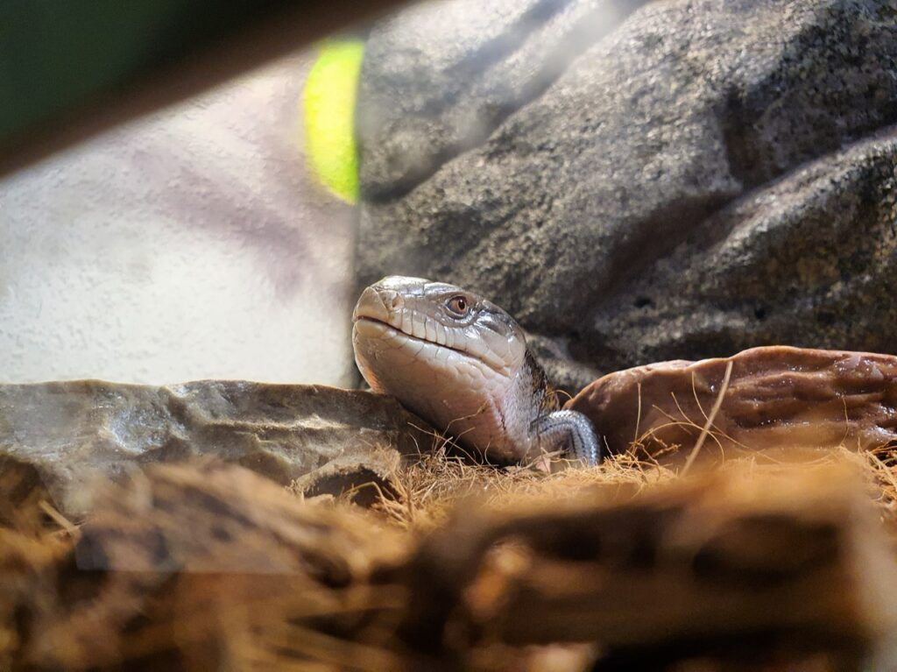
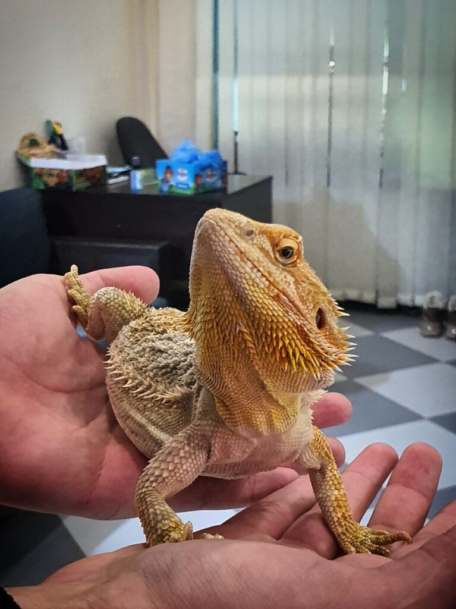
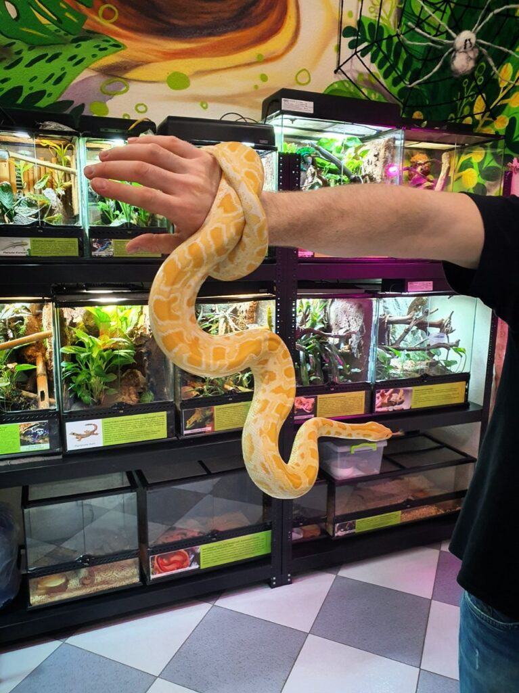

The following report from agent Katsu arrived.
Greetings again here) Last couple of weeks I was resting from my flight on Fortune Trader and putting my thoughts in order, and today with a friend I got out to the reptile cafe again [where I was](/blog/other/19.11_odessa_rept_cafe), as it turned out, about a year and a half ago.
Many of the snakes and lizards have grown, as well as a lot more terrariums, one paludarium, and two more are getting ready to be filled. The paludarium is a complex ecosystem, which is an aquarium and a terrarium at the same time, there is both land and water.
The cafe is expanding, and to my mind, if you live in Odessa, or are passing through here, it is worth a visit.
I attach a photo report below)

| | | |
|:---:|:---:|:---:|
|  |  |  |
|  |  |  |
|  |  |  |
|  |  |
