До вашої уваги ігровий ноутбук Xiaomi Mi Gaming Laptop (late 2018).

|                                |                                                                                                                                                                                                                                                                                                                                                                                                                                                                                                                                                                                                                                                                                                                                                                                                                                                                                         |
| :----------------------------: | :-------------------------------------------------------------------------------------------------------------------------------------------------------------------------------------------------------------------------------------------------------------------------------------------------------------------------------------------------------------------------------------------------------------------------------------------------------------------------------------------------------------------------------------------------------------------------------------------------------------------------------------------------------------------------------------------------------------------------------------------------------------------------------------------------------------------------------------------------------------------------------------- |
| 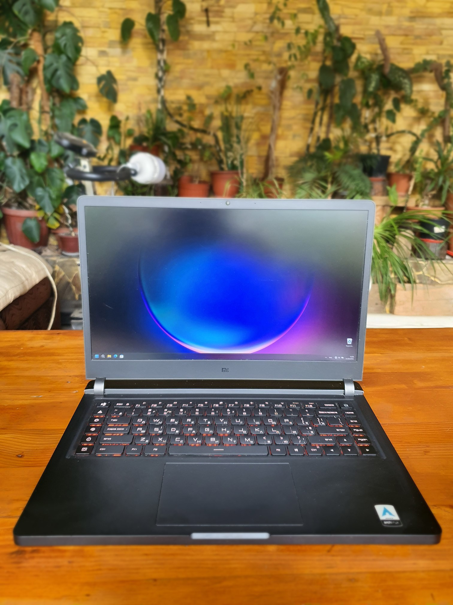 | 
Був куплений у лютому 2019 року і служив вірою та правдою. Стан на 4 видно по фото. Спокійно тягне хіти минулого на ультрах, будь то The Witcher 3, Nier: Automata, Nier: Replicant. Здатний до роботи з VR, тягне HL Alyx і Skyrim VR на середньо-низьких.

Здебільшого використовувався для роботи в веб розробці, грав не багато.

Клавіатура має RGB підсвічування, розділену на 4 секції, 5 макро-клавіш, на які можна призначити що завгодно, а також кнопку включення вентиляції в максимальному режимі. , якщо не включати RGB підсвічування - виглядає дуже суворо, на відміну від конкурентів. , HDMI підключений безпосередньо до GPU Nvidia для більшої продуктивності, а не до Intel, як це робиться зазвичай.

Продав у зв'язку з бажанням купити комп'ютер потужніший. В наявності коробка та блок живлення. 
 
Вдало продав, дякую за увагу)
 |

## Характеристики

|                                                 |                                                                                                                                                         |
| :---------------------------------------------: | ------------------------------------------------------------------------------------------------------------------------------------------------------- |
|                    Процесор                     | Intel Core i7-8750HT 2.2-4GHz (6 ядер/12 потоків)                                                                                                       |
|                  графічний чіп                  | Intel UHD Graphics 630 (GT2) (інтергрований) nVidia GeForce GTX 1060 6GB GDDR5 (192bit) (дискретний)                                                 |
|                       ОЗП                       | 16GB (2×8GB) Samsung M471A1K DDR4-2666 SDRAM (20-19-19-43)                                                                                              |
|                  Накопичувачі                   | SSD 256GB NVME 4×PCI-E 3.0 SAMSUNG MZVLB256HAHQ\nHDD 1TB SATA 3.0 Seagate ST1000LM048-2E7172\nПрисутні два M.2 слоти NVME/SATA SSD і 2,5" слот для SATA |
|                      Екран                      | 15,6" 16:9 IPS FullHD Panda LM156LF9L01 (матовий)                                                                                                       |
|          Звуковий чіп Realtek ALC1220           |
|                      Порти                      | 4×USB 3.0, USB Type-C, HDMI, 3,5 mini-Jack (окремо навушники мікрофон), RJ-45 Ethernet, SD Card reader                                                  |
|                     Батарея                     | 55 Вт•год SUNWODA G15B01W (знос 8%)                                                                                                                     |
|                Габарити та вага                 | 365×265×20.9 мм, 2.7кг без урахування БП                                                                                                                |
| Блок живлення 180W MA100000340388930CM4 (0.5кг) |

## Фото

|                                                                                 |                                                                                      |
| :-----------------------------------------------------------------------------: | :----------------------------------------------------------------------------------: |
|          |                     |
| 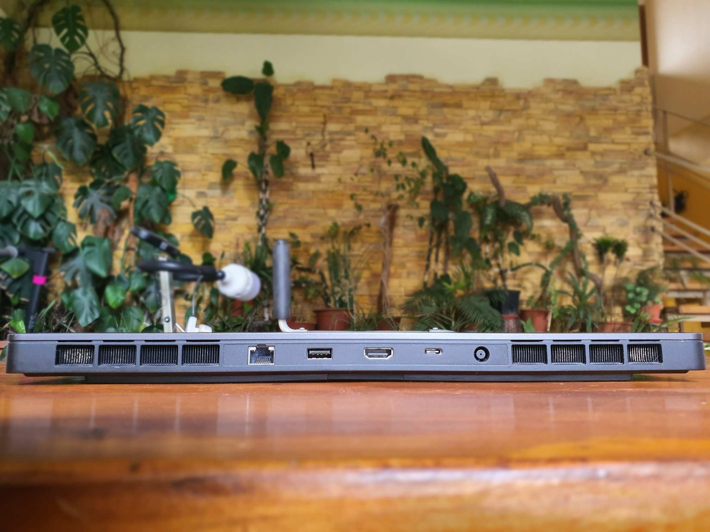 | 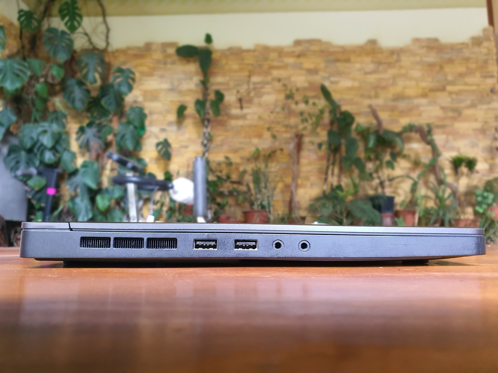 |

## Програми та тести

|                                                                                             |                                                                                   |
| :-----------------------------------------------------------------------------------------: | :-------------------------------------------------------------------------------: |
|                                           |                                |
|                     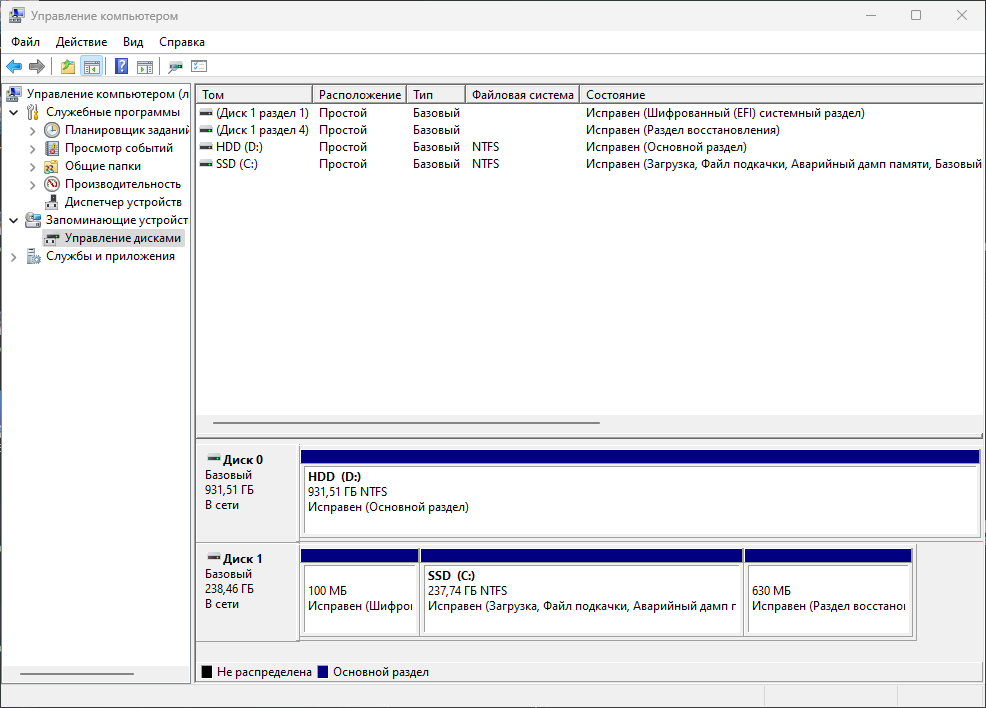                      |                       |
|          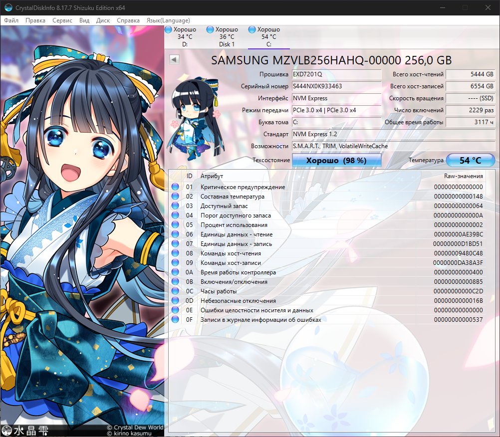           |     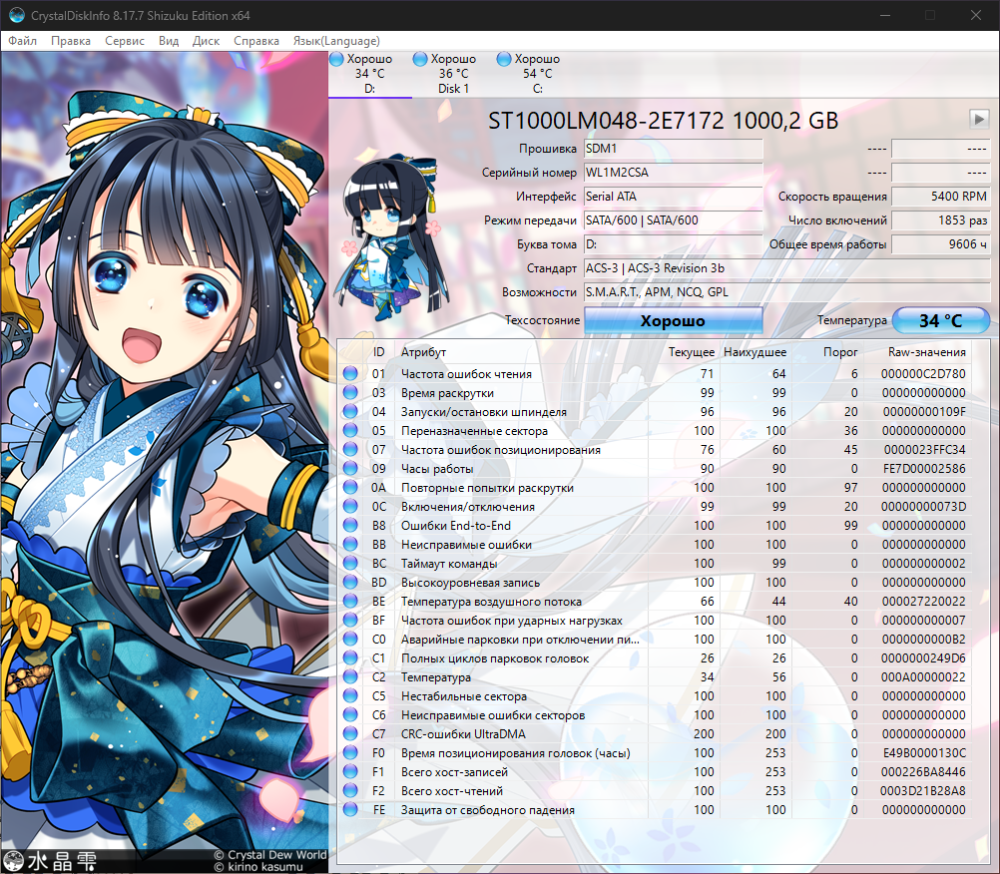      |
|                     |           |
|       |   |
|  |  |

## FPS іграх

### Call of Duty Warzone

Низькі налаштування, 1080р, без вертикальної синхронізації.

|  |  |
| :------------------------------------------------------------------------------------------: | :------------------------------------------------------------------------------------------: |

### Dead or Alive 5

Ультра налаштування, 1080р, вертикальна синхронізація не вимикається.

| 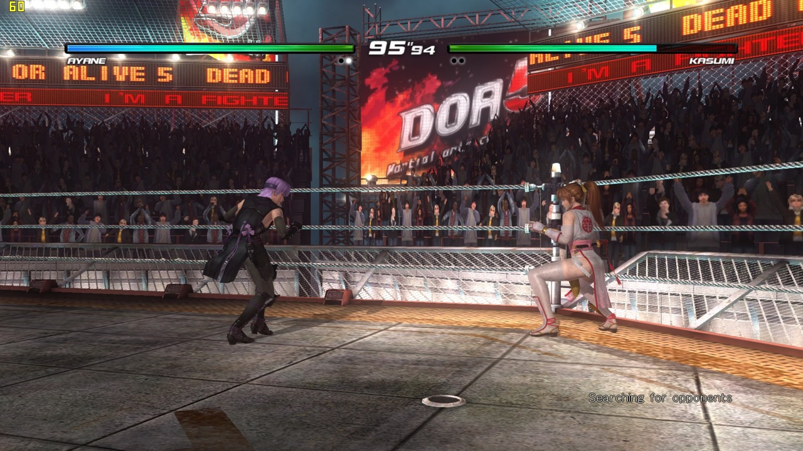 | 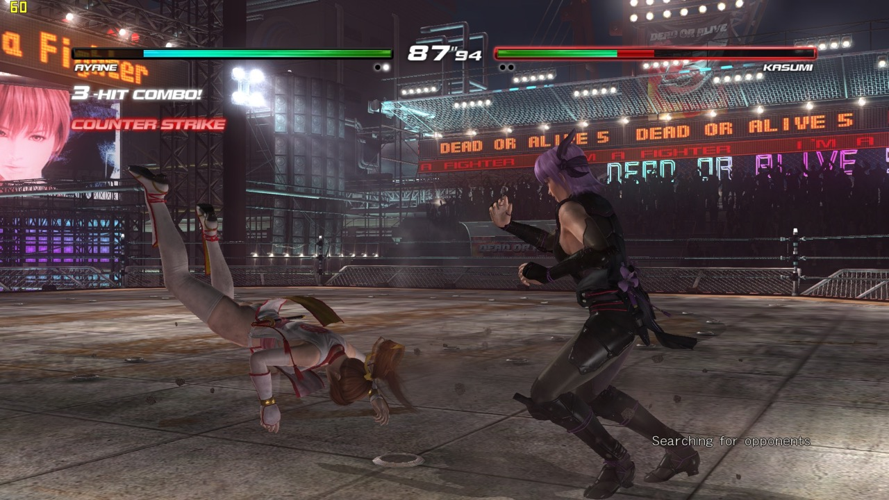 |
| :-----------------------------------------------------: | :-----------------------------------------------------: |

### Euro Truck Simulator 2

Ультра налаштування, 1080р, без вертикальної синхронізації.

| 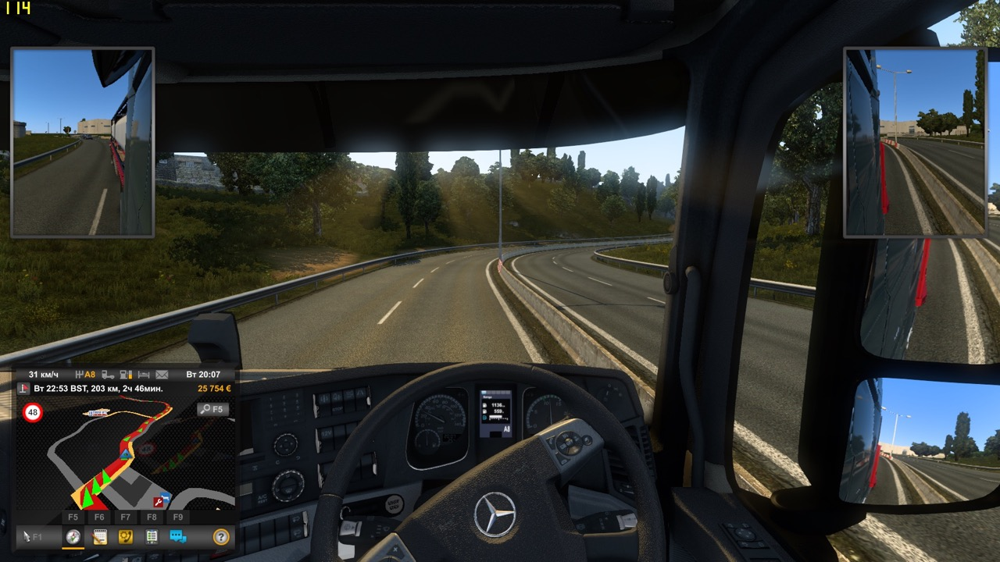 |  |
| :-------------------------------------------------------------: | :-------------------------------------------------------------: |

### Fallout 4

Ультра налаштування, 1080р, вертикальна синхронізація не вимикається.

| 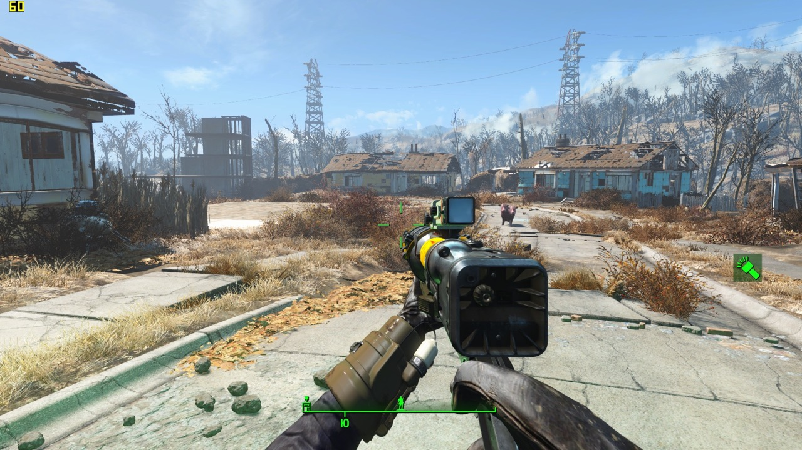 |  |
| :------------------------------------------------------------------------: | :------------------------------------------------------------------------: |

### Nier: Automata

Ультра налаштування, 1080p, без вертикальної синхронізації.

|                                                                  |                                                                  |
| :--------------------------------------------------------------: | :--------------------------------------------------------------: |
|  |  |
|  |  |

### The Elder Scrolls V - Skyrim Special Edition

Ультра налаштування, 1080р, вертикальна синхронізація не вимикається.

| 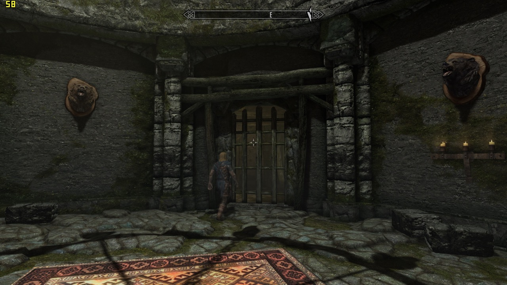 | 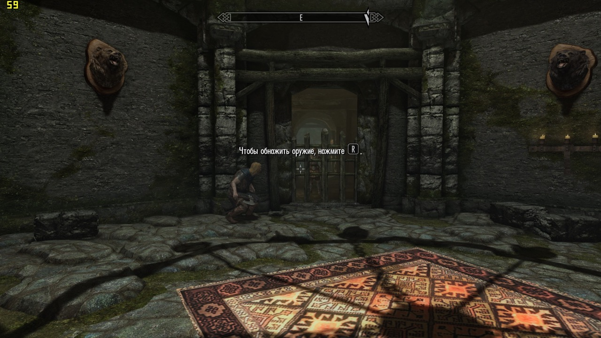 |
| :----------------------------------------------------------------------------------------------------------: | :----------------------------------------------------------------------------------------------------------: |

### The Witcher 3

Високі налаштування, 1080р, без вертикальної синхронізації.

|  |  |
| :----------------------------------------------------------: | :----------------------------------------------------------: |

### Warhammer: Vermintide 2

Ультра налаштування, 1080p, без вертикальної синхронізації.

|                                                                 |                                                                 |
| :-------------------------------------------------------------: | :-------------------------------------------------------------: |
|  |  |
|  |  |
