I present to your attention the Xiaomi Mi Gaming Laptop (late 2018).

| | |
|:---:|:---|
| | 
It was purchased in February 2019 and served faithfully. Condition 4 as seen in photos. Calmly pulls past hits on ultras, whether it's The Witcher 3, Nier: Automata, Nier: Replicant. Capable of working with VR, pulls HL Alyx and Skyrim VR on medium-low.

Mostly used for work in web development, did not play much.

The keyboard has RGB backlighting, divided into 4 sections, 5 macro keys to which you can assign anything, as well as a button to turn on the ventilation in the maximum mode.

There is also an RGB backlight on the sides.

In general , if you do not turn on RGB backlighting, it looks very strict, unlike competitors.

It has very good microphones and native noise reduction, so it works better on calls than a headset.

From the features , HDMI is connected directly to the Nvidia GPU for better performance, and not to Intel, as is usually done.

Sold in connection with the desire to buy a computer more powerful. Comes with box and power supply. 
 
Successfully sold, thanks for your attention)
|

## Characteristics

|||
|:---:|---|
| Processor | Intel Core i7-8750HT 2.2-4GHz (6 cores / 12 threads) |
| Graphics chip | Intel UHD Graphics 630 (GT2) (integrated) nVidia GeForce GTX 1060 6GB GDDR5 (192bit) (discrete) |
| RAM | 16GB (2×8GB) Samsung M471A1K DDR4-2666 SDRAM (20-19-19-43) |
| Storage | SSD 256GB NVME 4×PCI-E 3.0 SAMSUNG MZVLB256HAHQ\nHDD 1TB SATA 3.0 Seagate ST1000LM048-2E7172\nThere are two M.2 NVME/SATA SSD slots and a 2.5" SATA SSD/HDD slot |
| Screen | 15.6" 16:9 IPS FullHD Panda LM156LF9L01 (matte) |
| Sound chip | Realtek ALC1220 |
| Ports | 4×USB 3.0, USB Type-C, HDMI, 3.5 mini-Jack (separate headphone microphone), RJ-45 Ethernet, SD Card reader |
| Battery | 55 Wh SUNWODA G15B01W (8% wear) |
| Dimensions and weight | 365×265×20.9mm, 2.7kg without PSU |
| Power supply | 180W MA100000340388930CM4 (0.5kg) |

## Photo

| | |
|:---:|:---:|
|  | 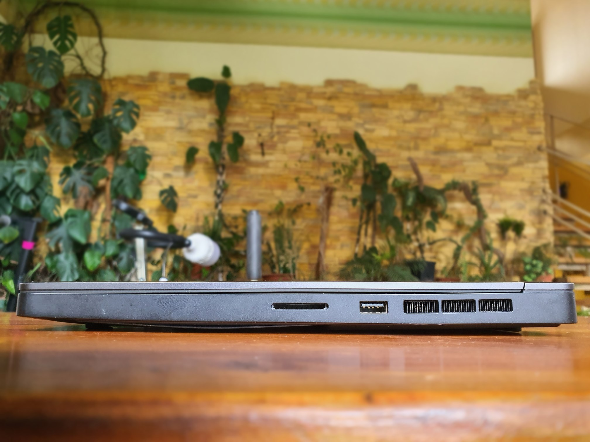 |
|  |  |

## Programs and tests

| | |
|:---:|:---:|
| 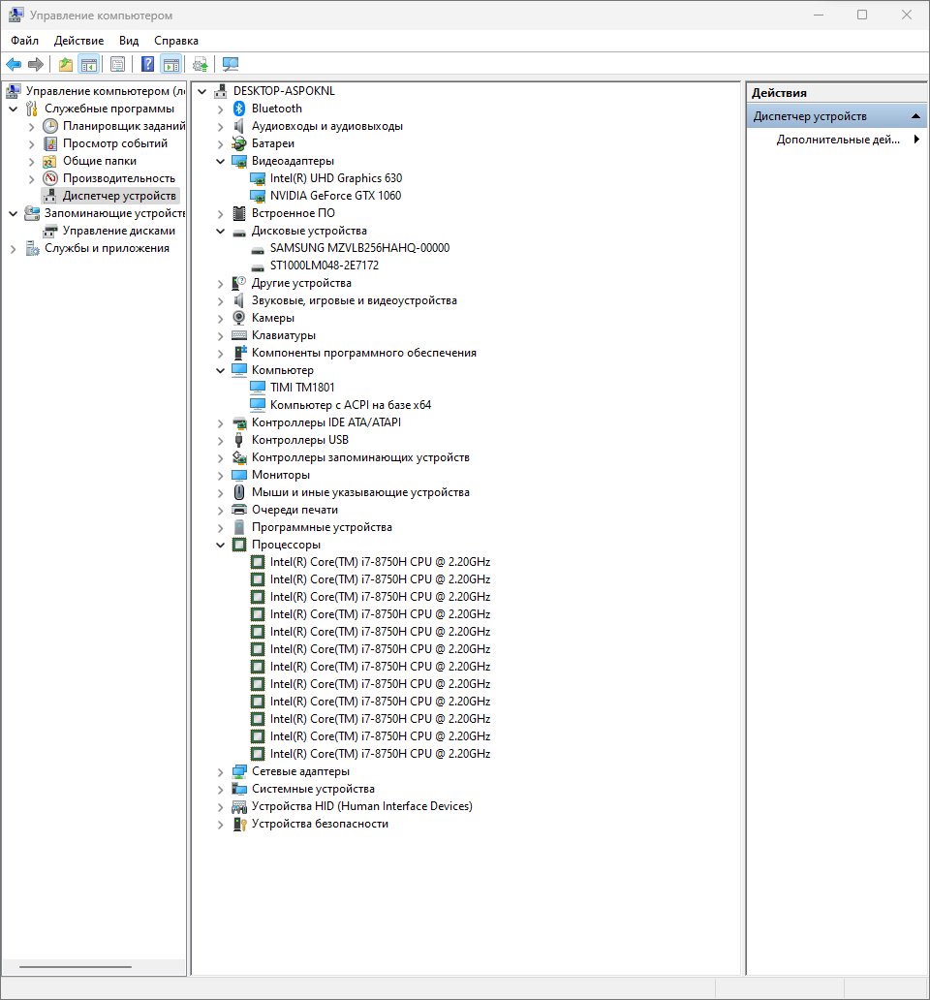 | 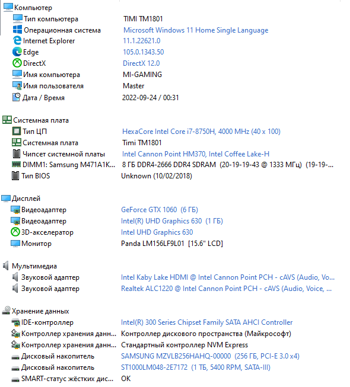 |
|  | 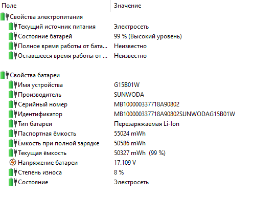 |
|  |  |
| 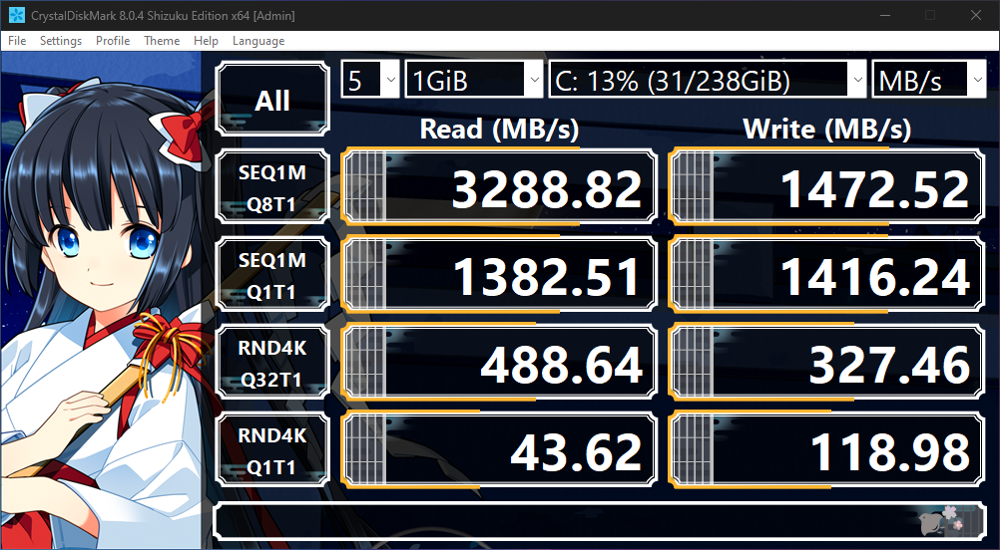 |  |
| 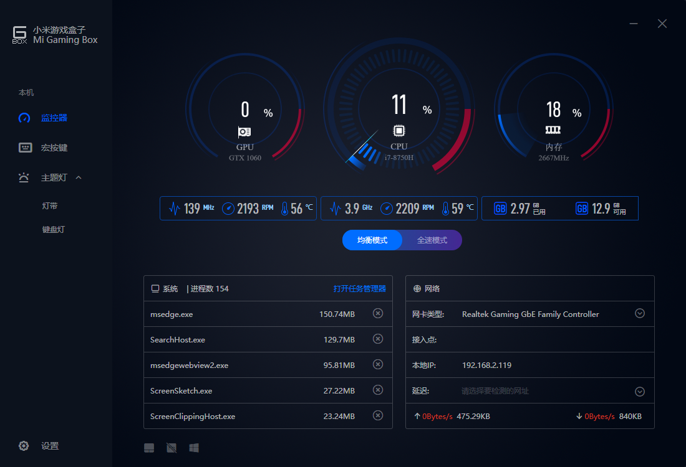 | 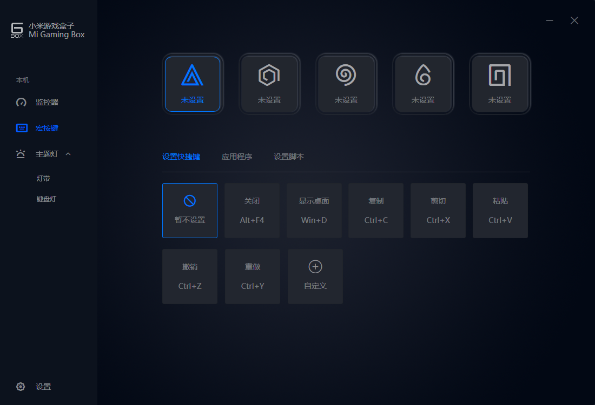 |
|  |  |

## FPS games

###Call of Duty Warzone

Low settings, 1080p, no v-sync.

|  | 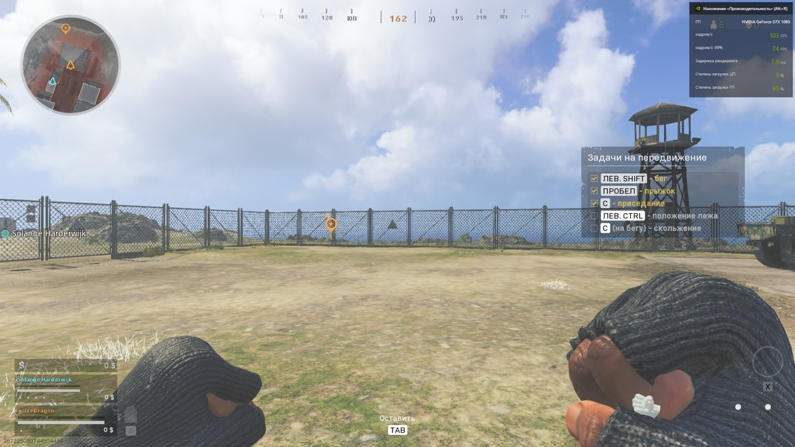 |
|:---:|:---:|

###Dead or Alive 5

Ultra settings, 1080p, v-sync does not turn off.

|  |  |
|:---:|:---:|

### Euro Truck Simulator 2

Ultra settings, 1080p, no v-sync.

|  |  |
|:---:|:---:|

### Fallout 4

Ultra settings, 1080p, v-sync does not turn off.

|  | 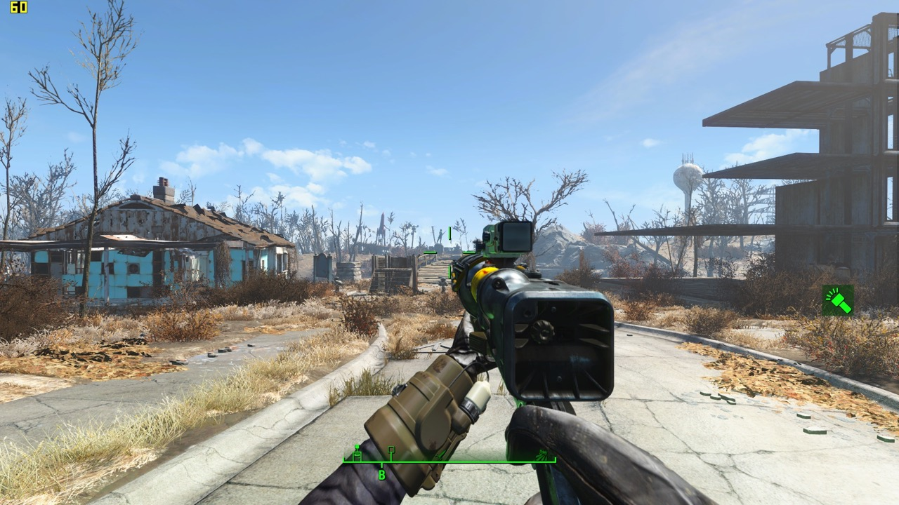 |
|:---:|:---:|

### Nier: Automata

Ultra settings, 1080p, no v-sync.

|||
|:---:|:---:|
| 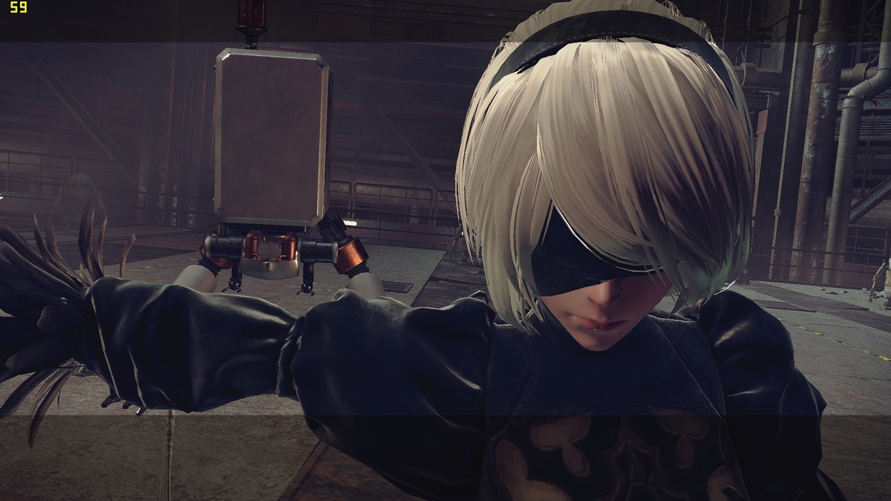 | 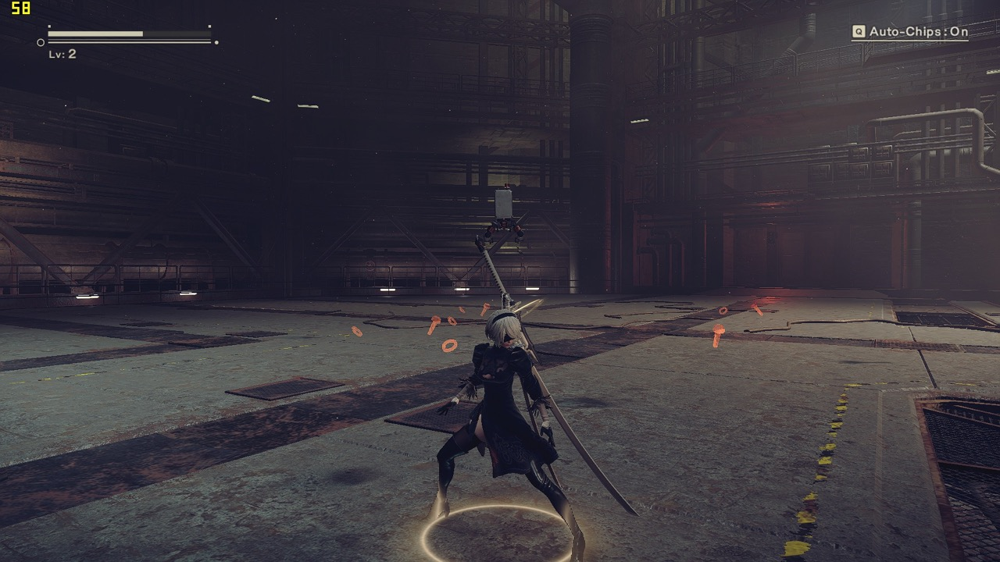 |
| 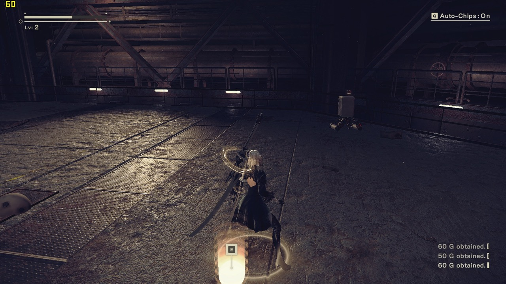 |  |

### The Elder Scrolls V - Skyrim Special Edition

Ultra settings, 1080p, v-sync does not turn off.

|  |  |
|:---:|:---:|

### The Witcher 3

High settings, 1080p, no v-sync.

| 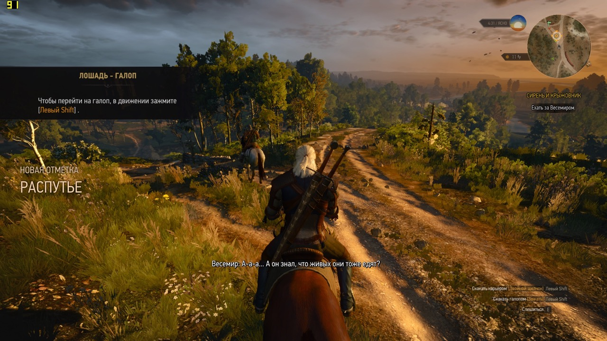 | 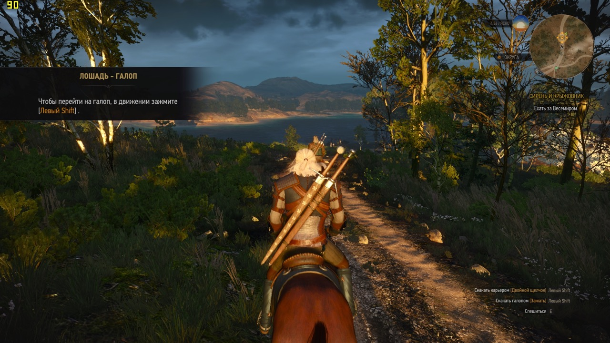 |
|:---:|:---:|

### Warhammer: Vermintide 2

Ultra settings, 1080p, no v-sync.

|||
|:---:|:---:|
|  |  |
| 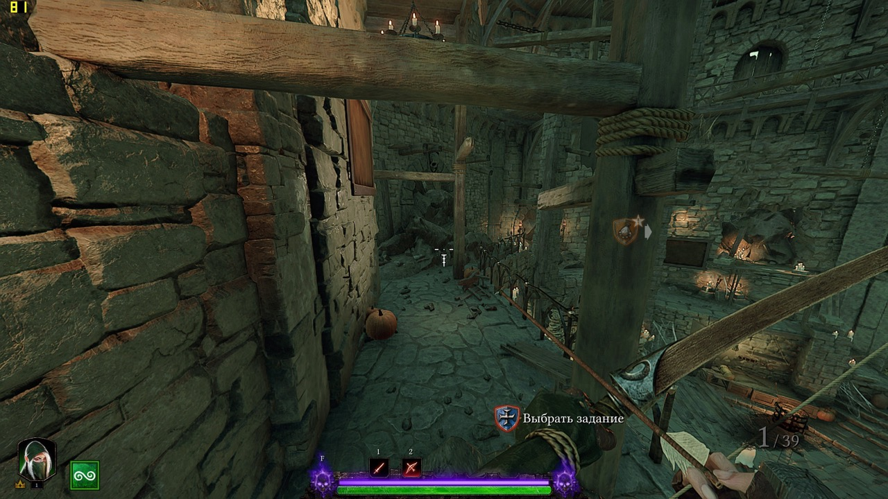 |  |
