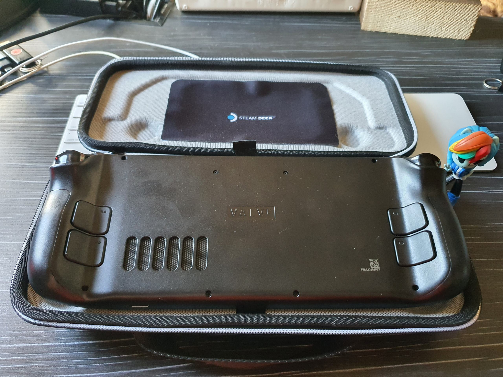
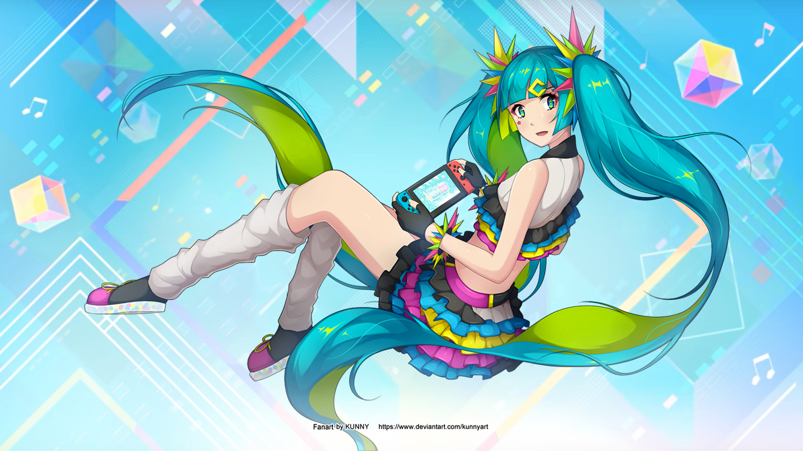

On December 1st, I became the lucky owner of the acclaimed console from Valve. Since I live in a country where Steam Deck is not available to order, I had to ask a good friend to order it for me. The Steam request was sent back in the spring, but the friend wasn't able to get and ship the console until closer to the end of fall.

But now the shipments are fine, and people are hardly waiting in line.

## A little anboxing.

As new items are much more taxed and levied, a friend gave the console a slightly shabby look to avoid state taxes)

|     |  |
| :----------------------------: | ------------------------------ |
|  |     |
|      |                                |

## Characteristics.

Not that I haven't written about them on every other portal on the internet, but I'll briefly remind you of them nonetheless.

#### SoC

Steam Deck is based on the original AMD processor with 4 cores / 8 threads, built-in Vega 8 graphics with 15W TDP.

#### RAM

16GB RAM run in 4 channel mode and are used for graphics as well.

#### Storage

My version has a 512 gb SSD but there are also 256 and 64 gb versions. The SSD is not unsoldered, and the format is M.2 2230 and can be replaced by the user (Valve does not approve).

There is also a slot for microSD cards, so you can add up to an extra terabyte of memory, or have multiple cards.

#### Screen

The 7" screen has a resolution of 1280x800 with an aspect ratio of 16:10. Resolution is high enough for games on this diagonal, but the screen ratio there are questions. Some games can not work with it adequately and show black bars, or the game is rendered full screen, and the HUD - only in the 16:9 area. But this is not a common problem. This screen isn't the best quality and has highlights, but it's not bad.

#### Battery

The 40Wh battery is not small enough for such a handheld and approaches the capacity of a laptop. However, it can draw up to 23W when playing AAA projects.

#### Ports

The USB Type-C port can be used for charging, connecting peripherals, hubs, monitors, hard drives. There is also a 3.5mm jack for headphones/speakers.

#### Controls

Beside standard stick, crossbar, triggers and A, B, X, Y buttons there are buttons on the back like on elite controllers. But one of the top features is the haptic vibration touchpads. The screen, of course, is also touch-sensitive.

There are separate steam buttons for controlling the store and most shortcuts, as well as a "..." button - which helps access a menu where you can limit TDP, CPU and screen frequency, to save power.

## User experience

#### Games

At the time of writing I've had the console for a month now, I've almost passed Cyberpunk 2077 on it and often play Hatsune Miku Project Diva MegaMix+.

AAA projects go on average at 30 fps on medium-low, and something easier can go up to 60 fps.

|  |  |
| :--------------------------------------: | ---------------------------------------------------------- |

#### Stationary mode.

The console can be safely connected to the TV and use any wireless controller (DualShock / DualSense / Xbox Controller), thus getting a PS4 equivalent in power.

Some easier games can be run at 1080p resolution, but resolutions higher than that, I don't recommend it.

#### Desktop Mode

In the shutdown menu you can find the option "Switch to desktop mode". After clicking on it you will be greeted by... KDE!

|  |
| :-------------------------------------------------: |

Yes, because Steam OS is based on the Arch Linux distribution with the KDE desktop environment. It's an open operating system which doesn't stop you from doing whatever you want.

Epic Games Store and GOG via Heroic Launcher? Easy.

Pirate games? Yes, please!

You also have a huge library of AUR (Arch User Repository) packages in front of you, yay, a console utility for installing applications from AUR, already preinstalled. This is more important for red-eyes like me.)

In short, there are no limitations for the end user as compared to the closed consoles of corporations like Sony, Microsoft and Nintendo.

#### Emulators

Yes, they are here, and there are plenty of them, because RetroArch is in the Steam store. Even though I didn't like it.

Emulation of very old consoles, including the Sony PSP, has no problem at all.

Nintendo Switch games go in better quality and at a higher frame rate than on the original console (just don't tell anyone, big N is very angry about that fact).

While PS4 and PSVita emulators are underway, there's even a PS3 emulator available for users with a huge amount of classic games of its time.

#### Shortcuts

On Windows/Linux or MacOS systems we get used to using shortcuts to speed up our work. The console also has a lot of these shortcuts which make it very easy and pleasant to use.

|  |
| :-------------------------: |

## Bottom line.

The console turned out pretty good and I really liked it. Quality build, enough performance to replace the PS4, and a size that allows you to take it with you on the road. The battery isn't amazing, but if you play indie projects on the road, you can pull in 6+ hours.

I can't say it's a must have, but it's definitely worth every geek's attention)
