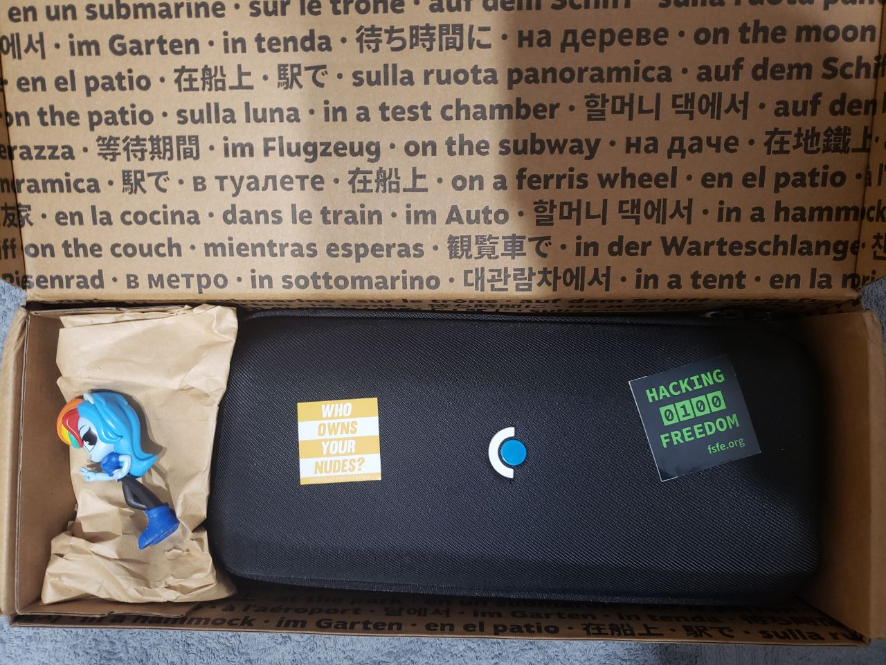
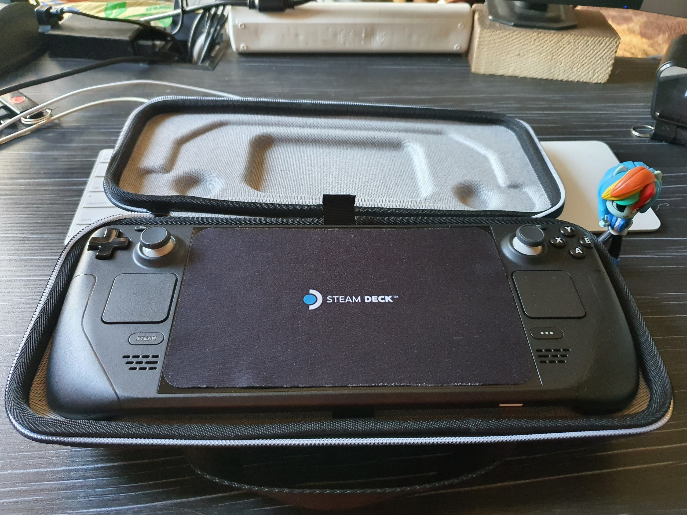
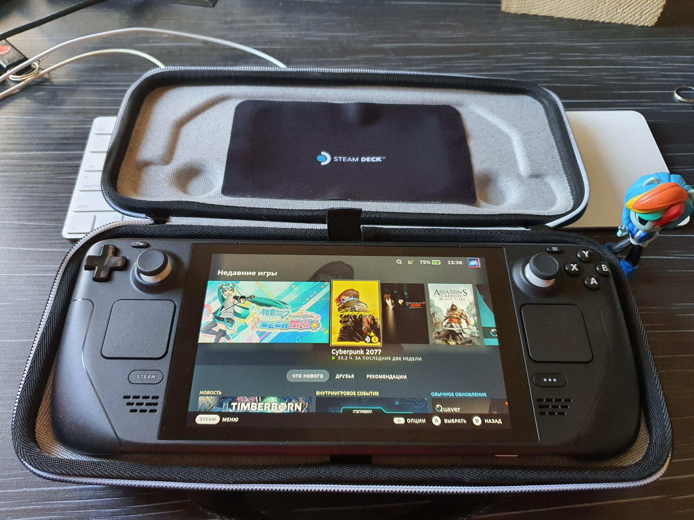
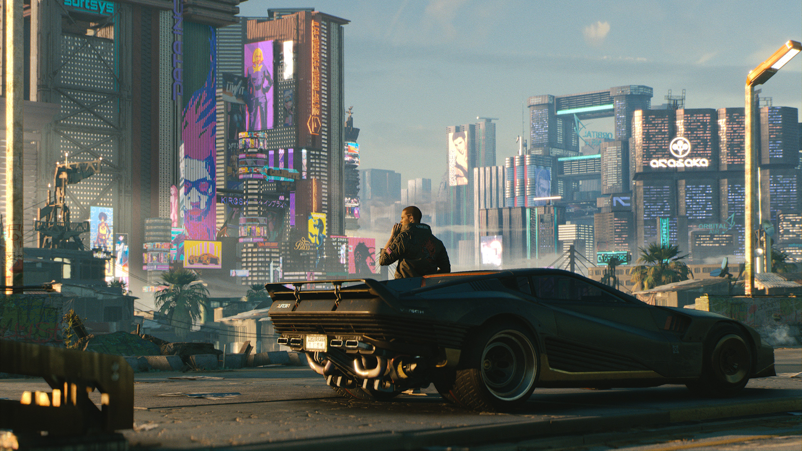
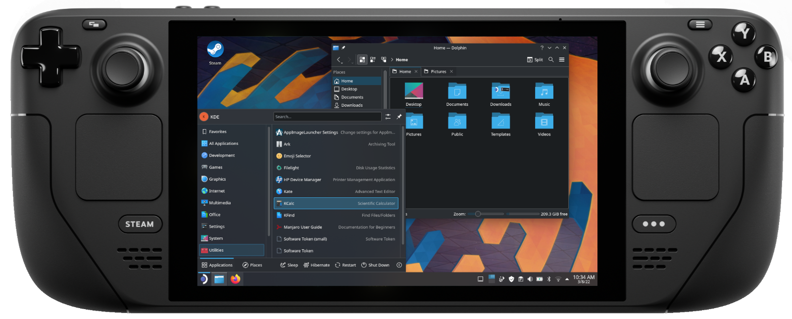

Першого грудня я став щасливим власником гучної консолі від Valve. Оскільки я живу в країні, в якій Парова Палуба недоступна до замовлення, мені довелося просити одного хорошого друга замовити її для мене замовити. Заявку в Steam було надіслано ще навесні, але друг зміг отримати і надіслати консоль тільки ближче до кінця осені.

Але зараз з поставками все гаразд, і люди практично не чекають у черзі.

## Невеликий анбоксинг

Оскільки нові речі обкладаються куди більшим податком і зборами, друг надав консолі трохи поюзаний вигляд, щоб уникнути державних поборів)

|||
|:---:|---|
||| 
|||

## Характеристики

Не те щоб про них не писали на кожному другому порталі в інтернеті, але все ж коротко нагадаю.

#### SoC

Steam Deck заснований на оригінальному процесорі AMD з 4 ядрами / 8 потоками, вбудованою графікою Vega 8 з TDP у 15Вт.

#### ОЗП

16Гб оперативної пам'яті працюють в 4 канальному режимі і використовуються так само для графіки.

#### Накопичувачі

У моїй версії встановлено SSD на 512 гб, також існують версії на 256 і 64 гігабайти. SSD не розпаяний, а формату M.2 2230 і може бути замінений користувачем (Valve не схвалює).

Так само є слот для карт пам'яті microSD, так що можна поповнити пам'ять аж до додаткового терабайта, або мати кілька карток.

#### Екран

Екран розміром 7" має роздільну здатність 1280х800 зі співвідношенням сторін 16:10. Роздільної здатності з головою вистачає для ігор на такій діагоналі, а ось до співвідношення екрану є питання. Деякі ігри не вміють з ним адекватно працювати і показують чорні смуги, або гра рендериться на весь екран, а HUD - тільки в області 16:9. Але це не часта проблема. Цей екран не найкращої якості і має засвіти, але цілком непоганий.

#### Акумулятор

Акумулятор на 40 Вт/год доволі не маленький, для такого портатива і наближається за ємністю до ноутбучних. Втім, під час гри в ААА проекти споживання може сягати 23Вт.

#### Порти

Порт USB Type-C може використовуватися як для зарядки, так і для підключення переферії, хабів, моніторів, жорстких дисків. Так само є роз'єм для навушників/колонок 3,5 мм.

#### Елементи управління

Крім стандартних для консолей стіків, хрестовини, тригерів і кнопок A, B, X, Y, тут є кнопки ззаду, як на елітних контролерах. Але одна з топових фіч - це тачпади з хаптик вібрацією. Екран, звичайно, теж сенсорний.

Є окремі кнопки steam - для управління магазином і більшості шорткатів, а також кнопка "..." - яка допомагає отримати доступ до меню, де можна обмежити TDP, частоту процесора і екрана, для економії енергії.

## Користувацький досвід

#### Ігри

На момент написання статті консоль у мене вже місяць, я майже пройшов на ній Cyberpunk 2077 і частенько граю в Hatsune Miku Project Diva MegaMix+.

ААА проекти в середньому йдуть на 30 фпс на середньо-низьких, а щось простіше може доходити і до 60 фпс.

|||
|:---:|---|

#### Стаціонарний режим

Консоль можна спокійно підключити до телевізора і використовувати будь-який бездротовий контролер (DualShock / DualSense / Xbox Controller), таким чином отримавши аналог PS4 за потужністю.

Деякі простіші ігри можна запустити з роздільною здатністю 1080p, але роздільні здатності вище - не раджу.

#### Режим робочого столу

У меню вимкнення можна знайти пункт "Перейти в режим робочого столу", після натискання на який нас зустріне... KDE!

|  |
|:---:|

Так, адже Steam OS заснована на дистрибутиві Arch Linux з оточенням робочого столу KDE. Це відкрита операційна система, яка абсолютно не забороняє вам робити що заманеться.

Epic Games Store і GOG через Heroic Launcher? Легко.

Піратські ігри? Так будь ласка!

Так само перед вами відкрита величезна бібліотека пакетів AUR (Arch User Repository), yay, консольна утиліта для встановлення застосунків з AUR, вже попередньо встановлена. Хоча це важливіше для червонооких на кшталт мене)

Якщо коротко - тут немає жодних обмежень для кінцевого користувача порівняно із закритими консолями корпорацій на кшталт Соні, Майкрософт і Нінтендо.

#### Емулятори

Так, вони тут є і їх тут багато, адже RetroArch є в магазині Steam. Хоч він мені і не сподобався.

Емуляція дуже старих консолей, включаючи Sony PSP, взагалі не має під собою ніяких проблем.

Ігри Nintendo Switch ідуть у кращій якості та з більшою кадровою частотою ніж на оригінальній консолі (тільки нікому не кажіть, більша N дуже розлючена цим фактом).

Поки емулятори PS4 і PSVita в процесі, для користувачів доступний навіть емулятор PS3 з величезною кількістю класичних ігор свого часу.

#### Шорткати

У системах Windows/Linux або MacOS ми звикаємо до використання "гарячих" сполучень клавіш, щоб прискорити свою роботу. Консоль так само має велику кількість таких "шорткатів", які дуже спрощують роботу з пристроєм і роблять її приємнішою.

|  | !
|:---:|

## Підсумки

Консоль вийшла досить хорошою і мені дуже сподобалася. Якісна збірка, достатня продуктивність, щоб замінити PS4, і габарити, що дають можливість взяти її з собою в поїздку. Акумулятор не вражає, але якщо в дорозі грати в інді проєкти, то можна витягнути і 6+ годин.

Не можу сказати, що це must have, але вона безумовно варта уваги кожного гіка)
