After half a year with SteamDeck, I finally decided to write a new small review, with experience using the console, screenshots from games.

## Peripherals

|                                                                                                                                                                                                                                        |                                                                                                                     |                                                                                                                                                                                                                       |
| :------------------------------------------------------------------------------------------------------------------------------------------------------------------------------------------------------------------------------------: | :-----------------------------------------------------------------------------------------------------------------: | :-------------------------------------------------------------------------------------------------------------------------------------------------------------------------------------------------------------------: |
|  |  |  |

There is nothing more to talk about, due to mostly home use, I have not yet thought about buying protective glasses, covers and other, possibly useful things.

## Games

Let's move on to more important things, because games are what people buy SteamDeck for.

I have two main scenarios in which I use the device - playing directly on the SteamDeck screen and connecting it to a TV. I usually don't use the latter script for AAA projects when I have a desktop PC, but I've now run tests in 800p and 1080p, respectively. When playing at 1080p, I did not use FSR to show the bare performance of the hardware. On request, I can do tests with FSR.

UPD: After some time, I decided to also test non-demanding games on my 3440x1440p monitor and in old SteamDeck projects it worked pretty well!

### Atomic Heart

The game is currently fully compatible with SteamDeck, however, for some reason, the developers removed the graphics settings item from the menu if you play on a portable device. However, as it was before, the game is simply perfectly optimized, however, it is noticeable that the picture is soapy at 1080p, which makes you think that it continues to be rendered at 800p, and the graphics settings have been greatly squandered for the sake of frame rate.

After trying to run the game at 1440p, it becomes clear that the developers are very aggressively resetting the graphics settings when the resolution is increased.

|                                                  |
| ------------------------------------------------ |
|    |
|  |
|  |

### Cities: Skylines

It would seem, how to play a city builder simulator on a console without a keyboard and mouse? I also thought it was impossible, but this game fully reveals the power and necessity of SteamDeck touchpads, without which it is already difficult to imagine, for example, browsing. However, although it is possible to play, it is much more pleasant to do it with a keyboard and trackball.

Since the game isn't as GPU intensive as the CPU, I let the city grow to 23k inhabitants on my PC and then imported the save. The game shows almost equally bad fps at any resolution, resting on the performance of the processor. But on a smaller city, it gives a playable 30 fps.

|                                                        |                            |
| ------------------------------------------------------ | -------------------------- |
| 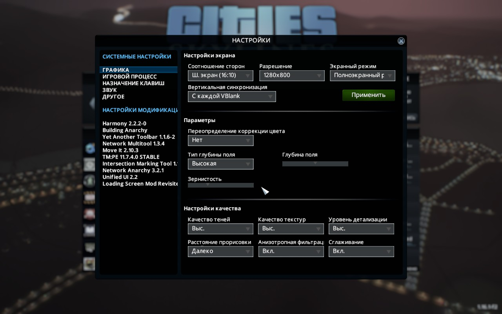   | 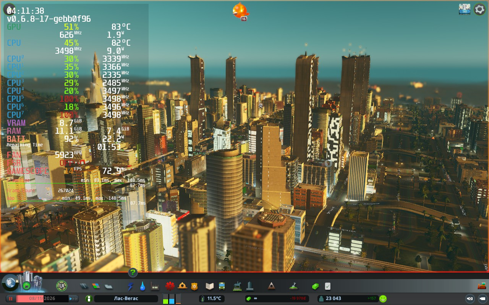  |
|  |  |
| 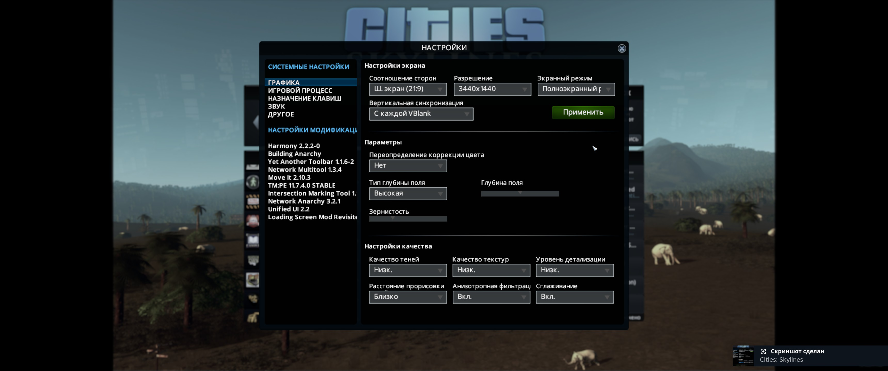  | 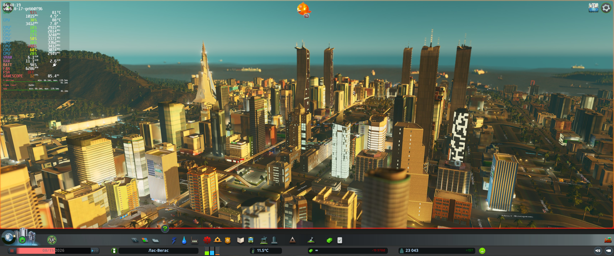 |

###Cyberpunk 2077

A sensational hit from the Polish studio CD Project Red. At the start of the game, it was unplayable on previous generation consoles, but it crept up to steamdeck as a fully compatible game. It plays great, I can’t say anything bad at all, the game does not drop below 30 fps in portable mode, and with a monitor it gives out about 25 fps without FSR.

|                                                           |                                |
| --------------------------------------------------------- | ------------------------------ |
|    |   |
|  |  |

### Euro Truck Simulator 2

I fell in love with this game for its meditativeness, it seems to plunge you into a kind of trance and you stupidly turn the steering wheel. It is also very cool to listen to audiobooks under it, if you just want to give your brain a rest. And this game is available in general on anything, even on macbooks)

At 1080p the game gets to 25 fps, but I would rather drop the resolution and use the built-in FSR in SteamOS than reduce the graphics settings, because they greatly affect the perception of the game, turning the sprites into a mess from the 90s.
Even at 1440p, SteamDeck is pretty stable at medium graphics settings. However, already here FSR is desirable.

|                                                            |                              |
| ---------------------------------------------------------- | ---------------------------- |
| 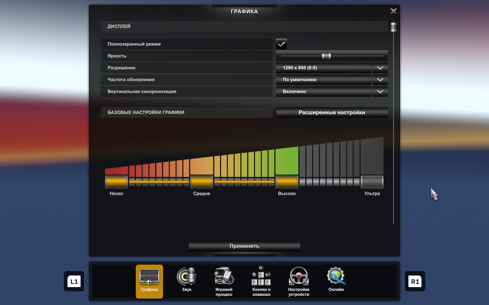     |   |
|    |  |
| 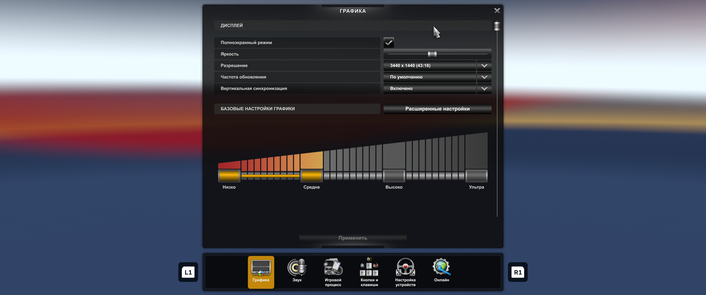 |  |

### Hatsune Miku: Project DIVA Mega Mix+

I have a lot to do with this game. I started playing it back in school days on the PSP, where there were 3 parts (1, 2nd and extend). Then, after college, I found a few like-minded people and started a small community. Especially for her sake, I bought PS Vita, which had 3 more parts (f, f2nd and X), and later PS4, on which Sega released Hatsune Miku: Project DIVA Future Tone ported from arcade machines.

Mega Mix+ on PC is an amazing game, because it's a port of a Nintendo Switch game that was ported from PS4, ported from arcades.

The PC version of the game runs very well on any machine, so it's obvious that 60fps will be on SteamDeck even in 4K resolution)

Mega Mix+ is also very moddable, even though there is no Workshop on Steam, which allows you to add many songs created by the community to the game.

|  |  |
| ----------------------- | ----------------------- |

### Half Life 2

I was prompted to show this game on SteamDeck by a video from an American blogger who was reviewing the cheapest Surface tablet. Only on that tablet, even this game was barely running at 30 fps at 800p, but in our case I didn’t even test such a resolution - only at 1440p.

|  |  |
| ------------------------------------------------------------ | --------------------------- |

### Hogwarts Legacy

The hit from the young studio Avalanche captured the hearts of many. The game turned out beautiful, interesting and original. Although the events take place in the world of Harry Potter, there is little to indicate this. However, the optimization let us down, so the game, even at low graphics settings at 800p, is near-playable with frequent FPS drops. The only advice here is to use FSR even in portable mode, and don't try to play on a monitor at all.

|                                                       |                            |
| ----------------------------------------------------- | -------------------------- |
|    |   |
| 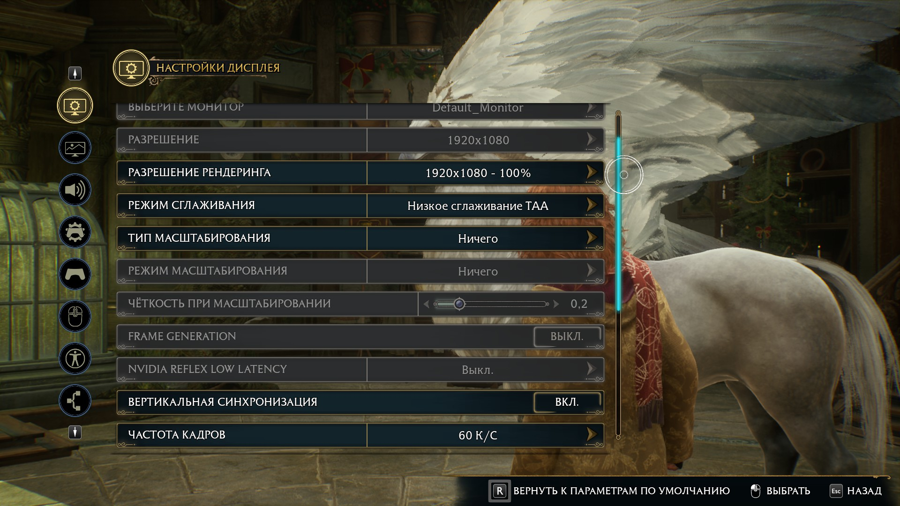 |  |

###Horizon: Zero Dawn

It was my first game when I bought a PS4 and the first officially purchased game in my life. It was quite soapy on PS4, and I doubt it was 1080p, so I had a lot more fun playing it on PC, where it was transformed and more beautiful. At first, the game seemed to me very lagging, but the default settings were ultra graphics settings. When I lowered them to the minimum - the game is in 1080p in the console standard - 30fps, and 800p even tends to approach 60.

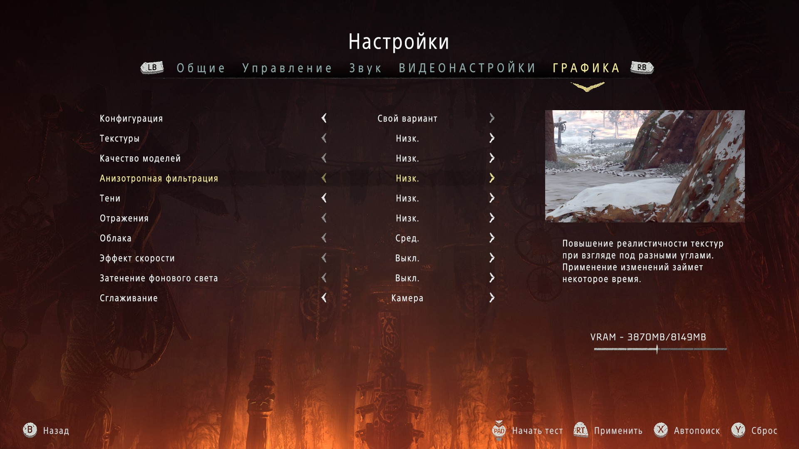

|                                                                                             |                                 |
| ------------------------------------------------------------------------------------------- | ------------------------------- |
| The screenshot of the settings in 800r was lost somewhere and I will add it a little later) |   |
|                                                              | 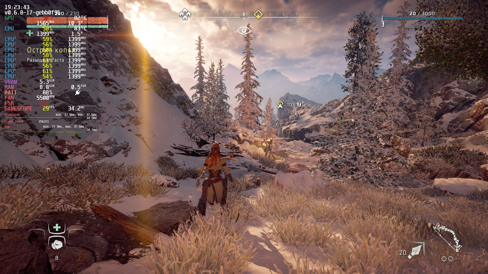 |

### Kena: Bridge of Spirits

The game is very beautiful, with an interesting spirit minion concept, similar to Overlord, only we play not as a villain, but as a cute shaman Kena. Cutscenes in the game are a separate art form and one could assemble a whole cartoon from them. But the game did not sink into my soul much, and went to the shelf, to wait for better times. In addition, the optimization of the game leaves much to be desired, even in portable mode it is worth using the help of FSR, and it’s better not to even think about stationary.

|                              |                              |
| ---------------------------- | ---------------------------- |
| 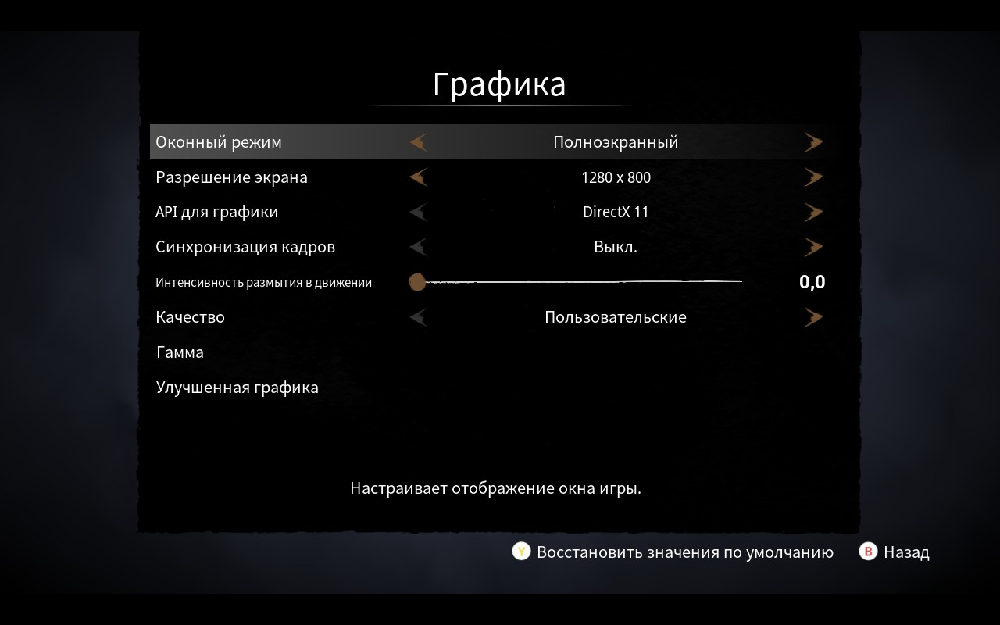  |   |
|  |  |

###Need for Speed: Heat

I can't say much about this game, it's pretty ordinary. Another attempt by EA to revive the once great racing series. Many thanks to [Rescor](https://t.me/rescor) for the game. It shows itself surprisingly well at low graphics settings in stationary mode, and even medium ones can be afforded in portable mode.

This is one of the few games where I needed rear paddles, because it's a pleasure to drive with a manual transmission here!

|                                                         |                             |
| ------------------------------------------------------- | --------------------------- |
|  |   |
|   |  |

### Nier: Automata

This is a game that has sunk deep into my soul. No other, except perhaps Cyberpunk, has left such a long, near-depressive aftertaste. And no, I'm not saying this in a negative way, but in a positive way. The game is truly amazing. The music alone gives goosebumps.

At one time I played a pirated version with a Russian translation, now the official version, but there is no translation in it. The translation can also be installed on the official version, but I did not do this, because I'm unlikely to ever replay it.

In medium graphics settings, the fps noticeably dipped even at 800p, so it's better to use low ones and enjoy 60fps that is inaccessible to consoles.

|                                                          |                              |
| -------------------------------------------------------- | ---------------------------- |
|  |   |
|   |  |

### Stray

A game about a poor cat in a post-apocalyptic underworld filled with robots blew up the year 2022. The main thing you need to know about this game is that we play as a cat! The game does not shine with gameplay, but you can tear the carpet, throw a can of paint off the roof, meow, or simply fall down. It is not very demanding and, by a strange coincidence, has the same fps in both 800p and 1080p.
However, already at 1440p the game noticeably sank, barely balancing at 20 fps with minimal graphics settings.

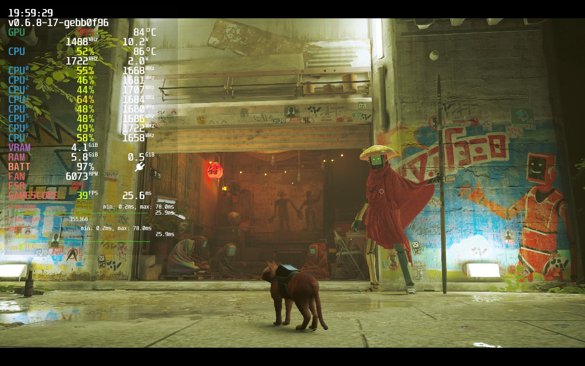
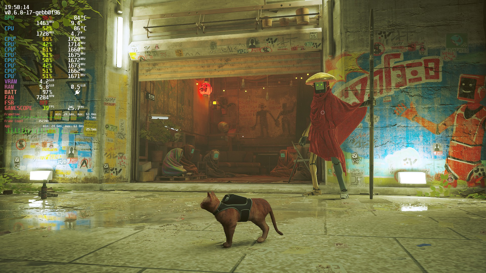

### The Elder Scrolls V: Skyrim

An unforgettable classic that many have bought more than once, because it is difficult to find a device that Skyrim did not come out on. We all remember Helgen and the gate at the entrance to Riverwood, so I will not delay the description. On ultra settings we get about 30 fps in both 800p and 1080p, which is quite playable, but I will try to get 60 fps and talk about it later.

At low graphics settings, you can get a good 40 fps at 1440p, but the game does not understand and cannot render on 21:9 monitors, which is most likely fixable by mods.

|                                                           |                              |
| --------------------------------------------------------- | ---------------------------- |
|   |   |
| 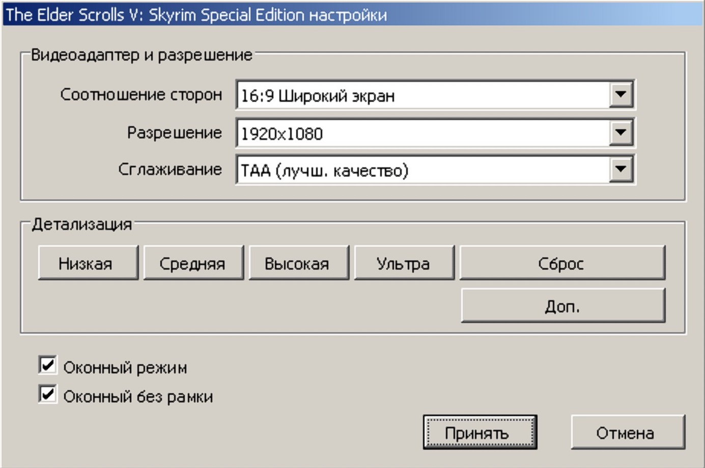 | 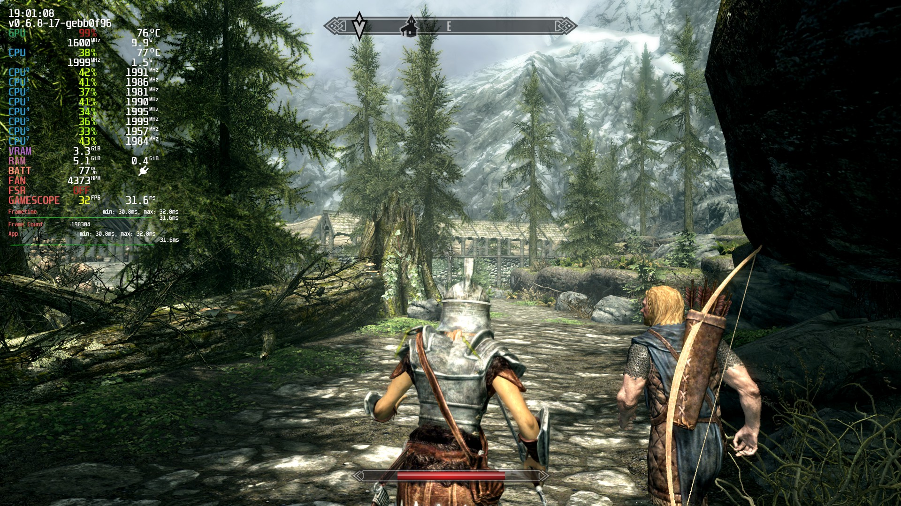 |
|    |  |

### The Legend of Zelda: Breath of the Wild

The game can be run on steamdeck using ryujinx and yuzu emulators. I haven't played it much myself, just finished the prologue.

Of course, I won’t show you screenshots, I have something to lose! In stationary mode, the game is almost unplayable and jumps around 20-25fps with landings, sometimes falling even lower, and in mobile it reaches 30.

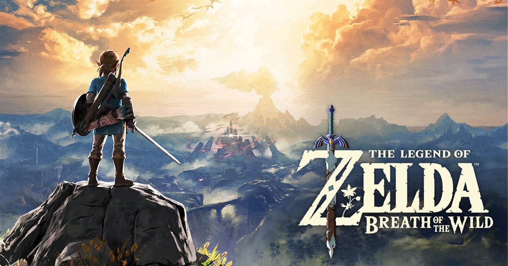

### The Witcher 3

Last on the list (no longer)), but not the least important game. The first masterpiece of the Poles, which I met. I played this game on a 940m (not mx!) which has 2gb of ddr3 memory in a time before DLSS and FSR. Years my poor laptop gave out 17-20 fps in 1080p, so I have something to compare. The iGPU built into SteamDeck on RDNA 2 is much more powerful.

|                                                          |                                                                  |
| -------------------------------------------------------- | ---------------------------------------------------------------- |
|  |  |
|                       |                               |
|                      | 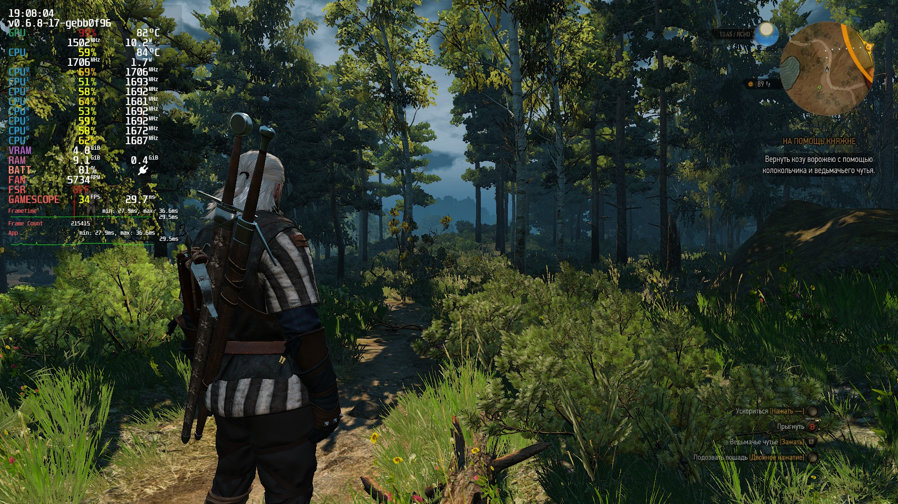                             |

###Timberborn

An interesting simulation of building a society of beavers in the post-apocalypse. You need to grow food, trees and make sure that the beavers have something to drink during droughts. And you can also build factories that will build golems that will build factories))

I found the game on a torrent for macOS software, but I got so into it that I bought it on Steam. And although the game is still under development and new features and fixes are constantly appearing in it (although I did not encounter any problems). Also, the game adapts very well to different screen resolutions, has a slider for rendering resolution and interface scaling.

|                                                          |                            |
| -------------------------------------------------------- | -------------------------- |
| 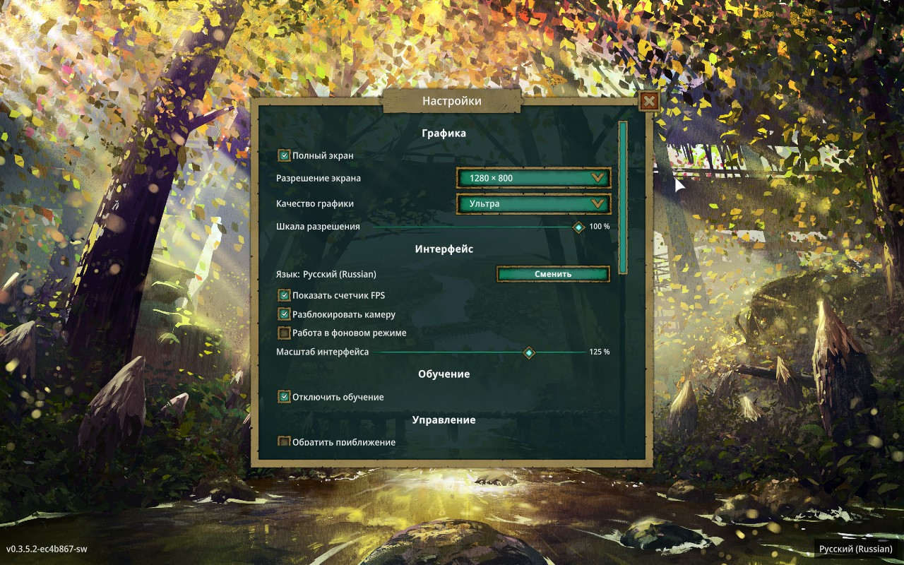    |   |
|   | 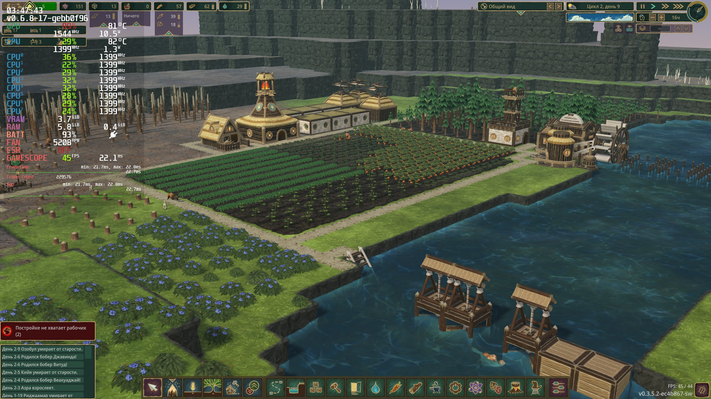 |
|  |  |

###Titanfall 2

I have not yet tried to play this game in detail, because I just bought it a couple of days ago on the advice of one of my best friends, but it impressed me with its good optimization, so I will definitely play it more)

|                                                              |                             |
| ------------------------------------------------------------ | --------------------------- |
| 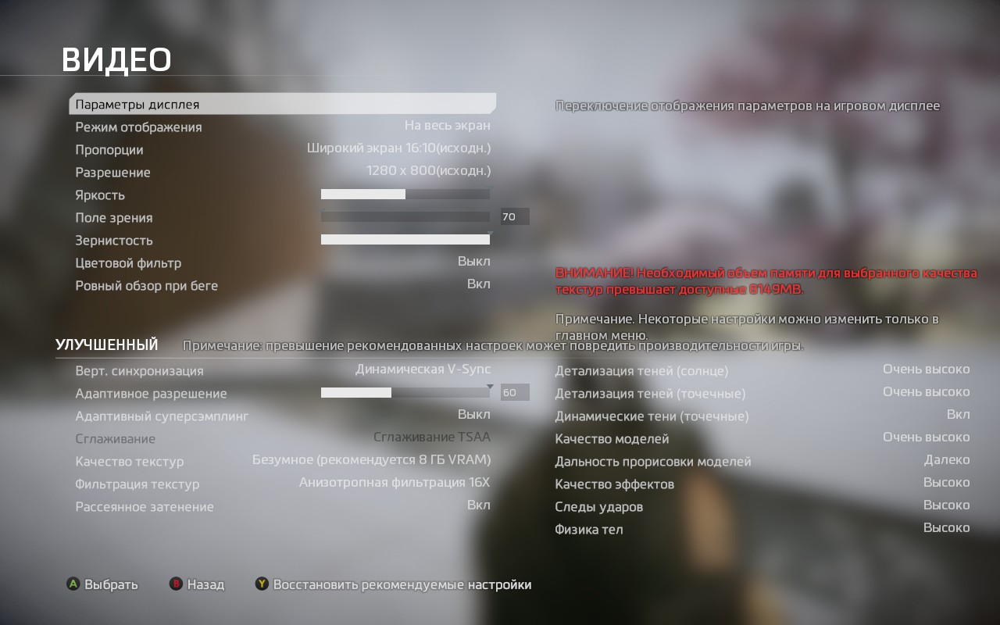       |   |
|  | 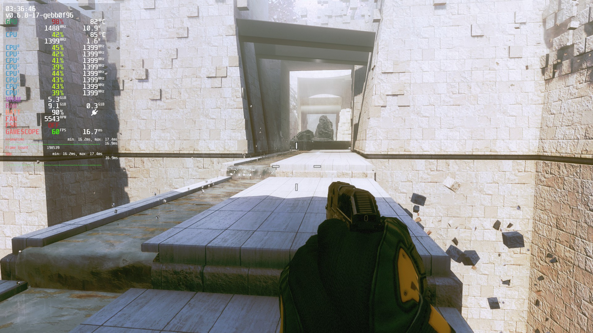 |
|       |  |

The article will be corrected, replenished and expanded over time)

Always yours, Katsu~
