После полугода со SteamDeck я наконец решил написать новый небольшой обзор, с опытом использования консоли, скриншотами из игр.

## Периферия

|     |     |     |
|:---:|:---:|:---:|
|  | 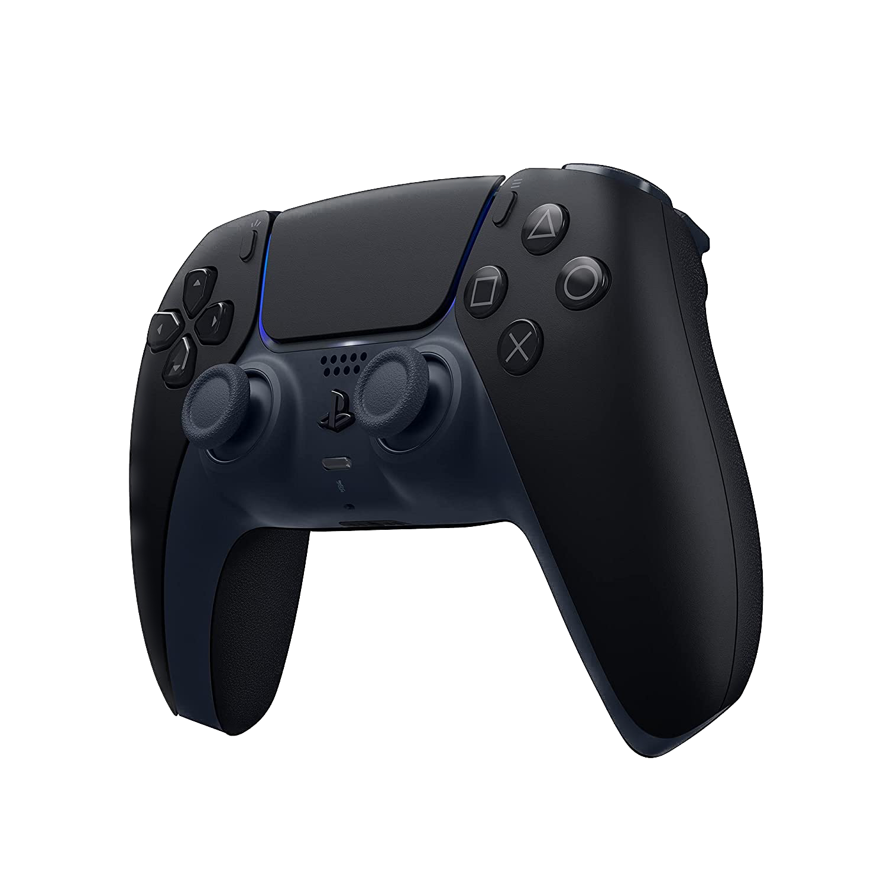 |  |

Больше рассказать не о чем, из-за по большей части домашнего использования, я пока не задумывался об покупке защитных стекол, чехлов и прочих, возможно, полезных вещей.

## Игры

Перейдем к более важным вещам, ведь игры - это ради чего SteamDeck и покупают. 

У меня есть два основных сценария в которых я использую устройство - играя непосредственно на экране SteamDeck и подключая его к телевизору. Обычно, я не использую последний сценарий для ААА проектов, имея стационарный ПК, но сейчас провел тесты в 800р и 1080р, соответственно. При игре в 1080р я не использовал FSR, чтобы показать голую производительность железа. По-желанию, могу сделать тесты и с FSR.

UPD: Через какое-то время я решил так же проверить не требовательные игры еще и на своем мониторе 3440х1440р и в старых проектах SteamDeck показал себя довольно хорошо!

### Atomic Heart

Игра на данный момент полностью совместима со SteamDeck, однако, разработчики по какой-то причине убрали из меню пункт настроек графики, если играешь на портативке. Однако, как было и раньше - игра просто прекрасно оптимизирована, однако заметно, что в 1080р картинка мыльная, что заставляет думать, что она продолжает рендерится в 800р, а настройки графики сильно просадили в угоду кадровой частоте.

После попытки запустить игру в 1440р становится понятно, что разработчики очень агрессивно сбрасывают настройки графики при повышении разрешения.

|     |
| --- |
| 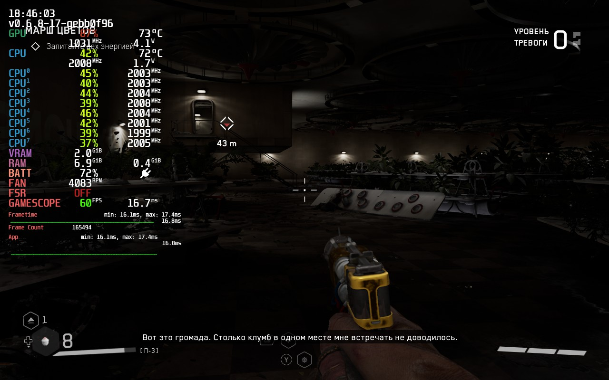 |
| 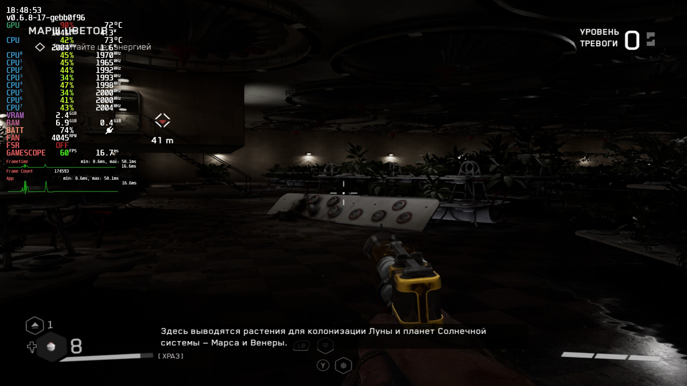 |
| 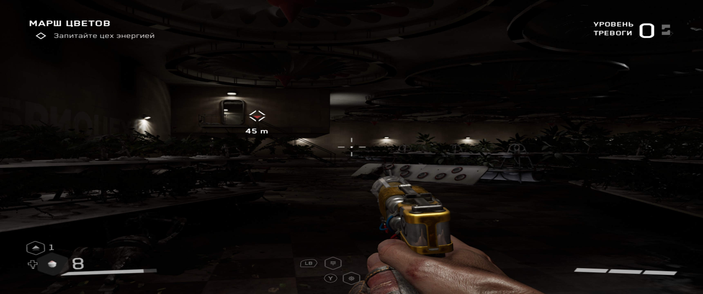 |

### Cities: Skylines

Казалось бы, как играть в симулятор градостроителя на консоли без клавиатуры и мыши? Я тоже думал что это невозможно, но эта игра в полной мере раскрывает силу и необходимость тачпадов SteamDeck, без которых и так сложно себе представить, к примеру, браузинг. Однако, хоть играть и возможно, но с клавиатурой и трекболом это делать куда приятнее

Так как игра не столь сильно подвержена GPU-нагрузкам, как CPU, я дал городу дорости до 23к жителей на своем ПК, после чего импортировал сохранение. Игра показывает почти одинаково плохой фпс на любом разрешении, упершись в производительность процессора. Но на меньших размерах города выдает играбельные 30 фпс.

|     |     |
| --- | --- |
|    |    |
|  | 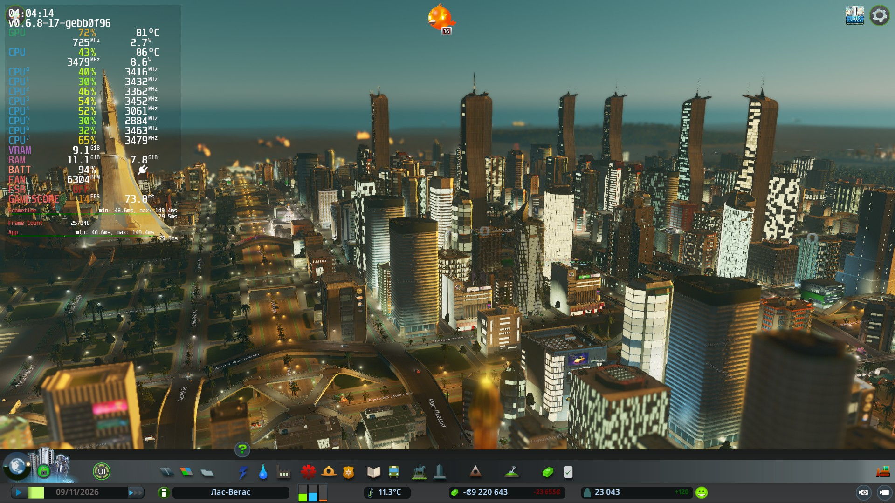 |
|  |  |

### Cyberpunk 2077

Нашумевший хит от польской студии CD Project Red. На старте игры была неиграбельна на консолях предыдущего поколения, но к стимдеку подобралась как полностью совместимая игра. Играется она отлично, не могу сказать вообще ничего плохого, игра не опускается ниже 30 фпс в портативном режиме, а с монитором выдает около 25фпс без FSR.

|     |     |
| --- | --- |
|  | 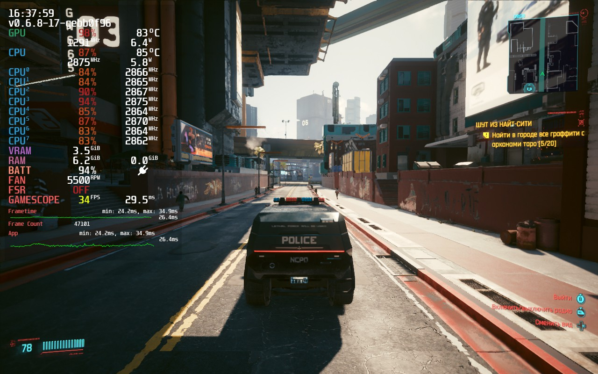 |
| 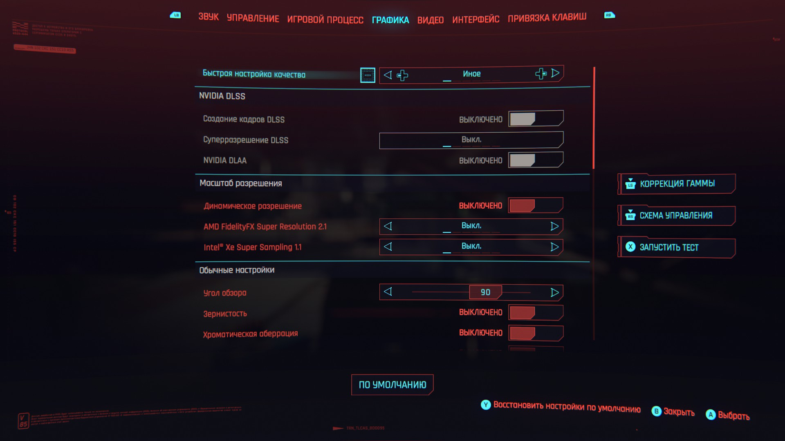 | 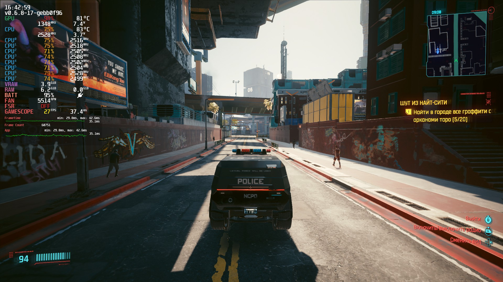 |

### Euro Truck Simulator 2

Эта игра полюбилась мне своей медитативностью, она как будто погружает тебя в некий транс и ты тупо крутишь баранку. Так же под нее очень классно слушать аудиокниги, если просто хочется дать мозгу отдохнуть. А еще эта игра доступна вообще на чем угодна, даже на макбуках)

В 1080р игра подступает к 25 фпс, но я бы посоветовал скорее сбросить разрешение и использовать встроенный в SteamOS FSR, чем уменьшать настройки графики, ведь они очень сильно влияют на восприятие игры, превращая спрайты в мессиво из 90-ых.
Даже в 1440р SteamDeck показывает себя довольно стабильно при средних настройках графики. Однако уже тут FSR желателен.

|     |     |
| --- | --- |
|  |  |
|  |  |
|  |  |

### Hatsune Miku: Project DIVA Mega Mix+

С этой игрой меня связывает многое. Я начал играть в нее еще в школьные времена на PSP, где было 3 части (1, 2nd и extend). Потом, после колледжа я нашел несколько единомышленников и основал маленькое комьюнити. Специально ради нее я купил PS Vita, на которой было еще 3 части (f, f2nd и X), а в последствии и PS4, на которой Sega выпустила портированную с аркадных автоматов  Hatsune Miku: Project DIVA Future Tone.

Mega Mix+ на ПК это и вовсе удивительная игра, ведь это порт игры для Nintendo Switch, для которой сделали порт от  PS4, для которой сделали порт с аркадных автоматов.

ПК версия игры работает очень хорошо на любых машинах, так что очевидно, что 60фпс будут на SteamDeck даже в 4К разрешении)

Так же Mega Mix+ очень хорошо подвержена моддингу, хоть в Steam не подключена Мастерская, что позволяет добавить в игру множество песен, созданных сообществом.

|  |  |
| --- | --- |

### Half-Life 2

Показать эту игру на SteamDeck меня натолкнуло видео одного американского блогера, который обозревал самый дешевый Surface планшет. Только вот на том планшете даже эта игра еле шла в 30 фпс в 800р, но в нашем случае я даже не тестировал подобное разрешение - только на 1440р.

| 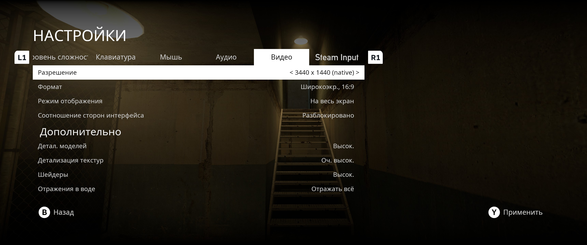 | 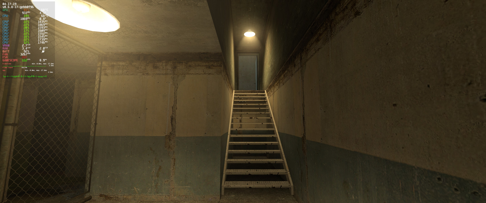 |
| --- | --- |

### Hogwarts Legacy

Хит от молодой студии Avalanche захватил сердца многих. Игра получилась красивой, интересной и самобытной. Хоть события и происходят в мире Гарри Поттера, на это мало что указывает. Однако оптимизация подкачала, так что игра даже на низкий настройках графики в 800р околоиграбельна с частыми просадками фпс. Единственный совет тут, это использовать FSR даже в портативном режиме, и не пытаться играть на мониторе в принципе.

|     |     |
| --- | --- |
|    | 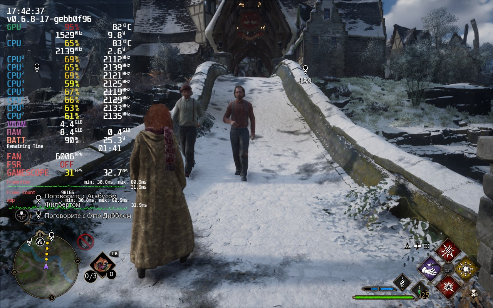  |
|  | 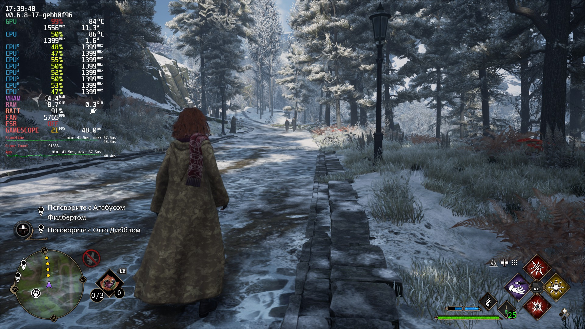 |

### Horizon: Zero Dawn

Это была моя первая игра, когда я купил PS4 и первая, купленная официально игра в моей жизни. На PS4 она была довольно мыльной, и я сомневаюсь, что там было 1080р, так что я получил куда больше удовольствия, когда играл в неё на ПК, где она преобразилась и стала еще красивее. Поначалу игра казалась мне сильно лагающей, но в настройках по-умолчанию стояли ультра настройки графики. Когда я их снизил на минимальные - игра в 1080р идет в консольном стандарте - 30фпс, а 800р даже стремится приблизится к 60.

|     |     |
| --- | --- |
| Скриншот настроек в 800р где-то потерялся и я добавлю его немного позднее) | 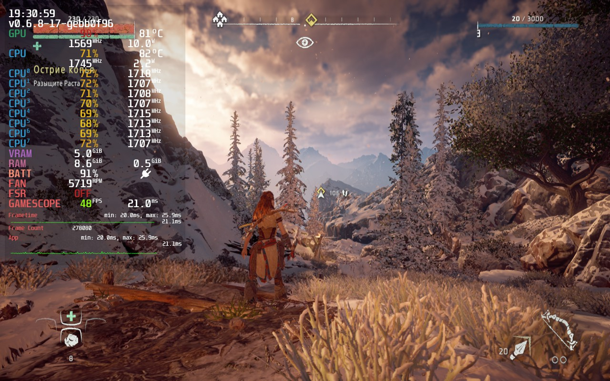 |
| 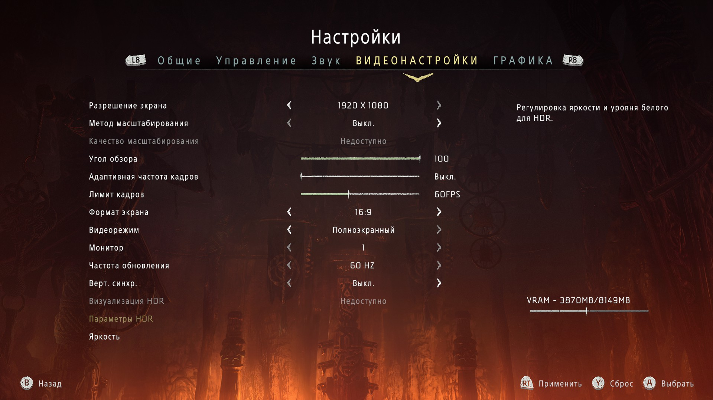                                |  |

### Kena: Bridge of Spirits

Игра очень красивая, с интересной концепцией миньонов-духов, похожей на Overlord, только играем мы не за злодея, а за милую шаманку Кену. Катсцены в игре это отдельный вид искусства и из них можно было бы собрать целый мультфильм. Но игра не сильно запала мне в душу, и отправилась на полку, ждать лучших времен. К тому же, оптимизация игры оставляет желать лучшего, даже в портативном режиме стоит воспользоваться помощью FSR, а об стационарном лучше даже не думать.

|     |     |
| --- | --- |
|   |   |
| 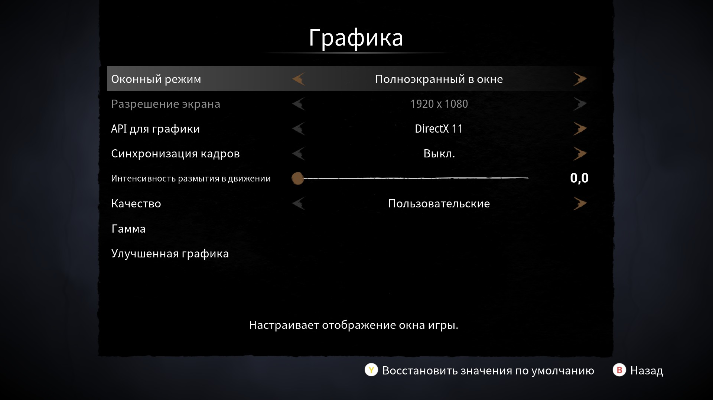 | 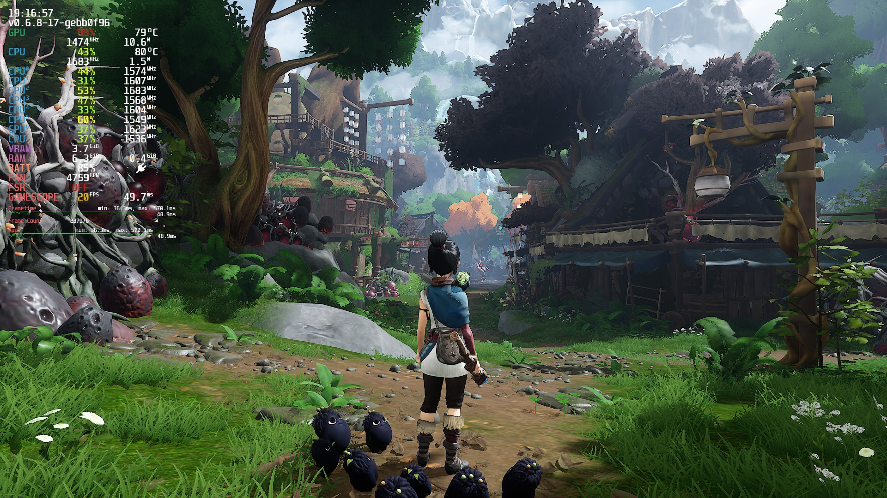 |

### Need for Speed: Heat

Не могу сказать много про эту игру, она довольно обычная. Очередная попытка EA возродить некогда великую серию гонок. За игру большое спасибо [Rescor](https://t.me/rescor). Она на удивление неплохо себя показывает на низких настройках графики в стационарном режиме, а в портативном можно себе позволить даже средние. 

Это одна из немногих игр, где мне понадобились задние кнопки-лепестки, потому что ездить с механической коробкой передач тут - одно удовольствие!

|     |     |
| --- | --- |
|   | 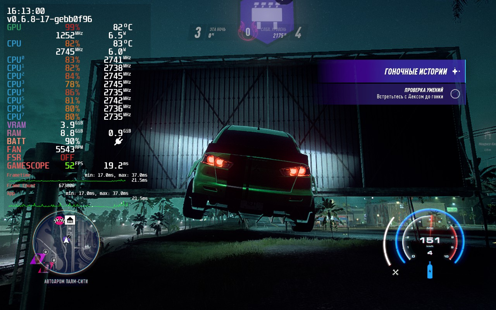  |
|  | 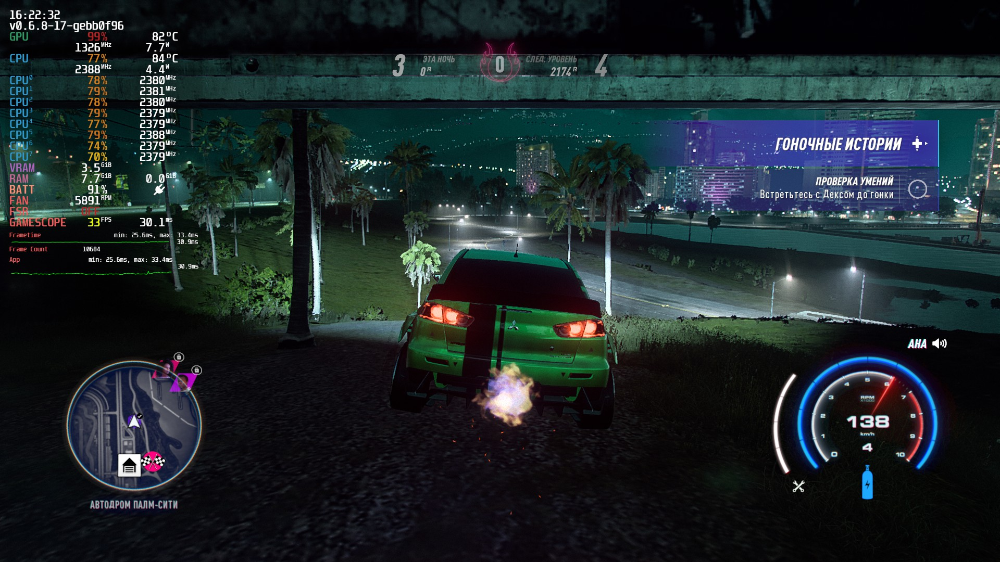 |

### Nier: Automata

Это игра, которая запала мне глубоко в душу. Никакая другая, кроме, возможно, Cyberpunk, не оставляла такого долгого околодепрессивного послевкусия. И нет, я говорю это не в отрицательном, а в положительном смысле. Игра и правда шедевральна. Одна только музыка из нее заставляет мурашки пробегать по коже. 

В свое время я играл в пиратскую версию с русским переводом, сейчас же версия официальная, но перевод в ней отсутствует. Перевод можно установить и на официальную версию, но я этим не занимался, ведь врядли я когда-либо стану переигрывать её. 

В средних настройках графики фпс заметно просел даже в разрешении 800р, поэтому лучше использовать низкие и наслаждаться недоступными для консолей 60фпс.

|     |     |
| --- | --- |
|  |  |
| 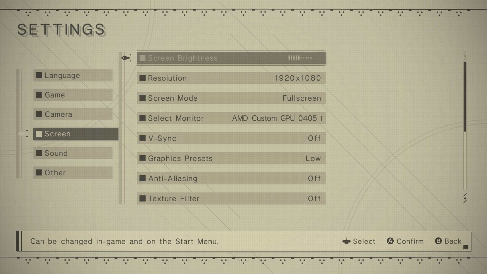|  |

### Stray

Игра про бедного котика в постапокалиптическом подземном мире наполненном роботами взорвала 2022ой год. Главное что надо знать об этой игре - мы играем за котика! Игра не блещет геймплеем, однако можно подереть ковер, сбросить с крыши банку с краской, помяукать или просто повалятся. Она не очень требовательна и по странному стечению обстоятельств имеет одинаковый фпс как в 800р, так и в 1080р.
Однако уже в 1440р игра заметно просела, еле балансируя на 20 фпс при минимальных настройках графики

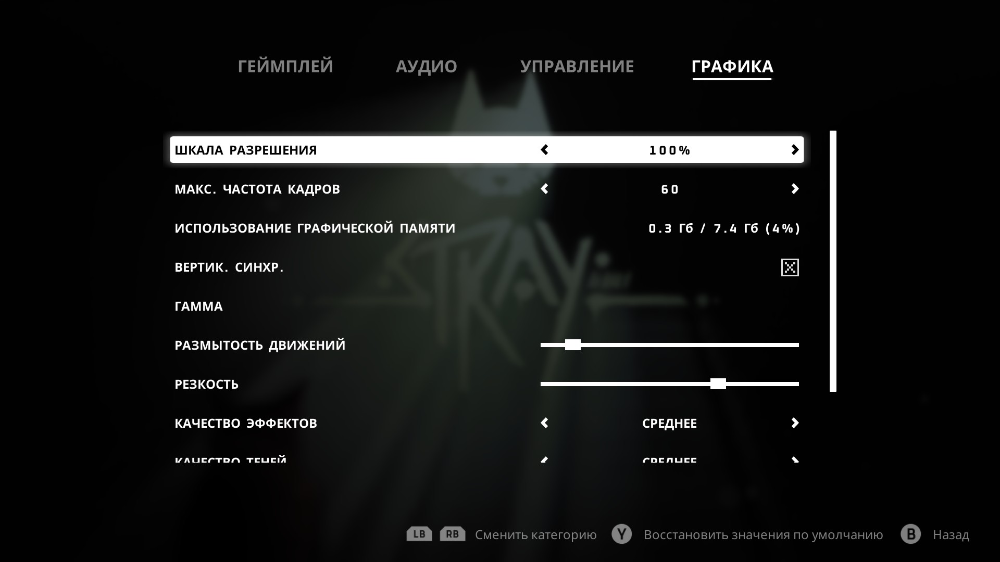

### The Elder Scrolls V: Skyrim

Незабвенная классика, которую многие купили не по одному разу, ведь сложно найти устройство, на которое не выходил Скайрим. Все мы помним Хелген и врата при входе в Ривервуд, так что не буду затягивать с описанием. На ультра настройках мы получаем около 30 фпс и в 800р, и в 1080р, что вполне играбельно, но я постараюсь добится 60 фпс и расскажу об этом позже. 

На низких настройках графики можно получить неплохие 40 фпс в 1440р, однако игра не понимает и не умеет рендерится на мониторах 21:9, что, скорее всего, поправимо модами.

|  |  |
| ---------- | ---------- |
|  |  |
|  |  |
|  |  |

### Thе Lеgеnd оf Zеldа: Brеаth of the Wіld

Игру можно запустить на стимдек, используя эмуляторы ryujinx и yuzu. Я сам в нее почти не играл, только прошел пролог. 

Скриншоты я вам, конечно, не покажу, мне есть что терять! В стационарном режиме игра почти не играбельна и скачет в районе 20-25фпс c посадками, иногда падая еще ниже, а в мобильном - достигает 30.

### The Witcher 3

Последняя в списке (уже нет)), но не по важности игра. Первый шедеврый поляков, с которым я познакомился. Я прошел эту игру на 940m (не mx!) у которой 2гб ddr3 памяти во времена, когда еще не было всяких DLSS и FSR. Года мой бедный ноутбук выдавал 17-20 фпс в 1080р, так что мне есть с чем сравнивать. Встроенная в SteamDeck iGPU на RDNA 2 куда мощнее.

|     |     |
| --- | --- |
| 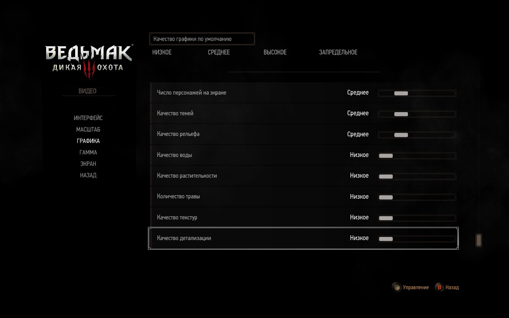 |  |
| 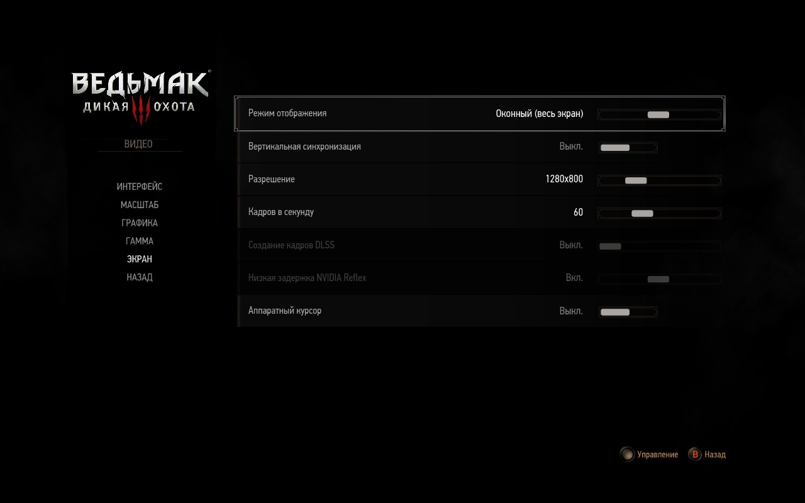  | 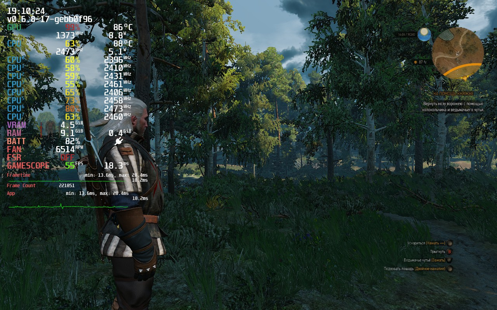  |
|  |  |

### Timberborn

Интересный симулятор построения общества бобров в постапокалипсисе. Нужно выращивать еду, деревья и заботится о том, чтобы бобрам было что пить во время засух. А еще можно строить заводы, которые будут строить големов, которые будут строить заводы))

Я нашел игру на торренте для macOS софта, но настолько проникся ею, что купил в стиме. И хоть игра все ещё в процессе разработки и в ней постоянно появляются новый функционал и исправления (хотя с проблемами я не сталкивался). Так же, игра очень хорошо подстраивается под разное разрешение экрана, имеет ползунок разрешения рендеринга и масштабирования интерфейса.

|                                                          |                           |
| -------------------------------------------------------- | ------------------------- |
|     |   |
|   |  |
| 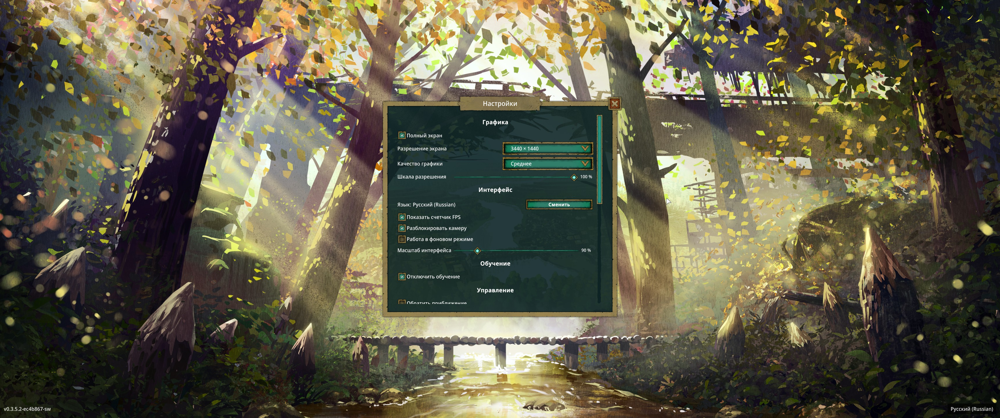 |  |

### Titanfall 2

В эту игра я еще не пробовал играть обстоятельно, ведь только пару дней назад купил ее по совету одного из лучших друзей, но она поразила меня своей хорошей оптимизацией, так что я обязательно поиграю в неё больше)

|     |     |
| --- | --- |
|  |  |
| 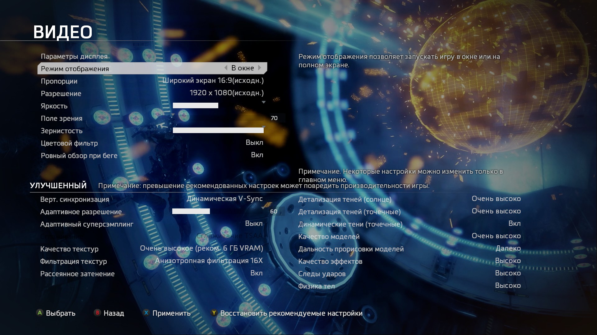 |  |
|  |  |

Статья будет исправлятся, пополнятся и расширятся со временем)

Всегда ваш, Кацу~
