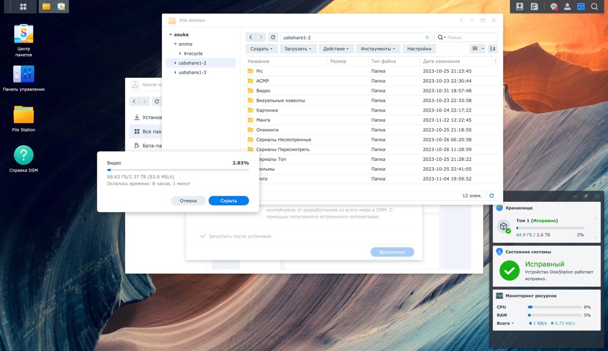

**Решил сделать более подробное дополнение к посту в телеграм-канале.**

Так вот, я очень давно мечтал об собственном NAS-сервере. У меня было много итераций на пути к нему: переносные HDD, подключение дисков к OrangePi (клон RaspberryPi) и в конце - использование кастомного компьютера-свитча. Все эти попытки имели опосредованный успех, и имели минусы. После нескольких лет этих попыток создать сервер дендрофекальным способом я понял, что пора с этим заканчивать.

Мне также предлагали использовать просто полноценный компьютер для этого, но такое решение мне тоже не подходило.

Мне надо было чтобы устройство потребляло мало энергии, было тихим, и достаточно производительным. Этим устройством для меня стал Synology DiskStation 916+.

|  |  Копирование файлов как будто в проводнике Windows |
| :--------------------: | :----------------------------------------------------------------------------: |

Этот малыш оснащен 4-ёх ядерным Intel Pentium N3710 с частотой до 2,5ГГц и расходом до 6Вт, а также 8гб DDR3 RAM.

На нем установлен особый дистрибьютив Linux - DiskStation Manager (DSM) разработанный производителем устройства. К нему можно подключится по SSH и пользоваться как простым Linux-cервером, однако есть очень продвинутый веб-интерфейс. Выглядит он как обычная десктопная ОС.

Так же веб-интерфейс позволяет использовать некоторые программы:

|  Docker |  Torrent |
| :----------------------------------: | :------------------------------------: |

Да, можно поднимать и докер-контейнеры, и любые веб-приложения, подключать флешки и юсб-диски.

Пока что я только разбираюсь с ним и всё время узнаю что-то новое.
