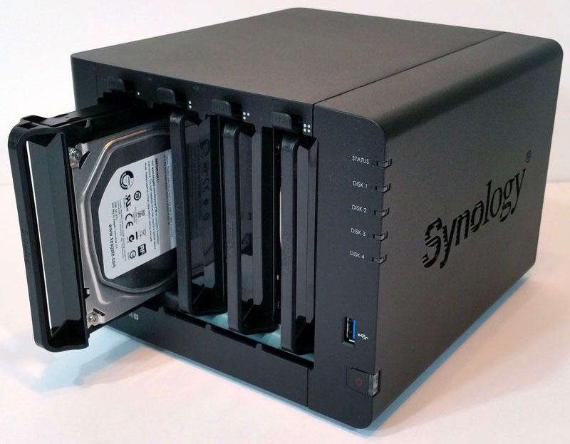
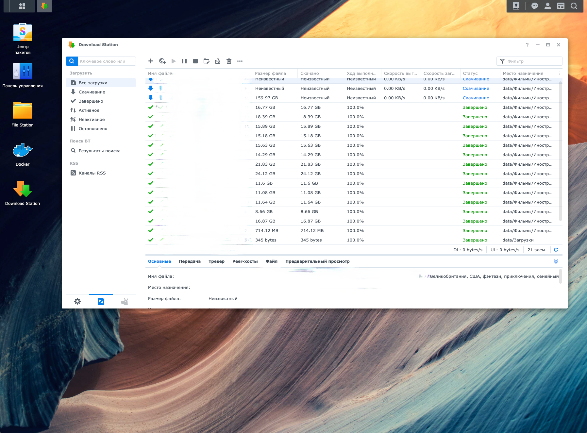

**I decided to make a more detailed addition to the post in the telegram channel.**

So, for a very long time I dreamed of having my own NAS server. I had a lot of iterations on the way to it: portable HDDs, connecting disks to OrangePi (RaspberryPi clone) and in the end - using a custom computer-switch. All these attempts had indirect success, and had disadvantages. After several years of these attempts to create a server using the dendrofecal method, I realized that it was time to end this.

I was also offered to use just a full-fledged desktop computer for this, but this solution did not suit me either.

I needed the device to consume little energy, be quiet and productive. This device for me was Synology DiskStation 916+.

|  | Copy files as if in Windows Explorer |
|:---:|:---:|

It equipped with a 4-core Intel Pentium N3710 with a frequency of up to 2.5 GHz and a power consumption of up to 6W, as well as 8GB of DDR3 RAM.

It has a special Linux distribution installed - DiskStation Manager (DSM) developed by the device manufacturer. You can connect to it via SSH and use it as a simple Linux server, but there is a very advanced web interface. It looks like a regular desktop OS.

The web interface also allows you to use some programs:

|  Docker |  Torrent |
|:---:|:---:|

Yes, you can install Docker containers and any web applications, connect flash drives and USB drives.

So far I’m just getting to grips with it and learning something new all the time.
