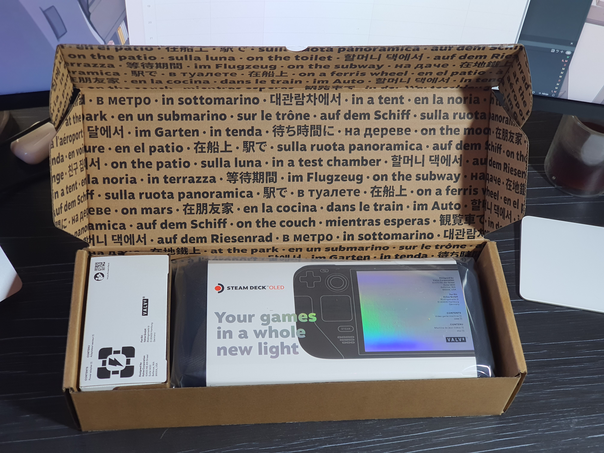
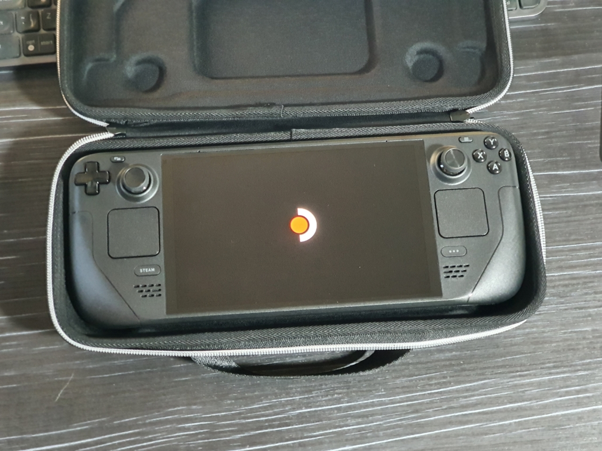
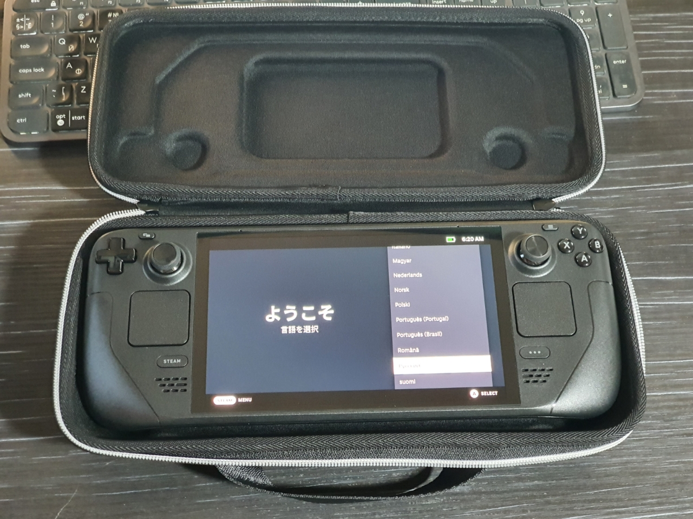
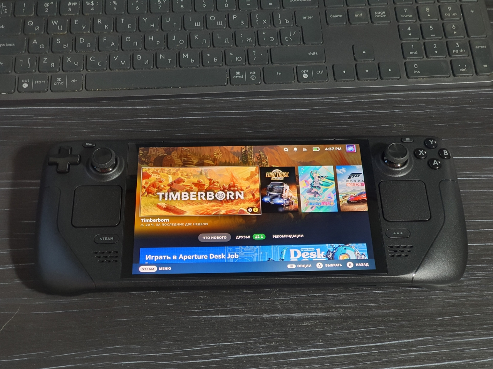
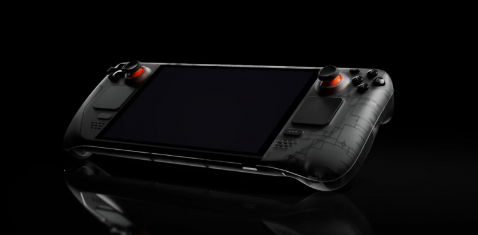
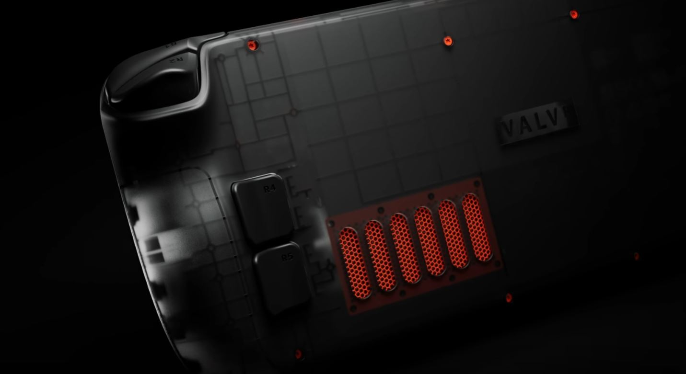

After the original Steam Deck was released, other companies started to release their competitors to it. They were on more powerful processors, with 1080p screens, but they were also hotter, running for an hour on battery life. Valve replied that SteamDeck platform is with us for many years and they are not going to release new versions with increased power.

But here we are with the SteamDeck OLED!

## A little unboxing

|                                    |                                    |
| ---------------------------------- | ---------------------------------- |
|    |    |
|    |  |
|  |  |

Here are the console specs as described on Valve's website:

|                    | Steam Deck                                       | Steam Deck OLED                                                   |
| ------------------ | ------------------------------------------------ | ----------------------------------------------------------------- |
| CPU                | **7nm** Zen 2 4c/8t, 2.4-3.5GHz                  | **6nm** Zen 2 4c/8t, 2.4-3.5GHz                                   |
| GPU                | RDNA 2 with eight compute units, 1.6 GHz         | RDNA 2 with eight compute units, 1.6 GHz                          |
| RAM speed          | 16GB LPDDR5 4 channels **5500 MT/s**             | 16GB LPDDR5 4 channels **6400 MT/s**                              |
| SSD                | 64(eMMC)/256/512                                 | 512/**1024**                                                      |
| Screen             | **IPS 7" 1280x800 400nt 60Hz**                   | **HDR OLED 7.4" 1280x800 1000-600nt 90Hz**                        |
| Bluetooth          | **5.0**                                          | **5.3**, separate antenna                                         |
| Wi-Fi              | 2.4GHz and 5GHz, 2x2 MIMO, IEEE 802.11a/b/g/n/ac | 2.4GHz, 5GHz and **6GHz**, 2x2 MIMO, IEEE 802.11a/b/g/n/ac/**ax** |
| Battery            | **40Wh**                                         | **50Wh**                                                          |
| Gaming Time        | **2** to **8** hours                             | **3** to **12** hours                                             |
| Power Supply       | 45W Type-C PD3.0                                 | 45W Type-C PD3.0                                                  |
| Power Supply Cable | **1.5 m**                                        | **2.5 m**                                                         |
| Weight             | **669 g**                                        | **640 g**                                                         |
| Size               | 298 mm by 117 mm by 49 mm                        | 298 mm by 117 mm by 49 mm                                         |

It seems as if everything has been improved a little bit at a time, and that's partly true, but.... No, absolutely everything has been dramatically improved!

## Impressions

### Screen

The screen of the original steampunk was mediocre to say the least. Low contrast, uneven backlighting with covenants, an airy layer between the screen and the glass, and large bezels all around.

Even the cool specs already tell us that the screen has changed a lot, but it looks even better in person. On paper, the screen is only 0.4" bigger, but that's exactly what was missing. Brightness, contrast, and saturation are all above par.

I also can't help but notice the increased screen frequency. In AAA projects it is almost not important, because they go on average at 30-45fps, but in projects easier, like indie games or my favorite Hatsune Miku: Project Diva Megamix + high refresh rate makes the eyes very pleasant.

### Performance

I'll make tests in games in a separate post, but I can note that the console has become more responsive, easier to get in and out of sleep and switch to desktop mode. These could be softwar fixes though.

I'm not sure, but it seems to me that the speed of writing to the memory card has also become faster, but I won't be able to check with my old deck.

### Cooling system

This is where the major redesign has taken place - it's here! The APU's process technology has been reduced so that it generates less heat, which causes the fan to operate less frequently. The cooler itself has also been redesigned so that even at full speed it is much less audible.

### Tactile feel

A lot of changes have been made here too. The L1/R1 buttons are pressed more clearly. The trackpads feel close to Apple's, they almost don't flex, and the recoil is much clearer. The sides of the sticks have been made a bit bigger, so that your finger clearly lies inside. In general, the console is more monolithic in the hands, and because of the reduced weight - more comfortable. Yes, this 50g difference is really noticeable!

### The rest

Among other noticeable changes I'll briefly write about the battery and sound. The battery is bigger, despite the reduced weight, and you can really notice how much longer it lasts, if we don't talk about AAA. The sound became even louder, but it was not a weakness of the original Steam Deck.

In terms of interface - nothing has changed, the same SteamOS with Steam BigPicture and KDE. So you won't have to get used to the new one.

This time Valve showed what console upgrades should be like within the same generation, not PS4 Slim, PS5 Slim, which are just a little lighter and a little less power hungry.

### Pricing

As well, I would like to remember also the most positive pricing policy of the manufacturer.

Prices for the original Steam Deck at the time of release were as follows:

`LCD 64Gb - $399, 256Gb - $549, 512Gb - $649`

At the time of writing, the prices look like this:

`LCD 256Gb - $399, OLED 512Gb - $549, 1Tb - $649`

And they were also selling off leftovers of other versions at these prices:

`LCD 64Gb - $349, 512Gb - $449`

So they didn't make the new version more expensive, they started selling the old version cheaper! It's like Valve is looking at their customers as human beings. There is still a special limited edition 1 terabyte version with a dark transparent case, but I don't know the price for it.

|  |  |
| -------------------------------------------- | ------------------------------------- |

### Bottom line

To summarize, I can say that this update is 100% worth its money, and if you have such an economic opportunity, you should not think long about making it.
