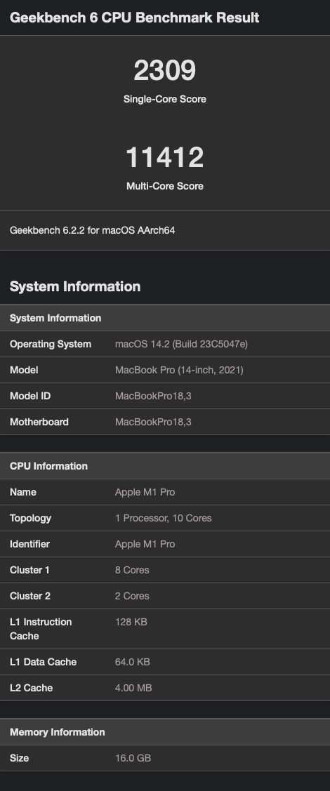
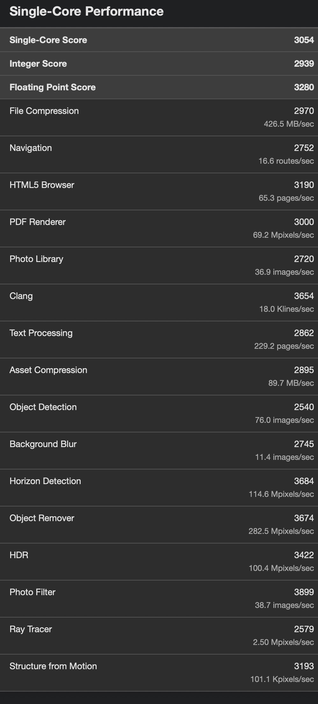
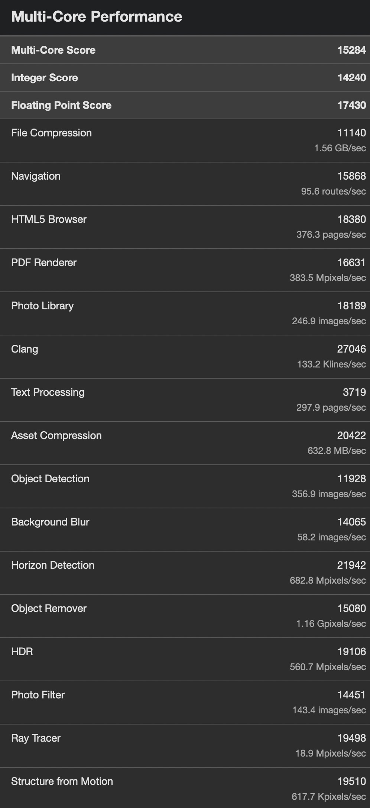
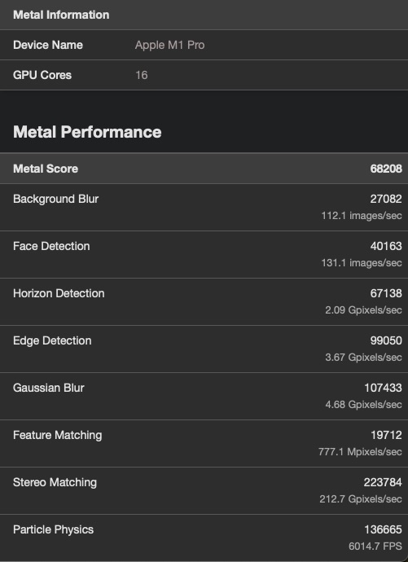
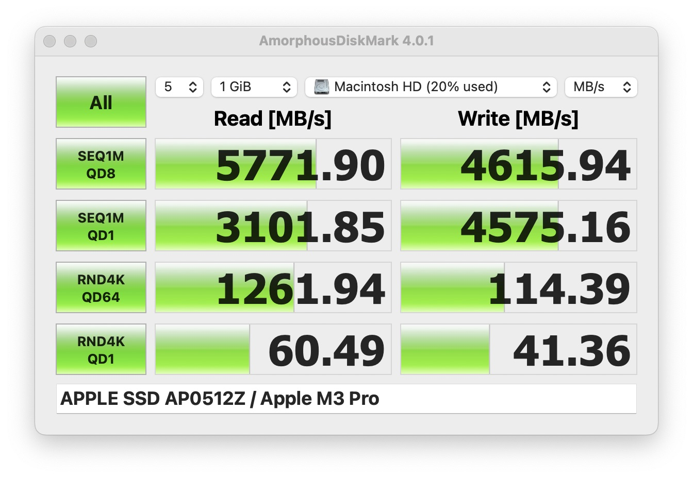
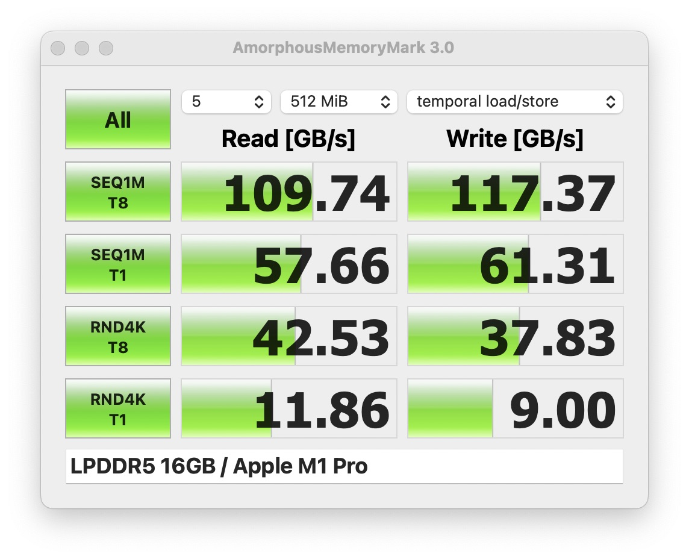
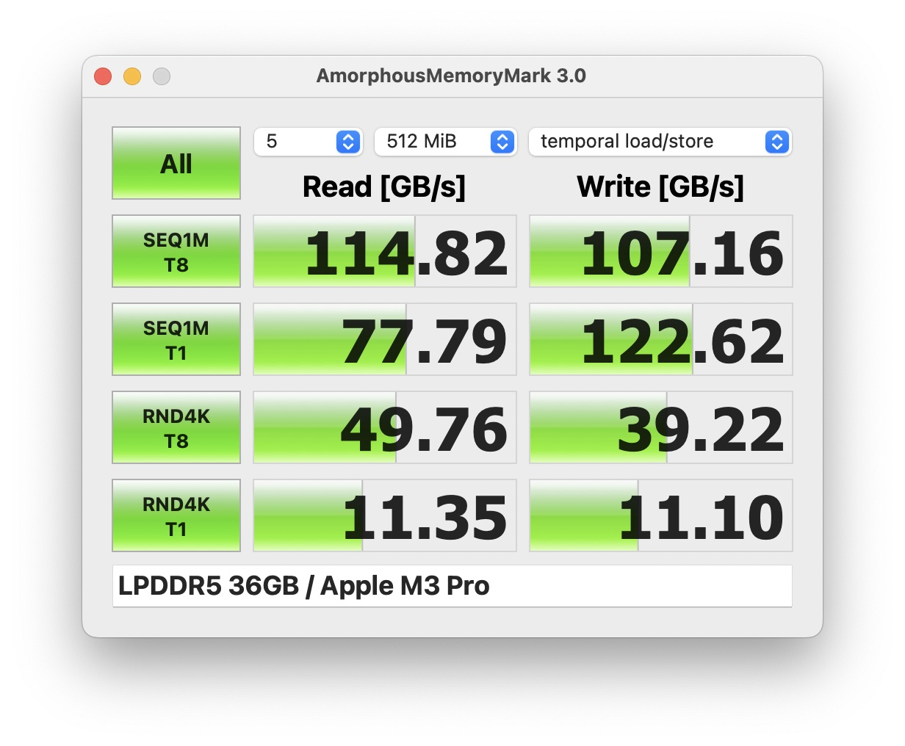
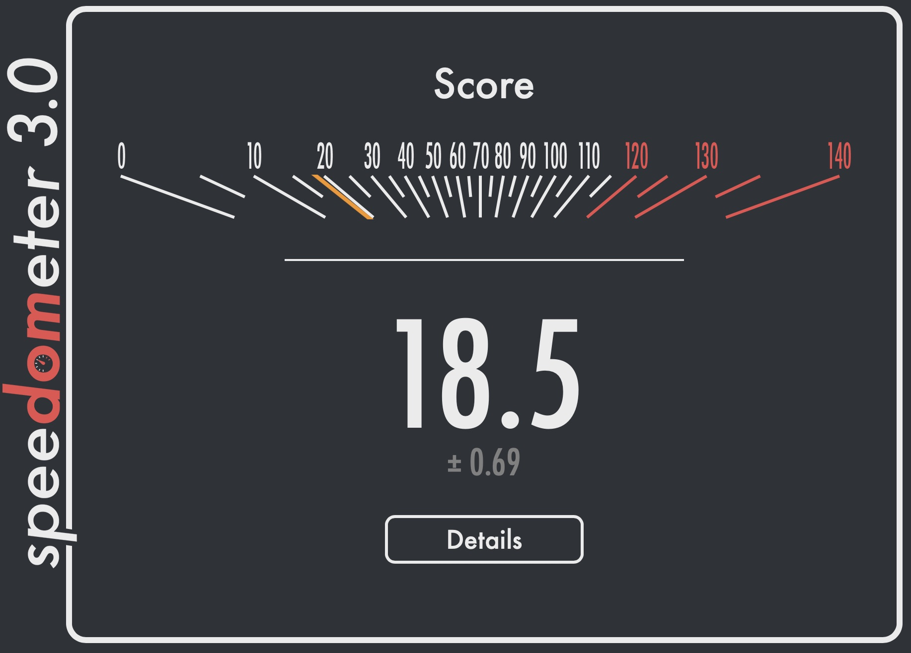

## Geekbench 6

| MacBook Pro 2021 | MacBook Pro 2023 |
|:----------------:|:----------------:|
|  |  |
|  |  |
|  |  |
|  |  |
|  |  |

## Amorphous Disk Mark

| MacBook Pro 2021 | MacBook Pro 2023 |
|:----------------:|:----------------:|
|  |  |

[Ссылка на бенчмарк](https://apps.apple.com/ua/app/amorphousdiskmark/id1168254295)

## Amorphous Memory Mark

| MacBook Pro 2021 | MacBook Pro 2023 |
|:----------------:|:----------------:|
|  |  |

[Ссылка на бенчмарк](https://apps.apple.com/ua/app/amorphousmemorymark/id1495719766)

## Browserbench Speedometer 3.0

| MacBook Pro 2021 | MacBook Pro 2023 |
|:----------------:|:----------------:|
|  |  |

[Ссылка на бенчмарк](https://browserbench.org/Speedometer3.0/)

## Mozilla Kraken

| TEST                        | M3Pro             | M1Pro              | COMPARISON        | DETAILS     |
| --------------------------- | ----------------- | ------------------ | ----------------- | ----------- |
|  ai                         | 115.3ms +/- 10.4% |  135.5ms +/- 0.8%  | *1.175x as slow*  | significant |
|  - astar                    | 115.3ms +/- 10.4% |  135.5ms +/- 0.8%  | *1.175x as slow*  | significant |
|  audio                      |  98.6ms +/- 1.1%  | 128.2ms +/- 0.9%   | *1.30x as slow*   | significant |
|  - beat-detection           |  26.0ms +/- 1.8%  |  32.8ms +/- 2.3%   | *1.26x as slow*   | significant |
|  - dft                      |  28.9ms +/- 1.8%  |  39.1ms +/- 1.0%   | *1.35x as slow*   | significant |
|  - fft                      |  16.9ms +/- 4.2%  |  22.1ms +/- 2.4%   | *1.31x as slow*   | significant |
|  - oscillator               |  26.8ms +/- 1.1%  |  34.2ms +/- 1.6%   | *1.28x as slow*   | significant |
|  imaging                    |  79.0ms +/- 1.6%  | 106.3ms +/- 0.8%   | *1.35x as slow*   | significant |
|  - gaussian-blur            |  27.0ms +/- 3.5%  |  35.6ms +/- 1.0%   | *1.32x as slow*   | significant |
|  - darkroom                 |  27.4ms +/- 1.3%  |  36.0ms +/- 0.0%   | *1.31x as slow*   | significant |
|  - desaturate               |  24.6ms +/- 2.0%  |  34.7ms +/- 1.7%   | *1.41x as slow*   | significant |
|  json                       |  16.0ms +/- 0.0%  |  20.0ms +/- 2.4%   | *1.25x as slow*   | significant |
|  - parse-financial          |   8.2ms +/- 3.7%  |   9.7ms +/- 3.6%   | *1.183x as slow*  | significant |
|  - stringify-tinderbox      |   7.8ms +/- 3.9%  |  10.3ms +/- 4.7%   | *1.32x as slow*   | significant |
|  stanford                   |  65.4ms +/- 1.1%  |  85.2ms +/- 1.0%   | *1.30x as slow*   | significant |
|  - crypto-aes               |  19.4ms +/- 2.6%  |  25.7ms +/- 2.3%   | *1.32x as slow*   | significant |
|  - crypto-ccm               |  14.8ms +/- 2.0%  |  19.6ms +/- 2.5%   | *1.32x as slow*   | significant |
|  - crypto-pbkdf2            |  21.7ms +/- 1.6%  |  27.9ms +/- 1.5%   | *1.29x as slow*   | significant |
|  - crypto-sha256-iterative  |   9.5ms +/- 4.0%  |  12.0ms +/- 0.0%   | *1.26x as slow*   | significant |
| ** TOTAL **                 | 374.3ms +/- 3.1%  | 475.2ms +/- 0.3%   | *1.27x as slow*   | significant |

[Ссылка на бенчмарк](https://mozilla.github.io/krakenbenchmark.mozilla.org/)
