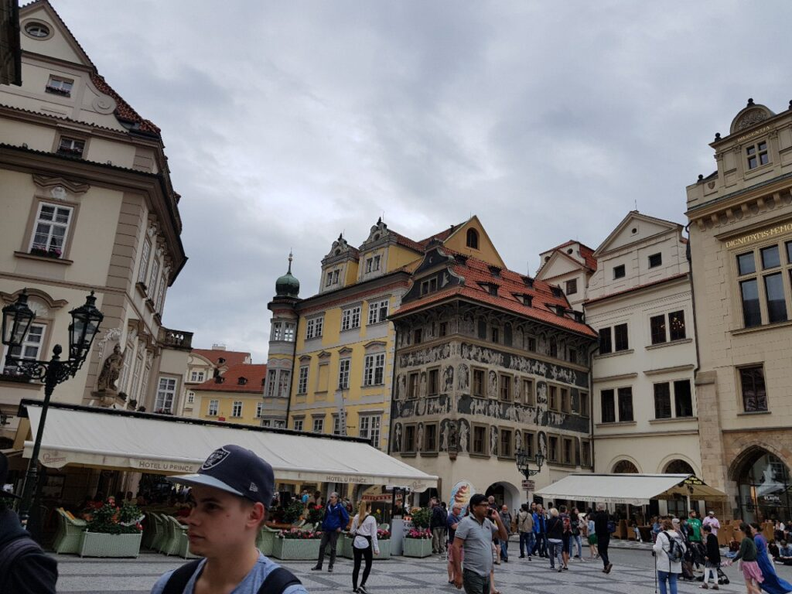
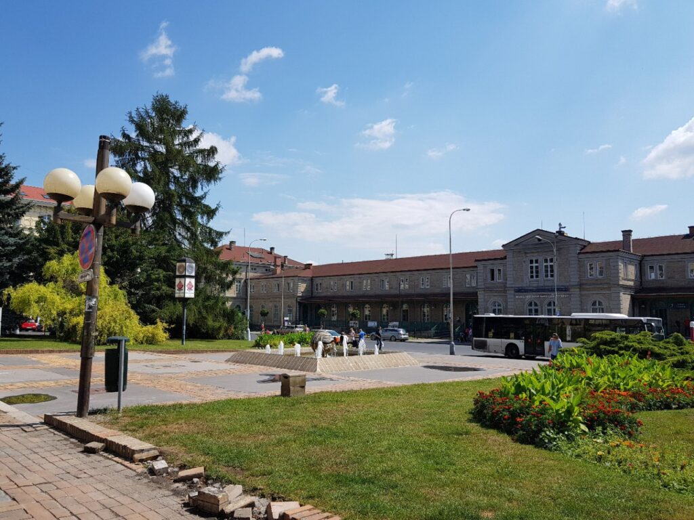
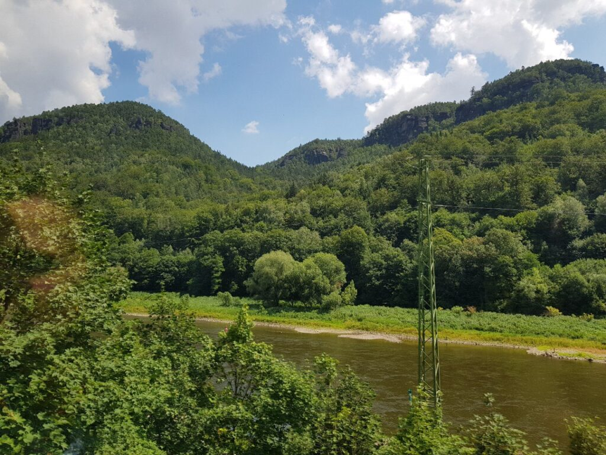
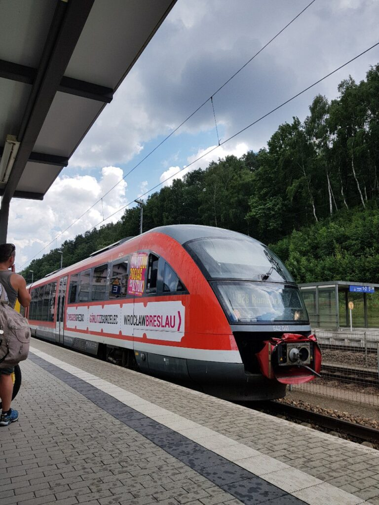
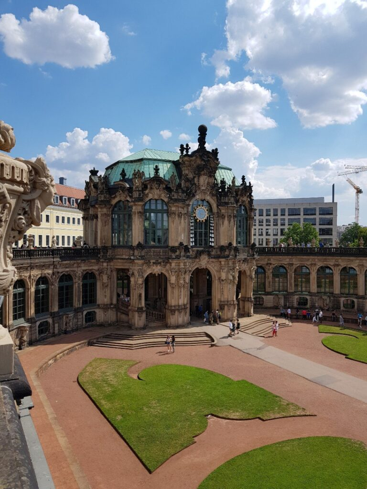
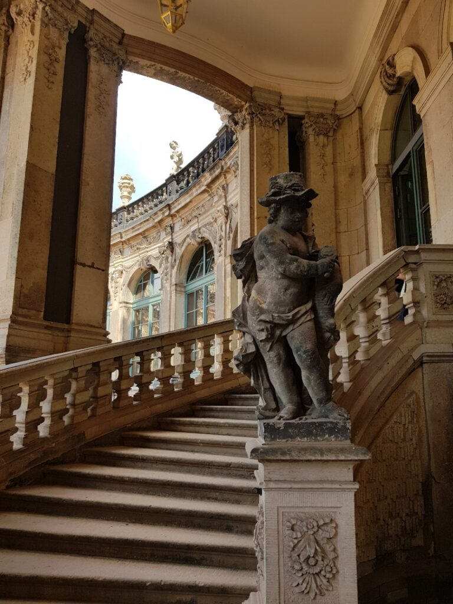
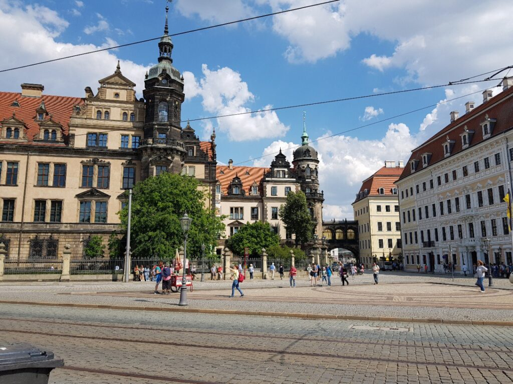
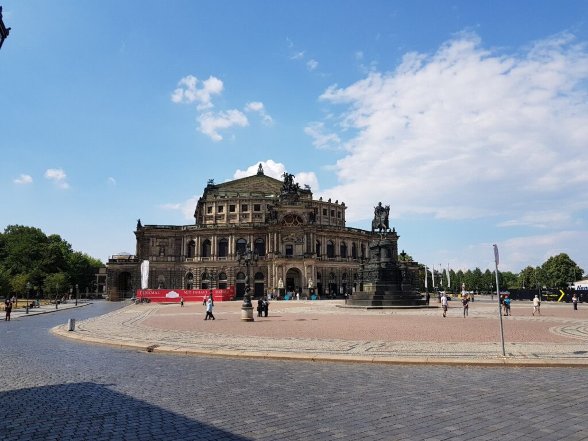
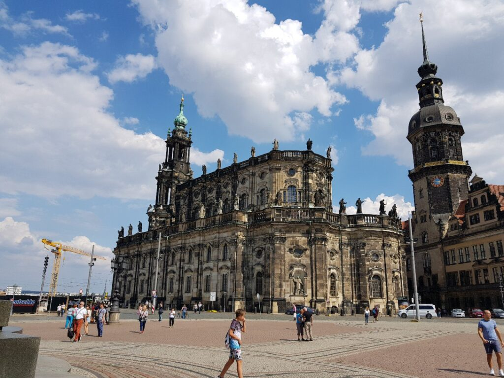

Having left Lviv by bus, we went to Prague through Poland, Krakow, as it is written on it.
Lviv - Krakow - Bohumin (transfer to railway) - Prague

_23:25_ Meanwhile, Katsu is approaching the Polish-Ukrainian border

_2018.07.12 00:05_ We stand and wait for our turn to pass the border control

_02:45_ We stood for 3 hours and we just entered the Ukrainian customs ...

_06:20_ And so, Katsu's foot first set foot on European soil (we will omit a few hours of standing in front of a prison in England))
Well, the difference in the roads is felt immediately, the fifth point sends respect to the roadlayers)
Wow, instead of power transmission towers, there are huge windmills in the fields)
Fog has descended on Poland, the whole sky is covered with clouds, such weather is very to Katz's taste)
Due to the fact that we were at the border for a very long time, we do not have time for the train on the ticket, and we will go next
Approaching Katowice, and from there to Bohumin (It's there near Ostrava) not far

_12:00_ So, Katsu got on the train, Leoexpress has his own train, which was kept for our bus.
Here the train, of course, is like a spaceship, and there is no comparison with our electric trains, the feeling is like in a car for $25+k.
This train is as quiet as modern electric cars, no choo-choo, on the one hand it is very cool, on the other hand, it has no soul.
I don’t know how long the train travels, GPS does not work, but it feels like at least 200 km / h
In fact 260-270km/h Faster only by plane😂

_15:15_ Hello long-awaited Prague, Katsu has arrived!

_15:55_ And so, Katsu was at KFC for the first time, everyone told him about it, but here he is in person.
And yet it’s difficult here without knowing the language, heh

|  |        |  |
| :-----------------------------------------------------: | ------------------------------------------------------------- | :-----------------------------------------------------: | --- |
|  |        |  |
|  |  |  |     |

|                                                                         |                                                                            |
| :----------------------------------------------------------------------------------------------------------------------------: | --------------------------------------------------------------------------------------------------------------------------------- |
|  |  |

|  |  |  |
| :-----------------------------------------------------: | ------------------------------------------------------- | :-----------------------------------------------------: |
|  |  |  |
|  |  |  |

|  |
| :-------------------------------------------------------------------------------------------------------------------------------------------------: |

|  |  |  |
| :-----------------------------------------------------: | ------------------------------------------------------- | :-----------------------------------------------------: |
|  |  |  |
|  |  |  |
|  |  |  |

Dresden is a city almost completely destroyed by the US Air Force and the WB in WWII.
So most of the "historical" buildings here have been restored or rebuilt.
