Виїхавши автобусом зі Львова ми вирушили до Праги через Польщу, Краків, як на ньому написано.
Львів - Краків - Богумін (пересадка на залізничні) - Прага

_23:25_ Тим часом Кацу наближається до польсько-українського кордону

_2018.07.12 00:05_ Стоїмо і чекаємо своєї черги на проходження прикордонного контролю

_02:45_ 3 години ми простояли і ми тільки зайшли на українську митницю.

_06:20_ І ось, нога Кацу вперше ступив на європейську землю (кількагодинне стояння навпроти в'язниці в Англії ми опустимо))
Ну, різниця в дорогах відчувається відразу, п'ята точка посилає респект дорогоукладачам)
Ого, замість опор ЛЕП на полях стоять величезні вітряки)
На Польщу опустився туман, все небо затягнуте хмарами, така погода дуже до смаку.
Через те, що ми дуже довго були на кордоні, на поїзд у квитку ми не встигаємо, і їхатимемо наступним
Наближається до Катовиці, а звідти до Бохуміна (Це там поряд з Остравою) недалеко

_12:00_ Отже, Кацу пересів у поїзд, у Леоекспрес свій особистий поїзд, який притримали для нашого автобуса.
Тут поїзд звичайно, як космічний корабель, з нашими електричками і не порівняти, відчуття, як у машині за $25+к.
Цей поїзд такий же тихий як сучасні електрокари, ніякого чуха, з одного боку це дуже круто, з іншого - в ньому немає душі.
Не знаю скільки їде поїзд, GPS не працює, але за відчуттями не менше 200 км/год.
По факту 260-270км/ч Найшвидше на літаку😂

_15:15_ Привіт довгоочікувана Прага, Кацу прибув!

_15:55_ І ось, Кацу вперше в KFC, всі йому розповідали про це, але ось він своєю персоною.
І все-таки складно тут без знання мови, хех

|  | 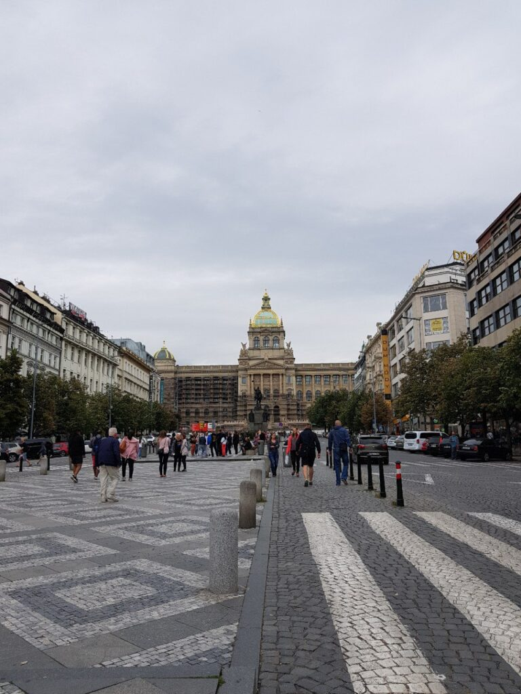 |  |
|:---:|---|:---:|
| 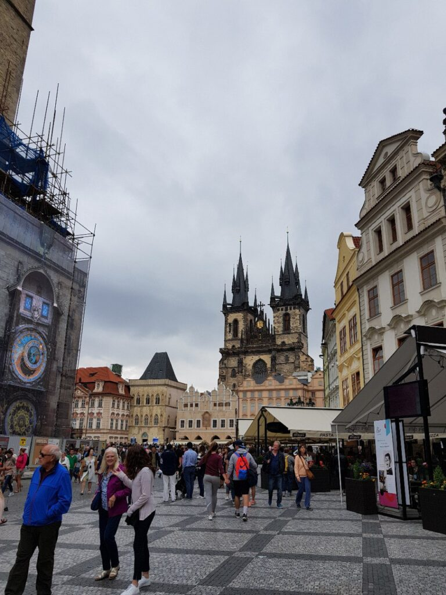 | 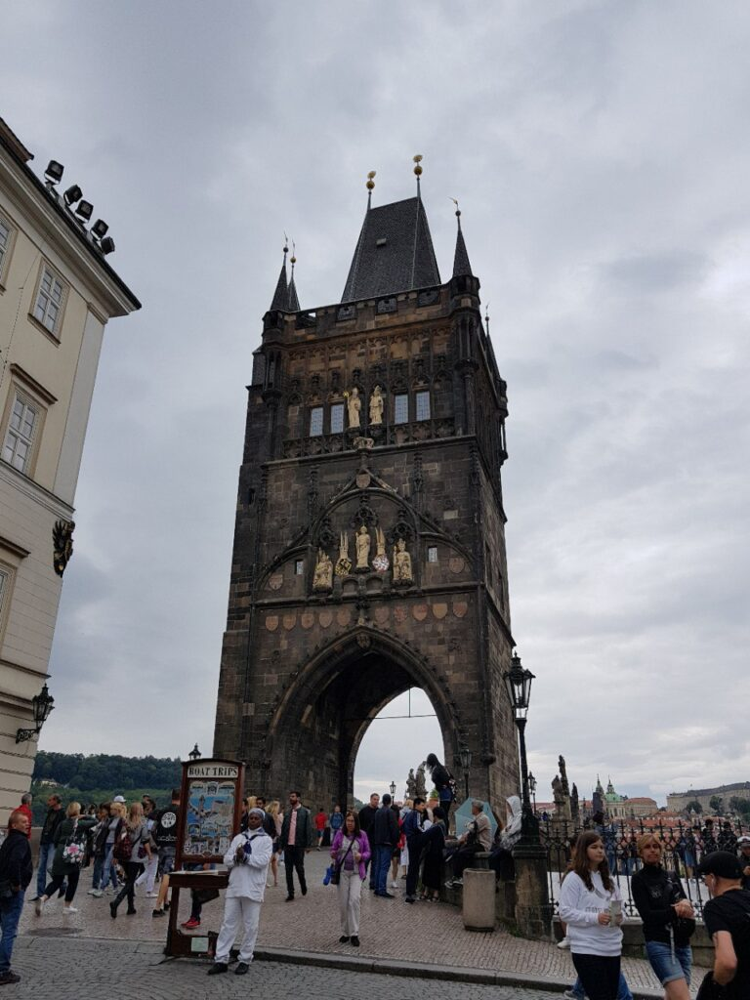 |  |
| 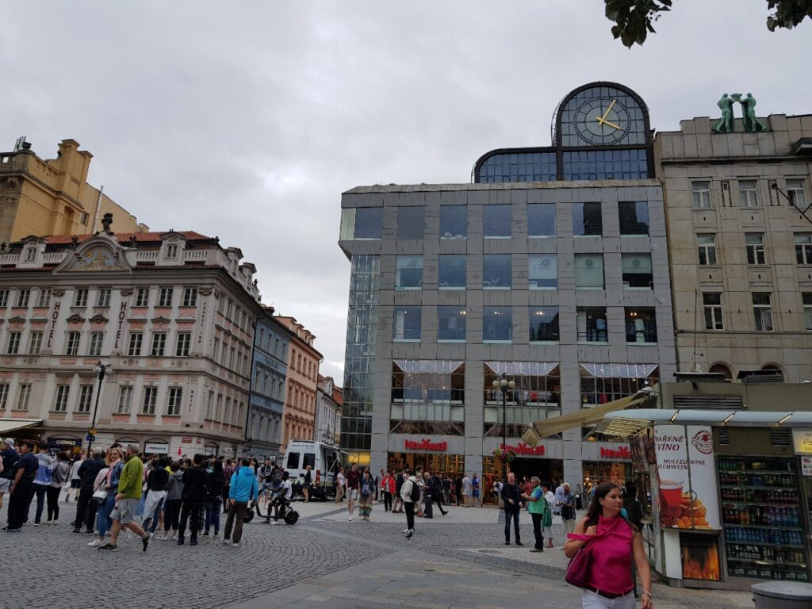 |  |  | |

| 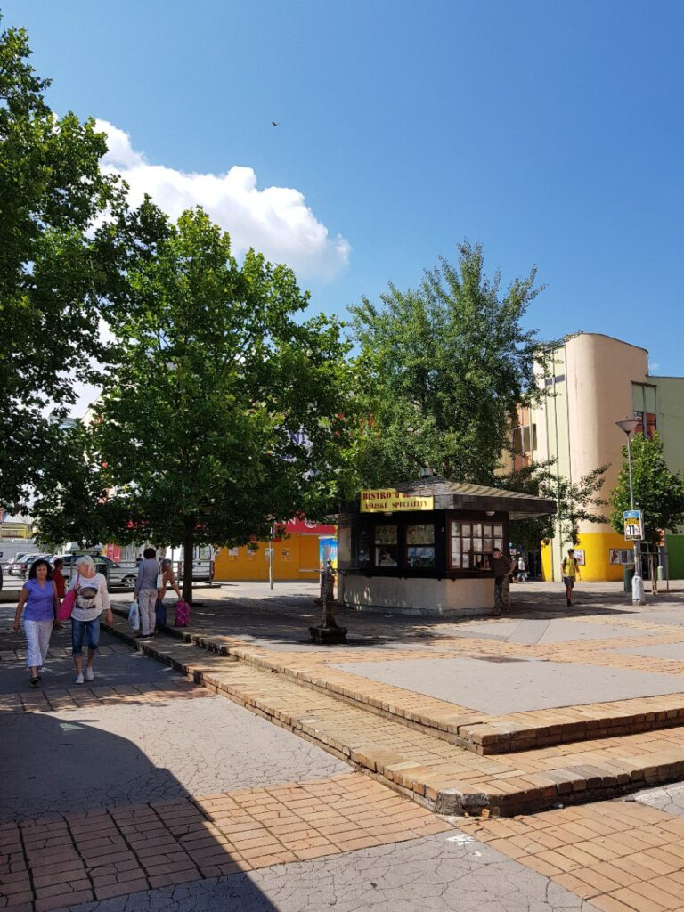 | 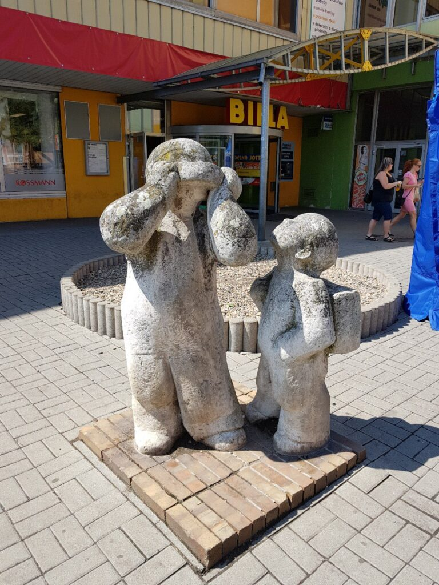 |
|:---:|---|
|  | 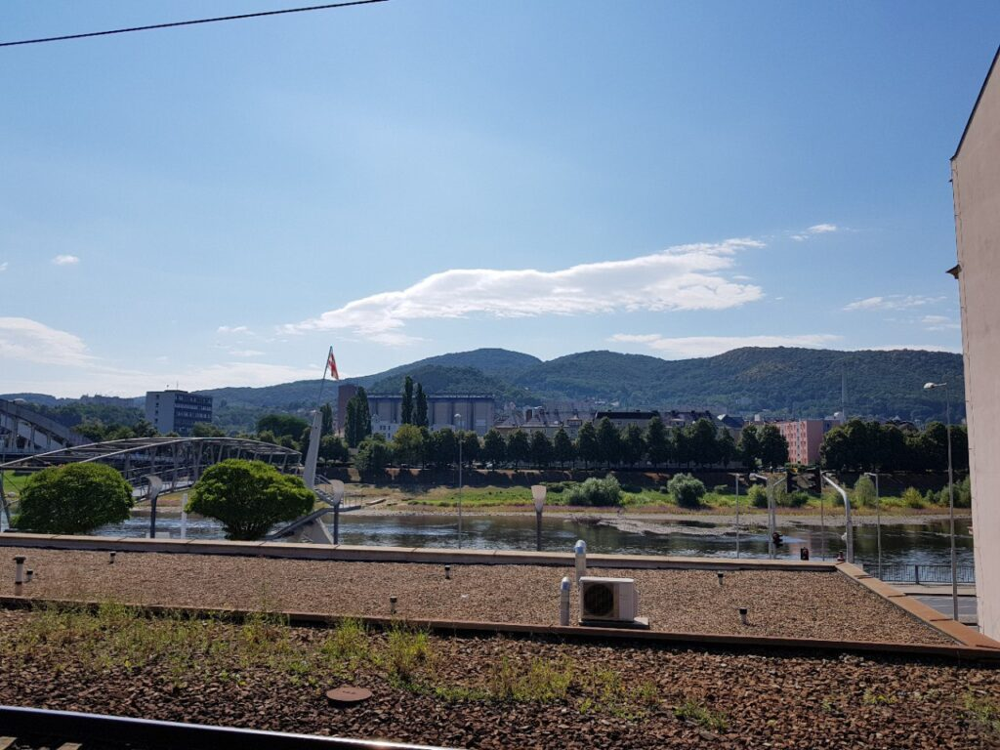 |

|  | 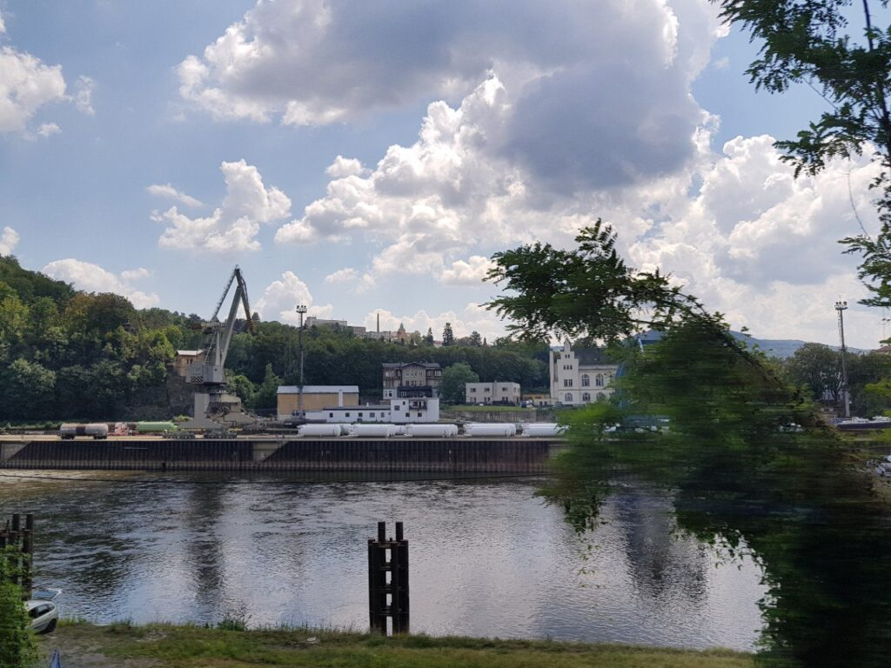 | 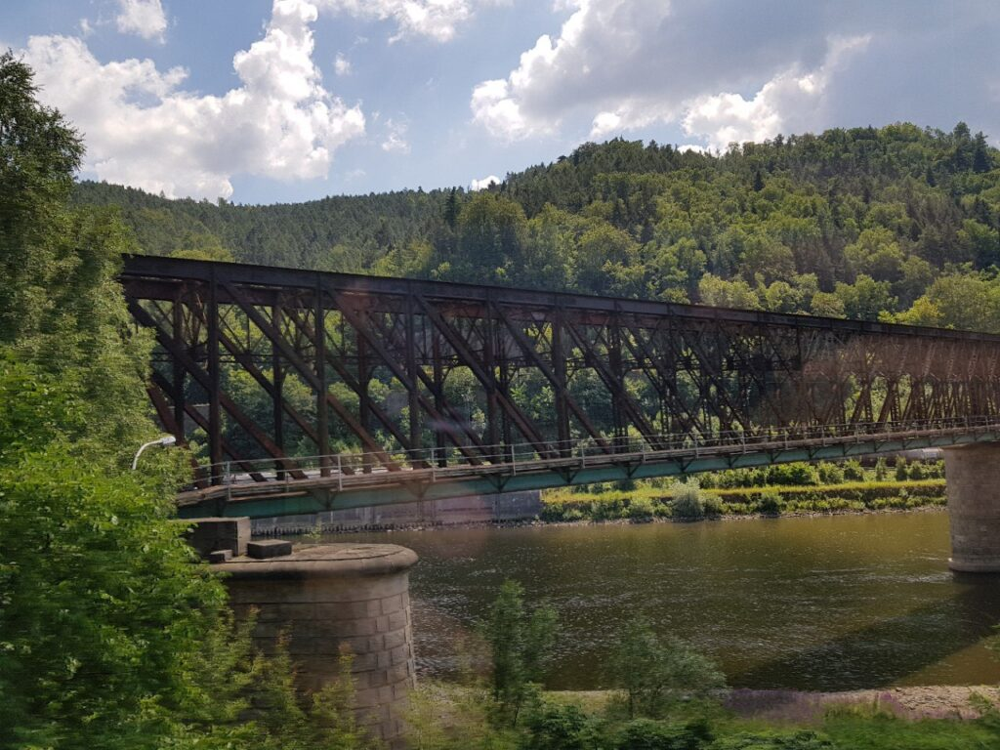 |
|:---:|---|:---:|
|  |  | 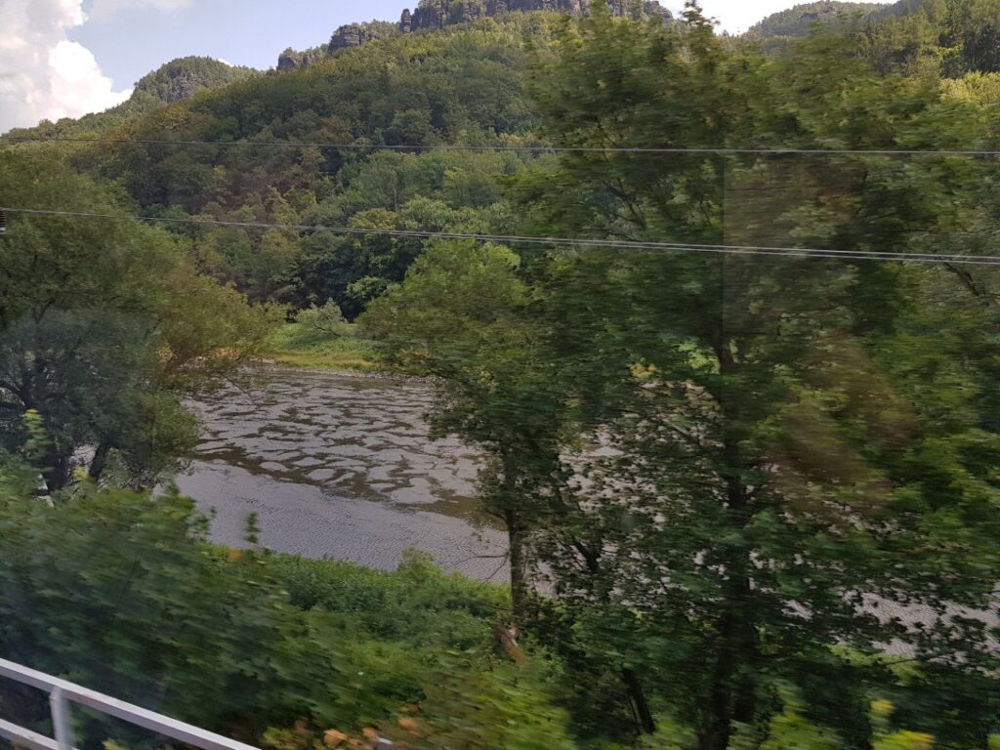 |
| 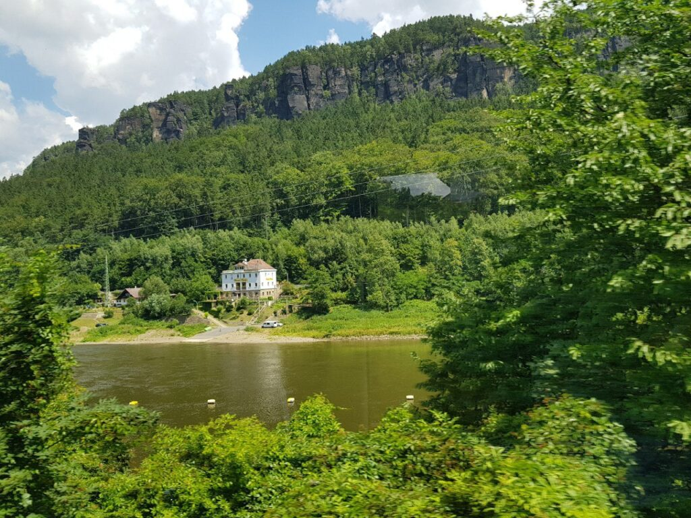 |  |  |

| ![Той самий дизельний тепловоз. Ми на нього запізнилися і чекали 2 години, гуляючи Дечиною] (images/photo_317@13-07-2018_16-01-55-768x1024.jpg) |
|:---:|

|  |  |  |
|:---:|---|:---:|
|  |  |  |
|  |  |  |
|  | 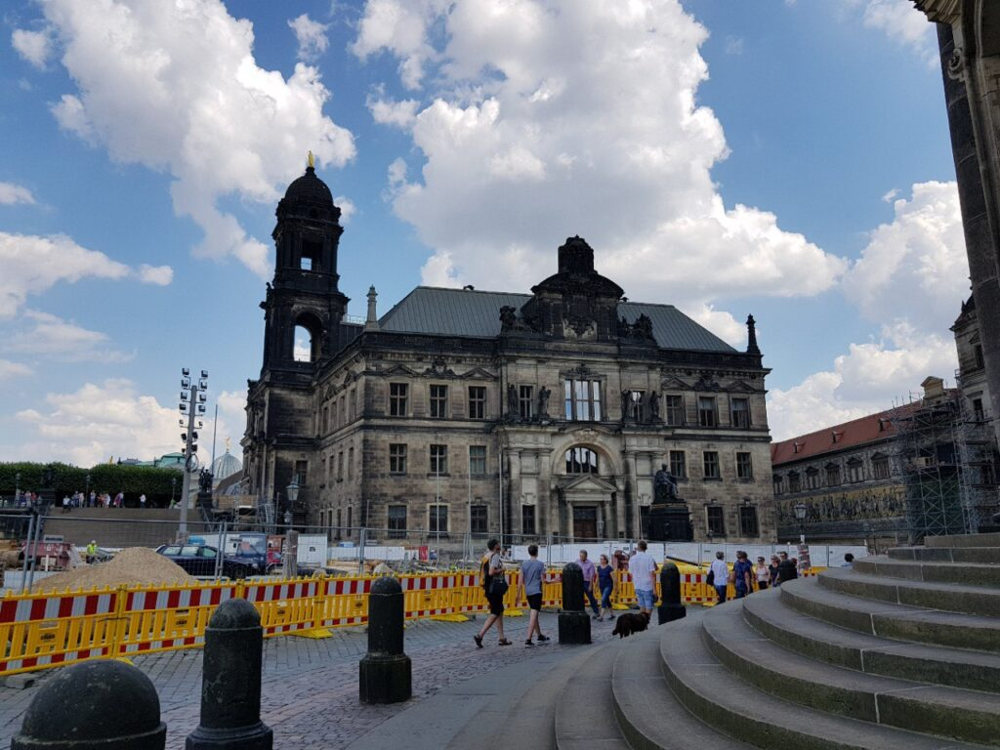 |  |

Дрезден - місто майже повністю знищене силами повітряними силами США та СБ у ВМВ.
Так що більшість "історичних" будівель тут відновлені або побудовані заново.