_2018.07.14_ Guten abend. Кацу мовить із Зальцбурга. Це невелике місто на околиці Австрії, відоме своєю фортецею на пагорбі.
Ми встали о 5 ранку і вирушили до Праги поїздом, звідки нас забрав автобус і привіз сюди)
Додаю фотозвіт.

|  |
| :----------------------------------------------------------------------------------------------------------: |

| 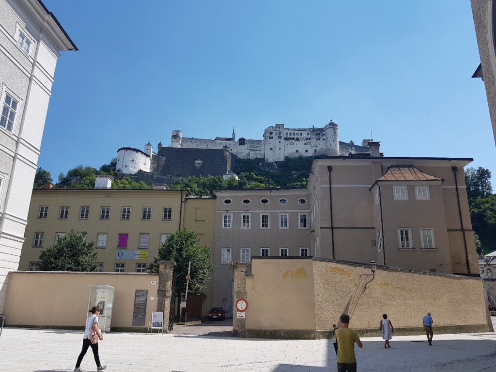 | 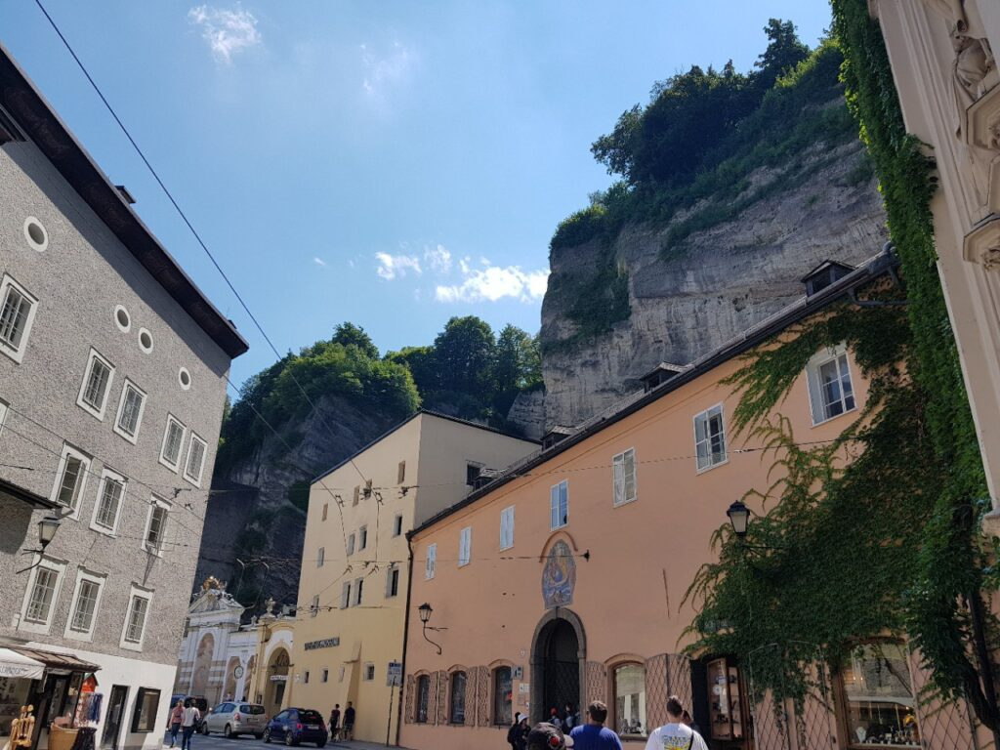                                       | 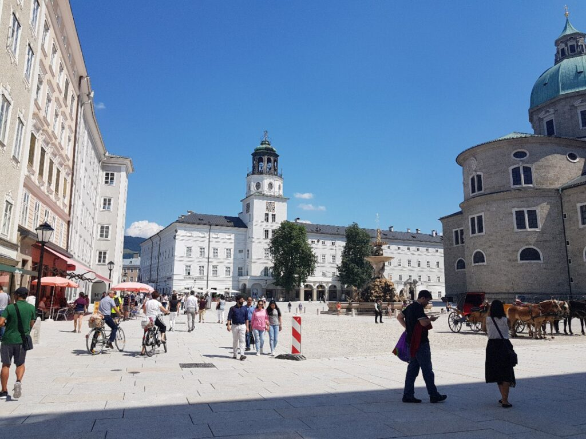 |
| :-----------------------------------------------------: | --------------------------------------------------------------------------------------------- | :-----------------------------------------------------: |
|  | 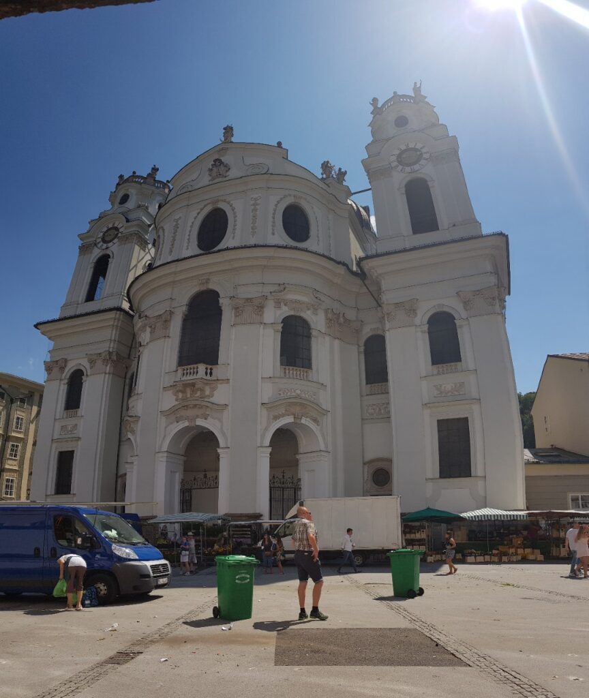 | 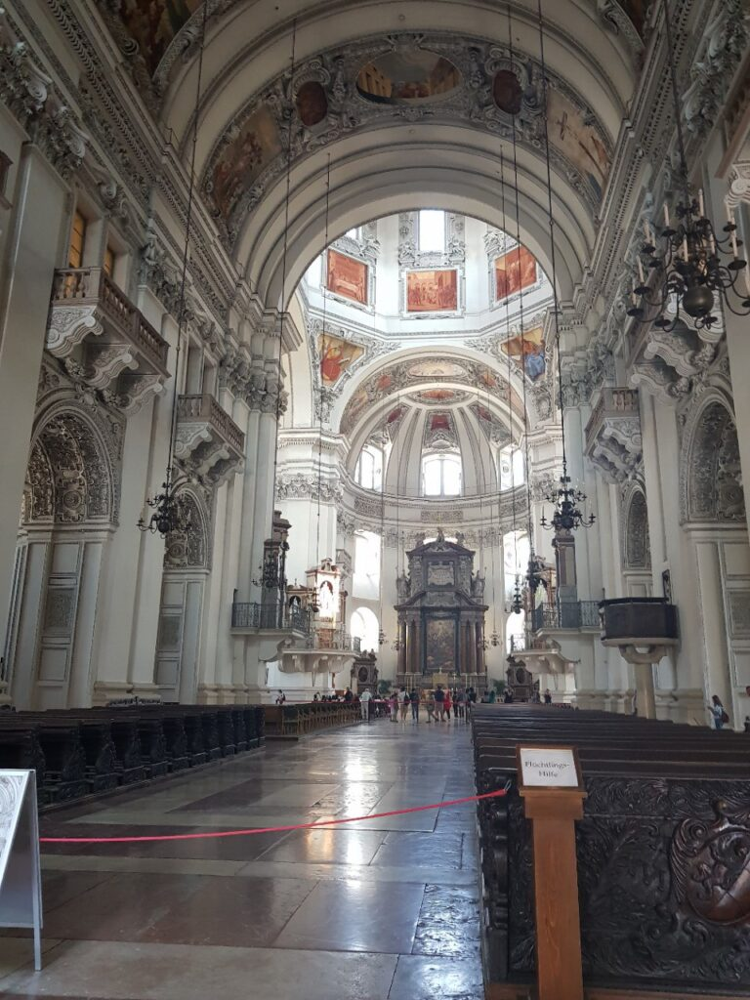 |
| 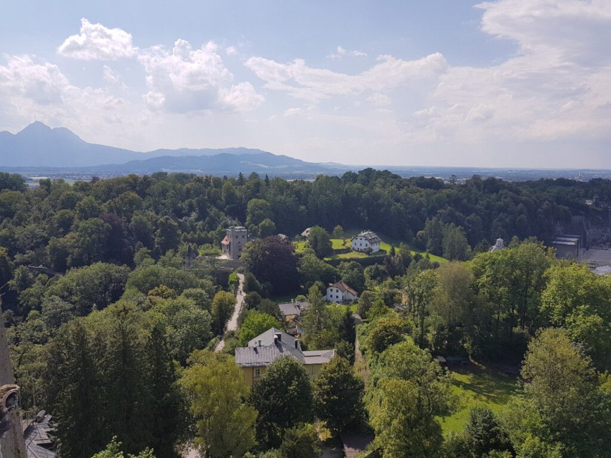 | 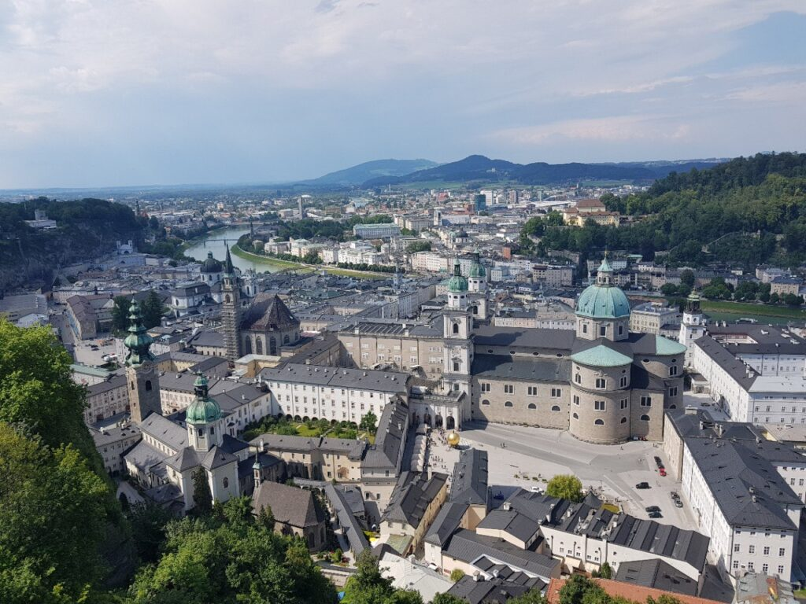                                       |  |
|  |                                        | 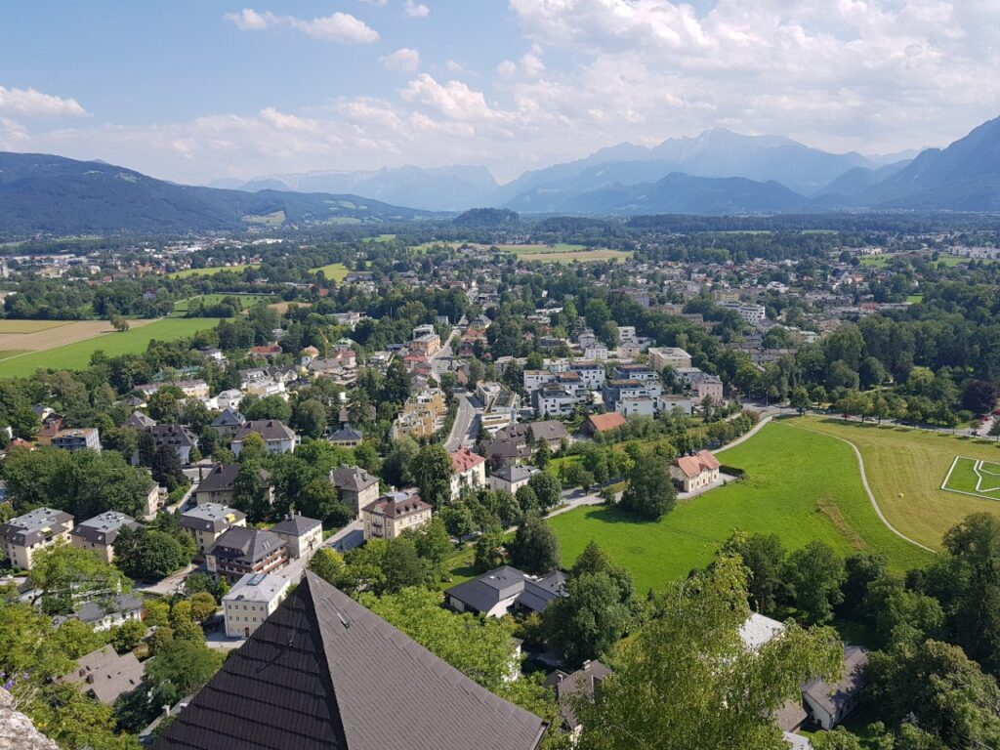 |

|  |
| :-----------------------------------------------------: |

| 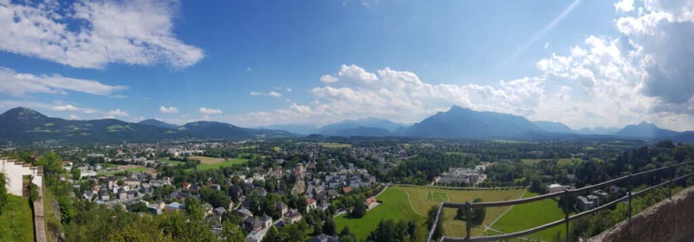 |
| :------------------------------------------------------------------------------: |

_2018.07.15_ Ми провели цікаву ніч) До півночі сиділи в австрійській подобі Макдональдса, Бургервіста, просто офігенне місце, бургери смажать при вас і вони в 1000 разів смачніші. Після чого до 4 ранку гуляли нічним Зальцбургом, на той час ми набрели на цілодобово заправку з туалетом, кавою і т.д., що було для нас просто як оазис посеред пустелі.

|  |
| :----------------------------------------------------------------------------------------------: |

|  |  |                                                         |
| :-----------------------------------------------------: | ------------------------------------------------------- | :-----------------------------------------------------: |
| 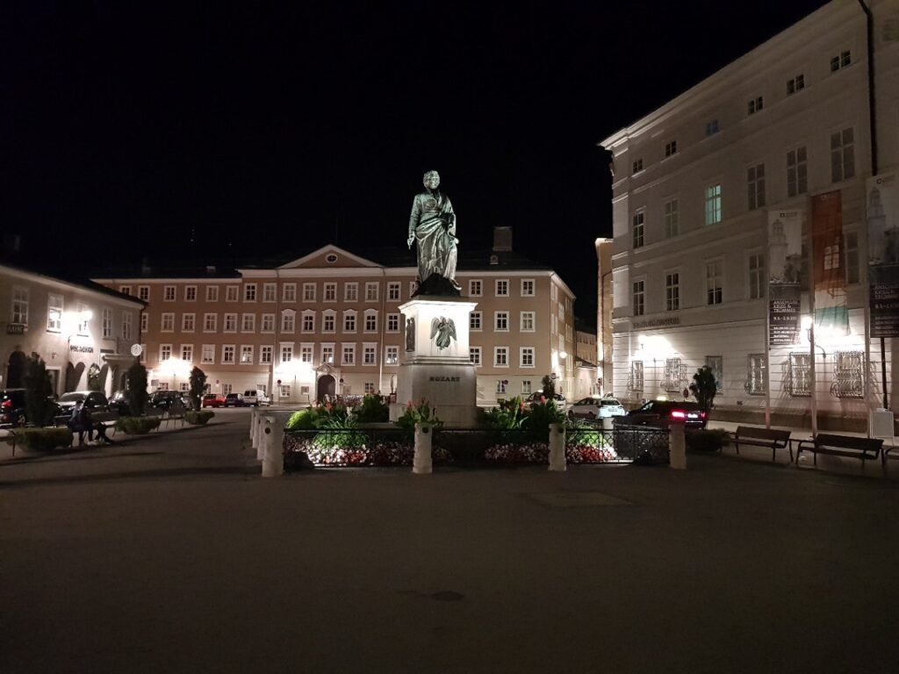 | 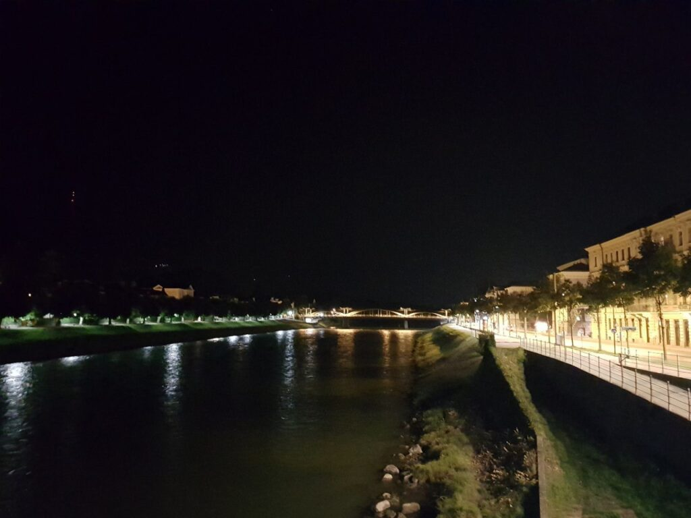 | 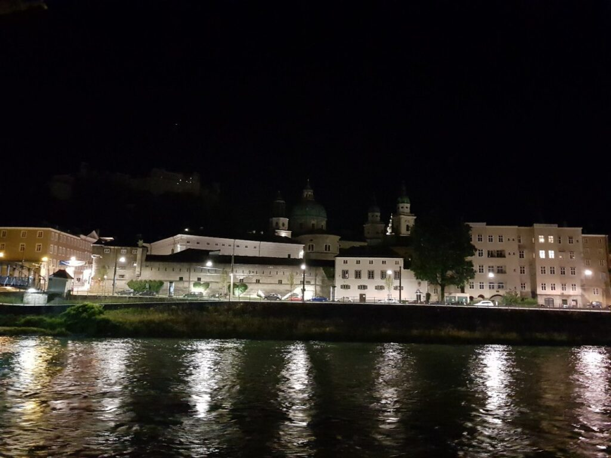 |

| 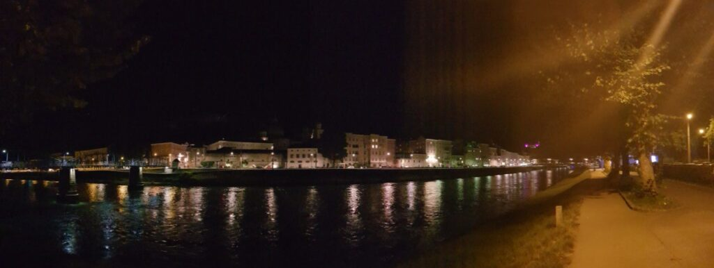 |
| :---------------------------------------------------------------------: |
