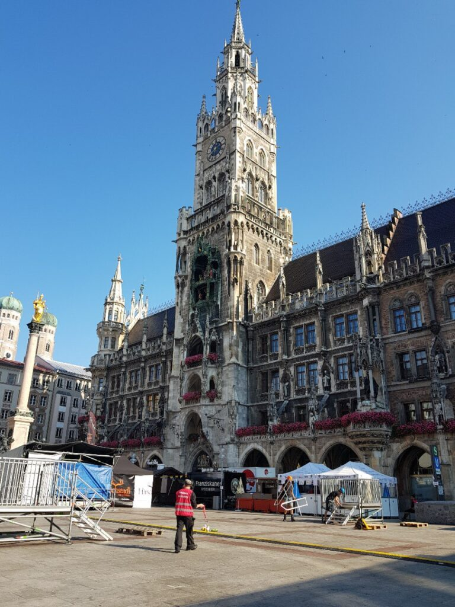
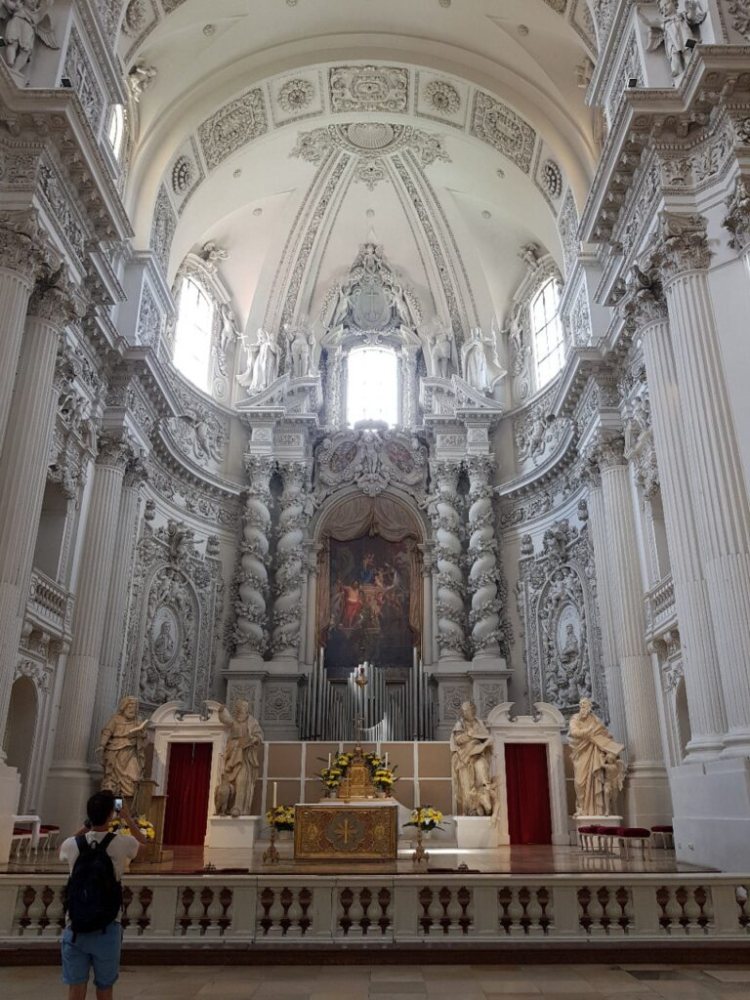
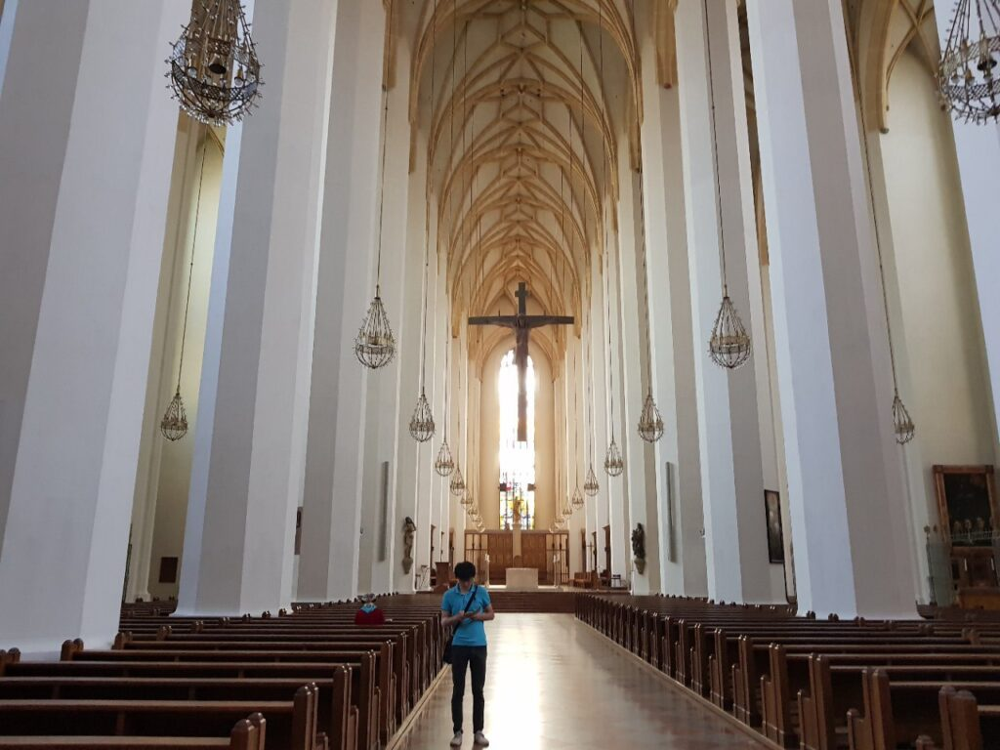
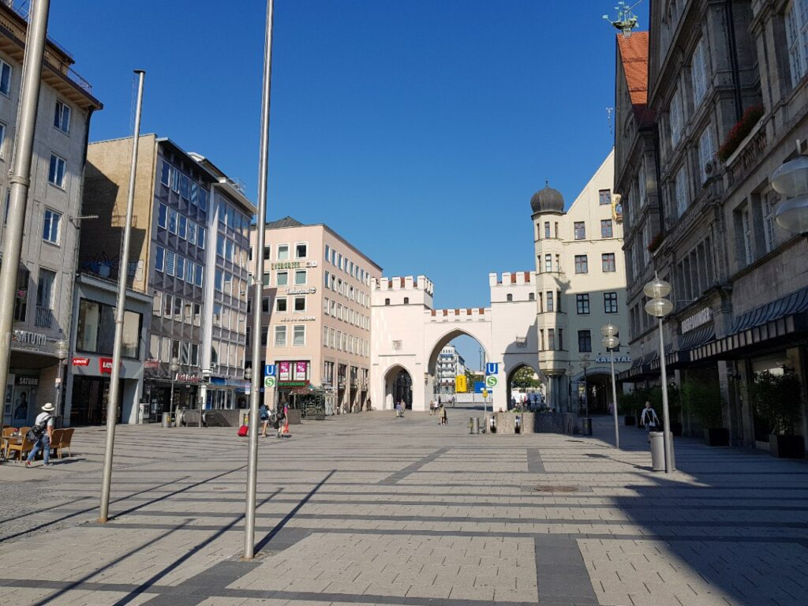
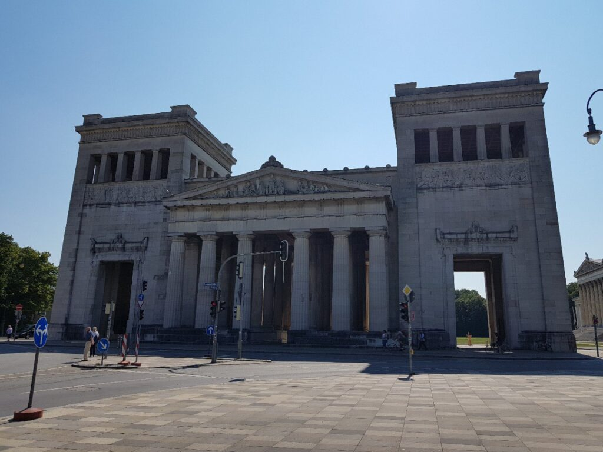
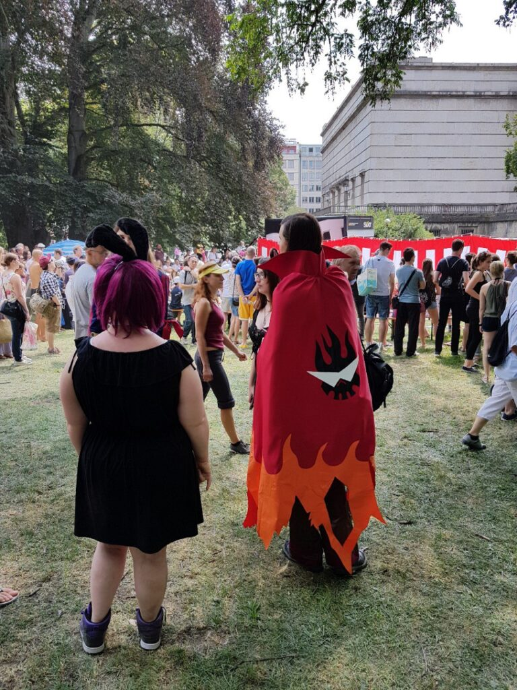
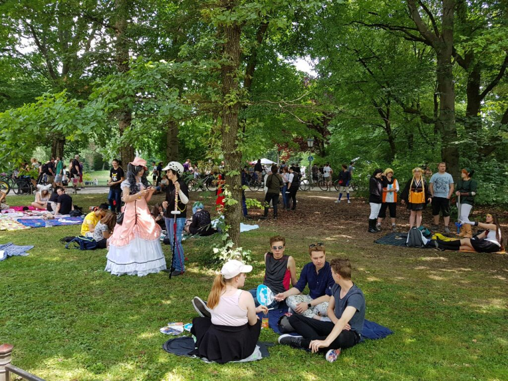
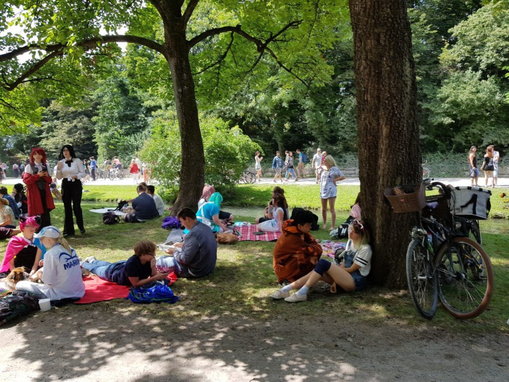
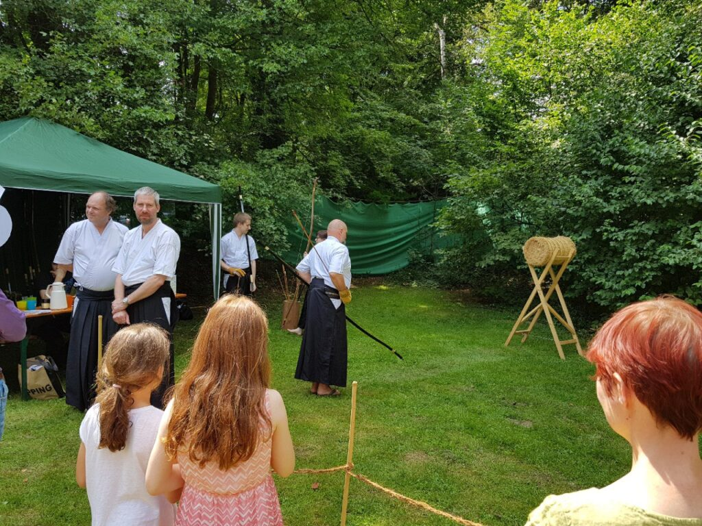
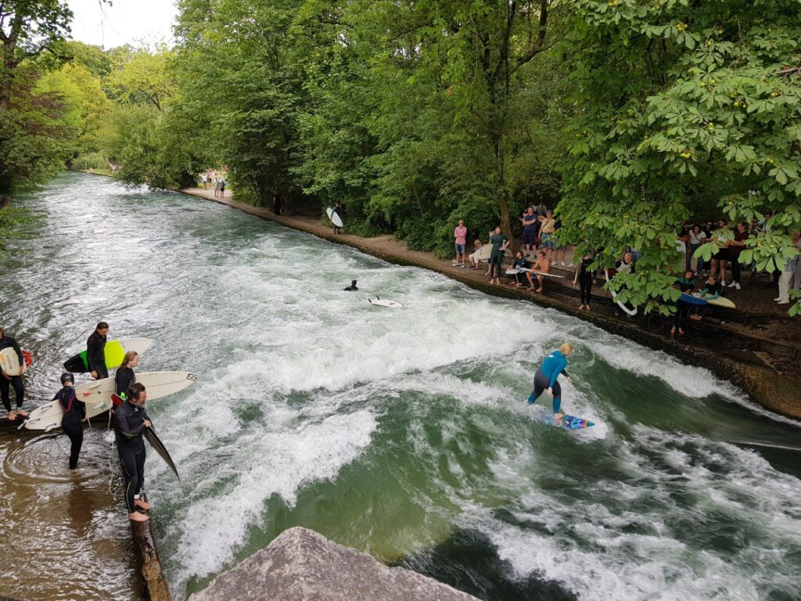

_2018.07.15_ At 05:30 we boarded the bus and in 2 hours we were in Munich. We had breakfast with pancakes and went to visit several beautiful churches, listened to a rehearsal of organ music with a choir, visited the Museum of Antiquity, and then went to the English Garden. And there was JapanFest! So I took a lot of photos of cosplayers and local stalls. After that, the impression of FanExpoOdessa weakens a bit (The scale is not the same at all. (UPD: peace be upon him)
There was also an artificial river with a very strong current and I decided to swim in it. The water was quite cold, less than 18 degrees, and the current carried with such force that it was impossible to swim against it. When I reached the end of the river, I was blind (without glasses), without a phone and documents in the same swimming trunks, I began to look for my friend, which took me at least an hour. But it was worth it! Then there were Bavarian sausages with beer and now we are going by bus back to Prague.

|  |                       |  |
| :-----------------------------------------------------: | :--------------------------------------------------------------------------: | :-----------------------------------------------------: |
|  |                       |  |
|  |                       |  |
|  |                       |  |
|  |                       |  |
|  |  |  |

|  |
| :--------------------------------------------------------------------------------------------: |

|    |  |    |
| :-------------------------------------------------------: | ------------------------------------------------------- | :-------------------------------------------------------: |
|  |  |  |
|    |  |           JapanFest where we happened to be at            |

|  |
| :------------------------------------------------------------------------------------------------: |
