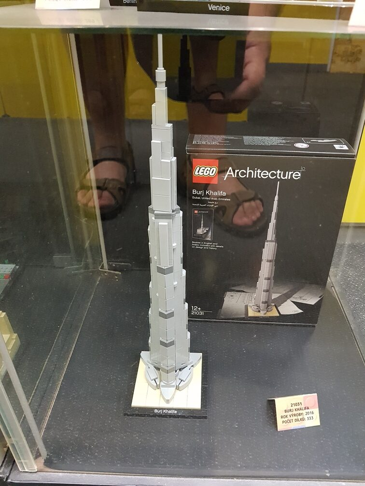
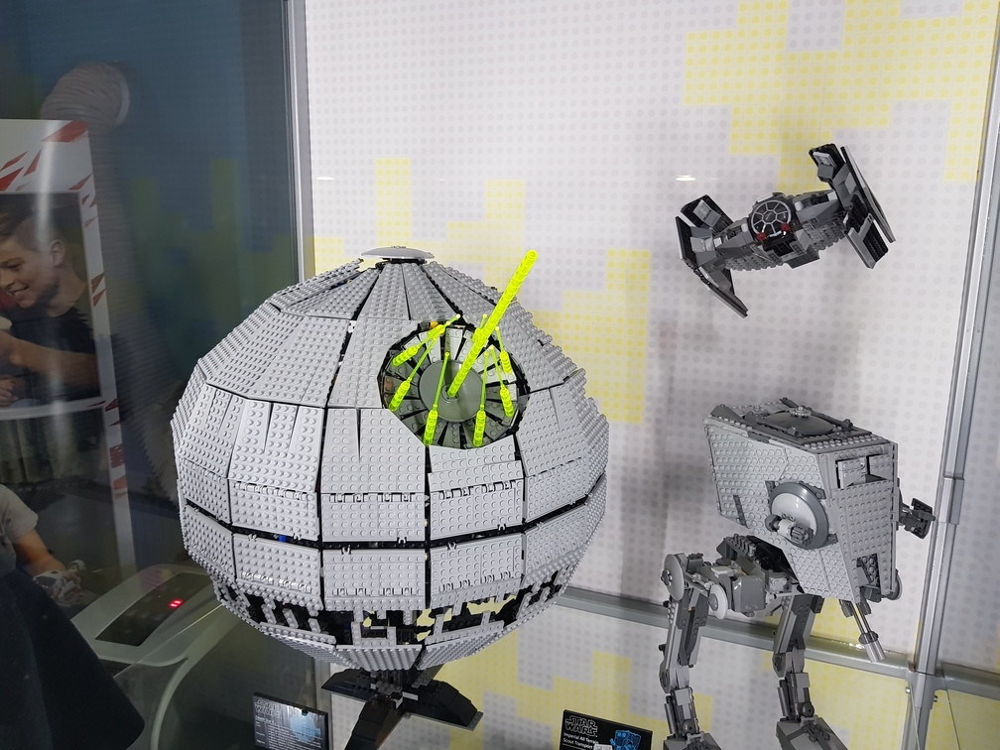
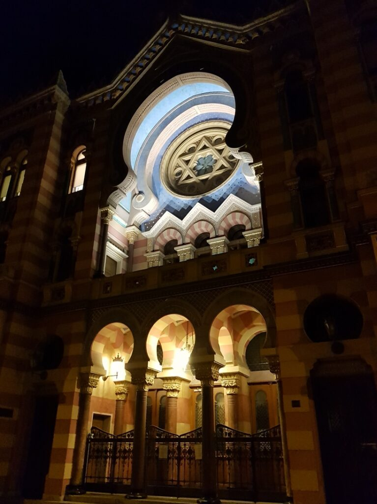
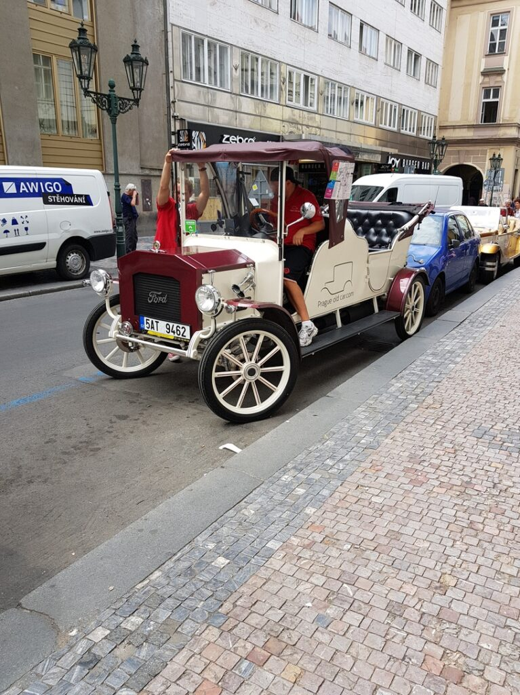
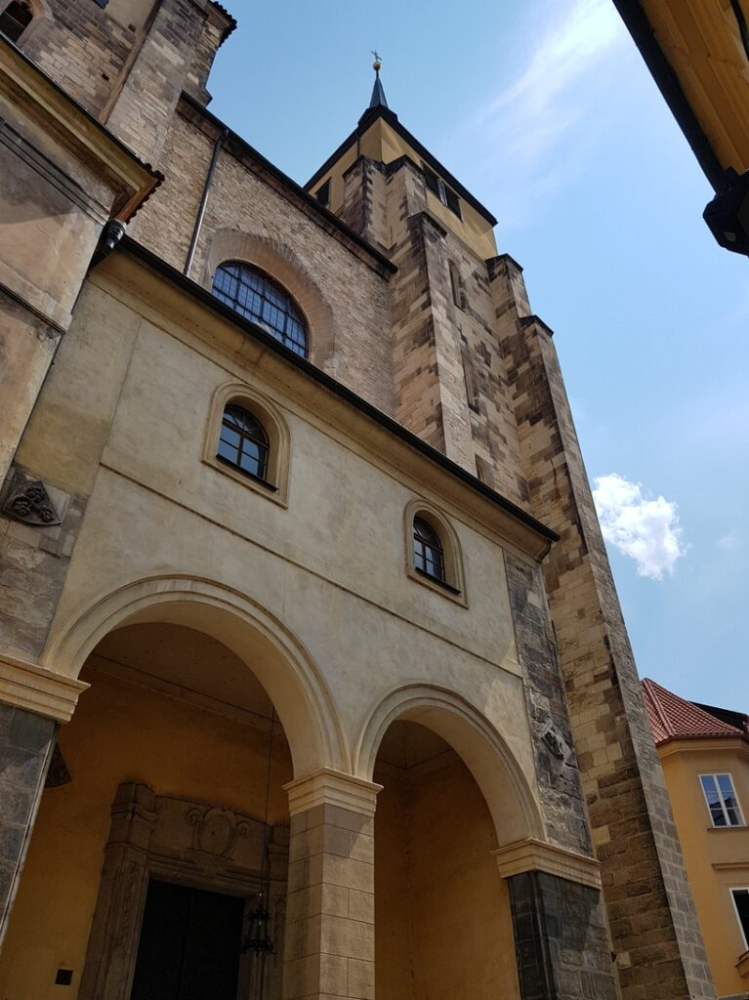
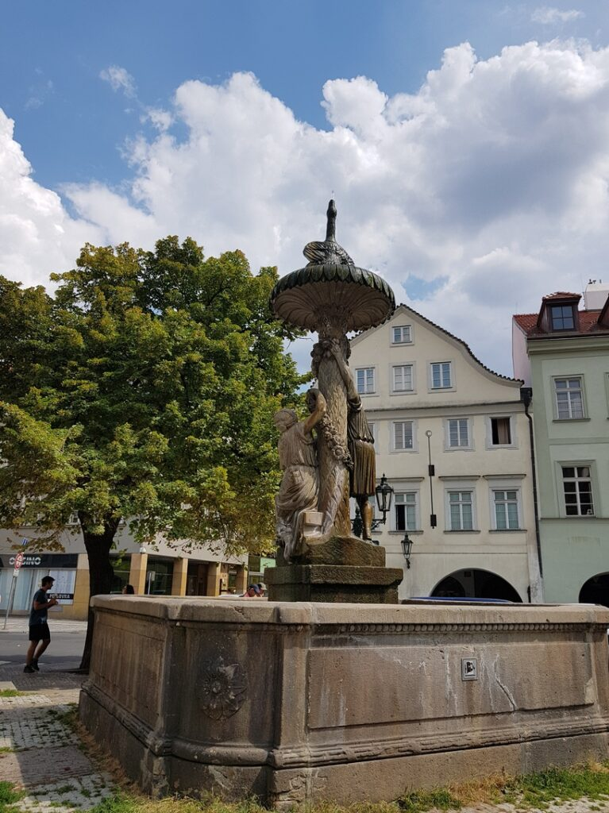
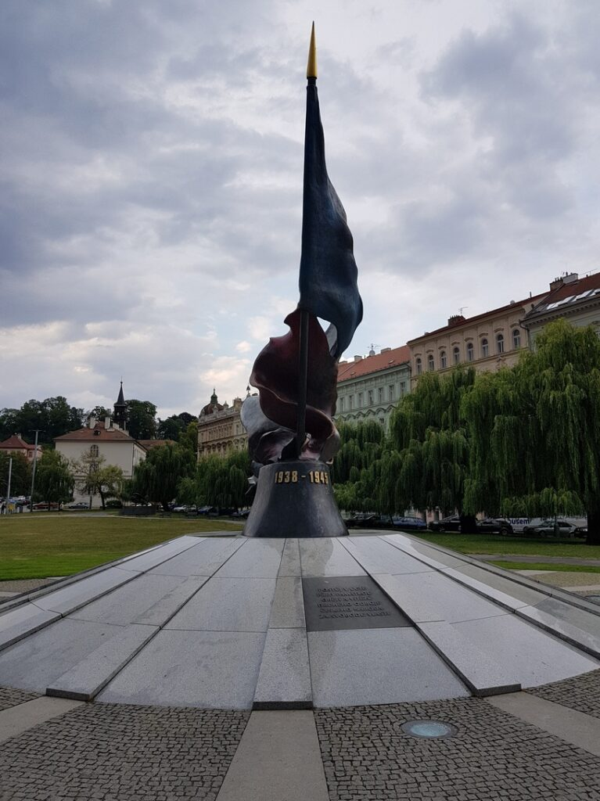
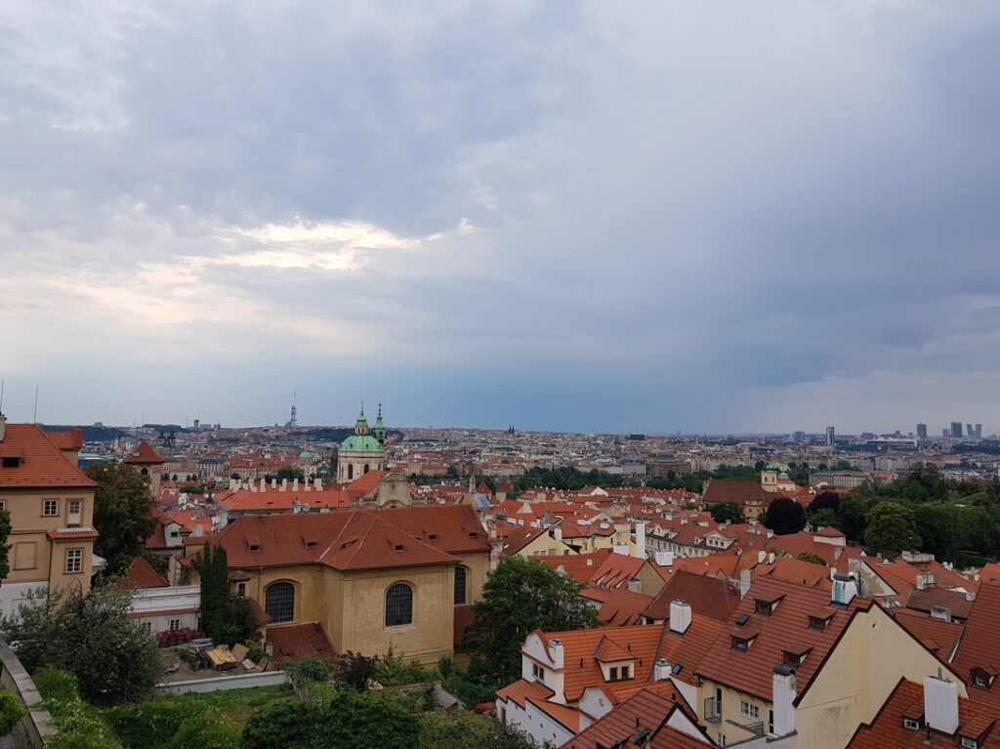
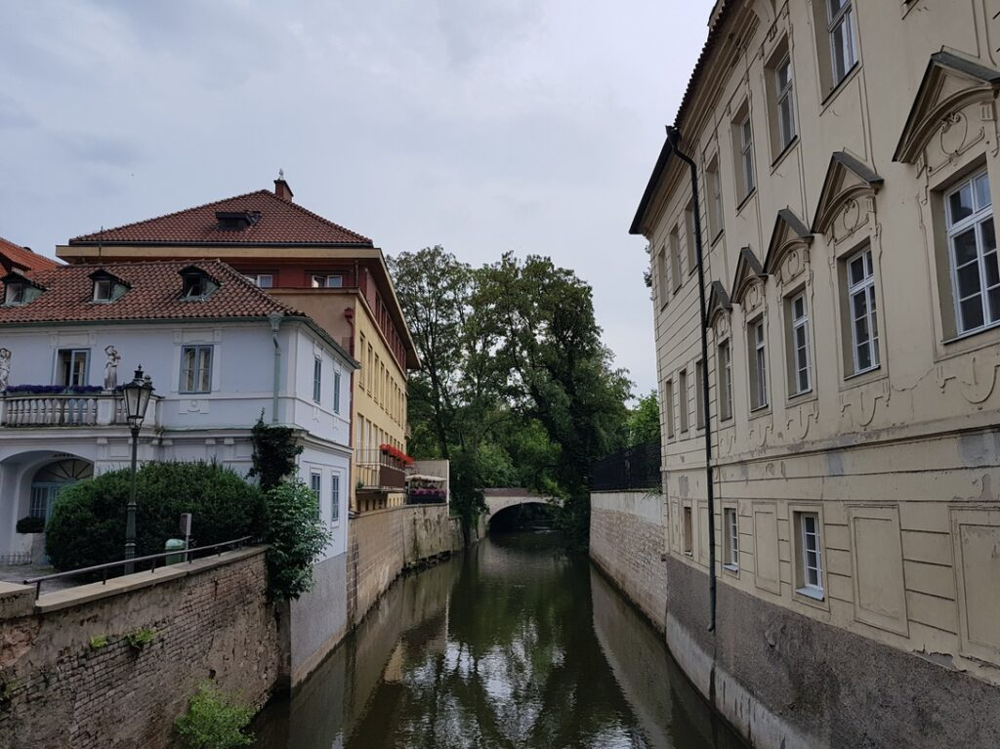

_2018.07.15 23:40_ Сиджу на Prague Hlavni Nadzravi (Головний Вокзал), чекаю друга з ключами від хостелу)
Є одна річ, яка вразила мене в Європі. Практично все закривається о 8-9 годині і навіть води купити ніде в пізню годину, що там води - навіть цілодобових аптек не зустрічав на своєму шляху, хіба що шукати заправки…
Тут можна вижити лише довготривалим плануванням, і неможливо, як у нас, приймаючи рішення в останній момент, або з розряду, коли захотів, тоді й купив.
_00:30_ Заселився в хостел, дякую другу та його брату))

2018.07.16 Сьогодні весь день гуляв Прагою)
Сходив у музей антикомунізму, музей секс-машин, музей Лего, також відвідав Празький град. Все-таки розщедрився і покуштував айс-латте зі старбакса, який виявився неймовірно смачним, шніцаль, а також відому празьку солодощі, назву якої я не знаю (UPD: Трдло)
Сьогоднішній день був дуже класним, але треба готуватись до від'їзду. Завтра о 09:17 на мене чекатиме поїзд до Бохуміна, звідки я вирушу автобусом до Львова, де о 9 ранку на мене знову чекатиме поїзд, вже до Одеси.

Фотографій з музею анти-комунізму не буде, тому що там є кримінальна переслідувана в моїй країні символіка.
|  |  |  |
| --- | --- | --- |
|  |  |  |
|  |  |  |

|  |  |  |
| :-----------------------------------------------: | ------------------------------------------------- | :-----------------------------------------------: |
|  |  |  |
|  |  |  |
|  |  |  |
|  |  |               Ще трохи видів Праги                |

_2018.07.17 13:15_ Ну ось, Кацу в поїзді Лео-експерес на шляху до Бохуміну. Після цього на мене чекатиме автобус до Львова, а звідти поїзд до Одеси. У результаті завтра ввечері я вже опинюся вдома)

_2018.07.18_
_05:30_ Кацу прибув до Львова! Тепер залишається чекати на поїзди)
Благо кордон ми проїхали дуже швидко, навіть з автобуса не виходили, просто проштампували паспорти в польському кордоні і відправили додому.
_20:15_ Залишаються лічені хвилини до прибуття Кацу до рідного міста)
Одеса вже дуже близько^^

Ось так я чудово провів два тижні після того стресового та важкого рейсу)
