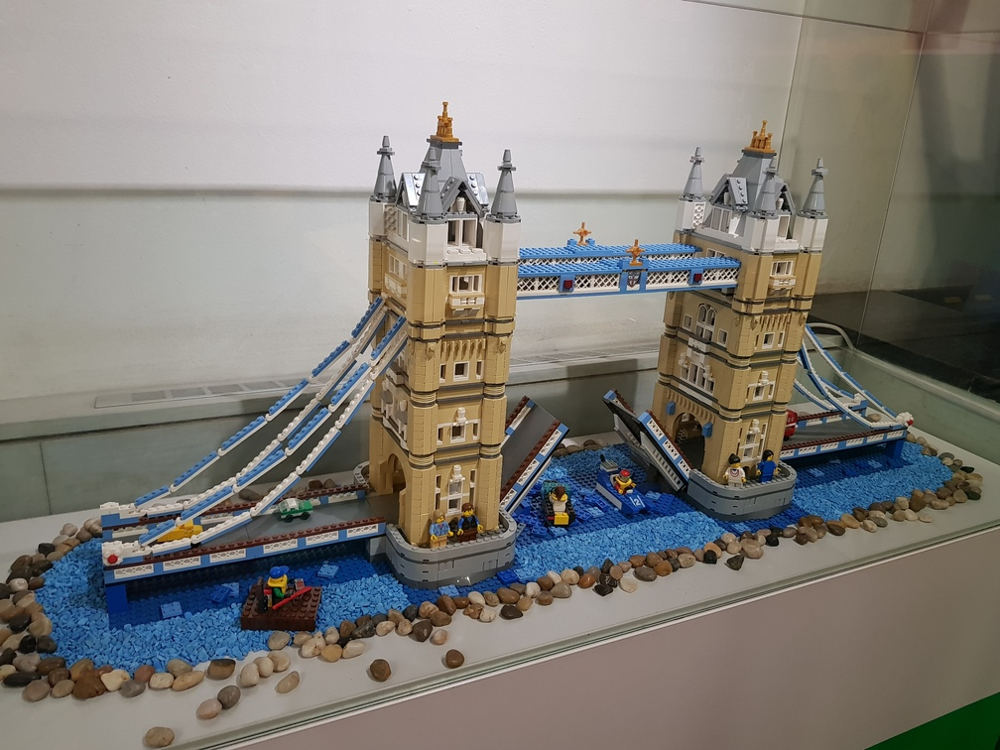
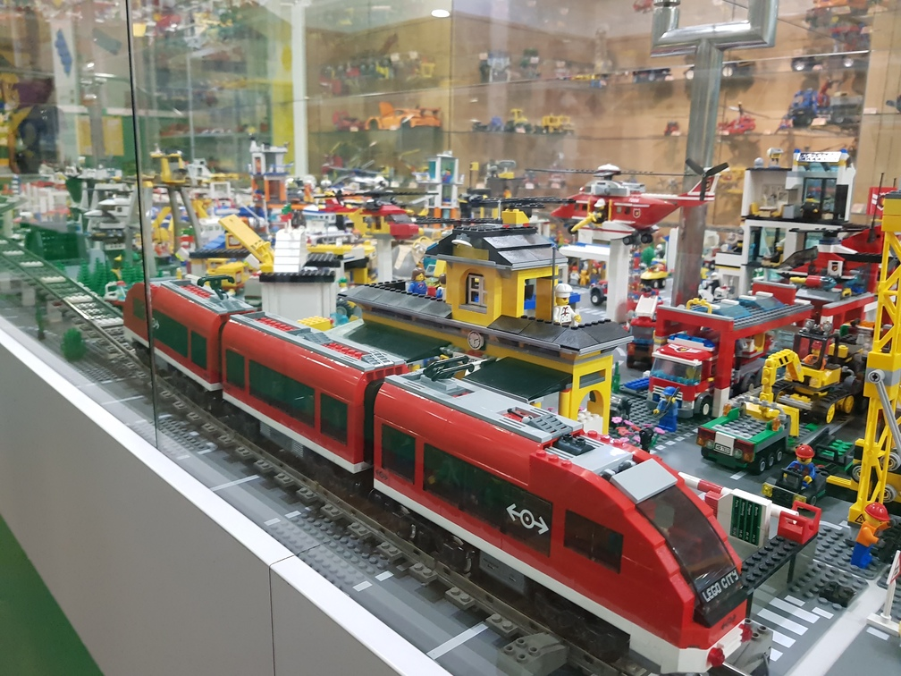
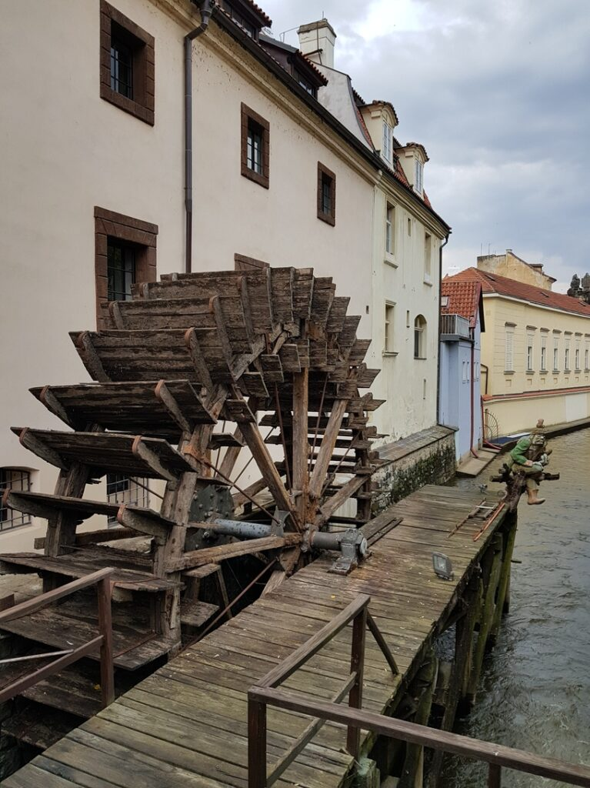
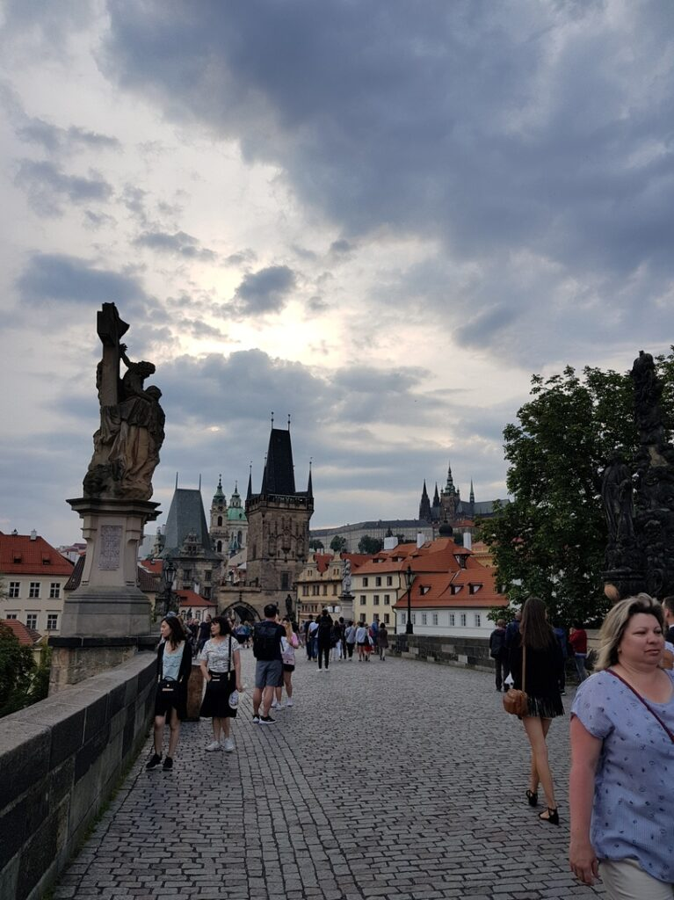
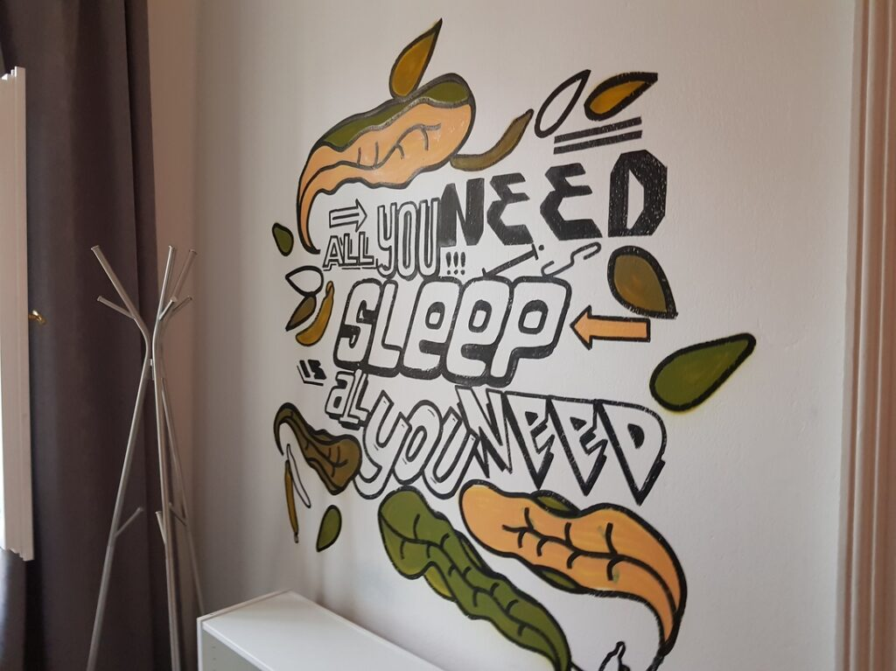
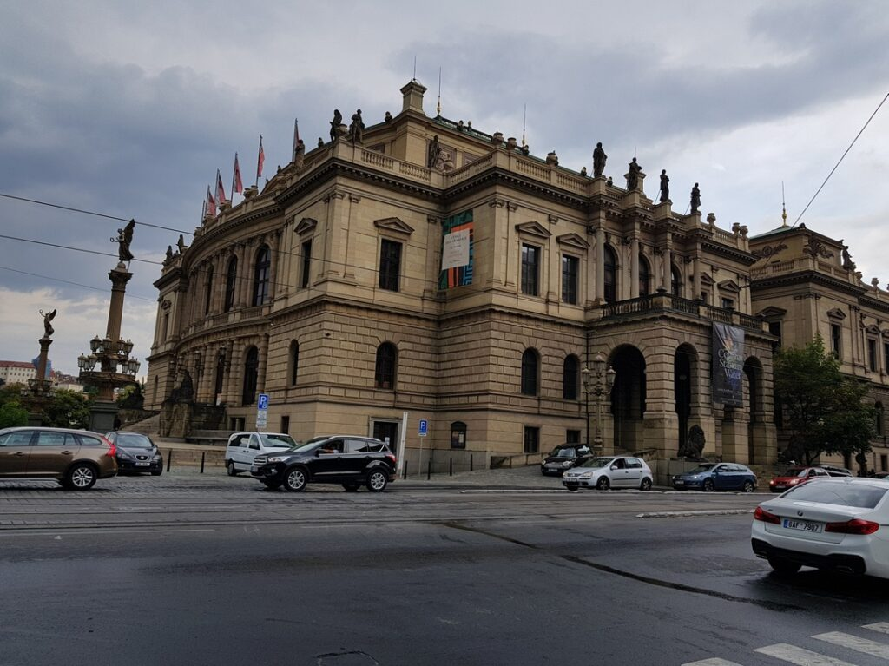
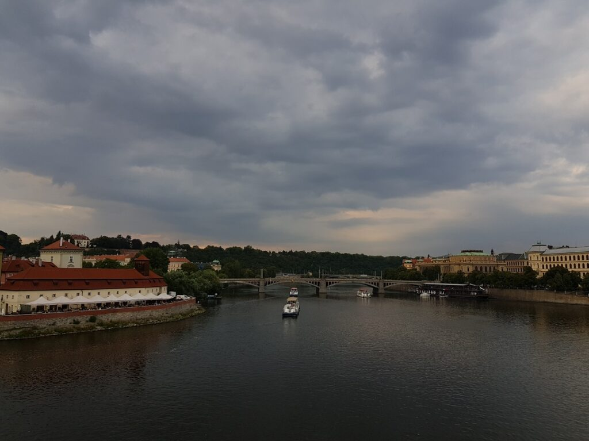

_2018.07.15 23:40_ I'm sitting at Prague Hlavni Nadzravi (Main Station), waiting for a friend with the keys to the hostel)
There is one thing that struck me in Europe. Almost everything closes at 8-9 o’clock and there is nowhere to even buy water at a late hour, that there is water there - I didn’t even meet round-the-clock pharmacies on my way, except to look for gas stations ...
Here you can survive only by long-term planning, and it is impossible, like ours, making decisions at the last moment, or from the category when you wanted, then you bought it.
_00:30_ I checked into the hostel, thanks to my friend and his brother))

2018.07.16 Today I walked around Prague all day)
I went to the Museum of Anti-Communism, the Museum of Sex Machines, the Lego Museum, and also visited the Prague Castle. Still, I forked out and tasted an ice latte from Starbucks, which turned out to be incredibly tasty, a schnitzel, as well as a famous Prague sweet, the name of which I don’t know😅 (UPD: Trdlo)
Today was very cool, but we must prepare for departure. Tomorrow at 09:17 a train will be waiting for me to Bohumin, from where I will go by bus to Lviv, where at 9 in the morning a train will be waiting for me again, already to Odessa

There will be no photos from the museum of anti-communism, as there are symbols that are criminally prosecuted in my country.
|  |  |  |
| --- | --- | --- |
|  |  |  |
|  |  |  |

|  |  |  |
|:---:|---|:---:|
|  |  |  |
|  |  |  |
|  |  |  |
|  |  | Some more views of Prague |

_2018.07.17 13:15_ Well, Katsu is on the Leo Express on the way to Bohumin. After that, a bus to Lviv will be waiting for me, and from there a train to Odessa. As a result, tomorrow evening I will be at home)

_2018.07.18_
_05:30_ Katsu has arrived in Lvov! Now we have to wait for the train
Fortunately, we passed the border very quickly, we didn’t even get off the bus, we just stamped our passports at the Polish border and sent them home.
_20:15_ There are a few minutes left until Katsu arrives in his hometown)
Odessa is already very, very close ^^

This is how I had a great two weeks after that stressful and difficult flight)