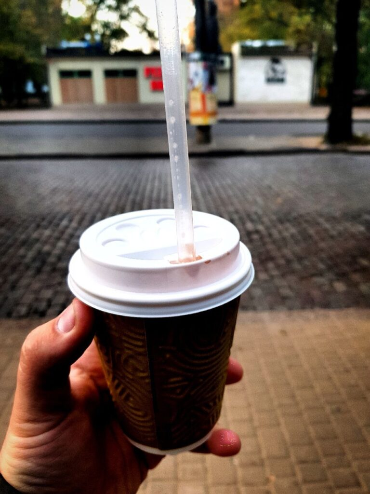
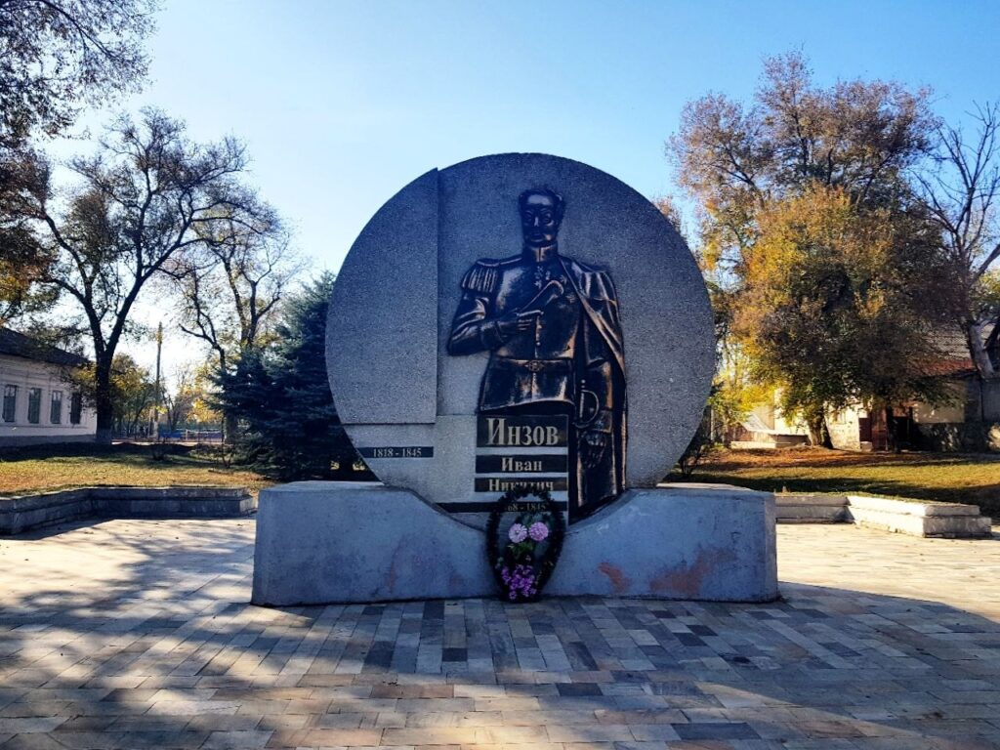
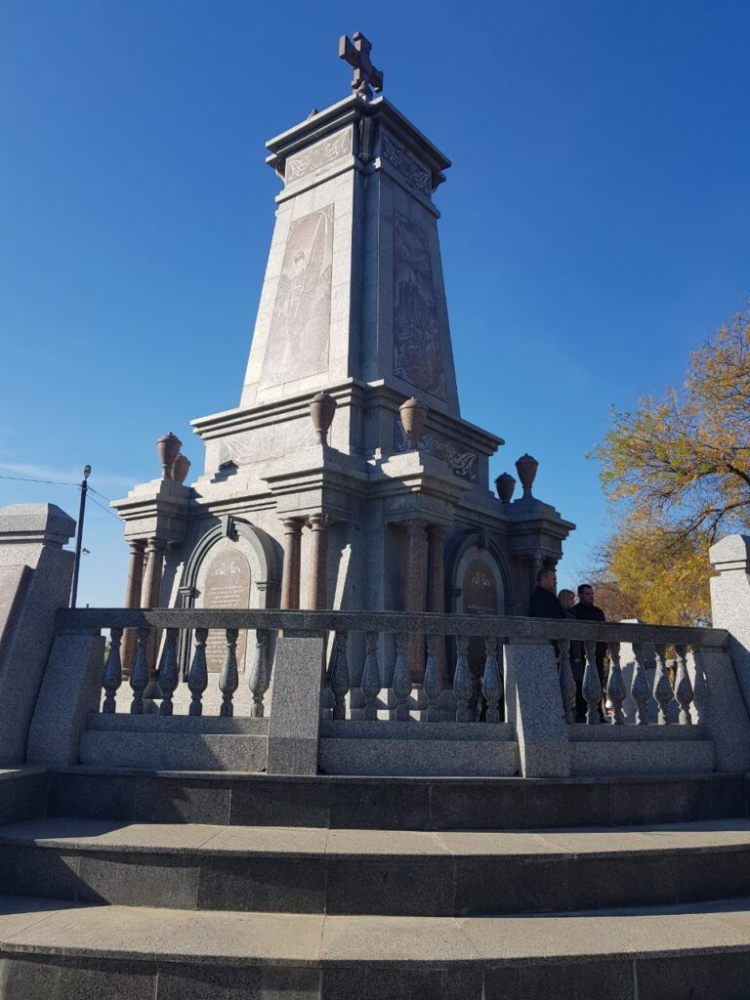
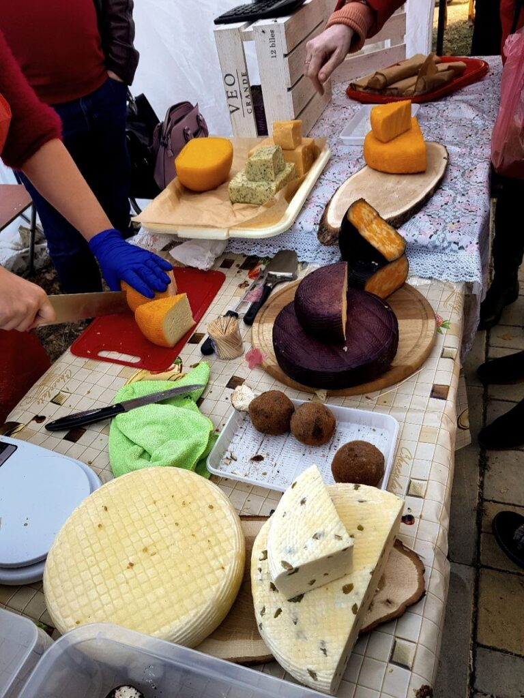
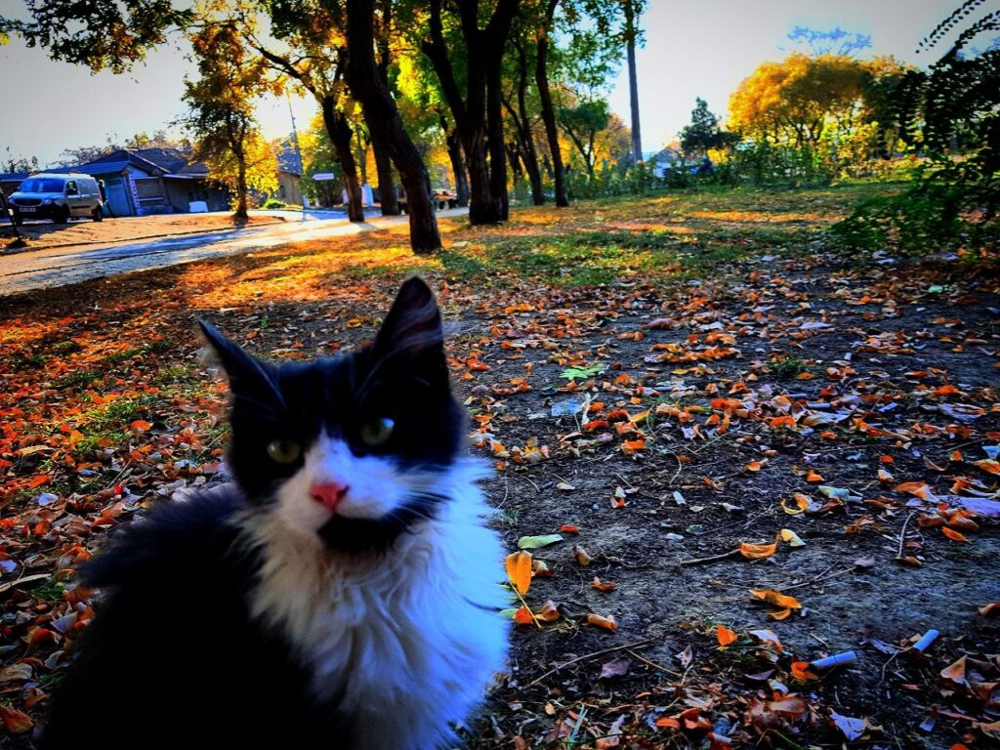
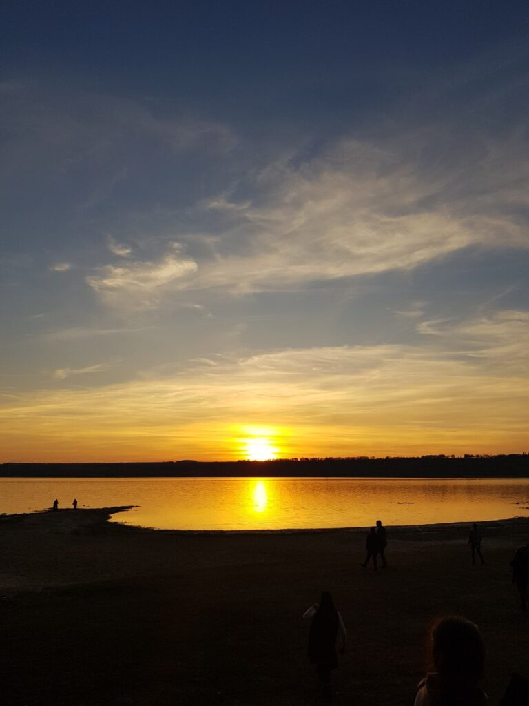
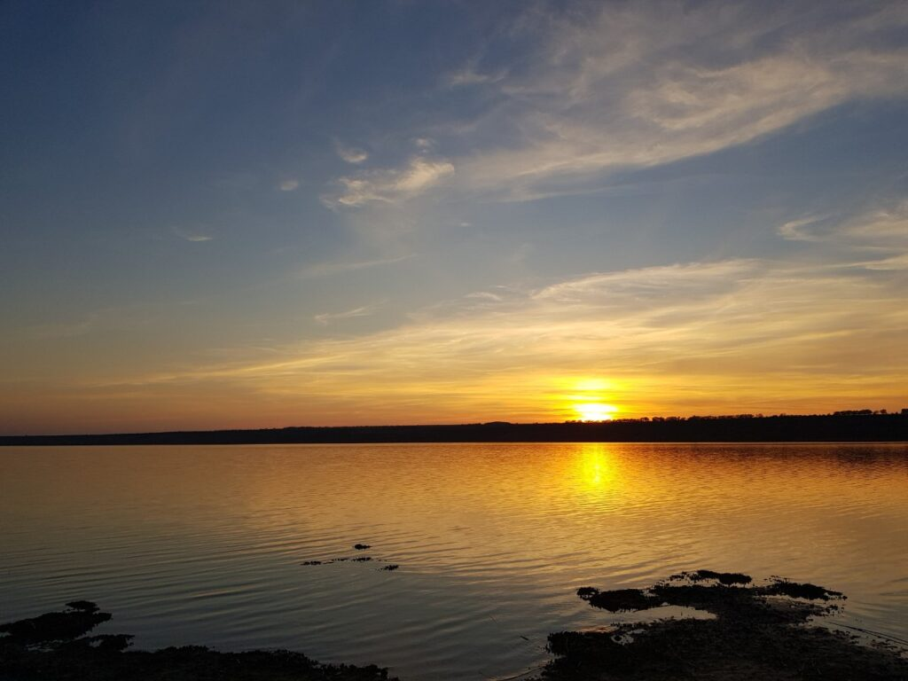
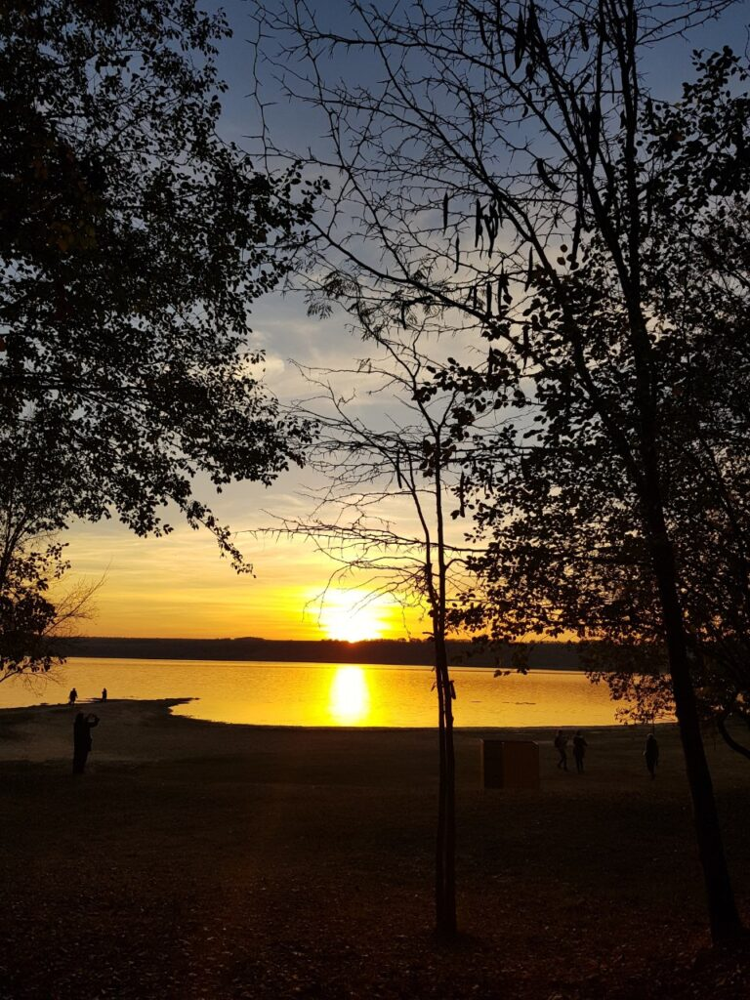

Cold November Odessa. A good friend decided to invite me to go to a small town in the south of our region - Bolgrad. It is logical to assume that, in tune with the name, many Bulgarians have lived there since ancient times.
"Why not?" - I thought and agreed. Who then knew that a wine festival would be held in Bolgrad!?

|                                                                                                                              |
| :--------------------------------------------------------------------------------------------------------------------------: |
|  |

|                                                                                 |                                                         |                                                                                                                   |
| :-----------------------------------------------------------------------------: | :-----------------------------------------------------: | :---------------------------------------------------------------------------------------------------------------: |
|                          |  |                                                            |
|  |  |  |
|                          |  |                                                            |

|                                                                                                                 |
| :-------------------------------------------------------------------------------------------------------------: |
|  |

|                                                                                              |                                                                                   |
| :------------------------------------------------------------------------------------------: | :-------------------------------------------------------------------------------: |
|  |  |

|                                                         |                                                                                               |                                                         |
| :-----------------------------------------------------: | :-------------------------------------------------------------------------------------------: | :-----------------------------------------------------: |
|  |  |  |

We tried many types of wine, including mulled wines, as well as different types of cheese, and having collected souvenirs, we went back home to our native Odessa.
