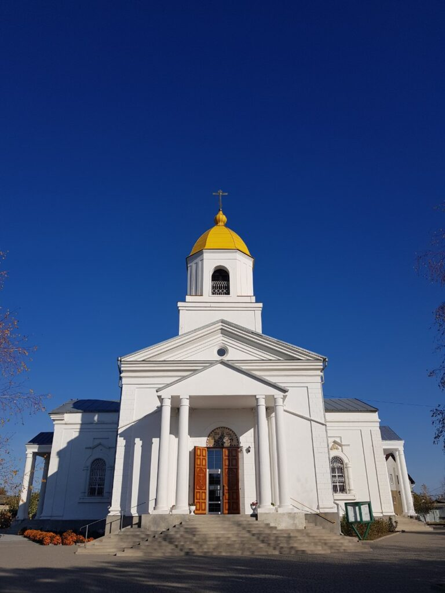
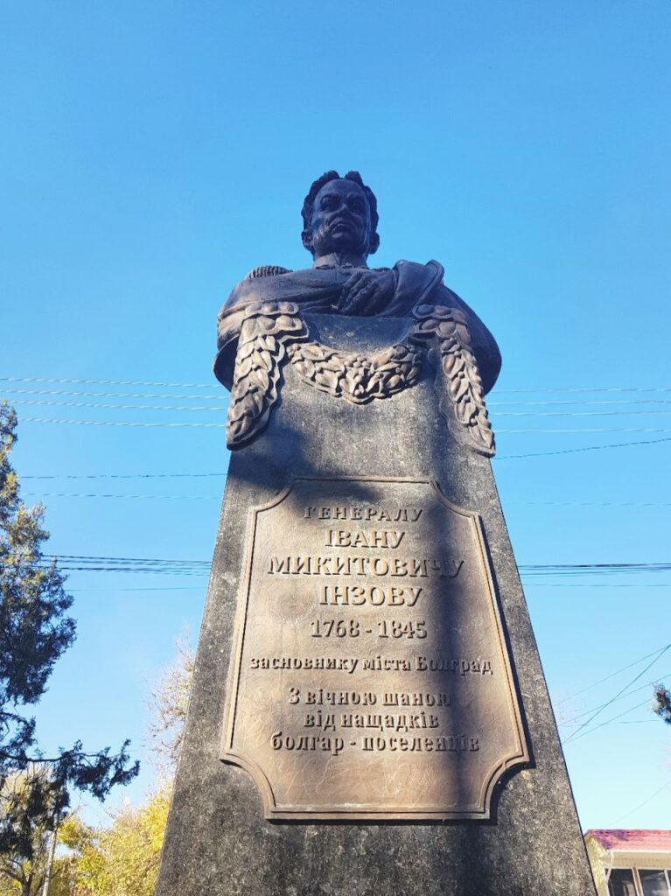
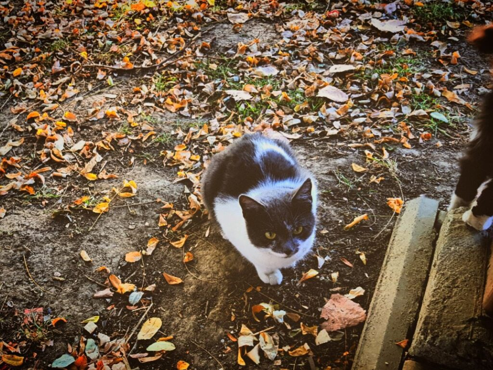

Холодна листопадова Одеса. Хороший друг вирішив запропонувати мені з'їздити в невелике місто на півдні нашої області – Болград. Логічно припустити, що співзвучно з назвою там із давніх-давен живе чимало болгар.
"Чому б і ні?" - подумав я і погодився. Хто ж тоді знав, що у Болграді проводитиметься винний фестиваль!?

| |
|:---:|
|  |

| | | |
|:---:|:---:|:---:|
|  |  |  |
|  |  |  |
|  |  |  |

| |
|:---:|
|  |

| | |
|:---:|:---:|
|  |  |

| | | |
|:---:|:---:|:---:|
|  |  |  |

Ми перепробували безліч видів вина, включаючи і глінтвейни, а також різних сортів сиру та набравши сувенірів – вирушили назад додому, до рідної Одеси.