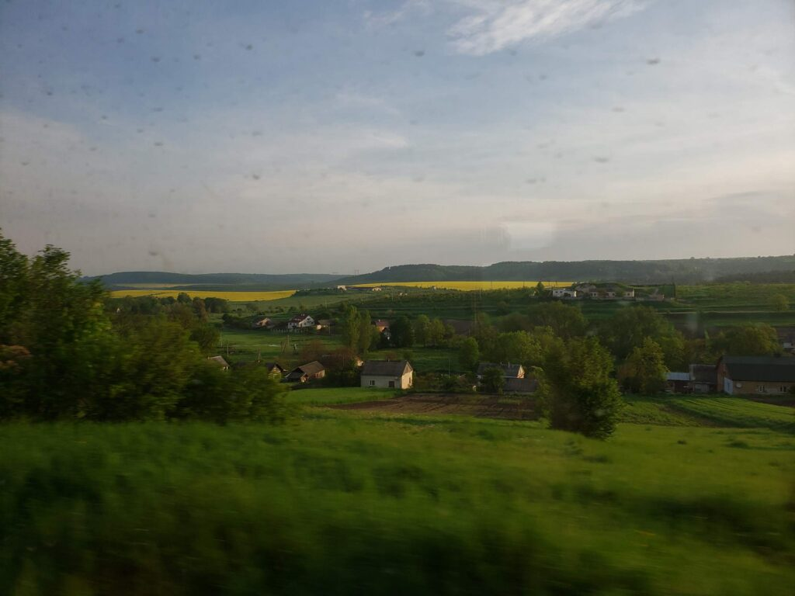
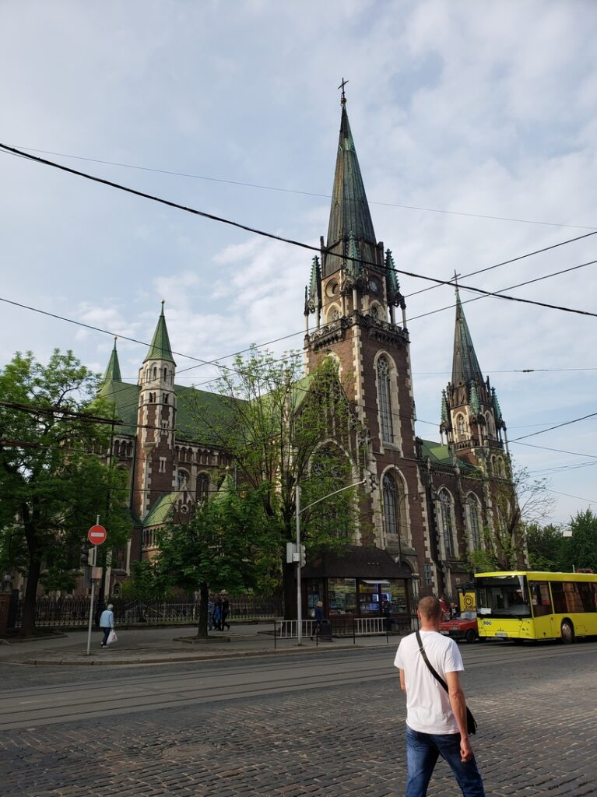
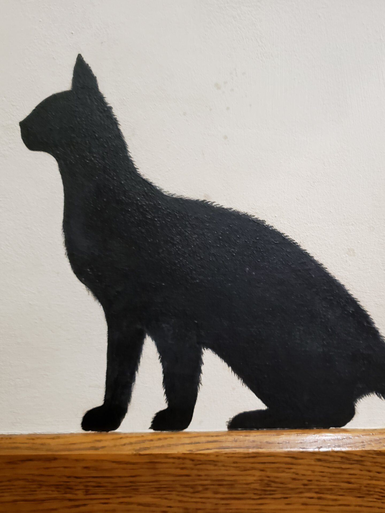
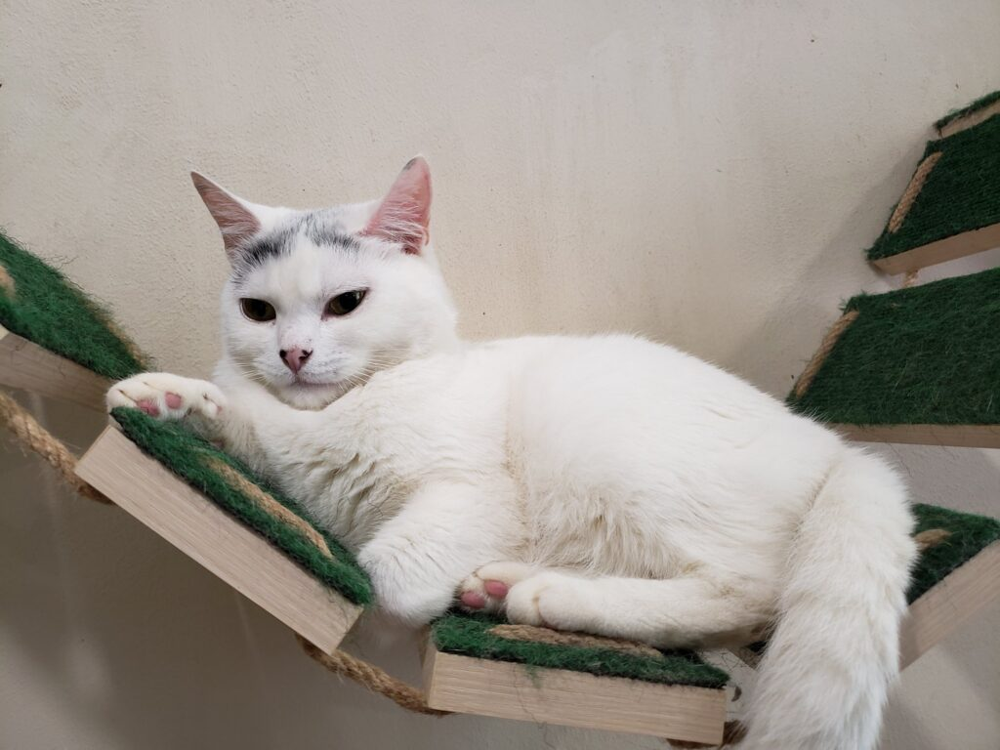
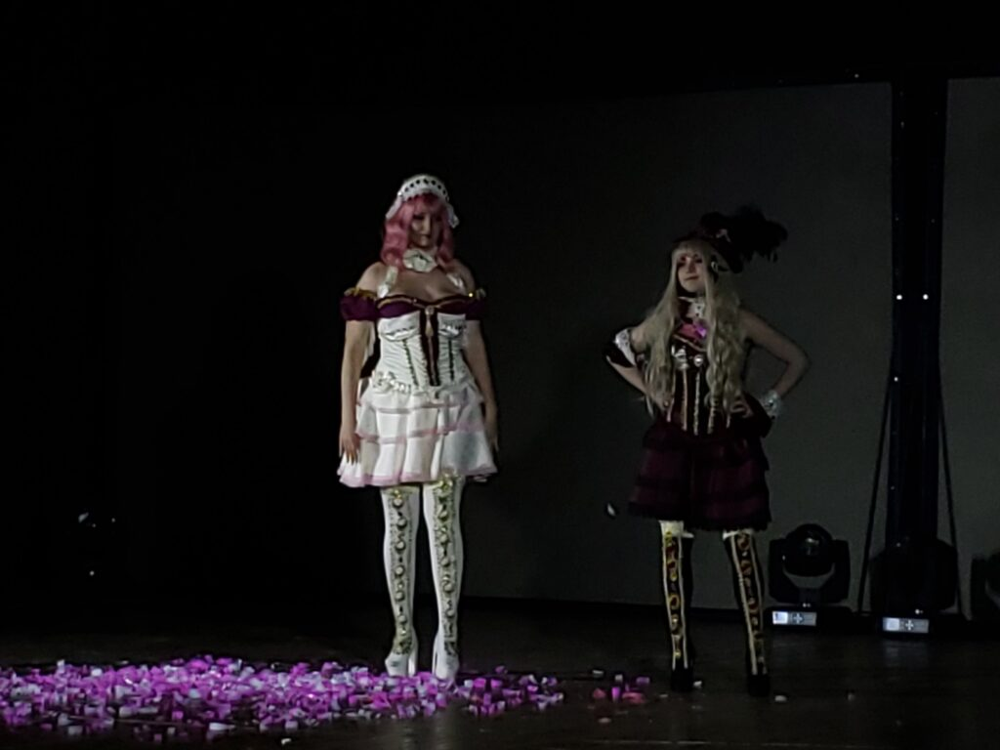
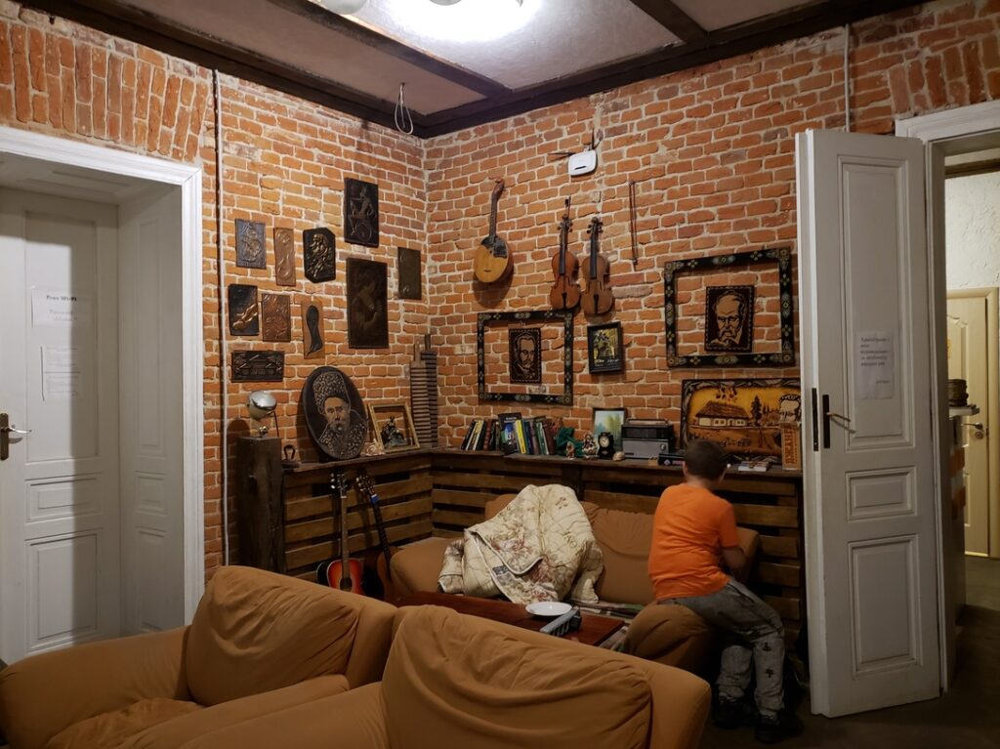
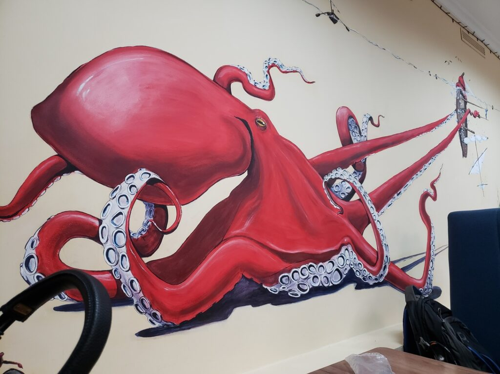

В мае 2019го года во Львове проводился аниме-фестиваль - Аникон, на коий я и отправился!

_2019.05.17_ Конбанва, миннаса^^
И снова Кацу отправляется в путь, да встретит меня Львов снова великодушно)

Как и обычно, "У черного Моря" звучит каждый раз, как в Одессу приходит новый тепловоз)

_2019.05.18_ Доброго утра, дорогие читатели)
Вот вам пару утренних фото из окна поезда)

|                                                         |                                                         |                                                         |
| :-----------------------------------------------------: | :-----------------------------------------------------: | :-----------------------------------------------------: |
|                |                |                |
|  |  |  |

Оделся я по летнему, по-одесски (у нас было до +30), но друг предупредил меня о Львовской коварности, так что я подготовился, взяв зонт и теплые вещи)

|                                           |                                                                                                                                                                                                                                                                                   |
| :---------------------------------------: | :-------------------------------------------------------------------------------------------------------------------------------------------------------------------------------------------------------------------------------------------------------------------------------: |
|  |  |

Львовская погода встретила Кацу со совсем радушием, ярко светит солнце, небольшие тучки и божественная прохлада, по сравнению с духотой Одессы это нереально классно.

|                                                           |                                                                                                            |
| :-------------------------------------------------------: | :--------------------------------------------------------------------------------------------------------: |
|      |  |
|  |

|                                                                                                    |                                                         |
| :------------------------------------------------------------------------------------------------: | :-----------------------------------------------------: |
|  |  |
|                                             |  |
|                                             |  |
|                                                         |

После фестиваля мы с моим другом Инквизитором отправились в Метро паб, где праздновали окончание феста. Аниме Клуб Мицуруки, насколько я понял, наибольшее аниме-сообщество Львова и этой части нашей страны. После паба местный друг, который везде меня водил отправился домой, а я продолжил малость гулять с оставшимися членами клуба)
И вот сейчас наконец Кацу в кроватке хостела и у него все хорошо)

|                                                                                                                   |                                           |
| :---------------------------------------------------------------------------------------------------------------: | :---------------------------------------: |
|  |  |

Аникон, в отличии от одесских и киевских, был однодневным фестивалем, так что на второй день мы просто гуляли, развлекались и набрели на магазинчик настольных игр, в котором так же можно просто сесть и поиграть.

|                                           |                                           |                                           |
| :---------------------------------------: | :---------------------------------------: | :---------------------------------------: |
|  |  |  |

Наигравшись в Битвы Героев, я решил купить их себе, но в наличии не оказалось
Так что в итоге я обрел Звездные Империи с точь-в-точь такой же механикой, но другим сеттингом

В пути домой на ночном экспрессе я до 3 часов ночи играл в неё с попутчиком, а его девушка ворчала и говорила идти спать, мхх.
