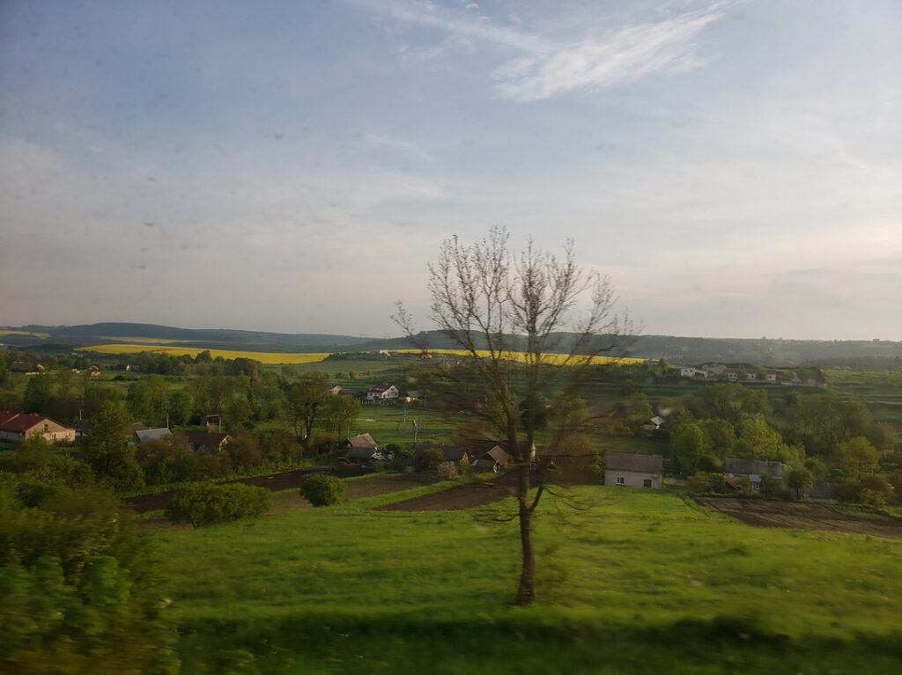
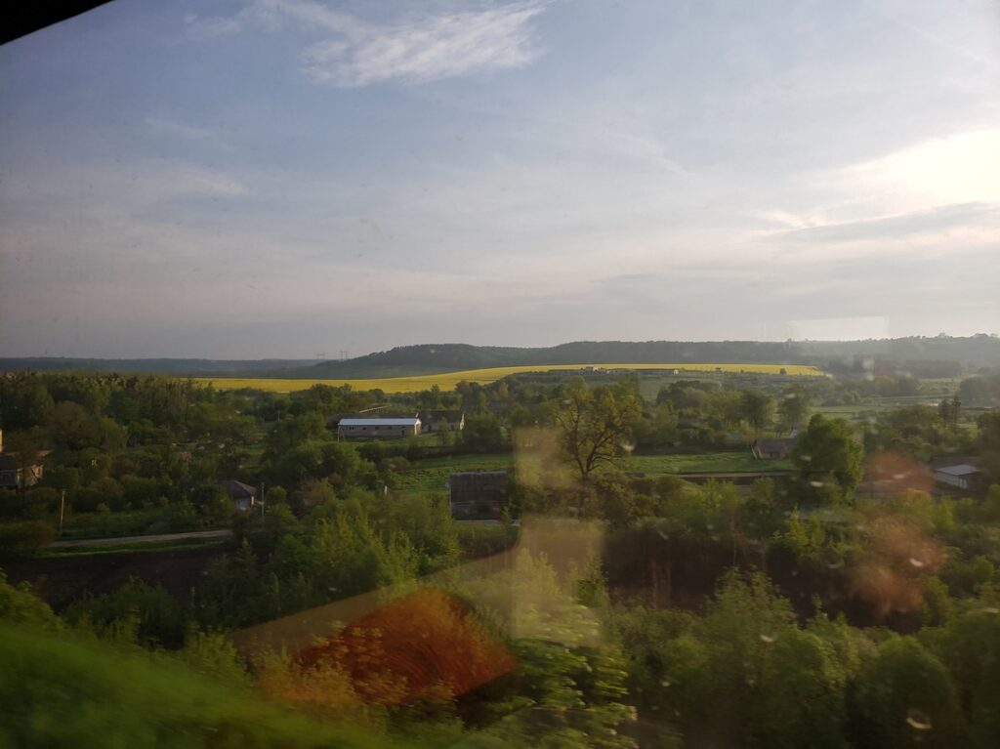
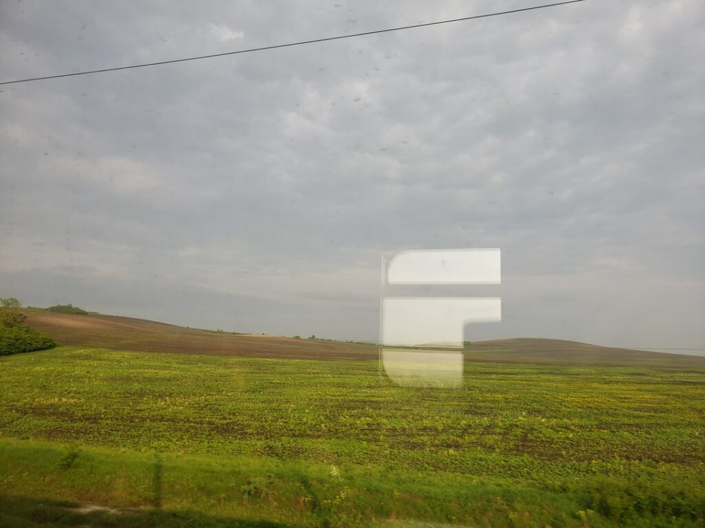
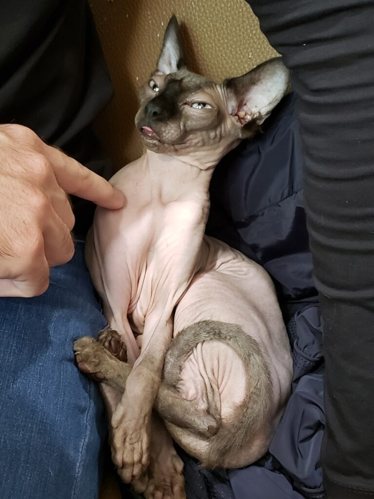
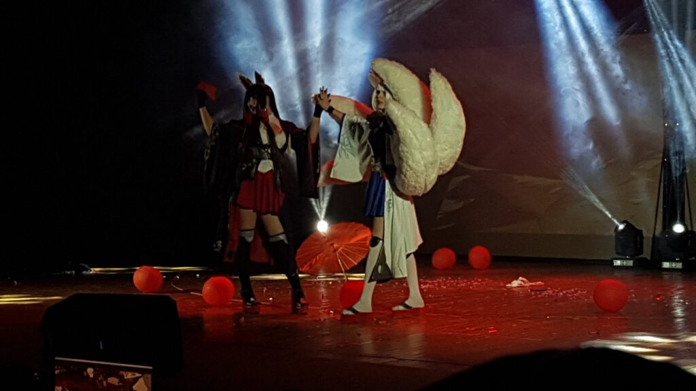
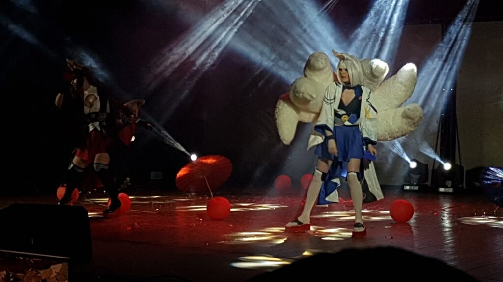
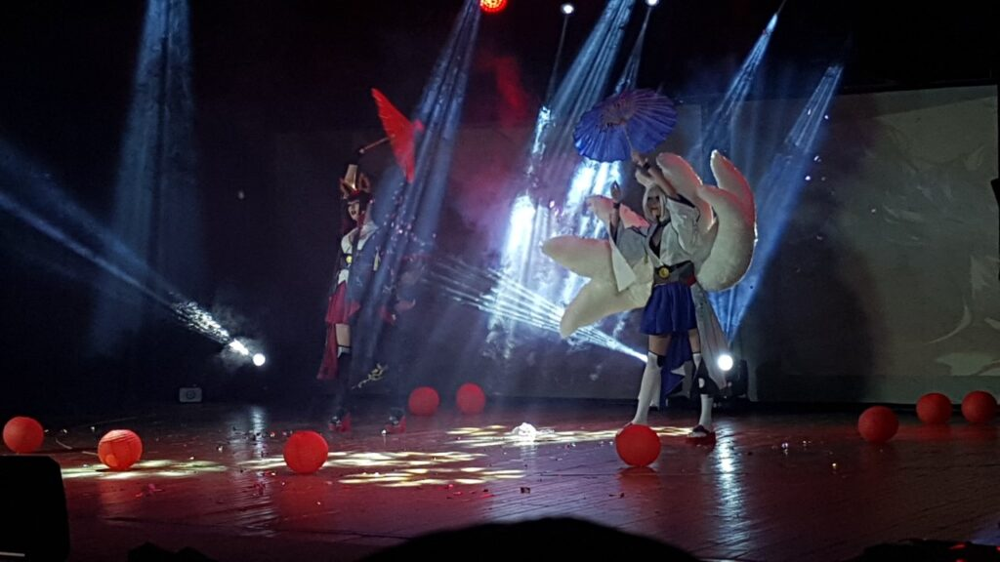
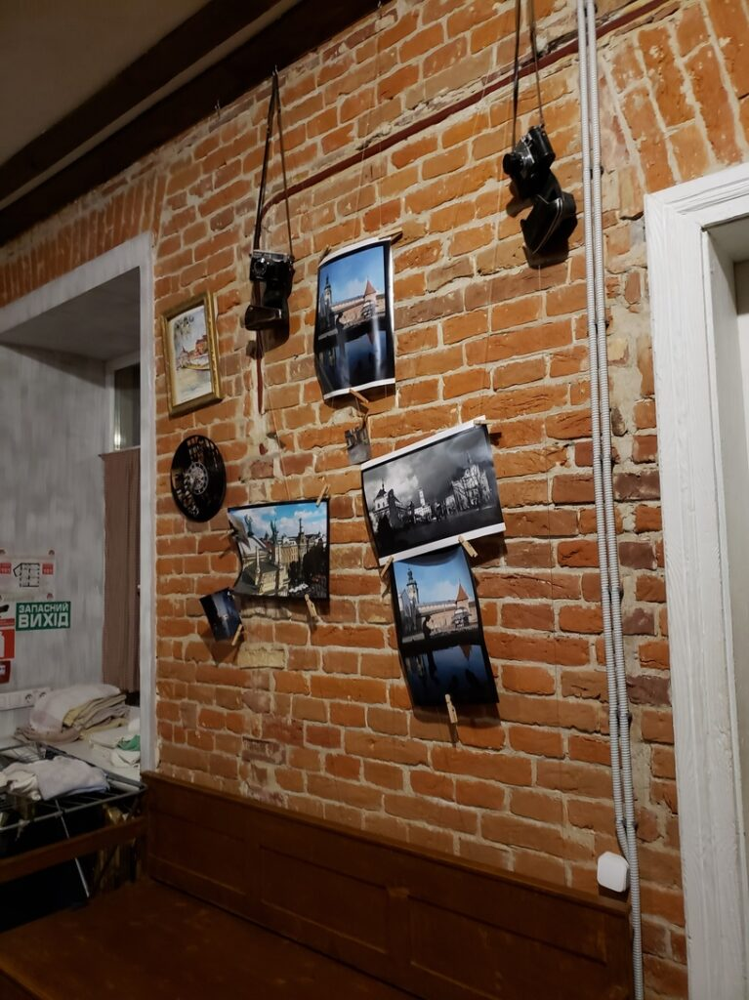

In May 2019, an anime festival was held in Lviv - Anikon, to which I went!

_2019.05.17_ Konbanwa, Minnasa^^
And again Katsu sets off, may Lvov meet me generously again)

As usual, "By the Black Sea" sounds every time a new diesel locomotive arrives in Odessa)

_2019.05.18_ Good morning, dear readers)
Here are a couple of morning photos from the train window)

| | | |
|:--:|:--:|:--:|
|  |  |  |
|  |  |  |

I dressed in summer, in Odessa style (we had up to +30), but a friend warned me about Lviv's insidiousness, so I got ready, taking an umbrella and warm clothes)

| | |
|:--:|:--:|
| |  |

Lviv weather met Katsu with absolutely cordiality, the sun is shining brightly, small clouds and divine coolness, compared to the closeness of Odessa, this is unrealistically cool.

| | |
|:--:|:--:|
|  |  |
|  |

| | |
|:--:|:--:|
|  |  |
|  |  |
|  |  |
|  |

After the festival, my friend the Inquisitor and I went to the Metro Pub, where we celebrated the end of the fest. Anime Club Mitsuruki, as far as I understand, is the largest anime community in Lviv and this part of our country. After the pub, a local friend who took me everywhere went home, and I continued to walk a little with the remaining members of the club)
And now, finally, Katsu is in the hostel bed and he is doing well)

|||
|:--:|:--:|
|  |  |

Anikon, unlike Odessa and Kiev, was a one-day festival, so on the second day we just walked around, had fun and came across a board game store, where you can also just sit down and play.

| | | |
|:--:|:--:|:--:|
|  |  |  |

After playing Hero Battles enough, I decided to buy them for myself, but they weren't available
So in the end I got Star Empires with exactly the same mechanics, but a different setting.

On the way home on the night express, I played it with a fellow traveler until 3am, and his girlfriend grumbled and told me to go to bed, mhh.