После, как я тогда думал, нелегкого контракта я хотел отдохнуть и развеяться, так что мы с друзьями договорились поехать в Ужгород, посмотреть на цветение повсеместных там сакур.

Так как мне из Одессы ехать было куда дальше, чем друзьям из Киева и Львова, то я приехал на сутки раньше и забронировал трехместную комнату в классном хостеле прямо в центре города.
Впрочем, Ужгород довольно маленький город, так что весь город - как центр Одессы)

Далее передаю слово корреспонденту Кацу прямо с места событий в апреле 2021го года:

_2021.04.22 21:30_ Кацу уже в поезде, что через 15 минут будет выезжать в сторону Ужгорода, чтобы смотреть на цветение сакур) Ожидайте отчета)

**UPD:** Мне попались очень интересные попутчики, семья мастеров татуажа, с кучей вкусной еды и интересными историями по жизни)

|     |     |     |
|:---:|:---:|:---:|
|  |  |  |
|  |  | 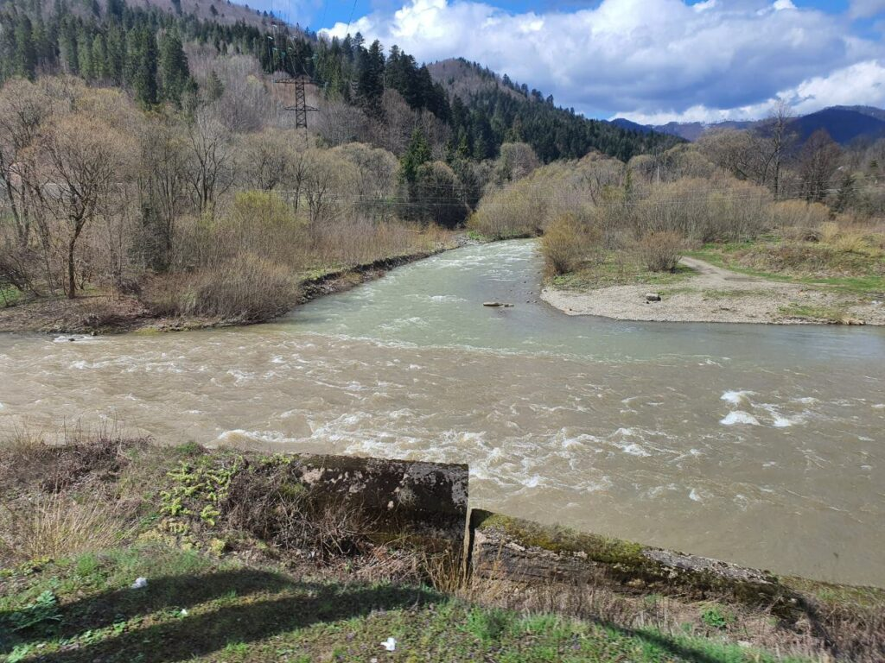 |
| 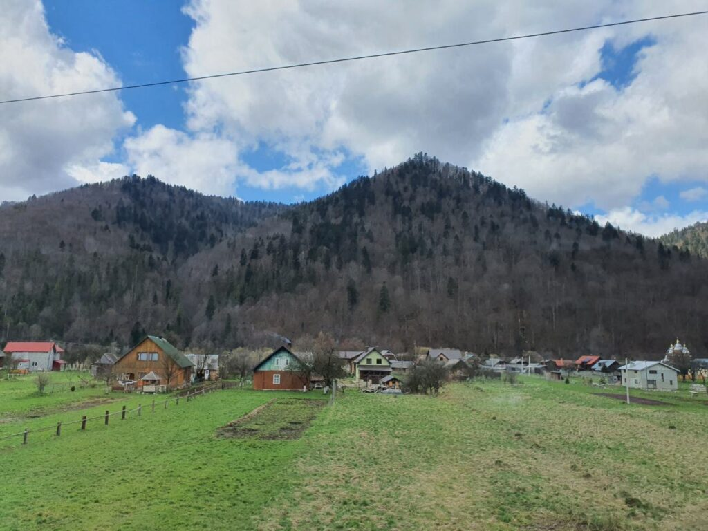 |  | 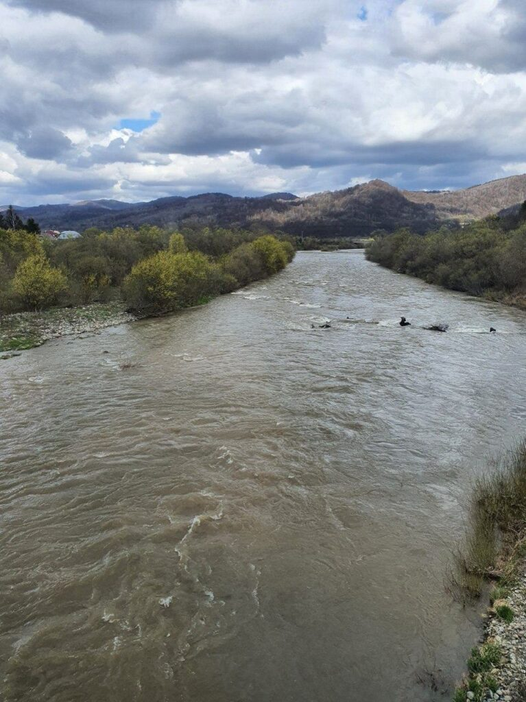 |

|     |     |
|:---:|:---:|
|  |  |

|     |     |     |
|:---:|:---:|:---:|
|  | 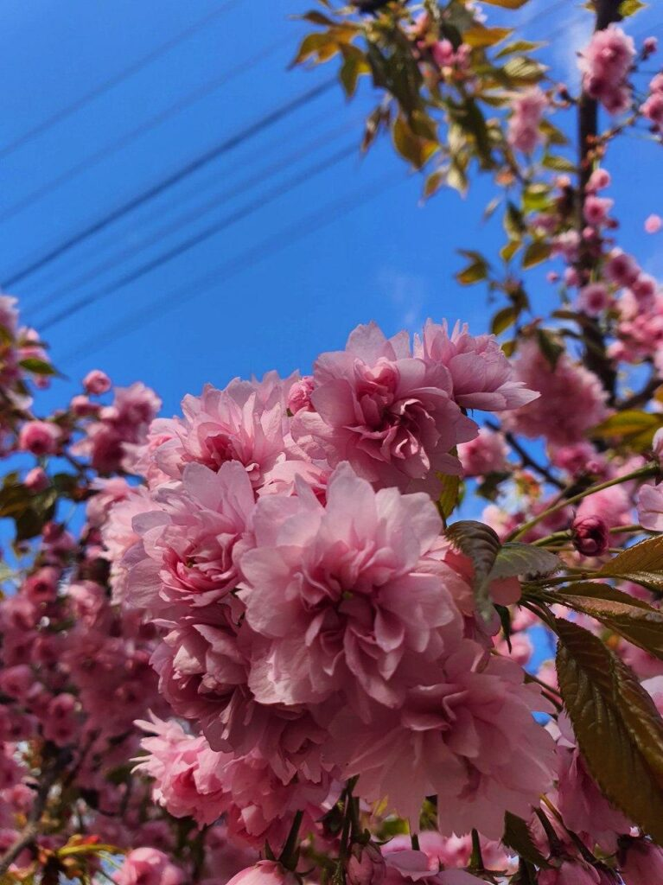 |  |
|  | 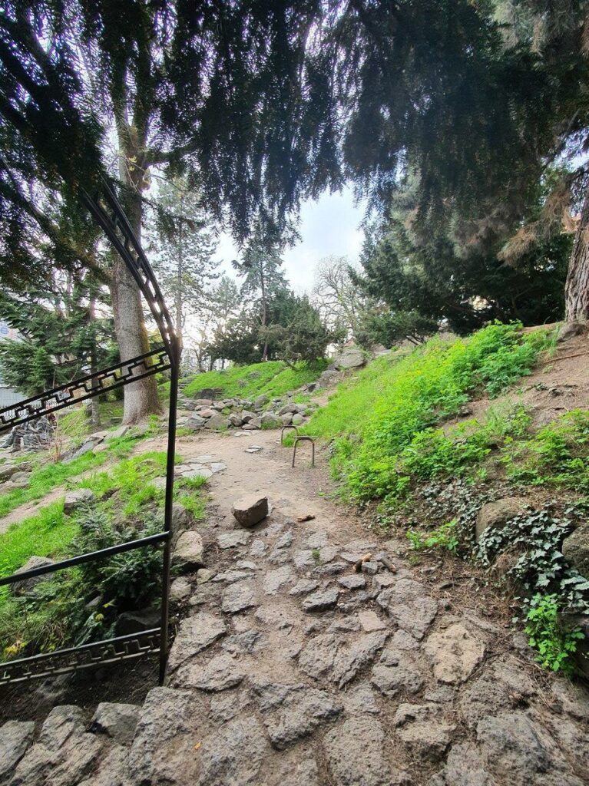 | 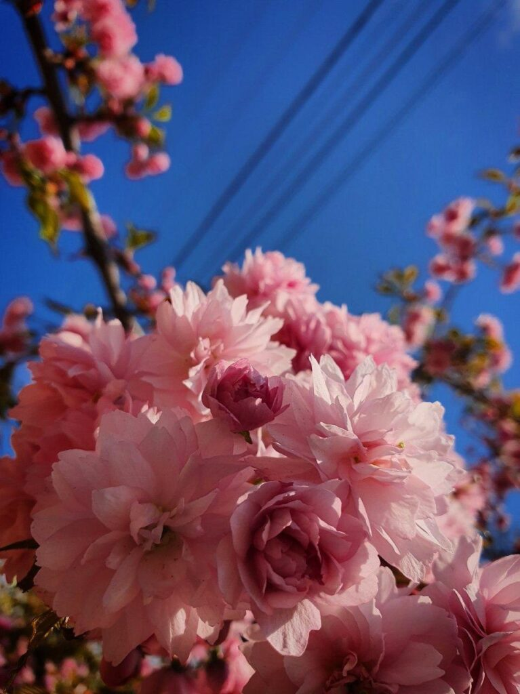 |
|  |  |  |

Фотографий не осталось, но после того как я встретил товарищей с их поезда, мы стали искать где покушать. Рестораном с лучшими отзывами в городе оказалась будка, где готовят бургеры и... Ни один из хвалебных отзывов не врал! Это были лучшие, после австрийских, бургеры, из всех - что я когда-либо пробовал)

|     |     |     |
|:---:|:---:|:---:|
|  | 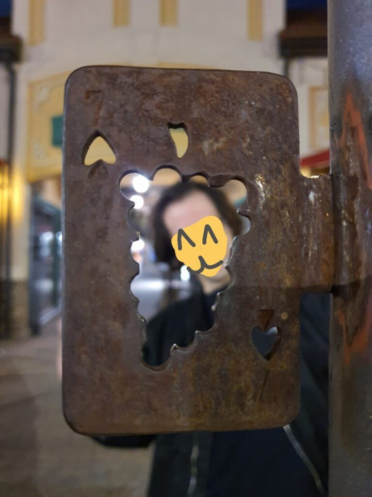 | 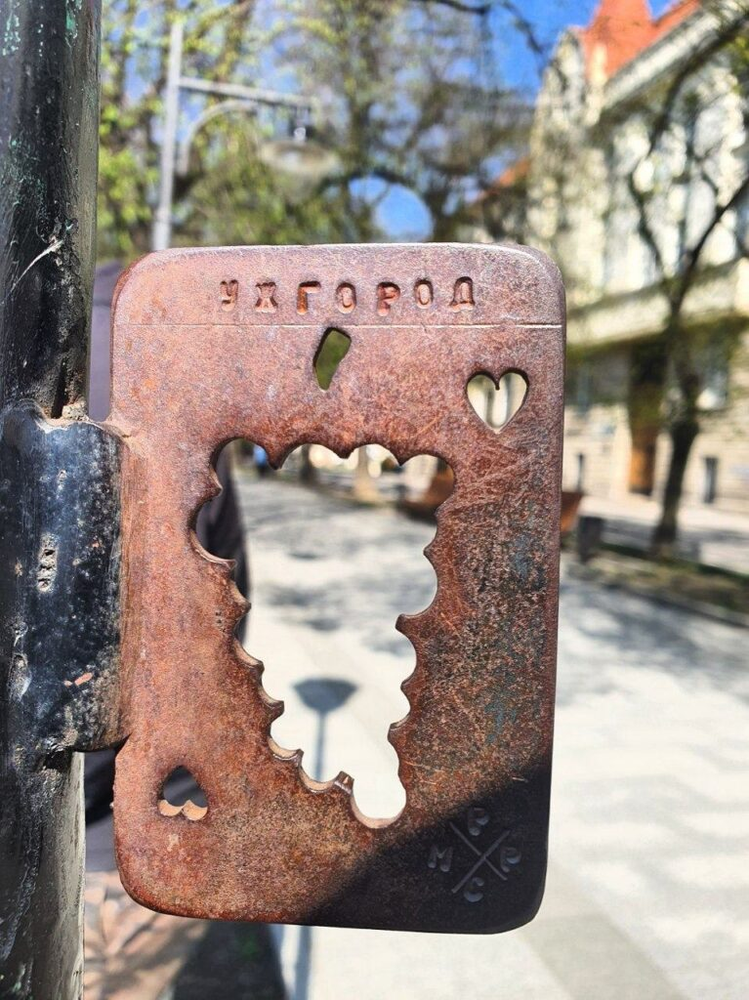 |
|  |  |  |
| 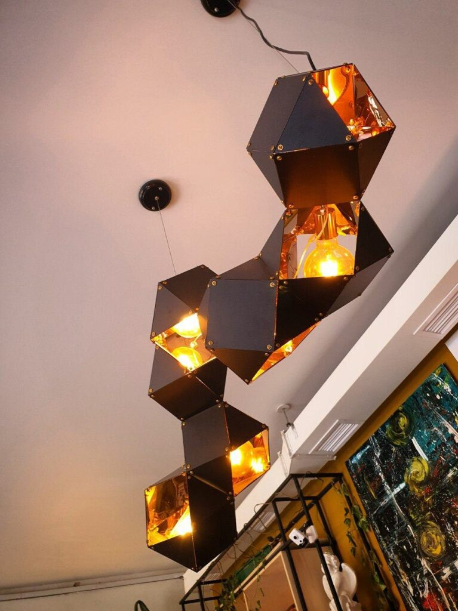 |  | 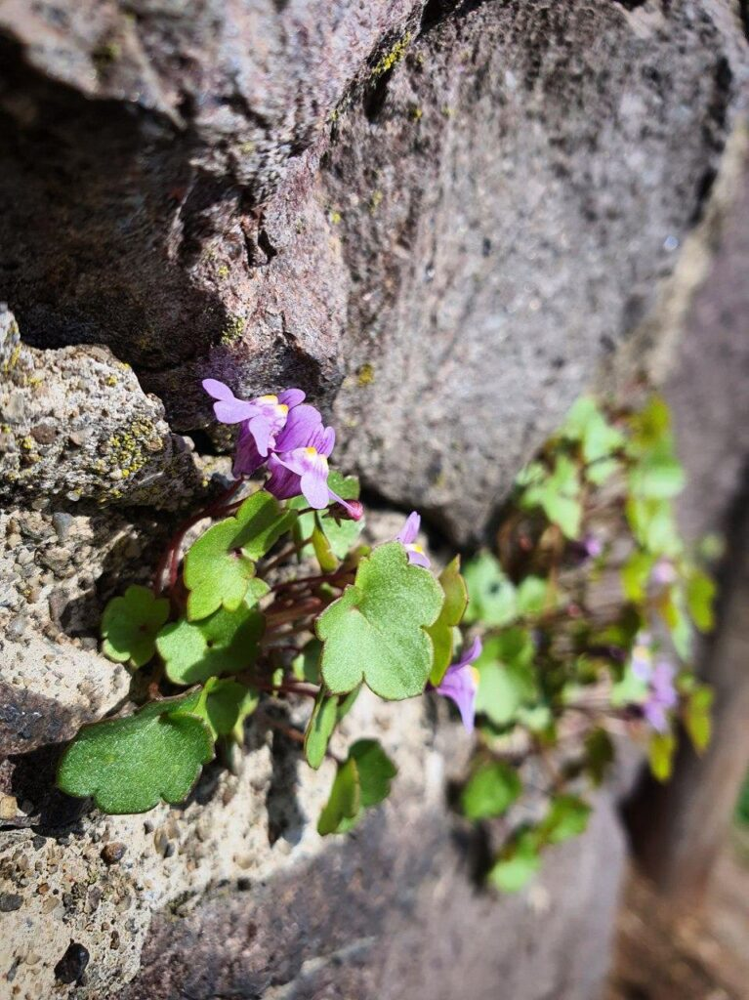 |
|  |  |  |
|  |  |  |
| 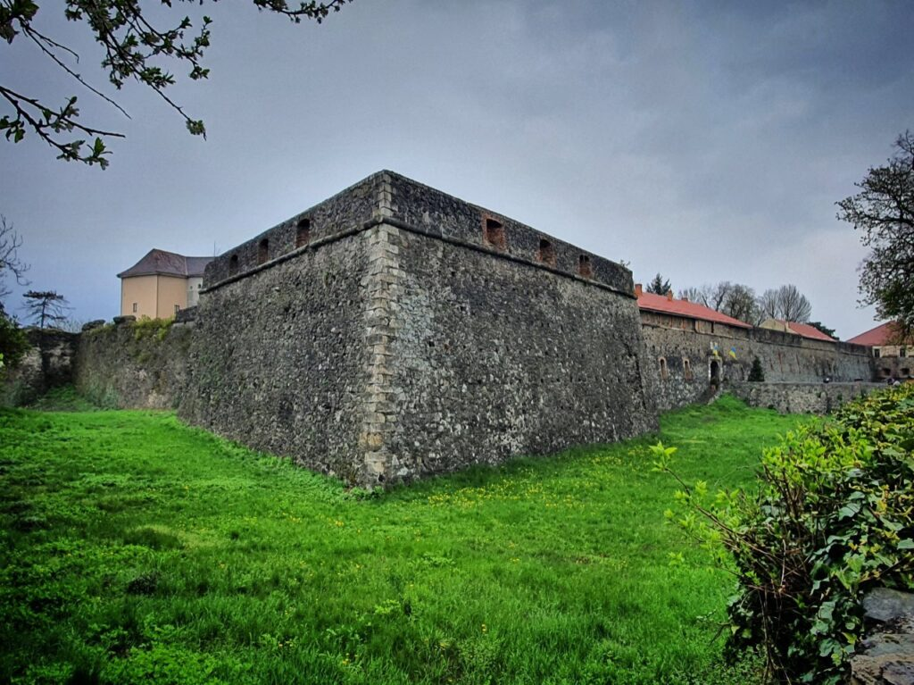 |  |  |

Кацу тронулся в сторону Одессы! ^^ Как же я обожаю поезда! ^^
Это один из лучших видов транспорта для аутентичности)

Вот так прекрасно прошел мой уикенд в весеннем Ужгороде)

Люблю вас ❤️
Все будет Кацу! 🦊
