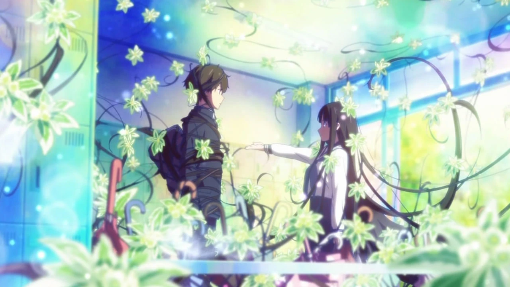
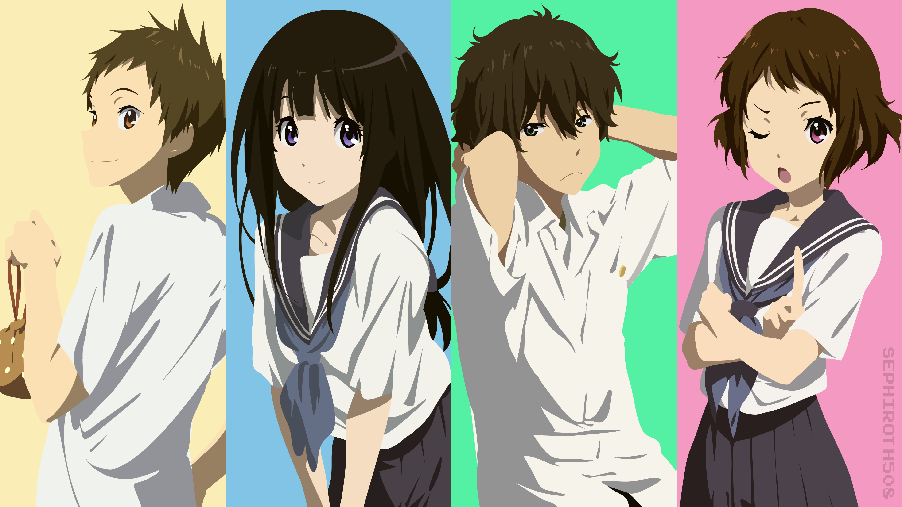
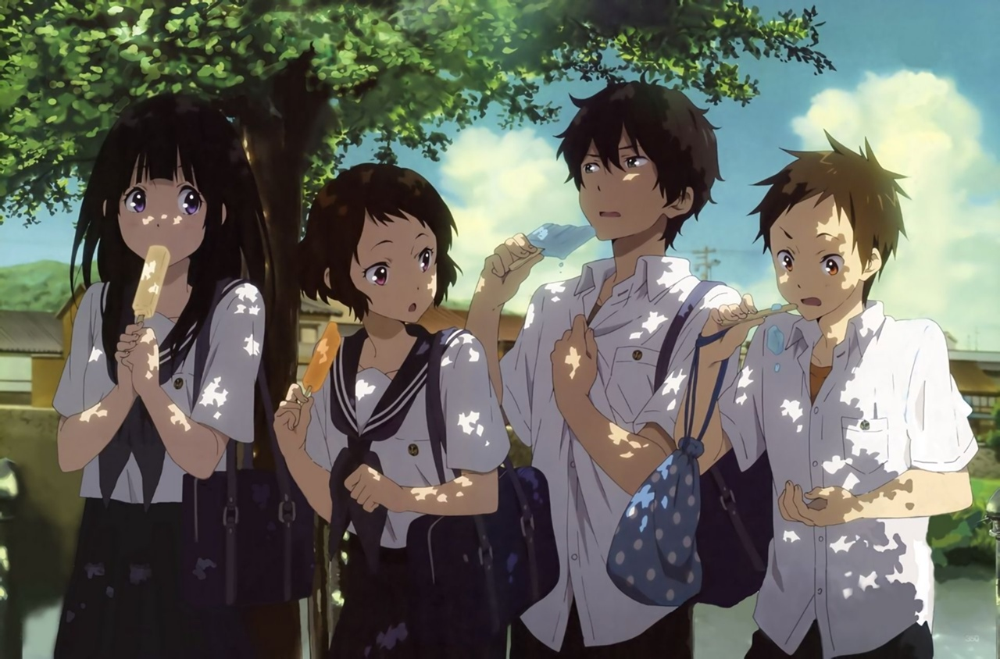
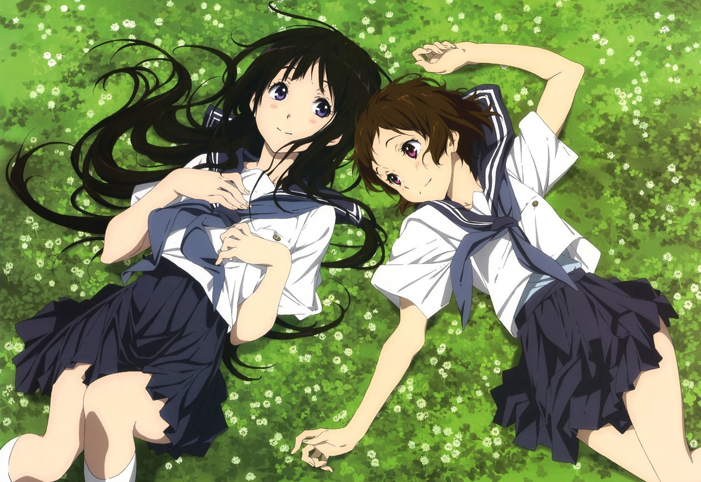

Недавно я стал пересматривать некоторые относительно старые аниме, и случай вспомнил классное аниме - Хёука.

Сюжет повествует о ленивом парне, который “не станет делать что можно не делать, а если надо что-то сделать - то сделает это по быстрому” - Ореки Хотару и очень необычной девушке из местного древнего рода - Читанде Эру.

Её волшебная фраза “Я хочу знать!” и обворожительные фиолетовые глаза заставляют нашего главного героя включать свои детективные способности и разгадывать мелкие школьные загадки одну за другой.

В конце концов они, конечно же, влюбляются друг в друга.

Как для 2012го года в этом аниме просто невероятная рисовка, которая даст фору современным сериалам. Особенно рисовка персонажей. Да и сами персонажи получились очень живыми.

Поначалу я даже хотел дропнуть - но не смог, хотя в последнее время дропнул очень много сериалов. А это что-то значит)

Советую обратить вам на него внимание)

%%%3
  
  
  
  
  
  
%%%
