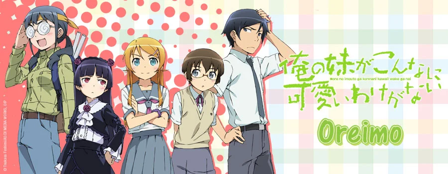

%%%1

%%%

Позволю себе продолжить свою серию небольших аниме обзоров)

За пару дней до Хёуки я пересмотрел еще один сериал 10-летней давности - OreImo или же “Ну не может моя сестрёнка быть такой милой”.

Этот сериал занял в два сезона, и это еще одна звезда школьных романтик своего времени.

В перых кадрах мы видим взаимоотношения брата и сестры, которая вовсе не считает его за человека. При этом Кирино, в отличии от своего посредственного брата - отличница, модель, спортсменка и просто красавица!

В один день она открывает брату свой секрет - она увлекается аниме, мангой и играми (включая эроге), что очень не приветствуется их отцом тяжелых нравов, а так же подругами девушки.

После этого Кёске, её брат, не единожды помогает ей скрывать хобби и в других делах, а так же - найти новых друзей.

И только к концу второго сезона мы начинаем понимать, почему произошел раскол в их отношениях в детстве. За время аниме посредственный Кёске умудряется побывать в отношениях дважды, а признаются ему и того чаще, но в итоге он понимает, кем на самом деле занято его сердце.

Аниме довольно милое, но скорее подойдет для ностальгии по тайтлам начала десятых, чем для просмотра с нуля.

%%%1

%%%
