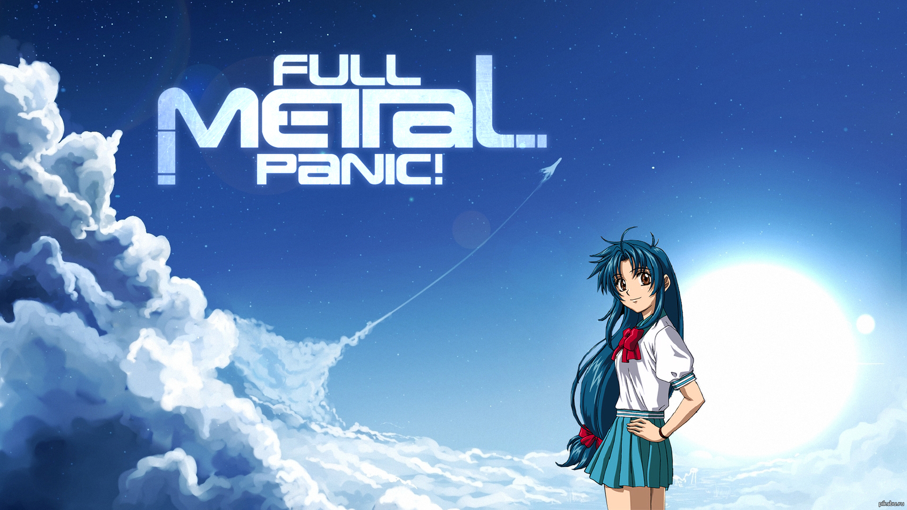
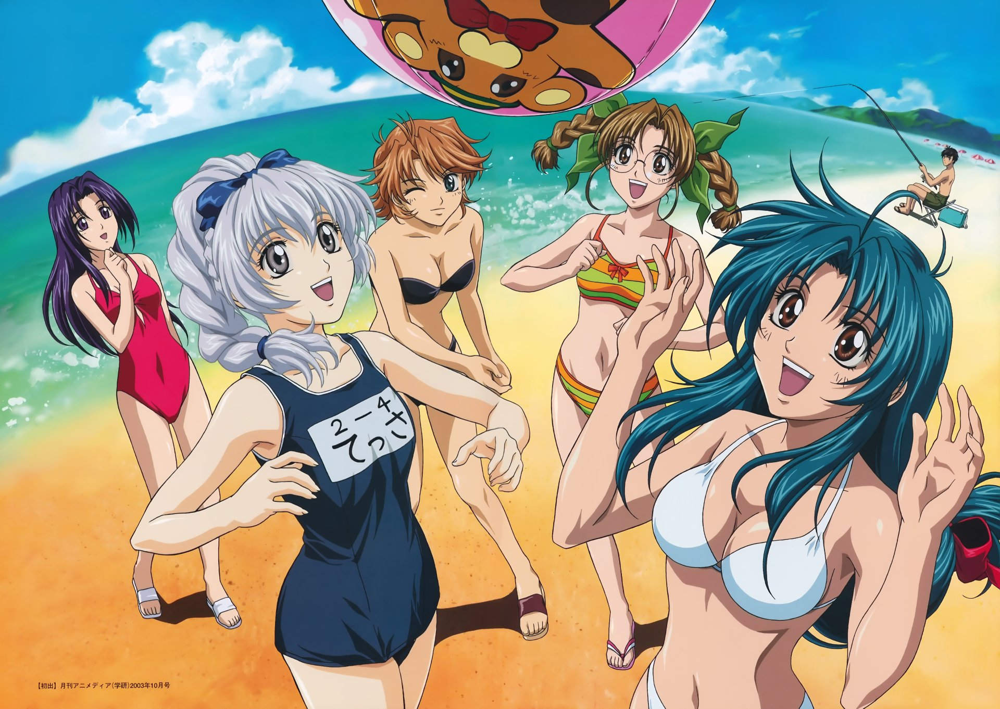

%%%1
  
%%%

Fullmetal Panic - is a classic meha anime from the early 2000s.

The series follows Sagara Sousuke, a young soldier who has been on the front lines almost since birth. He is an expert in his field but completely lacks the ability to live a normal life. His mission becomes to enroll in school and protect one of the girls who has supernatural abilities. Chidori Kaname is the second most prominent character. "She's a student, a member of the communist youth organization, an athlete. Finally, she's just a beauty!" - that's all about her.

The anime features giant robots, schoolgirls connected to the mystical "internet", and a UN army equipped with state-of-the-art technology, beating up all the villains and spies in the local equivalents of the US and the USSR, as well as terrorist organizations.

The old animation doesn't spoil the impression, and is actually quite appropriate, and the humor is quite typical for anime. At the same time, there's no modern "fanservice", and the characters are pleasantly proportioned.

I recommend watching it; there are four seasons available, with the first having 24 episodes and the other three with 12 episodes each. The seasons were released in 2002, 2003, 2005, and 2018, so the last season will show you what has changed over the years.

%%%3
  
  
  
  
  
  
%%%
