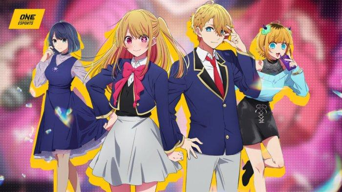
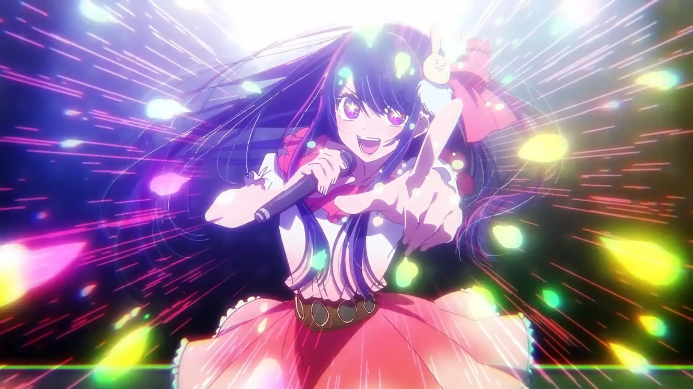

%%%1

%%%

Данное произведение повествует превратности жизни в современном японском шоу-бизнесе. Небрежно назвать его просто "аниме" или "тайтл" у меня не поднимется рука. И оно выделяется из современного аниме по многим факторам.

Первый и самый заметный с самого начала - структура произведения. Первый эпизод представляет собой полуторачасовой фильм - предысторию к последующим десяти эпизодам. Его даже можно посмотреть отдельно, как полнометражный фильм.

Далее - сюжет. Было немало аниме про айдолов, из нашумевших - Idolmaster или Love Live, но в Oshi no Ko показана изнанка шоу-бизнеса с кулуарными договорами, подставами и травлей, а не идеалы в вакууме.

Третье - персонажи тут по настоящему живые и... не типичные? К ним сложно навешать один из привычных ярлыков (цундере, кодере и тд). При этом каждый из основных персонажей понемногу раскрывается, давая понять мотивации и переживания героев и героинь.

Рисовка - она меняется от сцены к сцене. Иногда, где это не важно, персонажей рисуют привычно паршиво, но в самых важных сценах кадр аж светится. Особенно это произведение примечательно необычной рисовкой глаз, которая как раз проявляется в эмоциональных сценах сильных переживаний.

Опенинг - по началу, еще до просмотра аниме он мне не нравился, но с каждым эпизодом, проникаясь любовью к этому произведению он тоже стал по своему близок мне. Исполнила его YOASOBI - одна из моих самых любимых японских исполнительниц. Видео я скину в комментариях к посту.

Я очень долго откладывал просмотр, ведь мне не нравятся вещи, которые на хайпе, но это первое аниме за последние годы, от которого я не хотел отвернутся ни на секунду и смотрел с упоением. И это будет самый ожидаемый второй сезон для меня.

Дальше будет скрытая часть под спойлером, для тех - кто уже смешарик.

Судьба Ай Хошино меня сильно поразила. Поначалу, в первой серии я проникся симпатией и сопереживанием к ней, как, думаю, и многие. Яркая, сверкающая певица, которую обожают все. Я совсем не задумывался о том, как она себя вела и многих странностях, которые стали заметны лишь в ходе расследования Аквы - её сына, и собственного расследования Аканэ Курокавы (партнерши Аквы в реалити шоу), которая хотела вжиться в роль.

Бедная маленькая сирота, которая не знала любви и жила во лжи, надеясь, что эта ложь однажды станет правдой. Она и правда вложила всю себя без остатка.

Некоторые писали, что Ай не успела раскрыться как персонаж... Но думаю, что просто смотрев на нее - мы бы тоже видели лишь яркую, красивую, но ложную обертку, как раз таки не понимая истинных переживаний девушки.

Да, аниме не лишено мистики, ведь дети Ай - переродившиеся фанаты, любившие её всем сердцем до глубины души, но ведь на этой маленькой детали оно и основано)

Первый сезон аниме заканчивается довольно логично - первым концертом и успехом для молодого поколения группы B-Komachi, однако последняя серия обрезается будто на середине и подвешивает все в воздухе, что оставляет легкое неприятное послевкусие и желание срочного выхода продолжения.

Не знаю что еще написать, но учитывая, что эмоции заставили меня написать уже столько - показывают насколько оно стоит того - посмотреть это произведение.

%%%3

%%%

%%%2
@{h-70}
@{h-70}

Anime Opening

Official Music Video

%%%
