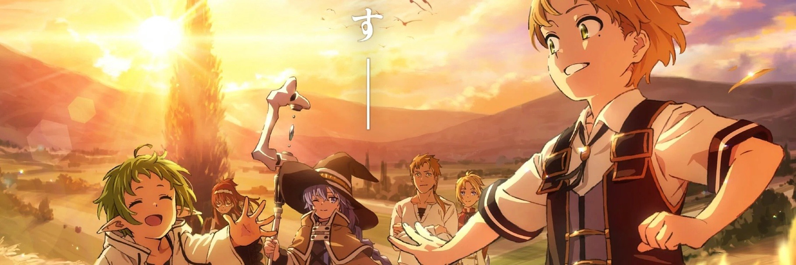
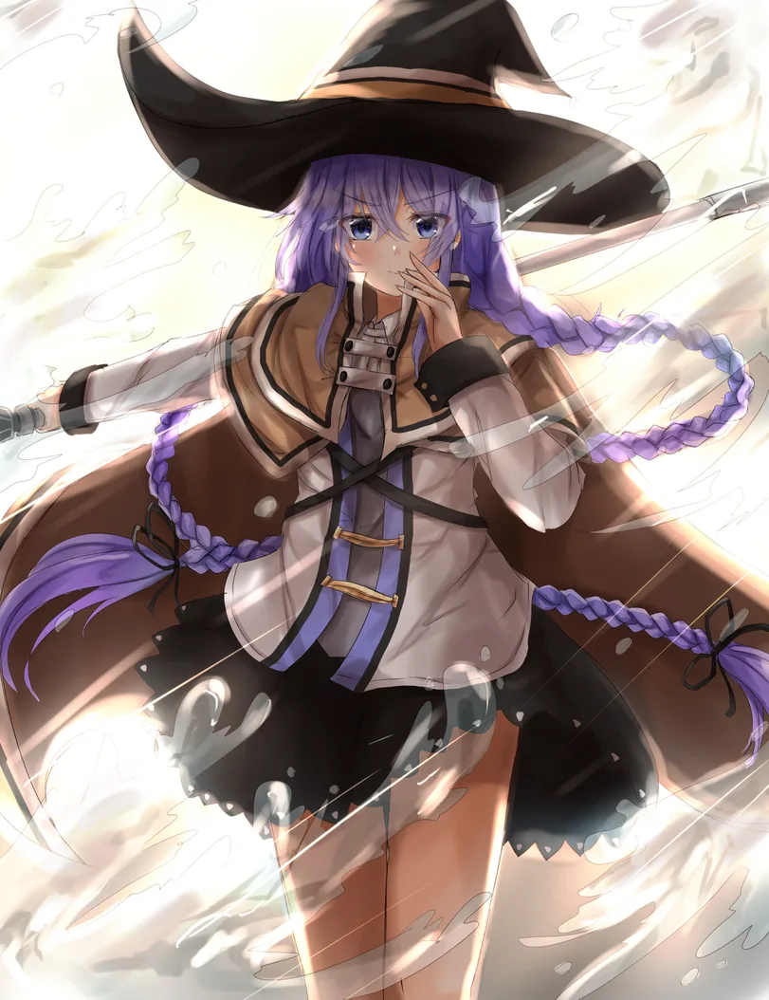
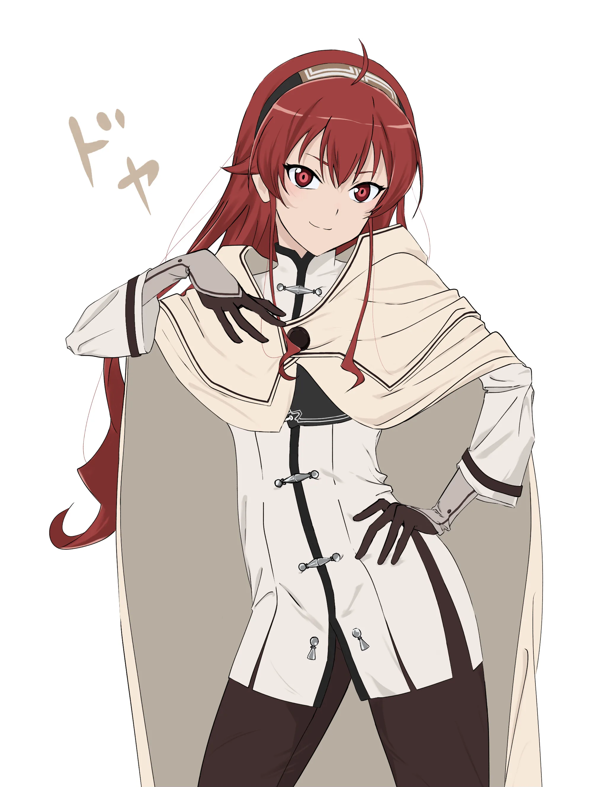

%%%1

%%%

  
[Пост](https://t.me/katsu_diary/1440) з мого каналу

  Реінкарнація безробітного - це один з трьох ісекаїв, які мені дуже сильно сподобалися ще задовго до виходу аніме. І на відміну від "Мого перетворення на слиз" або "Так, я павук і що ж", МТ (Mushoku Tensei) якимось чином живіше? Так, хоч герой і все такий же імбовий персонаж, але це пояснюється його тренуваннями, а не просто тим, що йому пощастило.

  Я перечитував ці ранобе по кілька разів, а після і дивився самі аніме, але перші два тайтли були просто веселими пригодами в іншому світі. Хоча навіть і МТ у вигляді книги, ніби не так смикало за ниточки душі.

  Весь другий сезон вийшов досить важким, після веселого і відносно безтурботного першого. Пригода і подорож закінчені, Рудеус кинутий і намагається вижити і вийти з глибокої депресії наодинці. А як тільки у нього все починає налагоджуватися і він втрачає батька і врятована від небезпеки мати виявляється інвалідом.

  Чомусь, коли я читав книгу, це не сприймалося так болісно, як в аніме. З іншого ж боку, може справа зовсім не в адаптації, а в мені самому і в тому як я змінився за роки після прочитання.

З франшизою «Реінкарнації Безробітного» мене пов'язує дуже багато чого. Вперше я познайомився з нею у своєму першому рейсі, будучи кадетом. Хоч у нас і був досить дружний екіпаж, іноді хотілося поескапувати у улюблені книжки. 2016-й рік — ісекаї ще не були на піку своєї популярності і були досить якісними.

Ця історія поглинула мене з головою. Я дуже люблю історії, в яких показується реалістичний розвиток персонажів. Щось схоже я зустрів у нещодавно випущеному аніме ["Як створити магію в іншому світі"](https://aniconnect.inkvi.us/59265), де герой осягав основи неіснуючої раніше магії, по суті створюючи її для людей цього світу.

Але повернемося до «Реінкарнації». Головний герой — принижений у шкільні часи, забитий і доведений до затворництва депресивний «чарівник» 30+ років. Неважливо, як він потрапив в інший світ, але найголовніше — він отримує надію почати все спочатку. І при цьому не довгим шляхом виповзання з ями, в якій опинився, а буквально обнулившись. Хіба це не мрія? А подібні ісекаї не повинні підпадати під статтю про популяризацію суїциду?

Новий світ, тепла сім'я і дорослі мізки, які дозволяють почати розвиватися чи не раніше, ніж навчишся ходити. Найкращі передумови для щасливого життя. Але все не так просто — цей світ зовсім не простий. Головний герой буде ставати все сильніше, але при цьому він буде саме розвиватися, тренуватися і вкладати в це свої сили, а не отримувати подарунки на свою голову. Не рахуючи лихого ока, але це неважливо))

З одного боку, життя Рудеуса здається безтурботним, але це зовсім не так. Він дуже багато переживає за своїх близьких з наймолодших років, і з кожним роком цієї відповідальності на його плечі лягає все більше.

  
Спойлер алерт

  
  Особливо складними і тому цікавими здаються стосунки Рудеуса з біологічним батьком його тіла — Полом Грейратом. Сам Пол досить неоднозначний персонаж: то здається зразковим сім'янином, то зраджує дружині в сімейному домі зі служницею, коли вона вагітна, але тут же кидається на пошуки членів своєї сім'ї, коли трапляється біда. Він, мабуть, найживіший персонаж у серіалі. Так, він збоченець, алкоголік і та ще тварюка. Але він був готовий померти за членів своєї сім'ї.

  Ось про що це я... їхні взаємовідносини з Рудеусом теж незвичайні, як для батька і сына. Спочатку б'є героя за нібито побиття сусідської дитини, не розібравшись у ситуації, що показує його незрілість — адже йому було всього 24-25 років. Але при цьому він хотів допомогти Рудеусу здійснити мрію і зробив все, що міг заради цього, навіть умовляв дворян з паралельної гілки аристократичної сім'ї.

  У їхню наступну зустріч, коли Рудеус, будучи десятирічним хлопчиком, зміг пройти через найнебезпечніший материк на планеті, він отримав нагоняй від батька, який сподівався, що герой як доросла людина дізнається про катастрофу і почне шукати людей. Але і це Пол усвідомлює не без допомоги друзів.

  Ну а в самому кінці Пол прощається з життям, щоб захистити Рудеуса від атаки величезної Гідри.

  Їхні стосунки були дуже складними протягом всього сюжету, але вони були дуже справжніми і змушували мене прочувати їх.

Думаю, багато хто хотів би отримати подібний другий шанс змінити своє життя, але, на жаль, таке буває тільки в аніме. Тож потрібно намагатися жити це життя, яке у нас є, адже немає жодної впевненості, що потім на нас чекає гарем ельфійок чи кішкодівчат.

%%%4

%%%

@{w-full h-140}

Плейліст із всіма офиційними опенінгами и ендінгами

