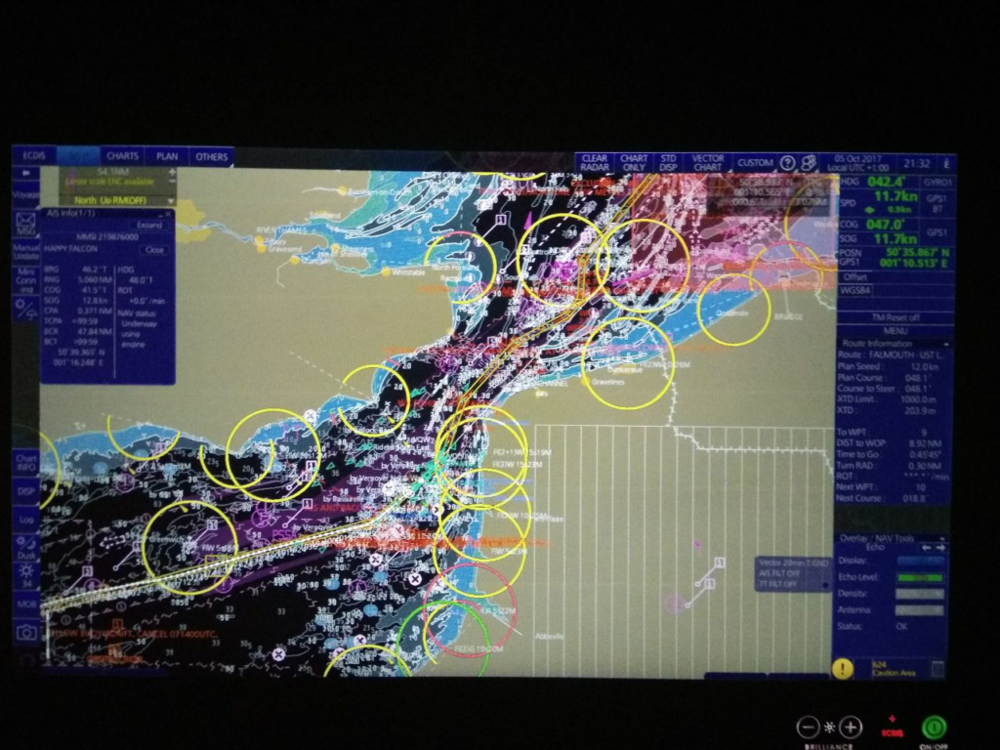
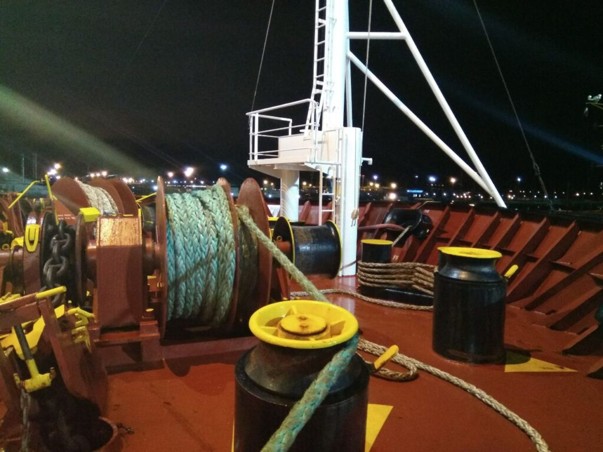
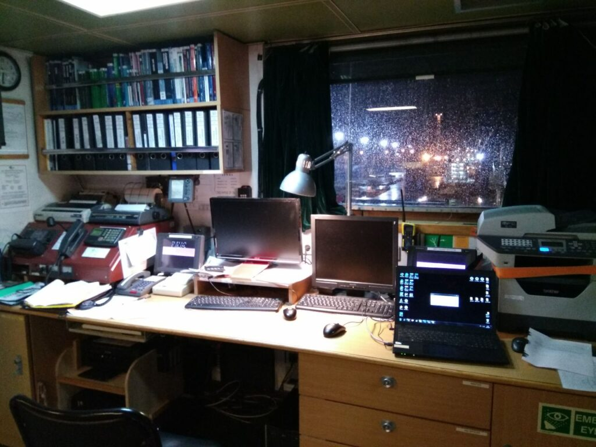

##### 2017.09.09

Nyanpasu!  
Тут я, за можливості, писатиму якісь морські історії з життя й трохи про форсинг, якщо змушу себе вести щоденник)

##### 2017.09.10

Можливо, дивно, але після теплої й душевної розмови з матір’ю я зміг трохи змінити деякі думки щодо майбутнього й думаю, що воно все-таки є)  
Навіть є кілька ідей, чим себе зайняти)  
Поміняти стару USB 2 флешку на нову USB 3 даром — що за радість))  
Чекаю завтрашнього автобуса й від’їзду на роботу, і весь такий нервовий(

##### 2017.09.11

Ура, Кацу сьогодні не їде, йому дали ще кілька днів побути вдома!  
Правда, горло болить невідомо чому, і це трохи прикро(

##### 2017.09.12

Останній день перед від’їздом, і знову Кацу змушують їхати на інший кінець міста через пару паперів

##### 2017.09.13

Кацу вирушив у далекі краї, залишивши батьківщину позаду — залишилися лічені години, поки є інтернет; час прощатися, друзі. Побути вдома!  
**Upd.** Тоді я їхав автобусом у порт Усть-Луга, недалеко від Санкт-Петербурга, щоб сідати на теплохід *Ocean Energy*.

##### 2017.09.20

Минула тиждень на борту судна; здається, не так уже й погано, розгрібаю справи й намагаюся звикнути. Уперше в житті доводиться нести відповідальність за щось — на щастя, оточуючі мені допомагають.

##### 2017.09.25

І от Кацу знову на зв’язку: привіт, Гібралтар; ми вже пройшли велику відстань до Алжиру й завтра заходимо в порт. Це не дуже радує, але це випробування ми витримаємо)

2017.09.29 **Upd.** Посту немає, але в мене був день народження, і навіть “святкова” вечеря наскільки це було можливо)

##### 2017.09.30

І Кацу знову в Гібралтарі, привіт усім) Алжир позаду, і ми знову рухаємося в напрямку Усть-Луги. Чесно кажучи, хочеться додому, але сидітиму до лютого, березня, хех...

##### 2017.10.04

Привіт, дорогі друзі, Кацу пише з узбережжя Англії: ми пройшли Гібралтар, перетнули Атлантичний океан, пройшли Біскайську затоку, і ось ми тут, у Фалмуті.  
Здається, живеться відносно непогано, хоча психологічно складно — ніяких серйозних труднощів немає, але шалена втома, навіть на Alice (Алісу) часу не вистачає, всі думки про роботу(((

%%%2

%%%

##### 2017.10.05

Солодких снів усім няшкам, Кацу залишає інтернет-простір.

2017.10.08 Отже, Кацу підходить до протоки Саунд, скоро буде Усть-Луга та перевірки від начальства компанії, а також новий капітан, що не дуже радує. Однак я підбадьорився й намагаюся триматися позитивно)

%%%3

  
  

%%%

##### 2017.10.10

**Upd.** Посту немає, але під час тренування зі спуску шлюпки я випав за борт)

##### 2017.10.11

Вахта завершилася, але от прийшов суперінтендант компанії... І через 3 години знову вахта... І за всі дрібниці “візьмуть”, як же страшно...

%%%3

  
  

%%%

##### 2017.10.13

Імовірно, сьогодні ввечері або завтра вранці Кацу покине туманну столицю Росії. З одного боку це добре — не буде купи “генералів” з постійними перевірками та наказами, але не буде інтернету та зв’язку з вами, мої дорогі друзі; Кацу дуже засмучений цим фактом((

##### 2017.10.14

#### 02:30

Кацу відшвартувався з Усть-Луги та покинув порт, тож зв’язок найближчим часом пропаде. Ця стоянка не була такою тяжкою, як могла б бути, але все ж нелегка. Час прощатися, до зв’язку, друзі)

#### 08:30

На диво, незважаючи на те, що я проспав лише 4 години, після цього відходу я прокинувся досить бадьорий — привіт, нове життя)

##### 2017.10.19

Отже, ми пережили шторм 10 балів у Північному морі й тепер ховаємося від ще страшнішого жаху у Біскайській затоці за 12 балів.

%%%3

%&23
  
  
&%
%%%

**Upd.** Ми кілька днів чекали, поки шторм вщухне, щоб продовжити шлях, і все одно спіймали вітер до 86 вузлів. На повному ходу вперед судно йшло близько 3–4 вузлів (5–7 км/год)

Я помітив, що намагатися вмістити весь рейс в один пост було б занадто пихато, тому я розділю його на періоди по два місяці)
