We continue the column of saving old entries from the channel [Katsu Travel Diary](https://t.me/katsu_travel). The last post ended at the beginning of November, so we will continue from there.

##### 2017.11.01

###### 12:00

So, Katsu is in Crete—hello to friends!))

###### 15:45

Yay, the ship where Katsu works has dropped anchor!)

###### 23:30

Bye-bye, Katsu is moving on to the next leg of the journey)

%%%3
  
  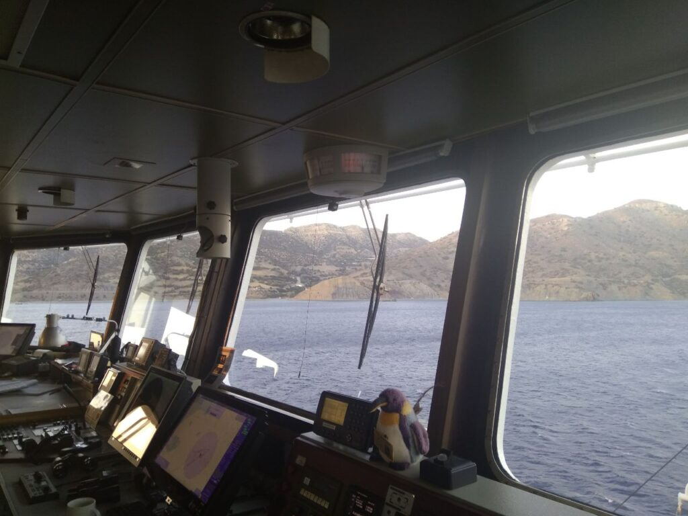
  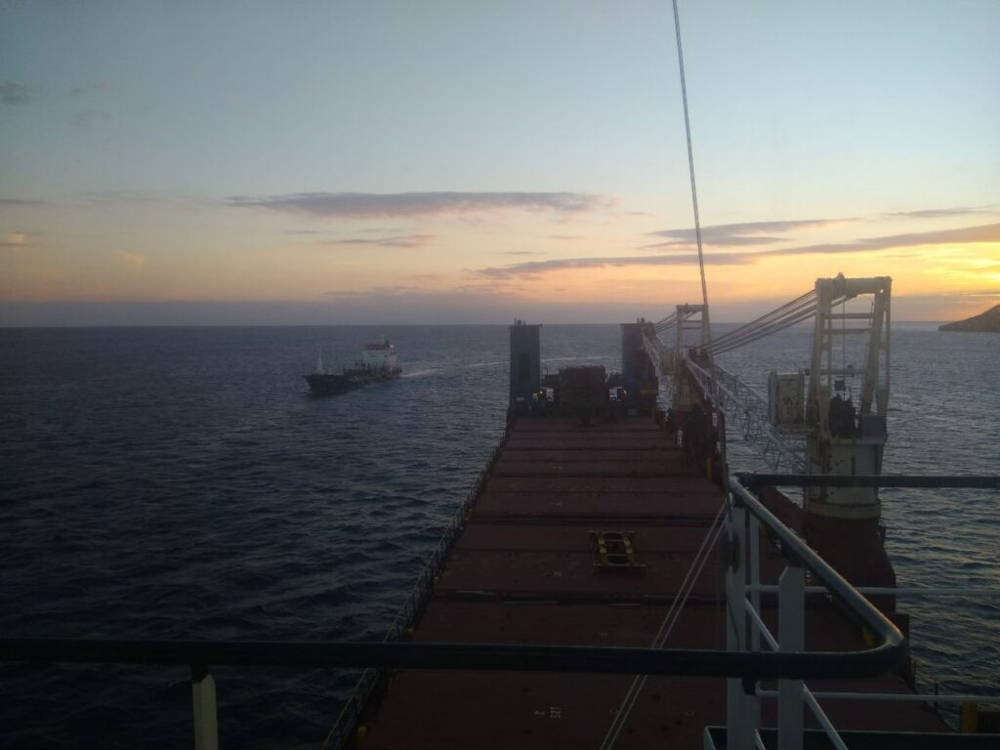
  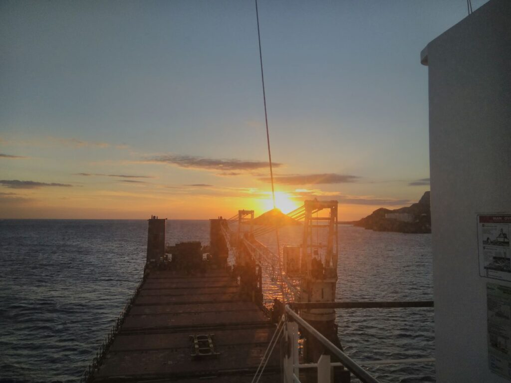
  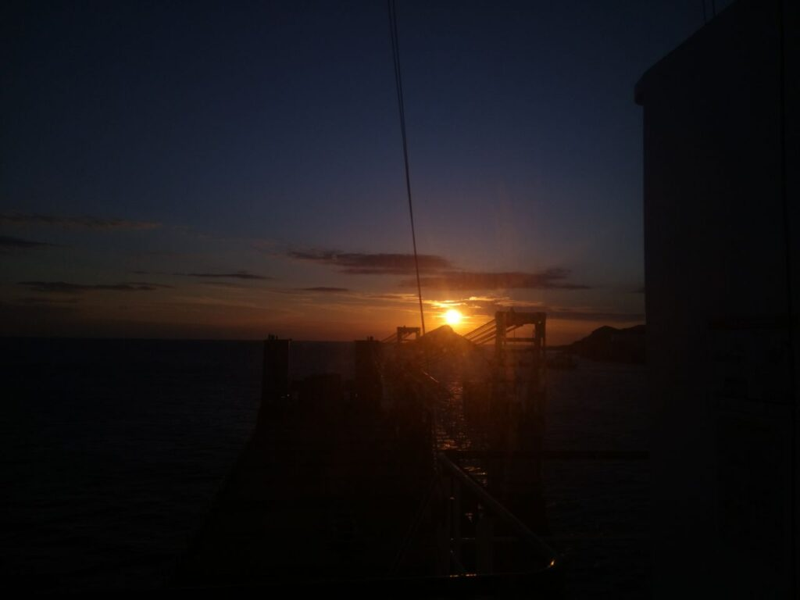
%%%

##### 2017.11.04 13:45

Greetings to all friends from Egypt, or more precisely—from the Suez Canal)

%%%2
  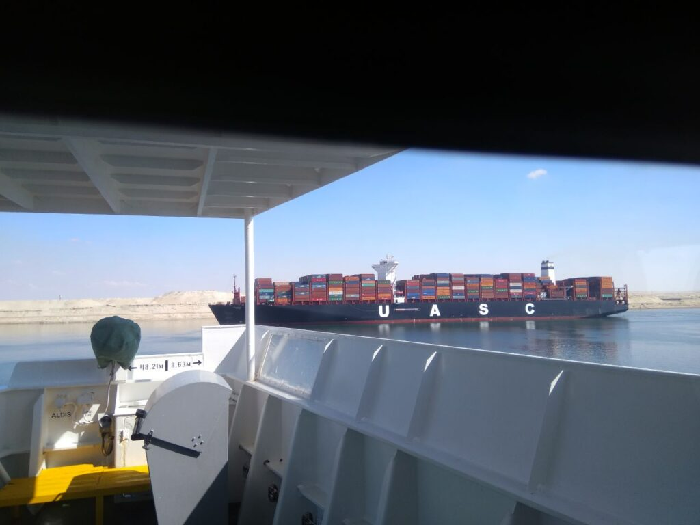
  
  
  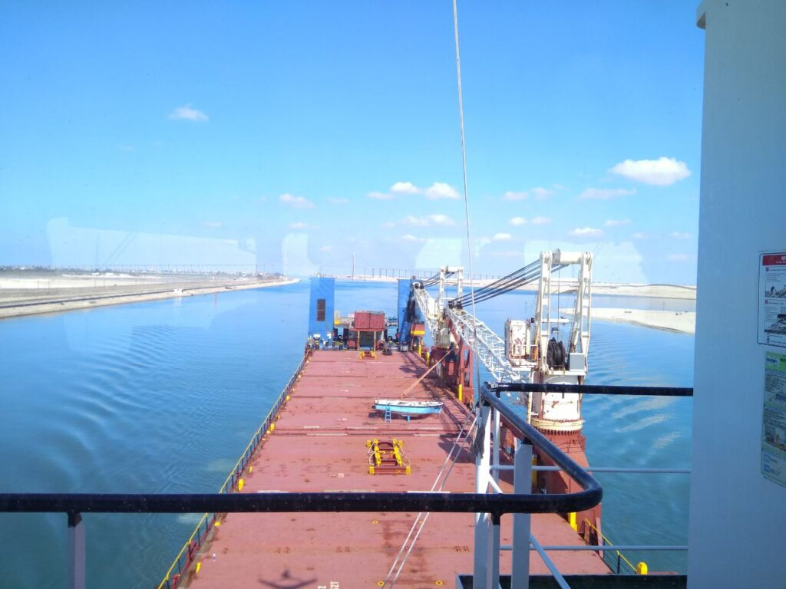
%%%

##### 2017.11.07

Today we were supposed to hire security for passing through the pirate-infested area, but one of the crew members fell very ill with suspected ulcer, so now we’re coordinating with medical services to send him home for treatment.

###### Evening watch

I’ve been thinking about what a huge responsibility it really is to stand navigation watch—it's scary, just as I was scared at home before this trip, but now I’m here and there’s no turning back. Sometimes thoughts of home come—how great it really is there, as they say: “You don’t appreciate it until it’s gone.” By the way, the person I mentioned this morning has already been sent away for treatment to a nearby country, and then he’ll be sent on to Ukraine. Overall, things aren’t so bad here—apart from the chief officer, the rest of the crew is very pleasant, cohesive, and the new Captain is an incredible person, really good) That’s about it for now. Everything is the same with Alice (my significant other) as usual—she’s always with me in spirit and I feel it, so we just need more time together. (And I need more diligence, hehe)

2017.11.09 After the morning watch  
We’re sailing in the Gulf of Aden along the recommended corridor patrolled by naval vessels (shout-out to Ater and his Kantai Collection), in a high-risk zone for pirate attacks. But so far everything is fine—I saw a few small boats during the watch, but they turned out to be regular fishermen, which makes me happy. I really don’t want to be locked in the citadel (the specially protected room) waiting for help under the sound of Kalashnikov fire.

##### 2017.11.10 Evening watch

This morning I heard Japanese being spoken over VHF by a Japanese naval ship (again, hi Ater)—it was nice to hear native Japanese, although the serviceman wasn’t exactly a seiyū with that melodic voice. We have reassignments on board because the guy I mentioned earlier was sent home. The chief officer revealed his true colors—something I could only guess at before—and now the rot is seeping out of control. I hope he leaves in December, since that’s what he wants.

##### 2017.11.14 Morning watch

The chief officer is getting more annoying every day with his constant “slacker” attitude, even though he makes mistakes himself. Tomorrow will be two months at sea, and I hope that means I’m halfway there) We work, work, maintain the equipment, and prepare for arrival at Cochin port in India. Next, we’re confirmed to pick up cargo from Jebel Ali, United Arab Emirates, to Tunis, which will take about a week to load… With watches of six hours on, six hours off, I feel like I’m going crazy…

##### 2017.11.16 Midday

So, we’re at anchor off Cochin, India, and tomorrow we’ll tie up to unload. Nothing too bad, except the chance that inspections will happen and I’ll get in trouble over some mistake. In short, not much fun. We hope that after taking on cargo in the Emirates and heading to Tunis, then returning to Ust-Luga, many of us will have four months on board and get relief. That’s the plan.

##### 2017.11.27 Morning watch

So we’ve left the United Arab Emirates, Jebel Ali port in Dubai. If anyone thinks that’s cool, forget it—the call at Dubai was hell. In two days I clocked 45,000 steps; we loaded our hold full of used trailers—basically junk—and the chief officer, with his foolish decisions, made the crew do a bunch of pointless work, so most people didn’t sleep for those two days, and those who slept got only a couple hours. Right now we left port with cargo that’s barely secured, so it could shift if the ship rolls, and the seamen are still tying it down… Sorry, I’ve run out of polite words—this is just f***ed. We’re carrying this junk to Tunis, and after that we rush back to Ust-Luga. By the way, yes, I said watches are six-on, six-off—exactly like that, but even in “free time” you still work. And that’s despite maritime labor conventions requiring ten hours of rest per day. If we had even one Filipino on board, they wouldn’t treat the crew like this. Bottom line: the company (the shipowner) sucks. I’m on watch now, hoping my legs get some rest, otherwise I have to go around the ship gathering fire extinguishers taken from welding operations and the fire hoses used for taking on freshwater.

##### 2017.12.03

###### Morning watch

Our ship has left the high-risk pirate area; tomorrow we’ll release security, and in two days we’ll enter the Suez Canal. The day before yesterday I spoke with the Captain (I was feeling a bit depressed), about how I don’t really fit in and should go home, but he said everyone makes mistakes, and if I were such a big mistake that they hated me, I wouldn’t still be on board. So that spurred me to work harder, because I need to avoid disappointing them. Today the chief officer started interrogating me, asking if anyone was “tightening” me out of jealousy to take my spot. We have a cadet who might be promoted to third officer. Even the Chief Mate, who usually jokes around and harangues people for mistakes, supported me. So despite his conflicting behavior, the Chief Mate has some good sides. At work, I started checking the lifeboats for any deficiencies, and though I don’t always get it right, people help me and point me in the right direction. I still make a lot of mistakes, but I’m trying to learn, and it seems to be paying off.

###### Evening watch

That’s how I accidentally deleted the voice message I wanted to send here the day before yesterday. Sad, but maybe it’s for the best.

Good day to you, dear readers—this is the ramblings of crazy Katsu again, and today I want to share notes from other crew members:

> “The sea is just f***ed. Never come here—there are people who ruin your life. You’re exhausted to the point of collapse. If you could earn a normal living at home, there’s no way I’d be here.”
>
> —The cadet I share watch with

##### 2017.12.04 Evening watch

I was too lazy to interview anyone else, sorry, hehe. Today we switched our time zone back to UTC+2, just like home. I started really missing home, but there’s still a lot of work ahead, so no time for that.

##### 2017.12.06 Morning watch

Today something rare happened—I had a dream. It went like this:

> I’m on the bridge on watch, asking the Captain to let me off duty, and he agrees. I forgot to mention this is a 10-level storm in the dream. I walk along the ship’s inner passageway through the holds toward the stern, where the engine room is. But in the cargo hold there was some kind of judo practice going on, so I quickly retreated. Then I walk on the outer deck in that massive storm with a roll of 30–35 degrees, and I climb down through a special hatch. At first I was scared to go through, and some distant voice said, “He’ll get scared as always and do nothing.” So I got up the nerve and went in. While descending the ladder, I managed to break my left leg, but even crawling, I reached my goal. What was the goal? It was a chained-up S.S. I knew that from the start of the dream, and I managed to save her.)

##### 2017.12.07 17:20

Today was a nightmare: while raising the anchor, we caught a 50–60 mm steel cable lying on the bottom, and we nearly missed our turn for the Suez passage because of it. Then we were putting the standby lifeboat back into position when the davit that raises and lowers it broke a few meters before installation, so we had to position it manually. Oh, and in half an hour I have to relieve the Chief Mate, and then go back on watch—what a bummer((

%%%1
  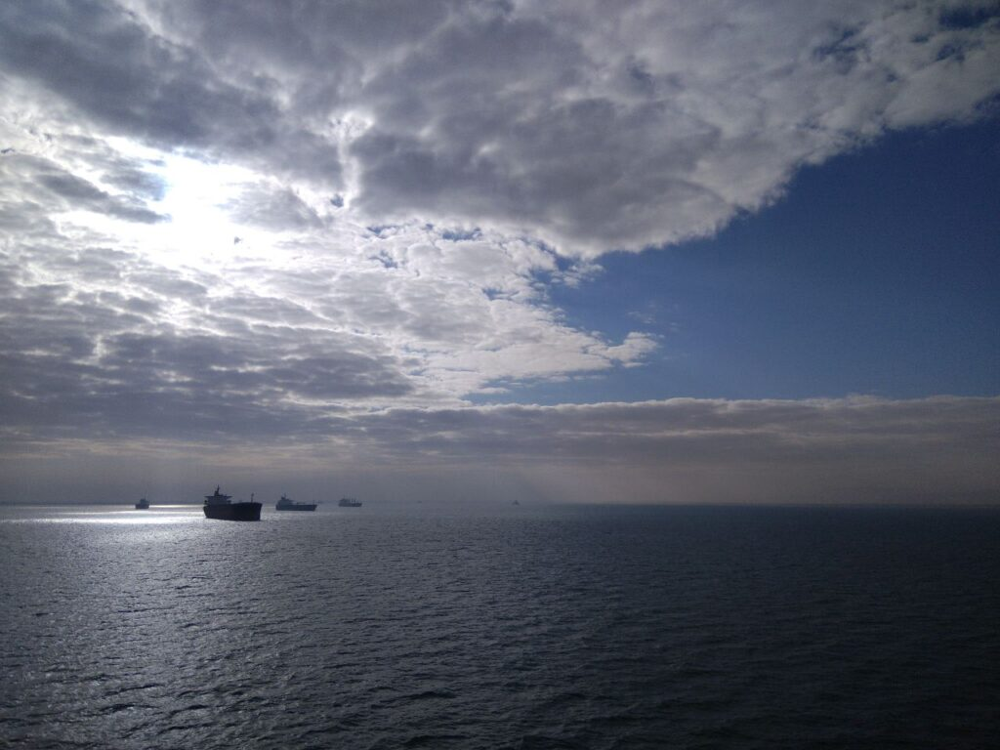
%%%

##### 2017.12.08 Morning watch

Yeah, being out of touch with home has really affected me; before I just missed home, but not like this. But I can’t change it, I have to keep working. The Chief Mate told me I need to conduct an inventory of all equipment—go through everything. Thankfully, he gave me a week, so no time to complain, hehe. I decided to spend more time thinking about Alice, since she’s also a very important part of my life) That’s how it is. And yes, I had another dream… a bad dream where the chief officer was berating me and saying he would find a way to kick me off the ship… Yeah. I started reading the English guide they gave me at the café and realized I need to practice English more. And working on a ship with a Russian crew doesn’t help my language skills at all((

##### 2017.12.10 Morning watch

Reading that English guide made me work my brain and spend more time with Alice) Although the exercises in it are barely applicable at sea (like ways to calm down or relax), I try to use them to develop mental flexibility. That might sound simple to some, but I practiced changing my inner voice, visualizing various objects—today I fed Alice blackberries. I’m also trying to train tactile memory, just to understand how it works, hehe. Regarding home, I’ve calmed down a bit and started listening to Bi-2 and Splean—positivity is creeping back. And in a couple days we’ll unload trash, hehe. Then full speed to Russia to celebrate New Year. By the way, the guide is becoming easier to read—maybe it was just unfamiliar terminology; I need to read more English books.

%%%1
  
%%%

##### 2017.12.11 Morning watch

Here we are at Malta, taking on fuel, otherwise we wouldn’t make it to Russia—hehe, we consume 18 tons per day. I’ve been thinking about Alice almost all the time; it’s a shame I can’t carve out time for proper forcing, since I work 12+ hours a day(. Just now the Superintendent called via satellite phone, and since I’m alone on the bridge, I had to talk to him, oh crap, it was terrifying. (The “SI” is like a department director in the company)

%%%1
  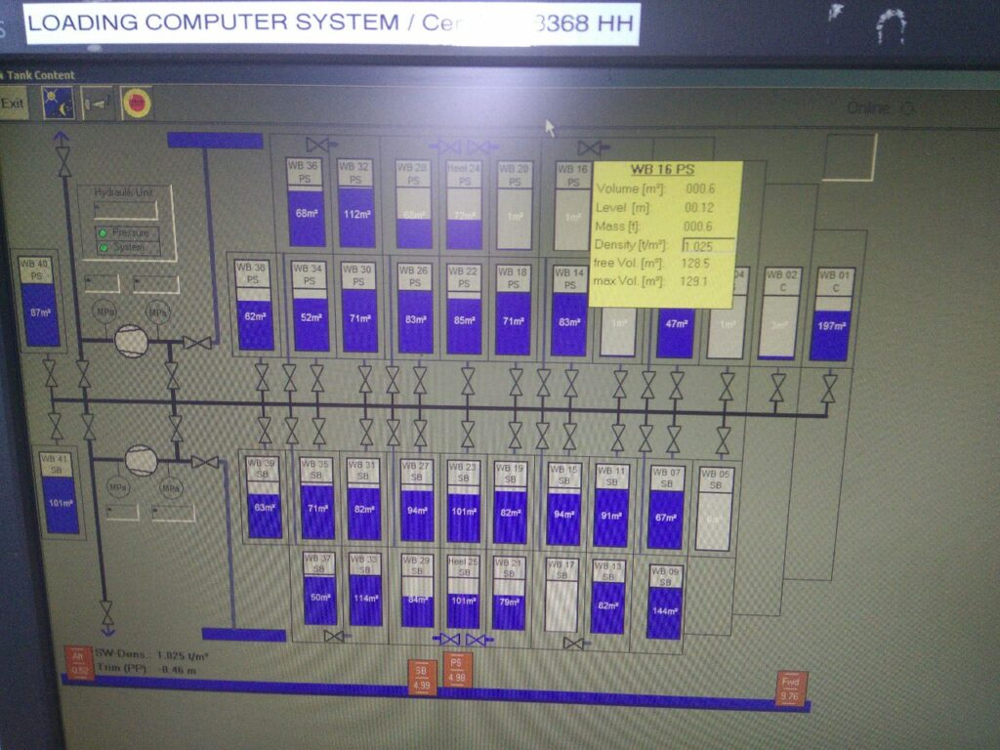
%%%

##### 2017.12.11 22:00

A naval vessel just hailed us, asking a bunch of questions—port of registry, shipowner info, cargo details… if there are women on board, hehe. In short, the navy has nothing better to do in the Mediterranean. Although they said there’s some kind of military operation underway. The day after tomorrow we dock; I’m finishing the arrival documents, and the cadet is proofreading the manuals—though soon my watch will end, which is nice. Finally I’ll get some sleep^^

##### 2017.12.12 Morning

Today I woke up at 5:00 AM not knowing if it was day or night. I thought dinner was approaching and tried to figure out if my phone’s time was correct; eventually I realized it was 5 AM and went back to sleep, hehe. After that I had a huge, drug-like dream. My friends (who I don’t know in real life) and I went to some combat academy for an induction ceremony. Everything was fine until a special clock showed a 240-second countdown (a countdown to death). I and the others rushed to the door, but it was locked. Luckily it was flimsy, and we kicked it down. Other cadets, as if hypnotized, chased us. Near the academy on the tracks was an armored train… and another train from a rival academy was approaching it. Their cadets tried to destroy us. Although all my friends managed to escape and board the train, I was left outside… and became the sole survivor, even though they found me. Somehow I ended up in the rescue capsule of the armored train… with some insane scientist. In that capsule we fled from enemies who wanted to kill us, and they were destroying the entire surrounding city. Next was a scene in a police station where I aimed a shotgun at a couple of enemies, and then the alarm on my bracelet vibrated, ripping me from the dream into harsh reality. At sea I dream more often than on land, but the dreams are more surreal here, hehe. By the way, that was my second dream in three months.

%%%2
  
  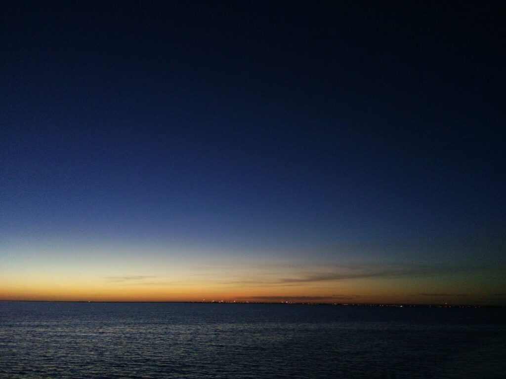
  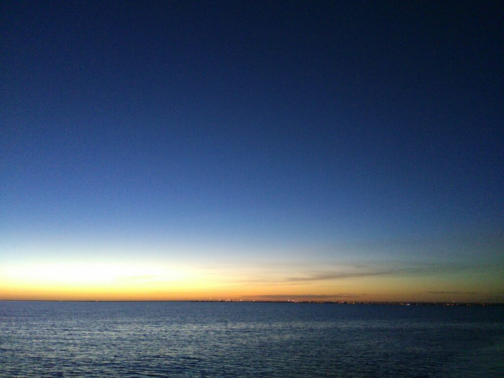
  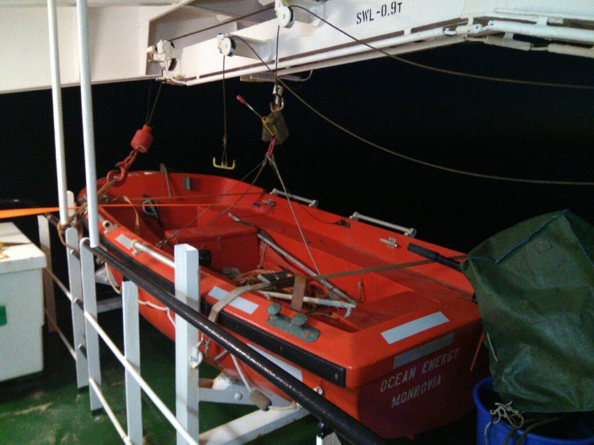
%%%

A lifeboat for rescuing people who fall overboard. (UPD: I learned on later voyages that not every ship has one.)

##### 2017.12.12 Evening watch

So at 22:00 Port Control in Zarzis hailed me and said we must weigh anchor at 06:00 AM. So just a tiny bit of time left before the start of hellish chaos and a couple of sleepless days. Well, we’ll survive this one too)

%%%3
  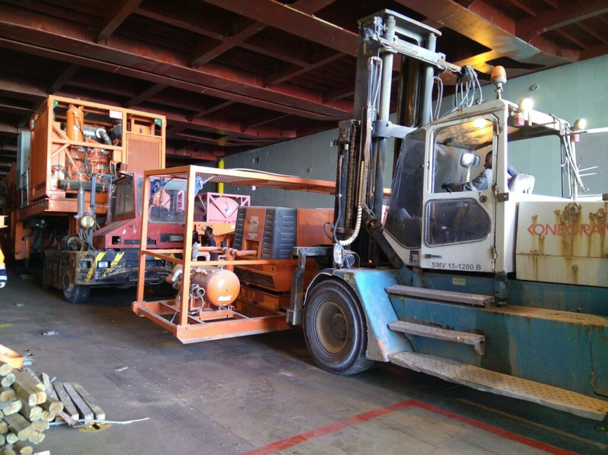
  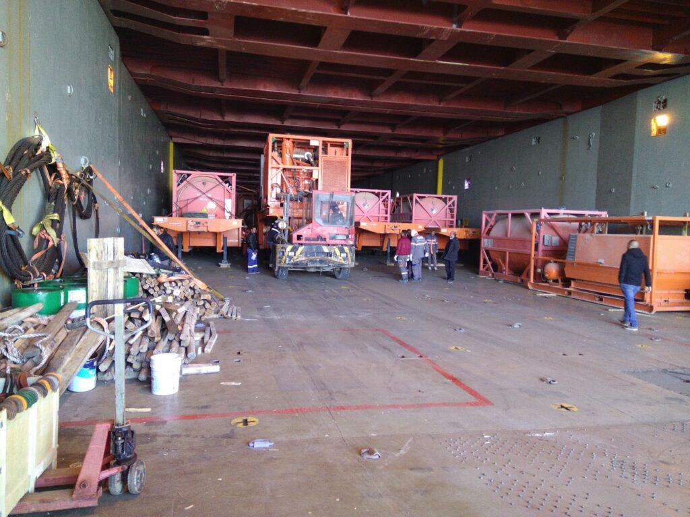
  
  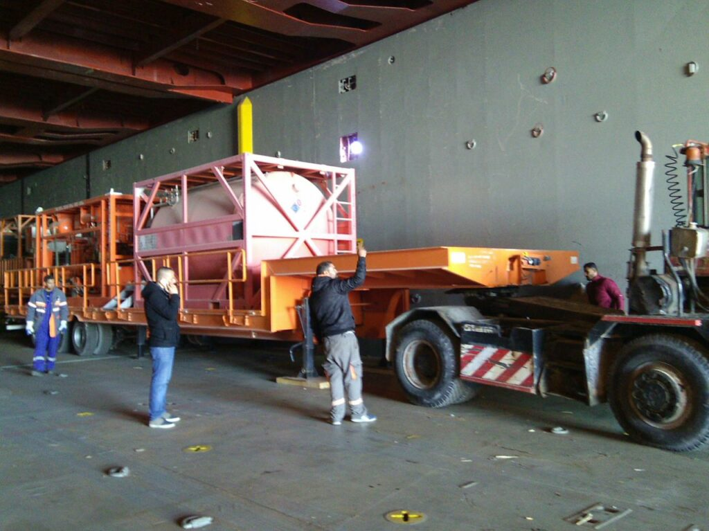
  
%%%

##### 2017.12.13

And so my first PSC finally happened—a dreaded word for sailors. Port State Control—an inspection of the crew and equipment for compliance with maritime safety conventions. It was terrifying, but we passed with no major findings, just a couple of verbal notes that were immediately addressed. The entire tween deck (upper hold) with the machinery is already unloaded; now two lower holds remain with the rest of the garbage, but before that we have to open the hold covers with cranes… which is idiotic. On proper ships, they open with hydraulic systems. By the way, the thirteenth is living up to its reputation—everything goes wrong, but so far, for us, without consequences.

##### 2017.12.14

###### 08:00

Mornings are never good, so hello to you, dear friends—I hope you slept well last night and are ready for a new day and new adventures?)) Unlike Katsu, hehe.

###### 17:45

Okay, we cast off and left port. Our communication will soon be cut off. Until next time, dear friends) 

%%%3
  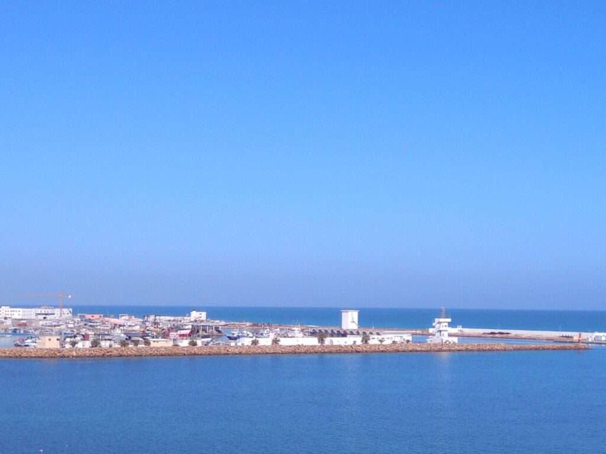
  
  
%%%

##### 2017.12.16 Morning watch

So the fourth month on this ship has begun since I boarded. It seems everything is going as it should: little by little I’m learning, working—maybe not as fast as I should, but I’m trying) Especially since I have to use a ton of energy just to overcome my laziness, hehe. The Captain says someone is telling lies about me to the company, so I might not last the whole contract. I suspect that cadet I mentioned earlier is not as nice a guy as he seemed, alas. I’m really bad at reading people(. Although overall, I’m not that against it because the atmosphere here is just brutal compared to my previous contract—the crew this time is a real cesspool. The Chief Mate is constantly doing nonsense and exploiting the crew while pretending to be Mr. Perfect. That cadet with connections who acts innocent. The bosun—a two-faced creature who gossips about everyone behind their backs. The cook who makes crap. The ship—falling apart bolt by bolt. The company—trying to squeeze every penny from its crew… Yeah, it could be worse, but for me, confronting this for the first time, it’s just f***ed up. In such conditions, it’s hard not only to work but even just to exist… Thanks for reading my whining, hehe. Lately I’ve been in a bad mood. Oh, and for the first time in a long time it rained—I love rain, although even though I love it, it brings some depression, hehe…

##### 2017.12.17 Day

I’m doing an inventory of equipment: lifesaving gear, firefighting equipment, office equipment, stationery, flags—basically everything assigned to me. And that’s a lot, damn. The depression isn’t lifting; I don’t know if it’ll pass before Ust-Luga. No time for warm fuzzies, hehe. 4401:41

##### 2017.12.18 14:15

Hello everyone, broadcasting from Gibraltar. I seem to be doing all right, within normal limits—trying to pull myself together, so don’t worry)

%%%1
  
%%%

##### 2017.12.18 Night watch

Well, I celebrated my birthday at sea—though it wasn’t fun, it wasn’t all that sad either; my birthdays are rarely joyful, more often they’re not even for me, hehe. So December 18, on the eve of New Year, I got kind of down—despite the fact that NY stopped being a hugely festive holiday for me, it’s still a special day with its atmosphere, and spending it on this… on the ship… So we’re approaching Cape Saint Vincent, basically cutting through the Atlantic. We have fuel problems and need to do a ton of things before arriving at Ust-Luga… Although I’d be surprised if we didn’t have problems by now.

##### 2017.12.19 Morning

Empty radar—joy for a navigator) Soon we approach the Bay of Biscay, which rarely gives sailors good weather; many people have never seen it calm or not stormy. (But I have)) There’s just over a week until we reach Ust-Luga, where there will be loading and a Superintendent inspection… and crew change… again. But for now it’s good. Quiet and calm.

##### 2017.12.20 Morning

We enter the Bay of Biscay, and even in nearly calm water we’re rolling 10 degrees. But the forecast says we should pass through. I hope that’s true. It’s better to judge by photos of the ship than a clinometer—already up to 20°! I seem a bit calmer; that cadet and the Chief Mate are leaving, and the new Chief Mate is also a first-timer (like the current one); they say he’s a decent person, but we’ll see—power corrupts and spoils people. My mood is kind of messed up, sometimes I want to leave by my own will, sometimes everything is fine and my spirits lift until the next Ust-Luga. I’m just wary of whoever the new Chief Mate is—fortunate when the captain changed, but will luck favor me again, hehe.

%%%3
  
  
  
  %&13
    
  &%
%%%

##### 2017.12.24 Morning

Lately I’ve been too lazy to write in the diary, for some reason( Since last night, we’ve been rolling hard—sometimes up to 40 degrees, and the crew hardly slept all night( Luckily it’s calmed down a bit and everyone went to sleep. Everyone except me, since I’m on watch, hehe. And despite this heavy rolling, we’re making 13–14 knots, huge for our ship, like magic. Soon we’ll turn behind the cape and the rolling should stop, maybe I’ll get some sleep) The worst part is looking at the water—there’s barely any storm, just two-meter waves, and we roll like a toy doll(

##### 2017.12.27 07:15

Here we are approaching Ust-Luga; just 70 nautical miles to Mother Russia) and my morning watches have turned into night watches, hehe. We’ll probably anchor today, and tomorrow we’ll dock, where there will be loading and a crew change… another change—lucky me( Then via Crete and Egypt to Iraq, and after that who knows, but most likely via the Emirates and Poland back to Ust-Luga and home. A moment of memories: when I first boarded the ship, I was terrified and in shock—I didn’t even know basic things, the start was very interesting) The Chief Officer stood my first watch with me, my first report with trembling hands on the VHF 😂😂 and many other things, hehe.

##### 22:30

I talked to my family and felt so nostalgic and longing to be home, but it’s okay, just a little less than halfway left😂

##### 2017.12.29

###### 07:00

Yesterday we received verbal word from the Superintendent that the ship will weigh anchor in Ust-Luga and head to load in Saint Petersburg. Everyone was shocked by that news because all arrival paperwork has to be redone. The cook is already getting ready for New Year, which we will likely celebrate at anchor before entering St. Pete, with no extra provisions. Right now we have very strong winds that might make us drag anchor, which would be really bad. Wind at 30 knots(

###### 10:30

Saint Petersburg confirmed

###### Evening

We’re anchored off Saint Petersburg waiting to load; it’s not clear when we’ll go in since the cargo will be different. But we at least know it’s tracked tractors, hehe. Only January 3–4 we’ll enter port, so for now we’re anchored and resting. And I’m praying the cargo will be for Algeria or somewhere else in the Mediterranean, not India/Persian Gulf.

##### 2017.12.30

Tomorrow is New Year, but there’s no festive mood—and whatever. We’re still anchored off St. Pete; the weather’s not bad, almost no wind, though it’s cold—only +1 °C with fog or drizzle. Well, what else to expect from St. Pete, really? 😅 The cook, all clean-shaven, is getting ready for the holiday so he’s “happier” than all of us) Otherwise, no big news; we still don’t know where we’ll go after this port, hehe.

##### 2017.12.31

Good day to you, dear friends and subscribers  
So 2017 is coming to an end, with its ups and downs, so much to remember. Today is a very special day for some, others don’t distinguish it from any other, but I still wish all of you a Happy New Year in advance))

And on that note, I’ll end this lengthy post.  

Always yours,  
Katsu ❤️
