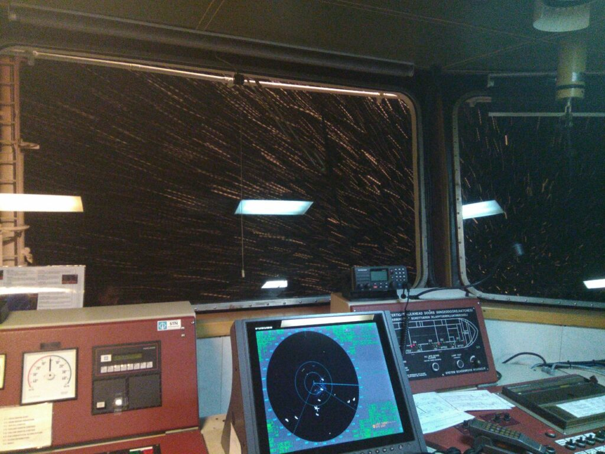
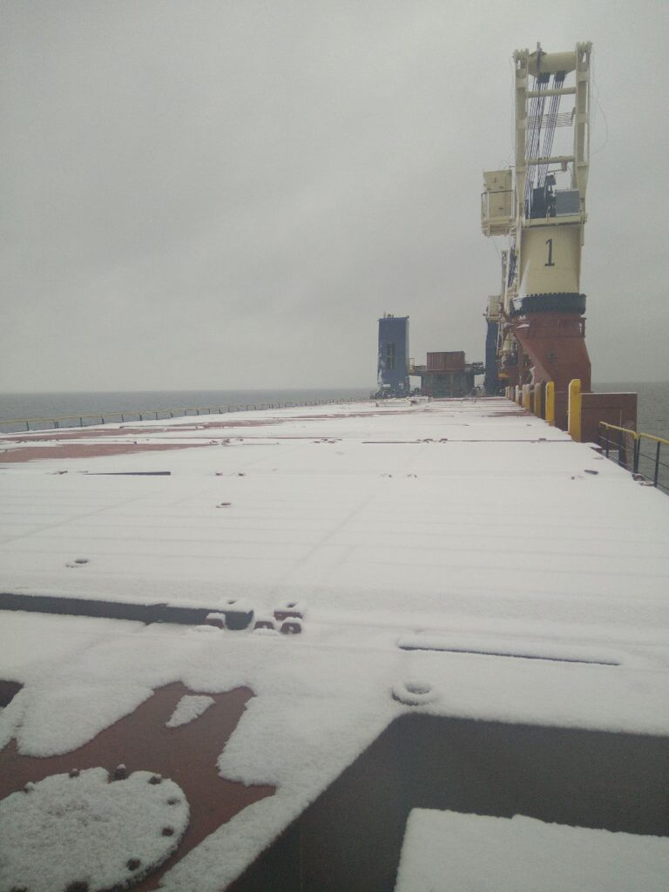
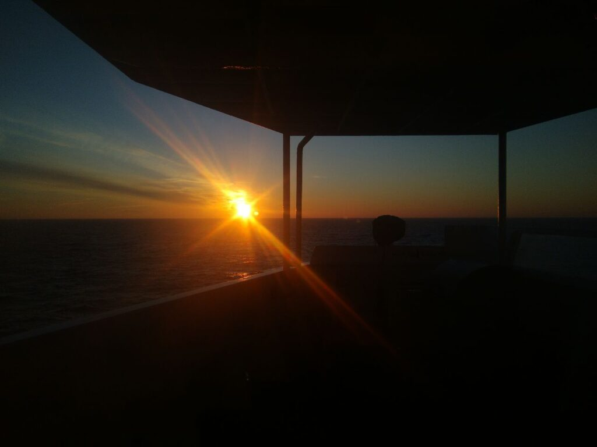
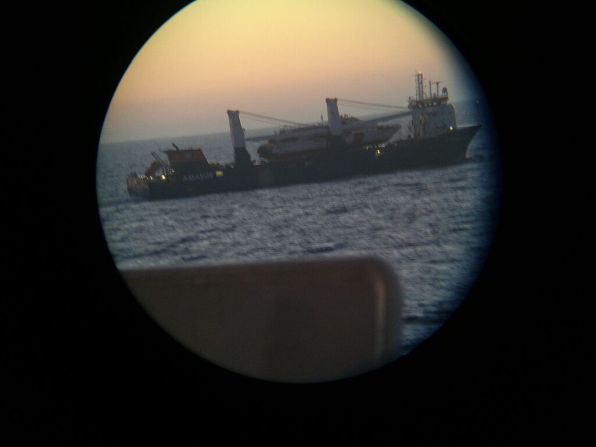

##### 2018.01.01

Привет вам в новом году) у кого-то сейчас болит, голова, кто-то спит, а кто-то топает на вахту и тут заходя на мостик я наблюдаю подобную картину:

:::3

:::c3

:::

:::

##### 2018.01.03 17:45

Ура!! Нам подтвердили что груз не на Ирак, а на Алжир, так что к концу февраля я уже должен быть дома^^

##### 2018.01.04 17:45

Нам прислали письмо, что завтра мы должны становится к причалу для погрузки, с одной стороны я не люблю порты, но с другой - чем раньше зайдем, тем раньше выйдем и поедем в Алжир, а потом домой^^

##### 2018.01.05

###### 15:15

Прислали билеты на уезжающих членов экипажа, они так надеялись что полетят на самолете, но нет, их ждет 40-чaсовое веселье в автобусе Питер - Одесса.

###### 18:00

Ну конечно же старший помощник решил купить себе билет на самолет, не трясти же свои телеса на автобусе😅

###### 20:30

Маршрут вроде снова поменялся, теперь это Питер - Ирак - Ирак - Египет - Тунис - ОАЭ - Польша - Питер. Это наверное больше 4 мес… Мда. Прощай, крыша.

##### 2018.01.06 02:10

Единственная надежда это смена в Суецком по хорошему или по плохому.

:::2

:::

##### 2018.01.07 16:00

Удивительно (ли?), но уехал старый чиф и дышать стало легче, нервный тик не пропал пока, но для этого надо время😅
Посмотрим, что будет в море, но пока что новый старпом просто красавчик)

UPD: В порту Санкт-Петербурга, не помню точную дату, один из кадетов, который стоял вахту у трапа (единственная точка, где люди могут заходить и покидать борт судна, надо записывать в журнал всех, и докладывать офицерам, если приходят власти, грузоотправители или еще кто). Я нес грузовую вахту в трюме и не мог проследить за ним, так что он с кем-то еще напился, нахамил и чуть-ли не подрался с новым старпомом.
Его хотели списать, но компании у него оказалась крутая "крыша".
Когда я поднимался на мостик, у меня сердце ушло в пятки, и даже капитан удивился, и предлагал виски чтобы отогрется. А я боялся, что меня "взуют", за то что не уследил за шалопаем.

##### 2018.01.09

###### 00:00

По passage plan мы должны прибыть в Ирак 10.03 (странность только в том, что идти туда 1 месяц, с чего такие сроки?) и у меня уже будет 6 мес. Так что есть два варианта, смена в Суецком до Ирака или после. Судно в процессе погрузки, которая скоро уже закончится и мы покинем Санкт Петербург.

###### 17:30

Все, через час мы уходим из порта, наконец-то, Ура!

##### 2018.01.15 19:45

Мы встали на якорь в порту-убежище Torquay в гавани Tor Bay, из-за ужасающего шторма в заливе Бискай. Как сказал DPA, мы можем тут стоять хоть неделю, хоть месяц, главное это безопасность судна, груза и экипажа.
И несмотря на это мы даже на пути от Dover Strait в Английском проливе, до этой гавани успели отхватить на 8 баллов.
Работать стало в разы легче психологически, да и новый чиф куда опытнее и не дает заданий на "глупую" работу. Моральная обстановка на судне в разы улучшилась, но пол-экипажа все равно хотят домой.
Кстати, сегодня ровно 4 месяца как мы в море.
Вчера мы впервые нормально за эти три месяца поели (3 мес назад поменяли повара). Матрос готовил на всех шаурму и это было невероятно вкусно. Хотя с тем что готовит наш повар, я думаю все что угодно будет вкусным😅.
Пока на этом все, доклад окончил

:::2

:::

##### 2018.01.16 19:00

Из-за очень сильного ветра, достигающего 40-50 узлов нас сегодгя ночью "потащило" так что судно встало на 2 якоря, по восемь 27,5 метровых смычек цепи на каждом. Благо сейчас ветер максимум 30-35 узлов, но по прогнозу будет ухудшение(
А в остальном все нормально))

:::2

:::

Вот так мы катались, пока снимались с двух якорей и перезаводили их заново.

##### 2018.01.19

###### 19:50

Через пару часов наше судно снимется с якоря и пойдет в залив Бискай, получать лещей. Шторм немного поутих, но приятного мало, надеюсь все будет хорошо. Стоянка в Англии была довольно приятной, если не считать перезаводки якорей, так что пришло время продолжать работать)

###### 22:30

Все, мы снялись с якоря, так что прощайте, друзья, до новых встреч, до связи)

##### 2018.01.21

Вторые сутки мы идем по Бискаю в штормах. В целом погода не так плохая, но это для нормального судна, нашу речную плоскодонку кидает нехило. Скорость вроде так ничего, поднялась, но спастись от второго шторма мы не успеваем, так что будем веселится до самого Гибралтара. Качка уже в печенках сидит, за полтора дня ни поесть нормально ни поспать, ну да это мелочи и ни такое бывало. В прошлом контракте нас две недели бросало по индийскому океану.

##### 2018.01.22

Сегодня утром мы вышли из Биская и судно перестало так уж сильно качать, остаточные 10-15 градусов это вообще ничего, после того что было.
Состояние экипажа никакое, все кроме новоприбывших чифа и мотора, и матросов хотят поскорее свалить, но раньше начала апреля все равно надеяться не стоит. Повар стал готовить еще "лучше", видимо он нашёл болт побольше, чем тот что он клал на работу до этого.
А так все нормально, все идёт по плану)

##### 2018.01.24

Доброго дня) Судно прошло пролив Гибралтар и стремится в сторону Греции, для пополнения топливом, немногим позже мы будем в Суецком канале, потом возьмём охрану от пиратов и будем следовать через Красное море и Аденский залив в Персидский залив, в Ирак, порт Umm-Qasr, в котором я уже бывал один раз, потом там снова погрузимся на Египет, и через несколько суток ещё раз погрузимся уже в Саудовской Аравии грузом на Тунис. Одна надежда, что после этого наши "господа" соизволят отпустить своих верных рабов.
Ну а в остальном все в порядке, обхожу имущество после шторма, исправляю некоторые замечания. Конечно новый чиф куда лучше старого, но это не меняет того, что у меня все ещё не так много опыта как хотелось бы, но я стараюсь)

##### 2018.01.25

Со вчера напала такая напасть, некая апатия, тупо ничего не хочется делать, конечно, я не поддаюсь этим порывам, но все это довольно печально.

##### 2018.01.27

Сейчас мы находимся возле Мальты)
Тот порт в Египте, куда мы повезём груз из Ирака это Суец, и есть вероятность попасть домой куда раньше середины апреля, что не может не радовать))

##### 2018.01.28

А сейчас произошло интересное событие, когда мы с 3 механиком ели мивину (после моей ночной вахты) пришёл капитан и… Заварил себе мивины😅 видимо он тоже не может есть то, что готовит наш повар, как и весь остальной экипаж😅😅😅

##### 2018.01.28 21:00

Сегодня мастер устроил собрание экипажа по вопросу недовольства поваром, но никто не высказался официально и ничего не него не писал. Так что хоть повара и лишили бонуса, но он ещё легко отделался.
Через 8 часов мы должны подходить к Кали Лименесу, Крит, Греция, для бункеровки судна.
Я стал чувствовать себя куда легче в моральном плане, сегодня вообще день был удивительно приятным.
В целом питание также ухудшилось из-за ужасных продуктов в России( В Египье мы возьмём немного дополнительных запасов и должно стать полегче и повкуснее)

##### 2018.01.29 10:20

Все, мы уходим, до связи, друзья^^

##### 2018.02.02 Вечерняя вахта

Вчера мы перевели время на UTC+3, а сегодня на нашем судне проводился барбекю. (Или Shashlik Drill😂). Мясо получилось просто божественно вкусным, так же были бутерброды с красной икрой, которая должна была пойти на новый год, но приехала позже него, овощи, салаты, картошечка с салом, получилась хорошая разрядка экипажу, приурочено это было к рождению дочери у капитана)
Сегодня мы возьмём охрану для защиты от пиратов в опасном районе и будем следовать далее.
Агент прислал нам письмо с приходными документами и там было написано что судно скорее всего захочет посетит PSC (Port State Control), надо же, такую мину подложить под конец контракта.
Надеюсь, что получится пройти его как обычно в таких странах.
Вот такие вот дела на сегодняшний момент)

##### 2018.02.05

Мы идём по пиратскому району, прошли пролив Баб-эль-Мандеб и следуем по Аденскому заливу по международному рекомендованному транзитному коридору IRTC. Последние пару дней на меня снова напала тоска по дому.
Начал смотреть сериальчик "Исчезновение Юки Нагато" в целом ничего выдающегося, кроме саундтреков, постоянная классика с промелькивающей композицией, Claire de Lune, которая мне очень нравится. Понемногу работаем, подбираем косяки, где находятся.

##### 2018.02.13

Прошли мы пират-опасный район, как обычно, спокойно, прошли Персидский с его многочисленными рыбаками, тут даже на удивление прохладно, до +15 ночью. Сейчас стоим в порту, не смотря на то что тот тип груза, который мы привезли обычно раскрепляли от цепей портовые рабочие, в этот раз заставили наш экипаж(( а когда мы выгрузимся нас ожидает погрузка, не отходя от кассы, и снова крепление. На списание в Суецком надежды тают с каждым днём, остаётся надеяться, что после него мы сразу двинемся в Усть-Лугу или Питер.

##### 2018.02.18

Стоим на Фуджейре, ОАЭ, скоро снова будем брать охрану. Надеемся в Суец сразу, а то нам все пытаются придумать какой-то догруз. Все отдалить наше попадание домой. Но я уже на шестом месяце как-то успокоился, по крайней мере нет депрессии от желания домой, хех. Можно сказать просто стало уже пофиг на все, хехех.

##### 2018.02.18

Стоим на Фуджейре, ОАЭ, скоро снова будем брать охрану. Надеемся в Суец сразу, а то нам все пытаются придумать какой-то догруз. Все отдалить наше попадание домой. Но я уже на шестом месяце как-то успокоился, по крайней мере нет депрессии от желания домой, хех. Можно сказать просто стало уже пофиг на все, хехех.

##### 2018.02.25

Мы прошли опасный пиратский район и приближаемся к порту выгрузки - Суец/Адабия. Сегодня утром охрана покинет борт судна, один из охранников был с нами все 4 раза, которые мы проходили этот район и стал почти своим) Он, кстати, стоял вахту со мной и мы часто разговаривали на разные интересные темы. Все они русскоязычные, так что с этим проблем не было) Настроение последнее время хорошее, как у нас говорят "домашнее", последний месяц, надеюсь, пролетит так же быстро как и прошедшие)
Есть, конечно варианты, что нас догрузят после Суеца, но мы можем всем богам чтобы этого не произошло, хехехех)
В Красном море даже в феврале жара до +30, выживаем под кондишками и вентиляторами (так-то, завидуйте😂😂😂), а как приеду домой там тоже начнет теплеть, так что вся зима которую я видел в этом году это неделя снега в Питере на Новый Год.
Правда этот чиф оказался тоже со странностями, хоть и не такой козел как тот, но тараканы тоже есть, хех. Порою из-за этого приходится делать какую-то дурную, бесполезную работу, либо же переделывать что-то на что убито несколько дней, потому что он придумал что-то по другому, хех. Ну да пофиг, что тут осталось)

##### 2018.02.27

Да уж, сегодня день полнился плохими и не очень новостями.
Во первых, боги остались глухи к нашим молитвам и у нас будет ещё один груз из Англии в Англию, а это значит - PSC парижского меморандума, который у нас был в прошлом июле и было 3 замечания. Кто в теме, тот понимает о чем я(
Во вторых, кто-то всё-таки настучал в компанию и повара списывают по служебному несоответствию прямо вот сейчас в Суеце.
Больше, вроде как ничего интересного.

##### 2018.02.28

Оказалось, ну да и логично, что повара спишут в "ближайшем удобном порту", то есть никак не в Суеце. Тем более мы сегодня-завтра уже заходим. По сути у него ещё есть шанс исправится, надеюсь он им воспользуется и мы начнем кушать по человечески.

**Тут и заканчиваются посты за январь-февраль, переходим к следующему и последнему посту за мой первый офицерский контракт)**
