##### 2018.03.02

Сегодня около полудня приедет новый повар.
Вчерашний день не задался с самой полуночи, сначала постановка на якорь в 2 часа ночи, потом в 6 утра вызвали на мостик собирать судовые сертификаты для агента. Потом мы подняли якорь проследовали на другую якорную стоянку, чтобы... Постоять там 10 минут и взять другого лоцмана! Потом сумасшедшая швартовка, буксирные суда вели себя как сумасшедшие, разворачивали нас в малюсенькой гавани, размером в 1,5-2 наших судна на сумасшедшей скорости, буксирные концы трещали, как сумасшедшие. Потом множество проволочек с выгрузкой, грузовыми документами, а теперь, предположительно, нас хотят перешвартовать кормой к причалу. Короче говоря, арабы отимели нам всем мозги так, что на судне никто уже ничего не соображает, хотя мы только второй день в порту. Сейчас мы ждём хоть какую-то инфу, будут нас перешвартовывать или нет, когда продолжится выгрузка, сами вообще ничего не знаем(

%%%2
  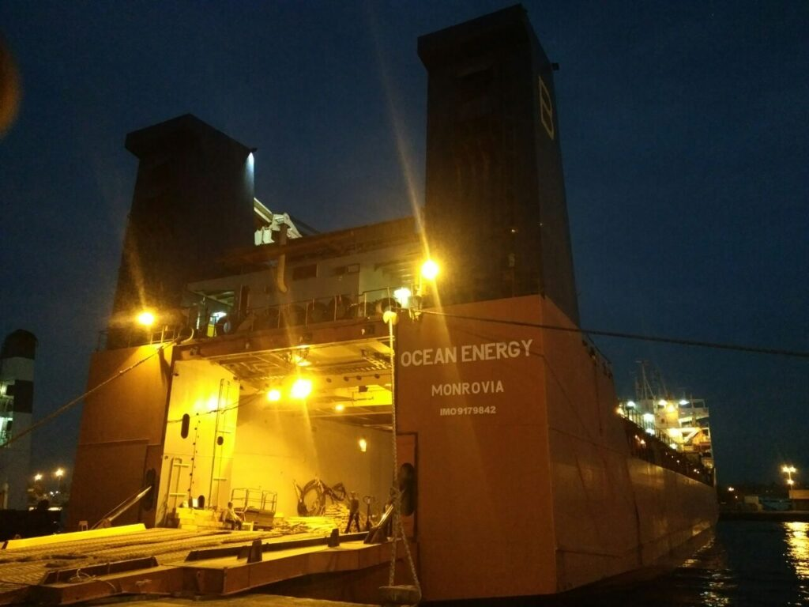
  
%%%

##### 2018.03.08

 Мы стоим на якорной стоянке за территориальными водами Мальты и бункеруемся. Есть шанс, что мы не пойдем на Англию, из-за того что наши краны очень громко трещат при работе. Мы молимся всем богами мира, чтобы это произошло. Очень надеемся пойти прямиком в Лугу.
Пока мы шли по арабским странам была невыносимая жара, но при входе в средиземку нас настигли холода, хотя у многих из читающих сейчас минуса и снег, но для нас даже +15 после +28-30 это холодно. Брррр.

##### 2018.03.09

 Вот и прошло 8 марта, у одного моего хорошего друга был день рождения, но я даже не смог её поздравить(
Дело движется к 6 месяцам, уже менее чем через неделю. С отменой Англии так ничего и не решилось, так что мы пока идём туда( и из-за этого крана, уже по месту, когда придем нам могут отменить погрузку и ещё и прислать расширенную проверку. Короче говоря, масштабы задницы в которую мы попали под конец контракта только увеличились.

##### 2018.03.17

 Мы застали шторм в Средиземном море, перед Гибралтаром, мы застали шторм в заливе Бискай, теперь нас снова штивает в Северном море, после прохождения Ла Манша.
Прямо черная полоса( Нам ещё написали, что хотят проверить крышки трюмов на водотечность специальной ультразвуковой системой. Кажется нас в Англии хорошо поимеют за все хорошее...
Ну да ладно, что толку волноваться о том, с чем ничего не можешь поделать. Мы уже на подходах, завтра заход в порт, или в 06:40 или в 18:40 на полной воде (максимальный прилив), смотря как успеем.
До дома все ближе, но судьба вставляет палки в колеса. Кстати пошел 7ой месяц, что не так уж и радует. Впрочем, пофиг, прорвёмся)

##### 2018.03.19

 Мы уже 2 дня штормуем возле порта Халл, ходим из стороны в сторону, ибо даже на якорь не встать. И вот мы идём в порт, через час будет лоцман. Вроде как я хвосты подбил, но все равно страшно, если вдруг будет проверка((

##### 2018.03.20 03:15

 Мы стоим в порту Халл. Сейчас выгружаем все понтонные крышки трюмов на берег, после чего с помощью швартовных лебёдок будем перетягивать судно на 30м вперёд и грузить гигантские лопасти для ветряков в трюм. Потом опять перетяжка, назад и закрытие крышек, а потом опять перетяжка и погрузка лопастей на крышки трюмов.

%%%2
  %&12
    
  &%
  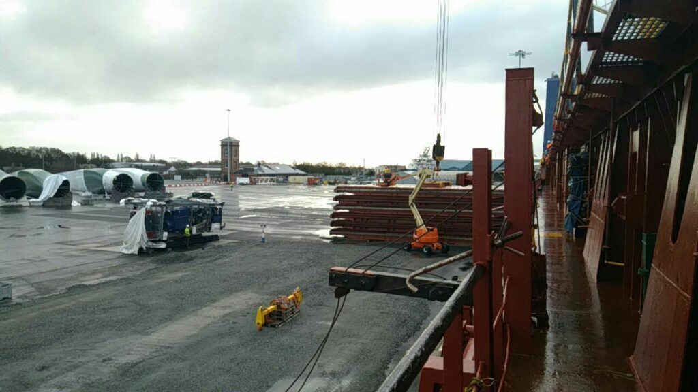
  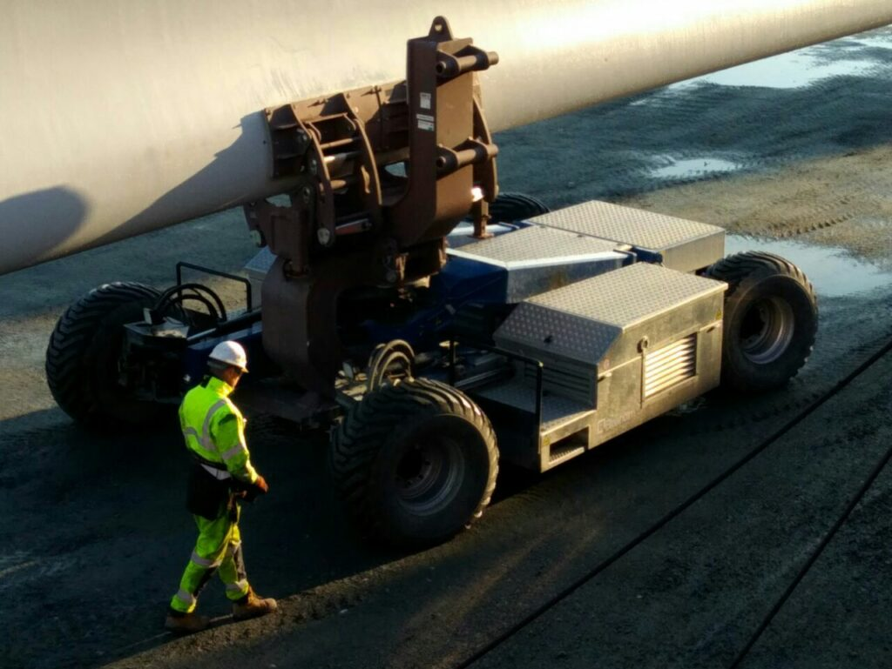
  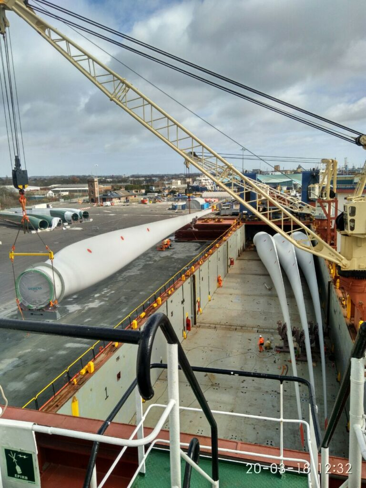
  
%%%

###### 14:40

Вот такие вот лопасти для ветряков Siemens мы грузим в трюма)

###### 20:55

Вот сейчас капитан сказал, что мы уже опаздываем в Усть-Лугу, хотя мы ещё даже не не погрузились и не выгрузились. Ммм, запах приближающейся поездки домой греет наши души^^

##### 2018.03.21 20:10

И вот я снова на вахте, завтра утром выходим из порта, погрузка закончена, так что наслаждаемся тишиной и считаем оставшиеся дни до дома)

##### 2018.03.22

###### 09:00

 В 8 утра мы отходим от причала, так что скоро мы отправимся в путь… На встречу приключениям!😂
Надеюсь их будет как можно меньше😅

###### 11:15

Все, мы вышли из дока и идём по реке Хамбер, до связи, друзья)

%%%2
  
  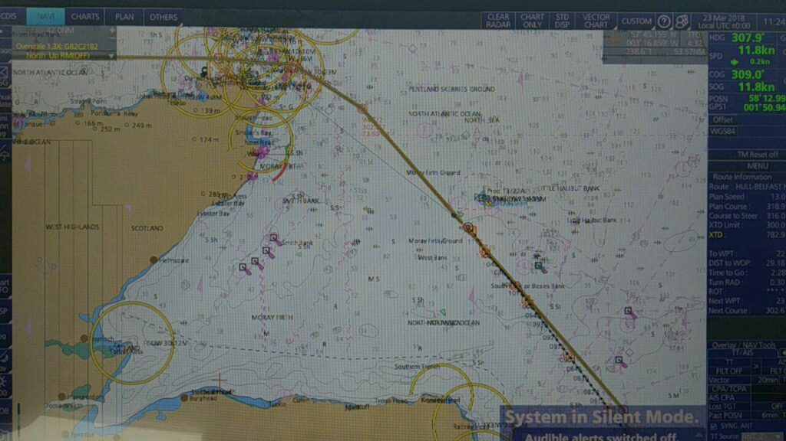
%%%

##### 2018.03.24

 Доброго утречка. Мы идём между британскими Минчами и уже сегодня к полуночи будем подходить к порту. Это самый маленький переход за этот контракт, хех.
Надеюсь нам повезет и мы быстро выгрузимся и свалим из этой Британии, а то одни нервы.
Так как погода в северном после нашего выхода из Белфаста очень скверная, есть вероятность что в сторону Луги мы будем двигаться через Довер и Киль Канал, чего впрочем не очень то и хотелось бы.

##### 2018.03.25

 Вот мы и пришвартовались...
Как же я люблю швартовки в 3 часа ночи.
Мы, помощники, снова стоим вахте у трапа, ведь чифу не хватает людей на раскрепление груза и выгрузку. И в целом мне это нравится, меньше геморроя.

%%%1
  
%%%

##### 2018.03.26

 Вот и снова мы перешвартовались, в последний раз. Скоро закроется и свалим отсюда.

UPD: На счет этой погрузки и выгрузки надо остановится и рассказать чуть подробнее, ибо, к сожалению, у меня не было времени все снимать.
У нашего судна крышки трюмов снимались кранами, так что мы подошли к причалу, и своими кранами выгрузили все крышки на берег.
После этого судно тянулось на швартовых концах вперед на около 30м. (Это когда главный двигатель не запускается, а просто часть швартовых концов натягивается гидравлическими лебедками чтобы переместится)
Далее, когда 6 лопастей было загружено в трюм, мы снова тянулись назад, чтобы закрыть крышки трюмов.
После чего снова тянулись вперед, и загрузили еще 6 лопастей на крышки трюмов.
Ну и выгрузка, соответственно, в обратном порядке.

##### 2018.03.26

 Йееей! Мы вышли из Белфаста! Вперёд, на Лугу! Мы едем домой!!!

%%%1
  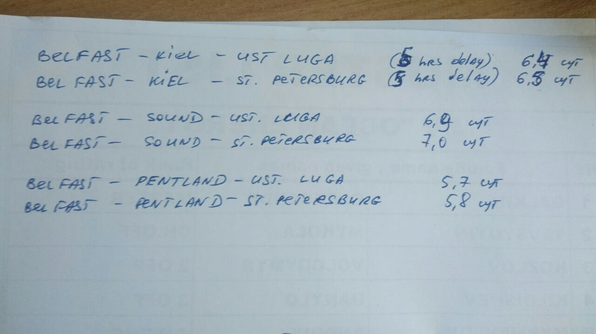
%%%

##### 2018.03.29

 Привет, мы в Германии, готовимся проходить Киль канал)

##### 2018.03.30 09:00

 Мы зашли в шлюз по темноте, так что простите, что без фоточек. А сейчас уже из него выходим, достаточно быстро все это пролетело.
В Киль канале лоцман садится на борт со своими 2мя рулевыми, а в шлюзе швартовка по схеме 1+1, короче говоря - лафа.

%%%3
  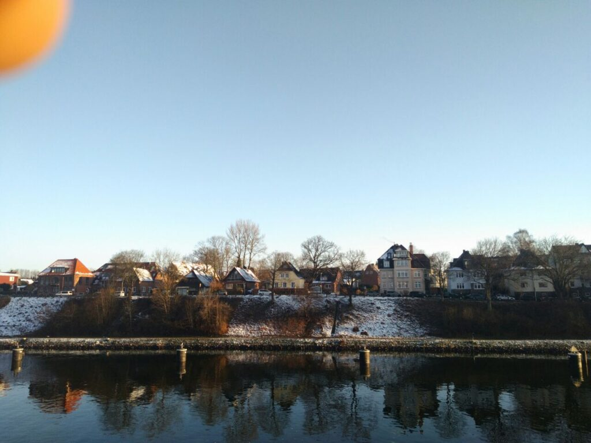
  !c2
  !r2
  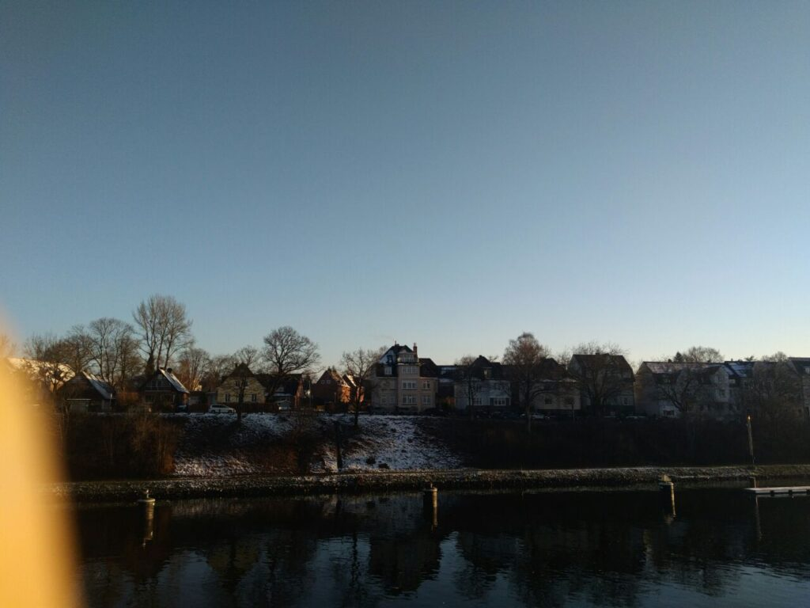
  
  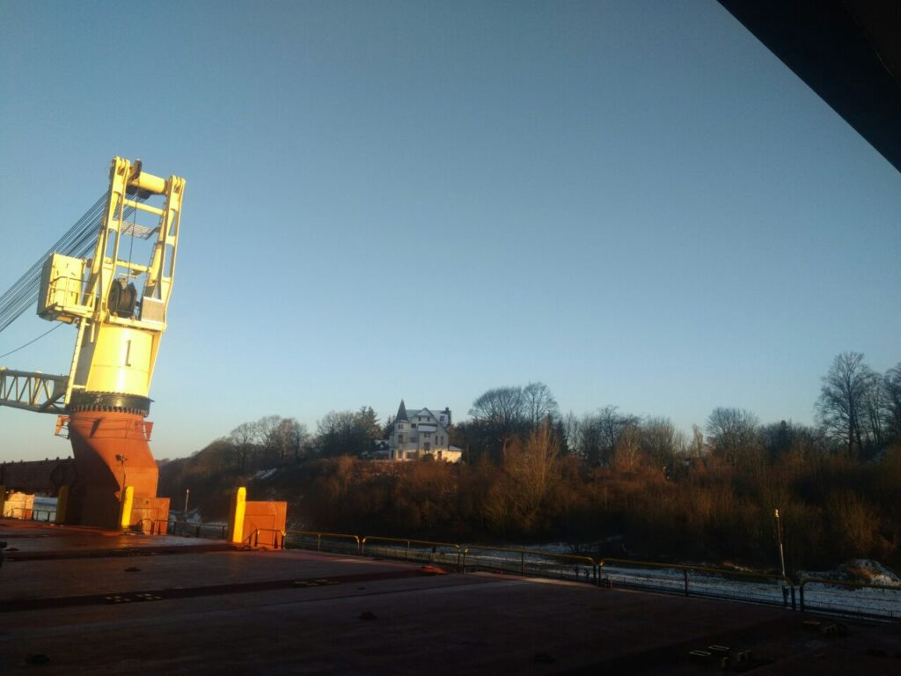
  
  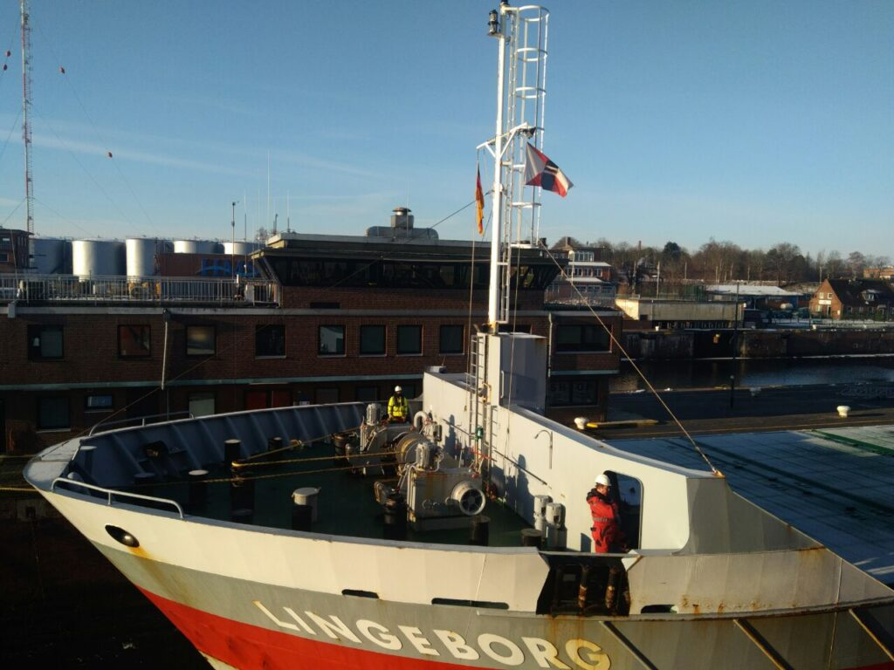
  
  
%%%

##### 2018.03.30 13:00

 Мы вышли из Киль канала, осталось три дня, и 2 апреля наше судно зайдет в Питер и мы поедем домой! УРААААА!…
Если бы только не Порт Стейт Контроль Парижского меморандума и Либерийский Флаг Стейт😭😭😭

##### 2018.04.01

 После прохождения Киля мы следуем в сторону Санкт-Петербурга. Сегодня должны выехать на автобусе сменяющие нас члены экипажа. И 03.04 утром они должны прибыть. Даже и не верится, что так скоро я окажусь дома. Сейчас я готовлюсь к смене и к проверке, надеюсь все пройдет более не менее.

##### 2018.04.02 12:30

 И вот мы на подходах к Санкт-Петербургу. Неужели мы скоро окажемся дома? Не верится вообще.

%%%3
  
  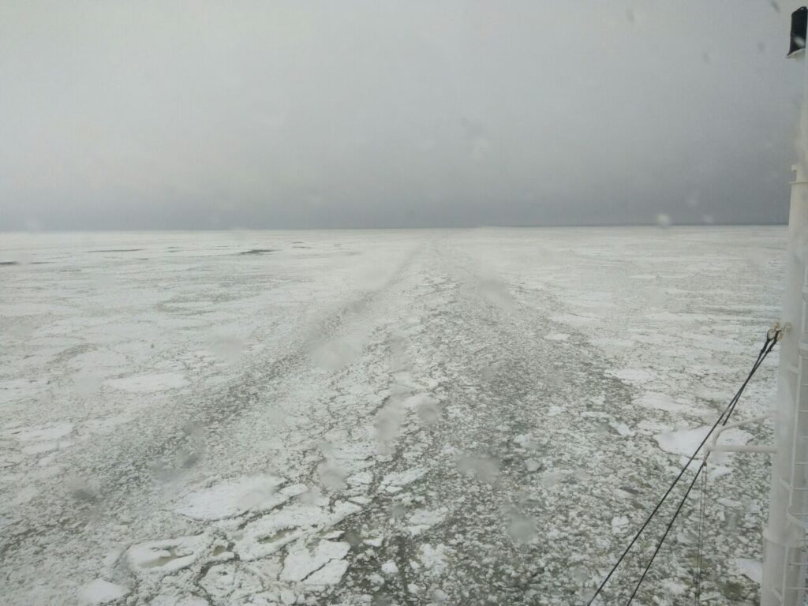
  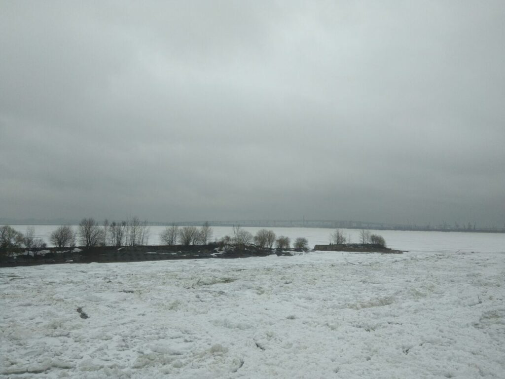
  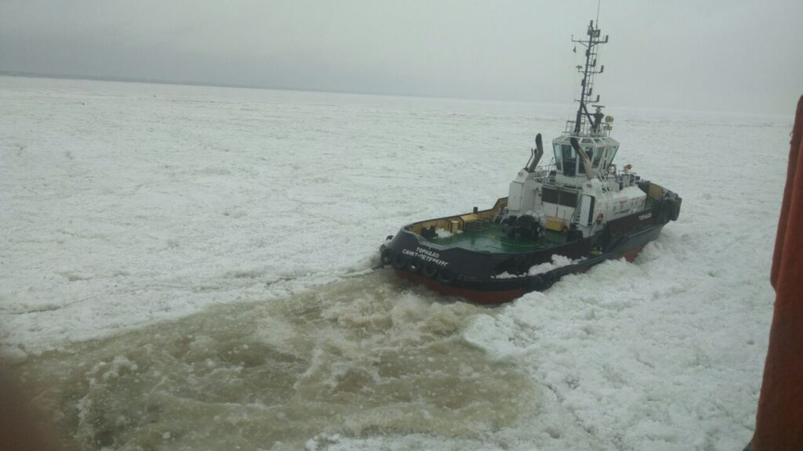
  !c2
%%%

##### 2018.04.02 17:00

 Итак, наш теплоход ошвартован в порту Санкт-Петербург. Швартовка была долгой, в сложных ледовых условиях, но мы справились с этим. Сейчас почти у всех на борту чемоданное настроение. Очень ждём, чтобы поскорее отправится в наше путешествие в сторону дома.

%%%1
  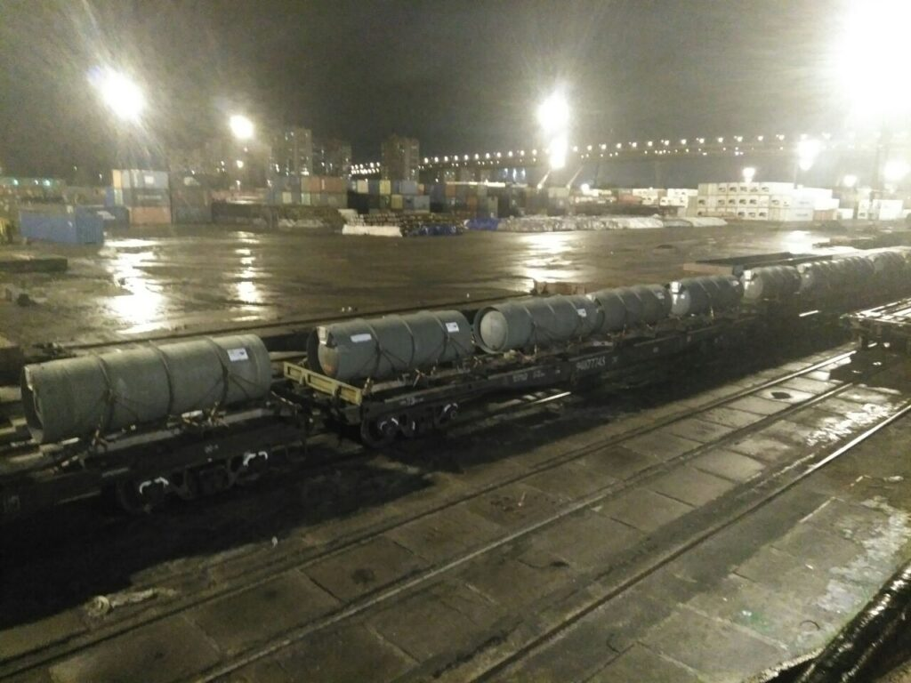
%%%

##### 2018.04.03

 Бодрого утра, добрые люди)
Вчера я узнал преприятнейшую новость о том что PSC к нам не придет из-за состояния машинного отделения, где сейчас все разбирается и чиниться ремонтниками. Радостно ли мне? Более чем!

##### 2018.04.04

###### 02:10

 PSC минул нас стороной, я подписал акт приемо-передачи вместе с 3им, капитаны тоже уже сменились. Так что мы уже свободны. В 07:30 за нами прибудут, чтобы везти на автобус. Вся палубная команда в отеле, а штурмана, как таджики, по диванам в столовой спят, ничего нового. Ну пофиг, осталось дотерпеть пару дней и вся эта эпопея закончится. Можно сказать что пройдет целый этап жизни.

###### 11:30

 Итак,я покинул борт судна. Прошли портовую таможню и теперь ждём наш автобус. Все складывается как нельзя лучше^^

%%%1
  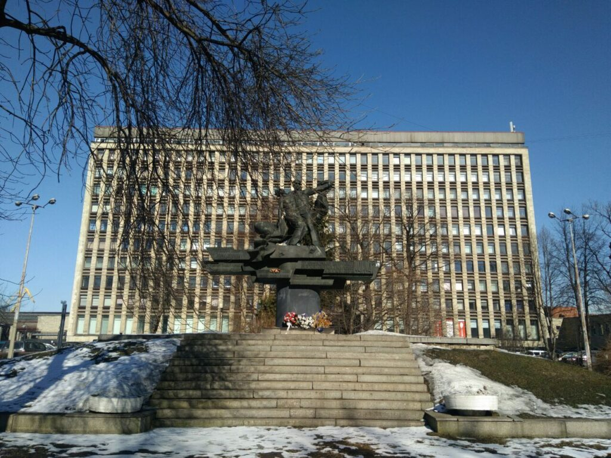
%%%

##### 2018.04.04

###### 12:10

 Всё-таки удивительно. Когда ты на судне, практически забываешь что такое берег, но сходя с него твои мозги переключаются на новый лад. На берегу и на судне ты думаешь в голове совсем по разному.

###### 12:45

 Мы сели в автобус, ура! Скоро мы отправляемся)

###### 13:15

 Вот сейчас мы приезжаем мимо заводов Русского Стандарта и Кока Колы. Совпадение? Не думаю.

%%%3
  
  
  
%%%

[Три Сестры](https://ru.wikipedia.org/wiki/Три_сестры_(монумент)) — монумент на стыке границ [Беларуси](https://ru.wikipedia.org/wiki/Белоруссия), [России](https://ru.wikipedia.org/wiki/Россия) и [Украины](https://ru.wikipedia.org/wiki/Украина). Так же тут одновременно ловят операторы всех трёх стран)

##### 2018.04.09

 Спасибо всем, кто читал мой канал)
Мое путешествие подошло к концу и я немного пришел в себя, почти что чувствую себя человеком)
Ещё раз спасибо и до новых встреч)

Тут и закончился мой первый офицерский контракт.
